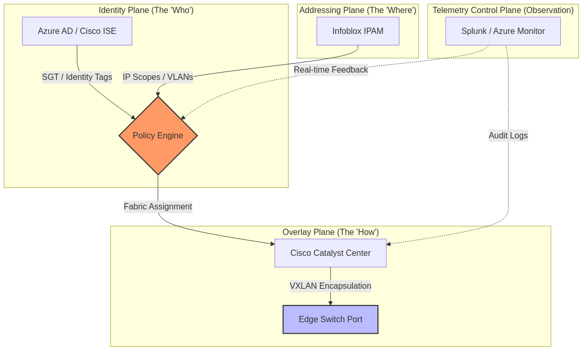

# UIAO Core — Generation Engine & Adapter Framework

[](https://github.com/WhalerMike/uiao-core/actions/workflows/ci.yml)
[](https://github.com/WhalerMike/uiao-core/actions/workflows/lint.yml)
[](https://github.com/WhalerMike/uiao-core/actions/workflows/security-scan.yml)
[](https://github.com/WhalerMike/uiao-core/actions/workflows/drift-detection.yml)
[](https://www.python.org/downloads/)
[](LICENSE)
[](#compliance-coverage)

**Repository:** `uiao-core`
**Role:** Machine-readable tooling — OSCAL generation, adapter framework, Python engine, schemas
**Classification:** CUI/FOUO

---

## What This Repository Is

`uiao-core` is the **generation engine and adapter framework** for the Unified Identity-Addressing-Overlay Architecture (UIAO). It contains:

- **Python generation engine** (`src/`) — transforms YAML definitions into OSCAL JSON, Markdown, DOCX, PPTX, and CycloneDX SBOM
- **Adapter framework** — standardized interfaces connecting vendor systems to the UIAO schema
- **JSON schemas** (`schemas/`) — validation schemas for KSI mappings, OSCAL profiles, drift detection
- **Scripts** (`scripts/`) — crosswalk validation, drift checks, pre-commit hooks, directory enforcement
- **Tests** (`tests/`) — unit and integration tests for the generation pipeline

---

## What This Repository Is NOT

> **Important:** This repository does not contain the documentation canon. The canonical `.qmd` source files, YAML data schemas, rendered HTML site, and Quarto pipeline live in **[uiao-docs](https://github.com/WhalerMike/uiao-docs)**.

| What | Where |
|------|-------|
| 20+ canonical documents (`.qmd`) | [uiao-docs](https://github.com/WhalerMike/uiao-docs) |
| YAML data schemas (30 files) | [uiao-docs/data/](https://github.com/WhalerMike/uiao-docs/tree/main/data) |
| Rendered HTML site | [whalermike.github.io/uiao-docs](https://whalermike.github.io/uiao-docs/docs/index.html) |
| OSCAL generation engine | **This repo** (`src/`) |
| Adapter framework | **This repo** (`src/adapters/`) |
| JSON validation schemas | **This repo** (`schemas/`) |
| Operational wiki | [uiao-docs wiki](https://github.com/WhalerMike/uiao-docs/wiki) |

See the [Repository Ownership & SSOT Policy](https://github.com/WhalerMike/uiao-docs/wiki/Repository-Ownership-and-SSOT-Policy) for the full ownership table.

---

## Compliance Coverage

| Metric | Value | Notes |
|--------|-------|-------|
| **Granular Controls** | **247** | 163 base controls + 84 enhancements |
| **Parameter Coverage** | **86.7%** | Organization-defined parameters populated |
| **KSI Rules** | **0%** | Key Security Indicator mapping — next major task |
| **Implementation Statements** | **27.4%** | Controls with implementation narratives |

Target: **FedRAMP Moderate Rev 5** baseline with 20x Phase 2 alignment (machine-readable evidence, continuous monitoring, KSI mapping).

---

## Architecture

```
                    ┌─────────────────────────────────┐
                    │       generation-inputs/         │
                    │  (diagrams, briefing, pitch,     │
                    │   plan YAML definitions)         │
                    └───────────────┬─────────────────┘
                                    │
                    ┌───────────────▼─────────────────┐
                    │        src/uiao_core/            │
                    │                                  │
                    │  cli/          → Typer CLI       │
                    │  generators/   → OSCAL, SSP,     │
                    │                  POA&M, DOCX,    │
                    │                  PPTX, SBOM      │
                    │  adapters/     → Vendor systems  │
                    │  collectors/   → Entra, Infoblox,│
                    │                  SD-WAN           │
                    │  evidence/     → Bundler, linker │
                    │  validators/   → Schema, drift   │
                    │  models/       → Pydantic models │
                    │  monitoring/   → Telemetry       │
                    └──┬──────────┬──────────┬────────┘
                       │          │          │
              ┌────────▼──┐ ┌────▼────┐ ┌───▼──────────┐
              │ exports/   │ │ assets/ │ │ reports/      │
              │ oscal/     │ │ images/ │ │ drift-report  │
              │ docx/      │ │ mermaid/│ │ .json         │
              │ pptx/      │ │         │ │               │
              └────────────┘ └─────────┘ └───────────────┘
```

<!-- TODO: Replace with rendered architecture diagram once available -->
<!--  -->

### Diagram Pipeline

`generation-inputs/diagrams.yaml` is the single source of truth for all Mermaid diagrams:

```
generation-inputs/diagrams.yaml
    └─ generate_diagrams_from_canon()
           ├─ writes visuals/<key>.mermaid
           └─ render_mermaid_file() → assets/images/mermaid/<key>.png
                                            └─ embedded in DOCX / PPTX
```

### Vendor Adapters (Big 7)

Standardized interfaces in `data/vendor-overlays/` connecting to the UIAO schema:

| Vendor | Integration |
|--------|-------------|
| Microsoft Entra ID | Identity provider, conditional access |
| Infoblox | DDI, IP address management |
| Cisco ISE / SD-WAN | Network access, overlay fabric |
| Palo Alto | Next-gen firewall, Prisma |
| CyberArk | Privileged access management |
| ServiceNow | ITSM, CMDB, workflow automation |
| SentinelOne / Sentinel | EDR, SIEM telemetry |

---

## Repository Structure

```
uiao-core/
├── src/                    # Python generation engine (uiao_core package)
│   └── uiao_core/
│       ├── cli/            # Typer CLI app & subcommands
│       ├── generators/     # OSCAL, SSP, POA&M, DOCX, PPTX, SBOM, diagrams
│       ├── adapters/       # Vendor system interfaces
│       ├── collectors/     # Entra, Infoblox, SD-WAN collectors
│       ├── evidence/       # Bundler, collector, linker
│       ├── validators/     # Schema and drift validators
│       ├── models/         # Pydantic models
│       └── monitoring/     # Telemetry, health checks
├── schemas/                # JSON schemas (KSI, OSCAL, drift)
├── scripts/                # Utility scripts (crosswalk, validation, hooks)
├── tests/                  # Unit and integration tests
├── generation-inputs/      # Machine-readable generation inputs (YAML)
├── data/
│   ├── control-library/    # 247 NIST control YAML files
│   └── vendor-overlays/    # Big 7 vendor integration specs
├── templates/              # Jinja2 templates for DOCX/PPTX rendering
├── visuals/                # Mermaid diagram sources
├── assets/images/mermaid/  # Rendered diagram PNGs
├── compliance/             # FedRAMP reference data
├── analytics/              # KQL alert definitions (Sentinel)
├── machine/                # Machine-consumed artifact definitions
└── .github/workflows/      # 23 CI/CD workflows
```

---

## Quick Start

```bash
# Install in development mode
pip install -e ".[dev]"

# Run tests
pytest

# Lint
ruff check --fix src/

# Type check
mypy src/uiao_core/

# CLI
uiao --version
uiao generate-ssp --canon <path> --data-dir data/ --output exports/
uiao generate-diagrams
uiao generate-docs
uiao validate <path>
```

---

## Eight Core Concepts

1. **Single Source of Truth (SSOT)** — Every claim has one authoritative origin. All other representations are pointers, not copies.
2. **Conversation as the atomic unit** — Every interaction binds identity, certificates, addressing, path, QoS, and telemetry.
3. **Identity as the root namespace** — Every IP, certificate, subnet, policy, and telemetry event derives from identity.
4. **Deterministic addressing** — Addressing is identity-derived and policy-driven.
5. **Certificate-anchored overlay** — mTLS anchors tunnels, services, and trust relationships.
6. **Telemetry as control** — Telemetry is a real-time control input, not passive reporting.
7. **Embedded governance and automation** — Governance is executed through orchestrated workflows.
8. **Public service first** — Citizen experience, accessibility, and privacy are top-level design constraints.

---

## Roadmap

### Completed

- [x] Expand control library to full FedRAMP Moderate baseline (247 controls)
- [x] 86.7% organization-defined parameter coverage
- [x] Automated diagram generation pipeline (Mermaid + Gemini)
- [x] OSCAL 1.3.0 component definition, SSP skeleton, POA&M generation
- [x] CycloneDX SBOM generation in CI
- [x] Vendor adapter framework (Big 7 integrations)
- [x] Drift detection and reporting pipeline
- [x] GPG signature verification workflow

### In Progress

- [ ] Full SSP control narrative templating with implementation statements (27.4% → 100%)
- [ ] KSI (Key Security Indicator) rule mapping (0% → target coverage)
- [ ] `uiao generate-briefing` command (daily dashboard document)
- [ ] Evidence collection & linking via OSCAL back-matter
- [ ] Realistic POA&M generation from telemetry events

### Planned

- [ ] Remaining parameter coverage (86.7% → 100%)
- [ ] Continuous monitoring hooks with live telemetry
- [ ] Migration to GitHub Enterprise-ready pipeline
- [ ] Expanded validation-targets (failure injection, high-volume telemetry, scan imports)
- [ ] FedRAMP 20x Phase 2 full alignment

---

## Intentional Exceptions

| Item | Why It's Here |
|------|---------------|
| `_quarto.yml` | Simplified stub kept for local generation script testing. The canonical Quarto pipeline lives in [uiao-docs](https://github.com/WhalerMike/uiao-docs). |
| `generation-inputs/` | Machine-readable YAML definitions (diagram specs, visual manifest, pitch deck data, project plan data) that drive the Python generation engine in `src/`. These are inputs to code, not human-readable documentation. |

---

## License

[Apache License 2.0](LICENSE)
