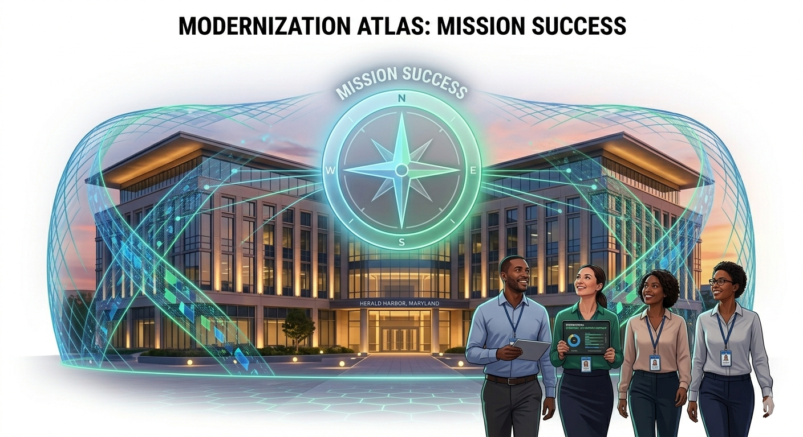

# UIAO-Core Diagram Standards

> **Canon Document** | Version 1.0 | April 2026
> **Owner:** UIAO Architecture Team
> **Status:** Active

---

## 1. Purpose

This document defines the authoritative standard for diagram generation, rendering, and insertion across the UIAO-Core repository. It eliminates ambiguity between the two diagram pipelines (Gemini Imagen and PlantUML) by establishing explicit routing rules, ownership boundaries, and insertion conventions.

## 2. Pipeline Architecture

UIAO-Core uses a **Structured Hybrid** diagram pipeline:

| Pipeline | Renderer | Scope | Output Path | Trigger |
|---|---|---|---|---|
| **Gemini Imagen 4.0** | AI-generated (Imagen API) | Architecture diagrams in `src/templates/` | `assets/generated_diagrams/` | `deploy.yml` |
| **PlantUML** | Deterministic (mmdc) | All other diagrams repo-wide | `assets/images/mermaid/` | `render-and-insert-diagrams.yml` |

### 2.1 Execution Order

1. `render-and-insert-diagrams.yml` runs first (PlantUML)
2. `deploy.yml` runs second (Gemini Imagen), gated by `needs: render-and-insert`
3. No file is ever processed by both pipelines

## 3. Routing Rules

### 3.1 Owner Tag (Authoritative Gate)

Any Markdown file may declare its diagram owner via YAML frontmatter:

```yaml
---
diagram-owner: gemini   # or: mermaid (default)
---
```

- Files tagged `diagram-owner: gemini` are **skipped** by the PlantUML workflow
- Files tagged `diagram-owner: mermaid` (or untagged) are **skipped** by the Gemini pipeline
- The owner tag is the authoritative routing gate

### 3.2 Folder-Based Routing (Fallback)

When no owner tag is present, routing follows folder conventions:

| Folder | Default Owner | Rationale |
|---|---|---|
| `src/templates/` | Gemini | Architecture docs for ATO/FedRAMP packages |
| `uiao-docs/docs/` | PlantUML | Operational and reference documentation |
| `canon/` | PlantUML | Canonical compliance specifications |
| `templates/` | PlantUML | Jinja2 template sources |
| `visuals/` | PlantUML | Standalone `.mermaid` source files |

### 3.3 YAML Catalog Routing

Diagrams defined in YAML catalogs are always owned by PlantUML:

- `data/diagrams.yml` -- PlantUML renders all entries
- `canon/diagrams.yaml` -- PlantUML renders all entries

## 4. Diagram Types and Ownership

### 4.1 Decision Matrix

| Diagram Type | Owner | Rationale |
|---|---|---|
| System architecture (UIAO overlay, data flow) | Gemini | High-fidelity FedRAMP blueprint aesthetic |
| Authorization boundary | Gemini | ATO package requirement, must be polished |
| Control plane architecture | Gemini | Leadership briefing quality |
| Flowcharts (operational, incident, lifecycle) | PlantUML | Deterministic, auditable, source-preserved |
| Sequence diagrams (API, auth, integration) | PlantUML | Precision matters more than aesthetics |
| Gantt charts (roadmaps, timelines) | PlantUML | Native Mermaid type |
| State diagrams (identity lifecycle, trust) | PlantUML | Deterministic rendering required |
| Compliance control mappings | PlantUML | Must match YAML catalog exactly |

## 5. Insertion Conventions

### 5.1 Mermaid Code Blocks (in Markdown)

PlantUML replaces fenced mermaid blocks with:
1. A PNG image reference
2. A collapsible `<details>` block preserving the source

### 5.2 YAML Catalog Keys

Use HTML comments in Markdown to reference catalog diagrams:

```markdown
<!-- diagram:enforcement_pipeline -->
```

The PlantUML workflow replaces these with rendered PNGs.

### 5.3 Visual File References

Reference standalone visual files from `visuals/`:

```markdown

```

### 5.4 Gemini-Generated Diagrams

Gemini writes processed Markdown to `build/templates/` (not in-place). Source files in `src/templates/` are never modified. Pandoc compiles from the build directory.

## 6. Style Standards

### 6.1 Gemini Imagen Style Guide

- White background (mandatory)
- No shadows, gradients, or 3D effects
- Clean black lines, sans-serif labeling
- Blueprint aesthetic suitable for FedRAMP specifications
- Centered, balanced composition with clear whitespace

### 6.2 PlantUML Style

- White background (`-b white`)
- Resolution: 2048×1536 minimum (`-s 2` scale factor)
- **Canonical theme: `neutral`** — `MERMAID_THEME` in
  `src/uiao_core/generators/mermaid.py` is the single source of truth.
  `data/mermaid-config.json` and `_quarto.yml` (`mermaid.theme`) must both
  reflect this value.  When changing the theme, update the constant first,
  then update the two config files to match.  The ``mmdc`` backend passes the
  config via `--configFile data/mermaid-config.json`; the Playwright fallback
  reads `MERMAID_THEME` directly.  Do not override the theme in individual
  diagram files or downstream configs.

## 7. Output Paths

| Pipeline | Output Directory | Naming Convention |
|---|---|---|
| Gemini Imagen | `assets/generated_diagrams/` | `diagram_{uuid8}.png` |
| PlantUML (standalone) | `assets/images/mermaid/` | `{source_stem}.png` |
| PlantUML (YAML catalog) | `assets/images/mermaid/` | `{yaml_key}.png` |

## 8. Conflict Prevention

1. **No dual processing**: The owner tag and folder routing ensure no file is touched by both pipelines
2. **Serialized execution**: `deploy.yml` depends on `render-and-insert-diagrams.yml`
3. **Separate output paths**: Gemini and Mermaid never write to the same directory
4. **Source preservation**: Gemini writes to `build/`, Mermaid preserves source in `<details>` blocks

## 9. Notes

- `src/templates/` contains initial architecture documents: `system-architecture.md`, `authorization-boundary.md`, and `control-plane-architecture.md`
- Existing `.mermaid` files in `visuals/` are exclusively PlantUML owned
- Existing Gemini-generated PNGs in `visuals/` (e.g., `cyberark_identity_vault.png`) are static assets, not pipeline outputs

---

**Changelog:**
- v1.0 (April 2026): Initial standard establishing structured hybrid pipeline
