# UIAO Architecture Diagram Review (Temporary File)

---

## Diagram 1: UIAO Logic Flow (Data-Driven Architecture)

**Purpose:** Visualize the transition from static docs to the single source of truth.

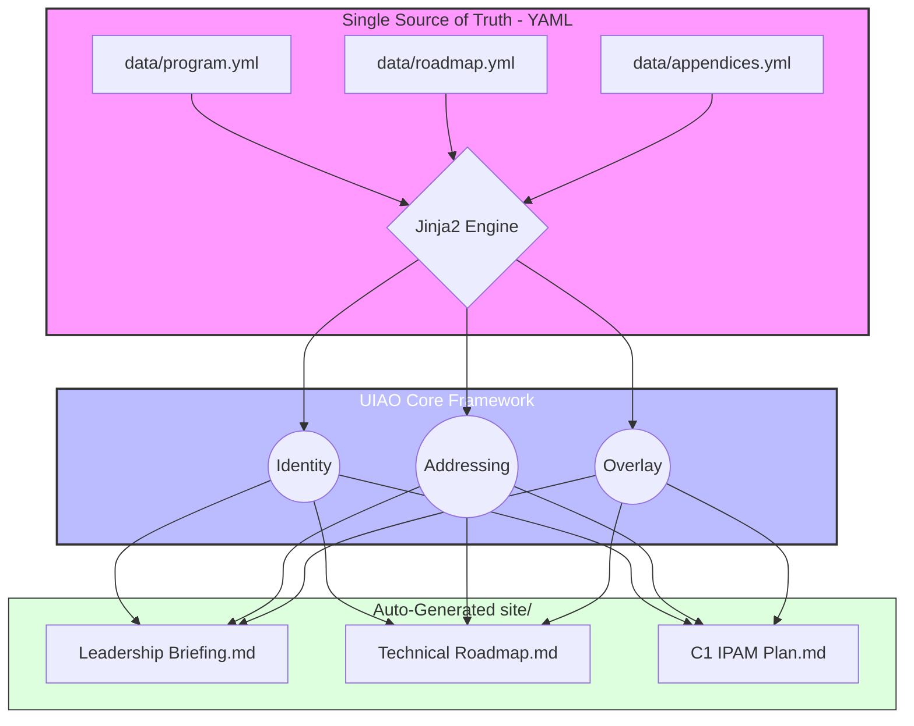

---

## Diagram 2: High-Level Core Stack Integration

**Purpose:** Maps specific vendors (Catalyst, INR, Infoblox) to the UIAO pillars.

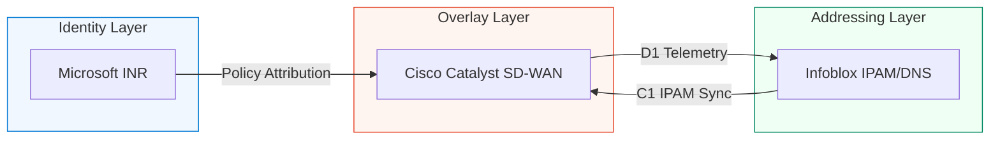

---

## Diagram 3: Identity-to-Packet Lifecycle (Sequence)

**Purpose:** Tracks how an identity-authenticated user is assigned an IP and routed via the SD-WAN overlay.

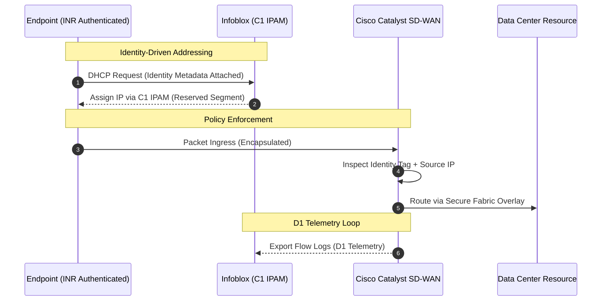

---

## Diagram 4: Modernization Workstream Roadmap (2026)

**Purpose:** GANTT visualization based on the `project-plans.yml` updates.

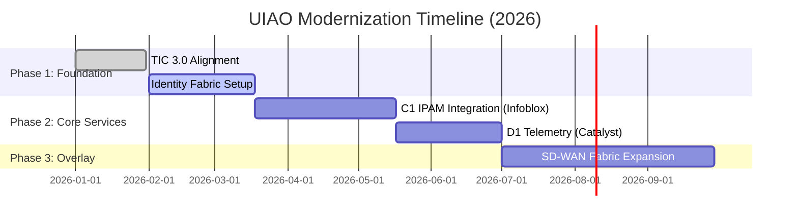

---

## Diagram 5: UIAO Conceptual Seven-Layer Model

**Purpose:** Defining the relationship between user identity and the underlay network.

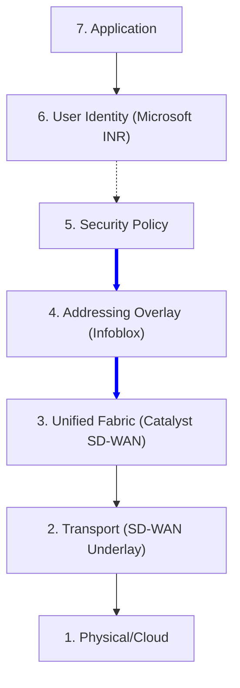

---

## Diagram 6: State Diagram — Frozen Domain Transition

**Purpose:** Modeling how a legacy, unmanaged network segment is transitioned into a managed UIAO segment.

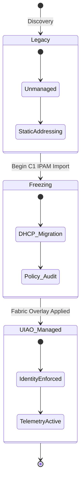

---

## Diagram 7: YAML Data Schema Relationship (data/)

**Purpose:** ER Diagram showing how the three core YAML files are structured and interlinked.

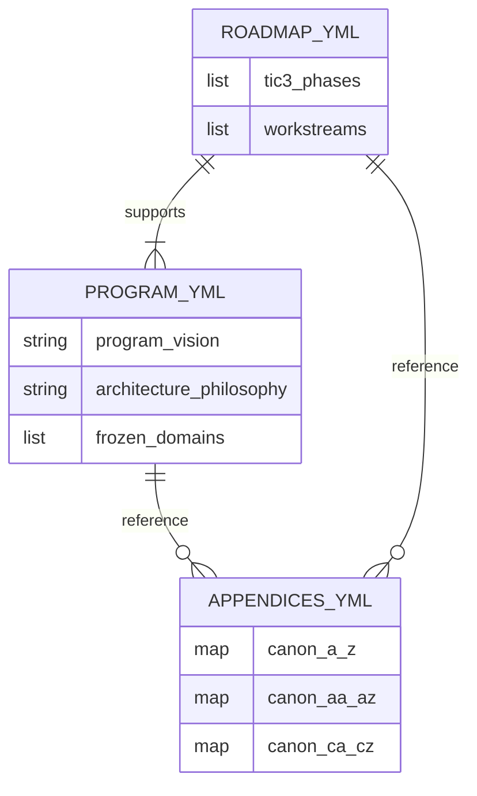

---

## Diagram 8: C1 IPAM (Infoblox) Deployment Pattern

**Purpose:** Technical architecture for integrating the Addressing layer.

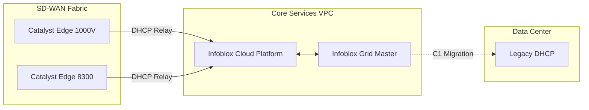

---

## Diagram 9: Component Diagram — scripts/generate.py

**Purpose:** Showing how the Python script interacts with YAML and Jinja2 templates.

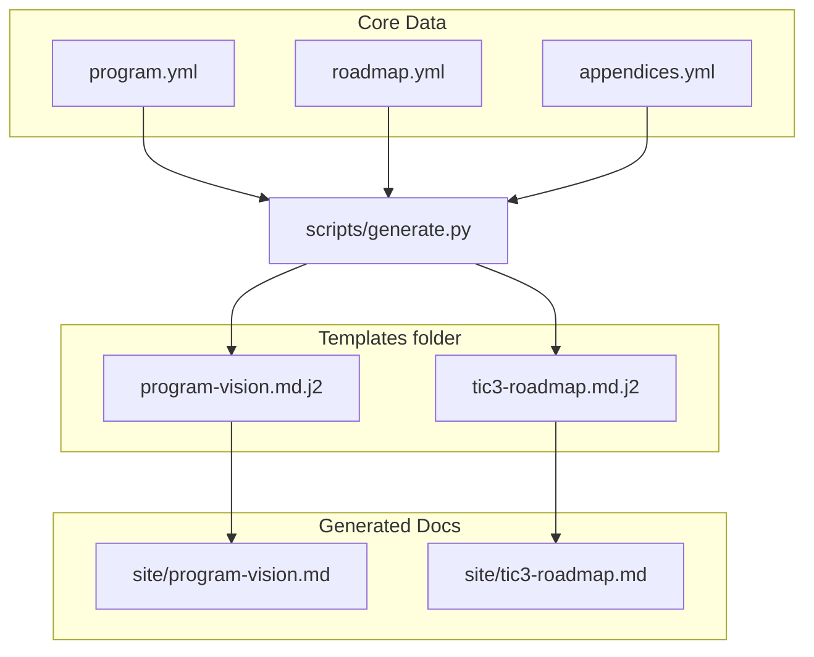

---

## Diagram 10: Appendix Canon Family Mapping (Class Diagram)

**Purpose:** Categorizing the 104-appendix canon defined in `appendices.yml`.

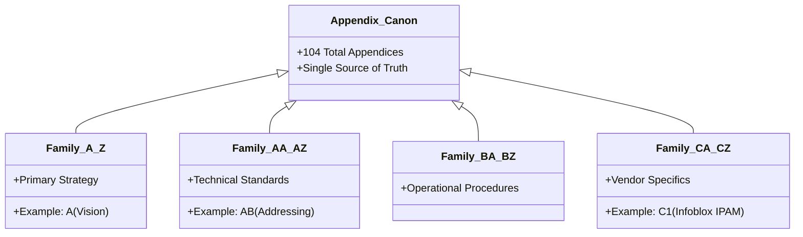

---

## Diagram 11: D1 Telemetry Flow (Catalyst to Infoblox)

**Purpose:** Detailed flow of the operational telemetry loop.

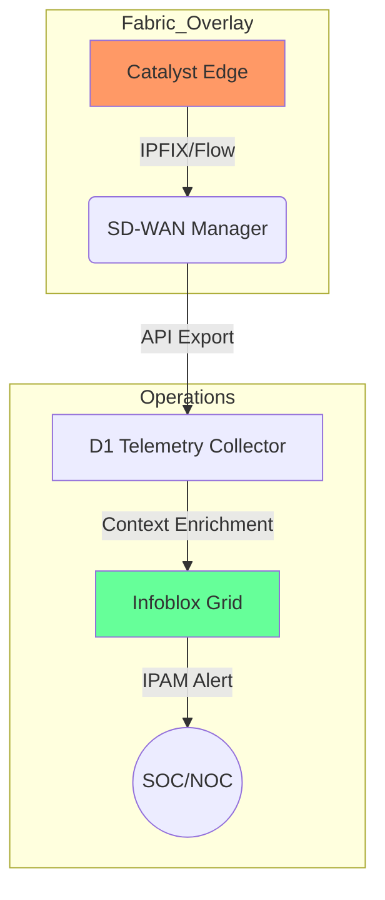

---

## Diagram 12: GitHub Actions Workflow (Doc-as-Code)

**Purpose:** Visualizing the CI/CD pipeline that builds the documentation.

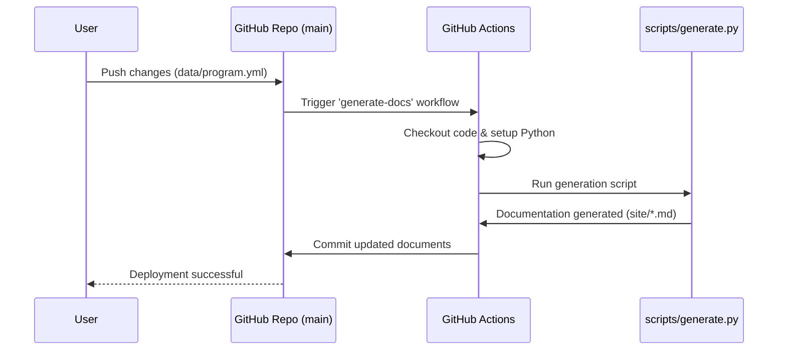
