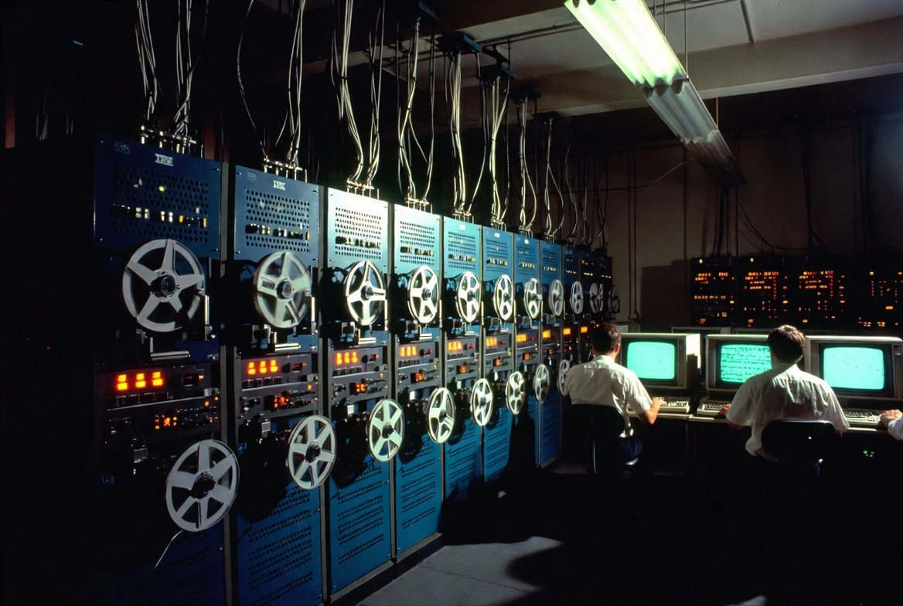
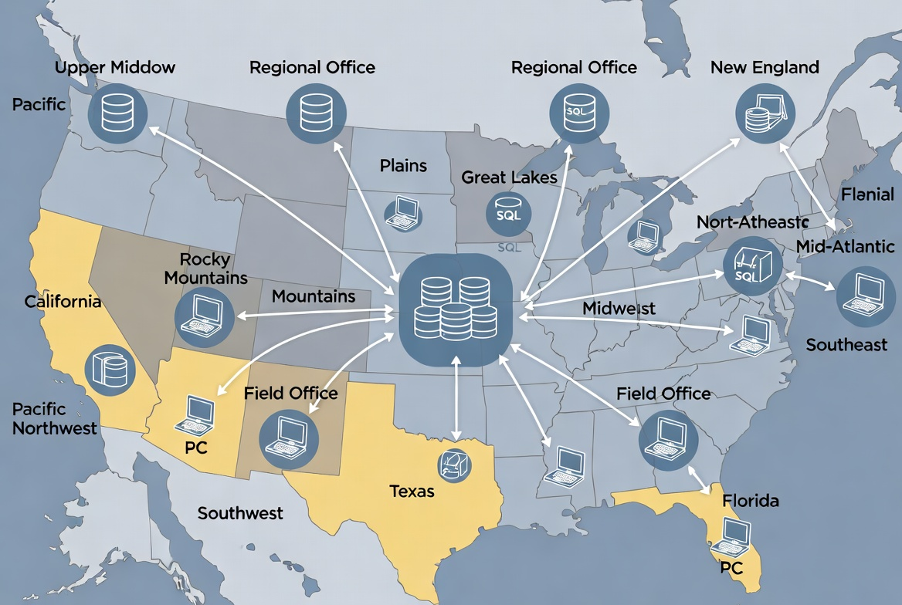
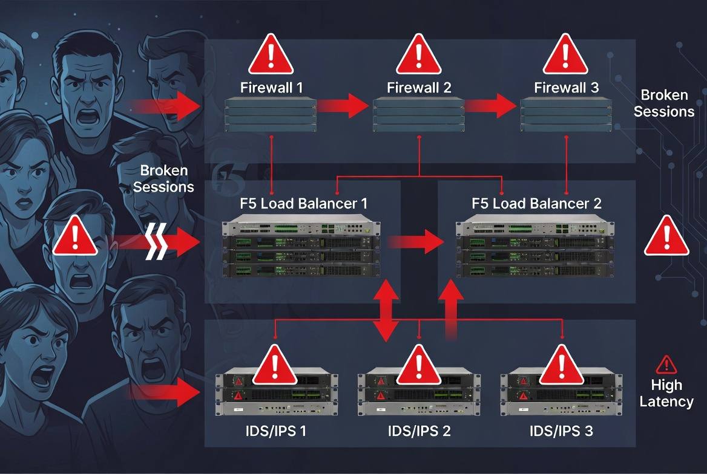
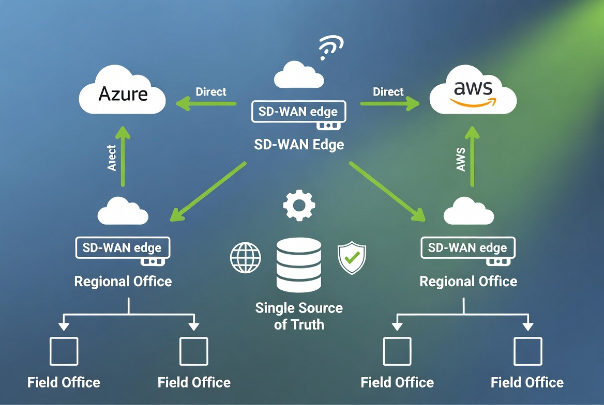
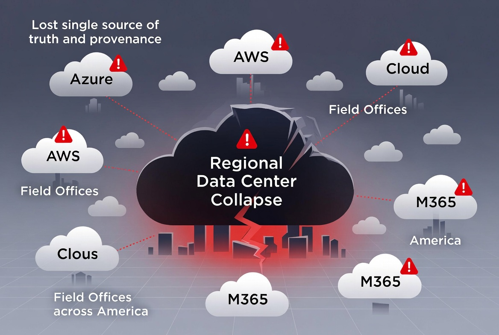

# The Hidden Cost of Progress {.unnumbered}

::: {.callout-note}
## A talk in four acts

Imagine a world where we don't just *hope* the data is correct — we *know* it is.
This is an 18–22 minute talk tracing how a federal agency lost that certainty across
four decades of architecture, and the four-pillar path back to it — told in spoken,
slide-driven form.

📄 **[Full talk script →](script.qmd)**
:::

## The arc in four images

Every stage of this journey made sense in isolation. Together, they cost us truth.

{fig-alt="A 1970s mainframe room with rows of IBM cabinets, spinning tape reels, and operators at green CRT terminals."}

{fig-alt="A US map showing regional SQL Server databases connected to a central data store, with twelve regions labeled."}

{fig-alt="A layered security stack of firewalls, F5 load balancers, and IDS/IPS appliances with frustrated users and 'Broken Sessions / High Latency' callouts."}

{fig-alt="A future-state diagram: an SD-WAN edge connecting regional and field offices directly to Azure and AWS, with a central Single Source of Truth database."}

## The breaking point (2025–2026)

Compute scattered across Azure, AWS, and M365 while the regional Active Directory
forest and session-based assumptions stayed rooted in the early 2000s. The
fragmentation that made the system agile in 1995 became the hiding place for
systemic fraud — and we realized we no longer knew what was true.

{fig-alt="A cracked regional-data-center cloud surrounded by Azure, AWS, and M365 clouds with red warning markers and 'Lost single source of truth and provenance' text."}

## The four pillars of the way forward

We cannot patch our way out of this. We must rebuild the foundation.

1. **Restore Single Source of Truth** — Collapse the regional SQL silos into one
   unified, auditable model. Not erasing regional autonomy — making it transparent
   and traceable back to policy. Cryptographically verifiable across the enterprise.
2. **Application-Aware Networking and Cybersecurity** — Tools that understand
   *application intent*, not just packets. Every request leaves a cryptographically
   signed trail — a full chain of custody, so fraud has nowhere to hide.
3. **Token-Based Identity with OrgPath** — Kerberos assumed the client and server
   were in the same room; tokens assume they're strangers on the Internet. Move to
   Entra ID, with every token carrying an OrgPath claim that defines authorization
   regardless of physical location.
4. **Intelligent SD-WAN Mesh** — Stop routing everything through regional data
   centers that are now empty. Every office gets a secure, direct on-ramp to the
   cloud and consolidated data centers.

> This is not just technical modernization. This is restoring the soul of our
> systems — the ability to *know what is true*.

## The deck

The talk runs as twelve slides over roughly 20 minutes. Pause 4–6 seconds after each
act for the visual to land.

| # | Slide | Timing | Visual |
|---|-------|--------|--------|
| 1 | Title | 0:00–0:15 | — |
| 2 | Opening Hook | 0:15–1:00 | Mainframe room |
| 3 | Mainframe Era (1940s–1990s) | 1:00–2:00 | Mainframe room |
| 4 | Act 1 — The Great Decentralization | 2:00–6:00 | Client-server map |
| 5 | Act 2 — When Security Ate the Architecture | 6:00–10:00 | Broken-session stack |
| 6 | Act 3 — The Cloud Collision | 10:00–13:00 | Cloud collision |
| 7 | The Breaking Point (2025–2026) | 13:00–14:00 | Lost provenance map |
| 8 | Act 4 — The Way Forward | 14:00–16:00 | Future-state mesh |
| 9 | The Four Pillars | 16:00–18:30 | — |
| 10 | The New Architecture | 18:30–19:30 | Future-state mesh |
| 11 | Call to Action | 19:30–20:30 | Future-state mesh |
| 12 | Thank You + Q&A | 20:30–end | — |

📄 Read the **[full talk script](script.qmd)** for the complete narration.
