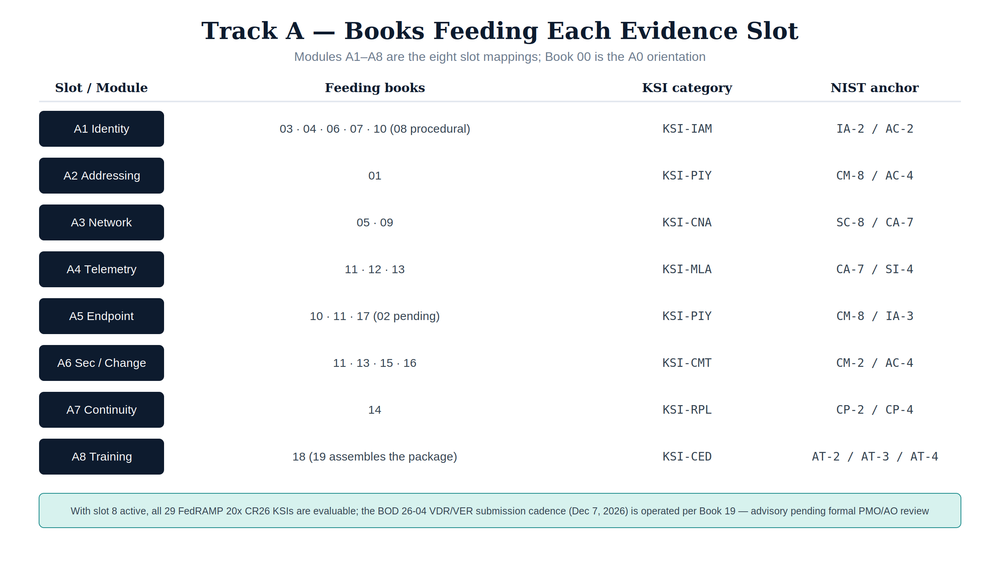

> Part of the [AAN Training Program](index.html) — **companion material for
> the federal AAN book series, not part of UIAO.** UIAO tooling appears here
> only because its conformance adapter consumes the books' evidence.

**Audience:** ISSOs / ISSMs, 3PAO assessors, ConMon operators, compliance
leads.
**Prerequisite:** none beyond orientation; product-level skills are optional
here (they are Track B's job).
**Backbone:** the eight evidence-slot mappings in
[`fedramp_aan_catalog/mappings/`](https://github.com/WhalerMike/uiao/tree/main/src/uiao/adapters/fedramp_aan_catalog/mappings)
— each module below is one slot, taught from the same YAML the conformance
pipeline evaluates.

## How to read this track

Each module gives you four things:

1. **Read** — the AAN book(s) bound to the slot.
2. **Controls** — the NIST SP 800-53 Rev 5 anchor controls the slot closes.
3. **Evaluate** — the FedRAMP 20x KSI category that scores the closure.
4. **Checkpoint** — a concrete artifact or CLI run proving you can trace
   book → control → KSI → evidence.

Run the pipeline pieces as you go:

```bash
# Plane 2: evaluate an IR file against the KSI rules
uiao ksi evaluate --ir ./output/ir/tenant.ir.json --out ./output/ksi/tenant.ksi.json

# Assessment Results from the AAN slot evidence bindings
# (per-KSI satisfied / not-satisfied / not-evaluated verdicts)
uiao oscal ksi-ar --output exports/oscal/ksi-ar.json

# POA&M + SSP from an evidence bundle
uiao oscal generate --help
```

{fig-alt="Track A matrix: which books feed each of the eight evidence slots"}

## Module A0 — Orientation: the compliance shape of the corpus {#module-a0-orientation-the-compliance-shape-of-the-corpus}

- **Read:** Book 00 (Executive Summary) and the
  [Federal AAN / ConMon Compliance Gap Roadmap](https://github.com/WhalerMike/uiao/blob/main/inbox/Application%20Aware%20Networking/federal-aan-conmon-gap-roadmap.md).
- **Learn:** the FedRAMP 20x timeline (Class A window opened August 2026;
  20x mandatory for new authorizations January 2027), the BOD 26-04 VDR/VER
  deadline (December 7, 2026), and the split between the **evidence
  generation layer** (the books) and the **evidence governance layer** (the
  conformance adapter / OSCAL emitter).
- **Checkpoint:** write a one-page brief stating which control families the
  corpus closes today, which were structurally absent until Books 15–18
  (SR, PM, PT, AT), and how Book 19 assembles the AP/AR/POA&M package now
  that all 29 CR26 KSIs are evaluable.

## Module A1 — Identity control plane (slot 1) {#module-a1-identity-control-plane-slot-1}

- **Read:** Book 03 (Certificates, Tokens & Cryptographic Identity), Book
  04 (HRIT Identity & Organizational SSOT), Book 06 (Entra ID, ZTNA,
  Active Governance), Book 07 (SQL Server Authentication Modernization),
  Book 10 (Privileged Access Management). Book 08 is the procedural
  companion to Book 07. Books 03 and 04 both bind slot-01 by their own
  statements: Book 03 supplies the cryptographic credential layer
  (IA-5(2), SC-12/SC-17), Book 04 the authoritative lifecycle source
  (AC-2, PS-4/PS-5, IA-4).
- **Controls:** IA-2 (+enhancements 1, 2, 11), IA-5, IA-11, AC-2 (+1),
  AC-3, AC-5, AC-6 family, AC-17, CA-7.
- **Evaluate:** **KSI-IAM** — anchor `IA-2 / AC-2`; evidence source:
  identity-provider sign-in and risk logs.
- **Checkpoint:** for one privileged role, trace the full chain: Book 10's
  PIM design → AC-6 enhancement it closes → KSI-IAM rule that scores it →
  the sign-in/audit log evidence the collector ingests.

## Module A2 — Addressing control plane (slot 2) {#module-a2-addressing-control-plane-slot-2}

- **Read:** Book 01 (SSA Landing Zone, IPAM & FedRAMP) — Infoblox DDI:
  IPAM, DNS, DHCP, PKI.
- **Controls:** CM-8, AC-4 anchors; Book 01 closes 16 controls per the gap
  roadmap.
- **Evaluate:** **KSI-PIY** (addressing inventory evidence).
- **Checkpoint:** produce the address-inventory evidence statement: what the
  DDI platform attests (authoritative IPAM inventory), which CM-8
  requirements that satisfies, and where the evidence lands in the slot-02
  mapping.

## Module A3 — Network control plane (slot 3) {#module-a3-network-control-plane-slot-3}

- **Read:** Book 05 (Network Modernization — SD-WAN, SASE, UC) and Book 09
  (Database Consolidation & Network Physics).
- **Controls:** SC-8, CA-7 anchors; SC/SI depth from Book 09.
- **Evaluate:** **KSI-CNA** (network architecture evidence).
- **Checkpoint:** map one application-aware path policy (SD-WAN/SASE) to
  SC-8 transmission protection and show which continuous-monitoring signal
  (CA-7) proves it stays enforced.

## Module A4 — Telemetry control plane (slot 4) {#module-a4-telemetry-control-plane-slot-4}

- **Read:** Book 11 (Vulnerability Management — Defender VM + KEV), Book 12
  (Data Protection — Purview + Key Vault CMK), Book 13 (SIEM / XDR
  Detection — Sentinel).
- **Controls:** CA-7, SI-4 anchors; RA-5 family, SI-2, AU-6/7/8/11, IR-4/6/8.
- **Evaluate:** **KSI-MLA** (monitoring / logging / audit evidence).
- **Checkpoint:** pick one KEV-listed CVE scenario and trace: Defender VM
  finding (Book 11) → Sentinel analytic + incident (Book 13) → the SI-4 /
  RA-5 closure statement, with the audit-retention argument from AU-11.

## Module A5 — Endpoint control plane (slot 5) {#module-a5-endpoint-control-plane-slot-5}

- **Read:** Book 02 (Network Access Control — 802.1X), Book 10 (PAW
  sections), Book 11 (endpoint assessment surface), Book 17 (PII
  Processing & Transparency). Book 02 is the device-identity-at-the-port
  surface (IA-3, CM-8); its slot binding is pending the adapter mapping
  refresh.
- **Controls:** CM-8, IA-3 anchors; PT family entry points from Book 17.
- **Evaluate:** **KSI-PIY** (endpoint inventory evidence).
- **Checkpoint:** write the endpoint-inventory evidence statement covering
  device identity (IA-3), inventory completeness (CM-8), and where
  PII-handling endpoints get the Book 17 transparency treatment.

## Module A6 — Security configuration & change control plane (slot 6) {#module-a6-security-configuration-change-control-plane-slot-6}

- **Read:** Book 11 (secure configuration surface), Book 13 (detection as
  change evidence), Book 15 (Supply Chain Risk Management), Book 16
  (Program Management & Governance).
- **Controls:** CM-2, AC-4 anchors; SR-1/2/3/5/6/8/10/11 from Book 15; PM
  family from Book 16.
- **Evaluate:** **KSI-CMT** (configuration / change-management evidence);
  KSI-011–014 were activated by the Book 15 SBOM/VDR/VER evidence
  contract — the BOD 26-04 submission (December 7, 2026) remains the
  operational cadence Book 19 runs.
- **Checkpoint:** state the BOD 26-04 submission story: which SBOM artifacts
  Book 15 requires, which KSI rules they activated, and how the Book 19
  ConMon calendar keeps that evidence fresh.

## Module A7 — Continuity control plane (slot 7) {#module-a7-continuity-control-plane-slot-7}

- **Read:** Book 14 (Business Continuity).
- **Controls:** CP-2 (+3 enhancements), CP-3, CP-4 (+2), CP-6, CP-7 (+3),
  CP-8 (+2).
- **Evaluate:** **KSI-RPL** (recovery / resilience evidence).
- **Checkpoint:** map one contingency-test exercise to CP-4 and show the
  slot-07 continuity binding that carries it into the KSI evaluation.

## Module A8 — Training control plane (slot 8) {#module-a8-training-control-plane-slot-8}

- **Read:** Book 18 (Cybersecurity Training & Awareness). Book 19's
  freshness rules and ConMon calendar are the operating context.
- **Controls:** AT-2 (+1, +2), AT-3 (+3, +5), AT-4, CP-3, IR-2; SA-16 for
  secure-delivery training.
- **Evaluate:** **KSI-CED** — KSI-CED-RAT (KSI-022), the last CR26 rule to
  activate; evidence source: the machine-readable
  `training-effectiveness-record` JSON exported monthly from the LMS.
- **Checkpoint:** trace one role tier through the four training dimensions:
  the AT-3 matrix row → the completion thresholds (≥95%) → the JSON record
  fields that carry it → the KSI-022 PASS logic.

## Capstone — the eight-slot walk {#capstone-the-eight-slot-walk}

Produce a single document (or an annotated `uiao oscal ksi-ar` export) that,
for **all eight slots**:

1. names the feeding books,
2. lists the anchor controls and the closure status,
3. shows the per-KSI verdict (satisfied / not-satisfied / not-evaluated)
   from a real `uiao oscal ksi-ar` run, and
4. states the gap and its deadline for anything not-evaluated or stale
   (Book 19 defines per-slot evidence freshness rules).

That document is the Track A completion artifact — it is, deliberately, the
skeleton of a ConMon narrative an assessor could read. Score it against the
[assessment rubrics](assessment-rubrics.html): pass = every slot at level 2+,
at least three slots assessor-ready (level 3).

## Where to go deeper

- Product-level skills for the evidence sources (Entra, Sentinel, Purview,
  Defender, Infoblox): [Vendor training catalog](vendor-training-catalog.html)
  — see the *Federal & compliance* section for CISA Learning, FedRAMP PMO
  resources, and NIST NICE.
- The engineering counterpart of every module here:
  [Track B — Implementation](implementation-track.html).
