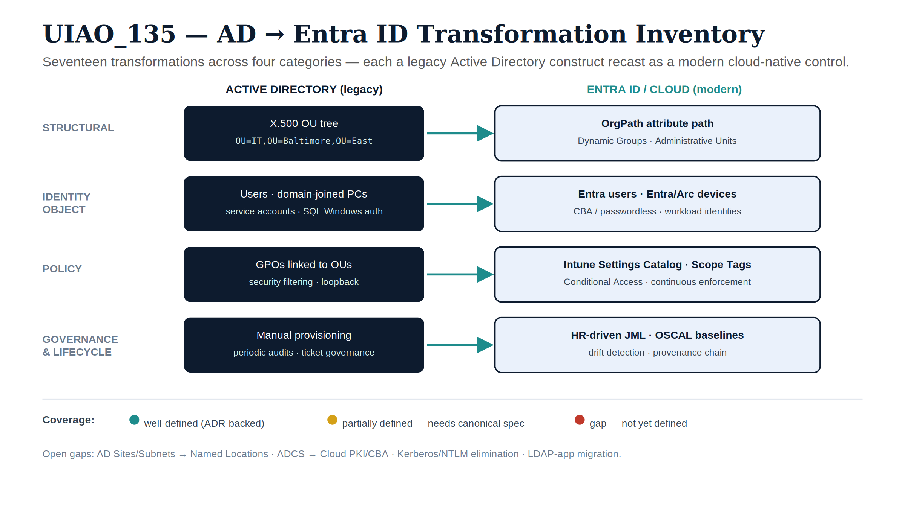

::: {.callout-note}
## Canonical UIAO Specification

**UIAO_135** — status: **Draft** — version: **0.1**

This page renders the canonical UIAO_135 source verbatim. The
authoritative source is at
[`src/uiao/canon/UIAO_135_identity-directory-transformation-inventory.md`](../../src/uiao/canon/UIAO_135_identity-directory-transformation-inventory.md).
Per [ADR-072](../adr/adr-072-canon-publication-policy.qmd), this
canonical page is generated as an `include`-style wrapper.
:::

{#fig-uiao135-inventory fig-alt="Four-lane transformation inventory mapping legacy Active Directory constructs (X.500 OU tree, domain-joined PCs, GPOs linked to OUs, manual provisioning) to modern Entra/cloud controls (OrgPath path with Dynamic Groups and Administrative Units, Entra/Arc devices, Intune Settings Catalog with Scope Tags and Conditional Access, HR-driven JML with OSCAL baselines and drift detection), with a legend marking well-defined, partially defined, and gap coverage." width="100%"}


