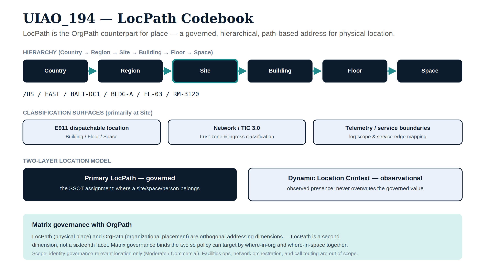

::: {.callout-note}
## Canonical UIAO Specification

**UIAO_194** — status: **Draft** — version: **1.0**

This page renders the canonical UIAO_194 source verbatim. The
authoritative source is at
[`src/uiao/canon/UIAO_194_LocPath_Codebook.md`](../../src/uiao/canon/UIAO_194_LocPath_Codebook.md).
Per [ADR-072](../adr/adr-072-canon-publication-policy.qmd), this
canonical page is generated as an `include`-style wrapper.
:::

{#fig-uiao194-locpath fig-alt="Six navy hierarchy boxes joined by teal arrows (Country, Region, Site, Building, Floor, Space) with a monospace example path; three classification-surface boxes (E911 dispatchable location, Network/TIC 3.0, telemetry/service boundaries); a two-layer model with navy governed Primary LocPath and ice observational Dynamic Location Context; and a footer on matrix governance with OrgPath, noting LocPath is a second addressing dimension, not a sixteenth facet." width="100%"}


