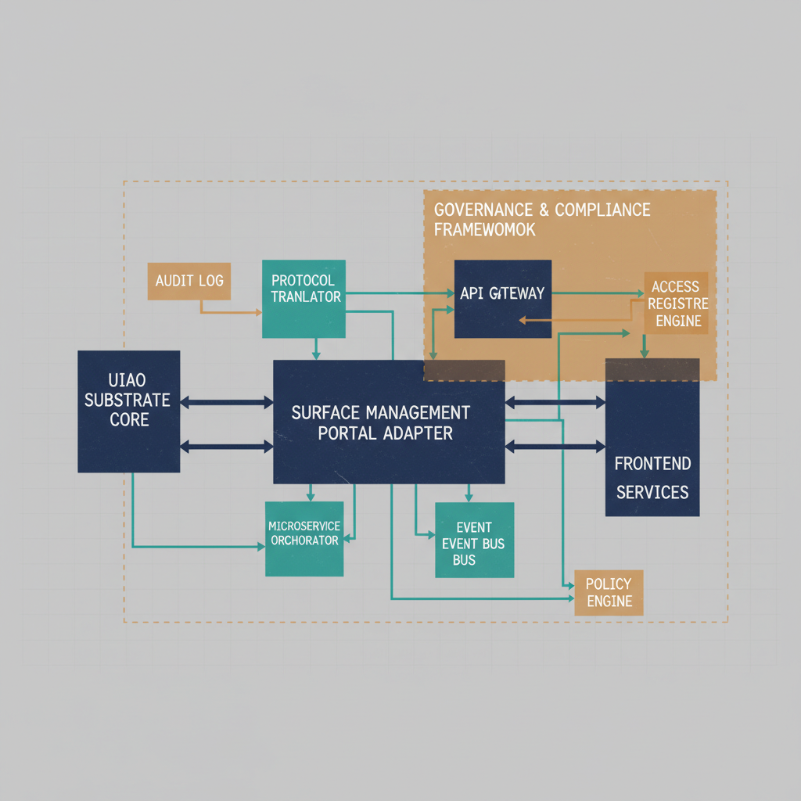

# Microsoft Surface Management Portal Fleet Telemetry Adapter — Adapter Technical Specification

{#fig-surface-management-portal-image-01 fig-alt="Surface Management Portal adapter architecture in the UIAO substrate. Engineering blueprint style, neutral slate background, federal navy (#1F3A5F) for primary structural elements, teal (#1A9E8F) for secondary/integration elements, amber (#D4A017) for governance/audit/registry overlays, monospace labels for identifiers, no human figures, 16:9 landscape." width="85%"}

::: {.callout-note}
## Canon-derived document

**Status:** `reserved` · **Class:** `conformance` · **Mission:** `telemetry` · **Phase:** `phase-planning`

**Canon source:** `canon/adapter-registry.yaml` (propagated by `uiao/tools/sync_canon.py`).

The YAML frontmatter and this banner are regenerated from canon on every sync. **Do not hand-edit.** Author new material only below the `## Overview` heading.
:::

## Overview

The Microsoft Surface Management Portal (SMP) Fleet Telemetry Adapter is the **first-party Surface-hardware telemetry edge** of the UIAO substrate. As a conformance-class telemetry adapter, it observes Surface-specific fleet state — firmware versions across the fleet, DFCI compliance status, warranty and lifecycle drift, and device-health signals — and emits object-keyed claims and KSI-anchored evidence keyed to the canonical device identifier.

It is the natural complement to the [`intune`](../intune/intune.html) adapter, with a deliberately non-overlapping surface: `intune` observes Intune-managed-device compliance regardless of hardware vendor, while SMP observes Surface-specific firmware and warranty state that **does not flow through** the Graph `/deviceManagement/managedDevices` surface. Surface *configuration authoring* (DFCI profiles, Surface-specific compliance settings) is explicitly out of scope here — that change-making surface flows through the `intune` modernization-side reserved slot (ADR-049). The parent doctrine establishing Surface as a first-class asset class lives in IFO_014 (`src/uiao/modernization/intune-first-onboarding/platforms/windows-surface.md`).

This is a **reserved slot** (`status: reserved`, `phase: phase-planning`): the allocation and contract are defined here, but no adapter code exists yet. When promoted to `active`, a per-adapter ADR will document the chosen Graph API / SMP REST endpoint set, read-only OAuth scope minimization, runtime pin, and evidence-pack shape.

## Scope

Target surfaces / subsystems: `surface-fleet-inventory`, `surface-firmware-versions`, `surface-dfci-compliance`, `surface-warranty-lifecycle`, `surface-device-health`

**Reads (planned):** Microsoft Surface Management Portal surfaces (Graph API / SMP REST, endpoint set to be fixed by the activation ADR) for Surface fleet inventory, per-device firmware versions, DFCI compliance status, warranty / lifecycle state, and device-health signals. Read-only, scope-minimized OAuth.

**Emits (planned):** `surface-fleet-inventory.json` (per-device inventory claims), `surface-firmware-drift-report.json` (firmware-version drift across the fleet), and `surface-dfci-compliance-report.json` (DFCI compliance state), plus `EvidenceObject` records that feed the CM-8 / SI-2 / CA-7 / SC-7 control evidence stream.

**Does NOT:** mutate Surface configuration, author DFCI profiles or compliance settings, enroll or unenroll devices, or duplicate the `intune` managed-device compliance surface. This is the *observation* edge for Surface hardware; the *authoring* surface lives in the `intune` modernization-side reserved slot (ADR-049).

## Controls

NIST SP 800-53 Rev 5 controls this adapter supports: `CM-8`, `SI-2`, `CA-7`, `SC-7`

All roles below are **`NEW (Proposed)`** per the No-Hallucination Protocol — this is a reserved slot with no implementation; the table states the role each control will play at activation, not a delivered capability.

| Control | Role | Adapter capability (planned) |
|---|---|---|
| **CM-8** System Component Inventory | Primary `NEW (Proposed)` | Surface fleet enumeration with model, firmware version, and warranty/lifecycle state — the canonical Surface-hardware inventory, distinct from the Intune managed-device view. |
| **SI-2** Flaw Remediation | Supporting `NEW (Proposed)` | Firmware-version drift across the fleet surfaces out-of-date Surface devices as monitoring evidence feeding patch/firmware remediation. |
| **CA-7** Continuous Monitoring | Primary `NEW (Proposed)` | Scheduled fleet-telemetry collection provides continuous Surface posture evidence with the freshness-window semantics defined in canon. |
| **SC-7** Boundary Protection | Supporting `NEW (Proposed)` | DFCI compliance and device-health state feed zero-trust boundary decisions for Surface endpoints. |

## Operational profile

| Field | Value |
|---|---|
| Runtime | `python-3.12` |
| Runtime pin | `TBD` |
| Runner class | `github-hosted` |
| Tenancy | `per-customer` |
| Evidence class | `interval` |
| Retention | `3` year(s) |

## Canon invariants

- `gcc-boundary: gcc-moderate`
- `ssot-mutation: never`
- `certificate-anchored: true`
- `object-identity-only: true`

## Notes from canon

Reserved Tier 4 conformance slot for the Microsoft Surface Management Portal (SMP). Read-only first-party fleet telemetry for Microsoft Surface hardware — firmware versions across the fleet, DFCI compliance status, warranty and lifecycle drift, and device-health signals. Distinct from the `intune` adapter (which observes Intune-managed-device compliance regardless of hardware vendor); SMP observes Surface-specific firmware and warranty state that does NOT flow through `/deviceManagement/ managedDevices`. Read-only — observes Surface fleet state, never mutates configuration. Surface configuration authoring (DFCI profiles, Surface-specific compliance settings) flows through the existing `intune` modernization-side reserved slot (ADR-049) and is NOT covered here.

Implementation deferred. Slot allocation only. When promoted to `active`, a per-adapter ADR will document the chosen Graph API / SMP REST endpoint set, OAuth scope minimization (read-only), runtime pin, and evidence-pack shape. Parent doctrine for Surface as a first-class asset class lives in IFO_014 (`src/uiao/modernization/intune-first-onboarding/platforms/windows-surface.md`).

fedramp-rfc-0026 (advisory; per ADR-043 D4 / UIAO_132 §5):
  requirement: RV5-CA07-VLN (endpoint-compliance telemetry — Surface-fleet supplement)
  pathway: pathway-2-traditional
  planned-pathway: pathway-1-modernized
  pathway-transition-trigger: Publication of the VDR Balance Improvement Release
  adr: ADR-043

## References

- UIAO-CANON-003
- ADR-071
- UIAO_132
- https://learn.microsoft.com/en-us/surface/surface-management-portal

---

*Generated by `uiao/tools/sync_canon.py`. See `uiao/ARCHITECTURE.md` §4 for the cross-repo sync contract. See `uiao-docs/_quarto.yml` for rendering configuration.*
