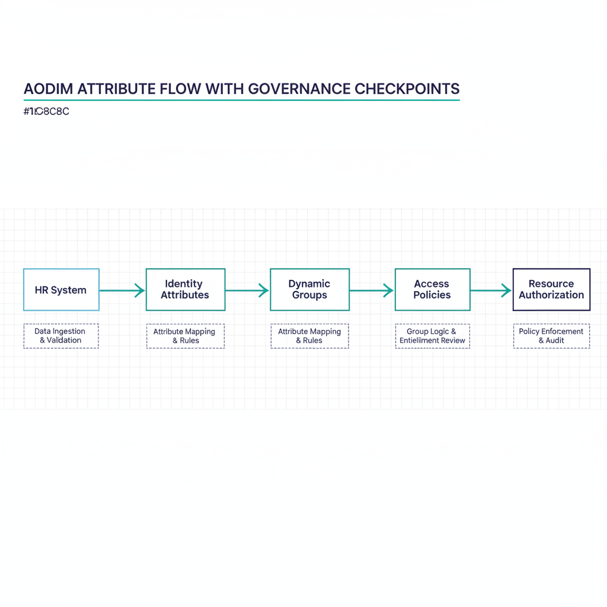
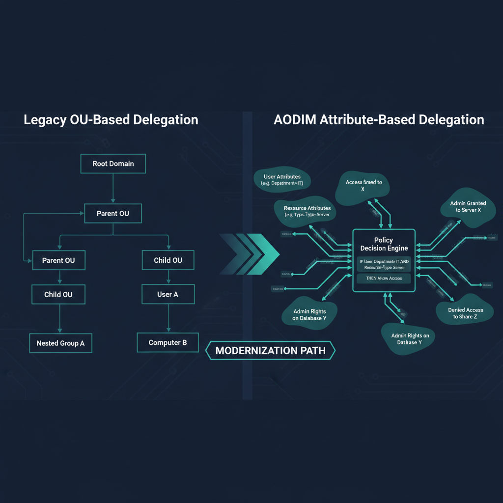
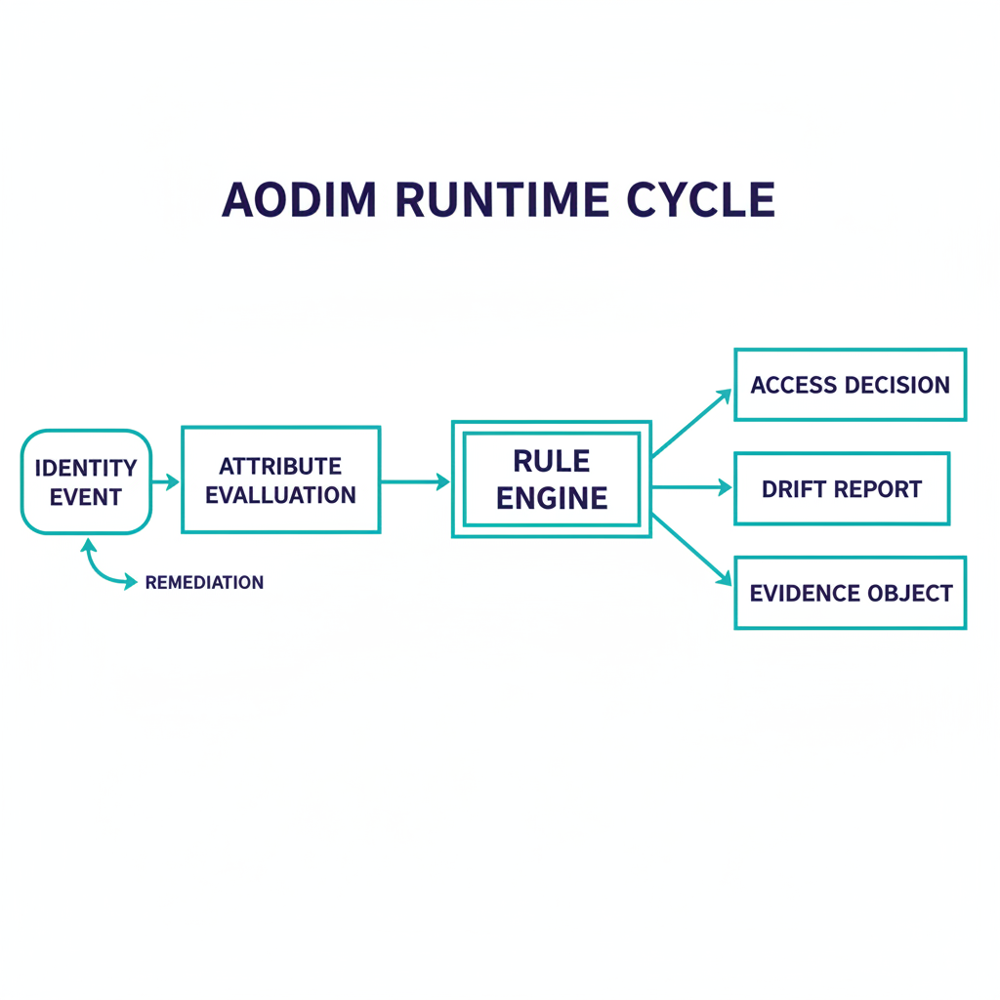

AODIM --- Attribute-Oriented Directory & Identity Model

Executive Summary

Modern enterprises using cloud identity platforms face a mismatch between dynamic organizational structures and static access control models. AODIM addresses this by making identity attributes the authoritative driver of access, enabling automated, deterministic, and scalable identity governance.

This document tracks the canonical AODIM specification,
[UIAO_006 — AODIM Architecture (v1.1)](../../../src/uiao/canon/UIAO_006_AODIM_Architecture_v1.0.md).

Core Principle

Identity attributes define organizational structure; access is computed, not assigned.

Problem Statement

Traditional directory systems rely on hierarchical placement (OUs), which do not translate well to cloud environments. This leads to:

\- Manual access management

\- Poor handling of role changes (movers)

\- Over-permissioning

\- Audit complexity

Architecture Overview

{#fig-aodim-architecture-image-01 fig-alt="Technical architecture diagram showing the AODIM attribute flow: HR System..." width="100%"}


HR System → Identity Attributes → Dynamic Groups → Access & Policy Enforcement

Attribute Model

OrgPath is not a single hierarchical string. Under Model C
([ADR-078](../../../src/uiao/canon/adr/adr-078-orgpath-attribute-schema-15-facet.md))
the organizational position of every principal is decomposed into 10 named
facets, each bound to exactly one Entra `extensionAttribute` slot:

\- Region (`extensionAttribute1`), Department (`extensionAttribute2`), Division (`extensionAttribute3`), Role (`extensionAttribute4`)

\- CostCenter (`extensionAttribute5`), Classification (`extensionAttribute6`)

\- HireDate (`extensionAttribute7`), TermDate (`extensionAttribute8`)

\- ClearanceLevel (`extensionAttribute9`), AccountType (`extensionAttribute10`)

Slots `extensionAttribute11`–`14` are reserved for tenant-declared facets
introduced via governed PR. The native `manager` relationship is consumed
alongside these facets but is a standard directory attribute, not an
OrgPath facet. See the
[OrgPath Codebook (UIAO_151)](../../../src/uiao/canon/UIAO_151_OrgPath_Codebook.md)
for the canonical facet-to-slot map.

Example (per-facet values on one principal):

```
extensionAttribute1 = EASTUS        # Region
extensionAttribute2 = IT            # Department
extensionAttribute3 = InfraOps      # Division
extensionAttribute4 = Engineer      # Role
```

Dynamic Group Model

Groups are defined by boolean composition over facet predicates — not by
text-parsing a composite path:

\- Single-facet rules (`-eq` / `-in`) — all principals carrying a value in one facet

\- Multi-facet AND rules — principals matching every clause across multiple facets

\- Multi-facet OR / set rules — cross-cutting groupings

Example Rules:

```
(attr2 -eq "IT")                              # All IT department users
(attr2 -eq "IT") and (attr3 -eq "InfraOps")   # IT / Infrastructure division
(attr1 -in ["NCR","EASTUS","WESTUS"])         # All US-region users
```

See the [Dynamic Group Library (UIAO_152)](../../../src/uiao/canon/UIAO_152_Dynamic_Group_Library.md)
for the canonical rule inventory.

Delegation Model

{#fig-aodim-architecture-image-02 fig-alt="Side-by-side comparison diagram: Left panel labeled 'Legacy OU-Based..." width="100%"}


Administrative Units and scoped roles replace OU-based delegation. AU membership is driven by the same canonical facets, per the
[Delegation Matrix (UIAO_154)](../../../src/uiao/canon/UIAO_154_Delegation_Matrix_AUs_Roles.md).

Operational Flow

{#fig-aodim-architecture-image-03 fig-alt="Operational flow diagram showing the AODIM runtime cycle: Identity Event..." width="100%"}


HR updates → Attribute change → Group recalculation → Access update

Key Benefits

\- Automatic access alignment

\- Deterministic and explainable access

\- Reduced operational overhead

\- Continuous least privilege

Risks and Mitigations

\- Data quality → validation pipelines

\- Group sprawl → naming standards

\- Complexity → governance model

Reference Implementation

Includes:

\- Attribute schema

\- Dynamic group rules

\- CLI tool for simulation and explanation

CLI Example

Commands:

```shell
# Assign per-facet OrgPath values from an AD export and report findings
uiao orgtree assess --from-export ad-users.json --out assignments.json

# Run one governance pass over a tenant snapshot (dry-run by default):
# detects per-facet drift and reports the remediation it would apply
uiao orgtree govern snapshot.json --out report.json
```

`uiao orgtree govern` in its default dry-run mode is the simulation and
explanation surface: it recomputes per-facet assignments against the
codebook and reports the access recalculation a transfer or role change
would produce, without writing.

Strategic Impact

\- Enables Zero Trust

\- Aligns HR, IT, Security

\- Supports SaaS environments

Conclusion

AODIM transforms identity into a dynamic control plane where access follows the user automatically.
