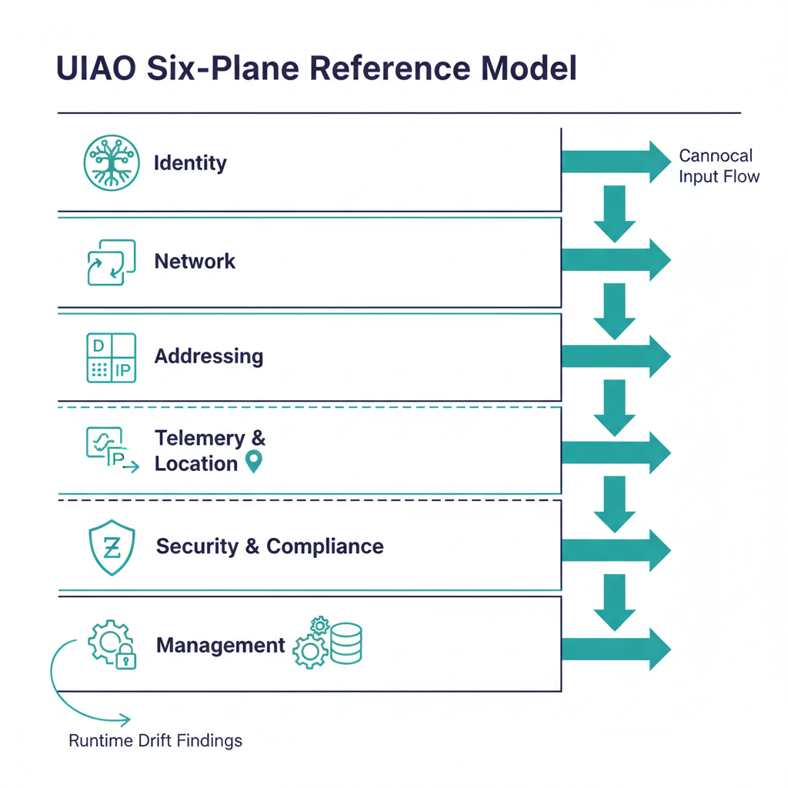

# Six-Plane Architecture

UIAO decomposes the federal modernization control surface into **six control
planes**. Each plane is authoritative for its domain, and all six operate as
a single deterministic system — the substrate the
[Governance OS](../executive-briefs/governance-os-overview.qmd) sits on.

This explainer is the architectural complement to the
[Governance OS Overview](../executive-briefs/governance-os-overview.qmd) brief.
Where the brief states that UIAO is canon-anchored and drift-detected, this
page describes the planes that the canon governs and the drift engine watches.

{#fig-six-plane-architecture-image-01 fig-alt="Six horizontal lanes stacked vertically, top to bottom: Identity (root namespace icon), Network (overlay routing icon), Addressing (deterministic IPAM icon), Telemetry & Location (signal-flow icon), Security & Compliance (Zero Trust shield icon), Management (governance/CMDB gear icon). One-directional arrows on the right side flow downward through all six lanes indicating canonical input flow. A small recurrent feedback arrow on the left shows runtime drift findings re-entering the Identity lane. Title \"UIAO Six-Plane Reference Model\". Clean engineering blueprint style, dark navy (#0D1B2E) and teal (#1E8C8C) color scheme on white background. No photographs, purely diagrammatic." width="85%"}

## The six planes

| Plane | Role |
|---|---|
| **Identity** | Root namespace and assurance engine |
| **Network** | Routing, segmentation, and overlay transport |
| **Addressing** | Deterministic IPAM and DNS/DHCP authority |
| **Telemetry & Location** | Real-time signals for routing, security, and compliance |
| **Security & Compliance** | Zero Trust enforcement and FedRAMP alignment |
| **Management** | Governance, drift detection, CMDB, device compliance |

Source: [`docs/docs/01_UnifiedArchitecture.qmd` §4](../../docs/01_UnifiedArchitecture.qmd).

## Why six planes (and not, say, three or twelve)

The decomposition is not arbitrary. Each plane corresponds to a distinct
authority boundary: a single source of truth, a single set of canonical
schemas, and a single class of drift findings. The six-plane cut is the
smallest decomposition that:

1. **Names every authoritative source** an authorizing official needs to
   evaluate during ATO review.
2. **Maps cleanly to the adapter taxonomy** — every adapter's `mission-class`
   (identity / telemetry / policy / enforcement / integration) lands inside
   exactly one plane. See `adapter-registry.yaml` and UIAO_003.
3. **Avoids the "everything is identity" overload** that collapses
   addressing, telemetry, and management into the identity plane and loses
   the ability to drift-detect them independently.

## Plane-by-plane summary

### Identity plane
Root namespace. Every actor — human, service principal, device, workload —
is named here exactly once. Assurance levels (NIST SP 800-63 IAL/AAL/FAL)
are anchored on this plane. Downstream planes consume identity claims; they
do not mint them.

### Network plane
Routing, segmentation, and overlay transport. Owns the path-level decisions
that flow from identity context (who) and addressing (where). Replaces
TIC 2.0 perimeter logic with an identity-driven overlay.

### Addressing plane
Deterministic IPAM/DNS/DHCP. Names are derived from identity and policy, not
assigned by a parallel administrative process. This is what makes
"identity-derived addressing" possible — addressing is computed from the
identity plane, not maintained as an independent source.

### Telemetry & Location plane
Real-time signal carrier. Every adapter emits telemetry in canonical claim
form (per the [Provenance Profile](../../docs/15_ProvenanceProfile.qmd)).
Telemetry is treated as control input, not as after-the-fact reporting:
drift findings, evidence claims, and policy decisions all originate as
telemetry events.

### Security & Compliance plane
Zero Trust enforcement and FedRAMP alignment. Holds the policy decision
points (PDP) and policy enforcement points (PEP) that consume identity,
addressing, and telemetry to evaluate access. FedRAMP control mapping is
derived from this plane, not authored separately.

### Management plane
Governance and CMDB. Where the substrate is run from: drift detection,
canon stewardship, OSCAL evidence regeneration, device compliance reporting.
This is the plane the [Drift Engine](drift-engine.qmd) and
[Evidence Chain](evidence-chain.qmd) operate within.

## How the planes interact

Cross-plane interaction is **deterministic and one-directional** at the
canonical level: identity feeds addressing feeds network feeds telemetry
feeds security-and-compliance feeds management. Cycles exist only at runtime
(e.g. management drift findings trigger identity re-evaluation), and every
cycle is mediated by an explicit canon artifact, never by ad-hoc coupling.

This matters for governance because it means **every plane has exactly one
authoritative input** and any deviation surfaces as a drift finding rather
than as silent inconsistency.

{#fig-six-plane-architecture-image-02 fig-alt="Left panel labeled \"Tier A — Four-Layer Prose Model\" showing four stacked rectangles: Authority Plane / Control Plane / Overlay Fabric / Physical Underlay. Right panel labeled \"Tier B — Six-Plane Decomposition\" showing the six planes from this document fitted entirely inside the Control Plane region of the left panel. Bidirectional connector arrow between the panels labeled \"same substrate, different granularity\". Clean engineering blueprint style, dark navy (#0D1B2E) and teal (#1E8C8C) color scheme on white background. No photographs, purely diagrammatic." width="85%"}

## Positioning under ADR-030

Per [ADR-030 §2](https://github.com/WhalerMike/uiao/blob/main/src/uiao/canon/adr/adr-030-pre-uiao-terminology-reconciliation.md),
the six-plane decomposition is **Tier B** of the reconciled layer model — the
internal structure of the Tier A four-layer prose model (Authority Plane /
Control Plane / Overlay Fabric / Physical Underlay). Neither framing
supersedes the other; they describe the same substrate at different
granularity. Use Tier A for executive narrative; use Tier B (this page) for
architectural depth.

## What this means for an ATO package

An authorizing official reviewing a UIAO-anchored SSP can expect:

- A **per-plane control narrative** rather than a perimeter-centric one.
- **Canon citations** for every policy intent (each plane points to a numbered
  canon document under `src/uiao/canon/`).
- **Drift findings scoped per plane** — identity drift, addressing drift,
  telemetry drift each carry their own evidence trail rather than collapsing
  into a single "system drift" line item.

That per-plane decomposition is what makes UIAO's evidence reproducibly
reviewable, and is the architectural basis for the rest of this Architecture
Series.
