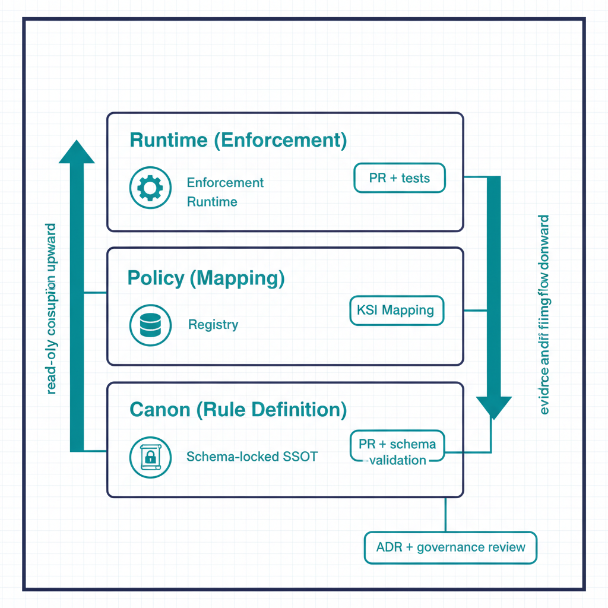
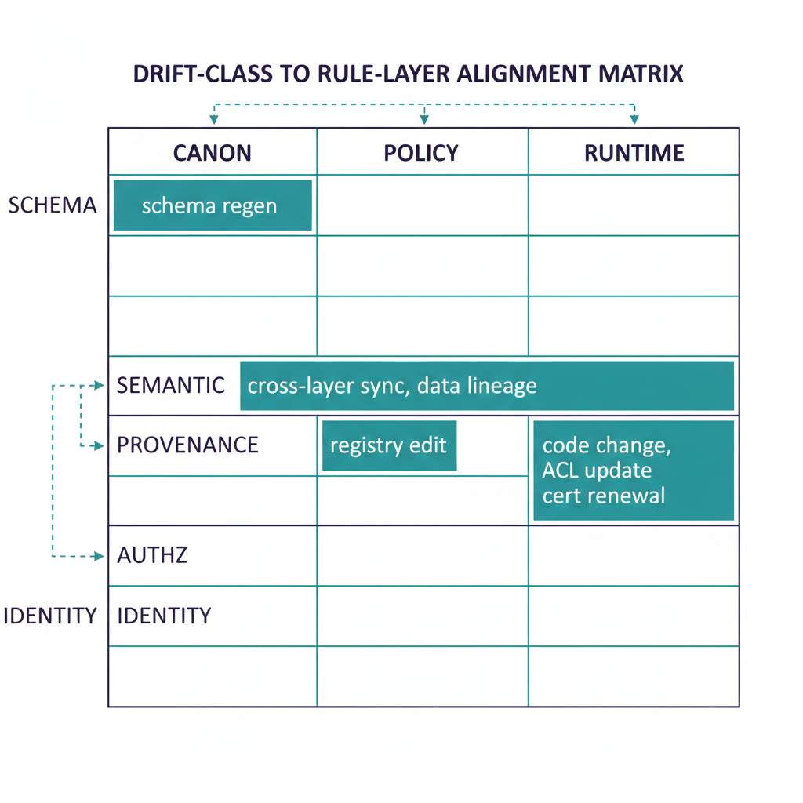

# Three-Layer Rule Model

{fig-alt="Layered diagram showing the three policy baselines UIAO evaluates — FedRAMP Moderate Rev 5, CISA SCuBA / BOD 25-01, and organizational policy — and how they map to the canon / policy / runtime rule layers." width="100%"}

UIAO separates rule authoring into **three distinct layers** so that policy
intent, evaluation logic, and runtime enforcement can be reasoned about,
versioned, and drift-detected independently. Mixing them — the typical
"policy-as-config" failure mode — collapses three different change
boundaries into one and loses the ability to assess each layer for its own
risk profile.

{#fig-three-layer-rule-model-image-01 fig-alt="Three horizontal layers stacked top to bottom: top layer \"Runtime (Enforcement)\" — adapter and enforcement runtime icons, middle layer \"Policy (Mapping)\" — registry and KSI mapping icons, bottom layer \"Canon (Rule Definition)\" — schema-locked SSOT icon. Each layer has a small badge on the right showing its change cadence (Runtime: PR + tests, Policy: PR + schema validation, Canon: ADR + governance review). Vertical arrows on the left side of the stack show \"read-only consumption upward\" flowing from canon up to runtime; arrows on the right side show \"evidence and drift findings flow downward\" back into the layers. Clean engineering blueprint style, dark navy (#0D1B2E) and teal (#1E8C8C) on white background. No photographs, purely diagrammatic." width="85%"}

## The three layers

| Layer | Lives in | Authoritative for | Change boundary |
|---|---|---|---|
| **Canon (rule layer)** | `src/uiao/rules/` | What rules exist and what they mean | Canon-change ADR + governance review |
| **Policy (mapping layer)** | `src/uiao/canon/<adapter>-registry.yaml`, KSI mappings | Which rules apply to which controls / scopes | Adapter PR + schema validation |
| **Runtime (enforcement layer)** | Adapter code under `src/uiao/adapters/` and enforcement runtime under `src/uiao/enforcement/` | How rules are evaluated against live state | Code PR + tests |

Each layer has its own change cadence, its own review surface, and its own
drift class. This is the architectural reason UIAO's drift engine can
distinguish a *meaning* drift (canon layer changed unexpectedly) from a
*mapping* drift (policy points at a retired rule) from an *enforcement*
drift (runtime code disagrees with canon).

## Layer 1 — Canon

The canon layer is the **single source of truth** for rule existence and
semantics. It lives under `src/uiao/rules/` and is shipped as package data
inside the installable `uiao` distribution. Canon is read at runtime via
`importlib.resources` per the
[Canon Consumer rule](../../../src/uiao/rules/canon-consumer.md) — never
from filesystem paths, never written to.

A canon rule declares:

- **Rule identifier** (stable, versioned).
- **Semantic statement** in human-readable form.
- **Schema constraints** that any concrete instance must satisfy.
- **Provenance** — the canon document and ADR that authored it.

What canon does *not* declare: which adapters apply it, which controls it
maps to, or how it is enforced at runtime. Those belong to layers 2 and 3.

## Layer 2 — Policy

The policy layer is the **mapping** between canon rules and operational
scope. It lives in canon-adjacent registries:

- `adapter-registry.yaml` — conformance adapter mappings.
- `modernization-registry.yaml` — modernization adapter mappings.
- KSI mapping files under `src/uiao/rules/ksi/` — Key Security Indicator
  to canon-rule bindings.

A policy entry says: *"Adapter X (or KSI Y) applies canon rule R within
scope S."* Schema validation in `schema-validation.yml` enforces that every
policy entry references a canon rule that actually exists. A dangling
policy entry — referencing a retired rule, a renamed scope, or a
non-existent adapter — is a `DRIFT-PROVENANCE` finding, not a runtime
crash.

Policy changes are higher-cadence than canon changes: an adapter author can
add or retire a mapping in a normal PR without invoking the canon-change
process. The schema gates ensure mappings stay consistent.

## Layer 3 — Runtime

The runtime layer is the **evaluation logic** that actually consumes canon
rules and policy mappings against live state. It lives in two places:

- **Adapter code** under `src/uiao/adapters/<adapter>/` — each adapter
  implements the conformance contract for its `mission-class` and emits
  drift findings + evidence per the
  [Evidence Chain](evidence-chain.qmd).
- **Enforcement runtime** under `src/uiao/enforcement/` — library-only
  today (UIAO_111). Policies are Python callables; there is no CLI surface
  for the enforcement runtime, by design — see
  [`cli-reference.md §4.1`](../../docs/cli-reference.md).

The runtime layer is the **only** layer allowed to mutate observable state.
Canon and policy are read-only at runtime; only the runtime layer can act.

{#fig-three-layer-rule-model-image-02 fig-alt="Three columns labeled Canon / Policy / Runtime. Five rows for each drift class. Filled cells indicate which layer that drift class maps to: SCHEMA in Canon column, SEMANTIC spanning Canon-to-Runtime as a long teal bar, PROVENANCE in Policy column, AUTHZ in Runtime column, IDENTITY in Runtime column. Cells contain short remediation hints (e.g. \"schema regen\", \"registry edit\", \"code change\"). Clean engineering blueprint style, dark navy (#0D1B2E) and teal (#1E8C8C) on white background. No photographs, purely diagrammatic." width="85%"}

## How drift maps onto the layers

The five-class drift taxonomy aligns with the three layers in a way that
matters operationally:

| Drift class | Layer where the mismatch lives |
|---|---|
| `DRIFT-SCHEMA` | Canon — declared schema vs. actual claim structure |
| `DRIFT-SEMANTIC` | Canon ↔ Runtime — meaning has shifted between layers |
| `DRIFT-PROVENANCE` | Policy — a mapping references a rule that no longer resolves |
| `DRIFT-AUTHZ` | Runtime — an adapter emitted outside its consent envelope |
| `DRIFT-IDENTITY` | Runtime — issuer cannot be resolved |

This alignment is why UIAO can attribute a drift finding to a specific
review surface: `DRIFT-PROVENANCE` findings are policy-layer concerns,
auto-resolvable in many cases; `DRIFT-SEMANTIC` findings cross from canon
into runtime and require both governance review and code change.

## Why three layers and not two

A common simplification is to fold "policy" into "canon" — declare
mappings inside the canon document itself. UIAO rejects this because:

1. **Cadence mismatch.** Canon changes require ADRs and governance review.
   Mapping changes do not. Folding mappings into canon either slows mapping
   work to canon cadence or weakens canon's review discipline.
2. **Blast radius.** A bad mapping is recoverable by a registry edit. A bad
   canon edit is recoverable only through ADR supersession. Different
   blast radii deserve different change boundaries.
3. **Drift attribution.** The drift engine can tell a 3PAO whether a
   finding represents a meaning shift or a mapping mistake. That
   distinction is lost if both live in the same artifact.

The same logic argues against folding "runtime" into "policy" — runtime
must execute, mutate, and emit, which policy must not.

## What this means for an ATO package

Three operational properties for a 3PAO:

- **Per-layer evidence trails.** Canon changes carry an ADR; policy changes
  carry a schema-validated registry diff; runtime changes carry tests and
  remediation contracts. The package shows three distinct evidence
  surfaces, not one.
- **Independent reviewability.** A reviewer can challenge "is this rule's
  meaning correct?" (canon) separately from "is this mapping right?"
  (policy) separately from "does the code do what canon says?" (runtime).
- **Targeted remediation.** When drift is found, only the affected layer is
  rebuilt — canon, mapping, or code. The other two layers' evidence
  remains valid.
