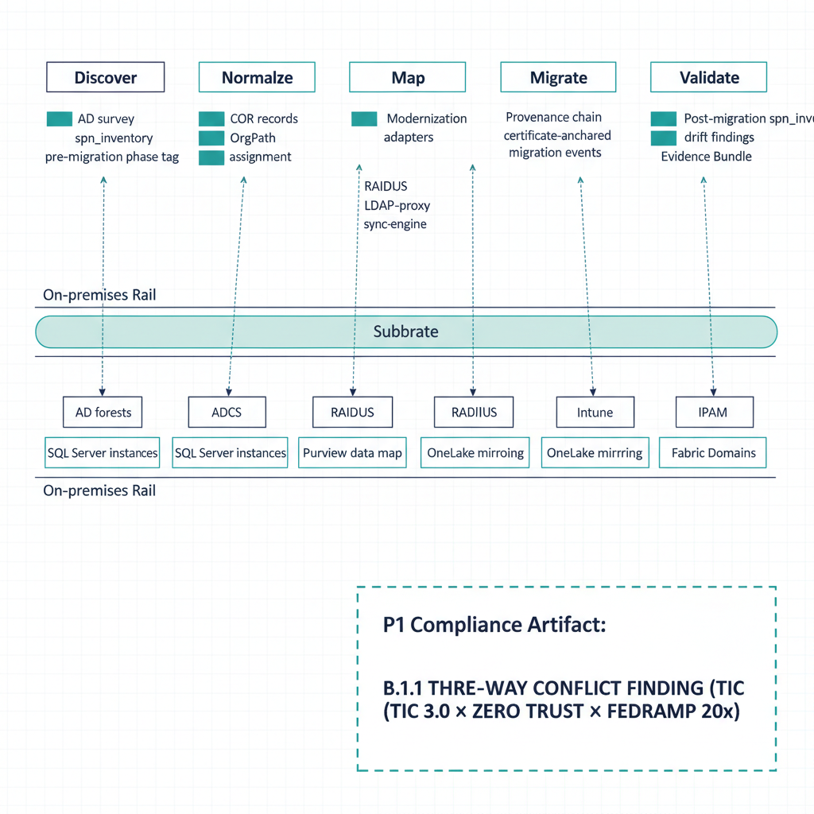

# Federal Civilian AD → Entra ID + SQL Estate — Reference Deployment Pattern

::: {.callout-important}
## Framing pattern, not a fabricated engagement
This page is the **canonical engagement pattern** for a federal civilian
agency migrating Active Directory and its dependent SQL estate to
Microsoft Entra ID + M365 GCC-Moderate, end-to-end through the UIAO
substrate. Specific metrics, agency identifiers, contractor names, and
calendar dates are intentionally absent until real engagement material
is reviewed and externally releasable. The narrative below is the
**substrate's behavior** against the archetype, not a deployed-and-
attested reference.

Status badge in the family index: **Framing-Pattern** per the
[Whitepapers status conventions](../whitepapers/index.qmd).
:::

{#fig-reference-deployment-fedciv-ad-to-entra-image-01 fig-alt="Below each phase, a small stack of artifacts: AD survey + spn_inventory (pre-migration phase tag), COR records + OrgPath assignment, Modernization adapters (PKI, RADIUS, LDAP-proxy, sql-server, sync-engine), Provenance chain + certificate-anchored migration events, Post-migration spn_inventory + drift findings + Evidence Bundle. Two parallel rails run beneath the timeline: the on-premises rail (AD forests, SQL Server instances, ADCS, RADIUS, IPAM) and the cloud rail (Entra ID GCC-Moderate, Intune, Purview data map, OneLake mirroring, Fabric Domains). Vertical arrows from on-prem rail up through the substrate down to the cloud rail at each phase. Bottom-right corner shows the GCC Moderate boundary as a dashed enclosure with the B.1.1 three-way conflict finding (TIC 3.0 × Zero Trust × FedRAMP 20x) called out as a P1 compliance artifact. Clean engineering blueprint style, dark navy (#0D1B2E) and teal (#1E8C8C) on white background. No photographs, purely diagrammatic." width="85%"}

## Engagement archetype

A federal civilian agency of approximately fifty thousand users
operates two Active Directory forests — one for the agency proper, one
inherited from a component organization absorbed in a prior
reorganization — joined by a transitive trust that nobody fully
documented and that nobody currently owns. The forests collectively
hold roughly seventy thousand computer accounts, twelve thousand
groups, several thousand orphaned service accounts whose original
owners have rotated out, and a SQL Server estate of approximately
ninety instances spread across regional offices, the agency
headquarters data center, and three relocated workloads now running on
Azure Arc-enrolled hardware. The agency is under explicit modernization
pressure from OMB M-22-09 (Zero Trust), CISA BOD 25-01 (logging and
visibility), and a forthcoming FedRAMP 20x continuous-monitoring
expectation. It has chosen Microsoft 365 GCC-Moderate as the
destination identity plane and is committed to consolidating its data
estate around the Fabric + OneLake + Purview Azure SSOT stack.

The agency's compliance posture today is recognizable. Its previous
ATO package was assembled retrospectively over a twelve-month window
by a system integrator who is no longer on contract. The directory's
SPN inventory exists only in spreadsheets that were last refreshed two
years ago. The SQL estate's lineage and ownership are documented in
component-level binders that disagree with each other on basic
attribution questions. The agency has the right tools — Entra Connect,
Intune, Defender, Purview Premium — but no shared canon for what those
tools should be told about the agency's organizational structure.

This is the engagement pattern UIAO is built for, and the substrate's
behavior across the five phases below is what this case study
illustrates. For the federal mandate alignment that makes this work
necessary, see the
[Federal SSOT Alignment whitepaper](../whitepapers/federal-ssot-alignment.qmd).

## Phase 1 — Discover

The first substrate action is to make the current state of the agency's
identity infrastructure honest. The AD survey adapter at
[`src/uiao/adapters/modernization/active_directory/survey.py`](../../../src/uiao/adapters/modernization/active_directory/survey.py)
reads both forests in read-only mode and emits an `ADSurveyReport` that
enumerates the eleven AD object types catalogued in
[`src/uiao/modernization/directory-migration/ad-dependency-inventory.md`](../../../src/uiao/modernization/directory-migration/ad-dependency-inventory.md):
users, computers, service accounts, security groups, GPOs, DNS and DHCP
records, PKI artifacts, RADIUS configurations, LDAP-dependent
applications, Kerberos SPNs, and the trust relationships between the
two forests. The survey is the same one that produced the substrate's
test fixtures; it is not a per-engagement script.

The service-account scan codified in
[`Spec3-D1.1` (UIAO_139)](../../../src/uiao/canon/specs/Spec3-D1.1-Get-ServiceAccountScan.md)
runs as part of the discovery pass. It produces a service-accounts
inventory with delegation classification, AdminCount status, and a per-
account risk score that flags ADCS-dependent SPNs and unconstrained
Kerberos delegation as critical pre-migration findings. The agency in
this archetype has roughly four hundred service accounts with at least
one SPN registration; the survey flags approximately sixty of them as
critical and another hundred as high-risk.

The SPN inventory artifact introduced in PR #395 — defined in
[`src/uiao/schemas/orgtree-readiness/orgtree-readiness.schema.json`](../../../src/uiao/schemas/orgtree-readiness/orgtree-readiness.schema.json)
`#/definitions/spnInventory` — captures the agency's `MSSQLSvc/*`
registrations with a `phase: pre_migration` tag, the discovery
timestamp, and the resolution attempt against OrgPath via the service-
account principal (preferred) or the hosting computer (fallback).
Approximately eighty of the agency's ninety SQL instances resolve
cleanly; ten emit `DRIFT-IDENTITY` findings because their service
accounts predate any organizational attribution the agency can
defend. These ten are flagged as P2 conditions that must be remediated
through explicit owner reassignment before migration begins.

The discovery phase ends with an OrgTree readiness bundle, HMAC-
signed, ready to be consumed by the next phase. The bundle's
provenance section names the substrate canon documents it derives from
and binds the bundle to the agency's specific run.

## Phase 2 — Normalize

The discovery output is not yet authoritative. The agency's two
forests carry overlapping organizational hierarchies — both have an
"Operations" OU at the top level, but the Operations group in forest
A is a completely different population than Operations in forest B,
and the merged tenant cannot tolerate that ambiguity. The OrgTree
registry, populated from the discovery output and refined through the
agency's organizational chart of record, becomes the source of truth
for organizational position. Every user, computer, and service account
receives an OrgPath extension attribute value following the
hierarchy depth-eight convention from
[`ADR-062`](../../../src/uiao/canon/adr/adr-062-orgpath-depth-extension.md).
Forest A's Operations branch becomes `/Root/AgencyProper/Operations`;
forest B's becomes `/Root/ComponentOrg/Operations`. The collision is
resolved at the path level, not at the group level.

The normalization phase emits `DRIFT-IDENTITY` findings for principals
that the OrgTree population cannot attribute. In the archetype, roughly
two thousand users and several hundred service accounts fall into this
bucket on the first pass. Each finding includes a suggested OrgPath
candidate derived from OU placement, manager chain, or computer-account
attribution; the substrate does not auto-assign because the OrgPath is
load-bearing for every downstream policy decision. The agency's
governance team resolves these findings through the change-request
workflow before the next phase begins.

## Phase 3 — Map

Mapping translates the X.500 / LDAP governance model encoded in AD
into the attribute-driven model Entra ID requires. The eight adapter
interfaces under
[`src/uiao/modernization/directory-migration/adapters/`](../../../src/uiao/modernization/directory-migration/adapters/)
each carry an explicit contract for one of the AD-adjacent surfaces
that must be re-governed: IPAM, PKI, RADIUS, LDAP-proxy, sync-engine,
device-management, NTP, DFS, and the SQL Server workload adapter
introduced in PR #397
([`adapters/sql-server/sql-server-adapter-interface.md`](../../../src/uiao/modernization/directory-migration/adapters/sql-server/sql-server-adapter-interface.md)).
Each adapter declares its `class`, `mission-class`, and `gcc-boundary`
in
[`migration-adapter-registry.yaml`](../../../src/uiao/modernization/directory-migration/migration-adapter-registry.yaml)
and is schema-validated in CI.

For this archetype, the most operationally significant adapters are
PKI (the agency's ADCS hierarchy hosts dozens of templates whose
auto-enrollment must move to Intune SCEP without expiring certificates
mid-cutover) and the SQL Server adapter (the ninety instances need
SPN re-registration coordinated with service-account migration). The
LDAP-proxy adapter covers the agency's approximately forty LDAP-bound
internal applications. RADIUS is critical because the agency's
network access requires 802.1X EAP-TLS that depends on the same ADCS
hierarchy PKI governs.

## Phase 4 — Migrate

The migration itself is executed as a sequence of provenance-chained
events. Each adapter operation carries an immutable record of the
principal that requested the change, the source of authority, the
canon document version the change was made against, and the
verification hash of the resulting state. The schema contract
`ssot-mutation: never` is enforced: adapters consume and emit against
the canon, never replace it. The `certificate-anchored: true`
contract requires every operation to be signed by an identity
certificate; the agency's deployment uses the same ADCS hierarchy
the PKI adapter governs for substrate operations as well as user
authentication.

During migration, drift findings emerge in real time. The drift
taxonomy formalized in
[`16_DriftDetectionStandard`](../../docs/16_DriftDetectionStandard.qmd)
§2 surfaces five classes:

- **`DRIFT-SCHEMA`** — a recently-migrated computer object has an
  attribute encoding that does not match the canon schema version
- **`DRIFT-SEMANTIC`** — an OrgPath value drifts into a deprecated
  geographic OU encoding pattern
- **`DRIFT-PROVENANCE`** — a state change appears with no recorded
  provenance event in the chain (this is a P1 condition — the migration
  is halted and the change is investigated before resuming)
- **`DRIFT-AUTHZ`** — a Conditional Access policy in Entra ID
  contradicts the NIST 800-63 AAL requirement encoded for that
  principal in the COR
- **`DRIFT-IDENTITY`** — a principal exists in the migrated tenant
  with no resolvable canon counterpart (orphan migration artifact)

The agency in this archetype encounters approximately three hundred
drift findings across the migration window, the majority P3 and P4
(auto-remediated per §4 of the drift standard). The single P1 event
in a representative cycle is a `DRIFT-AUTHZ` against a Finance
service account whose post-migration role assignment exceeds the
AAL-3 requirement the canon records; the substrate halts the migration
of the dependent SQL instance until the role assignment is reduced.

## Phase 5 — Validate

Post-migration, the SPN inventory is captured a second time, this
time with `phase: post_migration`. The substrate's drift comparison
applies the four SPN-drift conditions catalogued in
[`16_DriftDetectionStandard` §7.1](../../docs/16_DriftDetectionStandard.qmd):

| Condition | Drift class | Severity | Detection |
|---|---|---|---|
| SPN present pre-migration, absent post-migration | `DRIFT-IDENTITY` | P1 | Set-difference between phase-tagged inventories |
| SPN host or port changed without provenance | `DRIFT-PROVENANCE` | P2 | Same `(service_class, principal_name)` key, different host or port |
| SPN owner changed without recorded migration event | `DRIFT-AUTHZ` | P1 | Same SPN, different principal, no transition record |
| SPN in AD but no Entra Kerberos delegation | `DRIFT-IDENTITY` | P2 | Cross-reference fails between AD and workload-identity federation |

For this archetype, approximately three SPNs surface as P1
`DRIFT-IDENTITY` findings (SPNs whose re-registration step was
skipped during the SQL Server adapter's migration sequence). These
become halt-and-alert conditions per the severity model in
[`16_DriftDetectionStandard` §3](../../docs/16_DriftDetectionStandard.qmd);
the agency's operations team re-registers the SPNs against the
migrated principals and re-runs the post-migration inventory until
zero P1 findings remain.

## The Azure SSOT bridge

With the identity migration complete, the agency's data plane joins
the substrate. The pattern is the one developed in
[OrgPath Narrative chapter 07a](../orgpath-narrative/07a-uiao-beneath-the-azure-ssot-stack.qmd):
OrgPath as the join key across two policy planes, not as a single
inheritance chain.

On the user plane, the existing Adaptive Policy Scopes from
[chapter 07](../orgpath-narrative/07-orgpath-and-purview.qmd) target
each segment's labels, DLP rules, retention schedules, and eDiscovery
custodian queries. On the data plane, Fabric Domains are created to
mirror the OrgTree hierarchy; the agency provisions one domain per
`FabricDomainBoundary`-flagged node, and each Fabric workspace is
assigned to the domain whose OrgPath matches the workspace's owning
segment. The ninety SQL instances are registered into the Purview
data map under collections keyed on `uiao_orgpath` custom metadata;
the eighty-five that completed migration cleanly are mirrored into
OneLake under the matching Fabric Domain workspaces. The remaining
five — instances whose post-migration drift is still being remediated
— are deferred until the drift cycle closes.

The Purview Information Protection telemetry constraint catalogued in
[B.1.1 §3](../compliance/boundary-authorization/B1-1-gcc-moderate-three-way-conflict.qmd)
applies: every sensitivity-label trust assertion in the GCC-Moderate
tenant inherits the boundary's verification gap. The substrate's role
at this boundary is not to remediate it (it is structural) but to
record the compensating controls the agency has put in place and
verify them continuously.

## The Evidence Bundle the assessor consumes

At any point after Phase 2 begins, the agency can produce an Evidence
Bundle from the substrate's accumulated artifacts. The bundle includes:

- The OrgTree readiness bundle from each phase, HMAC-signed
- Both phase-tagged SPN inventories (pre- and post-migration) with
  drift comparison results
- The provenance chain of every adapter operation
- All drift findings, each with severity, drift class, and remediation
  evidence per the contract in
  [`16_DriftDetectionStandard` §4](../../docs/16_DriftDetectionStandard.qmd)
- The B.1.1 three-way GCC-Moderate compliance-conflict finding
  (`GCC-BOUNDARY-3WAY-001`) with the agency's specific compensating-
  controls catalogue
- The Purview collection registration state with `uiao_orgpath`
  attribution per asset
- The Fabric Domain assignment state with per-workspace OrgPath
  attribution

This is the artifact the 3PAO consumes during the next FedRAMP cycle.
It is produced as a byproduct of operations rather than assembled
retrospectively in a twelve-month window. The agency's authorizing
official sees the substrate's state at any moment, not a stale
snapshot.

## What survives the engagement

The deliberate point of the substrate is that the canon, the schemas,
the drift findings, and the Evidence Bundle do not belong to whichever
system integrator delivered the migration. They belong to the agency.
The next FedRAMP cycle consumes the existing canon rather than
rebuilding it. A subsequent SI engagement — for the next modernization
program, the next directory consolidation, the next data-governance
expansion — anchors on the substrate's state rather than starting from
zero. This is the cost-shape inversion the
[Federal SSOT Alignment whitepaper §6](../whitepapers/federal-ssot-alignment.qmd)
describes: re-engagement consumes canon; it does not rediscover it.

The substrate behaviors a real engagement would document and that this
framing pattern is structured to receive:

- Time-to-evidence under the substrate vs. the prior twelve-month
  baseline
- Drift-finding rate over the migration window, decomposed by class
  and severity
- SPN drift incidence per ten instances migrated
- B.1.1 compensating-controls verification cadence and false-positive
  rate
- Purview policy-decision count whose trust assertion is now backed by
  continuously-verified identity state

When real engagement material becomes externally releasable, those
metrics replace the prose-level claims above. Until then this page is
the canonical archetype the substrate is built against and the shape
the Evidence Bundle is produced into.

## Cross-references

- [Federal SSOT Alignment whitepaper](../whitepapers/federal-ssot-alignment.qmd) — federal mandate alignment over the identity layer
- [OrgPath Narrative 07a — UIAO Beneath the Azure SSOT Stack](../orgpath-narrative/07a-uiao-beneath-the-azure-ssot-stack.qmd) — Azure SSOT identity-substrate role
- [OrgPath Narrative 07 — OrgPath and Microsoft Purview](../orgpath-narrative/07-orgpath-and-purview.qmd) — user-plane Adaptive Policy Scope mechanism
- [B.1 GCC-Moderate Boundary Model](../compliance/boundary-authorization/B1-gcc-moderate-boundary-model.qmd) — abstract boundary model
- [B.1.1 Three-Way GCC-Moderate Compliance Conflict](../compliance/boundary-authorization/B1-1-gcc-moderate-three-way-conflict.qmd) — TIC 3.0 × Zero Trust × FedRAMP 20x finding
- [Drift Detection Standard](../../docs/16_DriftDetectionStandard.qmd) — drift taxonomy, severity model, and §7.1 SPN drift detection
- [Directory Migration README](../../../src/uiao/modernization/directory-migration/README.md) — discovery and inventory artifacts
- [SQL Server Adapter Interface](../../../src/uiao/modernization/directory-migration/adapters/sql-server/sql-server-adapter-interface.md) — DM_090 adapter contract
- [Identity Modernization — Case Study](identity-modernization-case-study.qmd) — identity-plane case-study companion
- [Cloud Boundary — Case Study](cloud-boundary-case-study.qmd) — GCC-Moderate boundary establishment companion
