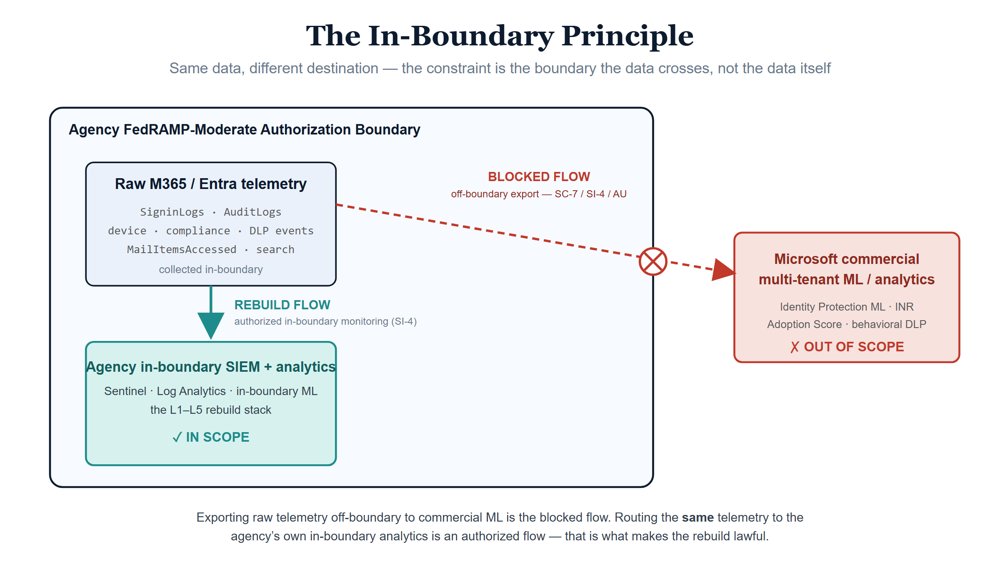
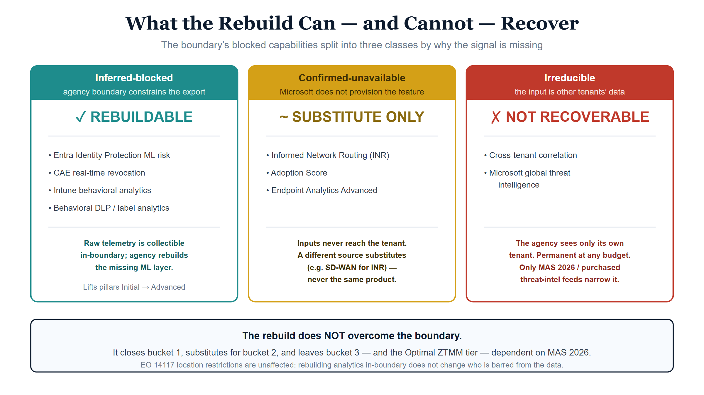
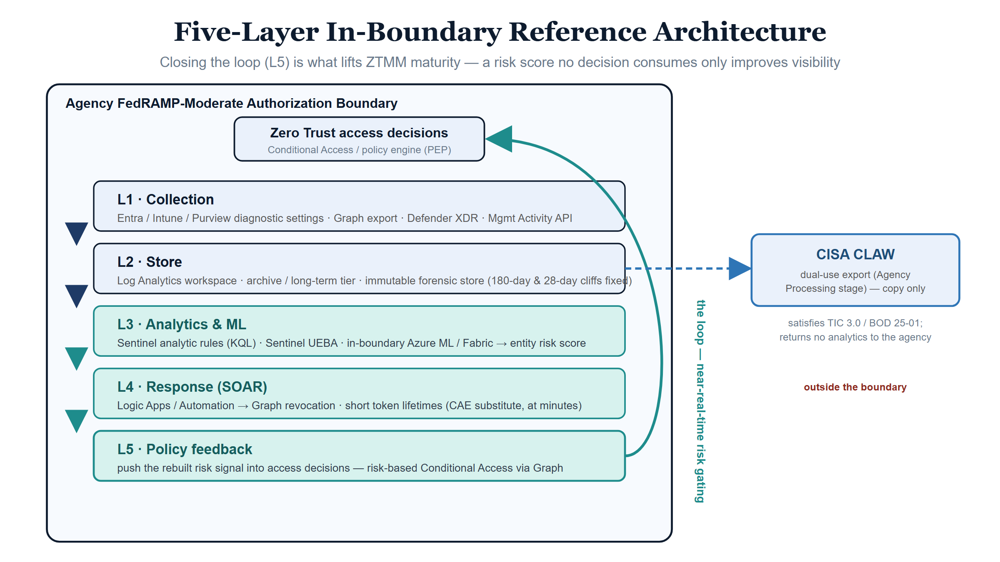
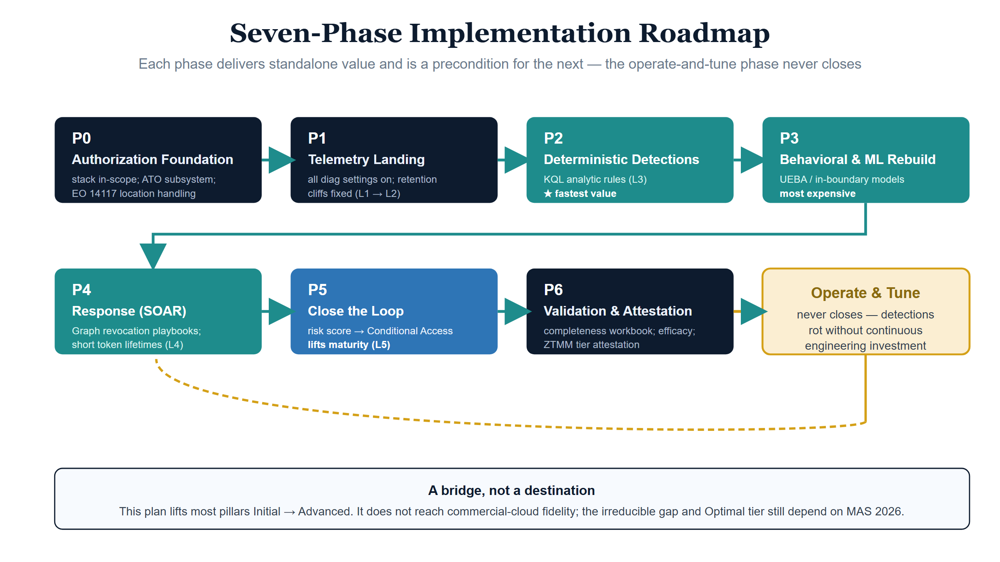
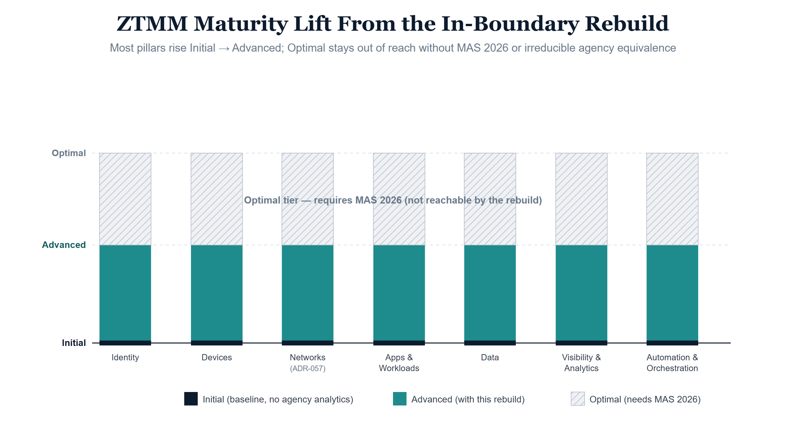

**CONTROLLED**

# B.1.3 Rebuilding Boundary-Blocked Analytics In-Boundary

## 1. Position

The parent boundary model in [B.1](B1-gcc-moderate-boundary-model.qmd)
establishes that M365 GCC-Moderate caps near **Initial** ZTMM maturity in
Identity, Devices, and Networks without agency-side analytics, and that
reaching **Advanced** requires "meaningful agency engineering investment."
[B.1.1 §4](B1-1-gcc-moderate-three-way-conflict.qmd) names the agency-side
compensating-controls surface but does not specify how to build it. This
leaf is that specification: a detailed, phased implementation plan for
reconstructing the boundary-blocked SaaS analytics inside the agency's own
FedRAMP-authorized boundary.

It is the operational realization of the second of the only two levers that
move the boundary problem. The first lever — Microsoft narrowing its scope
decision so the commercial analytics pipelines re-enter GCC-Moderate scope
(the MAS 2026 path of [B.1 §6](B1-gcc-moderate-boundary-model.qmd)) — is not
the agency's to pull. This leaf is the lever the agency *can* pull: rebuild
the analytics itself, in-boundary, and feed the result back into its own
Zero Trust access decisions.

This is a standing engineering capability, not a project with an end date.
The plan below is sequenced so an agency can stand up value in weeks and
reach Advanced-tier coverage over quarters, but the operate-and-tune phase
(§5.7) never closes. The leaf is explicit about the **irreducible limits**
(§11): some fidelity — most importantly Microsoft's cross-tenant global
threat intelligence — cannot be rebuilt at any investment level, and the
plan is a bridge to MAS 2026, not a permanent replacement for it.

## 2. The In-Boundary Principle — Why This Is Lawful Where Inheritance Is Not

{#fig-b1-3-in-boundary-principle fig-alt="Blueprint diagram, white background, federal navy/teal/red palette. An agency FedRAMP-Moderate authorization boundary contains a raw-telemetry box and an in-boundary SIEM box joined by a teal 'rebuild flow — authorized in-boundary monitoring (SI-4)' arrow marked IN SCOPE; a red dashed 'blocked flow — off-boundary export SC-7/SI-4/AU' arrow crosses the boundary to an out-of-scope Microsoft commercial multi-tenant ML box and is struck through." width="100%"}

The single fact that makes this entire plan compliant is that the
constraint the boundary imposes is about the **destination of the data, not
the data itself**.

- **The blocked flow** is raw, identity-attributed, behavioral telemetry
  leaving the authorized boundary for Microsoft's commercial multi-tenant
  ML and analytics services — a flow constrained under SI-4, AU-2/AU-3, and
  SC-7 (see [B.1 §2](B1-gcc-moderate-boundary-model.qmd)).
- **The rebuild flow** is the *same* raw telemetry routed to the agency's
  own SIEM and analytics workspace **inside its own FedRAMP-authorized
  boundary**. That is an authorized audit-export and in-boundary monitoring
  flow, exactly what SI-4 and AU-2/AU-3 contemplate.

Same data, in-scope destination. The agency is not defeating the boundary;
it is exercising the in-boundary monitoring the boundary was drawn to
protect. The corollary, which §9 develops, is non-negotiable: **every
component of the rebuild stack must itself be inside the authorization
boundary** and carry a FedRAMP authorization commensurate with the data it
processes. The moment the agency ships that telemetry to an out-of-scope
analytics service for convenience, it has recreated the very flow the
boundary forbids — this time as its own finding.

## 3. Scope — What Can and Cannot Be Rebuilt

{#fig-b1-3-three-buckets fig-alt="Blueprint diagram, white background, three columns: teal 'Inferred-blocked / REBUILDABLE' (Entra Identity Protection ML, CAE, Intune behavioral, behavioral DLP), amber 'Confirmed-unavailable / SUBSTITUTE ONLY' (INR, Adoption Score, Endpoint Analytics Advanced), red 'Irreducible / NOT RECOVERABLE' (cross-tenant correlation, Microsoft global threat intelligence), with a footer banner stating the rebuild does NOT overcome the boundary and EO 14117 location restrictions are unaffected." width="100%"}

[B.1 §3](B1-gcc-moderate-boundary-model.qmd) classifies the blocked
capabilities into dispositions. For the rebuild, the operative split is by
**why** the signal is missing, because it determines whether a rebuild is
even possible (see also the SaaS causation analysis the parent model
carries):

| Bucket | Examples | Rebuildable in-boundary? | Why |
|---|---|---|---|
| **Inferred-blocked** (agency boundary constrains export of raw telemetry) | Entra Identity Protection ML risk, CAE real-time, Intune behavioral analytics, behavioral DLP | **Yes — fully the agency's to rebuild** | The raw telemetry (sign-ins, audit, device, DLP events) *is* collectible in-boundary; only Microsoft's ML layer over it is absent. The agency rebuilds the layer. |
| **Confirmed-unavailable** (Microsoft does not provision the feature) | INR real-time path metrics, Adoption Score, Endpoint Analytics Advanced | **Partly — substitute, not reconstruct** | The *underlying* signal is sometimes obtainable from another source (e.g., SD-WAN path telemetry substitutes for INR), but Microsoft's specific computed product cannot be recreated because its inputs never reach the tenant. |
| **Irreducible** | Cross-tenant correlation, Microsoft global threat intelligence | **No** | The agency sees only its own tenant. The input is other tenants' telemetry, which the agency never has. See §11. |

The plan that follows targets the first bucket in full, the second by
substitution, and is honest that the third is a permanent residual that
only MAS 2026 (or third-party threat-intel feeds) addresses.

## 4. Reference Architecture

{#fig-b1-3-five-layer-architecture fig-alt="Blueprint diagram, white background. Five stacked layers L1 Collection, L2 Store, L3 Analytics & ML, L4 Response (SOAR), L5 Policy feedback inside an agency authorization boundary, a Zero Trust access-decisions box at top, a teal loop arrow from L5 back up to access decisions labelled 'near-real-time risk gating', and a blue dashed branch from L2 out of the boundary to a CISA CLAW box marked copy-only / returns no analytics." width="100%"}

The rebuild is a five-layer stack. Each layer is named with the in-boundary
service class that realizes it; specific products are illustrative and must
be selected against current FedRAMP authorization status for the agency's
cloud (§9).

| Layer | Function | In-boundary realization |
|---|---|---|
| **L1 — Collection** | Land every collectible raw signal in-boundary | Entra/Intune/Purview diagnostic settings; Graph data export; Defender XDR connector; Management Activity API |
| **L2 — Store** | Durable, query-able, retention-correct telemetry lake | Log Analytics workspace; long-term/archive tier; immutable forensic store |
| **L3 — Analytics & ML** | Reconstruct the detections and risk scores | Sentinel analytic rules (KQL); Sentinel UEBA; in-boundary Azure ML / Microsoft Fabric / Databricks for trained models |
| **L4 — Response (SOAR)** | Automated containment that substitutes for CAE / auto-remediation | Logic Apps / Azure Automation playbooks invoking Graph |
| **L5 — Policy feedback** | Push the rebuilt risk signal into access decisions | Conditional Access via Graph; custom policy engine / PEP |

The critical architectural property is the **loop**: L5 is what separates a
rebuild that lifts ZTMM maturity from one that merely improves visibility.
A risk score that no access decision consumes lifts only the Visibility &
Analytics pillar; the same score wired into Conditional Access lifts
Identity, Devices, and Automation & Orchestration as well (§12).

## 5. Implementation Plan

{#fig-b1-3-seven-phase-roadmap fig-alt="Blueprint roadmap, white background. Seven phase boxes P0 Authorization Foundation, P1 Telemetry Landing, P2 Deterministic Detections (fastest value), P3 Behavioral & ML Rebuild (most expensive), P4 Response SOAR, P5 Close the Loop (lifts maturity), P6 Validation & Attestation, connected by teal arrows across two rows, an amber 'Operate & Tune — never closes' loop returning to the start, and a footer banner 'A bridge, not a destination'." width="100%"}

The plan is phased so that each phase delivers standalone value and is a
precondition for the next. Effort bands are indicative engineering
sequencing, not tenant-specific commitments.

### 5.0 Phase 0 — Authorization & Workspace Foundation

Before any telemetry moves, the rebuild stack's own authorization posture
must be settled, or the build becomes its own boundary finding.

| Step | Action |
|---|---|
| 0.1 | Confirm the Log Analytics / Sentinel workspace is a FedRAMP-authorized service within the agency's authorization boundary for the data categories it will hold (identity-attributed, behavioral). |
| 0.2 | For any ML compute (Azure ML, Fabric, Databricks), confirm FedRAMP authorization and in-boundary network placement **before** designing models that depend on it; if unauthorized, the ML rebuild (Phase 3) is deferred to deterministic detections (Phase 2) until a path exists. |
| 0.3 | Define the data-handling rules for the most sensitive class — precise geolocation — under EO 14117 (§9). Location telemetry is collectible and analyzable in-boundary, but its handling is regulated independent of the boundary. |
| 0.4 | Record the rebuild stack as an in-scope subsystem in the ATO boundary documentation, with its components, data flows, and the SI-4/AU control mapping the in-boundary principle (§2) rests on. |

### 5.1 Phase 1 — Telemetry Landing (Collection, L1 → L2)

You cannot analyze what you did not collect. This phase mirrors and extends
the 60-day foundation in the parent assessment.

| Step | Action | Closes |
|---|---|---|
| 1.1 | Enable all Entra diagnostic categories — interactive **and** `AADNonInteractiveUserSignInLogs`, `AADServicePrincipalSignInLogs`, `AADManagedIdentitySignInLogs`, `AADRiskyUsers`, `AADUserRiskEvents`, `AADProvisioningLogs`, `MicrosoftGraphActivityLogs` — routed to the L2 workspace. | The service-principal / managed-identity sign-in blind spot |
| 1.2 | Operationalize the CISA Expanded Cloud Logs in Purview Audit (`MailItemsAccessed`, `MailItemsSent`, `SearchQueryInitiatedSharePoint`, `SearchQueryInitiatedExchange`) and validate they emit. | The Exchange/SharePoint forensic blind spots |
| 1.3 | Configure Intune diagnostic settings + Graph export of device, compliance, and update state; apply DCR filtering that preserves security-relevant Win32 detection events while controlling volume. | The device-telemetry collection gap |
| 1.4 | Enable the Defender XDR connector for `DeviceEvents`, `IdentityInfo`, `EmailEvents`, `CloudAppEvents`. | Cross-product correlation inputs |
| 1.5 | Ingest the Management Activity / Purview unified audit stream for Power Platform and Office activity. | Power Platform opacity |
| 1.6 | Fix the retention cliffs **now**, before building on the data: Purview Audit Premium (or scheduled export) past the 180-day Standard cliff; scheduled CQD export past the 28-day EUII cliff (§8). | The forensic cliffs |

### 5.2 Phase 2 — Deterministic Detection Rebuild (L3, rules)

The fastest value. Every detection here is a scheduled KQL analytic rule
over Phase 1 data, reconstructing a Microsoft ML output with a
rule-and-baseline equivalent. The full per-signal logic is in the catalog
(§6); illustrative patterns are in §7.

| Step | Rebuilds |
|---|---|
| 2.1 | Impossible-travel / atypical-location detection (geo-correlation across sign-in logs) |
| 2.2 | Password-spray / low-and-slow detection (failure-pattern aggregation across the full sign-in set, including non-interactive) |
| 2.3 | Token-theft / session-anomaly heuristics (device + IP + client-app deltas within a session) |
| 2.4 | Mass-label-change / mass-decrypt and DLP override-pattern detection (Purview audit) |
| 2.5 | Anomalous elevation / EPM-equivalent flags (where elevation events are collectible) |

### 5.3 Phase 3 — Behavioral & ML Rebuild (L3, models)

Where deterministic rules plateau, trained models close the rest of the
gap — this is the phase that genuinely substitutes for Microsoft's ML, and
the most expensive.

| Step | Action |
|---|---|
| 3.1 | Stand up Sentinel UEBA where available in the agency's cloud; baseline per-user and per-entity behavior. |
| 3.2 | For signals UEBA does not cover, train in-boundary models (Azure ML / Fabric) on the agency's own exported telemetry — e.g., a per-user sign-in-risk model, a device-performance-anomaly model reconstructing the Endpoint Analytics Advanced signal class. |
| 3.3 | Emit each model's output as a normalized, continuously-updated **entity risk score** (user, device) written back to the L2 store for L5 consumption. |

### 5.4 Phase 4 — Response Automation (L4, SOAR)

Detection without response only shortens the investigation, not the
exposure. This phase rebuilds the *containment* speed CAE provided.

| Step | Action | Substitutes for |
|---|---|---|
| 4.1 | SIEM-triggered Graph revocation playbooks (revoke sessions, disable principal, force re-auth) on high-confidence detections. | CAE sub-second revocation (approximated at minutes) |
| 4.2 | Shorten access-token lifetimes (60–90 min) as the standing compensating control bounding the token-theft window. | CAE real-time revocation (exposure ceiling) |
| 4.3 | Automated enrichment + ticketing on medium-confidence detections (no auto-containment, human-in-loop). | Microsoft auto-remediation |

### 5.5 Phase 5 — Closing the Loop into Zero Trust Decisions (L5)

The phase that converts visibility into maturity.

| Step | Action |
|---|---|
| 5.1 | Publish the entity risk scores (Phase 3) to a location the policy plane can read. |
| 5.2 | Wire the risk signal into Conditional Access (risk-based CA via Graph) or a custom policy engine, so elevated agency-computed risk gates or step-ups access in near-real time. |
| 5.3 | Record, in the Compliance Control Plane, the closed loop as the compensating control for each affected mandate axis (per [B.1.1 §4](B1-1-gcc-moderate-three-way-conflict.qmd)). |

### 5.6 Phase 6 — Validation & Maturity Attestation

| Step | Action |
|---|---|
| 6.1 | Telemetry-completeness workbook: data-freshness checks across every expected table (the rebuild fails silently if a source stops emitting). |
| 6.2 | Detection-efficacy review: measure each rebuilt detection against known-good test events; record false-negative posture honestly. |
| 6.3 | Map each operating rebuild to the ZTMM pillar it lifts and attest the new tier (§12), with the Evidence Bundle finding shape from [B.1.1 §5](B1-1-gcc-moderate-three-way-conflict.qmd). |

### 5.7 The Operate-and-Tune Phase (never closes)

Microsoft tunes its models globally and continuously at no cost to the
agency. The agency's rebuilt detections **rot**: thresholds drift, attacker
behavior changes, sources silently stop emitting. The standing capability —
detection engineers and data engineers maintaining and re-tuning the
rebuild — is the real cost (§10) and the real precondition for the maturity
claim holding over time.

## 6. Signal-by-Signal Rebuild Coverage

This section is the working core of the leaf in two parts: §6.1 gives the
**complete fix-coverage verdict** for every one of the 26 gap-matrix rows;
§6.2 gives the **rebuild mechanics** (raw inputs, reconstruction logic,
fidelity) for the rebuildable and substitute signals. Row keys reference
[`gcc-moderate-telemetry-gaps.yaml`](../../../../src/uiao/canon/data/gcc-moderate-telemetry-gaps.yaml).

### 6.1 Complete Fix-Coverage Matrix (all 26 gap rows)

**Verdict vocabulary** (tied to the §3 buckets):

- **Fixes** — fully reconstructable in-boundary (or a retention cliff closed); lifts the pillar Initial → Advanced.
- **Partial — substitute** — product is confirmed-unavailable; a different agency-owned source approximates it, never the same product.
- **Partial — bounded** — reconstructable only to a reduced fidelity / latency ceiling.
- **Not fixed** — irreducible (data the agency never holds) or suppressed at source (telemetry never collected).

No verdict reaches commercial-cloud parity or Optimal maturity — that is a MAS 2026 dependency (§11–§12).

<!-- BEGIN: rebuild-coverage (generated from gcc-moderate-telemetry-gaps.yaml by scripts/generate_rebuild_coverage.py - do not edit by hand) -->
| # | Signal (gap id) | Disposition | Verdict | Rebuild path & residual |
|---|---|---|---|---|
| 1 | Communication patterns (ChatCount vs EmailCount) (`communication-patterns-chat-vs-email`) | confirmed | Partial — substitute | Rebuild chat-vs-email ratios from the unified audit log. Residual: agency-derived metric, not the Adoption Score aggregate. |
| 2 | Content collaboration (PhysicalAttachments vs CloudLinks) (`content-collaboration-attachments-vs-cloudlinks`) | confirmed | Partial — substitute | Derive from audit + message-trace metadata. Residual: loses the packaged trend view. |
| 3 | Mobility (multi-platform usage patterns) (`mobility-multiplatform-usage`) | confirmed | Partial — substitute | Platform/device read from SigninLogs. Residual: well-rebuildable; unusual-platform takeover signal recovered. |
| 4 | Meetings participation telemetry (`meetings-participation`) | confirmed | Partial — substitute | Reconstruct from Teams audit / CQD. Residual: coarser collaboration-shift baseline. |
| 5 | Apps Health (update channel, version telemetry) (`apps-health-version-channel`) | confirmed | Partial — substitute | Intune + WUfB device export. Residual: outdated-app trend rebuildable. |
| 6 | Network connectivity scores (per location) (`network-connectivity-scores-per-location`) | confirmed | Partial — substitute | SD-WAN / SASE PEP + CQD (ADR-057). Residual: agency-owned, not Microsoft's per-location score. |
| 7 | Endpoint readiness baselines (tenant-wide) (`endpoint-readiness-baselines-tenant-wide`) | confirmed | Partial — substitute | Device-inventory export + Phase 3 models. Residual: tenant posture view recoverable, not the curated baseline. |
| 8 | INR real-time path metrics (latency / jitter / packet-loss) (`inr-realtime-path-metrics`) | confirmed | Partial — substitute | SD-WAN / SASE / ThousandEyes (ADR-057). Residual: agency-owned PEP telemetry, not Microsoft path intelligence. |
| 9 | Device boot performance / GP processing / desktop load (`device-boot-performance`) | inferred | Partial — substitute | Graph device export + Defender DeviceEvents. Residual: depends on what device telemetry is exportable. |
| 10 | App reliability (AppCrashCount, hang rates, stability) (`app-reliability-crashcount-hangrate`) | inferred | Partial — substitute | Crash/hang trends from device export. Residual: exploit-attempt clusters partially recovered. |
| 11 | Resource performance (AverageProcessorUsage, memory spikes) (`resource-performance-cpu-memory`) | inferred | Partial — substitute | Phase 3 anomaly model on CPU/memory series. Residual: high-value; recovers grey-ware / miner / exfil signal. |
| 12 | Stop-error restarts (`stop-error-restarts`) | inferred | Partial — substitute | Restart-anomaly detection from device events. Residual: moderate value. |
| 13 | Battery health / Work-from-anywhere readiness (`battery-health-wfa-readiness`) | inferred | Partial — substitute | Device export. Residual: low-value substitute. |
| 14 | Device performance anomalies (post-config / policy / OS regression) (`device-performance-anomalies-regression`) | inferred | Partial — substitute | Phase 3 anomaly model. Residual: core device-integrity signal partially recovered. |
| 15 | Entra real-time risk scores / Identity Protection (`entra-identity-protection-realtime-risk`) | inferred | **Fixes** | Phase 2/3: impossible-travel + atypical-IP + leaked-cred + spray + UEBA. Residual: minutes-to-hours not commercial minutes; no global threat intelligence. |
| 16 | Cross-tenant access telemetry (B2B, Direct Connect) (`cross-tenant-access-telemetry`) | inferred | **Not fixed** | Own-tenant B2B events are visible in the agency's audit logs. Residual: cross-tenant correlation is irreducible - the agency never holds the other tenant's telemetry. |
| 17 | Real-time CAE revocation paths (sub-second) (`cae-realtime-revocation-paths`) | inferred | Partial — bounded | Phase 4 SOAR revocation + short token lifetimes. Residual: minutes not sub-second; Optimal unreachable. |
| 18 | App-protection policy violation analytics (`app-protection-policy-violation-analytics`) | inferred | **Fixes** | Phase 2 rules over compliance-state deltas. Residual: snapshot-driven, not real-time behavioral. |
| 19 | WUfB deployment health trends / per-device error codes (`wufb-deployment-health-trends`) | inferred | **Fixes** | Graph update-state export + trend queries. Residual: reporting lag vs Microsoft real-time fleet view. |
| 20 | EPM elevation operational analytics (process metadata) (`epm-elevation-operational-analytics`) | inferred | **Fixes** | Phase 2.5 where EPM elevation events are exportable. Residual: conditional on collectibility of elevation events. |
| 21 | Office "Optional" diagnostic data (`office-optional-diagnostic-data`) | restricted | **Not fixed** | Server-side substitute only (SharePoint access, message trace). Residual: suppressed at source - client telemetry never collected; client-side 'contextual glue' lost. |
| 22 | Copilot / AI prompt-response telemetry richness (`copilot-ai-prompt-response-telemetry`) | inferred | Partial — substitute | Purview audit via Graph / Management Activity API. Residual: basic incident counts only; behavioral patterns unrecoverable. |
| 23 | Sensitivity-label usage analytics (`sensitivity-label-usage-analytics`) | inferred | **Fixes** | Phase 2 mass-label-change / mass-decrypt detection from Purview audit. Residual: label-history reconstructed from audit. |
| 24 | DLP behavioral richness (override, near-miss, fingerprint context) (`dlp-behavioral-richness`) | inferred | **Fixes** | Phase 2 override-pattern / near-miss rules from Purview / Management Activity. Residual: pattern rules only; no content-fingerprint model. |
| 25 | Long-term EUII (BSSID, public IP, subnet/building) (`cqd-euii-long-term`) | retention-limited | **Fixes** | Scheduled CQD export to a long-retention store before the 28-day purge. Residual: retention, not analytics - fully fixable. |
| 26 | Cross-product 12+ month historical pivots (`m365-usage-analytics-historical-pivots`) | retention-limited | **Fixes** | Agency long-retention store (L2). Residual: retention - fully fixable; restores low-and-slow visibility. |

**Coverage summary** — of 26 blocked signals:

| Verdict | Count | Rows |
|---|---|---|
| Fixes (rebuilt or retention) | 8 | 15, 18, 19, 20, 23, 24, 25, 26 |
| Partial (substitute or bounded) | 16 | 1, 2, 3, 4, 5, 6, 7, 8, 9, 10, 11, 12, 13, 14, 17, 22 |
| Not fixed (irreducible / suppressed) | 2 | 16, 21 |
<!-- END: rebuild-coverage -->

The clean fixes cluster where raw telemetry is collectible and only Microsoft's
ML layer was missing, or where the gap is a retention cliff. The partial band
is mostly the Adoption Score and Endpoint Analytics Advanced families —
reconstructable as agency-derived metrics, never the Microsoft product. Only
cross-tenant correlation (irreducible) and Office Optional diagnostics
(suppressed at source) cannot be rebuilt at all.

### 6.2 Rebuild Mechanics (rebuildable & substitute signals)

For the signals that can be rebuilt or substituted, the raw in-boundary
inputs, reconstruction logic, and honest fidelity gap:

| Blocked signal (gap row) | Bucket | Raw in-boundary inputs | Rebuild logic | Fidelity vs Microsoft | Pillar lifted |
|---|---|---|---|---|---|
| Identity Protection ML risk — impossible travel (`entra-identity-protection-realtime-risk`) | Inferred | `SigninLogs` (IP, geo, time, user) | Geo-velocity correlation: distance between consecutive sign-ins ÷ time > physical plausibility threshold; suppress known VPN egress | No continuously-tuned model; static thresholds; minutes-to-hours vs minutes | Identity; Visibility |
| Identity Protection — atypical IP / unfamiliar properties | Inferred | `SigninLogs`, `IdentityInfo`, TI feed | Per-user baseline of ASN/geo/client; flag deviation; join threat-intel for known-bad IP | No global reputation; agency-local baseline only | Identity |
| Leaked-credential detection | Inferred | TI feed, `SigninLogs` | Join sign-ins against subscribed breach/credential TI | Bounded by the TI feed the agency buys; no Microsoft global signal | Identity |
| Password-spray / low-and-slow (`entra-identity-protection-realtime-risk`) | Inferred | `SigninLogs` + `AADNonInteractiveUserSignInLogs` | Aggregate failures by IP/ASN across many accounts over long windows | Comparable if non-interactive logs are on; the common blind spot is collection, not logic | Identity; Visibility |
| CAE real-time revocation (`cae-realtime-revocation-paths`) | Inferred | `SigninLogs`, risk events | SOAR revocation on detection + short token lifetimes | Minutes, not sub-second; exposure window bounded not eliminated | Identity; Automation |
| Endpoint Analytics Advanced — device performance/anomaly (`device-performance-anomalies-regression`) | Confirmed | Graph device export, Defender `DeviceEvents` | Trained anomaly model on boot-time, crash, resource series | Substitute; depends on what device telemetry is exportable | Devices; Visibility |
| Intune behavioral — app-protection / compliance violation (`app-protection-policy-violation-analytics`) | Inferred | Graph compliance/app export | Rules over compliance-state deltas; violation aggregation | Snapshot-driven, not real-time behavioral | Devices |
| WUfB deployment-health trends (`wufb-deployment-health-trends`) | Inferred | Graph update-state export | Trend/regression queries over per-device update state | Reporting lag vs Microsoft real-time fleet view | Devices; Visibility |
| Behavioral DLP — override/near-miss (`dlp-behavioral-richness`) | Inferred | Purview audit, Management Activity API | Override-pattern and near-miss rules; per-user DLP baseline | No content-fingerprint behavioral model; pattern rules only | Data; Visibility |
| Sensitivity-label usage analytics (`sensitivity-label-usage-analytics`) | Inferred | Purview audit, SharePoint/Exchange metadata | Mass-label-change / mass-decrypt detection; label-state baselines | Reduced; label-history reconstructed from audit | Data; Visibility |
| INR real-time path metrics (`inr-realtime-path-metrics`) | Confirmed | SD-WAN / SASE PEP telemetry, synthetic probes | Network-plane substitute (ADR-057 ThousandEyes-class) | Substitute source, not Microsoft's path intelligence | Networks |
| CQD long-term EUII (`cqd-euii-long-term`) | Retention-limited | Scheduled CQD export | Export to long-retention store before 28-day purge | Available; the rebuild is retention, not analytics | Networks |
| Cross-tenant / global threat intel | Irreducible | — | **Not rebuildable**; mitigate with purchased TI feeds | Permanent residual (§11) | — |

## 7. Detection Engineering Patterns (Illustrative)

These are *patterns to adapt*, not drop-in production rules; they show the
shape of a deterministic rebuild over Phase 1 data. Validate and tune
against the agency's own baselines before relying on them.

**Impossible travel (rebuild of the ML impossible-travel signal):**

```kql
SigninLogs
| where ResultType == 0
| project UserPrincipalName, TimeGenerated, IPAddress,
          Lat = todouble(LocationDetails.geoCoordinates.latitude),
          Lon = todouble(LocationDetails.geoCoordinates.longitude)
| sort by UserPrincipalName asc, TimeGenerated asc
| serialize
| extend PrevLat = prev(Lat), PrevLon = prev(Lon),
         PrevTime = prev(TimeGenerated), PrevUser = prev(UserPrincipalName)
| where UserPrincipalName == PrevUser
| extend Hours = datetime_diff('minute', TimeGenerated, PrevTime) / 60.0
| extend Km = geo_distance_2points(PrevLon, PrevLat, Lon, Lat) / 1000.0
| extend ImpliedKmh = Km / Hours
| where Hours > 0 and ImpliedKmh > 900   // faster than commercial flight
```

**Password spray across the full sign-in set (the non-interactive blind
spot is the usual miss):**

```kql
union SigninLogs, AADNonInteractiveUserSignInLogs
| where ResultType in (50126, 50053, 50055)   // bad password / locked / expired
| summarize Targets = dcount(UserPrincipalName), Attempts = count()
        by IPAddress, bin(TimeGenerated, 1h)
| where Targets >= 10 and Attempts >= 50
```

**Mass label-strip / mass-decrypt (behavioral DLP rebuild):**

```kql
OfficeActivity
| where Operation in ("SensitivityLabelApplied", "SensitivityLabelRemoved",
                      "SensitivityLabelUpdated")
| where Operation == "SensitivityLabelRemoved"
| summarize Removals = count() by UserId, bin(TimeGenerated, 1h)
| where Removals >= 25   // tune to the agency's normal label-churn baseline
```

## 8. Retention & Forensic Architecture

Two of the boundary's costs are retention cliffs, and the rebuild must close
them deliberately because APT dwell time exceeds the default windows:

| Cliff | Default | Rebuild |
|---|---|---|
| Purview Audit (general) | 180 days (Standard) | Premium for 1 year, or scheduled export to immutable in-boundary store; 10-year tier for high-impact systems |
| Teams CQD EUII (BSSID, public IP, subnet/building) | 28 days | Scheduled export to L2 long-retention before purge |
| Sign-in / audit in Log Analytics | Workspace default | Archive tier + search jobs for cold forensic recall |

The forensic store should be **immutable** for the high-impact retention
tier so that the evidence the rebuild produces is itself defensible.

## 9. Authorization & Compliance Hygiene

The rebuild is only compliant if it stays inside the boundary it serves.

- **Every L1–L5 component in scope.** Each service that touches
  identity-attributed or behavioral telemetry must be FedRAMP-authorized
  and inside the agency's boundary. An out-of-scope ML service is the
  blocked flow wearing the agency's badge.
- **EO 14117 location handling.** Precise geolocation and government-related
  location telemetry are collectible and analyzable in-boundary, but their
  *handling* is regulated independent of the boundary (see
  [B.1.1 §2.5](B1-1-gcc-moderate-three-way-conflict.qmd)). The rebuild must
  document location-data handling and access controls regardless of where
  the analytics run; routing or in-boundary processing does not relax it.
- **Dual-use for CLAW.** The L1 collection and L2 store are simultaneously
  the *Agency Processing* stage of the CISA CLAW reporting pattern. Building
  the rebuild's foundation also satisfies the TIC 3.0 / BOD 25-01 telemetry-
  sharing obligation — one pipeline, two consumers. (CLAW receives a copy
  for CISA situational awareness; it does **not** return analytics that
  reduce the agency's own rebuild burden — see
  [B.1.1 §2.4](B1-1-gcc-moderate-three-way-conflict.qmd).)

## 10. Cost, Staffing, and the Standing-Capability Reality

The honest economics, because under-resourcing this turns a maturity claim
into a paper one:

- **Ingestion & retention** — Sentinel/Log Analytics volume, Defender and
  Purview Audit Premium licensing, long-term storage.
- **Compute** — in-boundary ML compute for Phase 3, if pursued.
- **People — the binding constraint** — detection engineers and data
  engineers to build *and continuously tune* the rebuild. Microsoft tunes
  globally and free; the agency tunes locally and pays for it, forever.
- **Process** — the operate-and-tune cadence (§5.7); detections that are not
  maintained silently decay into false confidence.

## 11. Compensation Ceiling — Can the Telemetry & Location Blocks Be Fully Compensated?

This section is the leaf's load-bearing honesty: a direct assessment of how
far the in-boundary rebuild can go toward **fully** compensating for the
boundary's telemetry and location blocks. The short answer is that
substantial compensation is achievable and full compensation is not — and the
reasons are structural, not budgetary.

### 11.1 What "fully compensate" has to mean

"Compensate" is only meaningful against a defined bar. Three bars matter:

- **Functional parity** — the agency can answer the same security questions
  (is this sign-in risky? is this device degraded? is data being exfiltrated?).
- **Fidelity / latency parity** — at the same precision and speed as commercial
  cloud (minutes, ML-tuned, low false-negative rate).
- **Maturity parity** — the same CISA ZTMM tier, up to Optimal.

The rebuild reaches **functional parity for most signals**, *partial* fidelity
parity, and **Advanced** maturity. It does not reach fidelity parity on the
ML-driven signals or Optimal maturity on any pillar.

### 11.2 Telemetry blocks — the aggregate verdict

From the §6.1 matrix: of 26 blocked signals, **8 are fully compensated, 16
partially, 2 not at all.** Aggregated, that is functional coverage across every
ZTMM pillar but a hard stop below commercial fidelity. The residual that no
agency engineering closes:

- **Cross-tenant global threat intelligence** — the agency holds only its own
  tenant; the signal's *input* is other tenants' data it never has. Third-party
  TI feeds narrow but do not equal Microsoft's global vantage.
- **Suppressed-at-source telemetry** — Office "Optional" diagnostics are off by
  GCC default; you cannot rebuild from data never collected.
- **ML fidelity and latency** — rebuilt detections land at minutes-to-hours,
  not the continuously-tuned minutes of Microsoft's pipelines.
- **Sub-second containment** — CAE's real-time revocation is approximated to
  minutes via SOAR, never sub-second.

### 11.3 Location blocks — a harder ceiling than telemetry in general

Location is assessed separately because it is constrained on **three** axes
where ordinary telemetry has one, so "fully compensate" is even further out of
reach.

**(a) The technical axis — partially compensable.** The location *telemetry*
splits like the rest of the matrix:

| Location signal | Compensation | Note |
|---|---|---|
| Entra sign-in IP geolocation / impossible travel | Partial (rebuilt) | Raw geo is in `SigninLogs`; impossible-travel rebuilt (row 15) at minutes-to-hours, no global model |
| Teams CQD EUII (BSSID, public IP, subnet/building) | Fixes (retention) | Scheduled export before the 28-day purge (row 25) |
| INR path / location metrics | Partial (substitute) | SD-WAN / SASE PEP (row 8, ADR-057) — agency-owned, not Microsoft's |
| Adoption Score per-location network scores | Partial (substitute) | Row 6 |

**(b) The statutory-data axis — not a telemetry rebuild at all.** E911
dispatchable-location (RAY BAUM's Act §506; FCC 47 CFR §9.10 / §9.11) is a
*data-model and civic-address* obligation, not an analytics gap. No amount of
in-boundary rebuild satisfies it — it requires a Location Information Server /
civic-address authority and identity binding (see
[B.1.2 §4c](B1-2-teams-phone-tic2-centralized-dia.qmd)). Compensation analytics
do not touch it.

**(c) The regulatory-handling axis — a ceiling on movement, not collection.**
EO 14117 (DOJ final rule, effective April 8 2025) regulates precise geolocation
and government-related location data as a restricted class, naming telemetry
logs as an exposure vector. Even where the agency *can* technically rebuild a
location analytic in-boundary, EO 14117 caps how that data may be handled,
moved, or exposed — independent of the boundary and of where the analytics run
(see [B.1.1 §2.5](B1-1-gcc-moderate-three-way-conflict.qmd)).

**Location verdict.** The location *telemetry* is partially compensable (one
retention fix, the rest substitutes); the E911 *obligation* is not a telemetry
problem and is untouched by the rebuild; and EO 14117 imposes a handling
ceiling that compensation cannot lift. Location is therefore the **least
fully-compensable** class in scope.

### 11.4 The diminishing-returns curve

Compensation is not linear. The first increment — landing telemetry in-boundary
and writing deterministic detections (Phases 1–2) — recovers the bulk of the
*functional* gap at modest cost. The next increment — trained models and SOAR
(Phases 3–4) — is expensive and recovers fidelity only asymptotically. The
final increment — global threat intelligence, sub-second containment, ML
parity — is **unbuyable at any budget**, because its inputs or its scale are
not the agency's to acquire. Effort spent chasing "full" past Advanced yields
little; the rational stopping point is Advanced-plus-targeted-fidelity, then
advocacy for MAS 2026 to close the rest.

### 11.5 Verdict

**Full compensation is not achievable. Substantial compensation is.** The
rebuild delivers functional coverage across all seven ZTMM pillars and Advanced
maturity on most, achieved by agency engineering. The gap from Advanced to full
(Optimal / commercial fidelity) is structural — it requires Microsoft scope
change (MAS 2026), third-party threat intelligence, and, for location,
statutory controls (E911) and regulatory governance (EO 14117) that are not
analytics at all.

This leaf is therefore a **bridge to MAS 2026**, not a substitute for it. Where
the MAS 2026 scope refinement of
[B.1 §6](B1-gcc-moderate-boundary-model.qmd) later returns a Microsoft pipeline
to GCC-Moderate scope, the corresponding agency rebuild can be retired rather
than maintained in perpetuity.

## 12. Maturity Mapping — What Each Rebuild Buys

{#fig-b1-3-ztmm-lift fig-alt="Blueprint bar chart, white background. Seven ZTMM pillars (Identity, Devices, Networks via ADR-057, Apps & Workloads, Data, Visibility & Analytics, Automation & Orchestration) each shown rising from an Initial navy baseline through a teal Advanced segment, capped by a hatched grey 'Optimal — needs MAS 2026' segment the rebuild does not reach." width="100%"}

Per the ceiling table in [B.1 §4](B1-gcc-moderate-boundary-model.qmd),
GCC-Moderate caps near Initial in Identity, Devices, and Networks without
agency analytics. The rebuild lifts each pillar conditionally:

| Pillar | Without rebuild | With rebuild (this plan) | Gated by |
|---|---|---|---|
| Identity | Initial | Advanced | Phases 2–3 risk rebuild + Phase 5 loop |
| Devices | Initial | Advanced | Phase 3 device-anomaly models |
| Networks | Initial | Advanced | ADR-057 network-plane substitute (not this leaf's core) |
| Data | Initial → Advanced | Advanced | Phase 2 DLP/label rebuild |
| Visibility & Analytics | Initial → Advanced | Advanced | All of L1–L3 |
| Automation & Orchestration | Initial | Advanced | Phase 4 SOAR + Phase 5 loop |

**Optimal** in any pillar still requires either the MAS 2026 scope change or
agency-built equivalence to Microsoft's continuously-tuned global pipelines —
the latter being precisely the fidelity §11 says is irreducible.

## 13. What This Leaf Is and Is Not

It **is** the agency-side build plan for the one lever the agency controls.
It **is not** a claim that the agency can reach commercial-cloud fidelity,
and it **is not** a reason to defer MAS 2026 advocacy — the two are
complementary, and the rebuild is the interim posture that keeps the agency
defensible until the scope decision lands.

## 14. Cross-References

- **Parent boundary model**: [B.1 GCC-Moderate Boundary Model](B1-gcc-moderate-boundary-model.qmd)
- **Three-way compliance conflict**: [B.1.1](B1-1-gcc-moderate-three-way-conflict.qmd) — the mandate triangle the rebuild compensates for; the CLAW corollary and EO 14117 overlay
- **Teams Phone configuration sibling**: [B.1.2](B1-2-teams-phone-tic2-centralized-dia.qmd) — the network-plane substitute (ADR-057) for the Networks pillar
- **INR finding (FINDING-001)**: [`fedramp-gcc-moderate-informed-network-routing`](../../findings/fedramp-gcc-moderate-informed-network-routing.html)
- **ADR-057 ThousandEyes Networks-pillar scope**: [`adr-057-thousandeyes-networks-pillar-scope.md`](../../../../src/uiao/canon/adr/adr-057-thousandeyes-networks-pillar-scope.md)
- **Machine-readable gap matrix**: [`canon/data/gcc-moderate-telemetry-gaps.yaml`](../../../../src/uiao/canon/data/gcc-moderate-telemetry-gaps.yaml)
- **Source memo**: [M365 GCC-Moderate Telemetry & Boundary Assessment (external)](../../../../inbox/New_FedRAMP_Boundary/M365_GCC-Moderate_Telemetry_and_Boundary_Assessment_External_with_images.docx)

## 15. Provenance

This leaf operationalizes the compensating-architecture stack of the M365
GCC-Moderate Telemetry & Boundary Assessment (External v1.0, 2026-04-25) §13
and the Compensating Controls Surface of
[B.1.1 §4](B1-1-gcc-moderate-three-way-conflict.qmd). It is the *how* for the
agency-built-analytics path that [B.1 §4–§5](B1-gcc-moderate-boundary-model.qmd)
names as the route from Initial to Advanced ZTMM maturity. The
[`gcc-moderate-telemetry-gaps.yaml`](../../../../src/uiao/canon/data/gcc-moderate-telemetry-gaps.yaml) matrix
remains the per-capability authority; the §6 catalog references its rows and
adds the rebuild path for each.
