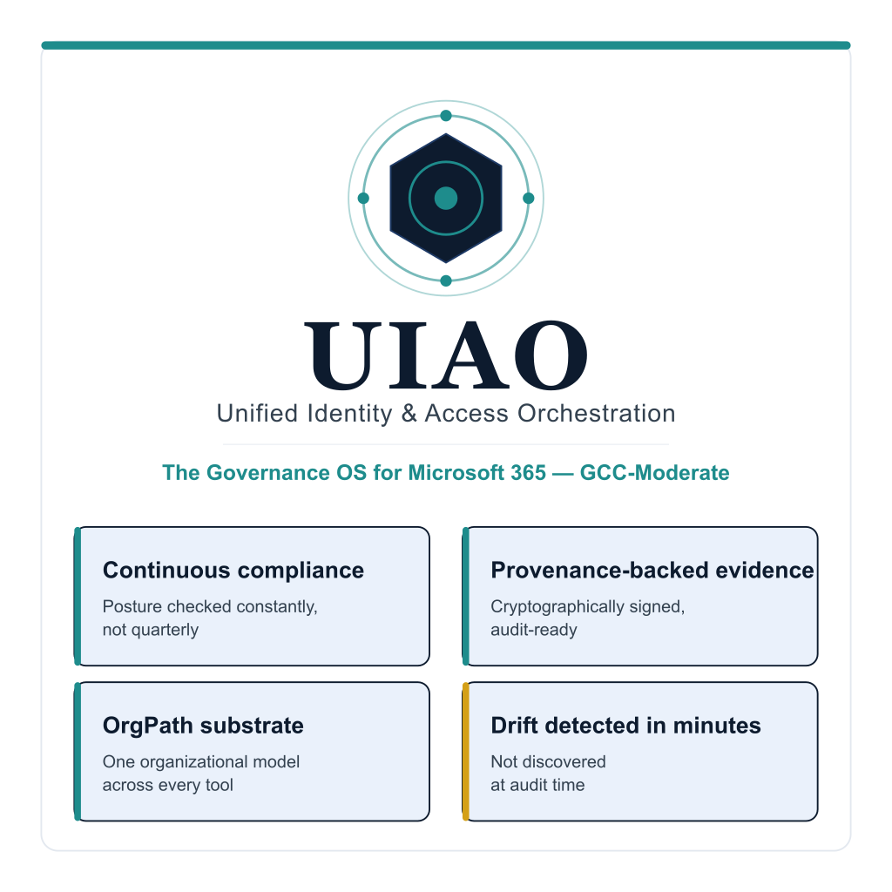

# Adapter Ecosystem Overview — Executive Brief

{fig-alt="High-level overview of the UIAO Governance OS — the substrate layer that adapters extend to reach incumbent identity, telemetry, policy, and enforcement systems." width="100%"}

UIAO is an **overlay**: it does not replace the platforms an agency already
runs. Adapters are how the governance substrate reaches those platforms —
reading their state, normalizing it into canon-keyed claims, and (where
authorized) pushing approved change back into them. The adapter set is governed
as canon, not as code that drifts on its own: every adapter is a registered
entry in one of two schema-validated registries, and no adapter merges without
passing the conformance gate.

## The dual-axis taxonomy (UIAO_003)

Every adapter declares two coordinates, defined in
[`UIAO_003`](../../../src/uiao/canon/UIAO_003_Adapter_Segmentation_Overview_v1.0.md):

- **`class`** — the *operational* axis: `modernization` (change-making) or
  `conformance` (read-only).
- **`mission-class`** — the *doctrinal* axis: `identity`, `telemetry`,
  `policy`, `enforcement`, or `integration`.

> *Adapters are plural in class but singular in mission: each class exists to
> serve SSOT + Identity + Security.* — UIAO_003

This is what keeps the ecosystem coherent as it grows. A new vendor integration
is never "just another connector" — it must declare what it changes (or that it
changes nothing) and which mission it serves, and those declarations are
enforced by schema and CI.

## Two registries, one schema

| Registry | Class | Role | Entries |
|---|---|---|---|
| [`adapter-registry.yaml`](../../../src/uiao/canon/adapter-registry.yaml) | conformance | Read-only assessors and telemetry observers | **29** |
| [`modernization-registry.yaml`](../../../src/uiao/canon/modernization-registry.yaml) | modernization | Change-making integrations | **19** |

Both registries are constrained by a single JSON Schema
([`adapter-registry.schema.json`](../../../src/uiao/schemas/adapter-registry/adapter-registry.schema.json)),
which requires every entry to declare `class`, `mission-class`, `status`, and
the four canon invariants every adapter must honor:

- `gcc-boundary: gcc-moderate` — operates inside the authorized boundary
  (named Commercial exceptions are encoded explicitly per adapter).
- `ssot-mutation: never` — an adapter never edits the canon itself.
- `certificate-anchored: true` — its records carry provenance back to a
  verified identity.
- `object-identity-only: true` — it acts on identified objects, not free-form
  blobs.

## What ships today

Of **48 registered adapters, 12 are active (shipped)**; the remaining entries
are *reserved* canonical names (design pending, activation gated on a
per-adapter ADR) or *proposed*.

**Conformance (read-only) — shipped:**

- `scubagear` — CISA ScubaGear M365 SCuBA assessor across seven workloads
  (Entra ID, Defender, Exchange Online, Power BI, Power Platform, SharePoint,
  Teams). See the [SCuBAGear integration whitepaper](../whitepapers/scubagear-integration-whitepaper.qmd).
- `uiao-git-server` — health and evidence telemetry for the self-hosted
  Windows Server 2025 / IIS Git service.

**Modernization (change-making) — shipped:** `entra-id`, `m365`,
`service-now`, `palo-alto`, `scuba`, `terraform`, `cyberark`, `infoblox`,
`bluecat-address-manager`, and `active-directory` (read-only OrgPath discovery
today per ADR-078 Model C).

Two adapters are reachable directly from the CLI today —
`uiao adapter run servicenow` and `uiao adapter run entra` — and ScubaGear
output is ingested with `uiao adapter run-scuba <report>`. The remaining
shipped adapters are exercised through the IR and evidence pipelines.

## How an adapter earns "active"

Status is not self-asserted. Per the adapter test strategy
([UIAO_131](../../../src/uiao/canon/specs/adapter-test-strategy.md)), an adapter
advances through three test tiers before its registry `status` may move toward
`active`:

| Test tier | Proves | Runs |
|---|---|---|
| **Tier 1** | Common-plane logic (API shape, auth, parsing) against a live commercial tenant | Nightly CI |
| **Tier 2** | GCC-Moderate-specific behavior against recorded contract fixtures | Every PR (`pytest`, zero network) |
| **Tier 3** | Behavior against a real reference GCC-Moderate tenant | Quarterly, exported as signed OSCAL evidence |

The [Adapter Conformance CI gate](../../../src/uiao/canon/specs/adapter-test-strategy.md)
validates both registries against the schema and runs the full conformance
criteria on every PR that touches an adapter; a single failure blocks merge.
Adapter capability is declared per the five-tier conformance model in
[ADR-076](https://github.com/WhalerMike/uiao/blob/main/src/uiao/canon/adr/adr-076-tier-conformance-model.md).

## Maturity snapshot

| Capability | Maturity |
|---|---|
| Dual-axis taxonomy + schema enforcement | **SHIPPED** |
| Conformance adapters (`scubagear`, `uiao-git-server`) | **SHIPPED** |
| Modernization adapters (10 active integrations) | **SHIPPED** |
| Adapter conformance CI gate (Tier 1/2 tests) | **SHIPPED** |
| Tier 3 reference-deployment validation | **TARGET** (per-adapter, agency-dependent) |
| Reserved adapter family (federal attribute services, Defender suite, etc.) | **RESERVED / DESIGN-ONLY** |

## Where to go deeper

- **[Adapter specs](../adapter-specs/index.qmd)** — one technical spec per
  adapter, frontmatter regenerated from canon on every sync.
- **[Validation suites](../validation-suites/index.qmd)** — adapter tests,
  evidence expectations, and drift procedures, paired 1:1 with each adapter.
- **[Reference architecture — Adapters](../reference-architecture/adapters.qmd)** —
  how adapters sit in the six-plane architecture.

## Leadership takeaway

UIAO's adapter ecosystem is governed, not improvised: a fixed taxonomy, two
schema-validated registries, and a CI gate that blocks any adapter from
claiming a status it has not earned through tiered testing. Twelve adapters ship
today across read-only assessment and change-making integration; the larger
reserved set is a published roadmap of named, canon-anchored slots — not a claim
of present capability — each activated only when its ADR and conformance tests
land.
