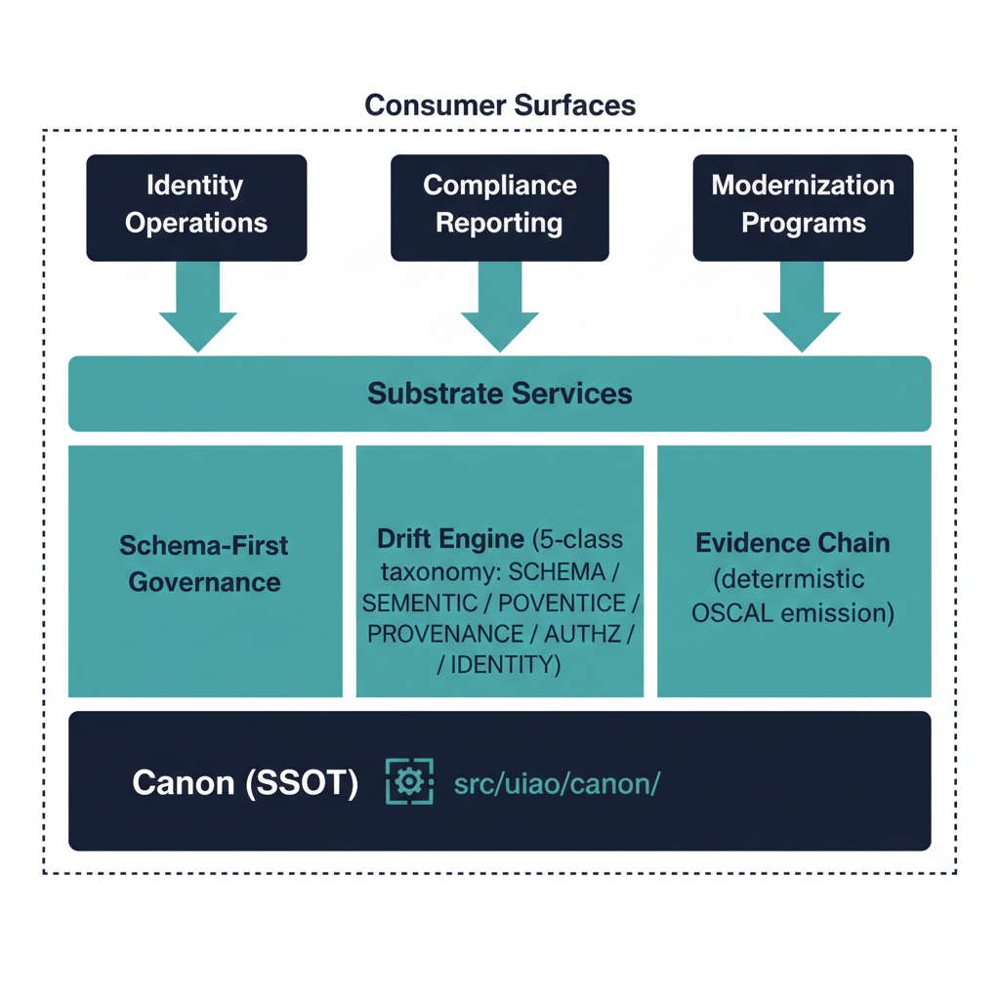

# Governance OS Overview — Executive Brief

UIAO is a **canon-anchored governance substrate** (not a standalone product)
that keeps identity, policy, and compliance operations tied to a single source
of truth and continuously drift-detected against that canon.

Federal modernization programs repeatedly hit the same failure mode: ICAM,
security telemetry, and compliance reporting run as separate tracks. Identity
context is fragmented across services, telemetry cannot be correlated into one
control narrative, and evidence is assembled as point-in-time reporting rather
than continuous, provenance-linked assurance.

{#fig-governance-os-overview-image-01 fig-alt="Bottom layer Canon (SSOT) labeled with \"src/uiao/canon/\" and a small registry icon. Middle layer Substrate Services with three lanes — Schema-First Governance, Drift Engine (5-class taxonomy: SCHEMA / SEMANTIC / PROVENANCE / AUTHZ / IDENTITY), Evidence Chain (deterministic OSCAL emission). Top layer Consumer Surfaces — three pillars: Identity Operations, Compliance Reporting, Modernization Programs. Each top-layer pillar reaches down with arrows to the substrate services. Clean engineering blueprint style, dark navy (#0D1B2E) and teal (#1E8C8C) color scheme on white background. No photographs, purely diagrammatic." width="85%"}

## What "governance OS" means in UIAO

UIAO operates underneath implementation tooling rather than alongside it.
Three substrate-wide principles, declared in
[`substrate-manifest.yaml`](../../../src/uiao/canon/substrate-manifest.yaml)
(UIAO_200), define the operating model:

1. **Single Source of Truth (SSOT).** Canonical governance artifacts under
   `src/uiao/canon/` define structure, policy intent, and registry authority
   exactly once. Downstream systems consume those artifacts via
   `importlib.resources` rather than duplicating policy logic.
2. **Canon-anchored evidence.** Every artifact the substrate produces — SSP,
   POA&M, KSI dashboards, component definitions — cites the canon document ID
   and version it derives from. Reviewers can trace from finding back to
   requirement deterministically.
3. **Drift is explicit.** Five-class taxonomy (`DRIFT-SCHEMA`,
   `DRIFT-SEMANTIC`, `DRIFT-PROVENANCE`, `DRIFT-AUTHZ`, `DRIFT-IDENTITY`)
   surfaces structural and provenance mismatch as first-class findings, not as
   exception reports. See
   [Drift Engine Overview](drift-engine-overview.qmd).

## What ships today

The substrate already enforces the operating model in CI:

- **Schema-first governance.** Five JSON schemas under `src/uiao/schemas/`
  validate every registry, manifest, and frontmatter edit on every PR
  (`schema-validation.yml`, `metadata-validator.yml`).
- **Substrate walker.** `uiao substrate walk` and `uiao substrate drift`
  emit structured findings for `DRIFT-SCHEMA` (module paths exist) and
  `DRIFT-PROVENANCE` (registry documents resolve). Both gate merges via
  `substrate-drift.yml`.
- **Adapter taxonomy.** Every adapter declares `class` (modernization /
  conformance) × `mission-class` (identity / telemetry / policy / enforcement
  / integration) per UIAO_003, registered in
  `adapter-registry.yaml` or `modernization-registry.yaml` and validated by
  `adapter-conformance.yml`.
- **Evidence pipeline.** OSCAL-native SSP, POA&M, KSI, and Component
  Definition generation, with deterministic regeneration tied to canon
  versions per ADR-006 and ADR-016.

## Maturity snapshot

| Capability | Maturity |
|---|---|
| Canon SSOT + schema gates | **SHIPPED** |
| Substrate drift detection (schema, provenance) | **SHIPPED** |
| OSCAL evidence generation (SSP, POA&M, KSI, CD) | **SHIPPED** |
| Adapter taxonomy + conformance CI | **SHIPPED** |
| Runtime semantic / authorization / identity drift | **TARGET / DESIGN-ONLY** |
| Continuous event-time evidence capture | **TARGET** |

For the authoritative shipped-vs-target view, see the
[UIAO Substrate Status](../../substrate-status.qmd) page.

## Leadership takeaway

UIAO delivers a disciplined governance operating model **today**:
schema-enforced canon, drift detection for shipped classes, a defined adapter
taxonomy, OSCAL-native evidence, and CI gates that block provenance and
structural regressions before merge. The same substrate defines target-state
runtime capabilities — additional drift classes, broader enforcement, and
continuous event-time evidence — which should be treated as roadmap intent
until promoted from TARGET / DESIGN-ONLY to shipped status.
