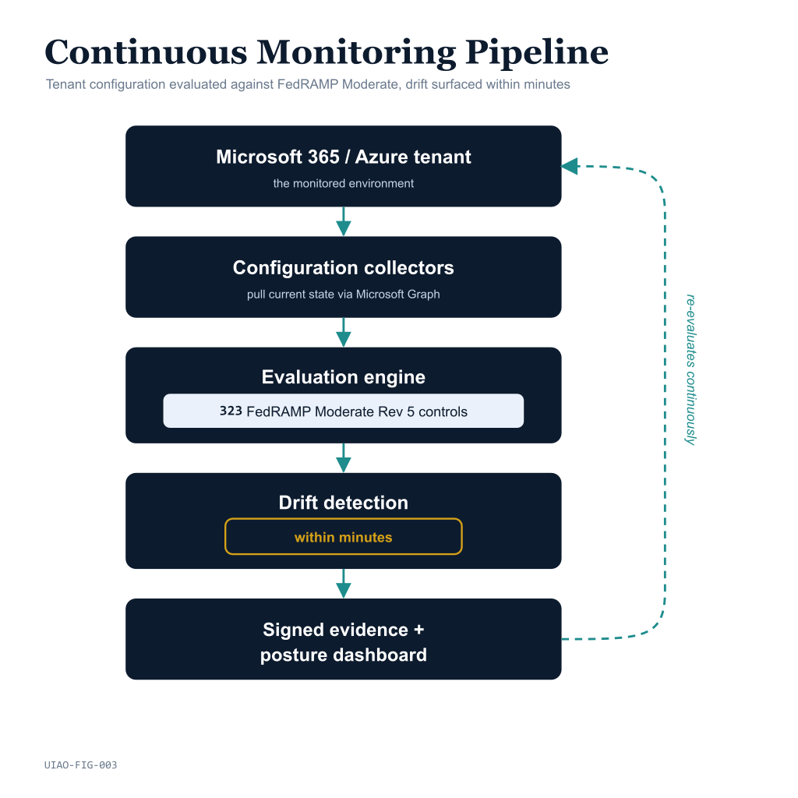

# KSI Conformance Overview — Executive Brief

{fig-alt="UIAO continuous monitoring pipeline evaluating tenant state against machine-checkable Key Security Indicators that sit above the NIST 800-53 control catalog." width="100%"}

Key Security Indicators (KSIs) are how UIAO turns a control catalog into
something a machine can check continuously. Where a traditional SSP narrates
*"control AC-2 is satisfied,"* a KSI is a **machine-readable, continuously
evaluated assertion** — pass, fail, error, or stale — backed by hashed evidence.
KSIs sit *above* the NIST SP 800-53 Rev 5 controls and map down to them, which
is the model FedRAMP 20x is moving the program toward.

## What UIAO ships: a governed KSI corpus

The substrate carries **more than 190 KSI rules across eleven families**, each a
versioned file under [`src/uiao/rules/ksi/`](../../../src/uiao/rules/ksi/) and
schema-validated like any other canon artifact:

| Family | Covers |
|---|---|
| `iam` | Access control & identity (AC, IA) — 28 rules |
| `planning-personnel` | Org readiness, vetting, planning — 42 rules |
| `monitoring-logging` | Audit & system integrity (AU, SI) — 22 rules |
| `boundary-protection` | System & comms protection (SC) — 14 rules |
| `configuration-management` | Configuration management (CM) — 11 rules |
| `incident-response` | Incident response (IR) — 8 rules |
| `hrit-reciprocity` | Single-ATO reciprocity (KSI-RECIP-001..008) |
| `orgtree-readiness`, `cyberark`, `servicenow`, `other` | Readiness, adapter-specific, and cross-cutting indicators |

Each rule declares a security objective, explicit pass criteria, and the NIST
controls it relates to — so a finding traces from indicator to control to
evidence deterministically.

## What ships today: the evaluation engine

`uiao ksi evaluate` is the shipped CLI surface. It is the Plane 2 step of the
UIAO pipeline: it takes an IR envelope (produced by Plane 1 adapter transforms),
evaluates it against the KSI corpus, and emits a canonical KSI result JSON:

```bash
uiao ksi evaluate --ir ./output/ir/tenant-a.ir.json \
                  --out ./output/ksi/tenant-a.ksi.json
```

The result carries a summary (`total_ksis`, `passed`, `failed`, `error`,
`stale`, `coverage_percentage`) and a per-KSI breakdown with evidence and drift
indicators. The engine is deliberately **pure and deterministic** — same inputs,
same result — and is covered by 40+ hermetic tests. KSI results feed the
evidence bundle ([`evidence-bundle.schema.json`](../../../src/uiao/schemas/ksi/evidence-bundle.schema.json)),
which emits OSCAL observation objects for assessor consumption.

> **Honest scope note.** Reporting is *not* a standalone `ksi report` command
> today — KSI results surface through the IR / ConMon pipeline (`conmon
> dashboard`, `ir` governance reports), which render the evaluated results.

## FedRAMP 20x alignment: a tagging discipline, not a rewrite

Per [ADR-047](https://github.com/WhalerMike/uiao/blob/main/src/uiao/canon/adr/adr-047-fedramp-20x-integration.md)
and [UIAO_133](../../../src/uiao/canon/specs/fedramp-20x-integration.md), KSI
emission is designed as a **tag on the existing OSCAL pipeline**, not a second
evidence path: generated artifacts carry `fedramp:ksi-themes`,
`ksi-mapping-source`, and `ksi-freshness-cadence` metadata. This keeps a single
source of evidence while making it consumable in the KSI-themed form FedRAMP 20x
expects.

## Maturity snapshot

| Capability | Maturity |
|---|---|
| KSI rule corpus (190+ rules, 11 families) | **SHIPPED** |
| `uiao ksi evaluate` engine + result schema | **SHIPPED** |
| Evidence bundle → OSCAL observation emission | **SHIPPED** |
| KSI-RECIP reciprocity family (8 rules) | **SHIPPED** |
| FedRAMP 20x KSI-theme tagging (ADR-047) | **TARGET / DESIGN** (ADR-047 proposed) |
| Full CR26 KSI-control coverage | **PARTIAL** (corpus authored against the SCuBA M365 surface first) |

## Where to go deeper

- **[Evidence Fabric Overview](evidence-fabric-overview.qmd)** — how KSI results
  become signed, reproducible evidence.
- **[Architecture Series — Evidence Chain](../architecture-series/evidence-chain.qmd)** —
  the event → claim → OSCAL lineage KSIs ride on.
- **[Reciprocity & Single-ATO Overview](reciprocity-single-ato-overview.qmd)** —
  where the KSI-RECIP family does its work.

## Leadership takeaway

UIAO already ships the part of FedRAMP 20x that is hardest to fake: a governed
corpus of machine-checkable indicators and a deterministic engine that evaluates
a tenant against them and emits OSCAL-mapped evidence. The remaining work is
breadth (full CR26 coverage) and the FedRAMP-20x KSI-theme tagging layer — both
roadmap items, not blockers to using KSI evaluation for continuous assurance
today.
