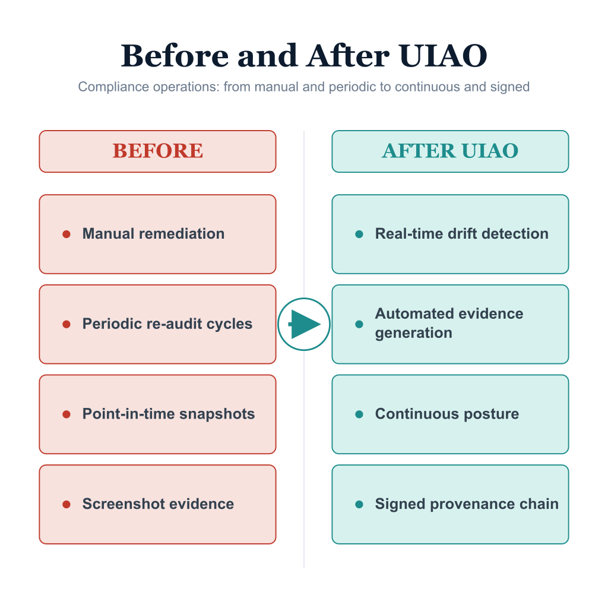

# Reciprocity & Single-ATO Overview — Executive Brief

{fig-alt="Before: each consuming agency repeats its own authorization. After: one controlling ATO with signed per-agency reciprocity records under a single source of evidence." width="100%"}

The Single-ATO Reciprocity Model answers a specific federal problem: when one
platform (for example, an OPM-operated HRIT service) is consumed by many
agencies, do you re-authorize it N times, or once? UIAO's canon
([ADR-054](https://github.com/WhalerMike/uiao/blob/main/src/uiao/canon/adr/adr-054-single-ato-reciprocity.md))
is unambiguous: **one System Security Plan, one controlling Authority to Operate,
covering all consuming agencies**, with per-agency differences expressed as
*configuration latitude* rather than separate SSPs or POA&Ms.

> *This solution will have a single authoritative ATO covering all customers* —
> agency differences are handled via configuration, not per-agency forks.

## How reciprocity is recorded

Per [UIAO_140](../../../src/uiao/canon/specs/single-ato-reciprocity-model.md),
each consuming agency receives a **signed reciprocity record** — not a new
authorization, but a cryptographic acknowledgement that it operates under the
controlling ATO. UIAO ships the full operational surface today:

| Command | What it does |
|---|---|
| `uiao reciprocity onboard-agency` | Emits a signed (HMAC-SHA256) reciprocity record for a consuming agency, citing the controlling ATO and its legal basis |
| `uiao reciprocity list-records` | Enumerates records and computes Active/Expired status against current time |
| `uiao reciprocity verify` | Verifies a record's HMAC signature |
| `uiao conmon ato-cadence-check` | Enforces the SSP/reauthorization SLAs (draft ≤30d, final ≤45d, reauth ≥30d before expiry) |

Each record names the controlling ATO, the consuming agency, the legal basis
(e.g. FedRAMP Rev 5, OMB M-24-15, FISMA §3554), and the agency's configuration
elections — and is anchored as an `ato-decision → reciprocity-record` edge in the
evidence graph (UIAO_113 v1.2).

## Self-verifying per-agency bundles

A consuming agency's authorizing official should not need UIAO access — or even
a network connection — to trust their evidence. The per-agency reciprocity
bundle (UIAO_140 §7) packages the reciprocity record, scoped component
definition, assessment results, and a hashed manifest so the bundle
**self-verifies with nothing but the Python standard library**. Tampering with
any file breaks the manifest hash.

## Configuration latitude is drift-governed

"Configuration-only differentiation" is not a loophole. Each agency's elections
are bounded by the SSP's latitude table, and deviations surface as first-class
[drift findings](drift-engine-overview.qmd): a configuration the SSP forbids is a
`DRIFT-AUTHZ` P1; an unrecognized tenant principal is a `DRIFT-IDENTITY` P1.
Eight KSIs (**KSI-RECIP-001..008**) continuously check the program's health —
legal-basis citation, controlling-ATO linkage, no silent expirations, SSP cadence
(KSI-RECIP-005), the 30-day reauthorization window (KSI-RECIP-006), and bundle
signature integrity.

## The honest trade-off

Single-ATO reciprocity concentrates risk by design: a single authoritative ATO
is the point of leverage *and* the single point of failure. **If the controlling
ATO lapses, every consuming agency is affected simultaneously.** That is exactly
why the cadence SLAs and the KSI-RECIP reauthorization indicators exist — the
model trades distributed redundancy for centralized rigor, and the rigor has to
be continuously proven.

## Maturity snapshot

| Capability | Maturity |
|---|---|
| Reciprocity doctrine (ADR-054) + model spec (UIAO_140) | **SHIPPED** (canon) |
| `reciprocity` CLI (onboard-agency / list-records / verify) | **SHIPPED** |
| Signed record emitter + self-verifying bundle | **SHIPPED** |
| `conmon ato-cadence-check` SLA validator | **SHIPPED** |
| KSI-RECIP-001..008 indicators | **SHIPPED** |
| Evidence graph ATO-decision / reciprocity-record nodes | **SHIPPED** |
| End-to-end OSCAL SSP/POA&M reciprocity output profile | **TARGET** (canon-defined; emission deferred per ADR-054) |

## Where to go deeper

- **[Federal HRIT Productization whitepaper](../whitepapers/federal-hrit-productization.qmd)** —
  the primary narrative: how authoritative HR events flow into Entra ID under a
  single ATO, with reciprocity as a byproduct of normal operations.
- **[KSI Conformance Overview](ksi-conformance-overview.qmd)** — the KSI-RECIP
  family in context.
- **[Evidence Fabric Overview](evidence-fabric-overview.qmd)** — the signing and
  provenance substrate the bundles rely on.

## Leadership takeaway

UIAO turns reciprocity from a paperwork promise into a cryptographic, continuously
monitored fact: one ATO, signed per-agency records that auditors can verify
offline, configuration latitude bounded by drift detection, and eight standing
indicators on program health. The remaining gap is the full OSCAL SSP/POA&M
reciprocity output profile — defined in canon, deferred in emission — so treat
the *evidence and verification* path as shipped and the *generated authorization
package* as roadmap.
