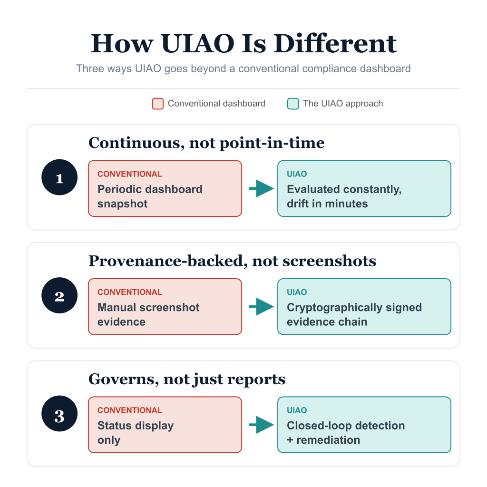

# Universal-Enterprise Positioning — Executive Brief

{fig-alt="UIAO differentiators — a vertical-agnostic governance engine with canon, schemas, drift taxonomy, and adapters, on top of which compliance frameworks ship as adapter packs." width="100%"}

UIAO is frequently mistaken for a federal compliance tool. It is not. UIAO is a
**universal-enterprise governance substrate** — a vertical-agnostic engine of
drift-detected canon, schema-enforced adapters, and provenance-anchored
evidence. Federal compliance (FedRAMP Moderate Rev 5, OSCAL, KSI, [BOD 25-01](https://cyber.dhs.gov/bod/25-01/),
CISA SCuBA) is the **most mature vertical adapter pack** running on that engine —
not the engine itself.

This distinction is canon. Per
[ADR-085](https://github.com/WhalerMike/uiao/blob/main/src/uiao/canon/adr/adr-085-universal-enterprise-positioning.md):

> *Any reference to "FedRAMP", "federal", "agency", "GCC", or "CISA" in a
> description of the **core** is a positioning bug.*

## Engine vs. vertical: where the line sits

| Layer | What it is | Vertical-specific? |
|---|---|---|
| **Core engine** | Identity-Addressing-Overlay, canon SSOT, JSON schemas, the five-class drift taxonomy, the adapter framework, the evidence pipeline | **No** — vertical-agnostic |
| **Vertical adapter pack** | Conformance + modernization adapters and rule packs that bind the engine to a specific control regime | **Yes** |

The three universal principles in
[`substrate-manifest.yaml`](../../../src/uiao/canon/substrate-manifest.yaml)
(UIAO_200) — Single Source of Truth, Canon-Anchored Evidence, and Drift Is
Explicit — apply at every conformance tier with no vertical scoping. They
describe how the engine governs *anything*, not how it governs a federal tenant.

## The federal vertical is first-class — and it is a vertical

Being "a vertical" is not a demotion. The federal pack:

- has the **most adopters**,
- drives the **most CI coverage**, and
- is the **most mature** of any vertical UIAO ships.

What ADR-085 fixes is the *category error* of describing the core as
federal-scoped. The same engine, with a different adapter pack, is designed to
govern:

- **Commercial-regulated** environments — PCI-DSS, HIPAA, SOC 2 Type II
- **State / local government** — StateRAMP
- **Generic enterprise IT-governance** — ISO 27001, NIST CSF

## Honest maturity: one vertical shipped, the rest reserved

| Vertical adapter pack | Status |
|---|---|
| **Federal** (FedRAMP, OSCAL, KSI, SCuBA, BOD 25-01) | **SHIPPED** — active adapters, rule packs, OSCAL pipeline, KSI library |
| Commercial-regulated (PCI-DSS / HIPAA / SOC 2) | **RESERVED / ASPIRATIONAL** |
| State / local (StateRAMP) | **RESERVED / ASPIRATIONAL** |
| Generic enterprise (ISO 27001 / NIST CSF) | **RESERVED / ASPIRATIONAL** |

The non-federal packs are named future work in ADR-085; each requires its own
ADR and a `verticals-registry.yaml` that has not yet been created. Leadership
should read the universal positioning as **architectural intent, proven once in
federal** — not as a claim that three more verticals ship today.

## Boundary discipline travels with the vertical

The current deployment boundary — GCC-Moderate (Microsoft 365 SaaS) — is a
property of the *federal* vertical's deployment today, **not** of the core
engine. Even within it, exceptions are explicit: the `gcc-boundary` schema enum
admits only `gcc-moderate` plus two named, ADR-authorized Commercial carve-outs
(Amazon Connect, and SailPoint NERM per
[ADR-059](https://github.com/WhalerMike/uiao/blob/main/src/uiao/canon/adr/adr-059-sailpoint-adapter-family.md)).
New verticals will introduce their own boundary enums under their own ADRs.

## Where to go deeper

- **[Governance OS Overview](governance-os-overview.qmd)** — the engine's
  operating model and universal principles.
- **[Adapter Ecosystem Overview](adapter-ecosystem-overview.qmd)** — how
  vertical packs are built as registered, schema-validated adapters.
- **[UIAO Executive Brief](uiao-executive-brief.qmd)** — the federal scenario
  told end to end.

## Leadership takeaway

UIAO's value is not that it does federal compliance — it is that it does
*governance* as an engine, and federal compliance is the proof. Procuring UIAO
for a federal program buys the most mature vertical today; it also buys a
substrate whose canon, schemas, drift taxonomy, and adapter framework are
deliberately vertical-agnostic, so the same investment extends to commercial,
state/local, and generic-enterprise governance as those packs are authorized.
