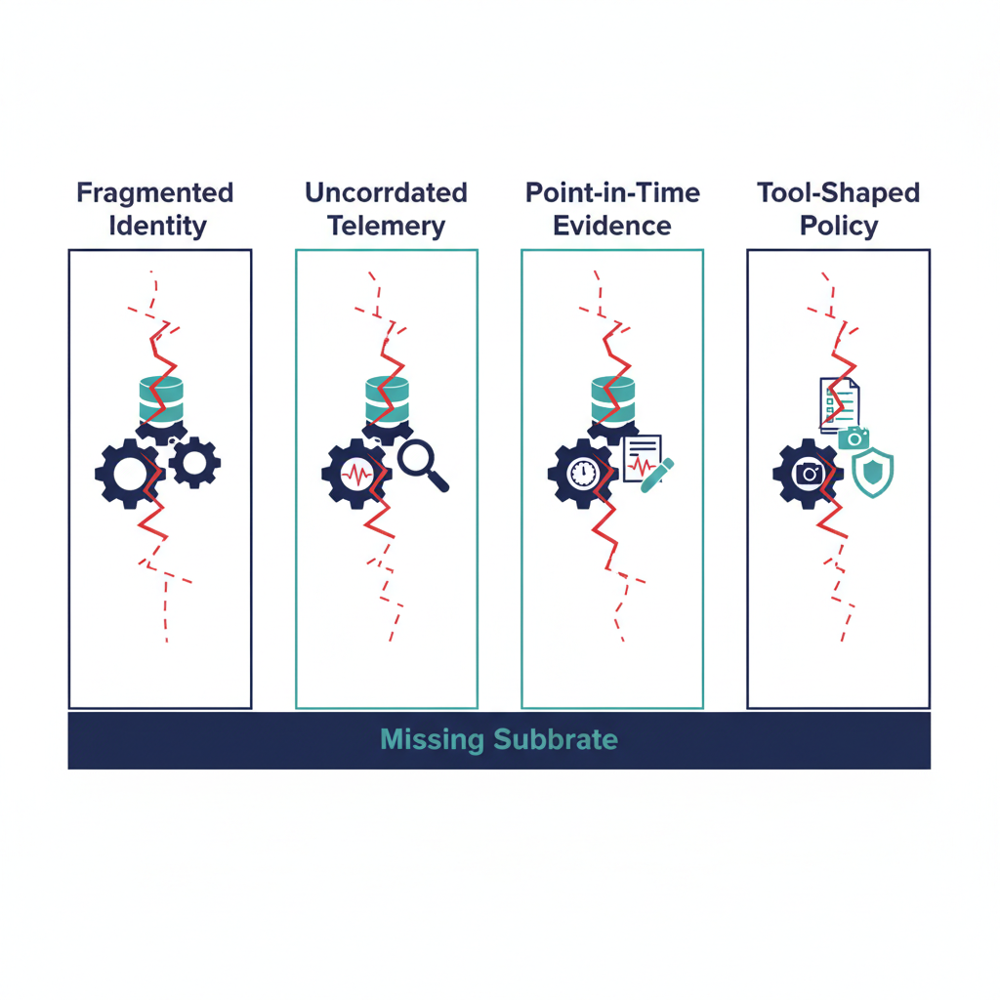

# Why Governance Fails

## Overview

Federal IT governance fails for structural reasons, not for lack of effort.
This chapter names the failure modes — fragmented identity context,
uncorrelated telemetry, point-in-time evidence, and tool-shaped policy —
and explains why each is a *substrate* problem rather than a tool problem.
The chapters that follow build the substrate-level response.

{#fig-index-image-01 fig-alt="Four vertical columns labeled Fragmented Identity, Uncorrelated Telemetry, Point-in-Time Evidence, Tool-Shaped Policy — each shows a tool-stack icon with broken connections (red dashes). Below the silos, a horizontal bar labeled \"Missing Substrate\" emphasizes the absent connecting layer. Clean engineering blueprint style, dark navy (#0D1B2E) and teal (#1E8C8C) on white background, with red (#C74040) reserved for the broken connections. No photographs, purely diagrammatic." width="85%"}

## The four structural failure modes

### Fragmented identity context
Identity claims live in a primary directory but are *consumed* by every
other plane — addressing, network, telemetry, security, compliance — and
each consumer holds its own freshness assumption. The same identity may
be "current" in pillar A and "stale" in pillar B at the same instant.
Cross-pillar decisions degrade to lowest-common-denominator attestation
because there is no canonical resolution moment.

### Uncorrelated telemetry
Each tool emits telemetry in its own shape. Combining the streams into a
single control narrative is a *manual* exercise repeated at every audit
cycle. The combination is not reproducible from raw telemetry plus canon
— it is reproducible only from the combination itself, which is never
shipped as a primary artifact.

### Point-in-time evidence
SSPs, POA&Ms, and 3PAO evidence packages capture a snapshot at the
moment of assembly. Between assemblies, drift is invisible to the
package. Re-assembly is a re-engineered exercise rather than a
deterministic regeneration.

### Tool-shaped policy
Policy intent gets recorded *in* the tool that enforces it. Move the
tool, lose the policy. Replace the vendor, re-author the policy.
Migrate to a new platform, re-discover the policy from a thousand
configuration files. The intent never had a canonical home, so it
cannot survive a substrate transition.

## Why "more tooling" cannot fix it

Each failure mode looks like a tooling gap. None of them is. The
identity-context problem is not solved by a better directory; it is
solved by canonical resolution rules that cross all pillars. The
telemetry-correlation problem is not solved by a better SIEM; it is
solved by a canonical claim shape that every adapter emits before it
hits a SIEM. The evidence problem is not solved by a better GRC tool;
it is solved by deterministic regeneration from canon plus telemetry.
The policy-shape problem is not solved by a better policy engine; it
is solved by separating policy intent (canon) from policy mapping
(registry) from policy enforcement (runtime).

The common factor: *every fix lives below the tooling layer*. Without a
substrate, the program rebuilds the same fixes per tool, per migration,
per audit cycle.

## What this chapter does not claim

It does not claim agencies are unsophisticated. The teams running
federal modernization programs are typically capable and well-resourced.
The failure modes here are not personnel failures — they are structural
properties of an environment that has tooling but lacks a substrate.

It also does not claim UIAO is the only possible substrate. It claims
that *some* substrate is required, and that the four failure modes
above are the diagnostic list a program can use to assess whether its
current substrate is sufficient.

## Where this leads

The remaining chapters address the failure modes in turn:

- **Chapter 2** — the compliance paradox that follows from point-in-time
  evidence.
- **Chapter 3** — drift as the primary operational threat once the
  failure modes accumulate.
- **Chapter 4** — what deterministic governance looks like as a response.
- **Chapter 5** — the adapter model that ties tools into a substrate.
- **Chapter 6** — evidence over attestation.
- **Chapter 7** — operational tempo at substrate-level governance.
- **Chapter 8** — scaling the model across programs.
- **Chapter 9** — the synthesis: governance as an operating system.

## Key takeaways

- Federal governance failure is structural, not procedural.
- Four failure modes recur: fragmented identity, uncorrelated telemetry,
  point-in-time evidence, tool-shaped policy.
- Each failure mode lives below the tooling layer; tooling cannot fix
  any of them.
- A substrate is required; UIAO is one realization of such a substrate,
  and the rest of this series describes its shape.

## Related documents

- [Executive Governance Series Index](../index.html)
- [Governance OS Canonical Suite](../governance-os-canonical-suite.qmd)
- [Document Index](../../document-index.html)
