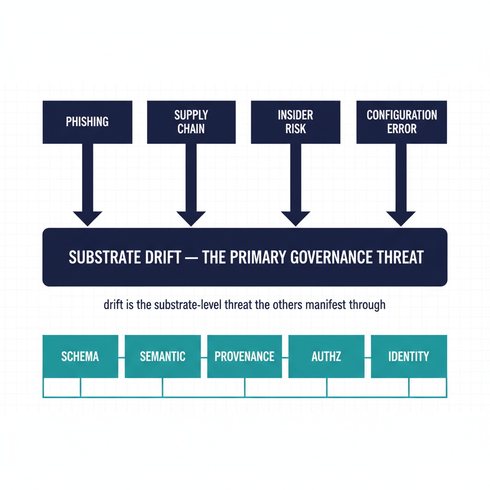

# Drift as the Primary Threat

## Overview

In a substrate-anchored governance model, **drift is the single largest
threat vector**. Not phishing, not supply chain, not insider risk —
those are concerns the substrate helps surface, but the *governance*
threat is the one most agencies track least: silent divergence between
declared canon and observed runtime. This chapter explains why drift
deserves first-class status, how UIAO classifies it, and what it
changes operationally.

{#fig-index-image-01 fig-alt="A central dark navy bar labeled \"Substrate Drift — the primary governance threat\" anchors the page. Above it, four smaller threat categories (phishing, supply chain, insider risk, configuration error) shown as boxes with arrows pointing down at the central bar — indicating \"drift is the substrate-level threat the others manifest through\". Below the central bar, the five UIAO drift classes (SCHEMA, SEMANTIC, PROVENANCE, AUTHZ, IDENTITY) shown as a horizontal taxonomy strip in teal. Clean engineering blueprint style, dark navy (#0D1B2E) and teal (#1E8C8C) on white background. No photographs, purely diagrammatic." width="85%"}

## Why drift is the primary threat

Three properties make drift the substrate-level threat:

1. **It is continuous.** Drift accumulates every time a configuration
   changes, an adapter version updates, a schema evolves, or an
   identity is provisioned. Other threats are events; drift is a
   persistent gradient.
2. **It is silent.** Without explicit detection, drift has no
   operational signal. The substrate continues to report the declared
   state while runtime reality diverges.
3. **It is the surface other threats exploit.** A phishing attack
   succeeds because drift opened a permission path. A supply-chain
   compromise propagates because drift hid the canonical version. An
   insider acts because drift attenuated the consent envelope.

The substrate-level fix is not "watch for the events" — it is "make
drift itself a first-class signal so the events have nowhere to hide."

## The five-class taxonomy

UIAO names the failure modes exactly. From
[`16_DriftDetectionStandard.qmd`](../../../docs/16_DriftDetectionStandard.qmd):

| Class | What it means |
|---|---|
| `DRIFT-SCHEMA` | Claim structure no longer matches canonical schema |
| `DRIFT-SEMANTIC` | Structure valid; meaning is stale or inconsistent |
| `DRIFT-PROVENANCE` | Provenance envelope incomplete or chain broken |
| `DRIFT-AUTHZ` | Action emitted outside authorized consent envelope |
| `DRIFT-IDENTITY` | Issuer cannot be resolved to a verified identity-plane object |

Five is not a number arrived at by abstraction. Each class corresponds
to a distinct failure mode that requires a distinct remediation
contract. Collapsing them into "configuration drift" loses the
ability to assign deterministic severity. See
[Architecture Series — Drift Engine](../../architecture-series/drift-engine.qmd)
for the architectural depth.

## From taxonomy to operational discipline

Naming the classes is not enough. The substrate's operational
discipline is:

1. **Detect deterministically.** `uiao substrate walk` runs in CI on
   every PR and emits SCHEMA + PROVENANCE findings. Runtime adapters
   emit SEMANTIC + AUTHZ + IDENTITY findings as they execute.
2. **Classify deterministically.** Severity is a pure function of
   class plus liveness — operators do not triage.
3. **Remediate via contract.** Every drift event emits a remediation
   contract (timestamps, action, evidence hash, escalation path) that
   flows into the canonical evidence chain.
4. **Treat findings as evidence.** Drift findings are not a
   parallel log; they are first-class artifacts in the SSP / POA&M /
   KSI emissions.

This shifts drift from "operations problem" to "governance signal."
The AO sees drift as part of the package; the SOC sees it as part of
the operational picture; the canon stewards see it as the input to
the next ADR.

## What changes for the SOC

In the attestation model, the SOC discovers drift through outage,
incident, or audit. In the substrate model, the SOC consumes drift as
a structured stream:

- **P1 findings** halt and alert immediately — typically authorization
  or identity drift.
- **P2 findings** auto-remediate when deterministic; otherwise
  escalate within an hour.
- **P3/P4 findings** queue for auto-remediation within 24/72 hours.

The SOC's work shifts from "find drift" to "tune the classifier and
respond to escalations." Most drift is auto-remediated by the
adapter that detected it; only the human-judgment subset reaches
the SOC.

## What changes for the AO

For the authorizing official, the substrate-level treatment of drift
delivers:

- **Visibility between audits** — drift findings are continuous, not
  audit-cycle.
- **Deterministic severity** — the AO can rely on P1/P2/P3/P4
  classification without re-evaluating.
- **Per-finding evidence** — every finding carries a remediation
  contract with hash-verifiable provenance.
- **Trend analysis** — drift findings over time are a measurable
  property of program health.

This changes the AO's posture from periodic re-authorization to
continuous monitoring of a deterministic signal.

## Honest limits

- Today, schema and provenance drift ship in CI; semantic,
  authorization, and identity drift detection at runtime is partial
  to design-only across the adapter fleet. Coverage is growing, not
  complete.
- Auto-remediation is bounded to *deterministic* fixes. Drift that
  requires human judgment escalates rather than auto-remediates.
- The substrate detects drift against canon. If canon is silently
  wrong, the substrate will faithfully report no drift.

## Key takeaways

- Drift is the primary governance threat, not a secondary concern.
- The five-class taxonomy is canonical and deterministic.
- Detection ships today for SCHEMA + PROVENANCE in CI; runtime
  detection of the other three is partial.
- The discipline is detect → classify → remediate via contract →
  emit as evidence.
- For the AO, drift findings are a continuous signal between audits.

## Related documents

- [Executive Governance Series Index](../index.html)
- [Chapter 4: Deterministic Governance](../ch04-deterministic-governance/index.qmd)
- [Architecture Series — Drift Engine](../../architecture-series/drift-engine.qmd)
- [Drift Detection Standard (canon)](../../../docs/16_DriftDetectionStandard.qmd)
