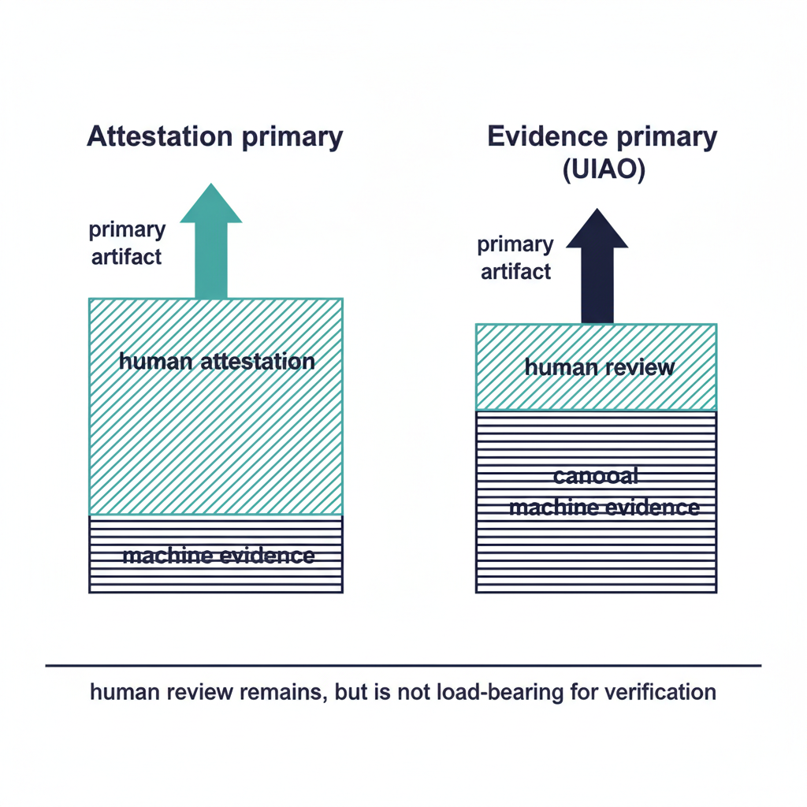

# Evidence over Attestation

## Overview

Attestation is a human signing that something is true. Evidence is a
machine-verifiable artifact showing that it is. UIAO's substrate
treats evidence as the primary artifact and attestation as a
supplemental layer rather than the other way around. This chapter
explains why the inversion matters and what changes operationally.

{#fig-index-image-01 fig-alt="Two parallel vertical stacks. Left stack labeled \"Attestation primary\" shows a thin \"machine evidence\" base topped by a thick \"human attestation\" cap; an arrow shows the human cap as the primary artifact. Right stack labeled \"Evidence primary (UIAO)\" shows a thick \"canonical machine evidence\" base with a thin \"human review\" cap; an arrow shows the evidence base as the primary artifact. A footer line emphasizes \"human review remains, but is not load-bearing for verification\". Clean engineering blueprint style, dark navy (#0D1B2E) and teal (#1E8C8C) on white background. No photographs, purely diagrammatic." width="85%"}

## What attestation is and is not

An attestation is a person (or a designated body) signing that, at a
moment, a system is in a stated condition. It is necessary for some
purposes — accountability, formal authorization, legal liability —
and the substrate does not eliminate it.

What attestation is *not*:

- A reproducible verification of substrate truth.
- A continuous signal between attestation events.
- A hash-bound proof an assessor can re-execute.

Treating attestation as the primary artifact pushes those three
properties out of the package. The substrate inverts the priority:
machine evidence is primary, attestation is the human review wrapper
on top.

## What "evidence" means in canon

Per [`15_ProvenanceProfile.qmd`](../../../docs/15_ProvenanceProfile.qmd),
every claim emitted into the substrate carries the full provenance
envelope: claim_id, issuer_identity, source_classification, extraction
timestamp and method, transformation_chain, lineage_hash, schema_version,
signature.

Two structural properties of this envelope matter for the
"evidence over attestation" position:

1. **`source_classification` is canonical.** A claim is
   `authoritative`, `derived`, or `synthesized`. The classification
   is verifiable by re-executing the adapter; it is not an
   operator's judgment call.
2. **`transformation_chain` is append-only.** Once a step is recorded
   and signed, it cannot be removed or reordered. Re-execution that
   would produce a different chain is itself a `DRIFT-PROVENANCE`
   finding.

These properties make machine evidence *better* than attestation for
verification, not just *cheaper*. An assessor can re-execute and
verify; an attestation can only be re-read.

## What changes for the assessor

A 3PAO assessing a UIAO-anchored package gets four properties they
cannot get from an attestation package:

- **Independent re-execution** — they re-run the OSCAL pipeline and
  verify the bundle hash matches.
- **Per-claim source classification** — authoritative claims are
  distinguished from derived at the field level.
- **Tamper-evident lineage** — modification anywhere breaks the
  bundle hash.
- **Drift-coupled remediation** — a `DRIFT-PROVENANCE` finding from
  the [Drift Engine](../../architecture-series/drift-engine.qmd)
  identifies the affected claim(s) directly.

Attestations remain in the package. They are no longer the primary
verification surface — they are the human accountability wrapper on
top of a machine-verifiable substrate.

## What changes for the operator

For the operator, the substrate-level evidence-first posture changes:

- **Evidence is regenerable.** The team does not have to preserve
  point-in-time bundles indefinitely; they regenerate from canon
  plus archived inputs.
- **Attestation work shrinks.** Humans attest at the canon-change
  ADR layer, not per-control-per-cycle.
- **Audit-prep cost drops.** Bundles assemble deterministically; the
  operator does not re-engineer the package per audit.

The work shifts from "produce the package" to "keep the substrate
truthful so the package emits correctly."

## What does not change

Three properties intentionally remain:

- Authorizing officials still authorize. The substrate emits evidence;
  it does not replace the AO's judgment.
- Canon stewards still author canon, and ADRs still go through
  governance review. Determinism is faithful to canon, not a check
  on it.
- Humans still review evidence at audit boundaries. The review
  becomes a higher-leverage activity (canon and ADRs) rather than a
  lower-leverage one (line-item attestation).

## Honest limits

- The substrate does not eliminate attestation. It changes what gets
  attested and at what frequency.
- Adapters that have not yet implemented continuous evidence emission
  fall back to interval evidence (e.g. SCuBAGear); interval evidence
  is still deterministic per interval, but is not continuous.
- Cryptographic signing of evidence with agency-issued certificates
  is design-only today; the envelope reserves the field, but full
  end-to-end signing across all adapters is target state.

## Key takeaways

- Attestation and evidence are different artifacts; the substrate
  inverts which is primary.
- The provenance envelope makes evidence reproducibly verifiable in a
  way attestations cannot be.
- For the assessor, verification becomes a re-run.
- For the operator, audit-prep cost drops; canon-change discipline
  becomes the primary review surface.
- Honest limits remain around continuous capture and signing
  maturity.

## Related documents

- [Executive Governance Series Index](../index.html)
- [Chapter 4: Deterministic Governance](../ch04-deterministic-governance/index.qmd)
- [Architecture Series — Evidence Chain](../../architecture-series/evidence-chain.qmd)
- [Provenance Profile (canon)](../../../docs/15_ProvenanceProfile.qmd)
