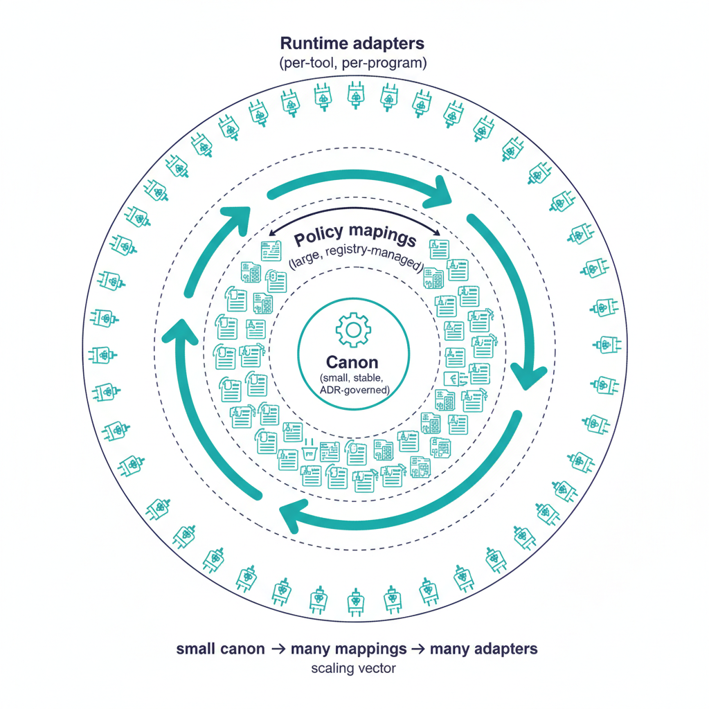

# Governance at Scale

## Overview

Substrate-level governance has to scale across hundreds of adapters,
thousands of controls, multiple authorization boundaries, and many
concurrent modernization programs without devolving into per-program
exceptions. This chapter explains how UIAO's substrate scales — what
it deliberately keeps small, what it lets grow, and why the scaling
properties are structural rather than operational.

{#fig-index-image-01 fig-alt="Three concentric layers. Innermost (small) layer labeled \"Canon (small, stable, ADR-governed)\" with a single tight ring. Middle layer labeled \"Policy mappings (large, registry-managed)\" with a broader ring filled with many small registry-entry icons. Outermost layer labeled \"Runtime adapters (per-tool, per-program)\" with the broadest ring filled with adapter icons fanning outward. Arrows indicate \"small canon → many mappings → many adapters\" as the scaling vector. Clean engineering blueprint style, dark navy (#0D1B2E) and teal (#1E8C8C) on white background. No photographs, purely diagrammatic." width="85%"}

## What stays small

Three substrate properties are deliberately kept small at scale:

1. **Canon.** The canonical document set is small — schemas, ADRs,
   numbered governance documents under `src/uiao/canon/`. Adding a
   document requires a UIAO_NNN allocation and (for doctrinal
   changes) an ADR. The substrate is designed so canon does not
   linearly inflate with the program.
2. **The drift taxonomy.** Five classes, not fifty. Severity is four
   levels, not twelve. Adding a class would require an ADR and
   substrate-wide schema migration.
3. **The CLI surface.** Sub-app structure (per ADR-046) means new
   commands live under existing domains; no flat top-level commands.
   The CLI's shape is invariant under feature growth.

These three are the substrate's stability anchors.

## What is allowed to grow

Three substrate properties are designed to grow:

1. **Adapters.** New adapters land in `adapter-registry.yaml` or
   `modernization-registry.yaml` with schema validation. The
   registries are append-only at the structural level (retirement is
   a state, not a deletion).
2. **Policy mappings.** KSI mappings, control-to-rule bindings,
   adapter-to-mission-class declarations grow with the substrate's
   coverage of an agency's tool stack.
3. **Evidence emissions.** OSCAL artifacts, KSI dashboard entries,
   Component Definitions, drift findings — these grow continuously as
   the substrate runs.

Growth is structural: each new entry conforms to the canonical schema,
is validated in CI, and inherits the substrate's invariants
automatically.

## How the consolidation supports scale

Per [ADR-028](../../../../src/uiao/canon/adr/adr-028-monorepo-consolidation-gos-integration.md)
and [ADR-032](../../../../src/uiao/canon/adr/adr-032-single-package-consolidation.md),
the substrate consolidated four predecessor repos into a single
monorepo with a single installable Python package. The consolidation
matters for scale because it eliminates a class of substrate-level
drift that no individual program could solve:

- **No cross-repo version skew.** Canon, schemas, runtime, and tests
  ship together. There is no scenario where canon advances and
  runtime lags.
- **Single import root.** Code reads canon via
  `importlib.resources.files("uiao.canon")`; no sibling-checkout
  fallbacks, no per-program path manipulation.
- **One CI surface.** Schema validation, drift detection, adapter
  conformance, and tests all run on the same merge gate. Adding an
  adapter does not require setting up a new CI pipeline.

The consolidation is *what makes scale tractable* — without it, every
new program would have its own integration headaches.

## Multi-program scaling

A substrate hosting many concurrent agency programs scales by:

- **Per-program canon under shared schemas.** Each program's
  artifacts live under canonical layouts; the substrate's schemas
  validate them uniformly.
- **Per-program adapter registration.** New adapters declare their
  `class × mission-class` and inherit the canon invariants. The
  substrate enforces consistency without per-program negotiation.
- **Per-program drift findings.** Findings are scoped per program but
  emitted into the same canonical taxonomy. Cross-program drift
  trends are observable without unifying the program teams.

Three programs, three programs' worth of evidence — but one
substrate, one taxonomy, one CI surface.

## The boundary multiplicity problem

Federal agencies operate across multiple authorization boundaries:
GCC-Moderate (the substrate's primary), the two named Commercial
exceptions per ADR-059 (Amazon Connect, SailPoint NERM), classified
boundaries, agency-to-agency federation. Each boundary impacts
telemetry, identity, enforcement, and provenance per the
[Boundary Impact Model](../../architecture-series/boundary-impact-model.qmd).

The substrate scales across boundaries by treating each as a
**first-class canonical object** rather than as an implicit
assumption. Boundaries appear in:

- **Adapter declarations** (`gcc-boundary` field).
- **Schema enums** (`gcc-boundary` schema; new exceptions are encoded
  as discrete enum values added in lockstep with their authorizing
  ADR).
- **Drift findings** (boundary-scoped: e.g.
  `DRIFT-PROVENANCE @ gcc-moderate-edge`).

Adding a new boundary is a substrate transition, not a runtime
flag — and it ships with its authorizing ADR.

## What does not scale automatically

- **Canon authoring.** Authoring quality canon is human work. The
  substrate scales the *consumption* of canon, not its *production*.
- **Adapter implementation.** Each new tool requires an adapter; the
  substrate provides the contract, but vendors and agencies provide
  the per-tool code.
- **Cross-program human review.** Canon-change ADRs scale by
  governance discipline, not by tooling.

Substrate scaling reduces these to their irreducible humans-in-the-
loop — and removes everything else.

## Honest limits

- The runtime detection surface is partial today (schema/provenance
  via CI; semantic/authz/identity via adapter implementation).
  Coverage is growing.
- The substrate does not eliminate the engineering work of new
  adapters; it provides the contract that makes the engineering
  consistent.
- Cross-agency federation is a structural extension, not a current
  feature. Federation patterns are present in canon (ADRs reference
  federation explicitly) but the runtime federation substrate is
  ahead.

## Key takeaways

- Scaling holds canon small while letting adapters and mappings grow.
- The monorepo consolidation eliminates substrate-level drift across
  the canon/runtime boundary.
- Multi-program scaling reuses one substrate, one taxonomy, one CI
  surface.
- Boundaries are first-class canonical objects, not implicit
  assumptions.
- Honest limits remain around runtime coverage and federation.

## Related documents

- [Executive Governance Series Index](../index.html)
- [Chapter 5: The Adapter Model](../ch05-adapter-model/index.qmd)
- [Substrate Manifest (canon)](../../../../src/uiao/canon/substrate-manifest.yaml)
- [ADR-028: Monorepo Consolidation](../../../../src/uiao/canon/adr/adr-028-monorepo-consolidation-gos-integration.md)
- [ADR-032: Single-Package Consolidation](../../../../src/uiao/canon/adr/adr-032-single-package-consolidation.md)
