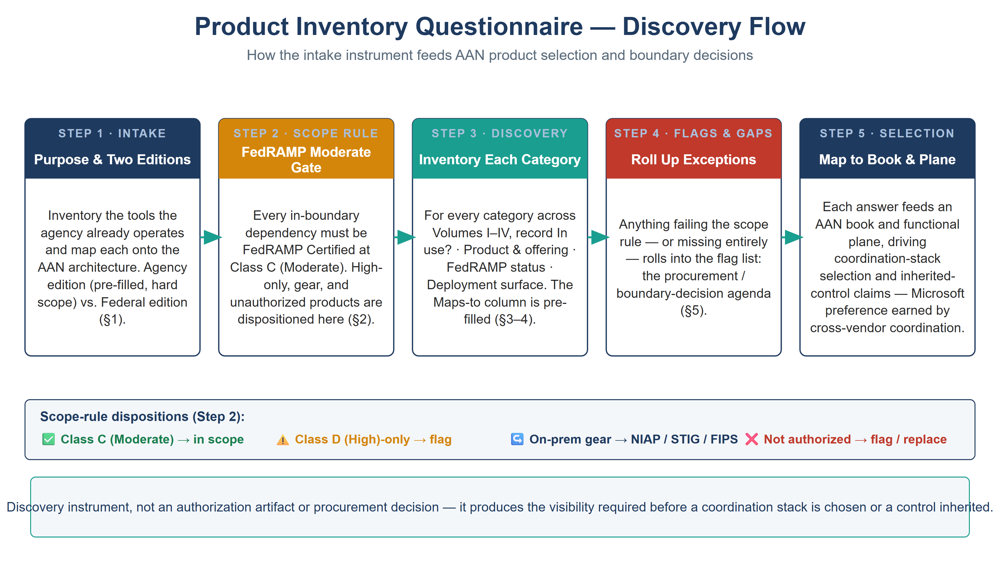

:::: {.content-hidden unless-profile="ssa"}
::: {.fouo-banner}
INTERNAL — NOT FOR PUBLIC DISTRIBUTION
:::
::::

::: {.aan-warning}
## Draft Proposal — Subject to Review

This document is a **draft proposal** developed by the **CSI Team (Cloud Services Infrastructure)**. It is a discovery instrument, not an authorization artifact or a procurement decision, and has not been reviewed or approved by the  CIO Office, the Office of Information Security (OIS), or organizational leadership.

**Date Code:** 2026-07-12 20:10 ET
:::

# Purpose and How to Use

This questionnaire inventories the products an agency **already operates** and
maps each onto the Federal Application-Aware Networking (AAN) compliance
architecture — the functional planes, the control-closure books, and the
Management-Plane Coordination Doctrine. It exists because the AAN plan is being
executed without full visibility into the agency's deployed tooling: you cannot
select a coordination stack, or claim an inherited control, without first
knowing what is already in place and how it is authorized.

**Two editions of this instrument render from one source:**

- **Federal edition (the default)** — the discovery tables (§4) with the pre-filled
  inventory (§3) omitted, and the scope rule stated generally: name the boundary
  level the agency is authorized at, then require every dependency at or above it.
  This is the edition that publishes.
- ** edition** — the same tables, plus the pre-filled block of known  tools
  (§3) and a **hard scope rule (§2)** fixing every dependency at **FedRAMP
  Moderate**. Its agency facts live in a segregated edition file that is not
  published.

The two names are literal here on purpose. This passage is *about* the split, so
substituting the agency variable into it would make it circular — "Agency edition"
and "Federal edition" would read as two different things.

**How to complete it:** for each category in §4, fill the four working columns —
*In use?*, *Product & offering*, *FedRAMP status*, *Deployment surface*. The
*Maps to* column is pre-filled; it tells you which AAN book and functional plane
the answer feeds. Anything that fails the §2 rule goes on the §5 flag list.

{#fig-discovery-flow fig-alt="A house-style, left-to-right discovery workflow on a white background, titled Product Inventory Questionnaire — Discovery Flow. Five stage nodes are connected by teal arrows, each with a colored header. Step 1 · Intake (navy): Purpose & Two Editions — inventory the tools the agency already operates and map each onto the AAN architecture, Agency edition versus Federal edition. Step 2 · Scope Rule (amber): FedRAMP Moderate Gate — every in-boundary dependency must be FedRAMP Certified at Class C (Moderate); High-only, gear, and unauthorized products are dispositioned here. Step 3 · Discovery (teal): Inventory Each Category — record In use?, Product & offering, FedRAMP status, and Deployment surface across Volumes I–IX, with the Maps-to column pre-filled. Step 4 · Flags & Gaps (red): Roll Up Exceptions — anything failing the rule or missing becomes the procurement and boundary-decision agenda. Step 5 · Selection (navy): Map to Book & Plane — each answer feeds an AAN book and functional plane, driving coordination-stack selection and inherited-control claims. Below the stages, a disposition legend shows four outcomes: green check for Class C Moderate in scope, amber warning for Class D High-only flag, a gear-to-NIAP/STIG/FIPS path, and a red cross for not authorized. A footer band notes this is a discovery instrument, not an authorization artifact or procurement decision. White background. Authored house-style diagram." width="100%"}

# The Scope Rule —  Edition Is Exclusively FedRAMP Moderate {#scope-rule}

Every product the  edition documents as an in-boundary dependency must be
**FedRAMP Certified at Class C (Moderate)**. Apply the following dispositions:

| Situation | Disposition |
|---|---|
| Product has a **Class C (Moderate)** authorization | ✅ In scope — record the CSO / Marketplace ID |
| Product is authorized **Class D (High) only**, no Moderate offering | ⚠️ **Flag** — High exceeds Moderate technically, but the  target is Moderate; confirm boundary treatment or seek a Moderate-authorized alternative |
| Product is **on-premises gear** (appliance/firmware), not a CSP service | ↪️ Not a FedRAMP item — accredit via **NIAP CC + DISA STIG + FIPS 140-3 + DoDIN APL** (see the Network Enforcement Substrate book, Theme F) |
| Product is **not FedRAMP authorized** (commercial SaaS) | ❌ **Flag** — not eligible as an in-boundary  dependency; find a Government/GovCloud edition or replace |

::: {.aan-note}
**FedRAMP nomenclature (current).** The **"FedRAMP Certified"** nomenclature —
with impact classes **Class C = Moderate** and **Class D = High** — was
introduced in the May 4, 2026 CR26 public preview and launched with the
Consolidated Rules on June 25, 2026; it becomes mandatory January 1, 2027.
This document says "Class C (Moderate)" for the  requirement and flags "Class
D (High)-only." Verify every status on the **FedRAMP Marketplace** at the time
of any authorization or procurement decision — authorizations change.
:::

::: {.aan-note}
## Selection principle — Microsoft-suite preference is earned, not automatic

The agency holds a large Microsoft enterprise agreement, so a Microsoft product
is the **default candidate** for any role **when it genuinely coordinates the
multi-vendor surface (CSP + NEM + OS) at FedRAMP Moderate** — e.g., Sentinel
ingesting AWS/OCI/NEM telemetry, or Defender for Cloud as a multi-cloud CNAPP.
Preference is earned by demonstrated cross-vendor coordination, **not** by
ownership: where a Microsoft product coordinates only Microsoft surfaces or
cannot reach the surface (e.g., Azure Arc cannot patch ESXi), the best
cross-vendor coordinator at Moderate wins.
:::

# Pre-Filled Inventory — Agency Edition Only {#known-ssa}

*This instrument ships empty on purpose.* An agency edition may carry a pre-filled
block here: its confirmed tools, each with a verified FedRAMP status and a
disposition under §2. The federal edition does not, because a pre-filled inventory
answers §4 before the reader starts — and the reader's own estate is the point.

To build one: complete §4 against your estate, verify each product's FedRAMP status
on the Marketplace, then record the disposition §2 forces for anything below your
boundary level. That filled block is agency-specific and belongs with your edition,
not in the published instrument.

# The Discovery Questionnaire {#discovery}

For each category: mark *In use?*, name the *Product & offering*, record
*FedRAMP status* (Class C required for  per §2), and the *Deployment surface*
(CSP / NEM / OS / cross). The *Maps to* column is pre-filled.

## Volume I — Foundation & Transport

| Category | Example products | In use? | Product & offering | FedRAMP status | Surface | Maps to |
|---|---|---|---|---|---|---|
| Cloud platforms (CSP) | Azure/M365 GCC, AWS GovCloud, OCI, GCP, VMware Cloud | | | | | Landing Zone · all planes |
| Naming & addressing (DDI/IPAM) | InfoBlox, BlueCat, NetBox | | | | | Landing Zone · plane 2 |
| Certificates / PKI | ADCS, Entrust, DigiCert, Venafi | | | | | Certs & Tokens · plane 2 |
| HR system of record | Oracle HCM, Workday, SAP SuccessFactors | | | | | HRIT · plane 3 |
| Directory & IdP | Entra ID, Okta, Ping, on-prem AD | | | | | Network Modernization · plane 3 |
| Network equipment (NEM) | Cisco, Palo Alto, Juniper, Fortinet, Arista | | | | NEM | Network Enforcement Substrate · plane 1/4 |
| NAC | Cisco ISE, Aruba ClearPass, Juniper Mist | | | | NEM | NAC / Network Enforcement · plane 3 |
| SD-WAN / SASE | Catalyst SD-WAN, Prisma SASE, Zscaler, Netskope | | | | cross | Network Mod / Telecom · plane 1/4 |
| Network performance / observability / WAN-opt | Riverbed, ThousandEyes, Kentik, SolarWinds | | | | cross | Transport telemetry (SI-4/CA-7) · plane 6 |
| Contact center / UC | Amazon Connect, Teams Phone | | | | CSP | Telecommunications · plane 5 |

## Volume II — Data Platform

| Category | Example products | In use? | Product & offering | FedRAMP status | Surface | Maps to |
|---|---|---|---|---|---|---|
| Database platforms | SQL Server, Oracle DB, PostgreSQL/RDS, Azure SQL | | | | CSP/OS | SQL & DB books · plane 5 |
| Database auth modernization | Azure Arc + Entra for SQL, IAM DB auth | | | | cross | SQL Auth book · plane 3 |

## Volume III — Security Operations

| Category | Example products | In use? | Product & offering | FedRAMP status | Surface | Maps to |
|---|---|---|---|---|---|---|
| Privileged access (PAM) | Entra PIM, CyberArk, BeyondTrust, Delinea, SailPoint | | | | cross | PAM book · plane 3 |
| Vulnerability assessment | Defender VM, Tenable, Qualys, Rapid7, Amazon Inspector | | | | cross | Vulnerability Mgmt · plane 6 |
| Patch / systems management | Intune, SSM, Azure Update Mgr, OCI OS Mgmt Hub, vLCM, Workspace ONE, Satellite/Ansible, Tanium, BigFix, Ivanti | | | | OS/cross | Patch & Systems Mgmt · plane 7 |
| Cloud posture / CNAPP / CSPM | Wiz, Prisma Cloud, Defender for Cloud, Orca | | | | CSP | Cloud-Native Posture · plane 6 |
| Container / K8s platform & security | AKS, EKS, OKE, OpenShift; image scanning | | | | CSP | Cloud-Native Posture · plane 5/6 |
| Data protection / DLP / classification | Purview, AWS Macie, Symantec DLP | | | | CSP | Data Protection · plane 2/5 |
| Key management / HSM | Azure Key Vault, AWS KMS, OCI Vault, Thales, Entrust | | | | CSP | Data Protection · plane 2 |
| SIEM | Sentinel, Splunk, Elastic, Google SecOps, QRadar | | | | cross | SIEM / Evidence Fabric · plane 6 |
| XDR / EDR | Defender XDR, Cortex XDR, CrowdStrike | | | | OS/cross | SIEM/XDR · plane 6 |
| SOAR / automation | Sentinel+Logic Apps, Cortex XSOAR, Splunk SOAR, ServiceNow SecOps | | | | cross | SIEM / Evidence Fabric · plane 6/7 |
| Multi-cloud evidence / coordination hub | ServiceNow, BMC Helix, Jira Service Mgmt | | | | cross | Evidence Fabric · plane 6/7 |

## Volume IV — Governance & Assurance

| Category | Example products | In use? | Product & offering | FedRAMP status | Surface | Maps to |
|---|---|---|---|---|---|---|
| Backup / BC-DR | Azure Site Recovery, AWS Backup, Veeam, Commvault, Cohesity | | | | cross | Business Continuity · plane 7 |
| Supply chain / SBOM | Syft, Grype, Anchore, Snyk | | | | cross | Supply Chain Risk Mgmt |
| Documentation / knowledge / collaboration | Confluence (Atlassian Gov), SharePoint, ServiceNow KB | | | | CSP | Program Mgmt / evidence |
| GRC / ConMon / OSCAL | ServiceNow GRC, Xacta, eMASS, UIAO tooling | | | | cross | Authorization Package & ConMon |

## Volume VII — ServiceNow Control-Compliance Automation

The coordination layer that turns M365/Azure control state into tracked tasks,
reviewable change, and KSI evidence. ServiceNow is a **workflow/enforcement
plane** — its CMDB *reconciles to* IPAM/DDI (CM-8), it never becomes the SSOT,
and actuation stays platform-native. Reach into cloud is via Graph/native APIs
from an **in-boundary MID Server**, with no standing admin.

| Category | Example products | In use? | Product & offering | FedRAMP status | Surface | Maps to |
|---|---|---|---|---|---|---|
| ITSM / workflow platform | ServiceNow (Government Cloud), BMC Helix, Jira Service Mgmt | | | | CSP | Vol VII Bk 00–01 · plane 6/7 |
| CMDB / discovery | ServiceNow Discovery / Service Graph, native CSP inventory | | | | cross | Vol VII Bk 01 (reconciled to IPAM/DDI, CM-8) · plane 2 |
| M365 / Entra control test source | Graph API, SCuBAGear, Purview | | | | CSP | Vol VII Bk 02 · plane 6 |
| Azure control test source | Azure Policy, Defender for Cloud, Update Manager | | | | CSP | Vol VII Bk 03 · plane 6/7 |
| GRC / IRM / attestation | ServiceNow IRM/GRC, Xacta, eMASS, UIAO OSCAL emitter | | | | cross | Vol VII Bk 04 · plane 6 |
| In-boundary connector | ServiceNow MID Server (in-boundary) | | | | cross | Vol VII Bk 05 (no standing admin) · plane 6/7 |

## Volume VIII — Multi-Cloud DDI Landing-Zone Automation

The authoritative naming/addressing plane realized across **Azure, AWS, GCP, OCI,
and VMware** (the one deliberate multi-CSP breadth exception, by author
direction), with ServiceNow as the governed front door for DDI change.

| Category | Example products | In use? | Product & offering | FedRAMP status | Surface | Maps to |
|---|---|---|---|---|---|---|
| Multi-cloud DDI / IPAM | InfoBlox DDI (Universal DDI / NIOS), BlueCat | | | | cross | Vol VIII Bk 01–06 (SC-20/22, CM-8) · plane 2 |
| Cloud-native DNS/IPAM (per CSP) | Azure DNS/IPAM, Route 53/VPC IPAM, Cloud DNS, OCI DNS, NSX-T DNS | | | | CSP | Vol VIII Bk 01–05 (reconciled to the DDI SSOT) · plane 2 |
| IaC provisioning | Terraform / OpenTofu, Bicep | | | | cross | Vol VIII Bk 08 · plane 7 |
| DDI change front door | ServiceNow Service Catalog + Flow Designer | | | | CSP | Vol VIII Bk 07 (CM-3/CM-5 SoD gate) · plane 6 |

## Volume IX — ServiceNow Day-2 Operations

The governed catalog for routine Entra/M365/Azure day-2 work — helpdesk, the
landing-zone front door, app-registration governance, and Teams telephony — same
discipline as Vol VII (Graph via in-boundary MID, no standing admin, every action
audited and reconciled to CM-8).

| Category | Example products | In use? | Product & offering | FedRAMP status | Surface | Maps to |
|---|---|---|---|---|---|---|
| Helpdesk / ITSM catalog | ServiceNow catalog over Entra/M365/Azure (Graph via MID) | | | | cross | Vol IX Bk 01 (AC-2, IA-5, AC-6) · plane 3 |
| Landing-zone front door | ServiceNow catalog → Terraform/Bicep → CMDB | | | | cross | Vol IX Bk 02 (CM-2/3/8) · plane 7 |
| App-registration governance | Entra app registrations, ACME short-lived certs | | | | CSP | Vol IX Bk 03 (IA-5(2), SC-17, AC-6) · plane 3 |
| Teams telephony | Teams Phone, Direct Routing / Operator Connect / Calling Plans, SBC; E911 address validation | | | | CSP | Vol IX Bk 04 (CM-3/CM-6, AU-2) · plane 5 |

::: {.aan-note}
**Volumes V (Training) and VI (Implementation)** are not product-discovery
surfaces in their own right — Volume V is enablement, and Volume VI operationalizes
the Volume I–IV architecture as deployable code using the same products inventoried
above (plus IaC/CI tooling: Terraform/OpenTofu, Bicep, GitHub Actions). No separate
intake table is needed for them; record any IaC/CI tooling under the Volume VII–VIII
rows above.
:::

# Flags & Gaps Summary {#flags}

Roll up here anything that failed the §2 rule or has no product at all. This
list becomes the procurement / boundary-decision agenda.

| Item | Category | Issue (High-only · gear · unauthorized · missing) | Action |
|---|---|---|---|
| Riverbed (Aternity/NPM+) | Network observability | Class D (High)-only cloud | Confirm Moderate need or boundary fit |
| Riverbed SteelHead | WAN-opt | On-prem gear (not FedRAMP) | Accredit via NIAP/STIG/FIPS |
| Confluence | Documentation | Moderate **only** on Atlassian Gov Cloud | Confirm not on commercial edition |
| ServiceNow | Coordination hub | Class D (High) | Document as High covering Moderate boundary |
| Palo Alto Prisma Cloud (CNAPP) | Cloud posture | Class D (High)-only | Agency-preferred; document as High covering Moderate, or select a Moderate CNAPP (Defender for Cloud) |
| _(add rows as discovery proceeds)_ | | | |

# References — FedRAMP Status Sources

| Product | Source |
|---|---|
| FedRAMP Marketplace | <https://marketplace.fedramp.gov/> |
| SailPoint Identity Security Cloud (Moderate) | <https://www.fedramp.gov/marketplace/products/FR2001938710A/> |
| ServiceNow Government Cloud (High) | <https://www.servicenow.com/company/media/press-room/servicenow-secures-fedramp-high-authorization.html> |
| Splunk Cloud Platform (Moderate) | <https://www.fedramp.gov/marketplace/products/F1607197917/> |
| Riverbed Platform for Government (Class D / High) | <https://www.riverbed.com/blogs/riverbed-platform-achieves-fedramp-class-d-certification/> |
| Atlassian Government Cloud — Confluence/Jira (Moderate) | <https://www.atlassian.com/blog/announcements/atlassiangovernmentcloud> |
| Tanium Cloud for US Government (Moderate) | <https://www.fedramp.gov/marketplace/products/FR2110342613/> |
| Wiz for Government (High) | <https://www.wiz.io/blog/wiz-achieves-fedramp-high-authorization> |
| Palo Alto Prisma Cloud (High) | <https://www.paloaltonetworks.com/blog/prisma-cloud/fedramp-high-impact-ready/> |
