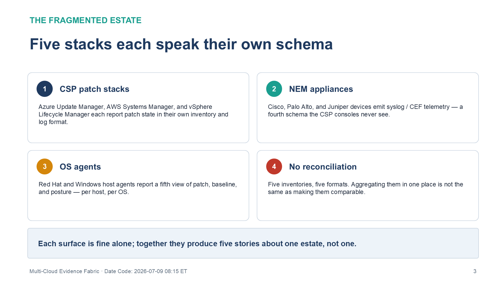
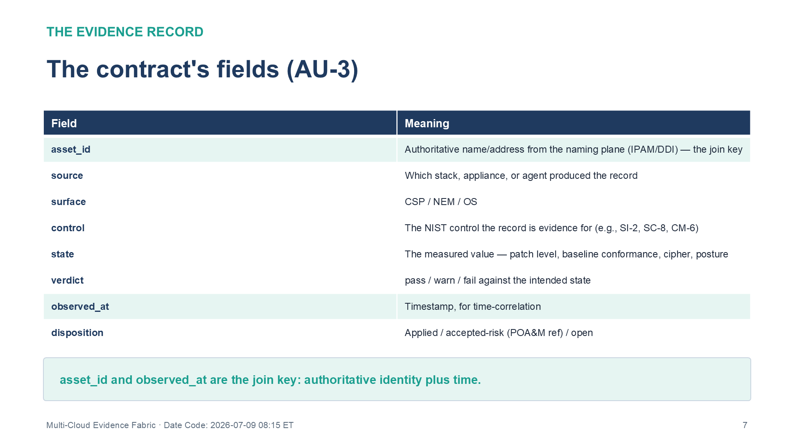
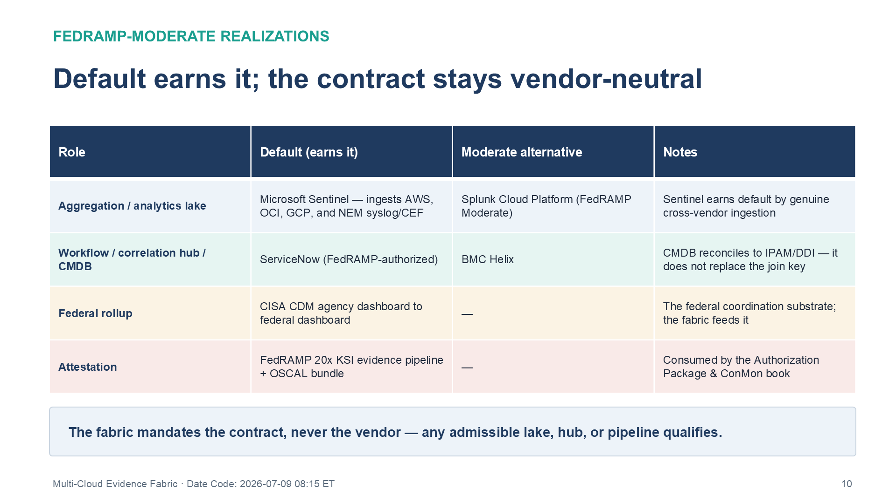

:::: {.content-hidden unless-profile="ssa"}
::: {.fouo-banner}
INTERNAL — NOT FOR PUBLIC DISTRIBUTION
:::
::::

::: {.aan-warning}
## Draft Proposal — Subject to Review

This document is a **draft proposal** developed by the **CSI Team (Cloud Services Infrastructure)**. It is an attempt at a comprehensive -wide technical roadmap and has not been reviewed or approved by the  CIO Office, the Office of Information Security (OIS), or organizational leadership. All recommendations, vendor selections, control mappings, and implementation timelines are subject to revision pending formal review by the  CIO Office and organizational components.

**Date Code:** 2026-07-09 08:41 ET
:::

::: {.aan-important}
**Provisional position.** This book was drafted at temporary series slot 23; its
intended home is **Volume III (Security Operations)**, after the SIEM/XDR book.
Cross-references name other books by **title and role**, not number, so the
series-wide renumber does not break them.
:::

::: {.aan-important}
**Series Context** — The Management-Plane Coordination Doctrine (Executive
Summary) splits the management plane in two: actuation is platform-native;
governance is unified. This book is the **unified-governance half made real** —
the evidence fabric where every native stack (Microsoft, AWS, Oracle, VMware,
Red Hat), every network appliance (Cisco / Palo Alto / Juniper), and every OS
agent emits the **same machine-readable record** into one lake, correlated on
one authoritative asset identity, and delivered up to **CISA CDM** and the
FedRAMP 20x KSI pipeline. It is a truth-plane function (plane 6): the fabric is
depended on, not re-platformed.
:::

# What This Document Addresses

A multi-cloud federal agency runs five or more management stacks, and each one
produces its own telemetry in its own schema: Azure Update Manager reports
patch state one way, AWS Systems Manager another, vSphere Lifecycle Manager a
third, a Palo Alto firewall a fourth, a Red Hat host a fifth. Five stacks, five
inventories, five log formats. An assessor who asks "is CVE-X remediated across
the whole estate, and prove it" cannot be answered by five partial views that
do not reconcile.

{#fig-mcef-fragmented fig-alt="Four numbered cards depicting the fragmented multi-cloud estate. Card one, CSP patch stacks: Azure Update Manager, AWS Systems Manager, and vSphere Lifecycle Manager each report patch state in their own inventory and log format. Card two, NEM appliances: Cisco, Palo Alto, and Juniper devices emit syslog and CEF telemetry — a fourth schema the CSP consoles never see. Card three, OS agents: Red Hat and Windows host agents report a fifth view of patch, baseline, and posture, per host and per OS. Card four, No reconciliation: five inventories in five formats, and aggregating them in one place is not the same as making them comparable. A footer banner states that each surface is fine alone, but together they produce five stories about one estate, not one. White background. Source: Vol III Book 07 — Multi-Cloud Evidence Fabric briefing deck, Date Code 2026-07-09 08:15 ET." width="100%"}

The **evidence fabric** is the answer: a single, normalized **evidence contract**
that every source emits into one lake, **correlated on one authoritative asset
identity**, and delivered to the two consumers a federal agency owes — **CISA
CDM** (enterprise asset/vulnerability/configuration visibility) and the
**FedRAMP 20x KSI** evidence pipeline. This book defines that contract, names
its FedRAMP-Moderate realizations, and closes the AU/CA/SI controls of the
telemetry slot — two of which (AU-3 and AU-12(1)) only a cross-surface fabric
can close.

::: {.aan-note}
## What this book is *not* — the boundary with the SIEM/XDR and ConMon books

This is not the detection-engineering book. The **SIEM / XDR Detection** book
owns *analytics and response* — KQL/correlation rules, UEBA, playbooks — the
logic that finds a threat in the data. This book owns the layer *beneath* that:
**getting every source's data into one normalized, correlated contract in the
first place.** And it is not the authorization book: the **Authorization Package
& ConMon** book assembles the OSCAL AP/AR/POA&M bundle *from* the fabric's
output. The fabric is upstream of both — detection analyzes it, the OSCAL bundle
attests it.
:::

# The Evidence Contract — the Coordination Mechanism (AU-3)

Coordination across heterogeneous stacks is not a console; it is a **contract**.
Every source — a CSP patch stack, a NEM appliance, an OS agent — must emit a
record with the same fields, regardless of what produced it:

| Field | Meaning |
|---|---|
| `asset_id` | **Authoritative name/address from the naming plane (IPAM/DDI)** — the join key |
| `source` | Which stack/appliance/agent produced the record |
| `surface` | CSP / NEM / OS |
| `control` | The NIST control the record is evidence for (e.g., SI-2, SC-8, CM-6) |
| `state` | The measured value (patch level, baseline conformance, cipher, posture) |
| `verdict` | pass / warn / fail against the intended state |
| `observed_at` | Timestamp (for time-correlation) |
| `disposition` | Applied / accepted-risk (POA&M ref) / open |

This is **AU-3 (Content of Audit Records)** raised to a cross-surface contract:
the record's *content* is standardized so records from any source are
comparable, joinable, and rollup-able. It is a **Closure Necessity** — without a
common contract, the five stacks cannot produce one compliance picture, and no
amount of dashboarding after the fact recovers a schema the sources never
agreed on.

{#fig-mcef-contract fig-alt="A two-column table titled The contract's fields (AU-3), listing each field and its meaning. asset_id is the authoritative name or address from the naming plane (IPAM/DDI) — the join key. source is which stack, appliance, or agent produced the record. surface is CSP, NEM, or OS. control is the NIST control the record is evidence for, such as SI-2, SC-8, or CM-6. state is the measured value — patch level, baseline conformance, cipher, or posture. verdict is pass, warn, or fail against the intended state. observed_at is the timestamp used for time-correlation. disposition is applied, accepted-risk with a POA&M reference, or open. A footer banner emphasizes that asset_id and observed_at together are the join key: authoritative identity plus time. White background. Source: Vol III Book 07 — Multi-Cloud Evidence Fabric briefing deck, Date Code 2026-07-09 08:15 ET." width="100%"}

# The Join Key — Authoritative Asset Identity + Time (AU-12(1))

Aggregating records is not the same as correlating them. Two records describe
the same asset only if they carry the **same authoritative `asset_id`** — which
is why the fabric's correlation key is the naming plane's IP/hostname (CM-8),
not each stack's local inventory id. Add `observed_at` and the fabric produces a
**system-wide, time-correlated audit trail (AU-12(1))**: "as of 06:00, asset
_A_ was unpatched for CVE-X (from the patch stack), reachable on an unencrypted
segment (from the NEM telemetry), and out of baseline (from the config stack)"
— one correlated story about one asset, assembled from three surfaces.

::: {.aan-important}
## Closure Necessity — correlation depends on the naming plane

You cannot build a system-wide audit trail across AWS, Azure, VMware, and Red
Hat without one authoritative asset identity to join on. AU-12(1) is therefore
downstream of the naming-plane necessity (IPAM/DDI, CM-8) and the federal asset-
visibility mandate (**CISA BOD 23-01**). This is the same join key the Patch &
Systems Management book uses for SI-2 at scale — the fabric and the patch plane
share it.
:::

# Realizations — Aggregation, Coordination, and Delivery

The fabric is a contract, so more than one product can realize each role. Under
the agency's Microsoft-preference rule (a Microsoft product is the default *when
it genuinely coordinates the multi-vendor surface at FedRAMP Moderate* — earned,
not automatic), the realizations are:

| Role | Default (earns it) | Moderate alternative | Notes |
|---|---|---|---|
| **Aggregation / analytics lake** | **Microsoft Sentinel** — ingests AWS (Security Hub / GuardDuty / CloudTrail), OCI, GCP, and NEM syslog/CEF; FedRAMP-authorized | **Splunk Cloud Platform** (FedRAMP Moderate) | Sentinel earns default by genuine cross-vendor ingestion; Splunk is a first-class Moderate alternative |
| **Workflow / correlation hub / CMDB** | **ServiceNow** (FedRAMP-authorized) | BMC Helix | **CMDB reconciles to IPAM/DDI — it does not replace the naming-plane join key** |
| **Federal rollup** | **CISA CDM** agency dashboard → federal dashboard | — | The federal coordination substrate; the fabric feeds it |
| **Attestation** | FedRAMP 20x **KSI** evidence pipeline + OSCAL bundle | — | Consumed by the Authorization Package & ConMon book |

The doctrine guardrail holds throughout: **the fabric mandates the contract,
never the vendor.** Any lake that ingests the multi-surface record set, any hub
that correlates on the authoritative `asset_id`, and any pipeline that emits the
KSI/OSCAL evidence is admissible.

{#fig-mcef-realizations fig-alt="A four-column table titled Default earns it; the contract stays vendor-neutral, with columns Role, Default (earns it), Moderate alternative, and Notes. Aggregation / analytics lake row: default Microsoft Sentinel, which ingests AWS, OCI, GCP, and NEM syslog/CEF, with Splunk Cloud Platform (FedRAMP Moderate) as the alternative; Sentinel earns the default by genuine cross-vendor ingestion. Workflow / correlation hub / CMDB row: default ServiceNow (FedRAMP-authorized), alternative BMC Helix; the CMDB reconciles to IPAM/DDI — it does not replace the join key. Federal rollup row: CISA CDM agency dashboard to federal dashboard, no alternative; it is the federal coordination substrate the fabric feeds. Attestation row: the FedRAMP 20x KSI evidence pipeline plus OSCAL bundle, consumed by the Authorization Package and ConMon book. A footer banner reiterates that the fabric mandates the contract, never the vendor — any admissible lake, hub, or pipeline qualifies. White background. Source: Vol III Book 07 — Multi-Cloud Evidence Fabric briefing deck, Date Code 2026-07-09 08:15 ET." width="100%"}

# The Continuous-Monitoring Pipeline (CA-7)

{#fig-mcef-conmon fig-alt="A five-step pipeline: collect from every source, normalize to the evidence contract, correlate on asset identity and time, roll up to CISA CDM, and attest as KSI and OSCAL. Completed steps tinted, active step ringed in amber, detail panel below." width="100%"}

The fabric *is* the ConMon evidence pipeline: sources emit on their own cadence
→ records normalize to the contract → correlate on asset identity + time →
aggregate in the lake → roll up to CDM → attest as KSI/OSCAL. **CA-7 continuous
monitoring** is closed here as the *flow*; the SIEM/XDR book adds detection
analytics over the lake, and the Authorization Package book freezes a point-in-
time OSCAL bundle from it. **OMB M-21-31** (event-logging maturity) and **NIST
SP 800-137 (ISCM)** are the driving authorities; **AU-6(1)** (automated process
integration) and **SI-4(16)** (correlate monitoring information) are closed by
the automated aggregation and cross-surface correlation the fabric performs.

# NIST SP 800-53 Rev 5 Control Closure — Authorities Closed Here

Generated from the series compliance spine (`aan-compliance-spine.yml`) via
`render_authorities_table.py`; not hand-maintained. All rows are telemetry-slot,
KSI-MLA, and **not** attestable by a single-tenant conformance scan — the
evidence is the *aggregated, correlated* record set, which is exactly what a
per-tenant tool cannot produce.

<!-- authorities:book-evidence-fabric — generated from aan-compliance-spine.yml; do not hand-edit -->
| Control | Title | Closing mechanism (function, not product) | Accreditation gate | Authority drivers | Evidence slot | FedRAMP 20x KSI | Tool-attestable? |
|---|---|---|---|---|---|---|---|
| AU-12 | Audit Record Generation | Enterprise-wide audit generation spanning every CSP, NEM appliance, and OS agent | FedRAMP Moderate | NIST SP 800-53 Rev 5; OMB M-21-31 | Telemetry | KSI-MLA | No |
| AU-12(1) † | System-wide and Time-correlated Audit Trail | Cross-surface correlation keyed to authoritative asset identity (IPAM/DDI) + time — the join that makes one compliance picture | FedRAMP Moderate | NIST SP 800-53 Rev 5; CISA BOD 23-01 | Telemetry | KSI-MLA | No |
| AU-3 † | Content of Audit Records | Unified machine-readable evidence-record contract every native stack emits (the coordination mechanism) | FedRAMP Moderate | NIST SP 800-53 Rev 5; OMB M-21-31 | Telemetry | KSI-MLA | No |
| AU-6(1) | Automated Process Integration | Automated aggregation + analysis across CSP/NEM/OS sources into one lake (Sentinel default; Splunk alternative) | FedRAMP Moderate | NIST SP 800-53 Rev 5; NIST SP 800-137 | Telemetry | KSI-MLA | No |
| CA-7 | Continuous Monitoring | The telemetry→evidence→CDM→KSI pipeline; ServiceNow coordinates workflow, CMDB reconciled to IPAM/DDI | FedRAMP Moderate | NIST SP 800-53 Rev 5; NIST SP 800-137; CISA CDM; FedRAMP 20x KSIs | Telemetry | KSI-MLA | No |
| SI-4(16) | Correlate Monitoring Information | Correlation of monitoring data across vendor/surface boundaries in the unified fabric | FedRAMP Moderate | NIST SP 800-53 Rev 5 | Telemetry | KSI-MLA | No |

: Authorities Closed Here — Multi-Cloud Evidence Fabric (telemetry → CDM → KSI) († = Closure-Necessity anchor: no alternate closure path) {.striped .hover}

# FedRAMP 20x KSI Alignment

The fabric is the primary **KSI-MLA** (Monitoring, Logging, and Auditing) evidence
source for the whole series: every book that emits a compliance record —
identity, patch, network enforcement, posture, data — delivers it *through* this
fabric, where it is normalized, correlated, and rolled up. The fabric does not
compete with the SIEM/XDR book for KSI-MLA; it is the substrate that book's
analytics run on. Because the evidence is the aggregated, correlated record set
(not a single-tenant configuration snapshot), none of these controls is
attestable by a conformance tool alone — the *Tool-attestable?* column is
uniformly **No**, and the coordination doctrine's contract is what makes them
evaluable.

::: {.aan-note}
## Realization Selection Status

SIEM/lake and coordination-hub selections are pending agency procurement review.
Sentinel is the default aggregation lake on the Microsoft-preference rule
(earned by genuine multi-cloud/NEM ingestion at FedRAMP Moderate); Splunk Cloud
Platform is a first-class Moderate alternative. ServiceNow (FedRAMP-authorized)
is the workflow/CMDB coordination hub, with its CMDB reconciled to the
authoritative IPAM/DDI identity. Verify all authorizations on the FedRAMP
Marketplace at procurement.
:::

# References

| Reference | Description |
|---|---|
| NIST SP 800-53 Rev 5 | AU-3, AU-6(1), AU-12, AU-12(1), CA-7, SI-4(16) |
| NIST SP 800-137 | Information Security Continuous Monitoring (ISCM) |
| OMB M-21-31 | Improving the Federal Government's Investigative and Remediation Capabilities (event-logging maturity) — <https://www.whitehouse.gov/wp-content/uploads/2021/08/M-21-31-Improving-the-Federal-Governments-Investigative-and-Remediation-Capabilities-Related-to-Cybersecurity-Incidents.pdf> |
| CISA CDM Program | Continuous Diagnostics & Mitigation — <https://www.cisa.gov/cdm> |
| CISA BOD 23-01 | Asset visibility & vulnerability enumeration — <https://www.cisa.gov/news-events/directives/bod-23-01-improving-asset-visibility-and-vulnerability-detection-federal-networks> |
| Microsoft Sentinel (multi-cloud data connectors) | <https://learn.microsoft.com/azure/sentinel/connect-data-sources> |
| Splunk Cloud Platform (FedRAMP Moderate) | <https://www.fedramp.gov/marketplace/products/F1607197917/> |
| ServiceNow (FedRAMP-authorized; ITOM/CMDB/SecOps) | <https://www.fedramp.gov/marketplace/products/F1305072116/> |
| NIST OSCAL | Open Security Controls Assessment Language — <https://pages.nist.gov/OSCAL/> |

: Reference Documents and Vendor Sources {.striped .hover}
