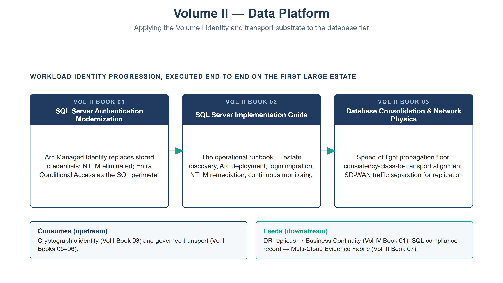

:::: {.content-hidden unless-profile="ssa"}
::: {.fouo-banner}
INTERNAL — NOT FOR PUBLIC DISTRIBUTION
:::
::::

::: {.aan-warning}
## Draft Proposal — Subject to Review

This document is a **draft proposal** developed by the **CSI Team (Cloud Services Infrastructure)**. It has not been reviewed or approved by the  CIO Office, the Office of Information Security (OIS), or organizational leadership.

**Date Code:** 2026-07-08 16:23 ET
:::

# Volume Purpose

**Volume II applies the identity and transport substrate of Volume I to the data
tier.** The database layer carries the same credential vulnerabilities as the
identity and network layers — stored passwords, NTLM fallback, manual rotation,
no continuous evidence — and it is where most federal business systems keep
their crown jewels. This volume closes that surface: it eliminates stored SQL
credentials through Arc Managed Identity and token-based authentication, provides
the operational runbooks to execute the migration, and resolves the
**network-physics constraints** — the speed-of-light propagation floor and
consistency-class alignment — that govern how far a database can be consolidated
before physics, not procurement, decides.

The database is the **first large estate** where the series' workload-identity
progression is executed end to end. It is therefore both an application of the
Volume I substrate and the first end-to-end test of whether the substrate holds
under real production load.

{#fig-vol2-map fig-alt="A house-style volume map for Volume II, Data Platform, on a white background, with a navy title and grey subtitle. A single labeled row, WORKLOAD-IDENTITY PROGRESSION EXECUTED END-TO-END ON THE FIRST LARGE ESTATE, holds three navy-headed book nodes connected left to right by teal arrows: Book 01 SQL Server Authentication Modernization (Arc Managed Identity replaces stored credentials, NTLM eliminated, Entra Conditional Access as the SQL perimeter); Book 02 SQL Server Implementation Guide (the operational runbook — estate discovery, Arc deployment, login migration, NTLM remediation, continuous monitoring); and Book 03 Database Consolidation & Network Physics (speed-of-light propagation floor, consistency-class-to-transport alignment, SD-WAN traffic separation). Below the row, two panels frame the volume's ties: a Consumes (upstream) panel citing cryptographic identity from Vol I Book 03 and governed transport from Vol I Books 05–06, and a Feeds (downstream) panel citing DR replicas into Business Continuity (Vol IV Book 01) and the SQL compliance record into the Multi-Cloud Evidence Fabric (Vol III Book 07). White background. Authored house-style diagram." width="100%"}

# Books in This Volume

| Book | Title | Role |
|---|---|---|
| **Vol II Book 01** | SQL Server Authentication Modernization | Arc Managed Identity replaces stored credentials; NTLM eliminated; Entra Conditional Access as the SQL perimeter |
| **Vol II Book 02** | SQL Server Implementation Guide | The operational runbook — estate discovery, Arc deployment, login migration, NTLM remediation, continuous monitoring |
| **Vol II Book 03** | Database Consolidation & Network Physics | Speed-of-light floor, consistency-class-to-transport alignment, SD-WAN traffic separation for replication |

: Volume II — Data Platform {.striped .hover}

# How This Volume Fits the Program

Volume II **consumes** the cryptographic identity of Vol I Book 03 (Certificates
& Tokens) and the transport of Vol I Books 05–06, and it **feeds** two downstream
volumes: its DR runbooks are the Section-5 recovery procedures and its
geo-replicated replica architecture is the CP-6 alternate-storage content the
Business Continuity book (Vol IV Book 01) assembles into a CP-2 plan, and its
continuous SQL compliance record emits into the Multi-Cloud Evidence Fabric (Vol
III Book 07) like every other source. It is the bridge between the substrate and
the operational and governance volumes that follow.
