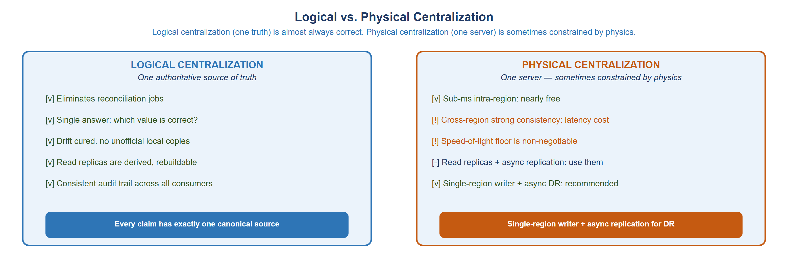
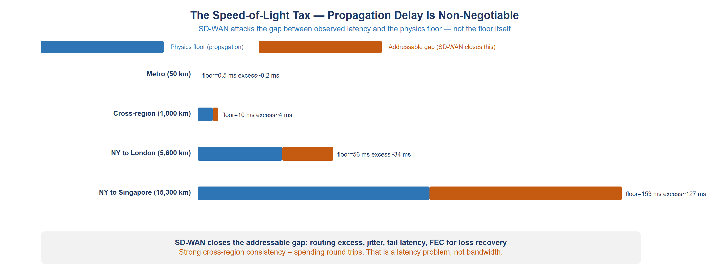
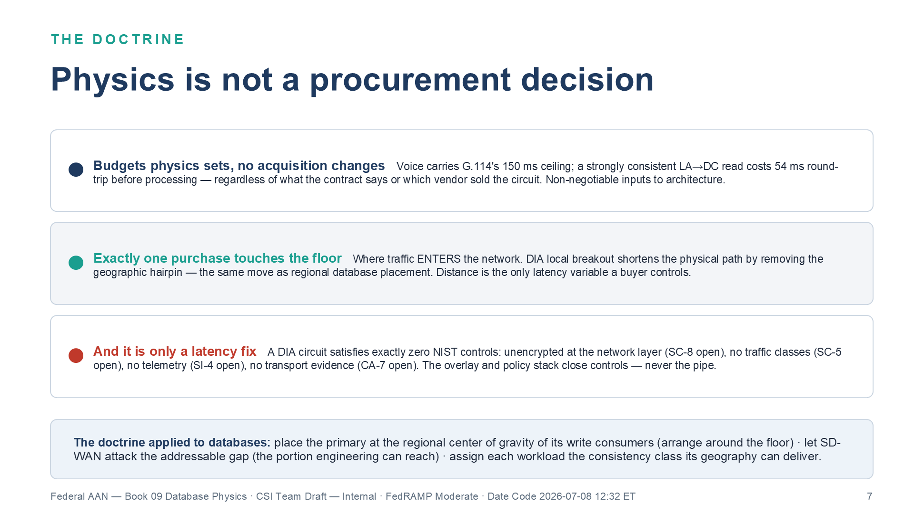
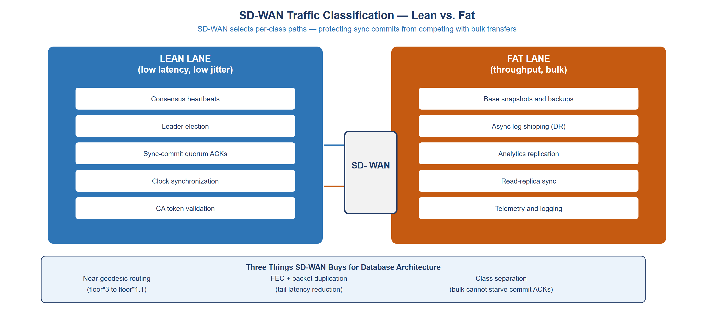
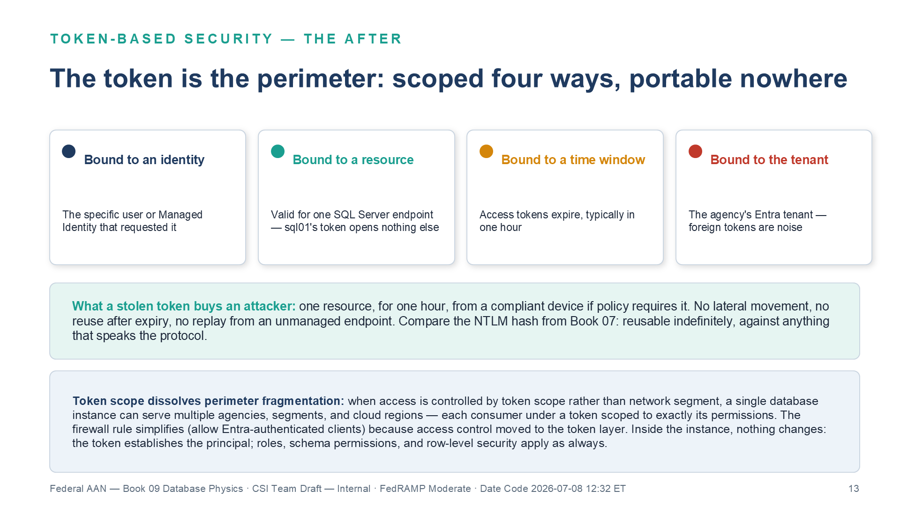
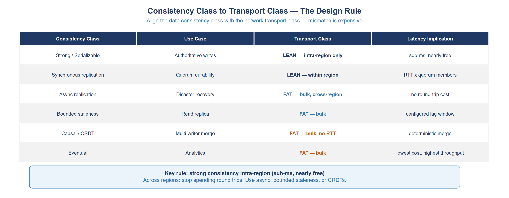
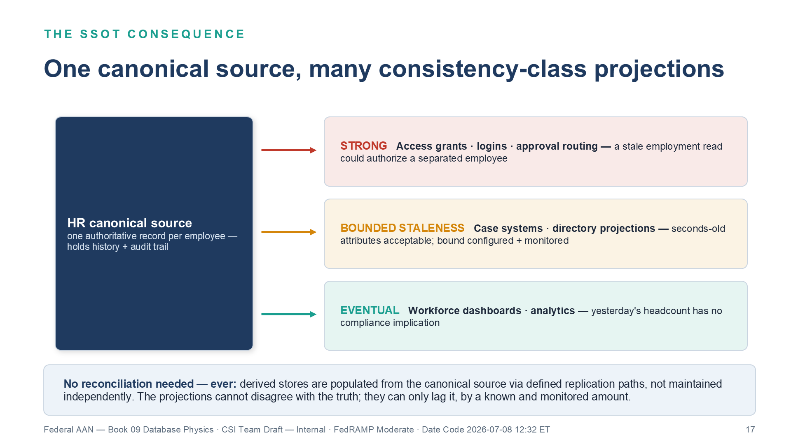

::: {.aan-warning}
## Draft Proposal — Subject to Review

This document is a **draft proposal** developed by the **CSI Team (Cloud Services Infrastructure)**. It is an attempt at a comprehensive -wide technical roadmap and has not been reviewed or approved by the  CIO Office, the Office of Information Security (OIS), or organizational leadership. All recommendations, vendor selections, control mappings, and implementation timelines are subject to revision pending formal review by the  CIO Office and organizational components.

**Date Code:** 2026-07-08 16:07 ET
:::

::: {.aan-important}
**Series Context** — This document is Vol II Book 03 of the Federal Organization Compliance series. Volumes I–II — the foundation and data-platform books — address network and identity infrastructure (IPAM/DDI/PKI, network access control, certificates and tokens, SD-WAN/SASE, network modernization) and SQL Server identity migration. This book addresses the architectural substrate beneath the identity layer: where databases should live, why network physics constrain that decision, and how SD-WAN and token-based security change the trade-off calculus.
:::

# The Consolidation Premise

Federal database infrastructure is fragmented. Every initiative, every bureau, and every application deployment produced another database server. Over decades, agencies accumulated hundreds — sometimes thousands — of database instances running on heterogeneous versions of SQL Server, Oracle, PostgreSQL, and MySQL, distributed across data centers, colocation facilities, and cloud tenants.

This fragmentation is not an accident and it is not ignorance. It is the rational local optimum of a distributed organization: each team provisioned what it needed, when it needed it, without visibility into what its neighbors had already deployed. The result is a system where data answers are inconsistent (different databases carry different versions of the same fact), where reconciliation jobs outnumber original data collection jobs, and where audit coverage is partial because the infrastructure footprint is unmapped.

The consolidation program is the correction. But consolidation is not simply moving databases to fewer servers. It requires a principled distinction between two kinds of centralization that are frequently confused.

# Logical vs. Physical Centralization

The most important architectural distinction in federal database consolidation is between **logical centralization** and **physical centralization**. These are not the same thing and conflating them produces either unnecessary cost or unnecessary fragmentation.

{#fig-db01 fig-alt="Side-by-side diagram comparing logical centralization (one truth) with physical centralization (one server)"}

## Logical Centralization

**Logical centralization** means that every fact has exactly one authoritative source. There is one canonical record for each employee, each asset, each transaction. All other representations of that fact are derived from the canonical source — they are readable projections, not independent authorities.

Logical centralization is almost always the correct goal. It:

- Eliminates the reconciliation jobs that consume engineering time and produce inconsistent answers
- Creates a clear audit trail — the canonical source has the history; projections do not need to
- Simplifies access control — one system enforces the authoritative access policy
- Enables consistent answer to "what is the current value of X?" — it is whatever the canonical source says

The most common source of data integrity problems in federal systems is **logical fragmentation**: the same fact lives in three different systems, maintained by three different processes, and they disagree. OPM HRIT says the employee is in Department A. The identity provider says Department B. The financial system says Department C. The right correction is to designate one as authoritative (or build an authoritative HR master) and make the others derive from it.

## Physical Centralization

**Physical centralization** means that all data lives on one server, in one data center, in one region. Physical centralization is sometimes the right choice and sometimes physically constrained — because the speed of light is not negotiable.

Physical centralization delivers the performance benefits of co-location: intra-node queries avoid network round trips entirely. Sub-millisecond access to any row. No consistency lag. For many workloads — particularly transactional systems with strong consistency requirements — physical co-location within a data center is the right answer.

But physical centralization across geographies is a different proposition entirely. A database that must serve users in Virginia and San Francisco simultaneously cannot provide sub-millisecond response to both. The physics does not allow it. A request from San Francisco to a database in Virginia travels roughly 2,500 miles — about 4,000 km. At the speed of light in fiber (approximately 200,000 km/s), that is a minimum round-trip time of approximately 40 milliseconds — before any processing, queuing, or application latency is added.

**The architectural implication:** physically centralize within a region, replicate asynchronously across regions, and design workloads to tolerate the replication lag for cross-region reads.

# The Speed-of-Light Tax

The propagation delay floor is the most important number in distributed database architecture. It is not a software configuration parameter. It is not a network engineering problem. It is physics.

{#fig-db02 fig-alt="Chart comparing propagation floor versus observed latency for routes from metro to transcontinental"}

## The Floor, the Gap, and the Addressable Portion

For any physical path between two points, there is a minimum round-trip latency determined purely by distance and the speed of signal propagation. For fiber-optic cable, the effective propagation speed is approximately 200,000 km/s (two-thirds the speed of light in vacuum, due to the refractive index of glass).

| Route | Distance | Physics Floor (RTT) | Typical Observed RTT | Addressable Gap |
|---|---|---|---|---|
| Metro (50 km) | 50 km | 0.5 ms | 0.7–1 ms | 0.2–0.5 ms |
| DC to Chicago (1,200 km) | 1,200 km | 12 ms | 16–25 ms | 4–13 ms |
| DC to LA (3,700 km) | 3,700 km | 37 ms | 65–90 ms | 28–53 ms |
| NY to London (5,600 km) | 5,600 km | 56 ms | 80–110 ms | 24–54 ms |
| NY to Singapore (15,300 km) | 15,300 km | 153 ms | 250–350 ms | 97–197 ms |

The **physics floor** is not reducible by any software, protocol, or network engineering. Light cannot travel faster. Fiber cannot be made shorter. The floor is the floor.

The **addressable gap** — the difference between the floor and the observed latency — represents routing excess, queuing, processing overhead, and path suboptimality. This is what SD-WAN, optimized routing, and network engineering attack. For the DC-to-LA route, observed latency is typically 65–90ms against a 37ms floor — a 28–53ms addressable gap. SD-WAN can close much of this gap through near-geodesic routing selection and traffic prioritization. But it cannot close the 37ms floor.

## Implications for Consistency Models

Strong consistency requires round trips. A strongly consistent read — one that guarantees it reflects the latest committed write — must either be served from the primary write node or perform a round trip to verify there are no pending writes. For a primary in DC and a reader in LA:

- A strongly consistent read from LA requires at minimum one round trip to DC: **37ms physics floor, observed 65–90ms**
- A strongly consistent write from LA requires at minimum one round trip to DC: same

This is not a configuration problem. It is not a database vendor problem. It is the physics of the deployment.

**The correct architecture for cross-region access is:**

1. **Intra-region writes.** All writes go to the single-region primary. Strong consistency is free within the region (sub-ms).
2. **Async replication for DR.** The primary replicates asynchronously to a DR replica in a second region. The lag is bounded by the async commit design — typically seconds for healthy replication.
3. **Read replicas for latency.** Readers that can tolerate bounded staleness read from the nearest replica. The staleness bound is configured and monitored.
4. **CRDT or eventual consistency for merge scenarios.** Multi-writer workloads use conflict-free replicated data types (CRDTs) or operational transformation to merge concurrent writes deterministically.

The **consistency class** selected for a workload must match the **network transport class** available for that workload's traffic. This is the central design rule of this document.

## Physics Is Not a Procurement Decision

The propagation floor is not a database-specific observation. It is the general form of an argument that runs through this entire series: every latency-sensitive workload in the federal enterprise carries a budget that physics sets and no acquisition can change. Voice carries ITU-T G.114's 150ms one-way ceiling — above it, talker echo is perceptible and the call degrades, regardless of what the contract says. Distributed databases carry the propagation floors documented in this chapter — a strongly consistent read from LA against a DC primary costs 37ms round trip before the first byte of processing, regardless of which vendor sold the circuit. These budgets are **non-negotiable inputs** to architecture. They cannot be traded against cost in a source selection, waived in a risk acceptance memo, or engineered away by a faster router. Light in fiber travels at approximately 200,000 km/s, and no procurement decision repeals that.

Exactly one purchasing decision touches the floor: **where traffic enters the network.** Direct Internet Access — local breakout — shortens the physical path by eliminating the geographic hairpin, the same way regional database placement shortens the path between a write and its quorum. Distance is the only latency variable a buyer controls, which is why DIA is the only latency fix that exists. There is no second one.

And it is *only* a latency fix. A DIA circuit satisfies exactly zero NIST controls. It carries traffic unencrypted at the network layer (SC-8 open). It has no notion of traffic class, so quorum ACKs and backup streams contend for the same queue (SC-5 open). It produces no application-layer telemetry (SI-4 open) and no transport evidence (CA-7 open). Every control claimed in the vicinity of the circuit is satisfied by the SD-WAN overlay and the policy stack that govern it — never by the pipe. An agency that buys the circuit without the overlay has purchased lower latency and a compliance regression, and no subsequent circuit purchase — a second DIA, an MPLS upgrade, dark fiber, more bandwidth — closes any of it. Circuits change how fast packets travel; controls are about what happens to them on the way.

Applied to this document's subject, the doctrine reads: place the primary at the regional center of gravity of its write consumers, because that is arranging around the floor; let SD-WAN attack the addressable gap between the floor and observed latency, because that is the portion engineering can reach; assign each workload the consistency class its geography can actually deliver, because pretending otherwise just relocates the physics into mysterious query latency. Architecture is not the act of overcoming physics. It is the act of arranging around what physics permits — and the propagation floor is where that discipline starts.

{#fig-db05 fig-alt="Three stacked doctrine rows. Row 1, budgets physics sets and no acquisition changes: voice carries G.114's 150 ms ceiling; a strongly consistent LA-to-DC read costs 37 ms round trip before processing — regardless of what the contract says or which vendor sold the circuit; non-negotiable inputs to architecture. Row 2, exactly one purchase touches the floor: where traffic enters the network — DIA local breakout shortens the physical path by removing the geographic hairpin, the same move as regional database placement; distance is the only latency variable a buyer controls. Row 3 in red, and it is only a latency fix: a DIA circuit satisfies exactly zero NIST controls — unencrypted at the network layer leaving SC-8 open, no traffic classes leaving SC-5 open, no telemetry leaving SI-4 open, no transport evidence leaving CA-7 open; the overlay and policy stack close controls, never the pipe. Blue doctrine bar: place the primary at the regional center of gravity of its write consumers, let SD-WAN attack the addressable gap, assign each workload the consistency class its geography can deliver. White background. Source: Vol II Book 03 Database Physics briefing deck, Date Code 2026-07-08 12:32 ET." width="100%"}

# SD-WAN as the Database's Network Ally

SD-WAN does not eliminate the physics floor. What it does is reduce the gap between the physics floor and the observed latency, and it separates traffic classes so that high-priority database traffic is not competing with bulk data transfers for the same network path.

{#fig-db03 fig-alt="Diagram showing SD-WAN separating lean and fat traffic lanes for database infrastructure"}

## Near-Geodesic Routing

Traditional MPLS networks route traffic along paths determined by carrier topology — which may not be the shortest physical path. A packet from an agency data center in Virginia to a cloud region in Oregon may route through Chicago and Denver because those are the carrier's peering points.

SD-WAN selects among multiple available paths — MPLS, broadband, LTE — and measures the observed latency of each path continuously. It routes traffic along the path that currently has the lowest latency to the destination, which is typically the most geographically direct path available.

For database applications, near-geodesic routing reduces the observed latency toward the physics floor. The DC-to-Oregon route that takes 95ms over an MPLS path with Midwest hops may take 68ms over a direct broadband path with west-coast peering.

## Three Benefits for Database Architecture

**Benefit 1 — Near-geodesic routing.** SD-WAN selects the lowest-latency path currently available, approaching the physics floor rather than being determined by carrier topology. For intra-agency database traffic (between data centers, between a data center and a cloud region), this can reduce observed latency by 30–50% versus traditional MPLS.

**Benefit 2 — Forward Error Correction (FEC) and packet duplication.** Network packet loss causes TCP retransmits, which add one full RTT to the affected transaction. For a connection with 0.1% packet loss on a 50ms path, retransmits add an average of 0.05ms per packet — but for the packets that are lost, they add 50ms. FEC and packet duplication allow SD-WAN to recover lost packets without waiting for a retransmit, eliminating the tail latency spike. This matters for databases because tail latency directly affects the P99 and P999 query latency.

**Benefit 3 — Traffic class separation.** SD-WAN can mark and route different traffic classes over different underlying paths. This enables the separation of:

- **Lean traffic** (consensus heartbeats, leader election, quorum ACKs, clock synchronization) → low-latency path, strict priority queuing
- **Fat traffic** (backups, async replication, analytics exports) → bulk path, best-effort delivery

Without traffic class separation, a large backup job running at the same time as a database failover election can flood the available bandwidth and delay the heartbeat that determines quorum. With separation, the backup job runs on a completely separate path — the lean lane is protected regardless of bulk traffic volume.

## The Lean-Fat Design Rule

The lean-fat separation maps directly to database replication topology:

**Route over the lean lane:**
- Raft/Paxos consensus heartbeats
- Leader election traffic
- Synchronous commit acknowledgements (quorum ACKs)
- Time synchronization (NTP)
- Entra Conditional Access token validation (this is not a database operation but it is in the path of every database connection establishment)

**Route over the fat lane:**
- Initial base snapshots (used for adding a new replica)
- Async log shipping (disaster recovery replication)
- Analytics replica sync
- Database backups
- Telemetry and monitoring data

The lean lane needs low latency and low jitter. It does not need high bandwidth — heartbeats are tiny. The fat lane needs throughput. It does not need low latency. Designing separate infrastructure for these two characteristics and marking traffic so SD-WAN routes them appropriately is the correct architecture.

> **Closure Necessity — SC-5 on shared database paths.** SC-5 requires the system to protect against or limit the effects of organization-defined denial-of-service events. For a distributed database cluster, the defining event is internal: a bulk replication or backup stream that floods the path carrying quorum ACKs, delaying heartbeats until the cluster loses quorum. More bandwidth does not close this — bulk transfers expand to fill whatever pipe exists. Database-side throttling does not close it — the engine cannot see or schedule the network path. The only mechanism that separates quorum ACKs from bulk replication on a shared path is SD-WAN traffic-class marking with per-class queuing and path policy. There is no circuit size, backup window, or configuration setting that closes SC-5 for a distributed cluster on an unclassified path.

# Token-Based Security as an Architectural Enabler

The shift from perimeter-based to token-based security is not merely an authentication change. It is an architectural change that removes the network perimeter as the primary access control mechanism for databases.

## What the Perimeter Was Providing

In the traditional architecture, a database server was protected by network access controls: firewall rules that allowed only specific source IP ranges to connect on port 1433. This perimeter protection served a real purpose — it prevented unauthorized connections from reaching the SQL Server listener.

The perimeter protection had a structural flaw: once a client was inside the perimeter, no further authentication was required. A compromised host inside the network could connect to any SQL Server reachable from that network segment. Lateral movement was trivially easy because the perimeter was the only access control.

Token-based authentication eliminates the structural dependency on the perimeter. An Entra ID token is cryptographically bound to:

- The specific identity that requested it (a specific user or Managed Identity)
- The specific resource it is valid for (the specific SQL Server endpoint)
- A specific time window (access tokens expire, typically in one hour)
- A specific tenant (the agency's Entra tenant)

A stolen token is scoped to one resource for one hour. It cannot be used for lateral movement to other resources. It cannot be reused after expiration. It cannot be used from a non-compliant device if the Conditional Access policy requires device compliance.

## Token-Based Security Dissolves Perimeter Fragmentation

The perimeter model created a structural reason to fragment databases by network boundary. A database that needed to be accessed from multiple network segments required firewall rules between those segments, or a network architecture that placed the database at a boundary where multiple segments converged. This created a technical reason to deploy separate database instances per segment.

Token-based authentication eliminates this structural reason. When access is controlled by token scope rather than network segment, a single database instance can serve multiple agencies, multiple network segments, and multiple cloud regions — each consumer accessing it under a token that is scoped to exactly the permissions they need. The firewall rule becomes simpler (constrain port 1433 to approved network scopes) because authentication no longer depends on the network rule — it moves to the token layer.

This is why the zero-trust architecture enables more aggressive database consolidation: the security model no longer requires database fragmentation to maintain access control isolation.

{#fig-db06 fig-alt="Four property cards across the top: bound to an identity — the specific user or Managed Identity that requested it; bound to a resource — valid for one SQL Server endpoint, sql01's token opens nothing else; bound to a time window — access tokens expire, typically in one hour; bound to the tenant — the agency's Entra tenant, foreign tokens are noise. Teal panel pricing the theft scenario: a stolen token buys one resource for one hour from a compliant device if policy requires it — no lateral movement, no reuse after expiry, no replay from an unmanaged endpoint, versus the NTLM hash from the SQL Server Authentication Modernization book (Vol II Book 01), which was reusable indefinitely. Blue panel: token scope dissolves perimeter fragmentation — a single database instance can serve multiple agencies, segments, and cloud regions, each consumer under a token scoped to exactly its permissions; the firewall rule simplifies because access control moved to the token layer; inside the instance the permission model is unchanged. White background. Source: Vol II Book 03 Database Physics briefing deck, Date Code 2026-07-08 12:32 ET." width="100%"}

## Token Scope and Database Authorization

Entra access tokens for SQL Server are scoped to the specific SQL Server resource. A token issued for `sql01.` is not valid against `sql02.`. Token scope provides the access control isolation that the perimeter model achieved through network segmentation.

Within a SQL Server instance, the token identifies the principal (user or Managed Identity). Database authorization — role membership, schema permissions, row-level security — applies to the identified principal exactly as it would for any other authenticated principal. Token-based authentication does not change the SQL Server permission model; it changes the authentication surface that establishes the principal identity.

# Consistency Classes and Transport Classes

The central design decision in distributed database architecture is matching the consistency class of the data to the transport class of the network. Mismatches are expensive: strong consistency over a high-latency link adds the latency cost to every read; eventual consistency over a low-latency link wastes the low-latency investment.

{#fig-db04 fig-alt="Matrix mapping consistency classes to transport classes and latency implications"}

## The Six Consistency Classes

**Strong / Serializable.** Every read reflects the latest committed write. Any read on any replica will see any write that was committed before the read started. Implementation: route all reads to the primary write node. Cost: one network round trip per read from any non-primary location. Best for: financial records, identity records, inventory that must be exactly correct.

**Synchronous replication.** A write is not acknowledged until it has been durably committed on a quorum of replicas. Cost: write latency = one round trip to the farthest quorum member. Best for: high-availability configurations where the secondary is in the same region (sub-ms round trip is nearly free).

**Async replication.** A write is acknowledged as soon as it commits on the primary. Replication to secondaries happens asynchronously. Cost: secondaries are always some amount behind the primary (typically seconds). Best for: disaster recovery replicas in distant regions. Reads from async replicas may be stale.

**Bounded staleness.** A read is guaranteed to be no more than N seconds (or N versions) behind the primary. Implementation: client reads from a secondary, but only after the secondary has applied all writes committed more than N seconds ago. Best for: read-heavy workloads where slight staleness is acceptable (e.g., reports, dashboards, analytics).

**Causal / CRDT.** Multi-writer scenarios where concurrent writes must be merged. CRDTs (counters, sets, maps with deterministic merge semantics) allow each region to accept writes independently and converge to the same state without requiring consensus. Best for: counters, event logs, status tracking where the merge semantics are well-defined.

**Eventual.** No guarantee on read recency. A write will eventually propagate to all replicas, but a read may see any version. Best for: analytics, reporting, search indexes, recommendation systems — workloads where exactness is less important than throughput.

## The Design Rule

The design rule is simple to state and often violated in practice:

**Strong consistency intra-region. Weaker consistency models for cross-region reads.**

Within a region, the round-trip time between data center and cloud zone is sub-millisecond. Strong consistency is nearly free. A database primary in the same region as its compute tier can provide strong consistency to all readers in that region with negligible latency cost.

Across regions, every round trip to the primary adds 50–300ms depending on the geography. Spending this on every read is expensive. The correct design is to use async replication to bring data to the reader's region and accept the bounded staleness, or to design the workload to use CRDT merge semantics so it can accept writes locally.

**The mistake:** deploying a globally distributed database with strong consistency configured for all reads. The observable symptom is read latency that is inexplicably high — because every read from a regional replica is paying a cross-region round trip to verify consistency. The fix is to move the strong consistency requirement intra-region and downgrade cross-region reads to bounded staleness.

## Federal Workload Classifications

Applying the consistency framework to common federal workload types:

| Federal Workload | Consistency Requirement | Recommended Transport Class |
|---|---|---|
| Identity records (Entra / HR) | Strong — must reflect current access grants | LEAN, intra-region primary |
| Financial transactions | Strong — regulatory requirement for exactness | LEAN, intra-region primary |
| Case management records | Strong or bounded staleness depending on workflow | LEAN intra-region, FAT for DR |
| Benefits eligibility | Strong at point of determination; cacheable for display | LEAN for writes, bounded staleness reads |
| Analytics and reporting | Eventual — hours of lag acceptable | FAT, async from primary |
| Audit logs | Append-only, CRDT merge acceptable | FAT, geo-distributed |
| Configuration management inventory | Bounded staleness | FAT, async replication |
| Telemetry and monitoring | Eventual | FAT, bulk |

## The SSOT Consequence

When the logical centralization principle is applied — one canonical source per fact — the consistency class of that source propagates through the architecture.

An HR system that is the authoritative source for employee records must provide **strong consistency** for any operation that depends on the current employment record: access grants, system logins, benefits calculations, approval routing. A stale read of an employment record could authorize access for a separated employee.

But the HR system does not need to provide strong consistency to the analytics system that produces workforce dashboards. The dashboard can show yesterday's headcount with no compliance implication. The same HR system — the same canonical source — serves both consumers with different consistency classes appropriate to each consumer's need.

This is the **SSOT data architecture**: one canonical source, multiple consistency-class projections for different consumer types. The canonical source provides strong consistency to consumers that need it. Derived stores provide bounded staleness or eventual consistency to consumers that can tolerate it. No reconciliation is needed — the derived stores are populated from the canonical source via defined replication paths, not maintained independently.

{#fig-db07 fig-alt="Fan-out diagram. Left, a navy box: the HR canonical source — one authoritative record per employee, holding history and audit trail. Three arrows fan right to three consumer lanes. Red STRONG lane: access grants, logins, approval routing — a stale employment read could authorize a separated employee. Amber BOUNDED STALENESS lane: case systems and directory projections — seconds-old attributes acceptable, bound configured and monitored. Teal EVENTUAL lane: workforce dashboards and analytics — yesterday's headcount has no compliance implication. Blue bar: no reconciliation needed, ever — derived stores are populated from the canonical source via defined replication paths, not maintained independently; the projections cannot disagree with the truth, they can only lag it by a known and monitored amount. White background. Source: Vol II Book 03 Database Physics briefing deck, Date Code 2026-07-08 12:32 ET." width="100%"}

# Application-Aware Overlay — Transport Governance

Vol I Books 05–06 (Network Modernization and Federal Telecommunications Modernization) of this series addressed SD-WAN overlay architecture for network traffic and application layer protocols. The same overlay principles apply to database replication traffic, extending the traffic classification described earlier in this document.

## Database Traffic as a First-Class Overlay Citizen

Database replication streams — async log shipping, consensus heartbeat traffic, snapshot transfers — are application-specific traffic that benefits from application-aware routing decisions. The SD-WAN controller that can identify a TLS connection to port 5433 as a PostgreSQL replica stream can:

- Route the replica stream over the bulk-optimized path (high throughput, tolerant of higher latency)
- Route the consensus heartbeat traffic over the low-latency path (strict priority, QoS marking)
- Apply separate QoS policies to each stream even though both originate from the same database cluster

This is application-aware networking applied to the database tier: the network knows what the traffic is and treats it accordingly, rather than treating all TCP as equivalent.

> **Closure Necessity — SC-8 on replication paths.** SC-8 requires confidentiality and integrity for transmitted information — all of it, not only the flows an application chose to protect. Client connections to the database ride TLS 1.2+. Replication is a different transmission surface: consensus heartbeats, log-shipping streams, snapshot transfers, and monitoring flows cross inter-site paths — including DIA underlays — with whatever protection each protocol happens to implement, which varies by engine, version, and configuration. The only mechanism that encrypts *all* replication traffic on an inter-site path regardless of application behavior is the SD-WAN IPsec overlay. Per-protocol TLS settings can harden individual streams; they cannot make a claim about the path. SC-8 on the replication path closes at the network layer or it does not close.

## Overlay vs. Underlay Consistency

A subtle but important design consideration for database clusters that span SD-WAN sites: the overlay tunnel path used by the database replication stream must be consistent with the overlay path used by the client connections to that database.

If a primary replica is in Site A and a secondary is in Site B, and a client in Site C connects to the secondary for a read, the read result must be consistent with what the client would see if it read from the primary. The consistency depends on how quickly the replication stream between Site A and Site B is carrying log records — which depends on the overlay path between Sites A and B.

A slow overlay path (high latency, high jitter) between Sites A and B means the secondary in Site B is further behind the primary in Site A. Reads from Site C against the Site B secondary may be more stale than intended. The overlay design must account for the replication lag implications of the paths chosen for replication streams.

The correct design: configure the database cluster to monitor replication lag explicitly and expose it as a metric. Route reads to secondaries only when their lag is within the configured bound. If the lag exceeds the bound, redirect reads to the primary rather than serving stale data that violates the bounded-staleness commitment.

# Federal Data Architecture Principles

## Principle 1 — One Truth, Many Projections

Every fact has one authoritative source. Other systems that need the same fact derive it from the authoritative source through defined, monitored data flows. This is not a technical constraint — it is an organizational discipline that must be enforced through data governance. Technical enforcement includes:

- Write authorization: only designated systems have write access to the canonical record
- Schema versioning: schema changes to the canonical source are versioned and communicated to consumer projections
- Lineage tracking: the derivation path from canonical source to each projection is documented and monitored

## Principle 2 — Physics Constrains, Token Liberates

Network physics constrains where databases can be placed relative to their primary consumers. Token-based security removes the constraint of network perimeter as the access control boundary. The architectural consequence is:

- Place databases at the regional center of gravity for their primary write consumers (close to the physics floor for the majority of writes)
- Use token-based authentication to serve consumers that are geographically distant, without building separate instances for each network zone
- Use async replication and bounded-staleness reads to serve cross-region readers at the consistency class appropriate to their use case

## Principle 3 — Consistency Class Alignment

Every database access pattern is explicitly classified by its consistency requirement. The classification drives the infrastructure choice:

- Strong consistency → intra-region placement → lean network transport
- Bounded staleness → async replica → fat network transport
- Eventual → analytics replica → bulk transport

Operating without explicit consistency class assignment produces an implicit default of "strong consistency everywhere," which is the most expensive possible choice and often the source of mysterious latency in distributed federal systems.

## Principle 4 — Separate the Lean and the Fat

Database infrastructure produces two fundamentally different types of network traffic with incompatible performance requirements. Lean traffic (consensus, quorum, heartbeats) needs low latency and low jitter. Fat traffic (backups, async replication, analytics exports) needs throughput. Running them on the same network path without class separation means the fat traffic periodically degrades the lean traffic, producing intermittent latency spikes and occasional quorum failures.

SD-WAN traffic classification, DSCP marking, and dedicated paths for lean vs. fat database traffic are not gold-plating. They are the minimum viable network design for a distributed database cluster.

## Principle 5 — Zero-Trust Posture for Database Access

Database access is controlled by token scope, not by network position. A connection from inside the data center perimeter and a connection from a cloud region or a contractor laptop are treated identically: each must present a valid Entra token scoped to the specific database resource. The token is evaluated against Conditional Access policies before the connection is established.

The perimeter is not eliminated — firewalls still exist and still block unauthenticated connection attempts. But the perimeter is no longer the primary access control mechanism. It is a defense-in-depth layer. The primary access control is the token, the Conditional Access policy, and the database authorization model.

# NIST Control Closure

| Control | Control Name | Closed By | Mechanism |
|---|---|---|---|
| SC-28 | Protection of Information at Rest | Transparent Data Encryption (TDE) | SQL Server TDE encrypts data files at rest with AES-256 |
| SC-8 | Transmission Confidentiality and Integrity | TLS + Arc-managed certificate + SD-WAN IPsec overlay | SQL client connections over TLS 1.2+ with agency-PKI certificate; inter-site replication paths encrypted by the SD-WAN IPsec overlay regardless of per-protocol behavior |
| SC-5 | Denial of Service Protection | SD-WAN QoS + lean/fat separation | Bulk traffic cannot flood lean lane; heartbeat protection |
| SI-12 | Information Management and Retention | SSOT canonical record lifecycle | Canonical source has defined retention; derived stores follow |
| CA-3 | Information Exchange | Token-scoped cross-system access | Entra tokens scope cross-system database access explicitly |
| SA-8 | Security and Privacy Engineering Principles | Consistency class alignment | Physics-aligned consistency design eliminates implicit strong |
| AU-9 | Protection of Audit Information | Append-only audit log, geo-replicated | Audit logs replicated asynchronously to immutable second region |
| CP-9 | System Backup | Async DR replica + backup regime | Async replication to DR region, periodic backup to immutable store |
| CP-10 | System Recovery and Reconstitution | DR replica promotion runbook | Documented failover procedure with RTO/RPO validated by test |

# Summary

The database consolidation and network physics framework establishes the architectural foundation for federal database infrastructure aligned with zero-trust, FedRAMP 20x, and application-aware networking principles.

Logical centralization — one canonical source per fact — is the correct goal for federal data governance. Physical centralization is constrained by the speed-of-light floor: databases should be placed at the regional center of gravity for their primary write consumers and serve cross-region readers with async replicas and bounded-staleness consistency.

SD-WAN addresses the addressable gap between the physics floor and observed latency, and separates lean database traffic (consensus, quorum) from fat database traffic (backups, async replication) so they cannot compete for the same network path.

Token-based security removes the structural dependency on network perimeter as the primary database access control. When access is controlled by token scope and Conditional Access policy, database instances can serve multiple consumers across network boundaries without requiring per-boundary instance fragmentation.

The consistency class to transport class alignment rule — strong consistency intra-region, weaker models for cross-region reads — eliminates the most common source of unnecessary latency in distributed federal database systems: the implicit default of strong consistency everywhere, including cross-region.

Together with the SQL Server authentication modernization (Vol II Books 01–02) and the network controls established across Vol I Books 01–06 (the foundation books), this architectural framework closes the FedRAMP 20x gap in the database and data management layer.
