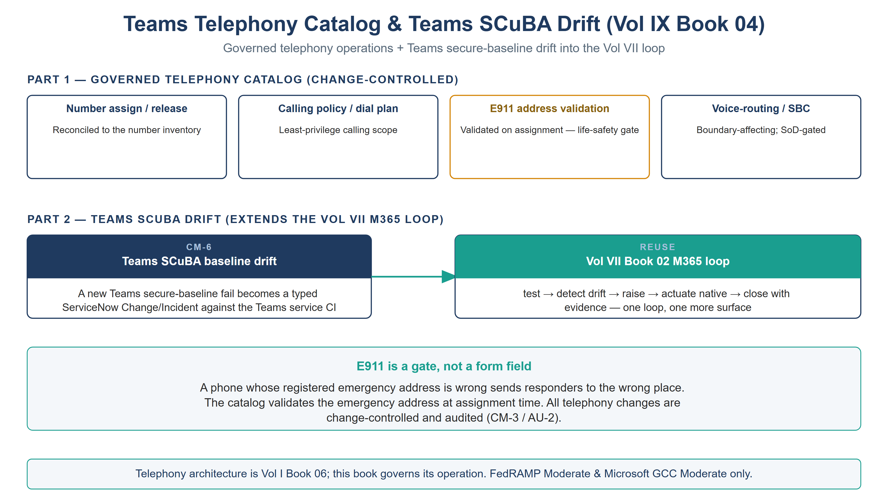

:::: {.content-hidden unless-profile="ssa"}
::: {.fouo-banner}
INTERNAL — NOT FOR PUBLIC DISTRIBUTION
:::
::::

::: {.aan-warning}
## Draft Proposal — Subject to Review
Developed by the **CSI Team (Cloud Services Infrastructure)**; not yet reviewed or approved by the  CIO Office, OIS, or leadership. **Date Code:** 2026-07-14 11:56 ET
:::

::: {.aan-important}
**Series Context** — Volume IX Book 04. The Teams telephony *architecture* is already established in **Vol I Book 06 (Federal Telecommunications Modernization)** — Teams Phone, session border controllers, Direct Routing, Operator Connect, and Calling Plans. This book adds the two things that make it operationally complete: a **governed telephony catalog** for the standing operator tasks, and **Teams SCuBA drift** wired into the Vol VII M365 compliance loop.
:::

# What This Document Addresses

Teams telephony carries two kinds of day-2 work that are typically ungoverned. The first is *operator requests* — assigning a phone number, setting a calling policy, changing voice routing — each a change to a configuration surface with real safety and audit implications (emergency calling, toll fraud, lawful-access logging). The second is *secure-configuration drift* — the Teams service has a CISA SCuBA baseline just like the rest of M365, and it drifts.

This book governs the first as catalog items and folds the second into the existing compliance loop, so the telephony estate is both operable and continuously assessed.

{#fig-vol9b04-telephony fig-alt="A house-style two-part diagram titled Teams Telephony Catalog and Teams SCuBA Drift (Vol IX Book 04), on a white background. Part 1, labeled GOVERNED TELEPHONY CATALOG (CHANGE-CONTROLLED), holds four cards: Number assign/release (reconciled to the number inventory); Calling policy/dial plan (least-privilege calling scope); E911 address validation, outlined in amber (validated on assignment — a life-safety gate); and Voice-routing/SBC (boundary-affecting, SoD-gated). Part 2, labeled TEAMS SCUBA DRIFT (EXTENDS THE VOL VII M365 LOOP), shows a navy CM-6 card, Teams SCuBA baseline drift (a new Teams secure-baseline fail becomes a typed ServiceNow Change/Incident against the Teams service CI), with a teal arrow into a teal REUSE card, the Vol VII Book 02 M365 loop (test, detect drift, raise, actuate native, close with evidence — one loop, one more surface). A teal panel reads 'E911 is a gate, not a form field': a phone whose registered emergency address is wrong sends responders to the wrong place, so the catalog validates it at assignment time, and all telephony changes are change-controlled and audited (CM-3 / AU-2). A footer states the telephony architecture is Vol I Book 06 and this book governs its operation, FedRAMP Moderate and Microsoft GCC Moderate only. White background. Authored house-style diagram." width="100%"}

# Part 1 — The Telephony Catalog

| Catalog item | Control | Note |
|---|---|---|
| Phone-number assignment / release | CM-3 | Reconciled to the number inventory; release returns the number to the pool |
| Calling-policy / dial-plan assignment | CM-3 | Least-privilege calling scope (e.g., domestic-only by default) |
| **Emergency address (E911) validation** | CM-3 | **Validated on assignment** — a mis-mapped emergency address is a life-safety defect |
| Voice-routing / SBC change | CM-3 | Change-controlled; SBC config is a boundary-affecting change |
| Call-detail + admin-action telemetry | AU-2 | CDRs and telephony admin actions routed into the evidence contract at onboarding — the collection item that carries this book's AU-2 closure |

::: {.aan-important}
**E911 is not optional metadata.** Emergency-address validation is the one telephony step where a silent error has physical consequences: a phone whose registered location is wrong sends responders to the wrong place. The catalog validates the emergency address at assignment time — it is a gate, not a form field.
:::

# Part 2 — Teams SCuBA Drift

Teams is an M365 workload with a CISA SCuBA secure-configuration baseline (external access, meeting policies, app permissions, federation). This book does **not** build a new compliance loop for it — it extends the **Vol VII Book 02 M365 loop** to the Teams surface: the SCuBA assessment runs, a new baseline fail becomes a typed ServiceNow Change/Incident against the Teams service CI, an owner remediates on the native surface, and re-test closes it with evidence (CM-6). One loop, one more surface.

# Closure Necessity

::: {.aan-tip}
## Closure Necessity — voice is a governed surface, not a phone system
Vol I Book 06 proves the telephony architecture; the SCuBA baseline and the Vol VII loop prove the compliance mechanism. This book makes the *operation* of telephony governed: number and routing changes carry change control and E911 validation, and Teams secure-config drift is tracked like any other M365 surface. Without it, voice is the one modern workload still run by ad-hoc admin action — ungoverned changes (CM-3), an untracked SCuBA baseline (CM-6), and an unvalidated emergency-calling posture.
:::

# NIST SP 800-53 Rev 5 Control Closure — Authorities Closed Here

Generated from the compliance spine (`aan-compliance-spine.yml`); not hand-edited here.

<!-- authorities:book-day2-telephony — generated from aan-compliance-spine.yml; do not hand-edit -->
| Control | Title | Closing mechanism (function, not product) | Accreditation gate | Authority drivers | Evidence slot | FedRAMP 20x KSI | Tool-attestable? |
|---|---|---|---|---|---|---|---|
| CM-3 | Configuration Change Control | Number assignment, calling-policy, and voice-routing/SBC changes as change-controlled catalog items with E911 emergency-address validation | FedRAMP Moderate | NIST SP 800-53 Rev 5; OMB Circular A-130 | Security / supply chain | KSI-CMT | No |
| CM-6 | Configuration Settings | Teams SCuBA / secure-baseline drift raised as a ServiceNow Change/Incident, extending the Vol VII Book 02 M365 loop to the Teams surface | FedRAMP Moderate | NIST SP 800-53 Rev 5; CISA SCuBA; CISA BOD 25-01 | Security / supply chain | KSI-CMT | No |
| AU-2 | Event Logging | Call-detail and telephony admin actions audited into the evidence contract | FedRAMP Moderate | NIST SP 800-53 Rev 5; OMB M-21-31 | Telemetry | KSI-MLA | No |

: Authorities Closed Here — Teams Telephony Catalog & Teams SCuBA Drift († = Closure-Necessity anchor: no alternate closure path) {.striped .hover}

# Honest Limits

- Media-path confidentiality (SC-8) and the SBC accreditation are Vol I Book 06 concerns; this book governs the *operational changes* to that architecture, not the transport crypto itself.
- E911 validation is only as good as the address-to-location data source; the catalog validates against it, but the source must be maintained.
- The Teams SCuBA baseline coverage depends on the assessment tooling's Teams checks (Vol VI Book 08 test-coverage concern).

# Cross-References

- **Vol I Book 06 (Federal Telecommunications Modernization)** — the Teams Phone / SBC / Direct Routing / Operator Connect architecture this book operationalizes.
- **Vol VII Book 02 (M365 Compliance)** — the loop the Teams SCuBA drift extends.
- **[CISA SCuBA Secure Configuration Baselines](https://www.cisa.gov/resources-tools/services/secure-cloud-business-applications-scuba-project)** — the SCuBA baseline reference.

# Provenance

Draft. Teams Phone, SBC, Direct Routing, Operator Connect, and the SCuBA Teams baseline are deployed examples; the governed-catalog + SCuBA-drift-into-the-loop discipline is the invariant. The figure above is authored as committed house-style SVG, rendered to PNG at 3× for crisp `.docx` zoom.
