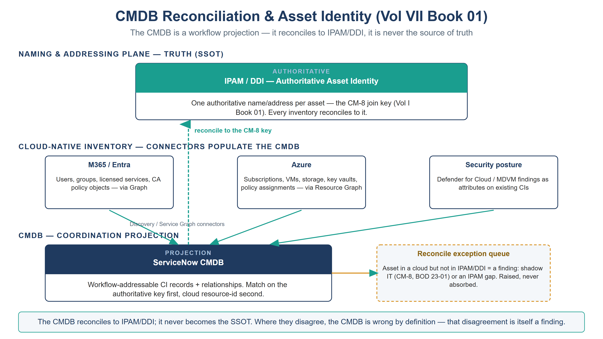

:::: {.content-hidden unless-profile="ssa"}
::: {.fouo-banner}
INTERNAL — NOT FOR PUBLIC DISTRIBUTION
:::
::::

::: {.aan-warning}
## Draft Proposal — Subject to Review
Developed by the **CSI Team (Cloud Services Infrastructure)**; not yet reviewed or approved by the  CIO Office, OIS, or leadership. **Date Code:** 2026-07-12 15:00 ET
:::

::: {.aan-important}
**Series Context** — Volume VII Book 01. The foundation of the coordination layer: before ServiceNow can route control work over M365 and Azure, its CMDB must know what exists — and that knowledge must **reconcile to** the authoritative IPAM/DDI asset identity established in **Vol I Book 01**, not compete with it. This book is the CM-8 join that makes every downstream compliance task addressable to a real, single asset.
:::

# What This Document Addresses

A compliance task is only as good as the asset it names. "Remediate the exposed storage account" is actionable; "remediate something in one of three subscriptions" is not. Coordination therefore begins with inventory: the CMDB must hold every M365 and Azure asset a control claim can attach to, keyed to an identity an assessor can trace end to end.

This book covers how the CMDB is populated from the two cloud surfaces, and — the load-bearing part — how it is **reconciled** to the authoritative asset identity so the CMDB never becomes a second, competing source of truth. The naming plane (IPAM/DDI, Vol I Book 01) owns identity; the CMDB is its workflow projection.

# The Reconciliation Model

::: {.aan-important}
**The CMDB is a projection, not a source of truth.** Discovery and connectors *populate* the CMDB; the authoritative IPAM/DDI record *governs* identity. Where they disagree, the CMDB is wrong by definition and the disagreement is itself a finding. This is the CM-8 join key discipline (Vol I Book 01, Vol III Book 03): one authoritative name/address per asset, and every inventory — ServiceNow, Defender, Azure Resource Graph, Purview — reconciled to it.
:::

| Layer | Owns | Realized by | Reconciles to |
|---|---|---|---|
| **Naming & addressing plane (truth)** | Authoritative asset identity — name, address, DNS/IPAM record | IPAM/DDI (Vol I Book 01) | — (it is the SSOT) |
| **Cloud-native inventory** | Per-surface resource state | M365 Graph; Azure Resource Graph; Defender inventory | The naming plane, at ingest |
| **CMDB (coordination projection)** | Workflow-addressable CI records + relationships | ServiceNow Discovery / Service Graph Connectors | The naming plane, on every reconcile pass |

{#fig-vol7b01-reconcile fig-alt="A house-style layered diagram titled CMDB Reconciliation and Asset Identity (Vol VII Book 01), subtitle 'The CMDB is a workflow projection — it reconciles to IPAM/DDI, it is never the source of truth', on a white background. At the top, under the band NAMING AND ADDRESSING PLANE — TRUTH (SSOT), a wide teal-headed card reads IPAM/DDI — Authoritative Asset Identity: one authoritative name/address per asset, the CM-8 join key (Vol I Book 01), every inventory reconciles to it. A middle band, CLOUD-NATIVE INVENTORY — CONNECTORS POPULATE THE CMDB, holds three cards: M365/Entra (users, groups, licensed services, CA policy objects via Graph); Azure (subscriptions, VMs, storage, key vaults, policy assignments via Resource Graph); and Security posture (Defender for Cloud and MDVM findings as attributes on existing CIs). Teal arrows run from the three inventory cards down into a bottom band, CMDB — COORDINATION PROJECTION, where a navy-headed card reads ServiceNow CMDB: workflow-addressable CI records and relationships, match on the authoritative key first and the cloud resource-id second. A dashed teal arrow labeled 'reconcile to the CM-8 key' runs upward from the CMDB to the IPAM/DDI card. An amber dashed card to the right, Reconcile exception queue, notes that an asset present in a cloud but absent from IPAM/DDI is a finding — shadow IT (CM-8, BOD 23-01) or an IPAM gap — raised, never absorbed. A footer band states the CMDB reconciles to IPAM/DDI and never becomes the SSOT; where they disagree the CMDB is wrong by definition, and that disagreement is itself a finding. White background. Authored house-style diagram." width="100%"}

# Population — Where CIs Come From

The CMDB is populated by connectors, never by hand-entry, so it is reproducible and diffable:

| Source surface | Connector / method | Representative CI classes |
|---|---|---|
| **M365 / Entra** | Microsoft Graph via an in-boundary integration (users, groups, licensed services, service principals, Conditional Access policy objects as configuration CIs) | User, Group, SaaS Subscription, CA Policy (config CI) |
| **Azure** | Azure Resource Graph / Service Graph Connector for Azure (subscriptions, resource groups, VMs, storage, key vaults, policy assignments) | Cloud Subscription, VM Instance, Storage Account, Key Vault, Policy Assignment (config CI) |
| **Endpoint / hybrid** | Discovery via the in-boundary MID Server; Arc-projected servers as CIs | Server, Arc-enabled Server |
| **Security posture** | Defender for Cloud / MDVM inventory as attributes and relationships on existing CIs (not a parallel CI tree) | (attributes on VM/Storage/Subscription CIs) |

::: {.aan-note}
**Configuration objects are CIs too.** A Conditional Access policy, an Azure Policy assignment, and a SCuBA baseline setting are *configuration state* the compliance workflow reasons about — they are modeled as configuration CIs so a drift task can reference the exact object that drifted, not a free-text description of it.
:::

# The Reconcile Pass — Making the Join Real

Each ingest runs a reconcile step against the naming plane before a CI is trusted for routing:

1. **Match** — the incoming cloud asset is matched to an authoritative IPAM/DDI record by name/address (the CM-8 key). Identification rules use the authoritative key first, cloud resource-id second — never the reverse, or the CMDB would anoint the cloud id as truth.
2. **Bind** — the matched CI carries the authoritative identity as its correlation key, so every downstream task, change, and evidence record inherits one traceable asset identity across surfaces.
3. **Flag** — an asset present in a cloud surface but absent from the naming plane is a **reconciliation exception**: either shadow IT (a real finding — CM-8, BOD 23-01) or an IPAM gap (a naming-plane defect). Either way it is raised, not silently absorbed.

The reconcile exception queue is itself a compliance artifact: it is the running measure of how completely the estate is enumerated, which is exactly what CM-8 and CISA BOD 23-01 require.

# Closure Necessity

::: {.aan-tip}
## Closure Necessity — you cannot coordinate what you cannot address
Every downstream book in this volume routes work *to an asset*. If the CMDB's asset identity is not reconciled to one authoritative source, the same VM appears as three CIs, a remediation task closes against the wrong one, and the evidence trail forks. The naming plane is the necessity anchor (Vol I Book 01); this book is the discipline that keeps the coordination layer bound to it. Skip the reconcile and the whole volume routes work into ambiguity.
:::

# NIST SP 800-53 Rev 5 Control Closure — Authorities Closed Here

The table below is generated from the series compliance spine (`aan-compliance-spine.yml`) by `render_authorities_table.py`; it is not hand-edited here. It records the *coordination* closures this book operationalizes — CM-8 reconciliation and the CM-3 change gate — neither of which re-closes the naming-plane necessity (that stays in Vol I Book 01).

<!-- authorities:book-sn-cmdb — generated from aan-compliance-spine.yml; do not hand-edit -->
| Control | Title | Closing mechanism (function, not product) | Accreditation gate | Authority drivers | Evidence slot | FedRAMP 20x KSI | Tool-attestable? |
|---|---|---|---|---|---|---|---|
| CM-8 | System Component Inventory | ServiceNow CMDB populated by Discovery/Service Graph connectors and reconciled to the authoritative IPAM/DDI asset identity (CM-8 join key); DDI stays the SSOT, the CMDB is the workflow projection | FedRAMP Moderate | NIST SP 800-53 Rev 5; CISA BOD 23-01 | Network | KSI-PIY | No |
| CM-3 | Configuration Change Control | Change Management as the CM-3 gate: every compliance-affecting change to M365/Azure carries an approved, reviewable change record before actuation | FedRAMP Moderate | NIST SP 800-53 Rev 5; OMB Circular A-130 | Security / supply chain | KSI-CMT | No |

: Authorities Closed Here — CMDB Reconciliation & Asset Identity (reconciled to IPAM/DDI) († = Closure-Necessity anchor: no alternate closure path) {.striped .hover}

# Honest Limits

- Discovery and connector coverage decays: a new resource type or a connector version drift leaves assets un-modeled. The reconcile-exception queue surfaces the gap, but only if it is worked — an unworked queue is a silent CM-8 regression.
- The CMDB reconciles to the naming plane; it cannot *repair* the naming plane. An IPAM gap must be fixed in IPAM (Vol I Book 01), not patched in the CMDB, or the fix inverts the truth relationship.
- Substituting the CMDB platform changes the connectors and identification rules; the reconcile-to-the-naming-plane discipline is invariant.

# Cross-References

- **Vol I Book 01** — the authoritative IPAM/DDI source of the CM-8 asset-identity join key this book reconciles to (the CM-8 *closure-necessity* anchor is Vol III Book 03).
- **Vol III Book 03 (Patch & Systems Management)** and **Vol III Book 07 (Evidence Fabric)** — other inventories that reconcile to the same join key.
- **Vol VII Book 02 / 03** — the M365 and Azure compliance books that route work to the CIs this book establishes.
- **Vol VII Book 05** — the scoped app that carries the Discovery/connector configuration and the reconcile job.

# Provenance

Draft. ServiceNow, Microsoft Graph, and Azure Resource Graph are deployed examples of the connector mechanism; the reconcile-to-the-naming-plane discipline is the invariant. Vendor-capability claims in this draft (Service Graph Connector for Azure, Graph ingest of Conditional Access policy objects, MID Server Discovery, Defender/MDVM inventory) are pending vendor-documentation citations in a References section. The reconciliation-model figure is authored as committed house-style SVG (rasterized to PNG).
