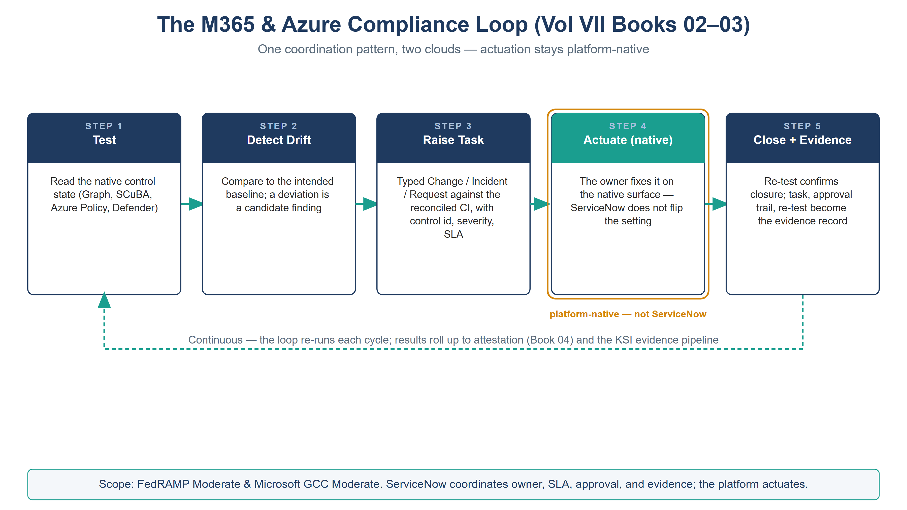

:::: {.content-hidden unless-profile="ssa"}
::: {.fouo-banner}
INTERNAL — NOT FOR PUBLIC DISTRIBUTION
:::
::::

::: {.aan-warning}
## Draft Proposal — Subject to Review
Developed by the **CSI Team (Cloud Services Infrastructure)**; not yet reviewed or approved by the  CIO Office, OIS, or leadership. **Date Code:** 2026-07-12 15:00 ET
:::

::: {.aan-important}
**Series Context** — Volume VII Book 02. The M365 half of the coordination layer. Microsoft 365 is the SaaS control plane — identity, Conditional Access, secure-configuration baselines (CISA SCuBA / BOD 25-01), and Purview data protection. This book operates that surface's control state as ServiceNow work: drift becomes a tracked task, a task closure produces evidence, and the roll-up feeds attestation (Vol VII Book 04). **Actuation stays platform-native** — Graph and the M365 policy engines make the change; ServiceNow governs who, when, under what approval, and with what evidence.
:::

# What This Document Addresses

The M365 boundary carries a dense set of federal control obligations: phishing-resistant authentication and Conditional Access (IA-2, AC-3), account lifecycle, separation of duties, and least privilege (AC-2, AC-5, AC-6), secure-configuration baselines mandated by CISA SCuBA and BOD 25-01 (CM-6), and data protection through Purview (AC-4, SC-28, AU-10, covered in depth in Vol III Book 05). Each obligation has a *tested state* and a *drift condition*, and each drift condition needs an owner, a clock, and a closure record before an assessor will treat the control as operating.

This book shows how M365 control state is turned into ServiceNow work without ServiceNow becoming the M365 admin console. The pattern is uniform across every control family: **detect drift on the native surface → raise a typed task against the reconciled CI → route to the owner → verify closure on the native surface → emit evidence.**

# The M365 Compliance Loop

Every M365 control family runs the same five-step loop. The surface differs; the loop does not.

{#fig-vol7-loop fig-alt="A house-style five-step pipeline titled The M365 and Azure Compliance Loop (Vol VII Books 02–03), subtitle 'One coordination pattern, two clouds — actuation stays platform-native', on a white background. Five navy-headed cards are joined left to right by teal arrows: Step 1 Test — read the native control state (Graph, SCuBA, Azure Policy, Defender); Step 2 Detect Drift — compare to the intended baseline, a deviation is a candidate finding; Step 3 Raise Task — a typed Change, Incident, or Request against the reconciled CI with control id, severity, and SLA; Step 4 Actuate (native), drawn with a teal header and an amber ring and labeled 'platform-native — not ServiceNow' — the owner fixes it on the native surface, ServiceNow does not flip the setting; Step 5 Close plus Evidence — re-test confirms closure, and the task, approval trail, and re-test become the evidence record. A dashed teal return arrow runs from Step 5 back to Step 1, labeled 'Continuous — the loop re-runs each cycle; results roll up to attestation (Book 04) and the KSI evidence pipeline'. A footer band states the scope is FedRAMP Moderate and Microsoft GCC Moderate, and that ServiceNow coordinates owner, SLA, approval, and evidence while the platform actuates. White background. Authored house-style diagram." width="100%"}

| Step | What happens | Where it happens |
|---|---|---|
| **1. Test** | The M365 control state is read — SCuBA/secure-baseline result, CA policy inventory, Purview label/DLP posture | Native (Graph, SCuBA tooling, Purview) — in-boundary read |
| **2. Detect drift** | Read state is compared to the intended baseline; a deviation is a candidate finding | ServiceNow (or the native tool, ingested) |
| **3. Raise** | A typed task (Incident / Change / Request) is created against the reconciled CI, with control id, severity, and SLA class | ServiceNow |
| **4. Actuate** | The owner makes the change on the **native** surface (Graph / CA / Purview); ServiceNow does not flip the setting | Native — platform actuation |
| **5. Close + evidence** | Re-test confirms closure; the task, approval trail, and re-test result become the evidence record | ServiceNow → evidence pipeline |

::: {.aan-note}
**Why ServiceNow does not actuate M365 directly.** A workflow platform holding standing write authority over Conditional Access or tenant configuration is itself a privilege-escalation and blast-radius problem (AC-6). The coordination role needs *read* over control state and *task-creation* over its own tables — not admin over the estate it governs. Where an automated remediation is genuinely safe and reversible, it is invoked as a scoped, logged, individually-approved action, never as blanket standing access.
:::

# Control Family 1 — SCuBA / Secure-Configuration Baseline Drift (CM-6)

CISA SCuBA (operationalized under BOD 25-01) defines secure-configuration baselines for the M365 services. The conformance tooling (ScubaGear and equivalents) *measures* drift from those baselines; it does not, by itself, own the fix. That gap is exactly the coordination role.

- **Test:** the SCuBA/secure-baseline assessment runs on a schedule and produces a per-policy pass/fail result.
- **Detect + Raise:** each new fail becomes a ServiceNow **Change** (if it needs a controlled configuration change) or **Incident** (if it is an unexpected regression), tagged with the SCuBA policy id, the mapped NIST control (CM-6), a severity, and the reconciled service CI.
- **Actuate:** the owning team applies the baseline setting via the M365 admin surface / policy-as-code (Vol VI Book 06 carries the SCuBA-as-code baseline).
- **Close:** the next assessment pass flips the result to pass; ServiceNow closes the task and stamps the re-test evidence.

The SCuBA finding-to-task mapping is held as data (a control map), so the same finding always raises the same typed task with the same control binding — reproducible, not ad hoc.

# Control Family 2 — Account Lifecycle & Conditional Access Exceptions (AC-2)

Identity is the M365 control surface with the most standing human work: joiner/mover/leaver events, privileged-role requests, and Conditional Access *exceptions* (the break-glass account, a temporary block on a legacy client, a scoped exclusion for a service). Each is an access decision that must be requested, approved, time-bound, and reviewed.

- **Request:** a JML or CA-exception request enters as a ServiceNow **Request** with the target identity CI, the justification, and a required expiry.
- **Approve:** the request routes through the approval chain; a CA-exception request additionally requires a security approver, because an exception weakens a blocking control.
- **Actuate:** on approval, the identity team applies the change to Entra via Graph (the account provisioned, the exclusion group membership set) — logged, scoped, and reversible.
- **Review:** every exception carries an expiry; ServiceNow drives the **access review** that re-attests or revokes it. An expired-but-still-present exclusion is a high-severity finding, not a quiet default.

This is the AC-2 / AC-5 / AC-6 lifecycle expressed as reviewable work: the break-glass exclusion mandated in every blocking CA policy (Vol VI Book 02) is *visible in the request record and its review*, which a portal screenshot can never prove over time.

# Control Family 3 — Purview Data-Protection State (feeds AU-10 / SC-28)

Purview owns the M365 data-protection controls in depth (Vol III Book 05): sensitivity labels, DLP policy, and the audit trail behind AU-10 and SC-28. The coordination role here is narrower — Purview *is* the actuation and evidence engine — but two workflows still belong in ServiceNow:

1. **DLP-override and mass-label-change review.** A user override of a DLP block, or a mass label-removal/decrypt event, is a Vol III Book 05 detection *and* a ServiceNow Incident with a review task — the human-judgment step the detection cannot make.
2. **Label/DLP policy change control.** A change to the label taxonomy or a DLP rule is a compliance-affecting change; it carries a ServiceNow Change record (CM-3) so the data-protection posture has an approval trail, not a silent edit.

Purview state (label coverage, DLP policy version, audit-retention configuration) is ingested as attestation input feeding CA-7, so the data-protection control shows as *operating with evidence*, not merely *configured*.

# Continuous Monitoring Roll-Up (CA-7)

Each loop above emits its result — the SCuBA pass/fail, the exception review outcome, the Purview posture read — into the continuous-monitoring feed. ServiceNow rolls these into a per-control M365 posture that Vol VII Book 04 turns into attestation and KSI evidence. The point of the roll-up is that CA-7 is satisfied by *actioned* monitoring: drift that becomes a task that becomes closure that becomes evidence, not a dashboard nobody works.

# Closure Necessity

::: {.aan-tip}
## Closure Necessity — SCuBA measures the gap; someone must own the close
The conformance tooling (ScubaGear and equivalents) proves *where* M365 deviates from the secure baseline — it authors no fix and owns no clock. The architecture and Vol VI baseline-as-code establish the mechanism; its sufficiency is what the Vol VI Book 08 validation harness demonstrates. This book is what makes M365 closure *operating*: every deviation gets an owner, an SLA, an approval trail, and a re-tested evidence record. Remove it and SCuBA becomes a report that is read and not acted on — the exact conformance-tooling coverage gap the series names (Theme E), one surface at a time.
:::

# NIST SP 800-53 Rev 5 Control Closure — Authorities Closed Here

Generated from the series compliance spine (`aan-compliance-spine.yml`) by `render_authorities_table.py`; not hand-edited here. These are *coordination* closures — the M365 control state operated as tracked work — not a re-closure of the identity/data mechanisms Volumes I, III, and VI already own.

<!-- authorities:book-sn-m365 — generated from aan-compliance-spine.yml; do not hand-edit -->
| Control | Title | Closing mechanism (function, not product) | Accreditation gate | Authority drivers | Evidence slot | FedRAMP 20x KSI | Tool-attestable? |
|---|---|---|---|---|---|---|---|
| AC-2 | Account Management | Joiner/mover/leaver and Conditional-Access exception requests raised, approved, and access-reviewed as ServiceNow tasks over the Entra estate | FedRAMP Moderate | NIST SP 800-53 Rev 5; OMB M-22-09 | Identity | KSI-IAM | No |
| CA-7 | Continuous Monitoring | M365 control-test results (Graph, SCuBA, Purview) ingested as attestation tasks feeding the KSI evidence pipeline | FedRAMP Moderate | NIST SP 800-53 Rev 5; NIST SP 800-137; FedRAMP 20x KSIs | Telemetry | KSI-MLA | No |
| CM-6 | Configuration Settings | SCuBA / secure-baseline drift on the M365 SaaS surface raised as a ServiceNow Incident/Change task and tracked to closure (actuation stays platform-native) | FedRAMP Moderate | NIST SP 800-53 Rev 5; CISA SCuBA; CISA BOD 25-01 | Security / supply chain | KSI-CMT, KSI-SVC | No |

: Authorities Closed Here — M365 Federal Control Compliance Automation († = Closure-Necessity anchor: no alternate closure path) {.striped .hover}

# Honest Limits

- A ServiceNow task closes when the native re-test passes — so the loop is only as trustworthy as the test. A SCuBA check that does not cover a setting leaves a blind spot ServiceNow cannot see; test coverage is a Vol VI Book 08 concern.
- Automated remediation on the M365 surface is used sparingly and always scoped and logged; the default is human-actuated change with an approval trail, because standing write authority over Conditional Access is a control weakness in itself.
- Purview is the data-protection actuation and evidence engine; ServiceNow coordinates the human-judgment and change-control steps around it, not the classification itself.

# Cross-References

- **Vol VI Book 02 (Identity & Access as Code)** — the Conditional Access / PIM policy this book governs the exceptions and reviews for.
- **Vol VI Book 06 (Configuration Baselines & Hardening)** — the SCuBA-as-code baseline whose drift this book routes.
- **Vol III Book 05 (Data Protection — Purview)** — the data-protection controls this book coordinates the review and change-control steps for.
- **Vol VII Book 01** — the reconciled CIs every M365 task is raised against.
- **Vol VII Book 04** — where the M365 posture roll-up becomes attestation and KSI evidence.

# Provenance

Draft. Microsoft 365, Graph, SCuBA/ScubaGear, and Purview are deployed examples; the detect→raise→actuate-native→close→evidence loop is the invariant. Vendor claims cite vendor documentation (see References). The compliance-loop figure is authored as committed house-style SVG; further per-book figures follow in the PPTX→DOCX sync pass.

# References

| Claim | Source |
|---|---|
| SCuBA secure-configuration baselines for M365 (BOD 25-01) | CISA SCuBA — <https://www.cisa.gov/scuba> |
| Microsoft 365 secure-configuration assessment (ScubaGear) | <https://github.com/cisagov/ScubaGear> |
| Conditional Access & Entra account management via Graph | Microsoft Learn — <https://learn.microsoft.com/graph/api/resources/conditionalaccesspolicy> |
| Purview data-protection (labels, DLP, audit) | Microsoft Learn — <https://learn.microsoft.com/purview/> |
| ServiceNow as workflow/CMDB/evidence coordination hub | Expansion Plan §16 — `docs/customer-documents/federal-aan-series/AAN_Series_Expansion_Plan_Substrate_Accreditation.md` |
