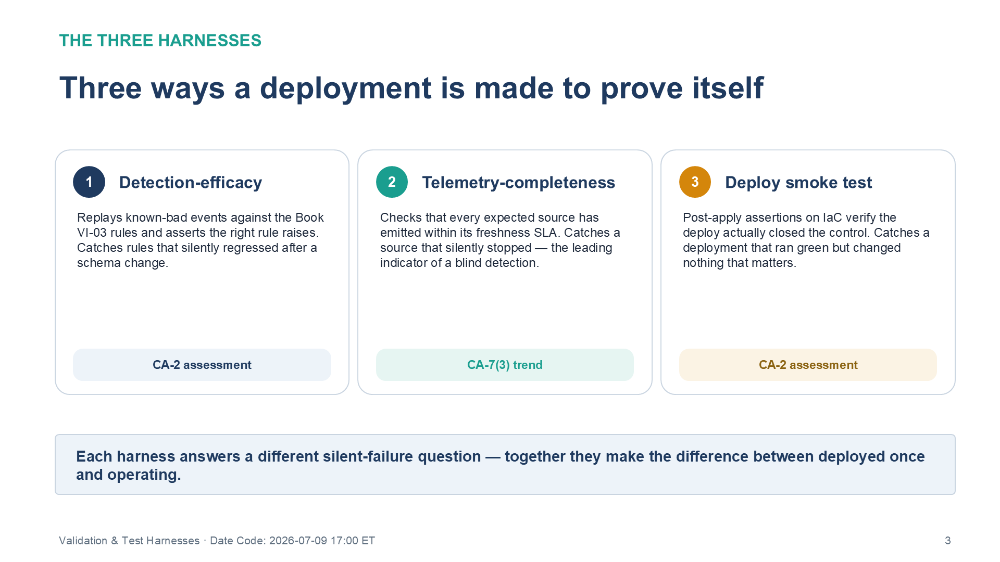
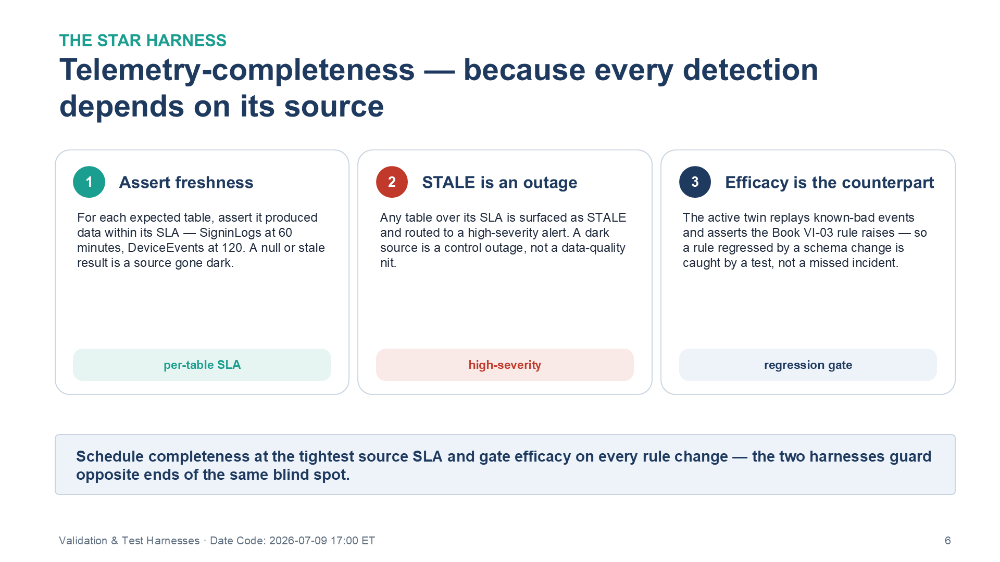
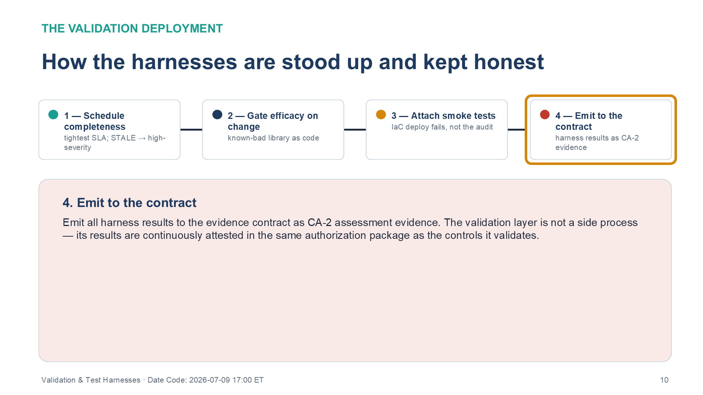

:::: {.content-hidden unless-profile="ssa"}
::: {.fouo-banner}
INTERNAL — NOT FOR PUBLIC DISTRIBUTION
:::
::::

::: {.aan-warning}
## Draft Proposal — Subject to Review
Developed by the **CSI Team (Cloud Services Infrastructure)**; not yet reviewed or approved by the  CIO Office, OIS, or leadership. **Date Code:** 2026-07-09 15:13 ET
:::

::: {.aan-important}
**Series Context** — Volume VI Book 08. The validation layer for the whole volume: the harnesses that prove each deployed artifact actually works and keeps working, closing the gap between "deployed" and "operating."
:::

# What This Document Addresses

The most dangerous failure in this volume is the silent one: a detection that never fires because a source stopped emitting, a baseline that drifted unnoticed, an IaC change that regressed a control, an evidence emitter that went dark. A rebuild fails silently far more often than it fails loudly, and a control that fails silently is worse than one known to be absent — it carries false confidence into an authorization.

This book carries the harnesses that make failure loud: detection-efficacy tests against known-good events, telemetry-completeness workbooks that alert when a source goes dark, and smoke tests that verify a deployment actually closed what it claims.

# The Three Harnesses

{#fig-vol6b08-harnesses fig-alt="A three-card diagram titled 'Three ways a deployment is made to prove itself,' under the eyebrow 'The three harnesses.' Card 1 (navy), Detection-efficacy: replays known-bad events against the Book VI-03 rules and asserts the right rule raises, catching rules that silently regressed after a schema change; tagged CA-2 assessment. Card 2 (teal), Telemetry-completeness: checks that every expected source has emitted within its freshness SLA, catching a source that silently stopped — the leading indicator of a blind detection; tagged CA-7(3) trend. Card 3 (amber), Deploy smoke test: post-apply assertions on IaC verify the deploy actually closed the control, catching a deployment that ran green but changed nothing that matters; tagged CA-2 assessment. A summary bar states each harness answers a different silent-failure question — together they make the difference between deployed once and operating. White background. Source: Vol VI Book 08 — Federal Organization Compliance — Validation & Test Harnesses briefing deck, Date Code 2026-07-09 17:00 ET." width="100%"}

| Harness | Question it answers | Fires when |
|---|---|---|
| Detection-efficacy | Do the Book VI-03 rules still catch what they should? | A replayed known-bad event does not raise its rule |
| Telemetry-completeness | Is every expected source still emitting? | A table's freshness exceeds its SLA |
| Deploy smoke test | Did the IaC actually close the control? | A post-apply assertion fails |

# Deployable Artifacts

| Artifact | Realizes | Deployed example | What it catches |
|---|---|---|---|
| Detection-efficacy tests | CA-2 assessment | Replay of known-good/attack events against Book VI-03 rules | False-negative posture; rule regressions |
| Telemetry-completeness workbook | CA-7(3) trend monitoring | Data-freshness checks across every expected table | Sources that silently stopped emitting |
| Deploy smoke tests | CA-2 assessment | Post-apply assertions on IaC (Books VI-01/02/05/06) | Deployments that did not close the control |
| Baseline conformance re-check | CM-6 verification | Scheduled re-scan vs. the intended baseline | Configuration drift past reconciliation |

## Illustrative artifact — the telemetry-completeness check

The single most valuable harness, because every other control in the volume depends on its source still emitting. It asserts that each expected table has produced data within its freshness SLA; a table that goes silent is the leading indicator of a blind detection.

{#fig-vol6b08-completeness fig-alt="A three-card diagram titled 'Telemetry-completeness — because every detection depends on its source,' under the eyebrow 'The star harness.' Card 1 (teal), Assert freshness: for each expected table, assert it produced data within its SLA — SigninLogs at 60 minutes, DeviceEvents at 120; a null or stale result is a source gone dark; tagged per-table SLA. Card 2 (red), STALE is an outage: any table over its SLA is surfaced as STALE and routed to a high-severity alert — a dark source is a control outage, not a data-quality nit; tagged high-severity. Card 3 (navy), Efficacy is the counterpart: the active twin replays known-bad events and asserts the Book VI-03 rule raises, so a rule regressed by a schema change is caught by a test, not a missed incident; tagged regression gate. A summary bar states you schedule completeness at the tightest source SLA and gate efficacy on every rule change — the two harnesses guard opposite ends of the same blind spot. White background. Source: Vol VI Book 08 — Federal Organization Compliance — Validation & Test Harnesses briefing deck, Date Code 2026-07-09 17:00 ET." width="100%"}

```kql
// Telemetry-completeness — alert when any expected source exceeds its freshness SLA (CA-7(3))
let expected = datatable(TableName:string, SlaMinutes:long) [
  "SigninLogs", 60, "AADNonInteractiveUserSignInLogs", 60,
  "OfficeActivity", 120, "DeviceEvents", 120
];
expected
| join kind=leftouter (
    union withsource=TableName SigninLogs, AADNonInteractiveUserSignInLogs, OfficeActivity, DeviceEvents
    | summarize LastSeen = max(TimeGenerated) by TableName
  ) on TableName
| extend AgeMin = datetime_diff('minute', now(), LastSeen)
| extend Status = iff(isnull(LastSeen) or AgeMin > SlaMinutes, "STALE", "ok")
| where Status == "STALE"        // any row here is a source that went dark — a blind detection
| project TableName, LastSeen, AgeMin, SlaMinutes
```

The detection-efficacy harness is the active counterpart: it replays a library of known-bad events (a benign impossible-travel pair, a scripted spray burst) into a test scope and asserts the corresponding Book VI-03 rule raises — so a rule that silently regressed after a schema change is caught by a test, not by a missed incident.

# Deployment

{#fig-vol6b08-deployment fig-alt="A four-step horizontal sequence titled 'How the harnesses are stood up and kept honest,' under the eyebrow 'The validation deployment,' with the fourth step highlighted and all connectors filled to show the completed order. Step 1 (teal), Schedule completeness — tightest SLA; STALE to high-severity. Step 2 (navy), Gate efficacy on change — known-bad library as code. Step 3 (amber), Attach smoke tests — IaC deploy fails, not the audit. Step 4 (red, highlighted), Emit to the contract — harness results as CA-2 evidence. The detail panel for step 4 reads: emit all harness results to the evidence contract as CA-2 assessment evidence; the validation layer is not a side process — its results are continuously attested in the same authorization package as the controls it validates. White background. Source: Vol VI Book 08 — Federal Organization Compliance — Validation & Test Harnesses briefing deck, Date Code 2026-07-09 17:00 ET." width="100%"}

1. Schedule the telemetry-completeness workbook at the tightest source SLA; route STALE results to a high-severity alert — a dark source is a control outage.
2. Maintain the known-bad event library as code alongside the Book VI-03 rules; run efficacy tests on every rule change (regression gate) and on a schedule.
3. Attach smoke tests to each IaC pipeline (Books VI-01/02/05/06) so a deploy that does not close its control fails the pipeline, not the audit.
4. Schedule the baseline conformance re-check against the Book VI-06 intended baseline; surface drift past reconciliation as a CM-6 verification finding.
5. Emit all harness results to the evidence contract (Book VI-07) as CA-2 assessment evidence.

# Closure Necessity

::: {.aan-tip}
## Closure Necessity — an unverified control is a hope, not a control
CA-2 requires that controls be *assessed*, and CA-7(3) that monitoring detect degradation. This book is what makes the rest of the volume trustworthy over time: without a harness that fires when a detection goes blind or a baseline drifts, the deployment decays into false confidence — the exact operate-and-tune failure Book VI-00 warns against. The harnesses are the difference between "deployed once" and "operating."
:::

# Controls Operationalized

| Control | Title | How this book deploys it |
|---|---|---|
| CA-2 | Control Assessments | Efficacy + smoke tests exercising deployed controls |
| CA-7(3) | Trend Analyses | Telemetry-completeness and drift trend monitoring |
| CM-6 | Configuration Settings | Scheduled baseline conformance re-scan against the intended baseline |
| SI-4 | System Monitoring | Source-liveness monitoring as a first-class signal |

# Honest Limits

- Detection-efficacy tests prove a rule *can* fire on a known pattern; they do not prove coverage of unknown attacker variants — they bound false-negative regression, not the false-negative floor.
- The known-bad event library must be maintained as attacker behavior and schemas change, or the efficacy test silently ages into a rubber stamp.
- Smoke tests assert what they are written to assert; a control dimension no test covers is still unverified.

# Cross-References

- **Books VI-01…VI-07** — every artifact this volume validates.
- **Book VI-00** — the operate-and-tune discipline these harnesses enforce.
- **Book VI-03** — the detections whose efficacy is tested here.
- **Book VI-07** — validation results emit to the evidence contract as assessment evidence.

# Provenance

Draft. The harnesses are the standing quality gate for the deployable-artifact layer. The KQL is an illustrative pattern to adapt, not a drop-in workbook. Products named are deployed examples of the validation mechanism.
