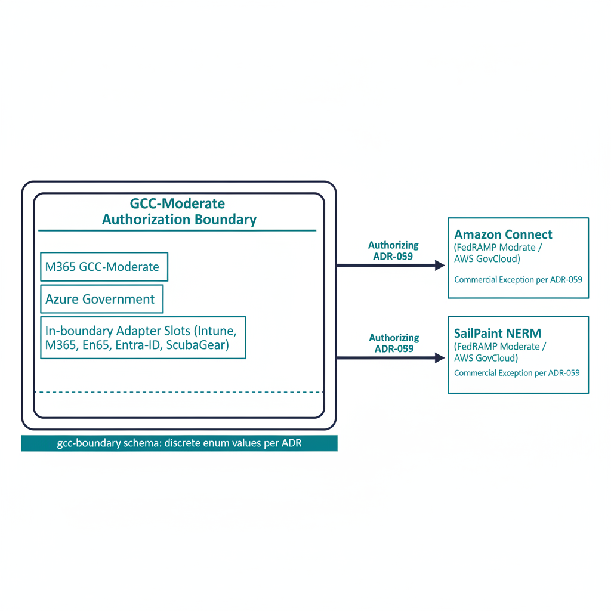

# Cloud Modernization Spec

## Scope

Cross-adapter specification for cloud modernization under the UIAO
substrate. Covers tenant model, authorization boundary treatment, named
exceptions, in-boundary telemetry, and the canonical claim emissions
cloud adapters must produce. The spec is GCC-Moderate-anchored;
boundary-crossing concerns are handled per the
[Boundary Impact Model](../../architecture-series/boundary-impact-model.qmd).

{#fig-cloud-image-01 fig-alt="Center shows the GCC-Moderate authorization boundary as a labeled rectangle. Inside the boundary: M365 GCC-Moderate, Azure Government, in-boundary adapter slots (intune, m365, entra-id, scubagear). Outside the boundary on the right: two named Commercial exceptions per ADR-059 — Amazon Connect (FedRAMP Moderate / AWS GovCloud), SailPoint NERM (FedRAMP Moderate / AWS GovCloud). Each exception is connected to the boundary by a labeled arrow showing its authorizing ADR. Below the diagram, a footer band reads \"gcc-boundary schema: discrete enum values per ADR\". Clean engineering blueprint style, dark navy (#0D1B2E) and teal (#1E8C8C) on white background. No photographs, purely diagrammatic." width="85%"}

## Substrate contract

Every cloud adapter inherits:

- **`gcc-boundary`** — `gcc-moderate` for in-boundary adapters, or one
  of the named exceptions per ADR-059 (`amazon-connect-cc`,
  `sailpoint-nerm`).
- **Microsoft Graph endpoint resolution via
  `_graph_clouds.resolve_graph_base()`** — adapters do not hardcode
  hostnames; they consume `cloud` (`commercial` / `gcc-high` / `dod`,
  default `commercial` also serving GCC-Moderate per ADR-033) plus
  `graph_api_version` plus optional explicit override
  (`graph_endpoint` or `api_base_url`).
- **Unknown clouds fail closed** at construction.

## Adapters in scope (Phase 1+)

| Adapter | Cloud | Class | Notes |
|---|---|---|---|
| `m365` | gcc-moderate | conformance | M365 baseline state |
| `entra-id` | gcc-moderate | modernization | Cloud-native identity |
| `intune` | gcc-moderate (beta API) | modernization | Endpoint management |
| `scubagear` | gcc-moderate | conformance | M365 SCuBA assessor |
| `azure-arc` | gcc-moderate | conformance | Hybrid management surface |
| `amazon-connect-cc` | named exception | conformance | Contact center (per ADR-059) |
| `sailpoint-nerm` | named exception | modernization | Non-employee risk (per ADR-059) |

## Boundary contract

Cloud adapters either:

1. **Operate in-boundary** — declare `gcc-boundary: gcc-moderate`
   and read state via in-boundary APIs. Drift findings are scoped
   to the boundary's capability disposition.
2. **Operate via a named exception** — declare a discrete enum value
   per ADR-059. New exceptions require a canon-change ADR; the enum
   is added in lockstep.

There is no third option. Adapters that require commercial-only
APIs cannot register against GCC-Moderate without an authorizing ADR.

## Integration shape

Cloud adapter claims carry the canonical provenance envelope plus
cloud-specific fields:

```yaml
provenance:
  ...
cloud:
  boundary: "gcc-moderate"
  tenant_id: "{tenant_id}"
  region: "{region}"
  endpoint_class: "graph-v1.0 | graph-beta | arm | arc"
```

The `endpoint_class` field is canonical; it is what makes
boundary-aware OSCAL emission possible.

## Control mapping

The cloud domain maps onto NIST 800-53 SC / SI / SR families and onto
FedRAMP CR26 cloud-specific controls. Where GCC-Moderate feature gaps
require compensation (per the
[Boundary Impact Model](../../architecture-series/boundary-impact-model.qmd)),
the spec requires an explicit compensating-mechanism declaration in
the OSCAL package.

## Drift considerations

- **`DRIFT-PROVENANCE`** — boundary crossings often manifest as
  provenance drift; the chain breaks where a claim crosses the
  boundary without a `source_classification: derived` adjustment.
- **`DRIFT-SCHEMA`** — Graph API version transitions (v1.0 ↔ beta)
  surface as schema drift if the adapter does not track them.
- **`DRIFT-AUTHZ`** — runtime drift if an adapter emits outside its
  declared cloud scope.

## Honest limits

- The named-exception list is canonical and small. New exceptions
  require ADRs; programs that need additional cross-boundary
  capabilities cannot self-authorize.
- GCC-Moderate platform feature gaps documented in the
  boundary problem statement remain agency responsibility; the spec
  does not eliminate them, it makes them governable.
- Microsoft Graph beta endpoints (e.g. IntuneAdapter) are subject to
  faster product change; adapter conformance tests must include
  regression coverage.

## Validation pairing

Pairs with the
[Cloud Validation Suite](../../validation-suites/domains/cloud/cloud.qmd).

## Related documents

- [Modernization Specs Index](../index.qmd)
- [Architecture Series — Boundary Impact Model](../../architecture-series/boundary-impact-model.qmd)
- [GCC Moderate Solution Architecture (canon)](../../../docs/gcc-boundary-solution-architecture.qmd)
- [ADR-059: Named Commercial Exceptions](../../../../src/uiao/canon/adr/adr-059-named-commercial-exceptions.md)
