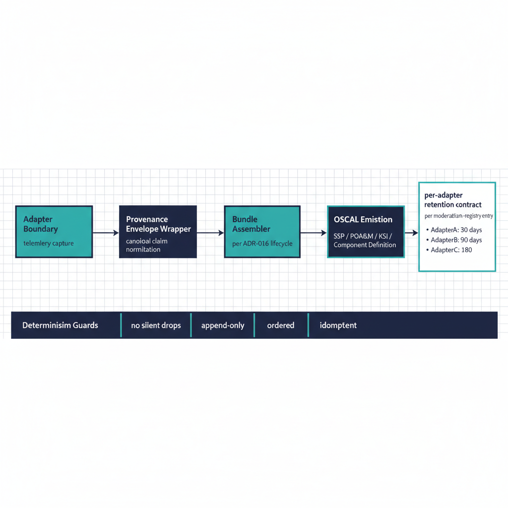

# Telemetry Modernization Spec

## Scope

Cross-adapter specification for telemetry modernization under the
UIAO substrate. Covers the canonical claim shape, provenance envelope
requirements, evidence pipeline integration, and the determinism
guarantees telemetry adapters must honor. This spec is the substrate
contract every telemetry-emitting adapter inherits, regardless of
mission-class.

{#fig-telemetry-image-01 fig-alt="Horizontal flow from left to right: Adapter Boundary (telemetry capture) → Provenance Envelope Wrapper (canonical claim normalization) → Bundle Assembler (per ADR-016 lifecycle) → OSCAL Emission (SSP / POA&M / KSI / Component Definition). Below the pipeline, a \"Determinism Guards\" footer band lists the four ADR-006 properties (no silent drops, append-only, ordered, idempotent). To the right of the pipeline, a small panel showing per-adapter retention contract per modernization-registry entry. Clean engineering blueprint style, dark navy (#0D1B2E) and teal (#1E8C8C) on white background. No photographs, purely diagrammatic." width="85%"}

## Substrate contract

Every telemetry-emitting adapter inherits:

- **`mission-class: telemetry`** (or telemetry as secondary concern).
- **Provenance envelope per UIAO_PP_001** — every claim carries the
  full envelope (claim_id, issuer_identity, source_classification,
  extraction_timestamp, transformation_chain, lineage_hash,
  schema_version, signature).
- **Determinism per ADR-006** — no silent drops, append-only, ordered,
  idempotent.
- **Lifecycle per ADR-016** — assemble → seal → submit → close.
- **`evidence-class`** — `point-in-time` or `interval` declared in
  the adapter registry entry.
- **`retention-years`** — canonical, not operator-chosen.

## Adapters in scope (Phase 1+)

| Adapter | Mission | Notes |
|---|---|---|
| `scubagear` | policy (telemetry-emitting) | Interval evidence; M365 SCuBA |
| `vuln-scan` | telemetry | Vulnerability state observer |
| `patch-state` | telemetry | Patch state observer |
| `stig-compliance` | policy (telemetry-emitting) | STIG baseline evaluation |
| `azure-arc` | telemetry | Hybrid management telemetry |
| `intune` | telemetry (configuration) | Endpoint configuration claims |

The list expands as new telemetry adapters register.

## Integration shape

Canonical claim emission shape:

```yaml
provenance:
  claim_id: "urn:uiao:claim:{domain}:{event_type}:{uuid}"
  issuer_identity: "{adapter_runtime_identity}"
  source_system: "{system_name}:{version}"
  source_classification: "authoritative | derived | synthesized"
  extraction_timestamp: ISO8601
  extraction_method: "api | batch | stream | manual"
  transformation_chain: [...]
  lineage_hash: "{SHA-256}"
  schema_version: "1.0"
  signature: "{mTLS thumbprint}"
event:
  event_type: "{canonical_event_kind}"
  observed_at: ISO8601
  payload:
    {schema-validated event body}
```

Adapters that produce telemetry without this envelope cannot register;
the schema gate rejects the entry.

## Control mapping

Maps onto:

- **NIST 800-53** AU (Audit & Accountability), SI (System & Information
  Integrity).
- **FedRAMP CR26** continuous monitoring controls.
- **OMB M-21-31** federal log retention.

KSI bindings under `src/uiao/rules/ksi/monitoring-logging/`.

## Drift considerations

- **`DRIFT-PROVENANCE`** — telemetry's primary drift surface;
  envelope chain breakage is `P1`/`P2` depending on liveness.
- **`DRIFT-SCHEMA`** — event payload structure mismatch; `P2` typical.
- **`DRIFT-SEMANTIC`** — event meaning stale (e.g. retired field
  still emitted); `P3`/`P4`.

## Operational tempo

Telemetry adapters are continuous-emission by design (where the
adapter's `evidence-class` is `interval`, "continuous" means "every
interval without gap"). Gaps in expected emission cadence are
themselves drift findings.

## Honest limits

- Continuous event-time capture across all adapters is target state.
  Adapters today operate in interval mode (e.g. SCuBAGear) or
  continuous mode depending on implementation maturity.
- Cryptographic signing with agency-issued certificates is design-
  only across the fleet; the envelope reserves the field, but
  end-to-end signing is engineering ahead.
- Telemetry retention is canonical (per adapter); programs needing
  longer retention archive outside the substrate.

## Validation pairing

Pairs with the
[Telemetry Validation Suite](../../validation-suites/domains/telemetry/telemetry.qmd).

## Related documents

- [Modernization Specs Index](../index.qmd)
- [Architecture Series — Evidence Chain](../../architecture-series/evidence-chain.qmd)
- [Provenance Profile (canon)](../../../docs/15_ProvenanceProfile.qmd)
- [ADR-006: Evidence Determinism](../../../../src/uiao/canon/adr/adr-006-evidence-determinism.md)
- [ADR-016: Evidence Bundle Lifecycle](../../../../src/uiao/canon/adr/adr-016-evidence-bundle-lifecycle.md)
