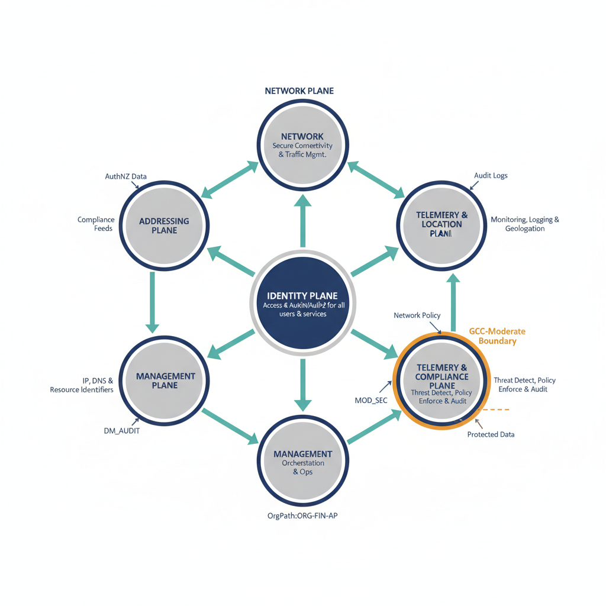
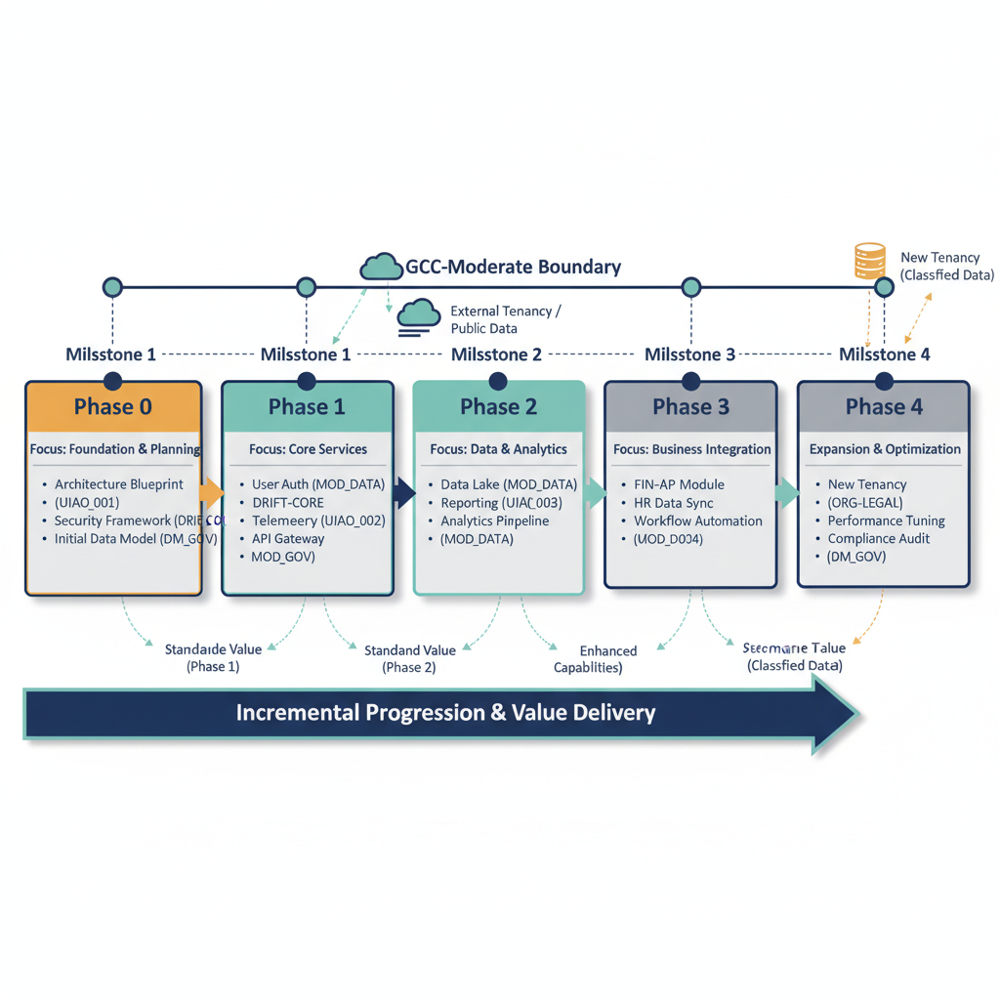

1\. What Is UIAO?

UIAO --- the **Unified Identity--Addressing--Overlay Architecture** ---
is a modular governance and modernization framework that replaces legacy
perimeter-centric, device-centric, and location-centric IT models with
an identity-driven, telemetry-informed, boundary-agnostic architecture.
It is designed to work across any organization --- federal, state,
local, commercial, or nonprofit --- that needs deterministic control
over identity, addressing, policy enforcement, and governance. UIAO
provides a structured architectural pattern and governance operating
system that sits above existing infrastructure, delivering a single,
coherent control plane for modernization across all operational domains.

UIAO is not a product. It is not a vendor platform. It is not a point
solution. It is a composable architectural pattern --- a governance
operating system that integrates identity, addressing, network overlay,
telemetry, and compliance into a unified, deterministic framework.
Organizations adopt UIAO to bring coherence to modernization efforts
that would otherwise fragment across tools, vendors, and compliance
boundaries.

UIAO operates in Commercial Cloud as governed by FedRAMP. GCC-Moderate
applies to Microsoft 365 SaaS services only and does not include Azure
services. Azure services consumed by the architecture operate under
commercial FedRAMP authorization boundaries appropriate to their
deployment context.

2\. Purpose of This Document

This Program Overview introduces UIAO at the conceptual level. It is
intended for:

- **Executive stakeholders** evaluating modernization approaches and
  seeking a coherent architectural strategy

- **Architects and engineers** onboarding to the UIAO framework and
  preparing for implementation

- **Compliance and governance teams** mapping controls to operational
  reality and understanding how UIAO enforces policy

- **Open-source contributors and community reviewers** assessing the
  framework for adoption, extension, or contribution

This document does not replace the full Unified Architecture
Specification, Control Plane Architecture, or Modernization Timeline. It
provides the narrative foundation that connects them --- establishing
the vocabulary, rationale, and conceptual model that all subsequent UIAO
documents build upon.

3\. The Problem UIAO Solves

Legacy IT environments are frozen in perimeter-centric, device-centric
models where identity is an afterthought, addressing is manual, policy
is siloed across organizational boundaries, and governance is conducted
through email chains, ticketing systems, and periodic manual reviews.
These environments were designed for a world where the network perimeter
was the security boundary, devices were stationary, and applications
lived in on-premises data centers. That world no longer exists --- but
the architectures built for it persist.

Organizations recognize the need for modernization but consistently hit
structural walls: fragmented tooling that creates integration gaps,
vendor lock-in that constrains architectural choices, compliance drift
that widens the gap between documented policy and operational reality,
and the absence of a single source of truth for what the environment
actually looks like versus what it should look like. Modernization
initiatives launch with ambition but stall when they encounter the
accumulated complexity of decades of ad-hoc decisions.

The result is **governance collapse** --- a condition where the gap
between documented policy and operational reality widens until audits
become forensic exercises, incidents reveal systemic blind spots, and
compliance becomes a retroactive paperwork exercise rather than a
continuous operational discipline. UIAO exists to close this gap ---
permanently, deterministically, and at architectural scale.

Frozen State vs. Required State

  -----------------------------------------------------------
  **Domain**       **Frozen State**      **Required State**
  ---------------- --------------------- --------------------
  **Network        L3/L4 firewalls,      Identity-aware
  Security**       perimeter trust       segmentation, Zero
                                         Trust

  **Endpoint       Mixed tooling,        Unified posture
  Management**     inconsistent posture  signal, continuous
                                         evaluation

  **Application    Monolithic apps,      Workload identity,
  Delivery**       local authentication  cloud-native auth

  **Telemetry**    Siloed logs, no       Conversation-level
                   correlation           correlation,
                                         real-time signals

  **Governance**   Email/ticket-based,   Automated
                   manual review         enforcement, drift
                                         detection

  **Data           Manual                Data-aware routing,
  Protection**     classification,       dynamic policy
                   static labels
  -----------------------------------------------------------

4\. UIAO Components

UIAO is composed of five core components, each addressing a foundational
requirement of modern IT governance. These components are modular ---
each delivers value independently --- but they are designed to operate
as an integrated system. Together, they provide the architectural
substrate for deterministic governance across identity, addressing,
device management, policy enforcement, and operational compliance.

4.1 OrgPath

OrgPath is UIAO\'s deterministic organizational addressing system. It
provides a structured, hierarchical namespace that maps every identity,
device, workload, and policy to a canonical location within the
organization. OrgPath replaces ad-hoc naming conventions, flat OU
structures, and ambiguous group memberships with a machine-readable,
governance-enforceable path. Every object in UIAO has an OrgPath. Every
policy references an OrgPath. OrgPath is the root of deterministic
governance --- the canonical address that anchors all identity
resolution, policy evaluation, and compliance reporting.

4.2 Identity Translation

Identity Translation is the mechanism by which UIAO bridges legacy
identity systems --- Active Directory, LDAP, local accounts --- to
modern identity planes such as Entra ID, certificate-based
authentication, and workload identity. UIAO does not rip-and-replace
legacy identity --- it translates it, preserving continuity while
enabling modern assurance levels. Identity Translation ensures that
every principal --- human, device, service, or workload --- can be
resolved to a single, authoritative identity with provenance. The
translation layer maintains a durable mapping between legacy and modern
identities, enabling incremental migration without operational
disruption.

4.3 Device Identity

Device Identity in UIAO treats every endpoint as a first-class identity
principal. Devices are not merely managed objects --- they are
participants in the identity plane with their own certificates, posture
signals, and OrgPath assignments. Device identity feeds continuous Zero
Trust evaluation: a device\'s compliance state, certificate validity,
and telemetry signals are inputs to every policy decision. UIAO requires
that no device operates anonymously. Every device must be enrolled,
attested, and continuously evaluated as a condition of network and
resource access.

4.4 Policy Overlay

The Policy Overlay is UIAO\'s enforcement layer. It sits above the
network, identity, and addressing planes and provides continuous,
identity-aware, telemetry-informed policy evaluation. The overlay
replaces static firewall rules and one-time authentication with dynamic,
contextual policy that evaluates continuously. Policy decisions are
driven by identity assurance, device posture, telemetry signals, and
OrgPath context --- not by network location. The Policy Overlay ensures
that access decisions are made in real time, based on the full context
of the requesting principal, and that those decisions are logged,
auditable, and enforceable.

4.5 Governance OS

The Governance OS is UIAO\'s operational brain. It provides automated
drift detection, remediation orchestration, SLA enforcement, owner
accountability tracking, and machine-readable compliance artifacts. The
Governance OS consumes signals from all control planes and produces
actionable governance outputs: drift reports, remediation tickets,
compliance dashboards, and audit-ready artifacts. It is designed to make
governance deterministic, not aspirational --- every policy has an
owner, every deviation has a remediation path, and every compliance
assertion is backed by telemetry evidence.

The Governance OS includes **SCuBA integration** --- UIAO SCuBA is
positioned as the governance orchestration layer above CISA ScubaGear.
It consumes ScubaGear JSON/CSV outputs and provides continuous drift
detection, canonical desired-state management, remediation orchestration
with SLA enforcement, and machine-trackable governance provenance. This
integration transforms ScubaGear from a periodic scanning tool into a
continuous governance signal within the UIAO control plane.

5\. What UIAO Is --- and What It Is Not

  --------------------------------------
  **UIAO Is**            **UIAO Is Not**
  ---------------------- ---------------
  A modular              A product you
  architectural          purchase
  framework

  An identity-driven     A replacement
  governance operating   for your
  system                 identity
                         provider

  A boundary-agnostic    Tied to any
  modernization pattern  single cloud or
                         vendor

  A deterministic        A monitoring
  control plane system   dashboard or
                         SIEM

  A compliance-aligned   A checkbox
  automation substrate   compliance tool

  Open-source and        Proprietary or
  community-reviewable   closed-source

  Designed for           A big-bang
  incremental adoption   migration
                         framework
  --------------------------------------

6\. The Six Control Planes

UIAO integrates six control planes into a single, coherent,
deterministic system. Each plane is authoritative for its domain, but
all planes operate together as a unified architecture. No plane operates
in isolation --- every policy decision, identity resolution, and
governance action draws on signals from multiple planes. The control
planes are the structural foundation of UIAO, and their integration is
what distinguishes UIAO from conventional point-solution approaches to
IT modernization.

  ----------------------------------
  **Control        **Role**
  Plane**
  ---------------- -----------------
  **Identity**     Root namespace
                   and assurance
                   engine --- every
                   principal
                   resolves here

  **Network**      Routing,
                   segmentation, and
                   overlay transport
                   ---
                   identity-aware,
                   not
                   perimeter-based

  **Addressing**   Deterministic
                   IPAM and DNS/DHCP
                   authority ---
                   every address is
                   intentional

  **Telemetry &    Real-time signals
  Location**       for routing,
                   security, and
                   compliance
                   decisions

  **Security &     Zero Trust
  Compliance**     enforcement and
                   FedRAMP alignment
                   --- continuous,
                   not periodic

  **Management**   Governance, drift
                   detection, CMDB
                   reconciliation,
                   device compliance
  ----------------------------------

+:--------------:+

{fig-alt="A visual showing the six control planes arranged in a hub-and-spoke model with the Identity plane at the center." width="720"}

7\. How UIAO Fits Into Modernization

UIAO is designed for incremental modernization --- there is no big-bang.
Organizations adopt UIAO in phases, starting with identity translation
and OrgPath establishment, then layering on device identity, policy
overlay, telemetry integration, and finally the full Governance OS. Each
phase delivers standalone value while building toward the complete
architecture. An organization that completes only Phase 0 and Phase 1
still gains a canonical namespace, a unified identity plane, and a
measurable governance baseline --- capabilities that most legacy
environments lack entirely.

UIAO aligns with established frameworks: FedRAMP (including 20x Phase
2), Zero Trust (per Executive Order 14028 lineage), TIC 3.0, and NIST
800-53. UIAO does not invent new compliance requirements --- it provides
the architectural substrate that makes existing requirements
operationally achievable. By embedding compliance into the architecture
rather than bolting it on after deployment, UIAO eliminates the chronic
gap between documented policy and operational reality that plagues
traditional modernization efforts.

Modernization Phases

  -----------------------------------------------------
  **Phase**        **Focus**       **Key Deliverables**
  ---------------- --------------- --------------------
  **Phase 0 ---    OrgPath design, Canonical namespace,
  Foundation**     identity        identity map,
                   inventory,      initial drift
                   governance      baseline
                   baseline

  **Phase 1 ---    Identity        Unified identity
  Identity**       translation,    plane, device
                   certificate     identity, mTLS
                   authority,      foundation
                   device
                   enrollment

  **Phase 2 ---    Policy overlay  Continuous policy
  Overlay**        deployment,     evaluation,
                   telemetry       conversation-level
                   integration     telemetry

  **Phase 3 ---    Governance OS   Automated drift
  Governance**     activation,     detection, SLA
                   SCuBA           enforcement,
                   integration,    compliance artifacts
                   automation

  **Phase 4 ---    Cross-plane     Full deterministic
  Optimization**   optimization,   operation,
                   advanced        open-source maturity
                   analytics,
                   community
                   contribution
  -----------------------------------------------------

+:---------------:+

{fig-alt="A horizontal timeline or swim-lane diagram showing Phases 0 through 4 arranged left to right in sequential order." width="720"}

8\. Boundary-Agnostic by Design

UIAO is not built for one environment. The architecture is designed to
operate identically whether deployed in federal civilian agencies,
defense-adjacent organizations, state and local governments, commercial
enterprises, or nonprofits. The control planes, OrgPath namespace,
identity translation mechanisms, and Governance OS are all
boundary-agnostic --- they adapt to the compliance and operational
requirements of any environment without architectural modification. An
organization subject to FedRAMP, CMMC, SOC 2, HIPAA, or no formal
compliance framework at all can adopt UIAO using the same core
architecture, adjusting only the policy parameters and compliance
mappings to match its regulatory context.

While the initial UIAO implementation targets GCC-Moderate (Microsoft
365 SaaS), the architectural patterns are portable. An organization
running commercial Microsoft 365, AWS, Google Cloud, or hybrid
on-premises infrastructure can adopt UIAO\'s framework and governance
model without architectural modification. The boundary is a deployment
parameter, not an architectural constraint. This portability is by
design --- UIAO was built to prevent the vendor lock-in and boundary
rigidity that plague legacy modernization approaches.

9\. Getting Started

The following resources provide the next level of detail for
organizations and individuals ready to engage with UIAO:

- **UIAO-Core Repository on GitHub** --- The canonical source for
  governance artifacts, configuration templates, OrgPath schemas, and
  community-contributed modules

- **Unified Architecture Specification** --- The full technical
  specification covering all six control planes, component interactions,
  and implementation requirements

- **Modernization Timeline** --- Phased implementation guidance with
  milestones, dependencies, and decision gates for each stage of UIAO
  adoption

- **UIAO Document Compiler** --- A toolchain for generating UIAO
  documentation in multiple formats (Markdown, DOCX, PDF, HTML) from
  canonical source files

10\. Document Notice

This document is Revision 0.x --- a pre-release draft published for
community review and feedback. It does not carry any classification
markings. Content may evolve as the UIAO framework matures.
Contributions, issues, and pull requests are welcome via the UIAO-Core
GitHub repository.
