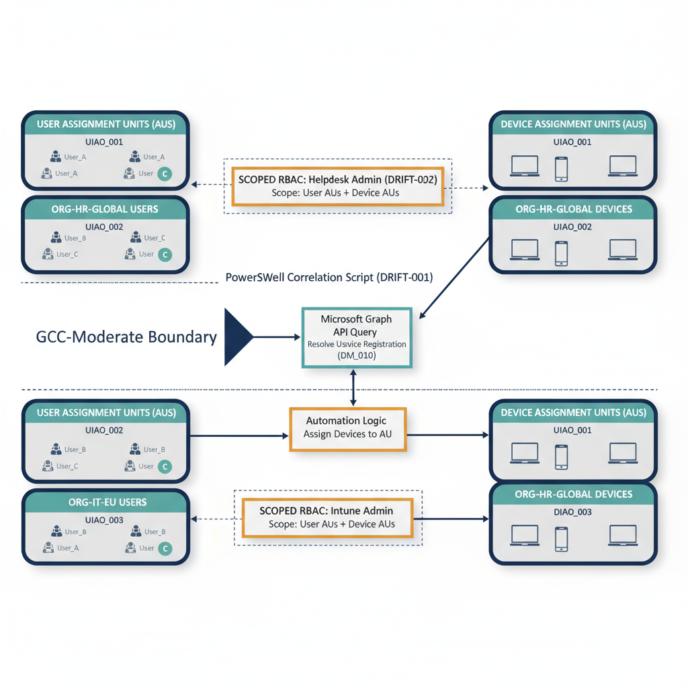
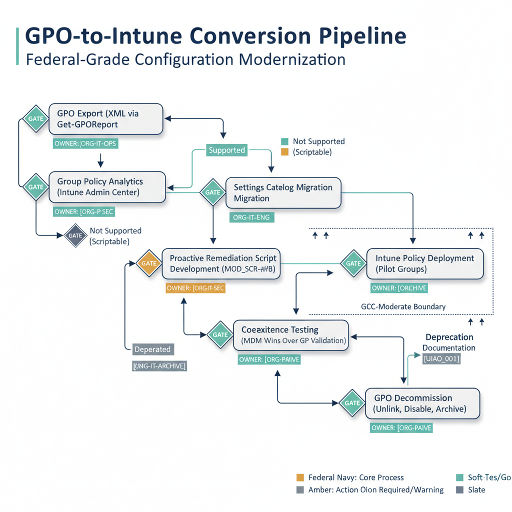
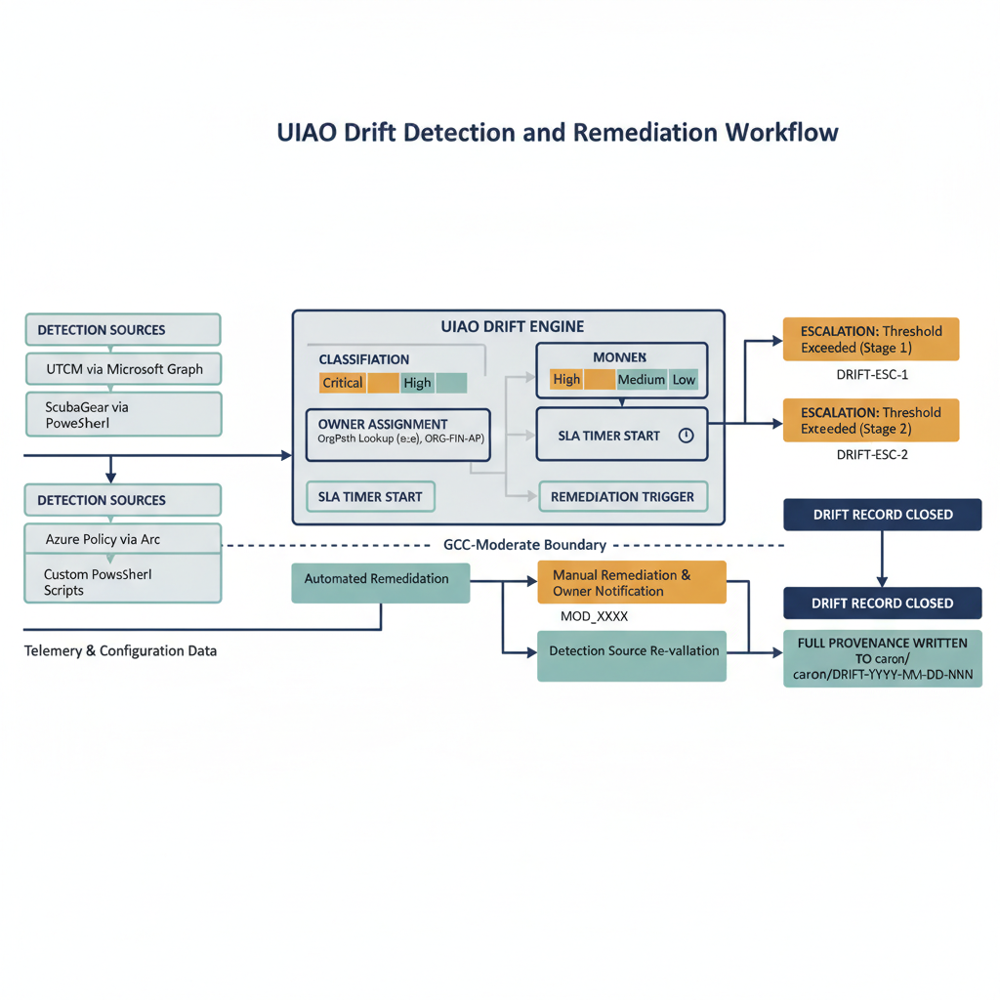
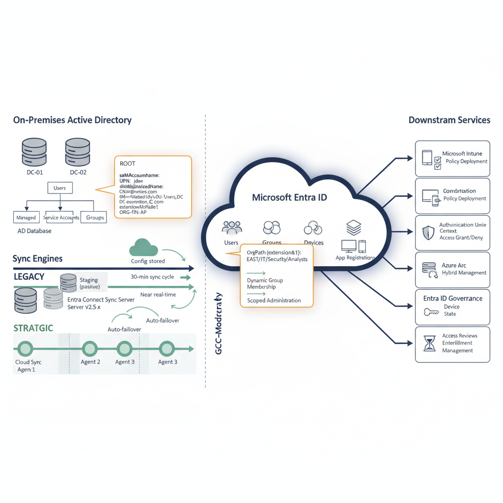
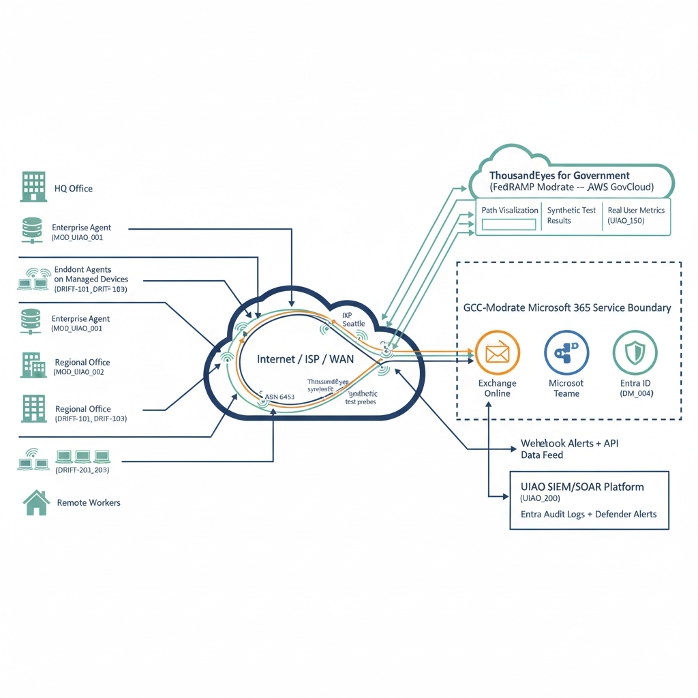
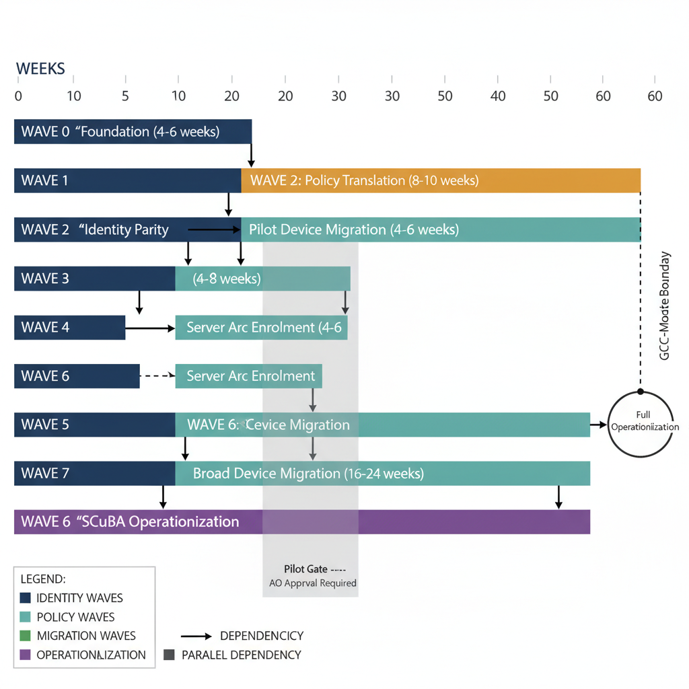

# Section 1: Purpose and Scope

This document defines the **modernization mechanics** for Phase 1 of the
**Unified Infrastructure and Architecture Operations (UIAO)** framework.
Phase 1 focuses on the foundational operational transitions required to
move a Microsoft 365 tenant from legacy on-premises management patterns
to **cloud-native governance** under **GCC-Moderate** compliance. The
modernization mechanics described herein establish the deterministic
sequencing, technical procedures, governance controls, and gate criteria
that govern every operational transition within Phase 1. Each section is
designed to be self-contained --- readable and actionable in isolation
--- while maintaining full reference-awareness across the document.

This document supersedes no prior version. It is the **initial
pre-release** establishing the modernization mechanics baseline for UIAO
Phase 1. The scope of this document covers: **identity modernization**,
**device identity transitions**, **OrgPath governance expansion**
(including device OrgPath), **Group Policy to Intune conversion**,
**Azure Arc enrollment** for hybrid server management, **boundary
resolution considerations**, **SCuBA operationalization**, **drift
detection and remediation**, and **modernization sequencing**. Each
domain is treated as a discrete modernization work stream with defined
inputs, outputs, prerequisites, and gate criteria that integrate into
the overall Phase 1 sequence.

This document operates within the **UIAO Canon governance framework**,
where **canon/** is the single source of truth for all artifacts. All
content produced under Phase 1 traces provenance to canonical sources.
Every artifact, policy, configuration baseline, and operational
procedure referenced or produced by the mechanics in this document must
comply with Canon governance rules: immutable history, documented
ownership, provenance chains, and the UIAO metadata schema. Orphaned
artifacts --- those without provenance or ownership --- are
**CI-blocking** under UIAO Canon rules.

# Section 2: Modernization Sequencing

The modernization sequence governs the **order of operations** for all
Phase 1 work. This sequence is deterministic: each step has defined
prerequisites that must be satisfied before execution begins, defined
key actions that constitute the work, gate criteria that must be met
before the step is considered complete, and defined outputs that feed
downstream steps. Deviation from this sequence requires formal
governance review and Canon Steward approval.

## Table 1: Phase 1 Modernization Sequence

  -----------------------------------------------------------------------------------------------------------
  **Sequence   **Domain**           **Prerequisites**   **Key Actions**    **Gate           **Outputs**
  Step**                                                                   Criteria**
  ------------ -------------------- ------------------- ------------------ ---------------- -----------------
  **1**        Identity Foundation  Tenant access;      Entra ID hygiene   Zero orphaned    Identity Hygiene
                                    Entra ID P1/P2      audit; orphaned    accounts; 100%   Report; MFA
                                    licensing           account            MFA              Enforcement
                                    confirmed;          remediation; user  registration;    Policy Set;
                                    directory           lifecycle review;  Conditional      Passwordless
                                    synchronization     MFA enforcement    Access policies  Readiness
                                    operational         via Conditional    deployed and     Assessment;
                                                        Access;            validated;       Service Account
                                                        passwordless       legacy per-user  Register
                                                        readiness          MFA disabled;
                                                        assessment;        service account
                                                        service account    inventory
                                                        inventory          complete

  **2**        OrgPath              Step 1 complete;    Administrative     All users        OrgPath
               Establishment        organizational      Unit architecture  assigned to      Architecture
                                    structure data      design; AU         correct AUs;     Document; AU
                                    available           creation; dynamic  dynamic          Configuration
                                    (department,        membership rule    membership rules Manifest; Scoped
                                    location, cost      configuration;     validated;       RBAC Assignment
                                    center); Entra ID   user-to-AU         scoped RBAC      Register
                                    P1 licensing for    assignment         assignments
                                    Administrative      validation; scoped tested and
                                    Units               RBAC role          confirmed;
                                                        assignment;        OrgPath
                                                        OrgPath governance architecture
                                                        documentation      document
                                                                           published to
                                                                           canon/

  **3**        Device OrgPath       Step 2 complete;    Device-to-AU       All managed      Device OrgPath
               Extension            device inventory    correlation script devices          Correlation
                                    available; Graph    development        correlated to    Script; Device AU
                                    API permissions     (PowerShell);      owning user\'s   Assignment
                                    configured for      device AU          AU; scoped       Report; Scoped
                                    device-to-user      creation; device   device           Device
                                    correlation         assignment         administration   Administration
                                                        execution; scoped  operational;     Validation Report
                                                        device             BitLocker key
                                                        administration     recovery scoped
                                                        validation;        to AU; LAPS
                                                        BitLocker/LAPS     administration
                                                        scoping            scoped to AU
                                                        confirmation

  **4**        Device Identity      Step 3 complete;    Hybrid Join device Device identity  Device Identity
               Modernization        device inventory    inventory; Entra   transition plan  Transition Plan;
                                    with join-type      Join migration     published;       Autopilot
                                    classification;     planning; Kerberos Autopilot        Configuration
                                    application         Cloud Trust        profiles         Profiles; Device
                                    compatibility       assessment;        deployed for new Trust Policy Set
                                    assessment          Conditional Access provisioning;    (staged)
                                    initiated           device trust       Kerberos Cloud
                                                        policy design;     Trust evaluated;
                                                        Autopilot profile  device trust
                                                        configuration for  Conditional
                                                        new devices        Access policies
                                                                           staged

  **5**        Policy Conversion    Step 3 complete;    GPO inventory and  All active GPOs  GPO Inventory and
                                    GPO inventory       rationalization;   inventoried and  Rationalization
                                    exported as XML;    Group Policy       classified;      Report; Settings
                                    Intune licensing    Analytics import;  migration path   Catalog Policy
                                    confirmed; MDM      compatibility      determined for   Set; Proactive
                                    enrollment verified analysis; Settings each GPO;        Remediation
                                    for target devices  Catalog migration  Settings Catalog Script Library;
                                                        for supported      policies         Policy Ownership
                                                        settings;          deployed to      Register
                                                        Proactive          pilot groups;
                                                        Remediations for   coexistence
                                                        unsupported        tested; policy
                                                        settings;          ownership
                                                        coexistence        documented per
                                                        testing; policy    OrgPath
                                                        ownership mapping

  **6**        Server Modernization Step 3 complete;    Azure Arc          All target       Arc Enrollment
                                    Azure subscription  enrollment for     servers          Register; Azure
                                    provisioned; Azure  non-production     Arc-enrolled;    Update Manager
                                    Arc resource group  servers;           Azure Update     Configuration;
                                    configured;         management         Manager          Change Tracking
                                    Connected Machine   capability         operational;     Baseline; Legacy
                                    Agent package       validation;        Change Tracking  Agent
                                    available           production server  reporting        Decommission Plan
                                                        enrollment; Azure  confirmed;
                                                        Update Manager     management
                                                        configuration;     parity with
                                                        Change Tracking    legacy tools
                                                        activation; legacy validated
                                                        agent decommission
                                                        planning

  **7**        SCuBA Baseline       Steps 1--5          ScubaGear          ScubaGear        SCuBA Baseline
               Operationalization   substantially       deployment;        baseline         Assessment Report
                                    complete; ScubaGear initial baseline   assessment       (all workloads);
                                    module installed;   assessment across  complete for all Desired-State
                                    M365 API            all workloads;     workloads;       Definitions
                                    permissions         canonical          desired-state    (canonical); UIAO
                                    granted; UIAO SCuBA desired-state      definitions      SCuBA
                                    orchestration layer definition; UIAO   published to     Orchestration
                                    configured          SCuBA              canon/; UIAO     Configuration;
                                                        orchestration      SCuBA            Drift Detection
                                                        integration; drift orchestration    Activation Report
                                                        detection          consuming
                                                        activation; SLA    ScubaGear
                                                        heatmap            outputs on
                                                        configuration      schedule; drift
                                                                           detection
                                                                           operational

  **8**        Drift Detection      Step 7 complete;    Drift detection    Continuous drift Drift Detection
               Activation           desired-state       engine             monitoring       Engine
                                    definitions         configuration;     operational      Configuration;
                                    published;          severity           across all       SLA Matrix
                                    remediation         classification     domains; SLA     (operational);
                                    workflow defined;   rules deployment;  timers enforced; Escalation Chain
                                    owner               SLA timer          escalation       Document;
                                    accountability      integration;       workflows        Provenance
                                    chains established  remediation        tested;          Recording
                                    per OrgPath         workflow           provenance       Validation Report
                                                        activation;        records
                                                        escalation chain   generated for
                                                        configuration;     all drift events
                                                        provenance
                                                        recording
                                                        integration

  **9**        Boundary Alignment   Ongoing --- no hard Boundary           All identified   Boundary
                                    prerequisite;       intersection       boundary         Assessment
                                    initiated at Phase  identification;    intersections    Register;
                                    1 start and runs    assessment of M365 documented with  Governance Gap
                                    continuously        GCC-Moderate and   assessment       Analysis;
                                                        Azure Commercial   status, owner,   Boundary
                                                        interactions;      and target       Resolution
                                                        governance gap     resolution date; Roadmap (draft)
                                                        analysis; boundary no unassessed
                                                        documentation;     boundary gaps
                                                        resolution pathway remain
                                                        mapping
  -----------------------------------------------------------------------------------------------------------

This sequence is not strictly linear. **Steps 1--3 are sequential
prerequisites** --- each must be completed before the next begins, as
OrgPath establishment depends on identity hygiene, and device OrgPath
depends on user OrgPath. However, **Steps 4--6 may execute in parallel**
once OrgPath (Steps 1--3) is established, as device identity
modernization, policy conversion, and server modernization are
independent work streams that share OrgPath as a common dependency.
**Steps 7--8 activate** once sufficient policy conversion (Step 5) is
complete, as SCuBA baseline operationalization and drift detection
require policies to be in their target state for meaningful assessment.
**Step 9 (Boundary Alignment) runs as a continuous background
assessment** throughout Phase 1, producing interim deliverables as
boundary intersections are identified and assessed.

# Section 3: Identity Modernization

Identity modernization is the foundational prerequisite for all
subsequent Phase 1 work. No device identity transition, policy
conversion, or governance scoping can proceed reliably until the
identity layer is clean, modern, and governed. This section defines the
identity modernization mechanics that must be executed and validated
before OrgPath establishment (Section 4) can begin.

## 3.1 Entra ID User Lifecycle Hygiene

**Entra ID user lifecycle hygiene** ensures that every user object in
the tenant is properly synchronized, actively governed, and accurately
attributed. The hygiene assessment identifies and remediates: orphaned
accounts (user objects with no active owner or business justification),
stale accounts (accounts that have not authenticated within a defined
inactivity threshold), synchronization errors (directory sync failures
that leave objects in an inconsistent state), duplicate objects
(multiple user objects representing the same identity), and attribute
inconsistencies (missing or incorrect department, location, or cost
center values that will impair OrgPath dynamic membership rules).

## 3.2 MFA Enforcement

**Multi-Factor Authentication (MFA) enforcement** must transition from
legacy enforcement methods to **Conditional Access-driven MFA**. Legacy
MFA patterns include per-user MFA (enabled/enforced directly on the user
object), NPS Extension-based MFA for VPN and RADIUS authentication, and
Azure MFA Server (on-premises). The target state is Conditional Access
policies that enforce MFA based on risk signals, application
sensitivity, network location, and device compliance --- not as a
blanket per-user toggle. Legacy per-user MFA must be disabled for all
users once Conditional Access MFA policies are validated and
operational.

## 3.3 Passwordless Readiness

**Passwordless readiness** assesses the organization\'s capability to
adopt passwordless authentication methods. The three primary
passwordless methods supported in Microsoft Entra ID are: **Windows
Hello for Business** (biometric or PIN-based, device-bound credential),
**FIDO2 security keys** (hardware-based, phishing-resistant, portable
credential), and **Microsoft Authenticator passwordless sign-in**
(phone-based, number-matching). Readiness assessment covers hardware
compatibility (TPM 2.0 for WHfB, USB/NFC support for FIDO2), user
training requirements, helpdesk impact, and rollback procedures.

## 3.4 Service Account Modernization

**Service account modernization** identifies all service accounts,
shared mailboxes, and non-person entities that authenticate to M365
services and transitions them to modern identity patterns. Where
applicable, service accounts should be replaced with **Managed
Identities** (for Azure-hosted workloads) or **workload identity
federation** (for external services). Service accounts that cannot be
modernized must be documented, governed with strict Conditional Access
policies, and registered in the Service Account Register with defined
ownership and review cadence.

## 3.5 Authentication Method Registration

**Authentication method registration** enforcement ensures that all
users have registered at least two modern authentication methods before
policy enforcement gates close. The **Authentication Methods
Registration Campaign** feature in Entra ID can prompt users to register
additional methods. Registration completeness is a gate criterion for
Step 1 --- identity modernization cannot be marked complete until
registration targets are met.

## Table 2: Identity Modernization Checklist

  -------------------------------------------------------------------------------------------
  **Item**          **Current State    **Target State**      **Dependency**    **Priority**
                    Assessment**
  ----------------- ------------------ --------------------- ----------------- --------------
  Orphaned account  \[Assess: count of Zero orphaned         Directory sync    Critical
  remediation       orphaned objects,  accounts; all objects health; HR data
                    last sign-in date  have documented       feed accuracy
                    analysis\]         ownership

  Stale account     \[Assess: accounts Stale accounts        Sign-in log       Critical
  identification    with no sign-in    disabled or           retention;
  and disable       within 90 days\]   justified; review     business
                                       cadence established   justification
                                                             process

  MFA ---           \[Assess: per-user All MFA enforcement   Conditional       Critical
  Conditional       MFA count; NPS     via Conditional       Access policy
  Access migration  Extension usage;   Access; per-user MFA  design; Entra ID
                    legacy MFA Server  disabled; legacy MFA  P1 licensing
                    status\]           Server decommissioned

  Authentication    \[Assess:          100% of active users  Registration      High
  method            percentage of      registered with ≥2    campaign
  registration      users with ≥2      modern authentication configuration;
                    modern methods     methods               user
                    registered\]                             communication
                                                             plan

  Passwordless      \[Assess: device   Readiness report      Device inventory  High
  readiness         TPM 2.0 inventory; published; pilot      (TPM status);
  assessment        FIDO2 hardware     group identified;     budget approval
                    procurement        hardware procurement  for FIDO2 keys
                    status; pilot      initiated
                    group
                    identification\]

  Service account   \[Assess: count of All service accounts  Application owner High
  inventory and     service accounts;  inventoried;          identification;
  modernization     authentication     modernization path    workload hosting
                    patterns;          defined (Managed      architecture
                    dependency         Identity / workload
                    mapping\]          identity / governed
                                       legacy); ownership
                                       documented

  Directory         \[Assess: sync     Zero persistent sync  Entra Connect     Critical
  synchronization   error count;       errors; all objects   health;
  health            object mismatch    consistent between    on-premises AD
                    rate; connector    on-premises AD and    hygiene
                    health\]           Entra ID

  Attribute         \[Assess:          ≥98% attribute        HR data feed;     High
  completeness for  percentage of      completeness for      attribute mapping
  OrgPath           users with         OrgPath-critical      rules in Entra
                    populated          attributes            Connect
                    department,
                    location, cost
                    center
                    attributes\]
  -------------------------------------------------------------------------------------------

# Section 4: OrgPath Governance --- Expanded for Devices

## 4.1 OrgPath Definition

**OrgPath** is the UIAO term for the organizational path governance
model built on **Microsoft Entra Administrative Units (AUs)**. OrgPath
establishes the deterministic mapping of organizational structure to
Entra Administrative Units, creating governance boundaries, scoped
administration, and accountability chains that replace the legacy
OU-based governance model from on-premises Active Directory. Where
Active Directory OUs governed object placement and Group Policy
inheritance through a hierarchical tree, OrgPath governs administrative
scope and governance accountability through flat, role-scoped,
audit-traceable Administrative Units in the cloud.

## 4.2 OrgPath Architecture for Users

The user OrgPath architecture establishes Administrative Units as
**governance containers** --- not security boundaries, but
administrative scoping boundaries that define who can manage whom. The
architecture is governed by the following principles:

- **Administrative Units as governance containers:** Each AU represents
  a defined organizational scope (e.g., a department, a regional office,
  a business unit). Users are assigned to AUs based on their
  organizational attributes.

- **Dynamic AU membership rules:** Where possible, AU membership is
  driven by dynamic rules based on user attributes --- department,
  location, cost center, or company name. Dynamic membership ensures
  that governance assignment is automatic and consistent as users move
  within the organization.

- **Scoped RBAC:** Role assignments are bounded to AU scope rather than
  tenant-wide. A Helpdesk Administrator scoped to an AU can reset
  passwords only for users within that AU. This eliminates the legacy
  pattern of tenant-wide administrative privilege.

- **OrgPath hierarchy design principles:** Flat-first (minimize
  nesting), role-scoped (design AUs around administrative need, not org
  chart vanity), and audit-traceable (every AU membership change is
  logged and provenance-tracked).

## 4.3 Device OrgPath Extension

**Device OrgPath** extends the same governance scoping model to device
objects. This is the primary expansion in Phase 1 --- establishing that
devices are not ungoverned objects floating in the tenant, but are
correlated to their owning user\'s Administrative Unit and subject to
the same scoped administration model.

The device OrgPath correlation mechanism operates as follows:

- **Device-to-user correlation via Graph API automation
  (PowerShell-first):** The device OrgPath correlation script queries
  all Administrative Units, extracts user members from each AU, resolves
  each user\'s registered and owned devices via Microsoft Graph, and
  assigns those devices to the user\'s AU. This creates a deterministic
  user-to-device governance chain.

- **Hybrid membership approach:** Dynamic AU membership for devices is
  limited. The device attributes available for dynamic membership rules
  in Entra ID are significantly fewer than user attributes --- devices
  lack department, cost center, and location attributes natively.
  Therefore, a **hybrid approach** is required: scripted assignment
  (PowerShell-based, scheduled) handles the primary correlation,
  supplemented by dynamic rules where device attributes permit (e.g.,
  device OS, device trust type).

- **Scoped device administration capabilities:** Device OrgPath enables
  scoped **BitLocker key recovery** (administrators can recover keys
  only for devices in their AU), scoped **Windows LAPS administration**
  (local admin password retrieval bounded to AU), scoped **device
  compliance reporting** (compliance dashboards filtered by AU), and
  scoped **Intune policy assignment** (policies targeted to device
  groups derived from AU membership).

- **Governance accountability:** Device OrgPath ensures that the same
  administrator who manages a user also has scoped authority over that
  user\'s devices. This prevents **cross-boundary administrative drift**
  --- the condition where device administration is disconnected from
  user governance, creating accountability gaps.

+----------------------------------------------------------------------+

{fig-alt="Diagram showing OrgPath architecture with user AUs on the left, device correlation flow in the center via Graph API/PowerShell automation, and device AUs on the right, with arrows showing the user-to-device assignment logic and scoped RBAC" width="720"}

## Table 3: OrgPath Governance Model --- Users and Devices

  -------------------------------------------------------------------------------------------
  **Governance     **User OrgPath** **Device OrgPath**  **Correlation      **Automation
  Element**                                             Method**           Approach**
  ---------------- ---------------- ------------------- ------------------ ------------------
  Administrative   Users assigned   Devices assigned to User attribute →   Dynamic membership
  Unit assignment  to AUs based on  AU of               AU (dynamic);      rules (users);
                   department,      owning/registered   Device → User → AU PowerShell Graph
                   location, cost   user                (scripted)         API script on
                   center                                                  scheduled cadence
                                                                           (devices)

  Scoped RBAC      Helpdesk Admin,  Intune Admin,       Same AU scope for  Role assignments
                   User Admin,      BitLocker Recovery, user and device;   configured per AU;
                   Authentication   LAPS Admin scoped   correlated by      validated via
                   Admin scoped to  to device AU        ownership          scoped access
                   user AU                                                 testing

  Membership       Dynamic rules    Scheduled script    User:              Users: Entra
  maintenance      auto-update as   re-evaluates        attribute-driven   dynamic membership
                   user attributes  device-to-user      (automatic);       engine; Devices:
                   change           correlation;        Device:            PowerShell runbook
                                    adds/removes        ownership-driven   on 4-hour cadence
                                    devices as          (scripted)
                                    ownership changes

  BitLocker key    N/A (user-level  Recovery scoped to  Device AU          Entra AU-scoped
  recovery         operation)       devices within      membership         Cloud Device
                                    administrator\'s AU determines         Administrator role
                                                        recovery
                                                        authorization

  Windows LAPS     N/A              LAPS password       Device AU          Entra AU-scoped
  administration   (device-level    retrieval scoped to membership         role with LAPS
                   operation)       devices within      determines LAPS    read permission
                                    administrator\'s AU access

  Compliance       User compliance  Device compliance   Reporting queries  PowerShell/Graph
  reporting        (MFA status,     (encryption,        filtered by AU     API reporting
                   license          patching, OS        membership         scripts with AU
                   assignment, risk version) filtered                      filter parameter
                   level) filtered  by AU
                   by AU

  Governance       User governance  Device governance   Single             OrgPath
  accountability   owner =          owner = same        accountability     accountability
                   AU-scoped        AU-scoped           chain: Admin → AU  register
                   administrator    administrator (via  → User + Devices   maintained in
                                    user correlation)                      canon/
  -------------------------------------------------------------------------------------------

# Section 5: Device Identity Modernization

Device identity modernization transitions the tenant\'s device trust
model from legacy patterns to cloud-native defaults. This section covers
the assessment, planning, and execution mechanics for moving devices
from their current join types to the target cloud-native posture.

## 5.1 Current State Assessment

The device identity assessment produces a comprehensive inventory
classified by **join type**: **Hybrid Azure AD Joined** (devices joined
to both on-premises AD and Entra ID, managed via Group Policy and/or
SCCM), **domain-joined only** (devices joined to on-premises AD but not
registered in Entra ID --- invisible to cloud governance), **Entra ID
Joined** (cloud-native devices joined only to Entra ID, managed via
Intune), and **Entra Registered** (BYOD devices registered for
conditional access but not domain-joined). Each device must be
classified, and the inventory must include management agent status (SCCM
client, Intune MDM enrollment, co-management state), OS version and
build, TPM version, and primary user assignment.

## 5.3 Migration Path

The transition from Hybrid Join to Entra Join is **not a simple re-join
operation**. A device cannot be \"un-hybrid-joined\" and
\"re-Entra-joined\" in place without disruption. The migration requires
careful sequencing: authentication trust must be validated (the user can
authenticate to all required resources without on-premises AD
line-of-sight), policy coverage must be confirmed (all GPO settings have
been migrated to Intune per Section 6), application compatibility must
be tested (all applications function with cloud-only identity), and
data/profile continuity must be planned (user profiles, data, and
settings are preserved through the transition).

## 5.4 Kerberos Cloud Trust

For organizations maintaining Hybrid Join during the transition period,
**Kerberos Cloud Trust** provides a modernized hybrid identity method.
Kerberos Cloud Trust eliminates the synchronization delay and AD FS
dependency of legacy key trust and certificate trust Hybrid Join
methods. With Kerberos Cloud Trust, Windows Hello for Business
authentication in Hybrid Join scenarios works by obtaining a Kerberos
TGT from Entra ID rather than from a domain controller, significantly
simplifying the infrastructure requirements.

## 5.5 Device Trust Model

**Conditional Access policies** must evaluate device compliance and
device identity together. Device trust is not binary --- it is a
function of join type (Entra Joined, Hybrid Joined, Registered),
compliance state (compliant, not compliant, not evaluated), and
management enrollment (MDM-enrolled, co-managed, unmanaged). Conditional
Access grant controls should require both device compliance and a
specific join type for access to sensitive resources, creating a layered
trust evaluation.

## 5.6 Autopilot Integration

All new device provisioning should default to **Entra Join + Windows
Autopilot**, eliminating the need for on-premises imaging infrastructure
(WDS, MDT, SCCM OSD). Autopilot profiles should be configured with the
Enrollment Status Page (ESP) to ensure all policies and applications are
installed before the user reaches the desktop. Autopilot
pre-provisioning (white glove) should be evaluated for scenarios
requiring IT-touch provisioning.

## Table 4: Device Identity Transition Matrix

  ------------------------------------------------------------------------------------------------------------------
  **Current Join  **Target Join      **Migration Path** **Key Risks**     **Prerequisites**   **Timeline Estimate**
  Type**          Type**
  --------------- ------------------ ------------------ ----------------- ------------------- ----------------------
  Hybrid Azure AD Entra ID Joined    Staged: validate   Application       Intune policy       6--12 months (phased
  Joined                             app compatibility  dependency on     migration complete  by
                                     → confirm Intune   on-premises AD    (Section 6);        department/location)
                                     policy coverage →  (Kerberos); user  application
                                     migrate user       profile/data loss compatibility
                                     profile → disjoin  during            tested; user data
                                     from on-premises   reprovisioning;   backup/migration
                                     AD → Entra Join    GPO gap if Intune plan; Autopilot
                                     (or                migration         profile configured
                                     wipe/reprovision   incomplete
                                     via Autopilot)

  Domain-joined   Entra ID Joined    Register in Entra  Device is         Device must be      3--6 months (priority:
  only (not Entra                    ID first (Hybrid   currently         inventoried and     gain cloud visibility
  registered)                        Join as interim) → invisible to      classified; MDM     first)
                                     then follow        cloud governance; enrollment must be
                                     Hybrid-to-Entra    may have          established; all
                                     path; or wipe and  undocumented      dependencies
                                     reprovision via    dependencies on   documented
                                     Autopilot if       on-premises
                                     device is eligible resources; no
                                                        Intune management
                                                        agent present

  Entra           Entra Registered   If BYOD: maintain  User resistance   Device ownership    Ongoing (BYOD policy
  Registered      (maintain) or      registration;      to MDM enrollment classification      enforcement is
  (BYOD)          Entra ID Joined    enforce MAM        on personal       (corporate vs.      continuous)
                  (if                policies. If       devices; data     personal); MAM
                  corporate-owned)   misclassified      separation        policy set; user
                                     corporate device:  concerns;         communication plan
                                     re-enroll as Entra misclassified
                                     Joined via         devices receiving
                                     Autopilot          incorrect
                                                        policies

  Entra ID Joined Entra ID Joined    No migration       Minimal ---       Intune policy       Validation only (1--2
  (already        (maintain)         required; validate ensure no         audit; compliance   weeks)
  cloud-native)                      Intune policy      regression if     baseline validation
                                     coverage and       legacy policies
                                     compliance state;  are
                                     ensure Autopilot   decommissioned
                                     profile assignment
                                     for reprovisioning
  ------------------------------------------------------------------------------------------------------------------

# Section 6: GPO-to-Intune Conversion

The conversion of Group Policy Objects (GPOs) to Microsoft Intune
policies is one of the most operationally intensive work streams in
Phase 1. This section defines the mechanics for inventorying,
rationalizing, migrating, and decommissioning GPOs in a governed,
auditable manner.

## 6.1 GPO Inventory and Rationalization

Before any migration begins, every GPO linked in the on-premises Active
Directory environment must be inventoried and assessed. The **GPO
inventory** captures: GPO name, GUID, link location (OU/domain/site),
link status (enabled/disabled), WMI filter (if any), security filtering,
delegation, last modified date, and a setting-level breakdown.
**Rationalization** is critical --- many GPOs in legacy environments are
stale (not modified in years), conflicting (multiple GPOs setting the
same value differently), superseded (older GPOs overridden by newer
ones), or orphaned (linked to empty OUs). The migration is an
opportunity to **rationalize, not lift-and-shift**. Every GPO must be
classified as: migrate, consolidate, deprecate, or defer.

## 6.2 Group Policy Analytics

**Group Policy Analytics** is Microsoft Intune\'s built-in tool for
assessing GPO migration readiness. GPOs are exported from on-premises
Active Directory as XML files (via Get-GPOReport -ReportType XML) and
imported into the Intune admin center. Group Policy Analytics maps each
setting in the GPO to its MDM/CSP equivalent in the **Settings
Catalog**. The tool produces a **compatibility percentage** --- the
proportion of settings that have direct 1:1 MDM equivalents. Settings
are classified as: Supported (direct MDM equivalent exists), Not
Supported (no MDM equivalent), and Deprecated (the setting applies to an
OS version no longer in scope).

## 6.3 Settings Catalog Migration

For settings with MDM equivalents, Group Policy Analytics can generate a
**Settings Catalog** policy directly from the imported GPO. This is the
preferred migration path. The Settings Catalog provides the broadest and
most granular set of MDM configuration settings, organized by category.
Settings Catalog policies are the modern replacement for legacy Intune
configuration profiles and Administrative Templates (ADMX import). All
new policy creation should use the Settings Catalog exclusively.

## 6.4 Unsupported Settings Remediation

Settings without MDM equivalents require individual evaluation:

- **Intune compliance policies:** Some GPO settings that enforce a
  configuration (e.g., minimum password length) have equivalents in
  Intune compliance policies rather than configuration profiles. The
  setting is not pushed but is evaluated --- non-compliant devices are
  flagged.

- **Proactive Remediations (Remediations):** Settings that require local
  configuration not available via MDM can often be implemented as
  PowerShell-based **Proactive Remediation scripts**. A detection script
  checks the current state; a remediation script corrects drift. This is
  PowerShell-first and consistent with UIAO operational standards.

- **Deprecation:** Some GPO settings are obsolete --- they configure
  features no longer present in modern Windows, or they enforce
  behaviors that are now default. These settings are deprecated and
  documented. They are not migrated.

## 6.5 Coexistence Management

During the transition period, devices may receive settings from both GPO
(via on-premises AD domain membership) and Intune (via MDM enrollment).
The **MDM Wins Over GP** policy (available since Windows 10 1803)
ensures that for enrolled devices, Intune-delivered settings take
precedence when a conflict exists. This policy must be explicitly
enabled and tested. Without it, the \"last writer wins\" behavior can
cause unpredictable configuration states. Coexistence testing must
validate: setting delivery from both sources, conflict resolution
behavior, user experience (no setting flicker or prompt storms), and
compliance reporting accuracy.

## 6.6 Policy Ownership Mapping

Every migrated policy must have a **documented owner** mapped to the
OrgPath governance model. The owner is the individual accountable for
the policy\'s lifecycle: creation, modification, compliance monitoring,
and decommission. **Unowned policies are governance orphans** and are
CI-blocking under UIAO Canon rules. Ownership is recorded in the Policy
Ownership Register, stored in canon/, and validated during governance
reviews.

+----------------------------------------------------------------------+

{fig-alt="Flowchart showing GPO-to-Intune conversion pipeline: GPO Export (XML via Get-GPOReport) → Group Policy Analytics Import (Intune Admin Center) → Compatibility Analysis (Supported / Not Supported / Deprecated) → Settings Catalog Migration (fo" width="720"}

## Table 5: GPO Migration Decision Matrix

  --------------------------------------------------------------------------------------------------
  **GPO           **MDM Support  **Migration      **Intune Policy  **Owner**          **Priority**
  Category**      Status**       Path**           Type**
  --------------- -------------- ---------------- ---------------- ------------------ --------------
  Security        Supported ---  Settings Catalog Settings Catalog \[Security Team    Critical
  baselines       full Settings  migration via    --- Security     Lead --- per
  (password       Catalog        Group Policy     Baseline         OrgPath\]
  policy,         equivalents    Analytics
  lockout, audit)

  BitLocker /     Supported ---  Endpoint         Endpoint         \[Security Team    Critical
  encryption      Endpoint       Security profile Security ---     Lead --- per
  configuration   Security Disk  creation; retire Disk Encryption  OrgPath\]
                  Encryption     GPO BitLocker
                  profile        settings

  Windows Update  Supported ---  WUfB deployment  Settings Catalog \[Infrastructure   High
  / WSUS          Windows Update ring             --- Windows      Lead --- per
  targeting       for Business   configuration;   Update for       OrgPath\]
                  (WUfB) via     decommission     Business; Update
                  Settings       WSUS targeting   Rings
                  Catalog +      GPOs
                  Update Rings

  Drive mappings  Not Supported  Proactive        Proactive        \[Endpoint Lead    Medium
  / login scripts --- no MDM     Remediation      Remediation      --- per OrgPath\]
                  equivalent for (PowerShell      script; or
                  drive mapping  script) or       deprecation if
                  GPOs           migration to     migrating to
                                 SharePoint       cloud storage
                                 Online /
                                 OneDrive Known
                                 Folder Move

  Printer         Partially      Migrate to       Universal Print  \[Endpoint Lead    Medium
  deployment (GPP Supported ---  Universal Print  configuration;   --- per OrgPath\]
  Printers)       Universal      where supported; Proactive
                  Print provides Proactive        Remediation
                  cloud          Remediation for  script
                  printing;      remaining
                  legacy printer printers
                  GPOs have no
                  MDM equivalent

  Internet        Deprecated --- Deprecate        Settings Catalog \[Endpoint Lead    Low
  Explorer / Edge IE mode        IE-specific      --- Microsoft    --- per OrgPath\]
  legacy settings settings       GPOs; migrate    Edge
                  available via  Edge settings to
                  Settings       Settings
                  Catalog;       Catalog;
                  legacy IE GPOs configure IE
                  are obsolete   mode site list
                                 if required

  Desktop         Supported ---  Settings Catalog Settings Catalog \[Endpoint Lead    Low
  customization   Settings       migration;       --- Experience / --- per OrgPath\]
  (wallpaper,     Catalog        validate user    Start
  Start Menu,     equivalents    experience
  taskbar)        for most       parity
                  settings

  Software        Not Supported  Repackage as     Intune Win32     \[Application Lead High
  installation    --- Intune     Win32 apps for   App; Microsoft   --- per OrgPath\]
  (GPO-based MSI  uses Win32 App Intune           Store App
  deployment)     / LOB app      deployment; or
                  deployment,    migrate to
                  not GPO-based  Winget / Intune
                  MSI            Store apps
  --------------------------------------------------------------------------------------------------

# Section 7: Azure Arc Enrollment

**Azure Arc** extends the Azure management plane to on-premises and
multi-cloud servers, providing a unified management experience for
servers that cannot --- or should not --- migrate to Azure-hosted
infrastructure. Azure Arc is the modernization path for hybrid server
management, replacing legacy management tools with a cloud-native
control plane.

## 7.1 Enrollment Mechanics

Azure Arc enrollment installs the **Azure Connected Machine Agent** on
target servers. This agent establishes a persistent outbound HTTPS
connection to Azure Resource Manager (ARM). Upon successful enrollment,
each server receives an **Azure resource ID**, is placed in a designated
**Resource Group**, and becomes visible in the Azure portal alongside
cloud-native resources. Arc-enrolled servers can be tagged, governed by
Azure Policy, monitored by Azure Monitor, and managed through
Azure-native tooling --- all without migrating the workload
off-premises.

## 7.2 GCC-Moderate Boundary Considerations

+----------------------------------------------------------------------+
| **Important --- Boundary Clarification**                             |
|                                                                      |
| Azure Arc enrollment operates in **Commercial Cloud (Azure)**, not   |
| within the M365 GCC-Moderate boundary. GCC-Moderate applies to       |
| **Microsoft 365 SaaS services only** and does not include Azure      |
| services. Azure Arc is a governance bridge --- it extends cloud      |
| management capabilities to on-premises servers without creating a    |
| boundary violation. This distinction is canonical and is further     |
| addressed in Section 8 (Boundary Resolution).                        |
+======================================================================+

## 7.3 Management Capabilities Enabled by Arc

Azure Arc enrollment activates the following management capabilities for
on-premises servers:

- **Azure Update Manager:** Centralized patch assessment and deployment,
  replacing legacy WSUS/SCCM patching workflows. Update Manager provides
  compliance dashboards, scheduled patching windows, and
  pre/post-patching scripts.

- **Azure Change Tracking and Inventory:** Monitors changes to files,
  registry, software inventory, and Windows services on Arc-enrolled
  servers. Change Tracking provides audit trail and drift detection for
  server configurations.

- **Windows Admin Center in Azure:** Remote server management through
  the Azure portal --- no VPN or direct RDP required. Provides event log
  access, process management, registry editing, and performance
  monitoring.

- **Azure Policy for server configuration:** Guest Configuration
  policies (now called Machine Configuration) evaluate and enforce
  configuration baselines on Arc-enrolled servers using PowerShell DSC.
  Policies can audit or enforce settings.

- **Microsoft Defender for Servers integration:** Arc enrollment is a
  prerequisite for onboarding on-premises servers to Microsoft Defender
  for Servers (Plan 1 or Plan 2), enabling threat detection,
  vulnerability assessment, and endpoint detection and response (EDR).

## 7.4 Modernization from SCCM/MECM

For organizations currently using **System Center Configuration Manager
(SCCM / MECM)** for server management, Azure Arc provides the modern
equivalent management plane. The migration from SCCM to Arc-based
management follows a **parallel rationalization model** to the
GPO-to-Intune conversion described in Section 6: inventory existing SCCM
management functions, map each function to its Arc/Azure equivalent,
execute migration in phases, validate management parity, and
decommission legacy agents.

## 7.5 Arc Enrollment Sequencing

Servers should be enrolled in Azure Arc in phases, not bulk-enrolled.
The phased approach validates management capabilities, identifies
compatibility issues, and establishes operational confidence before
production enrollment.

## Table 6: Azure Arc Enrollment Phases

  ----------------------------------------------------------------------------------------------------------
  **Phase**          **Server Scope** **Prerequisites**   **Management     **Validation     **Rollback
                                                          Capabilities     Criteria**       Plan**
                                                          Activated**
  ------------------ ---------------- ------------------- ---------------- ---------------- ----------------
  **Phase A ---      Development and  Azure subscription  Azure Update     All target       Uninstall
  Non-Production**   test servers     provisioned;        Manager          servers          Connected
                     (5--10 servers); Resource Group      (assessment      reporting in     Machine Agent;
                     representative   created; network    only); Change    Azure portal;    remove Azure
                     OS versions and  connectivity        Tracking;        Update Manager   resource record;
                     roles            validated (outbound Windows Admin    assessment data  restore to
                                      HTTPS to Azure      Center; Azure    populated;       pre-enrollment
                                      endpoints);         Policy (audit    Change Tracking  state. No
                                      Connected Machine   mode); Azure     baseline         production
                                      Agent package       Monitor agent    established; no  impact ---
                                      tested                               agent stability  non-production
                                                                           issues over      scope only.
                                                                           14-day
                                                                           observation
                                                                           period

  **Phase B ---      10--25           Phase A complete    Azure Update     Patching         Uninstall
  Production Pilot** production       and validated;      Manager          executed         Connected
                     servers;         production network  (assessment +    successfully via Machine Agent
                     selected         firewall rules      scheduled        Update Manager;  from affected
                     critical roles   confirmed; change   patching);       Change Tracking  servers; revert
                     (file server,    management approval Change Tracking; alerts           to legacy
                     application      obtained;           Windows Admin    validated; Azure patching
                     server, database monitoring alerts   Center; Azure    Policy           (WSUS/SCCM);
                     server);         configured          Policy (audit +  compliance       restore
                     representative                       selected         reporting        monitoring to
                     of production                        enforcement);    accurate;        legacy tooling.
                     estate                               Defender for     Defender for     Incident review
                                                          Servers          Servers alerts   before
                                                          onboarding (Plan generating       proceeding.
                                                          1)               correctly; no
                                                                           production
                                                                           service
                                                                           disruption

  **Phase C ---      All remaining    Phase B complete    Full management  100% server      Phase-specific
  Production         production       and validated over  suite: Update    estate enrolled  rollback:
  Expansion**        servers; full    30-day observation; Manager, Change  and reporting;   unenroll servers
                     server estate    legacy agent        Tracking,        Update Manager   by batch; legacy
                     enrollment       decommission plan   Windows Admin    compliance ≥95%; agents remain
                                      approved;           Center, Azure    Change Tracking  installed until
                                      operational         Policy           operational;     full validation.
                                      runbooks updated    (enforcement),   Azure Policy     Rollback scope
                                      for Arc-based       Defender for     compliance       limited to
                                      management          Servers, Azure   baselines met;   current batch.
                                                          Monitor (full    legacy
                                                          telemetry)       management
                                                                           agents
                                                                           decommissioned
                                                                           from Phase A/B
                                                                           servers
  ----------------------------------------------------------------------------------------------------------

# Section 8: Boundary Resolution --- Potential and In Progress

+----------------------------------------------------------------------+
| **Warning --- Active Assessment**                                    |
|                                                                      |
| Boundary resolution is **POTENTIAL and IN PROGRESS** --- not         |
| resolved or determined. This section documents the current state of  |
| boundary assessment, identifies known intersections, and establishes |
| the framework for resolution. No boundary decisions documented       |
| herein should be treated as finalized. This corrects any earlier     |
| interpretation that treated boundary resolution as a settled matter. |
+======================================================================+

## 8.1 Boundary Definition

The **GCC-Moderate boundary** applies to Microsoft 365 SaaS services
only. This includes: Exchange Online, SharePoint Online, OneDrive for
Business, Microsoft Teams, Power Platform (Power BI, Power Apps, Power
Automate), Microsoft Intune, Microsoft Entra ID (as the identity
provider for M365), and Microsoft Defender for Office 365. Azure
services --- including Azure Arc, Azure Policy, Azure Monitor, Azure
Update Manager, and all Azure IaaS/PaaS offerings --- operate in
**Commercial Cloud governed by FedRAMP**. This distinction is canonical.

UIAO operates in **Commercial Cloud as governed by FedRAMP** unless
specifically noted. **Amazon Connect Contact Center** is an explicit
exception running in Commercial Cloud outside the Microsoft ecosystem.
This boundary definition will remain in effect until formally revised
through UIAO Canon governance processes.

## 8.2 Boundary Resolution Scope

**Boundary resolution** refers to the ongoing assessment of where
governance boundaries intersect, overlap, or create gaps between M365
GCC-Moderate services and Azure Commercial services. This is an active
area of assessment --- a continuous work stream throughout Phase 1
(Sequence Step 9) --- not a deliverable with a single completion date.

## 8.3 Key Boundary Questions Under Assessment

The following boundary intersection questions are actively under
assessment. None are resolved as of this pre-release:

- **Device identity intersection:** How does device identity in Entra ID
  (GCC-Moderate) interact with Azure Arc-enrolled servers (Commercial)?
  When Entra ID is the identity authority for both M365 access and Azure
  resource management, where does the governance boundary lie for device
  objects that exist in both contexts?

- **Conditional Access policy span:** How do Conditional Access policies
  that evaluate device compliance (assessed via Intune in GCC-Moderate)
  interact with Azure resource access (Commercial)? Can a single
  Conditional Access policy coherently span both environments without
  creating compliance ambiguity?

- **SCuBA and Azure Policy alignment:** How does SCuBA baseline
  enforcement in M365 (GCC-Moderate) relate to Azure Policy enforcement
  on Arc-enrolled servers (Commercial)? Are there governance gaps where
  a configuration assessed by SCuBA has dependencies on Azure Policy, or
  vice versa?

- **Data residency and telemetry flow:** What telemetry, diagnostic, and
  management data flows between GCC-Moderate M365 services and Azure
  Commercial services? Are there data residency implications for
  organizations subject to data sovereignty requirements?

- **Licensing and entitlement boundaries:** Do M365 GCC-Moderate license
  entitlements (e.g., Intune, Defender) extend cleanly to Azure
  Commercial services (e.g., Defender for Servers via Arc), or are
  separate Azure entitlements required?

## 8.4 Boundary Documentation Requirements

Every identified boundary intersection must be documented in the
**Boundary Assessment Register** with the following attributes:
intersection description, services involved (M365 and Azure), current
assessment status (Identified / Under Assessment / Assessed / Resolved),
responsible owner, target resolution date, and notes. The Boundary
Assessment Register is maintained in canon/ and reviewed during
governance cycles.

## Table 7: Boundary Assessment Status

  ------------------------------------------------------------------------------------------------------
  **Boundary       **Services Involved** **Current    **Responsible Owner** **Target     **Notes**
  Intersection**                         Assessment                         Resolution
                                         Status**                           Date**
  ---------------- --------------------- ------------ --------------------- ------------ ---------------
  Entra ID device  Microsoft Entra ID    Under        \[Identity Lead ---   \[TBD ---    Entra ID serves
  identity ---     (GCC-Moderate); Azure Assessment   TBD per OrgPath\]     target       as identity
  M365 vs. Azure   Resource Manager                                         Revision     provider for
  resource access  (Commercial)                                             1.0\]        both M365 and
                                                                                         Azure;
                                                                                         governance
                                                                                         boundary for
                                                                                         device objects
                                                                                         spanning both
                                                                                         contexts is not
                                                                                         yet defined

  Conditional      Microsoft Entra       Identified   \[Security Lead ---   \[TBD ---    Conditional
  Access policy    Conditional Access                 TBD per OrgPath\]     target       Access policies
  scope across     (GCC-Moderate); Azure                                    Revision     can target
  M365 and Azure   Resource Manager                                         1.0\]        Azure
                   (Commercial)                                                          management as a
                                                                                         cloud app;
                                                                                         compliance
                                                                                         coherence
                                                                                         across
                                                                                         boundaries
                                                                                         requires
                                                                                         validation

  SCuBA baseline   CISA ScubaGear / UIAO Identified   \[Compliance Lead --- \[TBD ---    Separate
  enforcement vs.  SCuBA (M365                        TBD per OrgPath\]     target       enforcement
  Azure Policy     GCC-Moderate); Azure                                     Revision     engines; need
  enforcement      Policy / Machine                                         1.0\]        to assess
                   Configuration (Azure                                                  whether
                   Commercial)                                                           governance gaps
                                                                                         exist at the
                                                                                         intersection

  Telemetry and    M365 Diagnostic Data  Identified   \[Infrastructure Lead \[TBD ---    Data residency
  diagnostic data  (GCC-Moderate); Azure              --- TBD per OrgPath\] target       implications
  flow between     Monitor / Log                                            Revision     for
  M365             Analytics                                                1.0\]        organizations
  GCC-Moderate and (Commercial)                                                          routing M365
  Azure Commercial                                                                       telemetry to
                                                                                         Azure
                                                                                         Commercial Log
                                                                                         Analytics
                                                                                         workspaces

  Licensing        M365 E3/E5            Under        \[Licensing/Finance   \[TBD ---    Determining
  entitlement      GCC-Moderate          Assessment   Lead --- TBD per      target       which Defender,
  boundaries ---   licensing; Azure                   OrgPath\]             Revision     Intune, and
  M365             consumption licensing                                    1.0\]        management
  GCC-Moderate vs. (Commercial)                                                          entitlements
  Azure Commercial                                                                       cross the
                                                                                         boundary and
                                                                                         which require
                                                                                         separate Azure
                                                                                         SKUs

  Amazon Connect   Amazon Connect (AWS   Under        \[Contact Center Lead \[TBD ---    Explicit
  Contact Center   Commercial); M365     Assessment   --- TBD per OrgPath\] target       exception ---
  ---              GCC-Moderate                                             Revision     Amazon Connect
  non-Microsoft    (identity/directory                                      1.0\]        runs in
  exception        integration, if any)                                                  Commercial
                                                                                         Cloud outside
                                                                                         the Microsoft
                                                                                         ecosystem;
                                                                                         integration
                                                                                         points with
                                                                                         M365/Entra ID
                                                                                         require
                                                                                         boundary
                                                                                         documentation
  ------------------------------------------------------------------------------------------------------

# Section 9: SCuBA Operationalization

This section defines the operationalization mechanics for **CISA SCuBA
(Secure Cloud Business Applications) baselines** through the
**ScubaGear** assessment tool and the **UIAO SCuBA orchestration
layer**.

## 9.1 ScubaGear Overview

**ScubaGear** is CISA\'s open-source PowerShell module that assesses
Microsoft 365 tenant configuration against **SCuBA Secure Configuration
Baselines**. ScubaGear queries M365 APIs (Microsoft Graph, Exchange
Online PowerShell, SharePoint Online PowerShell, Teams PowerShell),
collects the tenant\'s current configuration state, compares each
setting against OPA (Open Policy Agent) / Rego policy definitions, and
generates compliance reports in HTML, JSON, and CSV formats. ScubaGear
is a **point-in-time assessment tool** --- it evaluates the current
state at the time of execution and does not provide continuous
monitoring.

## 9.2 Baseline Coverage

ScubaGear assesses the following M365 workloads against SCuBA baselines:

- **Entra ID (AAD):** Authentication methods, Conditional Access, MFA
  enforcement, admin role management, guest access, legacy
  authentication blocking

- **Exchange Online:** Mail flow rules, transport encryption, external
  forwarding controls, audit logging, anti-phishing/anti-spam policies,
  DMARC/DKIM/SPF

- **SharePoint Online:** Sharing settings, access controls, site
  creation policies, external collaboration governance

- **Microsoft Teams:** Meeting policies, messaging policies, external
  access, guest access, app permission policies

- **Power BI:** Tenant settings, export controls, external sharing,
  embed controls

- **Power Platform:** Environment creation controls, DLP policies,
  connector restrictions, tenant isolation

Baselines are mapped to **NIST SP 800-53** security controls and **MITRE
ATT&CK** techniques, providing dual-framework traceability for
compliance and threat-informed defense.

## 9.3 UIAO SCuBA Orchestration Layer

**UIAO SCuBA** sits **above** ScubaGear as the governance orchestration
layer. It is **complementary, not competitive** --- UIAO SCuBA does not
replace ScubaGear; it consumes ScubaGear\'s outputs and adds
governance-grade capabilities that ScubaGear does not provide natively.
The UIAO SCuBA orchestration layer provides:

- **Continuous drift detection:** ScubaGear provides point-in-time
  assessment. UIAO SCuBA schedules ScubaGear execution on a defined
  cadence, compares results against **canonical desired-state
  baselines** stored in canon/, and detects drift between the desired
  state and the assessed state.

- **Remediation orchestration with SLA enforcement:** Detected drift is
  classified by severity, assigned to an owner via OrgPath, and placed
  on an SLA timer. UIAO SCuBA tracks remediation progress, escalates
  when SLAs are at risk, and validates that remediation resolves the
  drift.

- **Machine-trackable governance provenance:** Every assessment, drift
  detection, remediation action, and resolution is recorded as a
  machine-trackable provenance event in canon/. This creates an
  auditable chain of evidence for compliance demonstrations.

- **Owner accountability tracking:** UIAO SCuBA correlates drifted
  settings to their responsible owner (via OrgPath and the Policy
  Ownership Register). Owner reliability metrics --- remediation speed,
  SLA adherence, repeat drift rates --- are tracked and surfaced in SLA
  heatmaps.

## 9.4 Operationalization Sequence

The SCuBA operationalization follows a defined sequence integrated with
the overall Phase 1 modernization (Sequence Step 7).

## Table 8: SCuBA Operationalization Sequence

  --------------------------------------------------------------------------------------------------------------
  **Step**   **Action**        **Tool/Method**                   **Output**       **Owner**        **SLA**
  ---------- ----------------- --------------------------------- ---------------- ---------------- -------------
  **1**      Deploy ScubaGear  PowerShell --- Install-Module     ScubaGear module Canon Steward    Complete
             module in M365    ScubaGear; configure service      installed and                     within 5
             tenant; validate  principal with required           authenticated;                    business days
             API permissions   Graph/Exchange/SharePoint/Teams   test execution                    of Step 7
             and               permissions                       validated                         initiation
             authentication                                      against single
                                                                 workload

  **2**      Execute initial   PowerShell --- Invoke-SCuBA (all  Initial SCuBA    Canon Steward    Complete
             baseline          products); generate HTML/JSON/CSV Baseline                          within 3
             assessment across reports                           Assessment                        business days
             all supported                                       Report (all                       of Step 1
             workloads (Entra                                    workloads); JSON                  completion
             ID, EXO, SPO,                                       output files for
             Teams, Power BI,                                    programmatic
             Power Platform)                                     consumption

  **3**      Establish         Manual review of ScubaGear        Canonical        Canon Steward +  Complete
             canonical         output; canonical definition      Desired-State    Workload Owners  within 10
             desired-state     authoring in YAML/JSON; accepted  Definitions (per                  business days
             definitions in    deviation documentation with risk workload);                        of Step 2
             canon/ governance acceptance signature              Accepted                          completion
             repository;                                         Deviation
             document all                                        Register with
             accepted                                            justifications
             deviations with
             justification

  **4**      Configure UIAO    PowerShell automation ---         UIAO SCuBA       Canon Steward    Complete
             SCuBA             scheduled task or Azure           Orchestration                     within 5
             orchestration to  Automation runbook executing      Configuration;                    business days
             consume ScubaGear ScubaGear; UIAO SCuBA             scheduled                         of Step 3
             JSON/CSV outputs  orchestration layer consuming     execution                         completion
             on a scheduled    outputs and comparing against     cadence defined
             cadence           canonical definitions             (recommended:
                                                                 weekly minimum)

  **5**      Activate drift    UIAO Drift Engine configuration   Drift Detection  Canon Steward +  Complete
             detection and     (PowerShell); SLA classification  Activation       OrgPath-scoped   within 5
             remediation       rules; OrgPath-based owner        Report; SLA      Admins           business days
             workflows;        assignment; escalation workflow   Timer                             of Step 4
             configure         definition                        Configuration;                    completion
             severity                                            Escalation Chain
             classification,                                     Document
             SLA timers, and
             escalation chains

  **6**      Establish SLA     PowerShell reporting scripts      SLA Heatmap      Canon Steward    Initial
             heatmaps and      generating heatmap data;          (initial); Owner                  heatmap
             owner reliability canonical dashboard rendering     Reliability                       within 30
             metrics;          pipeline (target: Revision 1.0)   Metrics                           days of Step
             configure                                           Baseline;                         5 activation;
             governance                                          Dashboard                         ongoing
             dashboard outputs                                   Configuration                     refinement
                                                                 (draft)
  --------------------------------------------------------------------------------------------------------------

## 9.5 PowerShell-First Execution

All ScubaGear execution and UIAO SCuBA orchestration uses **PowerShell
as the primary execution framework**, consistent with UIAO\'s
PowerShell-first operational model. ScubaGear is natively a PowerShell
module. UIAO SCuBA orchestration scripts are authored in PowerShell 7.x,
leveraging Microsoft Graph PowerShell SDK, Exchange Online Management
module, and native PowerShell scheduling capabilities. No GUI-dependent
or portal-dependent execution paths are permitted for production
operations --- all execution must be scriptable, repeatable, and
auditable.

# Section 10: Drift Detection and Remediation

## 10.1 Drift Definition

**Configuration drift** occurs when the live state of a tenant, device,
or policy deviates from its **canonical desired state**. Drift is the
primary operational risk in modernized environments because it is
**silent** (no alert fires unless detection is active), **cumulative**
(small deviations compound over time), and **often invisible** until
audit or incident exposes the gap. In legacy environments, drift was
managed reactively --- discovered during audits, incident
investigations, or compliance reviews. The UIAO modernization model
replaces reactive drift discovery with continuous, proactive drift
detection.

## 10.2 Microsoft Unified Tenant Configuration Management (UTCM)

**Unified Tenant Configuration Management (UTCM)**, now in public
preview, introduces native desired-state monitoring via Microsoft Graph.
UTCM allows administrators to define what the configuration state
**should be** (the desired state) and Microsoft Graph evaluates the live
configuration against that definition on a periodic basis. Drifts ---
deviations from the desired state --- are surfaced automatically. UTCM
is a significant platform advancement because it shifts M365
configuration management from imperative (\"set this value\") to
declarative (\"this value should be X; alert me if it changes\").

## 10.3 UIAO Drift Detection Model

UIAO extends UTCM and ScubaGear with a **governance-grade drift
detection framework** that adds accountability, SLA enforcement, and
provenance tracking. The UIAO drift detection model includes:

- **Canonical desired-state definitions** stored in the governance
  repository (canon/). These definitions are the authoritative source of
  truth for what every configuration should be. They are versioned,
  immutable (history preserved), and owned.

- **Automated drift detection** via scheduled PowerShell execution.
  Detection sources include UTCM (Graph-based), ScubaGear (M365 workload
  assessment), Azure Policy (Arc-managed servers), and custom PowerShell
  detection scripts for configurations not covered by the above.

- **Drift classification** --- every detected drift is classified by
  severity: Critical, High, Medium, or Low. Classification drives
  SLA-bound remediation timelines.

- **Owner accountability** --- every drift is assigned to the owner of
  the drifted artifact, resolved via OrgPath and the ownership registers
  maintained in canon/. The owner is accountable for remediation within
  SLA.

- **Escalation workflows** --- unresolved drifts escalate through
  defined chains. Escalation triggers are time-based (SLA percentage
  consumed) and severity-based (Critical drifts escalate faster).

- **Governance provenance** --- every drift detection event, remediation
  action, validation check, and resolution is machine-tracked as a
  provenance record in canon/. This creates the auditable evidence chain
  required for compliance demonstrations.

## 10.4 Drift Detection Domains

The UIAO drift detection framework monitors the following domains:

- **Identity configuration:** Conditional Access policies, MFA
  enforcement settings, authentication method policies, named locations,
  admin role assignments

- **Device compliance:** Encryption status (BitLocker), patching
  currency, OS version/build, compliance policy evaluation results,
  management enrollment status

- **Policy configuration:** Intune Settings Catalog policies, security
  baselines, endpoint protection profiles, Windows Update for Business
  rings

- **Collaboration settings:** Teams meeting and messaging policies,
  SharePoint sharing and access control settings, Exchange Online
  transport rules and anti-phishing configurations

- **SCuBA baselines:** All workloads assessed by ScubaGear (Entra ID,
  Exchange Online, SharePoint Online, Teams, Power BI, Power Platform)

- **Server configuration:** Arc-managed servers via Azure Policy /
  Machine Configuration; patch compliance via Azure Update Manager;
  change tracking alerts

## 10.5 Remediation Workflow

The UIAO remediation workflow follows a deterministic sequence:
**Detect** (drift identified by detection source) → **Classify**
(severity assigned per classification matrix) → **Assign Owner**
(resolved via OrgPath and ownership registers) → **SLA Timer Starts**
(clock begins at classification) → **Remediate** (owner executes
corrective action --- automated or manual) → **Validate** (detection
source re-evaluates to confirm drift is resolved) → **Close** (drift
record closed with resolution details) → **Provenance Record** (full
event chain written to canon/).

+----------------------------------------------------------------------+

{fig-alt="Diagram showing the UIAO Drift Detection and Remediation Workflow: Detection Sources (UTCM via Microsoft Graph, ScubaGear via PowerShell, Azure Policy via Arc, Custom PowerShell Scripts) feeding into the UIAO Drift Engine." width="720"}

## Table 9: Drift Classification and SLA Matrix

  --------------------------------------------------------------------------------------------
  **Drift        **Definition**        **SLA for       **Escalation     **Example**
  Severity**                           Remediation**   Trigger**
  -------------- --------------------- --------------- ---------------- ----------------------
  **Critical**   Drift that creates an 4 hours         Escalate to      Conditional Access
                 immediate security                    Canon Steward at policy requiring MFA
                 exposure, disables a                  2 hours if       for all users is
                 core security                         unresolved;      disabled or modified
                 control, or violates                  escalate to      to exclude groups;
                 a compliance                          organizational   ScubaGear detects
                 requirement with                      leadership at 4  external forwarding
                 enforcement                           hours if         enabled in Exchange
                 consequences                          unresolved       Online; BitLocker
                                                                        enforcement policy
                                                                        removed from
                                                                        compliance baseline

  **High**       Drift that weakens a  24 hours        Escalate to      Authentication method
                 security control,                     Canon Steward at policy modified to
                 degrades compliance                   12 hours if      allow less secure
                 posture, or affects a                 unresolved;      methods; SharePoint
                 governance-critical                   escalate to      sharing settings
                 configuration without                 organizational   changed from
                 creating immediate                    leadership at 24 \"specific people\" to
                 exposure                              hours if         \"anyone with the
                                                       unresolved       link\"; Intune
                                                                        security baseline
                                                                        policy settings
                                                                        modified from deployed
                                                                        state

  **Medium**     Drift that deviates   72 hours (3     Escalate to      Teams meeting policy
                 from desired state    business days)  Canon Steward at modified to change
                 but does not create                   48 hours if      recording default;
                 direct security or                    unresolved       Power BI tenant
                 compliance impact;                                     setting changed from
                 may affect                                             desired state; Windows
                 operational                                            Update ring deferral
                 consistency or                                         period modified from
                 governance hygiene                                     canonical definition

  **Low**        Drift from desired    5 business days Included in      Desktop wallpaper
                 state in                              weekly drift     policy modified; Start
                 non-security,                         summary report;  Menu layout policy
                 non-compliance                        escalation only  adjusted; non-security
                 configurations;                       if unresolved    Intune configuration
                 cosmetic, preference,                 for 2            profile setting
                 or optimization                       consecutive      changed from desired
                 settings                              reporting cycles state
  --------------------------------------------------------------------------------------------

# Section 11: Governance Integration and Next Steps

## 11.1 Canon Governance Framework Integration

All modernization mechanics defined in this document operate within the
**UIAO Canon governance framework**. Canon is the governing principle
that ensures every artifact, decision, configuration, and operational
action is traceable, owned, and auditable. The following Canon
governance rules apply to all Phase 1 outputs:

- **Provenance to canon/:** Every artifact produced by Phase 1 work ---
  policies, configurations, scripts, reports, assessment results, and
  documentation --- must trace provenance to **canon/**, the single
  source of truth. Artifacts without provenance are considered
  unverified and are CI-blocking.

- **Documented ownership:** Every artifact must have a documented owner.
  Ownership is recorded in the relevant register (Policy Ownership
  Register, Device OrgPath Register, Boundary Assessment Register, etc.)
  and is mapped to OrgPath. **Orphaned artifacts** --- those without
  provenance or ownership --- are CI-blocking under UIAO Canon rules.

- **UIAO metadata schema compliance:** All artifacts must comply with
  the UIAO metadata schema, which defines required fields (ID, title,
  owner, status, created date, updated date, classification, provenance
  chain) and optional fields (superseded_by, related_to, boundary).

- **Immutable history:** Canon governance requires immutable history.
  Once an artifact is committed to canon/, its history is preserved.
  Modifications create new versions; they do not overwrite prior
  versions. This ensures auditability and rollback capability.

- **Deprecation protocol:** Artifacts are never deleted from canon/.
  When an artifact is superseded, its status is changed to
  **DEPRECATED** with a **superseded_by** pointer to the replacement
  artifact. This maintains provenance continuity and prevents broken
  reference chains.

## 11.2 Canon Stewardship

The **Canon Steward** (Michael Stratton) is the governance authority
responsible for the integrity of canon/, the enforcement of governance
rules, and the resolution of governance disputes. Canon Stewardship
responsibilities within Phase 1 include: approving canonical
desired-state definitions, validating ownership assignments, reviewing
boundary assessment findings, approving drift SLA classifications, and
maintaining the integrity of all governance registers.

## 11.3 Next Steps --- Revision 0.x to Revision 1.0

This pre-release (Revision 0.x) establishes the **modernization
mechanics baseline** for UIAO Phase 1. It defines the sequencing,
technical procedures, governance controls, and gate criteria for all
Phase 1 work streams. Revision 1.0 will incorporate the following
advancements:

- Feedback incorporation from stakeholder review of this pre-release

- Resolution of open boundary assessment items (Section 8, Table 7)

- Finalization of SLA targets based on operational baseline data

- Establishment of the operational dashboard rendering pipeline (SCuBA
  heatmaps, drift dashboards, compliance scorecards)

- Integration of UTCM public preview findings as the feature matures
  toward general availability

- Detailed PowerShell script specifications for OrgPath device
  correlation, ScubaGear orchestration, and drift remediation automation

- Completed OrgPath architecture diagrams (replacing DIAG-001, DIAG-002,
  DIAG-003 placeholders)

## Table 10: Revision 0.x → 1.0 Gap Tracker

  ----------------------------------------------------------------------------------------
  **Section**          **Open Items**        **Required        **Target       **Status**
                                             Input**           Resolution**
  -------------------- --------------------- ----------------- -------------- ------------
  Section 2 ---        Parallel execution    Stakeholder       Revision 1.0   Open
  Modernization        dependencies between  review;
  Sequencing           Steps 4--6 require    operational
                       validation; gate      baseline data
                       criteria need         from initial
                       quantitative          Phase 1 execution
                       thresholds

  Section 3 ---        Current state         Entra ID audit    Revision 1.0   Open
  Identity             assessment columns in execution;
  Modernization        Table 2 are           orphaned account
                       placeholder; need     scan; MFA
                       populated data from   registration
                       initial audit         report

  Section 4 ---        DIAG-001 placeholder  OrgPath           Revision 1.0   Open
  OrgPath Governance   requires              architecture
                       architectural         design
                       diagram; device       finalization;
                       correlation script    PowerShell script
                       requires              authoring and
                       specification         testing
                       document

  Section 5 --- Device Timeline estimates in Device inventory  Revision 1.0   Open
  Identity             Table 4 are           with join-type
  Modernization        preliminary;          classification;
                       application           application
                       compatibility         dependency
                       assessment            mapping
                       methodology needs
                       definition

  Section 6 ---        DIAG-002 placeholder  GPO export and    Revision 1.0   Open
  GPO-to-Intune        requires conversion   Group Policy
  Conversion           pipeline flowchart;   Analytics import;
                       GPO inventory data    OrgPath
                       not yet available;    finalization;
                       policy ownership      owner nomination
                       assignments pending   from stakeholders
                       OrgPath establishment

  Section 7 --- Azure  Server inventory and  Server estate     Revision 1.0   Open
  Arc Enrollment       scope definition for  inventory; Azure
                       Phase A; Azure        subscription
                       subscription and      access; firewall
                       Resource Group        rule assessment
                       provisioning; network for Arc endpoints
                       connectivity
                       validation

  Section 8 ---        All boundary          OrgPath           Revision 1.0   Open
  Boundary Resolution  intersections in      establishment     (initial
                       Table 7 are under     (for owner        resolution
                       assessment or         assignment);      targets; some
                       identified --- none   Microsoft         items may
                       resolved; responsible documentation     extend beyond)
                       owners are TBD        review;
                       pending OrgPath       architecture
                                             review with
                                             Microsoft account
                                             team

  Section 9 --- SCuBA  ScubaGear deployment  ScubaGear module  Revision 1.0   Open
  Operationalization   not yet executed;     installation;
                       canonical             initial
                       desired-state         assessment
                       definitions not yet   execution;
                       authored; UIAO SCuBA  desired-state
                       orchestration layer   definition
                       in design phase       authoring;
                                             orchestration
                                             architecture
                                             finalization

  Section 10 --- Drift DIAG-003 placeholder  Operational       Revision 1.0   Open
  Detection and        requires workflow     baseline data
  Remediation          diagram; SLA timers   from initial
                       are proposed --- need drift detection
                       validation against    cycles; UTCM
                       operational reality;  preview
                       UTCM integration      evaluation;
                       dependent on preview  stakeholder
                       maturation            agreement on SLA
                                             targets

  Section 11 ---       Dashboard rendering   Dashboard         Revision 1.0   Open
  Governance           pipeline not yet      architecture
  Integration          defined; governance   design; register
                       register templates    template
                       need finalization;    authoring;
                       Canon Stewardship     delegation policy
                       delegation model for  drafting
                       scale
  ----------------------------------------------------------------------------------------

# Revision History

  --------------------------------------------------------------------------------
  **Version**   **Date**   **Description**                           **Author**
  ------------- ---------- ----------------------------------------- -------------
  0.x           April 24,  Initial pre-release --- establishes the   Michael
                2026       modernization mechanics baseline for UIAO Stratton,
                           Phase 1. All sections are first drafts.   Canon Steward
                           No prior version superseded.

  --------------------------------------------------------------------------------

--- End of Document ---

UIAO_PHASE1_MOD_MECH \| Version 0.x \| Classification: Controlled \|
GCC-Moderate

---

## Appendix A — AD-to-Entra Identity Translation (Restored Detail)

> **Why this appendix exists.** Phase 1 Rev 0.x compressed the full
> AD-to-Entra crosswalk into a short Identity Modernization section. The
> source v1.0 detail is restored below for ISSO/AO reference. Note: as
> stated in the Editorial Note above, AD→Entra sync is treated as an
> **existing operational baseline**; the content below describes the
> *governance and modernization* layered on top of that baseline (Cloud
> Sync migration, attribute mapping, lifecycle governance).

Section 3 --- AD-to-Entra Identity Translation

Identity translation is the process of mapping every object in the
legacy Active Directory environment to its cloud-native counterpart in
Microsoft Entra ID. This section covers the synchronization architecture
that moves objects between the two directories, the object-level
translation matrix that defines what each AD object becomes in Entra ID,
the attribute mapping that preserves data fidelity, and the identity
lifecycle governance model that replaces AD OU-based delegation with
cloud-native Entra ID Governance constructs.

3.1 Synchronization Architecture

The UIAO currently operates Microsoft Entra Connect Sync (formerly Azure
AD Connect) to synchronize identity objects from on-premises Active
Directory to Microsoft Entra ID. Entra Connect Sync is a server-based
application that runs on a dedicated Windows Server, maintains a local
SQL database of object state, and performs periodic synchronization
cycles (default: 30 minutes). While Entra Connect Sync has served
reliably as the synchronization backbone, it introduces architectural
risks that the modernization program must address.

Entra Connect Sync operates as a single-server deployment with an
optional staging server for failover. The active server holds the only
writable copy of the synchronization configuration. If the active server
fails, manual intervention is required to promote the staging server ---
there is no automatic failover. Configuration is stored locally on the
server, not in the cloud, making it opaque to cloud-based governance and
audit. The version currently deployed must be upgraded to version
2.5.79.0 or later before September 30, 2026, as Microsoft has mandated
minimum version requirements that retire older builds.

The strategic direction is Microsoft Entra Cloud Sync. Cloud Sync
represents a fundamental architectural shift: synchronization
configuration is stored in Entra ID itself, not on a local server.
Multiple lightweight provisioning agents can be deployed across the
on-premises environment, providing automatic failover without manual
intervention. The agents are auto-updating, reducing maintenance
overhead. Cloud Sync supports attribute-level scoping, expression-based
transformations, and on-demand provisioning for testing.

The migration path from Connect Sync to Cloud Sync is not a
lift-and-shift. The two systems handle certain scenarios differently ---
Cloud Sync does not yet support device writeback, Exchange hybrid
writeback in all configurations, or synchronization of objects larger
than 150,000 per domain in certain topologies. The migration requires a
careful parallel-deployment phase where Cloud Sync handles the majority
of synchronization while Connect Sync retains responsibility for any
unsupported scenarios, followed by a full cutover once feature parity is
confirmed for the UIAO\'s specific environment.

3.2 Object Translation Matrix

Table 3 defines the object-level translation from AD to Entra ID. Each
row identifies an AD object type, its key attributes, the corresponding
Entra ID object type, and the synchronization method used to create and
maintain the mapping.

**Table 3: AD Object-to-Entra Object Translation Matrix**

  ---------------------------------------------------------------------------------------------------------------------------------------------------------------------
  **AD Object      **AD Key Attributes**   **Entra ID       **Entra Attributes          **Sync Method**            **OrgPath Mapping**         **Governance Notes**
  Type**                                   Object Type**    (Mapped)**
  ---------------- ----------------------- ---------------- --------------------------- -------------------------- --------------------------- ------------------------
  User Account     sAMAccountName, UPN,    User             userPrincipalName,          Cloud Sync (strategic);    Derived from OU path;       UPN must match routable
                   distinguishedName,                       displayName, department,    Connect Sync (current)     written to                  domain. Immutable ID
                   memberOf, department                     extensionAttribute1                                    extensionAttribute1         anchored to
                                                            (OrgPath)                                                                          ms-DS-ConsistencyGuid.

  Security Group   sAMAccountName, member, Security Group   displayName, members,       Cloud Sync (synced         Group naming convention     Synced groups retain
                   groupType               (synced) or      groupTypes, membershipRule  groups); Manual (dynamic   includes OrgPath prefix     static membership. New
                                           Dynamic Group                                groups)                    (e.g.,                      groups should be dynamic
                                           (new)                                                                   SG-EAST-IT-Security-Read)   where possible.

  Distribution     sAMAccountName, member, Mail-enabled     displayName, members, mail, Cloud Sync / Exchange      OrgPath prefix in           Evaluate migration to
  Group            mail                    Security Group   proxyAddresses              Hybrid                     displayName                 M365 Groups for
                                           or Microsoft 365                                                                                    Teams/SharePoint
                                           Group                                                                                               integration.

  Computer Object  sAMAccountName,         Device (Entra    displayName, deviceId,      Hybrid Join                Device category maps to     Target state: Entra
  (Workstation)    dNSHostName,            Joined or Hybrid operatingSystem,            auto-registration;         OrgPath device taxonomy     Joined (cloud-native).
                   operatingSystem,        Entra Joined)    deviceCategory              Autopilot for Entra Join                               See Section 5.
                   distinguishedName

  Computer Object  sAMAccountName,         Azure            resourceName, osType, tags  Arc agent enrollment       Azure resource tag:         Servers are NOT managed
  (Server)         dNSHostName,            Arc-enabled      (including OrgPath tag)     (scripted/GPO/ConfigMgr)   OrgPath=\[value\]           by Intune. See Section
                   operatingSystem,        Server                                                                                              5.3.
                   servicePrincipalName

  Service Account  sAMAccountName,         Managed Identity appId, servicePrincipalId,  Manual migration           OrgPath tag on App          Eliminate password-based
                   servicePrincipalName,   (system or       managedIdentityResourceId                              Registration                service accounts.
                   userAccountControl      user-assigned)                                                                                      Target: Managed Identity
                                           or App                                                                                              or Workload Identity
                                           Registration                                                                                        Federation.

  Contact          mail, displayName,      Contact          mail, displayName,          Cloud Sync (contacts);     OrgPath:                    Evaluate B2B Guest for
                   targetAddress           (Org-external)   userType=Guest              Manual (B2B guests)        HQ/External/Contacts        collaboration scenarios.
                                           or Guest User
                                           (B2B)

  Organizational   distinguishedName,      Administrative   displayName, description,   Manual creation based on   AU scoped to OrgPath prefix Not a 1:1 mapping. AUs
  Unit             name, description       Unit             membershipType              OrgPath registry           (e.g., AU-EAST-IT)          consolidate multiple
                                                            (dynamic/assigned)                                                                 OUs. See Section 2.
  ---------------------------------------------------------------------------------------------------------------------------------------------------------------------

3.3 Attribute Mapping and Custom Extensions

Attribute mapping defines how individual data fields on AD objects
translate to their Entra ID equivalents. While many attributes have
direct 1:1 mappings (e.g., displayName to displayName), others require
transformation, concatenation, or routing to custom extension
attributes. Table 4 documents the critical attribute mappings that
affect identity resolution, OrgPath fidelity, and downstream service
integration.

**Table 4: Critical Attribute Mapping --- AD to Entra ID**

  -------------------------------------------------------------------------------------------------------------------------------------------------
  **AD Attribute**                    **Entra ID Attribute**                                  **Sync        **Transformation   **OrgPath
                                                                                              Direction**   Rule**             Relevance**
  ----------------------------------- ------------------------------------------------------- ------------- ------------------ --------------------
  sAMAccountName                      onPremisesSamAccountName                                AD → Entra    Direct mapping.    None (identifier
                                                                                                            Read-only in Entra only)
                                                                                                            for synced users.

  userPrincipalName                   userPrincipalName                                       AD → Entra    Must use routable  None (identifier
                                                                                                            UPN suffix (e.g.,  only)
                                                                                                            \@agency.gov, not
                                                                                                            \@agency.local).
                                                                                                            Suffix
                                                                                                            transformation
                                                                                                            applied if AD UPN
                                                                                                            uses non-routable
                                                                                                            domain.

  distinguishedName                   onPremisesDistinguishedName                             AD → Entra    Direct mapping.    Primary --- OrgPath
                                                                                                            Read-only. Source  is derived from the
                                                                                                            for OrgPath        OU components of the
                                                                                                            derivation.        distinguishedName.

  memberOf                            memberOf (synced groups)                                AD → Entra    Group memberships  Indirect --- dynamic
                                                                                                            sync if groups are groups use OrgPath
                                                                                                            in sync scope.     attribute for
                                                                                                            Dynamic groups in  membership rules.
                                                                                                            Entra are
                                                                                                            additive.

  department                          department                                              AD → Entra    Direct mapping.    Supplementary ---
                                                                                                                               used to validate
                                                                                                                               OrgPath department
                                                                                                                               segment.

  physicalDeliveryOfficeName          officeLocation                                          AD → Entra    Direct mapping.    Supplementary ---
                                                                                                                               used to validate
                                                                                                                               OrgPath region
                                                                                                                               segment.

  extensionAttribute1                 onPremisesExtensionAttributes.extensionAttribute1       AD → Entra    Direct mapping.    Critical --- carries
                                                                                                            This is the        the OrgPath value.
                                                                                                            OrgPath carrier
                                                                                                            attribute.

  extensionAttribute2--15             onPremisesExtensionAttributes.extensionAttribute2--15   AD → Entra    Direct mapping.    Reserved for future
                                                                                                            Available for      OrgPath extensions
                                                                                                            additional         (e.g., cost center,
                                                                                                            metadata.          project code).

  manager                             manager                                                 AD → Entra    Reference          Used in access
                                                                                                            resolution ---     reviews and
                                                                                                            maps AD DN to      entitlement
                                                                                                            Entra objectId.    management
                                                                                                                               delegation.

  directReports                       directReports                                           AD → Entra    Computed from      Used in reporting
                                                                                                            manager attribute. and delegation chain
                                                                                                            Read-only.         validation.

  msDS-cloudExtensionAttribute1--20   Custom Security Attributes (Entra ID P1/P2)             AD → Entra    Not synced         Alternative OrgPath
                                                                                              (manual)      automatically.     carrier for
                                                                                                            Requires custom    cloud-native-only
                                                                                                            sync rule or Graph attributes.
                                                                                                            API script.
  -------------------------------------------------------------------------------------------------------------------------------------------------

3.4 Identity Lifecycle Governance

In legacy Active Directory, identity lifecycle management --- the
processes of creating, modifying, and removing user accounts --- is
governed by OU-based delegation, manual provisioning workflows, and
scripted automation. An administrator with delegated control over an OU
can create users, modify attributes, and disable accounts within that
container. This model is inherently manual, difficult to audit at scale,
and dependent on the administrator\'s knowledge of which OU an object
should reside in.

The modernized model replaces OU-based delegation with Entra ID
Governance, a suite of cloud-native identity lifecycle services that
automate and enforce governance at every stage of the identity
lifecycle:

- **Joiner:** When a new employee is onboarded, an access package in
  Entra ID Governance Entitlement Management is assigned based on role
  and OrgPath. The access package bundles group memberships, application
  assignments, and SharePoint site access into a single
  request-and-approval workflow. The OrgPath attribute is set during
  provisioning and triggers dynamic group membership and AU placement
  automatically.

- **Mover:** When an employee changes roles or departments, the OrgPath
  attribute is updated through a governed change process. Dynamic group
  memberships recalculate automatically. The employee\'s existing access
  package is revoked and a new access package matching the new role is
  assigned. Access reviews are triggered to verify that the mover\'s
  access is appropriate for the new position.

- **Leaver:** When an employee departs, the identity lifecycle workflow
  disables the account, revokes all access packages, removes dynamic
  group memberships (by clearing the OrgPath attribute), and initiates
  the data retention and litigation-hold procedures defined by policy.
  After the retention period, the account is hard-deleted.

Entra ID Governance Access Reviews provide the periodic certification
mechanism that replaces the informal \"OU audit\" of the legacy model.
Access reviews can be scoped to Administrative Units (which align to
OrgPath prefixes), ensuring that reviewers only certify access for users
within their organizational scope. Reviews can run on defined schedules
(quarterly, semi-annually) and produce machine-readable attestation
records that integrate into the UIAO SCuBA governance provenance chain
described in Section 6.

+---------------------------------+

{fig-alt="Left Side "On-Premises Active Directory":** Two domain controller server icons labeled "DC-01" and "DC-02" with a shared cylinder icon labeled "AD Database"." width="720"}

| service.\                       |
| \                               |
| **Visual Style:** White         |
| background. Blue (#2b5797) for  |
| legacy components. Green        |
| (#2e7d32) for modern/strategic  |
| components. Black (#1a1a1a)     |
| text. Labeled arrows for all    |
| data flows. A legend in the     |
| bottom-right corner explains    |
| color coding.                   |
+---------------------------------+

UIAO Modernization Program --- Phase 1: Modernization Mechanics \|
Controlled \| April 2026

---

## Appendix B — Boundary Workarounds and Network Visibility (Restored Detail)

> **Why this appendix exists.** Phase 1 Rev 0.x §8 framed boundary
> resolution as "Potential and In Progress" without the operational
> detail of the original §8. The detail below — including the **Cisco
> ThousandEyes for Government** FedRAMP-Moderate authorized monitoring
> path — is restored as Phase 1 reference for network architects and
> security operations.

Section 8 --- Boundary Workarounds and Network Visibility

GCC-Moderate M365 environments provide compliance isolation within
Microsoft\'s government cloud boundary, but this isolation can create
operational visibility gaps that must be addressed to maintain service
quality, troubleshoot performance issues, and validate network path
integrity. This section describes the visibility gap, the tools
available to close it, and the monitoring architecture that respects the
GCC-Moderate boundary while providing actionable intelligence.

8.1 The GCC-Moderate Visibility Gap

Traditional enterprise monitoring stacks are designed for commercial
cloud endpoints and commercial internet routing. GCC-Moderate M365
services operate on dedicated infrastructure with government-specific
endpoints (e.g., \*.gcc.teams.microsoft.com, \*.protection.office365.us
for certain services) and routing that may differ from commercial M365.
This creates several visibility gaps:

- **Network Path Opacity:** Standard traceroute and path analysis tools
  may not accurately map the route from user locations to GCC-Moderate
  service endpoints, particularly when traffic traverses Microsoft\'s
  government cloud backbone.

- **Service Performance Correlation:** Without end-to-end visibility, it
  is difficult to determine whether a user-reported performance issue
  originates in the local network, the ISP, the internet exchange, or
  the M365 service itself.

- **Synthetic Monitoring Gaps:** Commercial synthetic monitoring
  services may not have test agents positioned to accurately measure
  latency and availability for GCC-Moderate endpoints.

- **User Experience Telemetry:** Native M365 telemetry (Network
  Connectivity Test, Service Health Dashboard) provides service-side
  visibility but limited client-side and network-path visibility.

8.2 ThousandEyes for Government

Cisco ThousandEyes for Government achieved FedRAMP Moderate
authorization in March 2026, hosted on AWS GovCloud (US). This
authorization enables federal agencies operating in GCC-Moderate
environments to deploy ThousandEyes for comprehensive network visibility
without violating boundary requirements. ThousandEyes for Government
provides:

- **End-to-End Network Path Visualization:** Layer 3 hop-by-hop path
  traces from user locations to M365 service endpoints, including ASN
  identification, latency per hop, and packet loss detection.

- **Synthetic Monitoring:** Scheduled synthetic tests against M365
  service URLs (Exchange Online, SharePoint, Teams) that measure
  availability, response time, and SSL negotiation performance from
  multiple vantage points.

- **Real User Monitoring (RUM):** Endpoint Agents installed on managed
  employee devices capture real user experience data --- page load
  times, DNS resolution times, and TCP connection times --- for M365 web
  applications.

- **Enterprise Agent Deployment:** Dedicated Enterprise Agents deployed
  in key network locations (headquarters, branch offices, data centers,
  call centers) provide continuous monitoring from fixed vantage points.

- **ISP and Provider Correlation:** ThousandEyes correlates network path
  data with known ISP outages, peering changes, and BGP route
  modifications, enabling rapid root cause identification for
  network-related service degradation.

- **Microsoft Collaboration:** ThousandEyes provides a direct
  data-sharing capability with Microsoft 365 technical operations teams,
  enabling collaborative troubleshooting when issues are identified
  within Microsoft\'s network.

Table 13 compares the network visibility tools available for
GCC-Moderate environments.

**Table 13: Network Visibility Tools for GCC-Moderate Environments**

  -----------------------------------------------------------------------------------------------------------------------------------------------
  **Tool /       **FedRAMP Status**   **Deployment Model**        **M365           **Network Path         **User Experience      **GCC-Moderate
  Capability**                                                    Visibility**     Analysis**             Monitoring**           Compatible**
  -------------- -------------------- --------------------------- ---------------- ---------------------- ---------------------- ----------------
  ThousandEyes   FedRAMP Moderate     SaaS (AWS GovCloud) +       Full ---         Yes --- hop-by-hop     Yes --- Endpoint Agent Yes
  for Government (March 2026)         Enterprise Agents +         synthetic        Layer 3 path analysis  captures real user
                                      Endpoint Agents             tests + RUM for  with ASN correlation   metrics
                                                                  M365 endpoints

  Microsoft 365  FedRAMP Moderate     Native M365 portal          Service-side     No --- no client-side  No --- service health  Yes
  Service Health (part of M365 GCC)   (admin.microsoft.com)       health status    or network path        only
  Dashboard                                                       and known issues visibility

  Microsoft      FedRAMP Moderate     Web-based test tool         Point-in-time    Limited --- basic      No --- point-in-time   Yes
  Network        (part of M365 GCC)   (connectivity.office.com)   connectivity and latency measurement,   only
  Connectivity                                                    latency test to  no full path trace
  Test                                                            nearest M365
                                                                  service front
                                                                  door

  Azure Network  FedRAMP Moderate     Azure PaaS service          Limited to       Yes --- for Azure VNet No                     Yes (Azure Gov)
  Watcher        (Azure Government)                               Azure-hosted     traffic; not for M365
                                                                  resources; not   SaaS paths
                                                                  M365 SaaS

  Defender for   FedRAMP Moderate     Native M365 SaaS            Application      No ---                 Limited --- user       Yes
  Cloud Apps     (part of M365 GCC)                               usage analytics  application-layer      activity analytics,
  (MCAS)                                                          and shadow IT    visibility only        not performance
                                                                  discovery

  Custom         Depends on hosting   Self-hosted scripts on      Custom ---       Custom --- basic       No ---                 Conditional ---
  Synthetic      (must use            managed infrastructure      depends on       ping/traceroute/curl   infrastructure-level   must be hosted
  Monitors       FedRAMP-authorized                               implementation   tests                  only                   on authorized
                 infrastructure)                                                                                                 infrastructure
  -----------------------------------------------------------------------------------------------------------------------------------------------

8.3 Boundary-Aware Monitoring Architecture

The monitoring architecture for the UIAO\'s GCC-Moderate environment is
designed to maximize network visibility while respecting boundary
constraints. The architecture follows three principles: (1) all
monitoring data remains within FedRAMP-authorized boundaries, (2)
monitoring agents are deployed on managed devices and managed
infrastructure only, and (3) monitoring data is integrated with the
existing SIEM/SOAR platform for correlation with security events.

**Agent Placement Strategy:** ThousandEyes Enterprise Agents are
deployed at each major network egress point --- headquarters, regional
offices, and the data center. Enterprise Agents run continuous synthetic
tests against M365 service URLs and provide fixed-vantage-point
baselines for latency, availability, and path stability. ThousandEyes
Endpoint Agents are deployed on managed employee devices (via Intune
application deployment) to capture real user experience data from the
user\'s actual network location --- including remote workers on home
networks and mobile users on cellular connections.

**Synthetic Test Configuration:** Synthetic tests are configured for
critical M365 endpoints: Exchange Online (outlook.office365.com),
SharePoint Online (agency.sharepoint.com), Teams (teams.microsoft.com),
and the Entra ID authentication endpoint (login.microsoftonline.com).
Tests run at 5-minute intervals from Enterprise Agents and capture DNS
resolution time, TCP connect time, SSL handshake time, HTTP response
time, and full page load time. Alerting thresholds are defined based on
baseline performance data collected during the first 30 days of
monitoring.

**SIEM Integration:** ThousandEyes for Government supports data export
via webhooks and REST API. Network performance alerts and path change
notifications are forwarded to the UIAO\'s SIEM platform for correlation
with security events. A network performance degradation alert that
coincides with a Conditional Access policy change or a ScubaGear finding
may indicate a causal relationship that requires joint investigation by
the Network and Security teams.

**Escalation Workflow:** When ThousandEyes detects sustained performance
degradation (latency increase \> 50% above baseline for \> 15 minutes)
or path changes that route traffic through unexpected ASNs, an automated
alert triggers the network operations escalation workflow. If the issue
is localized to the organization\'s network, the Network Team
remediates. If the issue is within Microsoft\'s network, the
ThousandEyes data-sharing capability is used to open a collaborative
troubleshooting session with Microsoft support.

+---------------------------------+

{fig-alt="Left Side "User Locations":** Three location icons arranged vertically: (1) "HQ Office" with a building icon and two sub-icons: "Enterprise Agent" (server) and "Endpoint Agents on Managed Devices" (laptops)." width="720"}

| **Visual Style:** White         |
| background. Blue (#2b5797) for  |
| ThousandEyes components. Green  |
| (#2e7d32) for M365 boundary.    |
| Orange (#cc7a00) for alert      |
| paths. Gray for network         |
| infrastructure. Dashed lines    |
| for the GCC-Moderate boundary.  |
| Solid lines for data flows.     |
+---------------------------------+

UIAO Modernization Program --- Phase 1: Modernization Mechanics \|
Controlled \| April 2026

---

## Appendix C — Wave 0–7 Hybrid-Safe Modernization Sequencing (Restored Detail)

> **Why this appendix exists.** The §2 nine-step deterministic sequence
> is the authoritative Phase 1 sequencing plan. The original Phase 1 v1.0
> document carried a complementary **Wave 0–7** narrative that maps the
> nine deterministic steps onto an 8-wave timeline with rollback windows,
> validation criteria, and durations per wave. That narrative is preserved
> here for AO/3PAO review and historical comparison. Where Appendix C and
> the §2 table diverge, the §2 table is authoritative.

Section 9 --- Hybrid-Safe Modernization Sequencing

Modernization is not a parallel effort where all workstreams execute
simultaneously --- it is a sequenced, dependency-aware progression where
each wave establishes the prerequisites for subsequent waves. This
section defines the sequencing principles, the wave sequence with
detailed prerequisites and validation criteria, and the critical-path
dependency chain that governs advancement through the program.

9.1 Sequencing Principles

Five principles govern the modernization sequence. These principles are
non-negotiable --- violation of any principle requires CISO and AO
approval and must be documented as a risk acceptance.

9.  **Never Break Authentication:** Identity synchronization (Entra
    Connect Sync or Cloud Sync) must be fully operational and validated
    before any device migration begins. If a device is Entra Joined but
    the user\'s identity is not properly synced to Entra ID, the user
    cannot authenticate. Authentication is the single most critical
    dependency in the entire modernization chain.

10. **Policy Parity Before Cutover:** Intune policies must achieve
    functional parity with the GPO settings they replace before Group
    Policy processing is disabled on any device. \"Functional parity\"
    does not mean 1:1 identical settings --- it means the security and
    operational outcomes are equivalent. If a GPO enforces a minimum
    password length of 14 characters and the Intune policy enforces the
    same, that is parity. If the Intune policy also adds complexity
    requirements that the GPO did not have, that is acceptable
    enhancement.

11. **Compliance Continuity:** Devices must never exist in an ungoverned
    state. Before any device is enrolled in Intune (for clients) or
    Azure Arc (for servers), the compliance policies, configuration
    profiles, and security baselines that will govern it must be
    created, tested, and assigned to the target device group. A device
    that enrolls into Intune with no assigned compliance policy is an
    ungoverned device --- it will be reported as \"compliant\" by
    default, creating a false positive in the compliance posture.

12. **Reversibility Windows:** Each migration wave includes a documented
    rollback procedure with a defined rollback window. During the
    rollback window (typically 5 business days after wave completion),
    the migration can be reversed if critical issues are discovered.
    After the rollback window closes, reversal requires a new change
    control request and is treated as a new migration activity.

13. **Evidence-Based Advancement:** Advancement from one wave to the
    next requires documented evidence that all validation criteria for
    the current wave have been met. Validation evidence is reviewed by
    the ISSO and approved by the AO before wave advancement. No wave
    begins without formal approval.

9.2 Modernization Wave Sequence

Table 14 defines the eight modernization waves, from foundation
activities through legacy decommission. Each wave includes scope,
prerequisites, key activities, validation criteria, estimated duration,
and rollback procedures.

**Table 14: Modernization Wave Sequence**

  --------------------------------------------------------------------------------------------------------------------------------------------------------
  **Wave**   **Wave Name**        **Scope**         **Prerequisites**   **Key Activities**    **Validation Criteria**   **Duration   **Rollback
                                                                                                                        (Est.)**     Procedure**
  ---------- -------------------- ----------------- ------------------- --------------------- ------------------------- ------------ ---------------------
  0          Foundation           Sync              Entra tenant        Upgrade Entra Connect Cloud Sync agents         4--6 weeks   Revert to Connect
                                  infrastructure,   provisioned; M365   Sync to minimum       healthy; OrgPath                       Sync only; clear
                                  OrgPath           licenses assigned;  version; deploy Cloud populated on ≥95% of                   extensionAttribute1
                                  deployment,       administrative      Sync agents           objects; ScubaGear scan                values if causing
                                  baseline scan     access confirmed    (parallel); populate  completes without errors               issues
                                                                        extensionAttribute1
                                                                        (OrgPath) on all AD
                                                                        user and computer
                                                                        objects; execute
                                                                        initial ScubaGear
                                                                        baseline scan

  1          Identity Parity      Entra ID          Wave 0 complete;    Create Administrative All AUs populated         6--8 weeks   Delete AUs and
                                  governance        OrgPath validated   Units aligned to      correctly; dynamic group               dynamic groups;
                                  constructs ---                        OrgPath prefixes;     memberships match                      disable CA policies;
                                  AUs, dynamic                          create dynamic        expected counts (±2%); CA              remove access
                                  groups, CA                            security groups with  policies in report-only                packages
                                  policies, access                      OrgPath membership    show expected behavior;
                                  packages                              rules; deploy         access packages tested
                                                                        Conditional Access    with pilot users
                                                                        policies (report-only
                                                                        mode); configure
                                                                        Entitlement
                                                                        Management access
                                                                        packages

  2          Policy Translation   GPO analysis,     Wave 1 complete;    Export and analyze    Group Policy Analytics    8--10 weeks  Disable MDM Wins Over
                                  Settings Catalog  dynamic groups      all GPOs via Group    reports generated;                     GP; unassign Intune
                                  policy creation,  available for       Policy Analytics;     rationalization reduces                policies from pilot
                                  coexistence       policy targeting    rationalize GPO       setting count by ≥20%;                 devices; GPO remains
                                  configuration                         estate; create Intune Intune policies applied                authoritative
                                                                        Settings Catalog      to pilot devices without
                                                                        policies for Phase A  conflicts; MDM Wins Over
                                                                        settings; enable MDM  GP confirmed operational
                                                                        Wins Over GP on pilot
                                                                        devices; validate
                                                                        policy application

  3          Pilot Device         50--100 client    Wave 2 complete;    Select pilot devices  100% of pilot devices     4--6 weeks   Re-image pilot
             Migration            devices migrated  Autopilot profiles  across 3--4 OrgPath   Entra Joined; all                      devices to
                                  from Hybrid Entra configured; KFM +   segments; execute     assigned apps installed;               domain-joined state;
                                  Joined to Entra   Windows Backup      Autopilot             compliance policies                    re-apply GPO
                                  Joined            enabled; app        wipe-and-reload;      reporting compliant; user
                                                    catalog complete in validate user         satisfaction survey ≥80%
                                                    Intune              experience, app       positive; mean
                                                                        availability, policy  re-provisioning time ≤3
                                                                        application, and      hours
                                                                        compliance status;
                                                                        measure
                                                                        re-provisioning
                                                                        duration

  4          Server Arc           Pilot server Arc  Wave 1 complete;    Install Arc agent on  All pilot servers visible 4--6 weeks   Uninstall Arc agent;
             Enrollment           onboarding        Azure subscription  pilot servers; assign in Azure portal; Azure                 servers revert to
                                  (20--30 servers   provisioned; Azure  Azure Policy          Policy compliance state                AD/GPO/SCCM
                                  across            Policy definitions  baselines; configure  reporting; monitoring                  management
                                  representative    created; monitoring Azure Monitor Agent;  data flowing to Log
                                  roles)            workspace           validate compliance   Analytics; one successful
                                                    configured          state and monitoring  patch cycle via Update
                                                                        data; test Azure      Manager
                                                                        Update Manager
                                                                        patching

  5          Broad Device         Ring-based client Wave 3 complete and Execute ring-based    Per-ring: ≥98% of devices 16--24 weeks Per ring: re-image
             Migration            device migration: validated; Wave 3   migration using       Entra Joined; compliance  (all rings)  failed devices to
                                  10% → 25% → 50% → lessons learned     Autopilot; deploy by  policies compliant; app                domain-joined state.
                                  100%              incorporated        OrgPath segment;      installation success                   Rollback of completed
                                                                        monitor compliance,   ≥95%; helpdesk ticket                  rings requires new
                                                                        app installation, and rate ≤5% of migrated                   change request.
                                                                        user satisfaction per devices per ring
                                                                        ring; advance rings
                                                                        per validation
                                                                        criteria

  6          SCuBA                UIAO SCuBA        Wave 0 (ScubaGear   Activate automated    Automated scans executing 6--8 weeks   Revert to manual
             Operationalization   pipeline          baseline) complete; ScubaGear scheduling; on schedule; delta        (initial);   ScubaGear execution;
                                  activation, drift UIAO SCuBA platform configure UIAO SCuBA  analysis producing        ongoing      UIAO SCuBA pipeline
                                  detection, SLA    deployed            ingestion and delta   accurate                               suspended
                                  enforcement                           analysis; establish   new/resolved/persistent
                                                                        desired-state         categorization; owner
                                                                        registry; configure   routing tested; SLA
                                                                        owner routing and SLA timers functional; first
                                                                        timers; generate      trend report reviewed by
                                                                        first compliance      ISSO
                                                                        trend report

  7          Legacy Decommission  AD dependency     All devices in      Remove GPO links for  No active GPO links for   8--12 weeks  Re-enable GPO links;
                                  removal for fully target OrgPath      migrated OUs; disable migrated OUs; no active   per segment  re-enable computer
                                  migrated OrgPath  segments migrated   AD computer objects   computer objects for                   objects; re-activate
                                  segments          (Wave 5 complete    for migrated devices; migrated devices; Cloud                Connect Sync if Cloud
                                                    for segment); all   migrate Connect Sync  Sync operating as sole                 Sync issues
                                                    policies migrated   to Cloud Sync (full   sync engine; ADFS
                                                    to Intune; Arc      cutover);             decommissioned (if
                                                    enrollment complete decommission ADFS (if applicable); legacy
                                                    for servers         applicable); archive  configuration archived
                                                                        legacy AD
                                                                        configuration
  --------------------------------------------------------------------------------------------------------------------------------------------------------

9.3 Dependency Chain

The modernization waves are connected by a dependency chain that defines
which waves must complete before others can begin. Understanding this
chain is critical for project planning, resource allocation, and risk
management.

**Sequential Dependencies (Critical Path):** Waves 0, 1, and 2 are
strictly sequential --- each builds on the outputs of its predecessor.
Wave 0 produces the sync infrastructure and OrgPath attributes that Wave
1 consumes to create Administrative Units and dynamic groups. Wave 1
produces the dynamic groups that Wave 2 uses for Intune policy
targeting. This sequence forms the critical path through the first half
of the program.

**Wave 3 (Pilot Device Migration)** depends on Wave 2 completing
successfully. Without Intune policies in place and validated, migrating
devices to Entra Joined would leave them ungoverned --- violating
Principle 3 (Compliance Continuity).

**Wave 4 (Server Arc Enrollment)** runs in parallel with Waves 3 and 5.
It depends only on Wave 1 (for Entra ID governance constructs and
OrgPath tags) and the Azure subscription provisioning. Server Arc
enrollment does not depend on the GPO migration (Wave 2) or client
device migration (Wave 3) because servers use Azure Policy, not Intune.

**Wave 5 (Broad Device Migration)** depends on Wave 3 (pilot
validation). The pilot wave validates the migration methodology, user
experience, and operational procedures that Wave 5 will execute at
scale. No broad migration begins without successful pilot completion.

**Wave 6 (SCuBA Operationalization)** can begin after Wave 0 produces
the first ScubaGear baseline scan. However, full operationalization ---
including drift detection for Intune policies and Arc-managed servers
--- reaches maturity only after Waves 2--5 are complete and the
modernized configuration is established as the canonical desired state.

**Wave 7 (Legacy Decommission)** is the terminal wave. It begins on a
per-segment basis only after all devices and users in a given OrgPath
segment have completed their migration (Waves 3--5 complete for that
segment). Wave 7 is the final step in transitioning ownership from
AD/GPO to Entra ID/Intune/Arc and cannot be reversed without significant
effort.

+---------------------------------+

{fig-alt="Layout:** The horizontal axis represents time in weeks (0 to approximately 60 weeks)." width="720"}

| Policy Waves. Green = Device    |
| Waves. Purple = Compliance      |
| Waves. Gray = Decommission.     |
| Solid arrow = Sequential        |
| dependency. Dashed arrow =      |
| Parallel path.\                 |
| \                               |
| **Visual Style:** White         |
| background. Clean horizontal    |
| bars. Week numbers on top axis. |
| Wave names on left axis. Arrows |
| with directional arrowheads     |
| showing dependency flow.        |
+---------------------------------+

UIAO Modernization Program --- Phase 1: Modernization Mechanics \|
Controlled \| April 2026

---

## Appendix D — Governance, RACI, and Artifact Traceability (Restored Detail)

> **Why this appendix exists.** Rev 0.x §11 covers Governance Integration
> at a high level. The original Phase 1 v1.0 §10 carried the explicit
> **RACI matrix** (CIO / CISO / ISSO / AO / 3PAO / IT Ops / Identity Team
> / Endpoint Team) and the **artifact-traceability taxonomy** (MDR / PCW /
> DML / SSR / DDF / WAA). Both are restored below; this is the canonical
> form for Phase 1 governance-of-modernization.

Section 10 --- Governance and Accountability

Governance ensures that every modernization activity is authorized,
documented, and auditable. This section defines the RACI matrix for
Phase 1 activities, the artifact traceability model, and the success
criteria that determine whether the modernization program has achieved
its objectives.

10.1 RACI Matrix

Table 15 defines the responsibility assignment for each major Phase 1
activity across the eight key stakeholder roles. Values: **R**
(Responsible --- performs the work), **A** (Accountable --- owns the
outcome), **C** (Consulted --- provides input), **I** (Informed ---
notified of results).

**Table 15: Phase 1 Modernization RACI Matrix**

  ----------------------------------------------------------------------------------------------------
  **Activity**   **CIO**   **CISO**   **ISSO**   **AO**   **3PAO**   **IT    **Identity   **Endpoint
                                                                     Ops**   Team**       Team**
  -------------- --------- ---------- ---------- -------- ---------- ------- ------------ ------------
  OrgPath Schema A         C          C          I        I          C       R            C
  Design

  Identity Sync  I         C          C          I        I          C       R            I
  Migration

  GPO Analysis   I         C          R          I        I          C       C            R

  Intune Policy  I         A          C          I        I          C       C            R
  Creation

  Device         I         I          C          I        I          R       C            R
  Migration

  Arc Enrollment I         C          C          I        I          R       C            I

  SCuBA Pipeline I         A          R          C        C          C       C            C

  Drift          I         A          R          I        C          C       C            C
  Detection

  Network        I         C          C          I        I          R       I            C
  Monitoring

  Wave           A         C          R          A        C          I       I            I
  Advancement
  Approval
  ----------------------------------------------------------------------------------------------------

10.2 Artifact Traceability

Every modernization action must produce a traceable governance artifact.
Artifacts are the evidentiary backbone of the modernization program ---
they enable after-the-fact audit, prove compliance with approved
procedures, and provide the historical record necessary for future
assessment cycles (including 3PAO assessments). The following artifact
types are defined for Phase 1:

- **Migration Decision Records (MDR):** Document the rationale for each
  major migration decision, including alternatives considered, risk
  assessment, and approval authority. MDRs are produced for: sync engine
  selection (Connect Sync vs. Cloud Sync), GPO rationalization decisions
  (settings removed or modified), device migration methodology
  (Autopilot configuration), and wave advancement approvals.

- **Policy Conversion Worksheets (PCW):** Document the mapping from each
  GPO setting to its Intune equivalent, including transformation logic,
  testing results, and validation evidence. One PCW is produced per GPO
  or per logical group of related GPOs.

- **Device Migration Logs (DML):** Document each device migration event,
  including: device name, OrgPath, current state, target state,
  migration method, start time, end time, success/failure, and any
  issues encountered. DMLs are aggregated per wave for reporting.

- **SCuBA Scan Reports (SSR):** The raw ScubaGear outputs (HTML, JSON,
  CSV) produced by each scheduled scan, stored with timestamp and scan
  configuration metadata.

- **Drift Detection Findings (DDF):** Individual finding records
  produced by UIAO SCuBA, each with: finding ID, detection timestamp,
  drift category, severity, owner, remediation actions, verification
  scan result, and closure timestamp.

- **Wave Advancement Approvals (WAA):** Formal approval documents signed
  by the ISSO and AO confirming that all validation criteria for a wave
  have been met and authorizing advancement to the next wave.

All artifacts follow the UIAO metadata schema: document_id (unique
identifier), title (descriptive name), version (semantic versioning),
status (draft, review, approved, archived), classification (Controlled),
owner (responsible individual), created_at (ISO 8601 timestamp),
updated_at (ISO 8601 timestamp), and boundary (GCC-Moderate M365).
Artifacts are stored in the UIAO Canon repository and are indexed for
retrieval by artifact type, wave number, OrgPath segment, and date
range.

10.3 Success Criteria

Table 16 defines the measurable success criteria for the Phase 1
Modernization Program. These metrics are tracked continuously and
reported to the CIO, CISO, and AO on a monthly basis.

**Table 16: Phase 1 Modernization Success Criteria**

  --------------------------------------------------------------------------------
  **Metric**    **Target Value**  **Measurement         **Reporting   **Owner**
                                  Method**              Frequency**
  ------------- ----------------- --------------------- ------------- ------------
  OrgPath       100% of active    Scheduled validation  Weekly        Identity
  Coverage ---  user objects have script comparing                    Team Lead
  Users         a valid OrgPath   extensionAttribute1
                value             against OrgPath
                                  registry

  OrgPath       100% of managed   Intune device         Weekly        Endpoint
  Coverage ---  devices have an   inventory report +                  Team Lead
  Devices       assigned device   Arc resource tag
                category aligned  audit
                to OrgPath
                taxonomy

  Entra Cloud   Cloud Sync        Entra Cloud Sync      Monthly       Identity
  Sync          operating as sole provisioning logs;                  Team Lead
  Migration     sync engine       Connect Sync service
                (Connect Sync     status
                decommissioned)

  GPO Migration ≥ 95% of          Policy Conversion     Monthly       Endpoint
  Percentage    rationalized GPO  Worksheet completion                Team Lead
                settings migrated tracking
                to Intune

  Device Entra  Wave 3: 100% of   Entra ID device       Weekly        Endpoint
  Join          pilot (50--100);  registration report   (during       Team Lead
  Percentage    Wave 5: 100% per  filtered by join type active waves)
  (per wave)    ring completion

  Arc           100% of in-scope  Azure Arc resource    Monthly       IT
  Enrollment    servers enrolled  inventory vs. AD                    Operations
  --- Servers   in Azure Arc      server computer                     Lead
                                  object count

  SCuBA         ≥ 95% of controls ScubaGear assessment  Daily         Identity
  Compliance    passing           output --- Entra ID                 Team Lead
  Score ---                       baseline
  Entra ID

  SCuBA         ≥ 95% of controls ScubaGear assessment  Daily         Messaging
  Compliance    passing           output --- Exchange                 Team Lead
  Score ---                       Online baseline
  Exchange
  Online

  SCuBA         ≥ 90% of controls ScubaGear assessment  Weekly        ISSO
  Compliance    passing across    output --- aggregate
  Score --- All all six baselines
  Baselines

  Drift         UIAO SCuBA        Pipeline health       Daily         ISSO
  Detection --- pipeline          monitoring; scan      (automated)
  Operational   operating 24/7    execution logs
  Status        with automated
                scheduling

  Mean Time to  ≤ 24 hours for    UIAO SCuBA finding    Monthly       ISSO
  Detect Drift  policy drift; ≤ 8 timestamps ---
  (MTTD)        hours for         detection time vs.
                identity drift; ≤ change time (from
                8 hours for       audit logs)
                device drift

  Mean Time to  Critical: ≤ 4     UIAO SCuBA finding    Monthly       ISSO
  Remediate     hours; High: ≤ 24 lifecycle ---
  Drift (MTTR)  hours; Medium: ≤  detection timestamp
                5 business days   to closure timestamp
  --------------------------------------------------------------------------------

UIAO Modernization Program --- Phase 1: Modernization Mechanics \|
Controlled \| April 2026

---

Appendix A --- Glossary

  ----------------------------------------------------------
  **Term**           **Definition**
  ------------------ ---------------------------------------
  **3PAO**           Third-Party Assessment Organization. An
                     independent organization accredited to
                     perform FedRAMP security assessments on
                     cloud service offerings.

  **Administrative   An Entra ID construct that provides
  Unit (AU)**        scoped administrative delegation.
                     Administrative Units contain users,
                     groups, or devices and allow role
                     assignments that are limited to the
                     objects within the AU, rather than the
                     entire tenant.

  **AO**             Authorizing Official. The senior
                     federal official who formally assumes
                     responsibility for operating an
                     information system at an acceptable
                     level of risk. The AO authorizes
                     systems to operate and approves risk
                     acceptance decisions.

  **Azure Arc**      A Microsoft Azure service that projects
                     on-premises, multi-cloud, and edge
                     servers into Azure Resource Manager,
                     enabling Azure management services
                     (Azure Policy, Azure Monitor, Defender
                     for Cloud, Update Manager) on non-Azure
                     infrastructure.

  **Compliance       An Intune policy that defines the
  Policy**           minimum security configuration
                     requirements a device must meet to be
                     considered compliant. Non-compliant
                     devices can be blocked from
                     organizational resources via
                     Conditional Access integration.

  **Conditional      An Entra ID capability that enforces
  Access**           access control decisions based on
                     signals such as user identity, device
                     compliance, location, risk level, and
                     application sensitivity. Conditional
                     Access policies are the primary access
                     control mechanism in the cloud-native
                     model.

  **Configuration    Any unauthorized or untracked deviation
  Drift**            of a system, service, or tenant
                     configuration from its canonical
                     desired state. Drift can be caused by
                     manual changes, automated processes, or
                     synchronization failures.

  **Configuration    An Intune policy that configures
  Profile**          specific device settings such as Wi-Fi,
                     VPN, email, certificates, or Windows
                     features. Configuration profiles are
                     the cloud-native replacement for many
                     Group Policy settings.

  **Desired State**  The canonical, approved configuration
                     of a system, service, or tenant as
                     defined in the UIAO governance
                     registry. The desired state serves as
                     the reference against which drift is
                     measured.

  **Dynamic Group**  An Entra ID security group whose
                     membership is automatically calculated
                     based on attribute-based rules (e.g.,
                     user.department -eq \"IT\" or
                     device.deviceCategory -eq \"Laptop\").
                     Dynamic groups eliminate manual group
                     membership management.

  **Entra Cloud      The strategic Microsoft identity
  Sync**             synchronization service that uses
                     lightweight, auto-updating provisioning
                     agents with cloud-managed
                     configuration. Cloud Sync supports
                     multi-agent deployment for automatic
                     failover and stores configuration in
                     Entra ID.

  **Entra Connect    The legacy Microsoft identity
  Sync**             synchronization application (formerly
                     Azure AD Connect) that runs on a
                     dedicated Windows Server. Connect Sync
                     uses a single-server architecture with
                     optional staging mode for failover and
                     stores configuration locally.

  **FedRAMP**        Federal Risk and Authorization
                     Management Program. A U.S. government
                     program that provides a standardized
                     approach for security assessment,
                     authorization, and continuous
                     monitoring of cloud products and
                     services.

  **GCC-Moderate**   Government Community Cloud at the
                     Moderate impact level. A Microsoft 365
                     cloud environment that meets FedRAMP
                     Moderate requirements, providing
                     compliance isolation for federal and
                     government workloads. In this document,
                     GCC-Moderate applies to M365 SaaS
                     services only.

  **Group Policy     A feature in Microsoft Intune that
  Analytics**        imports GPO XML reports and generates
                     MDM compatibility analysis, showing
                     which GPO settings have direct Intune
                     equivalents and which do not.

  **ISSO**           Information System Security Officer.
                     The individual responsible for ensuring
                     the operational security of an
                     information system, including
                     compliance monitoring, vulnerability
                     management, and security incident
                     response.

  **Known Folder     A OneDrive for Business feature that
  Move (KFM)**       redirects the Windows Desktop,
                     Documents, and Pictures folders to
                     OneDrive, providing automatic cloud
                     backup and enabling seamless data
                     preservation during device migration.

  **MDM Wins Over    A Windows policy setting
  GP**               (ControlPolicyConflict/MDMWinsOverGP)
                     that resolves conflicts between Group
                     Policy and MDM policy in favor of the
                     MDM setting. This is a global toggle
                     required during the hybrid coexistence
                     period.

  **OrgPath**        A structured string attribute (format:
                     Region/Division/Department/Function)
                     that encodes organizational hierarchy
                     into a single value carried on user and
                     device objects in Entra ID. OrgPath
                     enables dynamic group membership,
                     Administrative Unit scoping, and policy
                     targeting.

  **OrgTree**        The complete hierarchical taxonomy of
                     all valid OrgPath values for the UIAO,
                     maintained as a controlled vocabulary
                     in the UIAO Canon. The OrgTree defines
                     the organizational structure that the
                     OrgPath attribute references.

  **SCuBA**          Secure Cloud Business Applications. A
                     CISA initiative that provides security
                     configuration baselines for Microsoft
                     365 services, along with the ScubaGear
                     assessment tool to verify compliance.

  **ScubaGear**      A CISA-developed open-source PowerShell
                     assessment tool that evaluates
                     Microsoft 365 tenant configuration
                     against SCuBA baseline documents using
                     the Open Policy Agent (OPA) engine with
                     Rego security policies.

  **Settings         The strategic Intune mechanism for
  Catalog**          granular policy configuration. The
                     Settings Catalog provides a searchable,
                     filterable interface to thousands of
                     individually configurable settings
                     across Windows, macOS, iOS/iPadOS, and
                     Android.

  **UIAO SCuBA**     The UIAO\'s governance orchestration
                     layer that sits above CISA ScubaGear.
                     UIAO SCuBA provides continuous drift
                     detection, desired-state management,
                     remediation tracking with SLA
                     enforcement, and machine-trackable
                     governance provenance.

  **Windows          A cloud-native Windows device
  Autopilot**        provisioning service that enables
                     zero-touch deployment. Autopilot uses
                     the device\'s hardware hash to
                     automatically configure Entra ID join,
                     Intune enrollment, and application
                     installation during the Out-of-Box
                     Experience (OOBE).
  ----------------------------------------------------------

UIAO Modernization Program --- Phase 1: Modernization Mechanics \|
Controlled \| April 2026

---

Appendix B --- Reference Architecture Summary

Table 17 provides a single-page summary of all architectural components
referenced in this document, their purpose, GCC-Moderate scope,
ownership, and current status as of this document\'s publication date.

**Table 17: Reference Architecture Summary**

  -------------------------------------------------------------------------------
  **Component**    **Purpose**       **GCC-Moderate   **Owner**    **Status**
                                     Scope**
  ---------------- ----------------- ---------------- ------------ --------------
  Microsoft Entra  Cloud-native      Core M365 SaaS   Identity     Operational
  ID               identity          --- GCC-Moderate Team
                   provider; shared  tenant
                   identity
                   authority for all
                   modernized
                   services

  Microsoft Entra  Strategic         Provisioning     Identity     Deploying
  Cloud Sync       identity          agents           Team         (Wave 0)
                   synchronization   on-premises;
                   from on-premises  configuration in
                   AD to Entra ID    GCC-Moderate
                                     Entra

  Microsoft Entra  Legacy identity   On-premises      Identity     Operational
  Connect Sync     synchronization   server; syncs to Team         --- Planned
                   (active until     GCC-Moderate                  Decommission
                   Cloud Sync        Entra                         (Wave 7)
                   cutover)

  Microsoft Intune Client endpoint   Core M365 SaaS   Endpoint     Operational
                   management ---    --- GCC-Moderate Team         --- Expanding
                   compliance,       tenant                        (Waves 2--5)
                   configuration,
                   app deployment,
                   endpoint security

  Azure Arc        Server            Arc agents       IT           Deploying
                   infrastructure    on-premises;     Operations   (Wave 4)
                   projection into   management plane
                   Azure Resource    in Azure
                   Manager for       Government
                   cloud-native
                   management

  Conditional      Risk-based access Core M365 SaaS   Identity     Operational
  Access           control ---       --- GCC-Moderate Team         --- Expanding
                   enforces MFA,     tenant                        (Wave 1)
                   device
                   compliance,
                   location, and
                   risk signals

  Administrative   Scoped delegation Core M365 SaaS   Identity     Deploying
  Units            of administrative --- GCC-Moderate Team         (Wave 1)
                   roles aligned to  Entra
                   OrgPath taxonomy

  Dynamic Security Attribute-based   Core M365 SaaS   Identity     Deploying
  Groups           group membership  --- GCC-Moderate Team         (Wave 1)
                   using OrgPath     Entra
                   values for policy
                   targeting

  Entra ID         Access packages,  Core M365 SaaS   Identity     Deploying
  Governance       entitlement       --- GCC-Moderate Team         (Wave 1)
                   management, and   Entra (P2
                   access reviews    license
                   for identity      required)
                   lifecycle

  Settings Catalog Granular Intune   Core M365 SaaS   Endpoint     Deploying
                   policy            --- GCC-Moderate Team         (Wave 2)
                   configuration --- Intune
                   strategic
                   replacement for
                   device
                   configuration
                   profiles

  Windows          Zero-touch device Core M365 SaaS   Endpoint     Configuring
  Autopilot        provisioning for  --- GCC-Moderate Team         (Wave 3)
                   Entra Joined      Intune
                   devices

  Windows Update   Cloud-managed     Core M365 SaaS   Endpoint     Deploying
  for Business     Windows patching  --- GCC-Moderate Team         (Wave 2)
                   with update rings Intune
                   and feature
                   update targeting

  CISA ScubaGear   Open-source M365  PowerShell tool  ISSO         Operational
                   baseline          executed against              (Wave 0+)
                   assessment tool   GCC-Moderate
                   using OPA/Rego    tenant APIs
                   policy evaluation

  UIAO SCuBA       Governance        Internal         ISSO         Deploying
                   orchestration     platform                      (Wave 6)
                   layer --- drift   consuming
                   detection,        ScubaGear
                   remediation       outputs from
                   tracking,         GCC-Moderate
                   provenance        scans

  Azure Policy     Compliance        Azure Government IT           Configuring
                   enforcement for   subscription     Operations   (Wave 4)
                   Azure             aligned to
                   Arc-enrolled      GCC-Moderate
                   servers           tenant

  Azure Monitor /  Centralized       Azure Government IT           Configuring
  Log Analytics    monitoring and    subscription     Operations   (Wave 4)
                   log aggregation
                   for Arc-enrolled
                   servers

  Microsoft        Cloud security    Azure Government ISSO         Configuring
  Defender for     posture           subscription                  (Wave 4)
  Cloud            management and
                   workload
                   protection for
                   Arc servers

  ThousandEyes for Network           FedRAMP Moderate IT           Evaluating ---
  Government       visibility ---    SaaS (AWS        Operations   Deployment
                   path analysis,    GovCloud);                    Planned
                   synthetic         agents on
                   monitoring, real  managed
                   user monitoring   infrastructure

  Universal Print  Cloud-managed     Core M365 SaaS   Endpoint     Evaluating
                   print service     --- GCC-Moderate Team         (Wave 5)
                   replacing legacy  tenant
                   GPO-deployed
                   printer
                   connections

  OrgPath Registry Controlled        Internal         Identity     Deploying
                   vocabulary of all governance       Team         (Wave 0)
                   valid OrgPath     artifact
                   values,
                   maintained in the
                   UIAO Canon
  -------------------------------------------------------------------------------

UIAO Modernization Program --- Phase 1: Modernization Mechanics \|
Controlled \| April 2026

**End of Document**

UIAO Modernization Program --- Phase 1: Modernization Mechanics

Version 1.0 \| April 2026 \| Controlled

UIAO Modernization Program --- Phase 1: Modernization Mechanics \|
Controlled \| April 2026

---

## Appendix F — Phase 1 Needs-Input Register

The following items remain marked as needing further input or
stakeholder review before this document exits DRAFT status:

1. **Production OrgTree values.** Region/Division/Department/Function
   tokens used throughout this document are illustrative samples. The
   production set must be derived from the Assessment Phase forest
   analysis and published to `src/uiao/canon/` with a UIAO_NNN
   allocation.
2. **Per-wave durations.** Appendix C carries the original v1.0 duration
   estimates (e.g., "4–6 weeks" for Wave 0). These are first-pass
   planning numbers and require validation against the agency's actual
   change-management calendar and resourcing.
3. **Diagram placeholders.** The original v1.0 carried six PlantUML
   diagram placeholders (DIAG-001 through DIAG-006, including the
   GCC-Moderate Network Visibility Architecture in Appendix B). None are
   yet rendered. They should be authored under
   `docs/figures/phase1/` and referenced from this document via Quarto.
4. **Identity Translation table fill-in.** Where the original §3 table
   marked specific attribute mappings, several rows depended on
   agency-specific schema extensions. Those rows are retained verbatim
   and need agency review.
5. **Network Visibility tool selection.** Appendix B presents
   ThousandEyes for Government as the primary recommendation. Final
   selection requires procurement validation and AO concurrence on the
   FedRAMP-Moderate (March 2026) authorization status.
6. **RACI customization.** Appendix D's RACI matrix lists eight
   stakeholder columns. Agencies with a different role taxonomy (e.g.,
   no separate Identity Team) should adjust before adoption.
