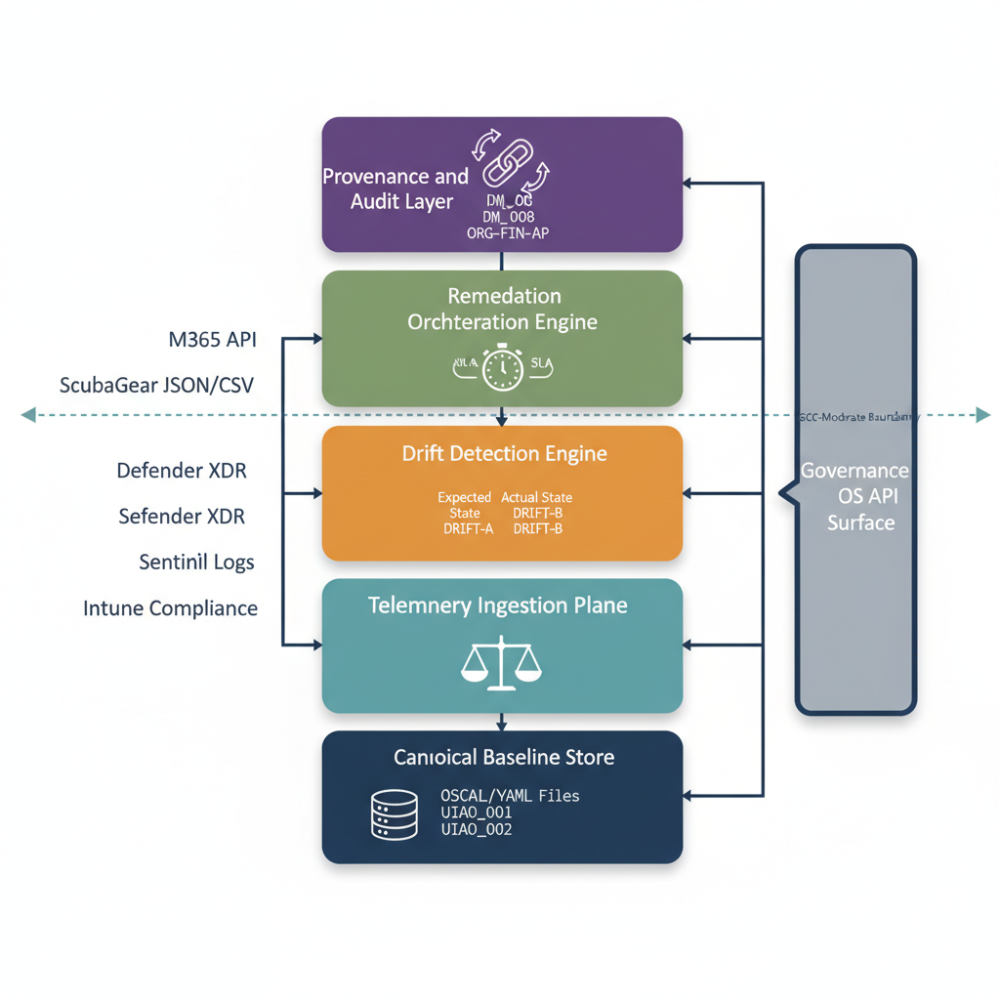
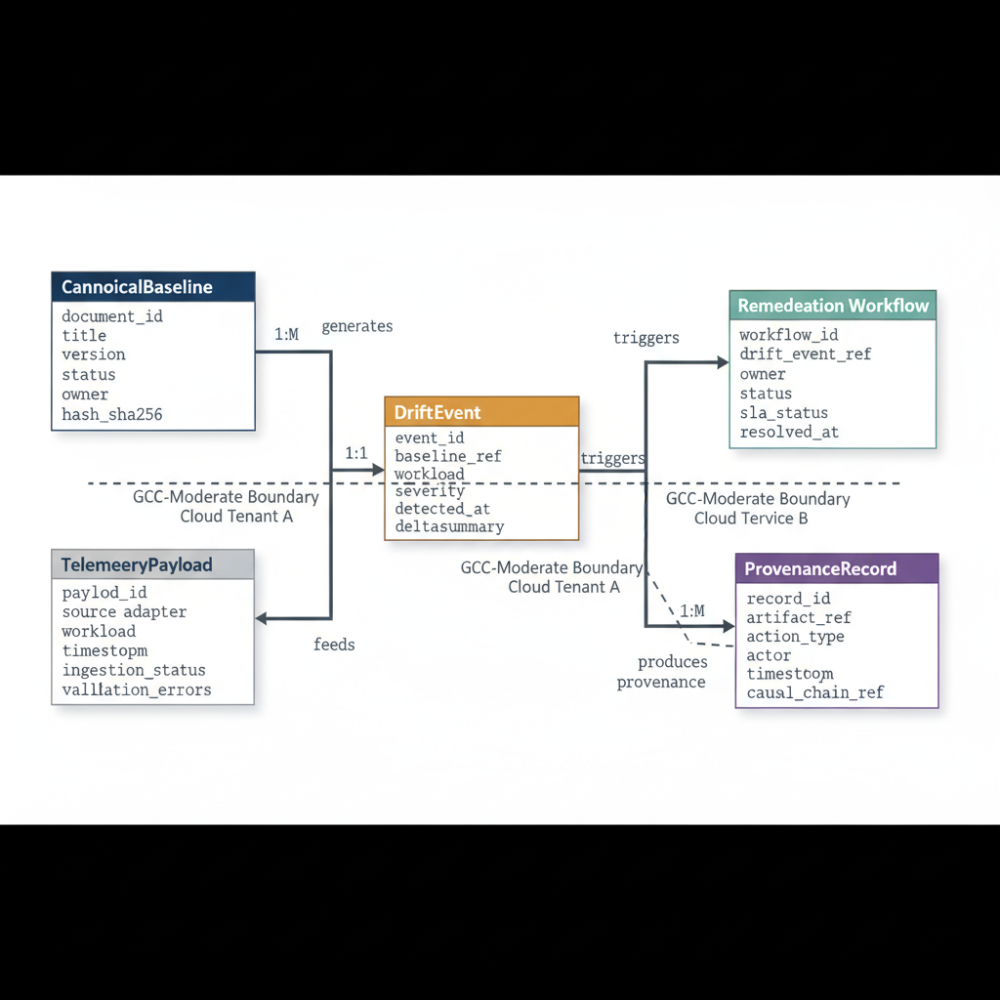
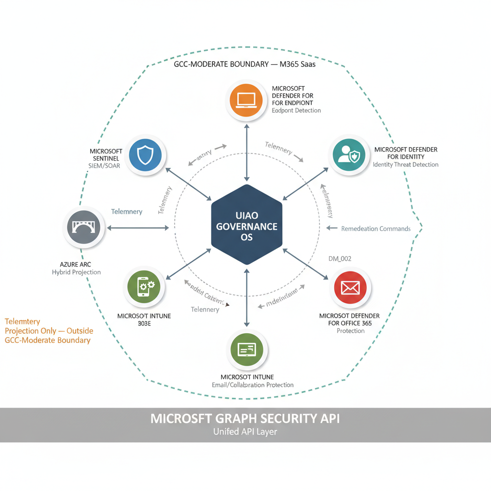
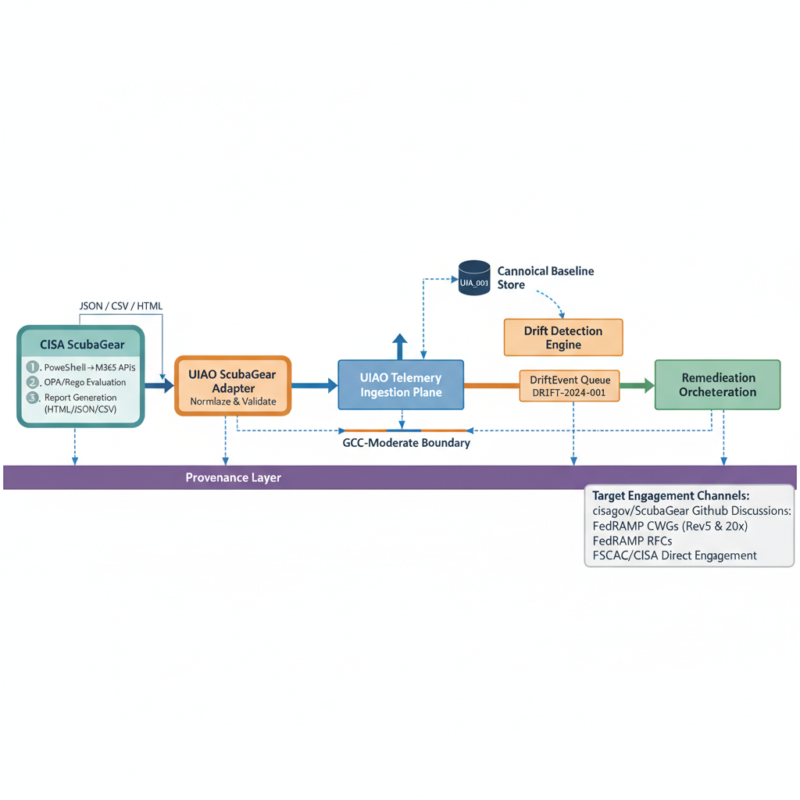
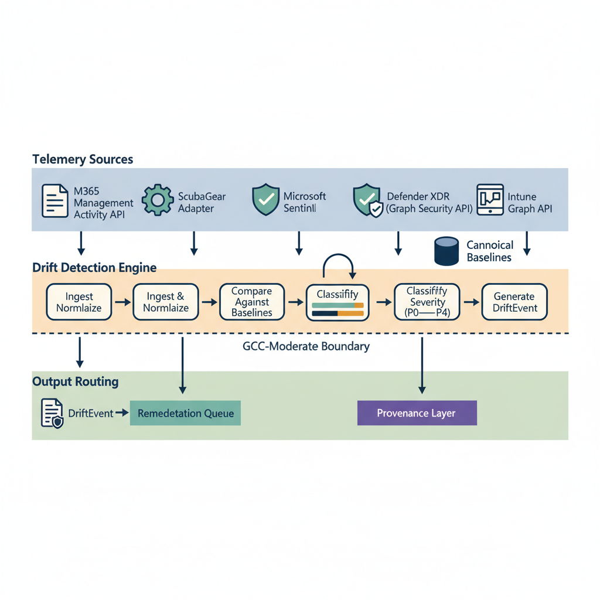
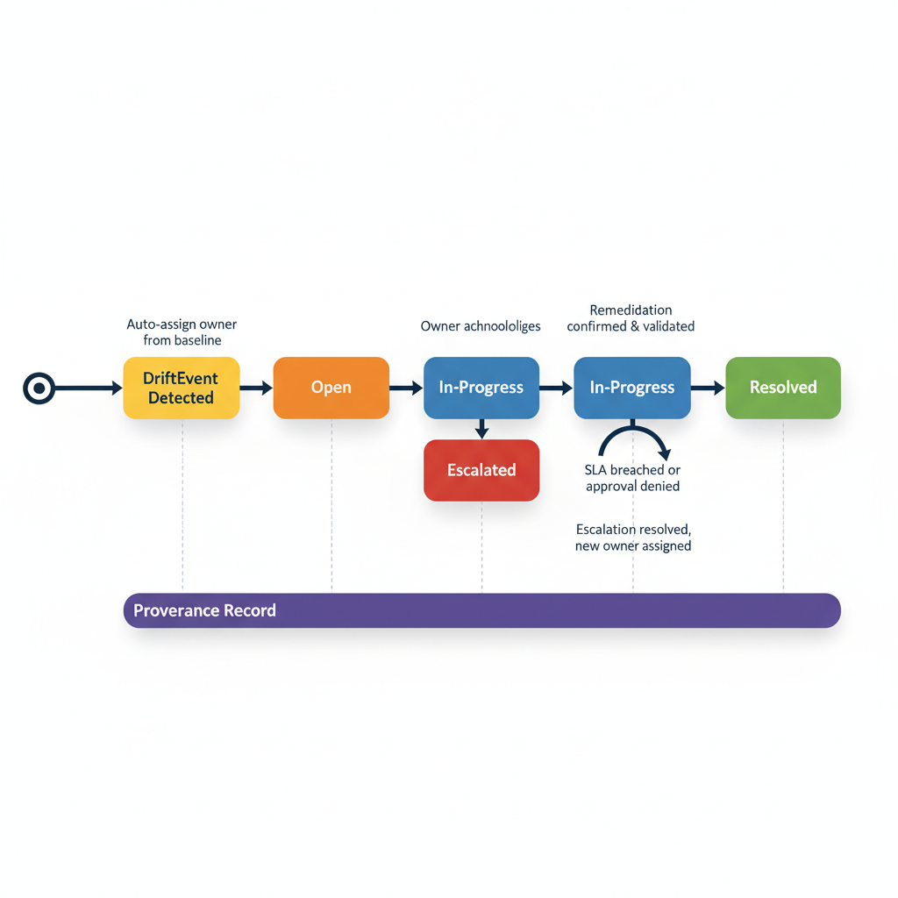
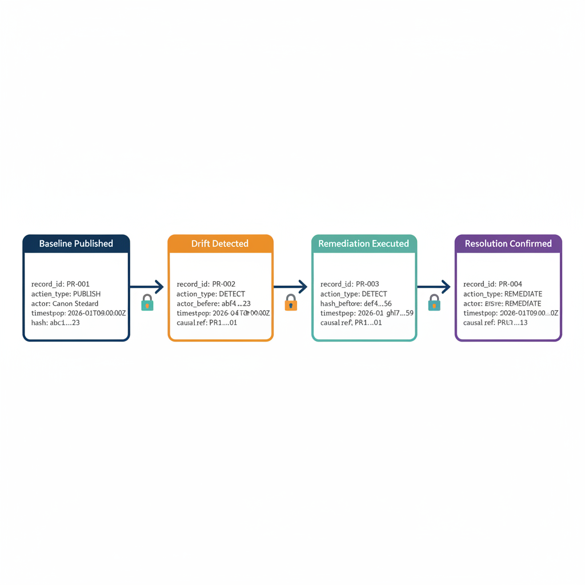
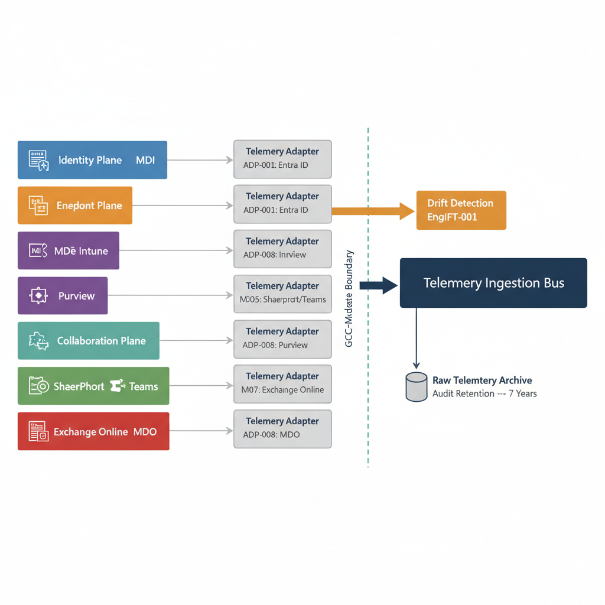
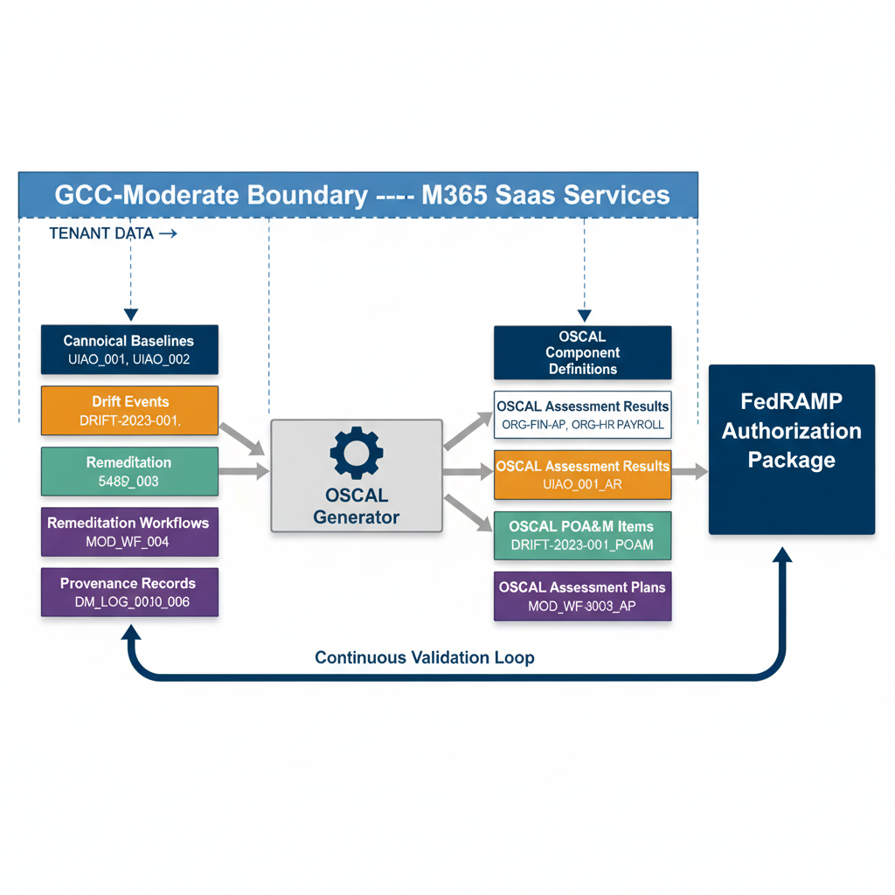

# UIAO Phase 2 --- Governance OS Deployment

Full Scope

# 1. Executive Summary

Phase 2 operationalizes the Governance OS substrate established in Phase
1 of the Unified Infrastructure and Architecture Overlay (UIAO) program.
It deploys the full-scope drift-detection, remediation-orchestration,
and provenance-tracking engines across the Microsoft 365 SaaS boundary
within GCC-Moderate. This phase transitions the governance
infrastructure from scaffolding and design into active, continuous
enforcement --- moving the UIAO program from foundational readiness into
operational governance. The engines deployed in Phase 2 are designed to
run continuously, autonomously detecting configuration drift,
orchestrating remediation workflows, and recording every governance
action in an immutable provenance chain.

Phase 2 integrates with Microsoft\'s security and compliance stack ---
Microsoft Sentinel (SIEM/SOAR), the Defender XDR suite (Microsoft
Defender for Endpoint, Microsoft Defender for Identity, and Microsoft
Defender for Office 365), Microsoft Intune (endpoint compliance), and
Azure Arc (hybrid telemetry projection) --- to build a unified
cross-plane telemetry ingestion architecture that feeds the Governance
OS continuously. This integration ensures that governance decisions are
informed by real-time security posture signals from every governed
plane: identity, endpoint, email, collaboration, and data. The resulting
telemetry architecture eliminates blind spots between security
operations and governance compliance, creating a single operational
picture of configuration state across the entire M365 boundary.

UIAO SCuBA is positioned as the governance orchestration layer above
CISA ScubaGear --- complementary, not competitive. It consumes ScubaGear
JSON/CSV outputs and adds four capabilities that ScubaGear does not
provide: continuous drift detection (ScubaGear is point-in-time),
canonical desired-state management, remediation orchestration with SLA
enforcement, and machine-trackable governance provenance. Target
engagement channels include cisagov/ScubaGear GitHub Discussions,
FedRAMP Cloud Working Groups (Rev5 and 20x), FedRAMP RFCs, and
FSCAC/CISA direct engagement. This positioning ensures UIAO contributes
to the broader federal governance ecosystem while maintaining its
canonical architecture.

Phase 2 delivers machine-readable, OSCAL-aligned artifacts for
Continuous ATO (cATO) alignment. Per OMB Memorandum M-24-15 and FedRAMP
RFC-0024, machine-readable authorization packages will be required by
September 30, 2026, with non-compliant services facing separate,
lower-priority processing and eventual revocation by September 2027.
UIAO positions organizations ahead of this mandate by generating OSCAL
component-definitions, assessment-results, and POA&M items directly from
governance data --- not as a separate documentation exercise, but as an
inherent output of governance operations. This design ensures that
compliance evidence is generated as a natural byproduct of governance
enforcement, eliminating the documentation lag that characterizes
traditional ATO processes.

# 2. Scope and Boundaries

## 2.1 Operational Boundary

The Phase 2 operational boundary encompasses Microsoft 365 SaaS services
within the GCC-Moderate authorization boundary. GCC-Moderate applies to
Microsoft 365 SaaS services only and does not include Azure services.
This distinction is canonical to the UIAO program. All governance
baselines, drift detection policies, remediation workflows, and
provenance records within Phase 2 are scoped exclusively to the M365
SaaS control plane within GCC-Moderate.

UIAO operates in Commercial Cloud as governed by FedRAMP unless
specifically noted. The sole explicit exception is Amazon Connect
Contact Center, which operates in Commercial Cloud. Azure services ---
including Azure IaaS, PaaS, and platform-level services --- are out of
scope for the GCC-Moderate boundary under UIAO, although Azure Arc is
used for telemetry projection from hybrid resources into the Governance
OS. This boundary definition aligns with FedRAMP Moderate overlay
requirements and ensures clean separation between the M365 SaaS
governance surface and the broader Azure platform.

## 2.2 In-Scope Workloads

The following Microsoft 365 SaaS workloads are in-scope for Phase 2
governance operations:

- Exchange Online

- SharePoint Online

- OneDrive for Business

- Microsoft Teams

- Microsoft Entra ID

- Microsoft Purview

- Microsoft Intune (management plane)

- Power Platform

- Power BI

## 2.3 Out-of-Scope

The following are explicitly out of scope for Phase 2:

- Azure IaaS/PaaS services (e.g., Azure Virtual Machines, Azure SQL,
  Azure Storage, Azure Kubernetes Service)

- GCC-High environments

- DoD environments (IL4, IL5, IL6)

- On-premises infrastructure (except where projected via Azure Arc for
  telemetry ingestion only)

Table TBL-P2-001 provides the complete Phase 2 scope matrix with
governance plane assignments, telemetry sources, and operational notes
for each workload.

**TBL-P2-001: Phase 2 Scope Matrix**

  -----------------------------------------------------------------------------------------
  **Workload**   **In-Scope**   **Governance    **Telemetry Source** **Notes**
                                Plane**
  -------------- -------------- --------------- -------------------- ----------------------
  Exchange       Yes            Email           M365 Management      Transport rules,
  Online                                        Activity API,        anti-phishing,
                                                ScubaGear, MDO       DMARC/DKIM/SPF

  SharePoint     Yes            Collaboration   M365 Management      External sharing,
  Online                                        Activity API,        sensitivity labels,
                                                ScubaGear            DLP

  OneDrive for   Yes            Collaboration   M365 Management      Sync client policies,
  Business                                      Activity API,        sharing controls
                                                ScubaGear

  Microsoft      Yes            Collaboration   M365 Management      Meeting policies,
  Teams                                         Activity API,        messaging policies,
                                                ScubaGear            app permissions

  Microsoft      Yes            Identity        Entra ID Graph API,  Conditional Access,
  Entra ID                                      ScubaGear, MDI       MFA, PIM, guest access

  Microsoft      Yes            Data            Purview Compliance   Sensitivity labels,
  Purview                                       API, M365 Management retention, DLP,
                                                Activity API         insider risk

  Microsoft      Yes            Endpoint        Intune Graph API,    Management plane only;
  Intune                                        MDE                  compliance policies,
                                                                     device config

  Power Platform Yes            Collaboration   Power Platform Admin Environment DLP,
                                                API, ScubaGear       connector policies,
                                                                     flow governance

  Power BI       Yes            Collaboration   Power BI Admin API,  Tenant settings,
                                                ScubaGear            external sharing,
                                                                     export controls

  Azure          No             N/A             N/A                  Out of scope --- not
  IaaS/PaaS                                                          within GCC-Moderate
                                                                     M365 SaaS boundary

  GCC-High       No             N/A             N/A                  Out of scope ---
                                                                     separate authorization
                                                                     boundary
  -----------------------------------------------------------------------------------------

# 3. Governance OS Architecture

## 3.1 Architecture Overview

The Governance OS is a five-layer architecture that provides end-to-end
governance enforcement across the M365 SaaS boundary. Each layer has a
distinct responsibility and communicates with adjacent layers through
well-defined interfaces. The architecture is designed for deterministic
operation, immutable record-keeping, and machine-readable output.
Diagram DIAG-P2-001 illustrates the five-layer stack with data flows and
API surface.

**Layer 1 --- Canonical Baseline Store:** The single source of truth for
desired-state configurations. Every governed configuration surface has a
corresponding canonical baseline stored as OSCAL-formatted YAML in the
governance repository under canon/baselines/. Baselines are versioned,
SHA-256 hashed, and subject to CI/CD validation before publication. No
governance decision is made without reference to the canonical baseline
--- it is the authoritative definition of \"correct.\"

**Layer 2 --- Telemetry Ingestion Plane:** Collects actual-state signals
from multiple sources: the M365 Management Activity API, ScubaGear
JSON/CSV outputs, Defender XDR signals (via Microsoft Graph Security
API), Sentinel Log Analytics workspace data, and Intune compliance data
(via Intune Graph API). Each source has a dedicated adapter that
normalizes incoming telemetry into the UIAO TelemetryPayload schema. The
ingestion plane ensures that the Governance OS has a continuous,
comprehensive picture of actual configuration state.

**Layer 3 --- Drift Detection Engine:** Compares actual-state telemetry
from Layer 2 against canonical baselines from Layer 1 using
deterministic OPA/Rego rule evaluation. The engine never uses
probabilistic inference --- all evaluations are deterministic and
reproducible. Each comparison produces a DriftEvent with severity
classification, delta summary, and remediation recommendation. Identical
inputs always produce identical outputs.

**Layer 4 --- Remediation Orchestration Engine:** Executes approved
remediation workflows with SLA enforcement, owner accountability,
approval gates, and rollback capability. Every DriftEvent triggers a
RemediationWorkflow assigned to the baseline owner. Workflows follow a
defined state machine (Open → In-Progress → Resolved \| Escalated) with
escalation triggers tied to SLA breach thresholds.

**Layer 5 --- Provenance and Audit Layer:** Records every state change,
drift event, remediation action, and approval in an immutable,
SHA-256-linked provenance chain. Provenance records cannot be modified
or deleted once written. The chain provides a complete,
cryptographically verifiable audit trail from baseline publication
through drift detection, remediation, and resolution.

+----------------------------------------------------------------------+
| **DIAG-P2-001**                                                      |
|                                                                      |
| **Governance OS Five-Layer Architecture**                            |
|                                                                      |

{fig-alt="Governance OS Five-Layer Architecture" width="720"}

## 3.2 Design Principles

The Governance OS is built on six foundational design principles that
govern all architectural and operational decisions:

- **Canon Supremacy:** The canon/ directory is the single source of
  truth for all governance artifacts. Every baseline, policy,
  remediation pattern, and OSCAL artifact must trace provenance to
  canonical sources. Orphan artifacts --- those without a traceable
  lineage to canon/ --- are CI-blocking and must be resolved before any
  pipeline can complete. No governance decision is valid without
  canonical backing.

- **Deterministic Evaluation:** Drift detection uses deterministic
  OPA/Rego rule engines, never probabilistic inference. All evaluations
  are reproducible: given identical inputs (telemetry payload and
  canonical baseline), the engine always produces identical outputs
  (drift event or clean-pass result). This principle ensures
  auditability, testability, and predictability of governance outcomes.

- **Immutable Provenance:** Every governance action is recorded with
  timestamp, actor identity, artifact hash (SHA-256), and causal chain
  reference. Records are append-only and cannot be modified or deleted
  after creation. Any tampering with an intermediate record breaks the
  hash chain and is detectable during provenance audit. This principle
  provides the cryptographic foundation for cATO evidence generation.

- **Owner Accountability:** Every canonical artifact and every
  remediation workflow has a named owner. Owner reliability metrics ---
  including SLA compliance rate, mean time to acknowledge, and mean time
  to remediate --- are tracked and reported. Accountability is not
  abstract; it is measured, visible, and factored into governance
  cadence reviews.

- **Separation of Planes:** Telemetry ingestion, detection, and
  remediation are architecturally separate to prevent feedback loops and
  maintain auditability. The ingestion plane does not make governance
  decisions. The detection engine does not execute remediations. The
  remediation engine does not modify baselines. This separation ensures
  that each plane can be independently audited, tested, and scaled.

- **Machine-Readable First:** All governance artifacts are
  OSCAL-aligned, machine-parseable, and CI/CD-verifiable. Human-readable
  views (dashboards, reports, summaries) are derived from
  machine-readable sources, never primary. This principle ensures that
  UIAO governance data can be consumed by automated systems, FedRAMP
  tooling, and external auditors without manual translation.

# 4. Canonical Baselines

## 4.1 Baseline Architecture

Canonical baselines are the desired-state definitions for every governed
configuration surface within the M365 SaaS boundary. Each baseline is a
versioned OSCAL component-definition stored in the governance repository
under canon/baselines/. Baselines are the authoritative reference
against which all drift detection is performed --- they define what
\"correct\" looks like for every configuration item in scope.

All baselines follow the UIAO metadata schema
(schemas/metadata-schema.json) with required fields: document_id
(UIAO_NNN format), title, version (Major.Minor), status, classification,
owner, created_at, updated_at, and boundary (GCC-Moderate). Every
baseline includes a Copy section per UIAO appendix rules, providing a
brief summary of the baseline\'s purpose and scope for quick reference.
Baselines are subject to CI/CD validation: schema compliance, hash
integrity, owner verification, and cross-reference checks are enforced
on every commit.

## 4.2 Baseline Categories

### 4.2.1 Identity and Access (Entra ID)

The Identity and Access baseline governs all identity-related
configuration surfaces in Microsoft Entra ID. This includes Conditional
Access policies (required policy sets, grant/session controls, named
locations), multi-factor authentication enforcement (per-user, per-app,
and risk-based MFA), and Privileged Identity Management (PIM) role
activation configurations (approval requirements, activation duration,
eligible vs. active assignments). The baseline also covers guest access
controls (invitation restrictions, collaboration restrictions,
cross-tenant access settings), application consent policies (admin
consent workflow, user consent restrictions), and cross-tenant access
settings for B2B and B2B direct connect scenarios. Identity baselines
are classified as P0/P1 severity surfaces due to their direct impact on
authentication and authorization posture.

### 4.2.2 Email Security (Exchange Online)

The Email Security baseline governs Exchange Online configuration
surfaces that affect mail flow security and audit integrity. Covered
configurations include transport rules (mail flow rules with security
implications), anti-phishing policies (impersonation protection, spoof
intelligence, mailbox intelligence), and DMARC/DKIM/SPF configurations
(domain authentication records and policies). The baseline extends to
mailbox audit logging (audit actions per logon type, audit log
retention), journal rules, mail flow rules with external routing
implications, and accepted domains and connectors. Connector
configurations are particularly sensitive, as misconfigured inbound or
outbound connectors can bypass security controls.

### 4.2.3 Collaboration Security (SharePoint, OneDrive, Teams)

The Collaboration Security baseline spans three interconnected workloads
that share data governance surfaces. SharePoint Online baselines govern
external sharing policies (sharing levels, link types, domain
restrictions), site-level sharing overrides, and access control
settings. OneDrive for Business baselines cover sync client restrictions
and personal site sharing controls. Microsoft Teams baselines address
meeting policies (lobby settings, recording, external participant
controls), messaging policies (external messaging, URL preview, content
moderation), and app permission policies (third-party app installation,
custom app sideloading). Cross-workload sensitivity labels and DLP
policies that span all three surfaces are governed as unified
collaboration baselines.

### 4.2.4 Endpoint Compliance (Intune)

The Endpoint Compliance baseline governs the Intune management plane
configuration surfaces that enforce device-level security posture.
Device compliance policies define minimum security requirements (OS
version, encryption, threat protection level, password complexity) that
devices must meet to access organizational resources via Conditional
Access. Device configuration profiles enforce specific settings across
managed endpoints. App protection policies govern data protection
controls for managed applications on both enrolled and unenrolled
devices. Windows Update for Business rings control update deployment
cadence and deferral policies. Endpoint security policies and
remediation scripts (Proactive Remediations) provide additional
enforcement and automated remediation capabilities at the device level.

### 4.2.5 Data Governance (Purview)

The Data Governance baseline covers Microsoft Purview configuration
surfaces that control information protection, retention, and compliance.
Sensitivity labels and label policies define classification taxonomy,
encryption settings, content marking, and auto-labeling rules. Retention
policies and retention labels govern data lifecycle management across
Exchange, SharePoint, OneDrive, Teams, and Viva Engage. DLP rules and
policies prevent unauthorized data exposure across communication
channels and storage locations. The baseline also covers insider risk
policies, audit log retention settings (standard and advanced audit),
and communication compliance policies that monitor for regulatory
violations or policy breaches.

### 4.2.6 Power Platform Security

The Power Platform Security baseline governs the administrative
configuration surfaces that control environment security and data flow.
Environment-level security covers environment creation restrictions,
environment types (production, sandbox, developer), and security group
assignments. DLP connector policies (Business/Non-Business/Blocked
classifications) control data flow between connectors within and across
environments. Power Automate flow governance addresses flow ownership,
sharing policies, and premium connector usage. Power BI tenant settings
cover export restrictions, external sharing, embedding controls, and
sensitivity label enforcement. Power Apps environment isolation and
Dataverse security roles complete the Power Platform governance surface,
ensuring that low-code/no-code development operates within
organizational security boundaries.

Table TBL-P2-002 provides the canonical baseline registry with
representative entries for each category.

**TBL-P2-002: Canonical Baseline Registry**

  ---------------------------------------------------------------------------------------------------------------------------------------
  **Baseline    **Category**    **Workload**   **Owner**   **Version**   **Status**   **Last        **OSCAL Component-Definition Ref**
  ID**                                                                                Validated**
  ------------- --------------- -------------- ----------- ------------- ------------ ------------- -------------------------------------
  UIAO_BL_001   Identity &      Entra ID       M. Stratton 1.0           Active       2026-04-20    oscal/cd-entra-ca-001.yaml
                Access

  UIAO_BL_002   Identity &      Entra ID       M. Stratton 1.0           Active       2026-04-20    oscal/cd-entra-pim-002.yaml
                Access

  UIAO_BL_003   Email Security  Exchange       M. Stratton 1.0           Active       2026-04-18    oscal/cd-exo-transport-003.yaml
                                Online

  UIAO_BL_004   Email Security  Exchange       M. Stratton 1.0           Active       2026-04-18    oscal/cd-exo-antiphish-004.yaml
                                Online

  UIAO_BL_005   Collaboration   SharePoint     M. Stratton 1.0           Active       2026-04-15    oscal/cd-spo-sharing-005.yaml
                Security        Online

  UIAO_BL_006   Collaboration   Microsoft      M. Stratton 1.0           Active       2026-04-15    oscal/cd-teams-meeting-006.yaml
                Security        Teams

  UIAO_BL_007   Endpoint        Intune         M. Stratton 1.0           Active       2026-04-19    oscal/cd-intune-compliance-007.yaml
                Compliance

  UIAO_BL_008   Endpoint        Intune         M. Stratton 1.0           Active       2026-04-19    oscal/cd-intune-config-008.yaml
                Compliance

  UIAO_BL_009   Data Governance Purview        M. Stratton 1.0           Active       2026-04-17    oscal/cd-purview-labels-009.yaml

  UIAO_BL_010   Data Governance Purview        M. Stratton 1.0           Active       2026-04-17    oscal/cd-purview-dlp-010.yaml

  UIAO_BL_011   Power Platform  Power Platform M. Stratton 1.0           Draft        2026-04-22    oscal/cd-pp-env-011.yaml
                Security

  UIAO_BL_012   Power Platform  Power BI       M. Stratton 1.0           Draft        2026-04-22    oscal/cd-pbi-tenant-012.yaml
                Security
  ---------------------------------------------------------------------------------------------------------------------------------------

# 5. Control Families to Baseline Mapping

## 5.1 NIST SP 800-53 Rev 5 Alignment

Every canonical baseline maps to one or more NIST SP 800-53 Rev 5
control families. This mapping is the structural link between
organizational configuration governance and federal compliance
requirements. The control-to-baseline mapping enables three critical
capabilities: automated compliance evidence generation (OSCAL
assessment-results derived from drift detection output), FedRAMP
Moderate overlay requirement traceability (each configuration setting
traces through baselines to control families to FedRAMP overlay
requirements), and end-to-end auditability from individual configuration
items through baselines to control families.

Table TBL-P2-003 provides the complete control family to baseline
mapping matrix, showing which UIAO baselines address each NIST SP 800-53
Rev 5 control family, the M365 workloads involved, the assessment method
(Automated, Manual, or Hybrid), and the corresponding ScubaGear policy
reference where applicable.

**TBL-P2-003: Control Family to Baseline Mapping Matrix**

  -------------------------------------------------------------------------------------------------
  **Control   **Control Family **Mapped            **Workload    **Assessment   **ScubaGear Policy
  Family ID** Name**           Baseline(s)**       Coverage**    Method**       Ref**
  ----------- ---------------- ------------------- ------------- -------------- -------------------
  AC          Access Control   UIAO_BL_001,        Entra ID,     Automated      MS.AAD.1.1v1,
                               UIAO_BL_002         SharePoint,                  MS.AAD.3.1v1
                                                   Teams

  AU          Audit and        UIAO_BL_003,        Exchange      Automated      MS.EXO.13.1v1
              Accountability   UIAO_BL_009         Online,
                                                   Purview

  AT          Awareness and    UIAO_BL_004         Exchange      Manual         N/A
              Training                             Online
                                                   (phishing
                                                   sim)

  CM          Configuration    UIAO_BL_007,        Intune, All   Automated      MS.AAD.7.1v1
              Management       UIAO_BL_008         workloads

  CP          Contingency      UIAO_BL_005         SharePoint,   Hybrid         N/A
              Planning                             OneDrive

  IA          Identification   UIAO_BL_001,        Entra ID      Automated      MS.AAD.2.1v1,
              and              UIAO_BL_002                                      MS.AAD.3.6v1
              Authentication

  IR          Incident         UIAO_BL_003,        Exchange      Hybrid         MS.EXO.16.1v1
              Response         UIAO_BL_004         Online,
                                                   Sentinel

  MA          Maintenance      UIAO_BL_008         Intune        Manual         N/A

  MP          Media Protection UIAO_BL_009,        Purview       Automated      N/A
                               UIAO_BL_010

  PE          Physical and     N/A                 N/A           Manual         N/A
              Environmental    (cloud-inherited)
              Protection

  PL          Planning         All baselines       All workloads Manual         N/A

  PS          Personnel        UIAO_BL_001         Entra ID      Manual         N/A
              Security

  RA          Risk Assessment  UIAO_BL_001,        Entra ID,     Hybrid         MS.AAD.2.3v1
                               UIAO_BL_007         Intune

  SA          System and       UIAO_BL_011         Power         Manual         N/A
              Services                             Platform
              Acquisition

  SC          System and       UIAO_BL_003,        Exchange      Automated      MS.EXO.4.1v1,
              Communications   UIAO_BL_005,        Online,                      MS.TEAMS.6.1v1
              Protection       UIAO_BL_006         SharePoint,
                                                   Teams

  SI          System and       UIAO_BL_004,        Exchange      Automated      MS.EXO.8.1v1,
              Information      UIAO_BL_010         Online,                      MS.DEFENDER.1.1v1
              Integrity                            Purview
  -------------------------------------------------------------------------------------------------

## 5.2 FedRAMP Moderate Overlay Alignment

The UIAO baseline mapping aligns directly with FedRAMP Moderate overlay
requirements. Each canonical baseline produces OSCAL-formatted SSP
components that document control implementation details for the
authorization package. The mapping from configuration settings through
baselines to NIST control families to FedRAMP overlay requirements
creates a traceable chain that auditors and assessors can follow without
manual interpretation.

The OSCAL mandate timeline is critical to Phase 2 planning. FedRAMP
publishes supporting materials and tooling by April 15, 2026. New
authorization packages submitted to FedRAMP must be machine-readable
(OSCAL-formatted) by September 30, 2026. After September 30, 2027,
non-compliant services --- those that have not submitted
machine-readable authorization packages --- face separate,
lower-priority processing and eventual revocation. UIAO Phase 2 is
designed to generate compliant OSCAL artifacts as an inherent output of
governance operations, positioning organizations to meet the September
2026 deadline without a separate documentation sprint.

# 6. Governance OS APIs and Data Model

## 6.1 API Architecture

The Governance OS API surface follows a repository-as-API pattern.
Rather than exposing a traditional REST service backed by a relational
database, the API surface reads directly from the canonical governance
repository and exposes five endpoint groups. This design ensures that
every API response is traceable to a canonical source and that the API
surface cannot diverge from the repository state. Table TBL-P2-004
provides the complete endpoint reference.

- **Baseline Query API (/api/v1/baselines):** Retrieve current
  desired-state baselines by workload, control family, or baseline ID.
  Supports filtering by status, version, and owner. Returns OSCAL
  component-definition fragments.

- **Drift Status API (/api/v1/drift):** Query current drift state by
  workload, baseline, or control family. Supports filtering by severity
  (P0--P4), date range, and remediation status. Returns DriftEvent
  records with delta summaries.

- **Remediation Status API (/api/v1/remediation):** Query remediation
  workflow status, SLA compliance, and owner assignments. Supports
  filtering by workflow state, owner, and SLA status. Returns
  RemediationWorkflow records.

- **Provenance Query API (/api/v1/provenance):** Retrieve the full
  provenance chain for any governance artifact or action. Supports chain
  traversal via causal_chain_ref links. Returns ProvenanceRecord
  sequences with hash verification.

- **Telemetry Ingestion API (/api/v1/telemetry):** Accept normalized
  telemetry payloads from integration adapters. Validates incoming
  payloads against the TelemetryPayload schema. Returns ingestion status
  and validation errors.

**TBL-P2-004: Governance OS API Endpoints**

  ---------------------------------------------------------------------------------------------------------------
  **Endpoint**               **Method**   **Description**   **Input            **Response Schema**   **Auth
                                                            Parameters**                             Required**
  -------------------------- ------------ ----------------- ------------------ --------------------- ------------
  /api/v1/baselines          GET          List all          workload, status,  BaselineList          Yes ---
                                          canonical         owner (optional                          Reader
                                          baselines         filters)

  /api/v1/baselines/{id}     GET          Retrieve a        baseline_id (path) CanonicalBaseline     Yes ---
                                          specific baseline                                          Reader
                                          by ID

  /api/v1/drift              GET          List drift events workload,          DriftEventList        Yes ---
                                          with filters      severity,                                Reader
                                                            date_from,
                                                            date_to, status

  /api/v1/drift/{id}         GET          Retrieve a        event_id (path)    DriftEvent            Yes ---
                                          specific drift                                             Reader
                                          event

  /api/v1/remediation        GET          List remediation  owner, sla_status, RemediationList       Yes ---
                                          workflows         state, severity                          Reader

  /api/v1/remediation/{id}   GET          Retrieve a        workflow_id (path) RemediationWorkflow   Yes ---
                                          specific workflow                                          Reader

  /api/v1/remediation        POST         Initiate a        drift_event_ref,   RemediationWorkflow   Yes ---
                                          remediation       owner, priority                          Operator
                                          workflow          (body)

  /api/v1/provenance         GET          Query provenance  artifact_ref,      ProvenanceChain       Yes ---
                                          chain by artifact action_type,                             Auditor
                                                            date_from, date_to

  /api/v1/telemetry          POST         Submit normalized TelemetryPayload   IngestionReceipt      Yes ---
                                          telemetry payload (body)                                   Adapter

  /api/v1/telemetry/status   GET          Check ingestion   payload_id (query) IngestionStatus       Yes ---
                                          status for a                                               Adapter
                                          payload
  ---------------------------------------------------------------------------------------------------------------

## 6.2 Core Data Model

The Governance OS is built on five core entities that model the complete
governance lifecycle from baseline definition through drift detection,
remediation, and provenance tracking. Diagram DIAG-P2-002 illustrates
the entity relationships.

**CanonicalBaseline:** Represents a desired-state configuration
definition. Key attributes: document_id, title, version, status,
classification, owner, boundary, control_mappings\[\],
oscal_component_ref, created_at, updated_at, hash_sha256. A
CanonicalBaseline is immutable once published; updates create new
versions with provenance chain references to predecessors.

**DriftEvent:** Records a detected divergence between actual state and
expected state. Key attributes: event_id, baseline_ref, workload,
actual_state_hash, expected_state_hash, delta_summary, severity
(P0--P4), detected_at, source_adapter, remediation_ref. DriftEvents are
generated exclusively by the Drift Detection Engine and are immutable
after creation.

**RemediationWorkflow:** Tracks the lifecycle of a remediation action
from initiation through resolution or escalation. Key attributes:
workflow_id, drift_event_ref, owner, status
(Open/In-Progress/Resolved/Escalated), sla_target_hours, sla_status
(On-Track/At-Risk/Breached), actions_taken\[\], approval_chain\[\],
created_at, resolved_at.

**ProvenanceRecord:** An immutable log entry recording a governance
action. Key attributes: record_id, artifact_ref, action_type, actor,
timestamp, artifact_hash_before, artifact_hash_after, causal_chain_ref,
justification. ProvenanceRecords form a SHA-256-linked chain that can be
traversed and verified.

**TelemetryPayload:** Represents a normalized telemetry submission from
an integration adapter. Key attributes: payload_id, source_adapter,
workload, timestamp, raw_data_ref, normalized_data, ingestion_status
(Accepted/Rejected/Partial), validation_errors\[\]. Payloads are
validated against the TelemetryPayload schema at ingestion time.

+----------------------------------------------------------------------+
| **DIAG-P2-002**                                                      |
|                                                                      |
| **Governance OS Core Data Model --- Entity Relationship Diagram**    |
|                                                                      |

{fig-alt="Governance OS Core Data Model Entity Relationship Diagram" width="720"}

# 7. Integration with Microsoft Security and Compliance Stack

## 7.1 Integration Overview

Phase 2 integrates with six Microsoft security and compliance services
to build a unified cross-plane telemetry architecture that feeds the
Governance OS continuously. These integrations span five governance
planes --- Identity, Endpoint, Email, Collaboration, and Data ---
ensuring comprehensive visibility across every governed configuration
surface. The integrations are designed as loosely coupled adapters that
normalize source-specific telemetry into the UIAO TelemetryPayload
schema, insulating the Governance OS from upstream API changes.

A critical migration is underway that affects multiple integrations. The
legacy Microsoft Defender for Endpoint APIs and the legacy Microsoft 365
Defender (XDR) APIs are being retired: the retirement process started
February 6, 2026, with full retirement scheduled for February 1, 2027.
All UIAO integrations with Defender services must use the Microsoft
Graph Security API, which serves as the unified, stable API surface for
security-related data across the Microsoft security stack. This
migration aligns with UIAO\'s design principle of using stable,
well-governed API surfaces and ensures that UIAO integrations are not
affected by the legacy API retirement timeline. Diagram DIAG-P2-003
illustrates the full integration map, and Table TBL-P2-005 provides the
integration matrix.

## 7.2 Microsoft Sentinel Integration

Microsoft Sentinel serves as the SIEM/SOAR backbone for governance
telemetry within the UIAO architecture. Sentinel\'s cloud-native
architecture, Log Analytics workspace, and integrated automation
capabilities make it the natural aggregation point for governance
signals that span multiple M365 workloads. The Governance OS treats
Sentinel as both a telemetry consumer (ingesting governance events) and
a telemetry producer (surfacing correlated security signals back to the
Drift Detection Engine).

Governance drift events generated by the Drift Detection Engine are
ingested into Sentinel as custom log types via the Log Analytics
workspace. The ingestion mechanism uses the Azure Monitor Ingestion API
(successor to the legacy Data Collector API) with Data Collection Rules
(DCRs) and Data Collection Endpoints (DCEs) for structured,
schema-validated ingestion. Custom tables --- including
UIAO_DriftEvents_CL, UIAO_Remediation_CL, and UIAO_Provenance_CL ---
store governance data alongside native security logs, enabling
cross-correlation queries.

Custom Sentinel analytics rules trigger governance alerts based on drift
severity thresholds. Near Real-Time (NRT) analytics rules are configured
for P0 and P1 drift events, providing sub-minute detection-to-alert
latency for critical configuration changes such as MFA disablement or
Conditional Access policy deletion. Scheduled analytics rules handle P2
through P4 drift events with configurable query intervals (default: 5
minutes for P2, 15 minutes for P3, 1 hour for P4). Each analytics rule
is mapped to a MITRE ATT&CK technique where applicable, enriching
governance alerts with threat context.

KQL (Kusto Query Language) queries in Sentinel workbooks surface
operational governance dashboards showing drift trends over time, SLA
compliance heatmaps by owner and workload, remediation velocity charts,
and owner reliability scorecards. These workbooks provide the primary
operational dashboard layer for governance operations, enabling the
Drift Operator and Canon Steward to monitor governance health without
direct access to the governance repository. Workbook templates are
stored in the governance repository under canon/sentinel/workbooks/ and
deployed via ARM templates.

Sentinel playbooks --- implemented as Azure Logic Apps --- trigger
automated remediation workflows when approved remediation patterns are
matched. Playbooks are scoped to specific drift patterns that have
standing approval for automated remediation (see Section 10.2). When a
matching drift event is detected, the playbook calls the Governance OS
Remediation API (/api/v1/remediation) to initiate a workflow, executes
the pre-approved remediation script, and records the action in the
Provenance Layer. All playbook executions are logged in Sentinel\'s own
audit trail, providing a dual-layer audit record.

## 7.3 Microsoft Defender for Endpoint (MDE) Integration

Microsoft Defender for Endpoint provides real-time endpoint security
posture signals that complement Intune compliance data in the Governance
OS. MDE\'s cloud-native sensors deliver continuous device health, threat
detection, and vulnerability assessment data via the Microsoft Graph
Security API. The UIAO Telemetry Ingestion Plane consumes MDE signals
through the Microsoft Graph Security API adapter, normalizing device
security state into TelemetryPayload format for comparison against
endpoint compliance baselines.

Threat and Vulnerability Management (TVM) findings from MDE map directly
to endpoint configuration baselines in the Canonical Baseline Store. TVM
identifies software vulnerabilities, misconfigurations, and missing
security updates across managed endpoints. These findings are correlated
with UIAO endpoint baselines (UIAO_BL_007, UIAO_BL_008) to determine
whether identified issues represent configuration drift from the
canonical desired state or newly discovered vulnerabilities requiring
baseline updates.

MDE alerts are correlated with drift events to distinguish between
configuration drift and active threats --- a critical operational
distinction. Configuration drift (e.g., a Windows Firewall profile
disabled on a device) generates a DriftEvent for remediation through the
governance workflow. An active threat (e.g., a credential access
technique detected on a device) generates a security incident that is
handled through the security operations workflow. When both conditions
occur simultaneously --- a configuration drift that is being actively
exploited --- the correlation engine flags the DriftEvent as P0 severity
with a threat correlation indicator, ensuring the Canon Steward is
immediately notified.

## 7.4 Microsoft Defender for Identity (MDI) Integration

Microsoft Defender for Identity monitors on-premises Active Directory
signals through the hybrid identity infrastructure. MDI sensors deployed
on domain controllers and Active Directory Federation Services (AD FS)
servers detect suspicious identity activities by analyzing
authentication traffic, LDAP queries, and directory replication
patterns. These signals are critical for UIAO governance because Entra
ID configurations (canonical baselines UIAO_BL_001, UIAO_BL_002) depend
on the integrity of the underlying Active Directory infrastructure in
hybrid environments.

Suspicious identity activities detected by MDI --- including credential
theft attempts, lateral movement patterns, Pass-the-Hash attacks, Golden
Ticket attacks, and reconnaissance activities --- are correlated with
Entra ID baseline drift. When MDI detects an identity-plane threat, the
UIAO Telemetry Ingestion Plane receives the alert via the Microsoft
Graph Security API and evaluates whether the attack exploited a known
configuration drift. For example, if MDI detects a Pass-the-Hash attack
and the Entra ID baseline shows that legacy authentication protocols
were unexpectedly enabled, the correlation strengthens the drift event
severity classification.

MDI alerts feed the Telemetry Ingestion Plane as identity-plane signals
via the Microsoft Graph Security API. The UIAO adapter normalizes MDI
alerts into TelemetryPayload format with identity-specific metadata:
affected accounts, attack technique (MITRE ATT&CK mapping), confidence
level, and remediation recommendations. These payloads are routed to the
Drift Detection Engine for correlation with Entra ID baselines, ensuring
that identity threats are evaluated in the context of governance
posture.

## 7.5 Microsoft Defender for Office 365 (MDO) Integration

Microsoft Defender for Office 365 protects email and collaboration
workloads through safe links, safe attachments, and anti-phishing
policies. The MDO policy configurations --- safe links policies, safe
attachments policies, anti-phishing policies with impersonation
protection settings --- map directly to Exchange Online canonical
baselines (UIAO_BL_003, UIAO_BL_004). UIAO treats MDO policy settings as
governed configuration surfaces: any change to an MDO policy setting is
subject to drift detection against the canonical baseline.

MDO threat detection signals feed the Telemetry Ingestion Plane as email
and collaboration-plane signals. These signals include phishing
detection rates, malware interception events, impersonation attempt
statistics, and user-reported message classifications. While these
signals do not directly trigger drift events (they represent threat
activity, not configuration changes), they provide context that enriches
drift severity classification. A spike in phishing detection rates
coinciding with a relaxation of anti-phishing threshold settings, for
example, would elevate the drift severity.

Policy drift in MDO settings triggers drift detection with appropriate
severity classification. Examples include: safe links disabled for a
specific connector (P1 --- significant security gap), anti-phishing
threshold lowered from \"Most aggressive\" to \"Standard\" without
approval (P1), safe attachments policy modified to allow delivery
without scanning (P0 --- immediate security exposure), or a new
anti-phishing policy created that overrides the baseline policy with
weaker settings (P2). Each drift pattern has a corresponding Rego policy
in the Drift Detection Engine that defines the expected state and
severity classification.

## 7.6 Microsoft Intune Integration

Microsoft Intune serves as the endpoint compliance and configuration
management plane within the UIAO Governance OS. Intune\'s role is dual:
it defines expected endpoint configuration state through compliance
policies and configuration profiles, and it reports actual endpoint
compliance state through the Intune Graph API. This dual role makes
Intune both a source of canonical baseline definitions and a telemetry
source for drift detection.

Intune compliance policies define the minimum security requirements that
managed devices must meet to be considered compliant. Compliance data
--- including per-device compliance status, non-compliance reasons, and
remediation actions --- feeds the Telemetry Ingestion Plane via the
Intune Graph API. The adapter queries the deviceCompliancePolicy and
deviceManagementCompliancePolicies endpoints to retrieve compliance
state, normalizes the data into TelemetryPayload format, and submits it
for drift detection against endpoint baselines (UIAO_BL_007).

Intune Remediation Scripts (Proactive Remediations) serve as automated
remediation actions for endpoint drift patterns. When the Drift
Detection Engine identifies endpoint configuration drift that matches a
pre-approved remediation pattern, the Remediation Orchestration Engine
can trigger an Intune Proactive Remediation script to correct the
configuration. These scripts follow the detection/remediation pair
pattern: a detection script identifies the specific configuration state,
and a remediation script corrects it. All script executions are recorded
in both Intune reporting and the UIAO Provenance Layer.

Device Configuration Profiles and Endpoint Security Policies deployed
via Intune map to UIAO canonical baselines for endpoint governance
(UIAO_BL_008). Configuration profiles define settings for Wi-Fi, VPN,
email, device restrictions, and endpoint protection. Endpoint security
policies define antivirus, disk encryption, firewall, endpoint detection
and response, and attack surface reduction settings. Changes to these
Intune policies --- whether made through the Intune admin center, Graph
API, or policy import --- are detected by the Drift Detection Engine and
evaluated against the canonical baseline.

## 7.7 Azure Arc Integration

Azure Arc projects non-Azure servers and Kubernetes clusters into the
Azure Resource Manager (ARM) control plane, enabling governance
visibility over hybrid resources that exist outside the native Azure
boundary. For UIAO, Azure Arc provides telemetry projection from
on-premises and multi-cloud resources into the Governance OS, ensuring
that hybrid infrastructure contributing to the organizational security
posture is visible --- even though it falls outside the GCC-Moderate
M365 SaaS boundary.

Azure Policy assignments via Arc enforce governance baselines on hybrid
resources. Azure Policy guest configuration (now called Azure Machine
Configuration) evaluates the configuration state of Arc-connected
servers against desired-state definitions. Azure Resource Graph queries
surface compliance state across all Arc-projected resources, and these
compliance results feed the UIAO Telemetry Ingestion Plane as
hybrid-plane signals. The adapter normalizes Resource Graph query
results into TelemetryPayload format with source annotations indicating
the hybrid origin.

An important boundary note applies: Azure Arc is used for telemetry
projection and policy enforcement only. The GCC-Moderate boundary
governs M365 SaaS services exclusively. Azure services are out of scope
for FedRAMP Moderate coverage under UIAO but contribute telemetry to the
Governance OS. Arc-projected telemetry is tagged with a boundary
annotation (boundary: hybrid-projection) to distinguish it from
GCC-Moderate-scoped telemetry in dashboards, reports, and OSCAL
artifacts. This distinction ensures that FedRAMP authorization packages
accurately reflect the M365 SaaS boundary without conflating hybrid
telemetry with in-scope governance data.

+----------------------------------------------------------------------+
| **DIAG-P2-003**                                                      |
|                                                                      |
| **Microsoft Security and Compliance Stack Integration Map**          |
|                                                                      |

{fig-alt="Microsoft Security and Compliance Stack Integration Map" width="720"}

**TBL-P2-005: Integration Matrix**

  -------------------------------------------------------------------------------------------------------------------
  **Integration   **Data Flow     **Protocol/API**          **Telemetry    **Governance    **Refresh   **Notes**
  Target**        Direction**                               Type**         Plane**         Cadence**
  --------------- --------------- ------------------------- -------------- --------------- ----------- --------------
  Microsoft       Bidirectional   Azure Monitor Ingestion   Custom logs,   All planes      Near        Primary
  Sentinel                        API; Sentinel REST API    analytics                      real-time   SIEM/SOAR
                                                            alerts,                        (NRT for    backbone;
                                                            playbook                       P0/P1)      dashboards via
                                                            triggers                                   KQL workbooks

  Microsoft       Inbound to UIAO Microsoft Graph Security  Device         Endpoint        Every 15    Legacy MDE API
  Defender for                    API                       security                       minutes     retiring Feb
  Endpoint                                                  posture, TVM                               2027; use
                                                            findings,                                  Graph Security
                                                            alerts                                     API only

  Microsoft       Inbound to UIAO Microsoft Graph Security  Identity       Identity        Near        Correlates
  Defender for                    API                       threat alerts,                 real-time   with Entra ID
  Identity                                                  suspicious                                 baseline drift
                                                            activities

  Microsoft       Inbound to UIAO Microsoft Graph Security  Email/collab   Email,          Every 15    Policy drift
  Defender for                    API                       threat         Collaboration   minutes     in MDO
  Office 365                                                signals,                                   triggers
                                                            policy config                              Exchange
                                                            state                                      Online drift
                                                                                                       events

  Microsoft       Bidirectional   Intune Graph API          Compliance     Endpoint        Every 30    Proactive
  Intune                          (deviceCompliancePolicy   state, config                  minutes     Remediations
                                  endpoints)                profiles,                                  used for
                                                            remediation                                automated
                                                            scripts                                    endpoint fixes

  Azure Arc       Inbound to UIAO Azure Resource Graph API  Hybrid         Hybrid (out of  Hourly      Telemetry
                                                            resource       GCC-Mod                     projection
                                                            compliance,    boundary)                   only; outside
                                                            policy state                               GCC-Moderate
                                                                                                       boundary
  -------------------------------------------------------------------------------------------------------------------

# 8. SCuBA Integration

## 8.1 UIAO SCuBA Positioning

UIAO SCuBA is the governance orchestration layer above CISA ScubaGear.
This positioning is intentional, strategic, and complementary --- not
competitive. CISA ScubaGear is an open-source tool that assesses
Microsoft 365 tenant configurations against CISA Secure Cloud Business
Applications (SCuBA) security baselines. ScubaGear performs
point-in-time assessments by querying M365 APIs, evaluating
configurations against OPA/Rego policies, and generating compliance
reports. It is a valuable assessment tool that UIAO consumes and
extends.

UIAO SCuBA adds four capabilities that ScubaGear does not provide.
First, continuous drift detection: ScubaGear provides a point-in-time
snapshot of compliance posture; UIAO adds continuous monitoring against
canonical baselines, detecting configuration changes between ScubaGear
runs. Second, canonical desired-state management: ScubaGear assesses
against CISA SCuBA baselines; UIAO maintains organization-specific
canonical baselines that may extend, tailor, or overlay CISA baselines
to reflect organizational risk appetite and mission requirements. Third,
remediation orchestration with SLA enforcement: ScubaGear reports
findings; UIAO tracks remediation to closure with owner accountability,
SLA timers, escalation triggers, and approval gates. Fourth,
machine-trackable governance provenance: ScubaGear produces reports;
UIAO chains those reports into an immutable provenance record that links
assessment results to baselines, drift events, and remediation actions.

Target engagement channels for UIAO SCuBA positioning include
cisagov/ScubaGear GitHub Discussions (for technical alignment and
feature coordination), FedRAMP Cloud Working Groups for Rev5 and 20x
(for baseline alignment and OSCAL integration), FedRAMP RFCs (for
contributing to machine-readable authorization package standards), and
FSCAC/CISA direct engagement (for strategic alignment with federal
secure cloud initiatives). These channels ensure that UIAO\'s governance
orchestration layer remains aligned with the evolving federal standards
ecosystem.

## 8.2 ScubaGear Output Ingestion

ScubaGear (v2.0) runs on a scheduled cadence --- configurable as daily,
weekly, or on-demand --- via PowerShell automation. The ScubaGear
assessment process follows three steps: Step 1 --- PowerShell modules
query M365 APIs (Microsoft Graph, Exchange Online PowerShell, SharePoint
Online PowerShell, Teams PowerShell) for current configuration settings;
Step 2 --- Open Policy Agent (OPA) evaluates the collected settings
against Rego security policies that implement CISA SCuBA baselines; Step
3 --- results are reported as HTML (human-readable compliance report),
JSON (machine-readable findings), and CSV (tabular findings for
spreadsheet analysis). UIAO consumes the JSON and CSV outputs; HTML
reports are archived for human reference.

ScubaGear outputs are ingested by the UIAO Telemetry Ingestion Plane via
a dedicated ScubaGear Adapter. The adapter reads the JSON output files
(which contain per-policy pass/fail results, configuration values, and
policy references), parses the CSV outputs (which contain tabular
findings with workload, policy ID, requirement, result, and
criticality), normalizes findings into UIAO TelemetryPayload format
(mapping ScubaGear policy IDs to UIAO baseline references, translating
result codes to UIAO severity classifications), and submits the
normalized payloads to the Telemetry Ingestion API (/api/v1/telemetry).
The adapter validates payload completeness before submission and handles
partial ingestion gracefully --- if a subset of policies fails
validation, the valid policies are ingested and the failures are logged
for review.

Normalized findings are compared against UIAO canonical baselines ---
not just CISA baselines --- by the Drift Detection Engine. This
distinction is important: CISA SCuBA baselines represent a federal
minimum standard, while UIAO canonical baselines may impose stricter
requirements, additional configuration controls, or
organization-specific overlays. The delta between ScubaGear findings
(actual state as assessed by ScubaGear) and UIAO baselines (expected
state as defined by the Canon Steward) generates DriftEvents with
severity classification, delta summary, and remediation recommendations.
A configuration that passes ScubaGear\'s CISA baseline assessment may
still generate a UIAO DriftEvent if it fails to meet the organization\'s
stricter canonical baseline.

ScubaGear controls are mapped to both NIST SP 800-53 Rev 5 control
families and MITRE ATT&CK framework techniques. UIAO preserves and
extends these mappings, adding organizational context (which business
unit is affected, which mission capability depends on the control),
remediation metadata (pre-approved remediation patterns, estimated
remediation effort), and provenance references (which baseline version
the control maps to, when the mapping was last validated). This
enrichment transforms ScubaGear\'s compliance findings into actionable
governance data.

## 8.3 SCuBA Workload Coverage

Table TBL-P2-006 provides the SCuBA workload coverage matrix, showing
ScubaGear policy counts, UIAO baseline mappings, and NIST 800-53 control
family coverage for each governed workload.

**TBL-P2-006: SCuBA Workload Coverage Matrix**

  --------------------------------------------------------------------------------------
  **SCuBA Baseline** **M365        **ScubaGear   **UIAO Baseline **Drift     **NIST
                     Workload**    Policy        Mapping**       Detection   800-53
                                   Count**                       Coverage    Families
                                                                 (%)**       Covered**
  ------------------ ------------- ------------- --------------- ----------- -----------
  MS.AAD             Entra ID      31            UIAO_BL_001,    100         AC, IA, CM,
                                                 UIAO_BL_002                 RA

  MS.EXO             Exchange      22            UIAO_BL_003,    100         SC, SI, AU,
                     Online                      UIAO_BL_004                 IR

  MS.SHAREPOINT      SharePoint    10            UIAO_BL_005     100         AC, SC, MP
                     Online

  MS.ONEDRIVE        OneDrive for  4             UIAO_BL_005     100         AC, SC
                     Business

  MS.TEAMS           Microsoft     12            UIAO_BL_006     100         AC, SC, CM
                     Teams

  MS.POWERBI         Power BI      8             UIAO_BL_012     100         AC, SC, AU

  MS.POWERPLATFORM   Power         6             UIAO_BL_011     100         AC, CM, SA
                     Platform
  --------------------------------------------------------------------------------------

+----------------------------------------------------------------------+
| **DIAG-P2-004**                                                      |
|                                                                      |
| **UIAO SCuBA Integration Flow**                                      |
|                                                                      |

{fig-alt="UIAO SCuBA Integration Flow" width="720"}

# 9. Drift Detection Engines

## 9.1 Engine Architecture

The Drift Detection Engine is the analytical core of the Governance OS.
It receives normalized TelemetryPayloads (representing actual
configuration state) from the Telemetry Ingestion Plane and compares
them against canonical baselines (representing expected configuration
state) from the Canonical Baseline Store. The comparison is performed
using deterministic OPA/Rego rule evaluation --- each canonical baseline
has a corresponding Rego policy bundle stored alongside it in
canon/baselines/rego/.

The evaluation process is strictly deterministic: identical inputs (the
same TelemetryPayload and the same canonical baseline version) always
produce identical outputs (the same DriftEvent or clean-pass result).
The engine never uses probabilistic inference, machine learning models,
or heuristic scoring to assess drift. This determinism is a core design
principle because it ensures reproducibility (any evaluation can be
re-run and verified), testability (Rego policies can be unit-tested
against known inputs), and auditability (assessors can independently
verify that the engine\'s conclusions follow from its inputs).

The output of the Drift Detection Engine is a DriftEvent record for each
detected divergence. Each DriftEvent includes: the baseline reference
(which canonical baseline was violated), the workload (which M365
service is affected), the actual-state hash and expected-state hash
(cryptographic summaries of the states compared), a delta summary
(human-readable description of what changed), severity classification
(P0 through P4, per the classification in Table TBL-P2-007), the source
adapter (which telemetry source reported the actual state), and a
remediation recommendation (suggested remediation pattern and estimated
effort). When no drift is detected, the engine records a clean-pass
event in the Provenance Layer for audit continuity.

Diagram DIAG-P2-005 illustrates the complete drift detection processing
flow from telemetry sources through detection and output routing.

## 9.2 Drift Severity Classification

Drift events are classified on a five-level severity scale (P0 through
P4) that determines SLA targets, escalation triggers, and remediation
urgency. The classification is deterministic --- each Rego policy
specifies the severity level for its corresponding drift pattern. Table
TBL-P2-007 defines the complete severity classification framework.

**TBL-P2-007: Drift Severity Classification**

  ------------------------------------------------------------------------------------------
  **Severity   **Label**       **Description**    **SLA      **Escalation    **Example**
  Level**                                         Target**   Trigger**
  ------------ --------------- ------------------ ---------- --------------- ---------------
  P0           Critical        Immediate security 4 hours    Auto-escalate   MFA disabled
                               exposure; baseline            to Canon        for Global
                               violation creates             Steward at      Admin role
                               active attack                 detection
                               surface

  P1           High            Significant        24 hours   Escalate if not Mailbox audit
                               compliance gap;               acknowledged    logging
                               FedRAMP control               within 4 hours  disabled
                               implementation at                             tenant-wide
                               risk

  P2           Medium          Configuration      72 hours   Escalate if not External
                               deviation from                acknowledged    sharing
                               baseline; no                  within 24 hours expanded beyond
                               immediate security                            baseline for
                               exposure                                      SharePoint

  P3           Low             Minor deviation or 7 days     Weekly review   Teams meeting
                               cosmetic;                     if unresolved   lobby bypass
                               compliance impact                             for trusted
                               minimal                                       organizations

  P4           Informational   No action          N/A ---    N/A             Configuration
                               required; logged   log only                   scanned, no
                               for audit trail                               drift detected
                               and trending
  ------------------------------------------------------------------------------------------

## 9.3 Detection Cadence

The Drift Detection Engine operates in three cadence modes, each
optimized for different governance scenarios:

**Real-Time Detection:** Event-driven detection triggered by Sentinel
webhook notifications and Defender XDR alert streams via the Microsoft
Graph Security API. Real-time detection is used for P0/P1-class
configuration surfaces --- identity and access controls (Conditional
Access, MFA, PIM), admin role assignments, and critical security policy
changes. When a qualifying event occurs in the M365 Management Activity
API or a security alert arrives via Graph Security API, a webhook
triggers immediate evaluation against the relevant canonical baseline.
Detection latency target: under 60 seconds from event occurrence to
DriftEvent generation.

**Scheduled Detection:** Periodic full-scan comparison of actual state
against canonical baselines. Daily scans cover P0/P1 configuration
surfaces, providing a comprehensive safety net for any real-time events
missed due to webhook delivery failures or temporary adapter outages.
Weekly full-tenant scans cover all P2--P4 surfaces across every governed
workload. ScubaGear-driven scans follow the scheduled cadence ---
ScubaGear runs produce JSON/CSV outputs that are ingested and evaluated
on the configured schedule (daily or weekly). Scheduled scans also serve
as the reconciliation mechanism, ensuring that the Governance OS state
is fully synchronized with actual tenant configuration.

**On-Demand Detection:** Manual or CI/CD-triggered scans initiated by
operators or automated pipelines. On-demand scans are used for
pre-deployment validation (verifying that a planned configuration change
will not create drift), post-change verification (confirming that a
change was applied correctly and the baseline is satisfied), and ad-hoc
compliance checks (responding to auditor requests or investigating
reported issues). On-demand scans can target a specific workload,
baseline, or control family, enabling focused evaluation without a
full-tenant scan.

+----------------------------------------------------------------------+
| **DIAG-P2-005**                                                      |
|                                                                      |
| **Drift Detection Engine Processing Flow**                           |
|                                                                      |

{fig-alt="Drift Detection Engine Processing Flow" width="720"}

# 10. Remediation Workflows

## 10.1 Workflow Architecture

Each DriftEvent generated by the Drift Detection Engine triggers a
RemediationWorkflow with an assigned owner. The owner is derived from
the owner field of the violated canonical baseline --- the baseline
owner is responsible for ensuring that drift against their baseline is
remediated within the applicable SLA target. This direct linkage between
baseline ownership and remediation responsibility ensures clear
accountability and eliminates ambiguity about who is responsible for
restoring compliance.

Workflows follow a defined state machine with four states: Open
(assigned, awaiting acknowledgment), In-Progress (owner has acknowledged
and is actively remediating), Resolved (remediation confirmed and
validated by re-scan), and Escalated (SLA breached or approval denied,
requiring management intervention). The state machine is illustrated in
Diagram DIAG-P2-006. Transitions between states are recorded as
ProvenanceRecords, creating a complete audit trail of the remediation
lifecycle.

SLA timers enforce remediation targets per drift severity, as defined in
Table TBL-P2-007. Timers begin when the DriftEvent is generated (not
when the owner acknowledges). The SLA framework tracks three metrics:
Time to Acknowledge (owner acknowledges the drift event), Time to
Remediate (remediation action confirmed), and Time to Validate (re-scan
confirms drift resolution). When any SLA metric approaches its target
threshold, the workflow status transitions to At-Risk. When a threshold
is breached, the workflow automatically escalates.

Approval gates require human authorization for changes to P0 and P1
configurations. No automated remediation is permitted for P0 drift
without explicit Canon Steward approval --- even for drift patterns that
have standing approval for automated remediation at lower severity
levels. This safeguard ensures that critical configuration changes
always have human oversight. Rollback capability ensures that any
remediation action can be reversed within a defined rollback window
(default: 24 hours for P0/P1, 72 hours for P2--P4). Rollback scripts are
tested as part of the remediation pattern validation process.

## 10.2 Remediation Patterns

The Governance OS supports three remediation patterns, each appropriate
for different drift scenarios. The pattern selection is determined by
the drift severity, the complexity of the remediation, and the
availability of pre-approved remediation scripts.

**Automated Remediation:** Pre-approved remediation scripts execute
automatically for well-understood, low-risk drift patterns. Automated
remediation requires three preconditions: standing approval from the
Canon Steward (documented in the baseline\'s remediation policy), a
tested rollback script (validated in a non-production environment and
recorded in the governance repository under
canon/baselines/remediation/), and a matching Rego policy signature (the
drift pattern must exactly match the conditions under which automated
remediation was approved). Automated remediation is used primarily for
P3 and P4 drift patterns where the fix is straightforward and the risk
of unintended consequences is minimal. Example: re-enabling mailbox
audit logging after an unexpected disable event --- the detection script
identifies the logging state, and the remediation script re-enables it
via Exchange Online PowerShell.

**Semi-Automated Remediation:** The system prepares the complete
remediation action --- generating a change proposal with the specific
configuration changes to be made, an expected impact analysis (what
services, users, or policies will be affected), a risk assessment (what
could go wrong), and a rollback plan --- then presents the package for
human approval before execution. Once approved, the system executes the
remediation automatically. This pattern is used for P1 and P2 drift
where the fix is known but the consequences require human review before
execution. Example: restoring a Conditional Access policy that was
modified --- the system identifies the delta between actual and expected
policy state, generates the PowerShell commands to restore the expected
state, and presents the change for approval.

**Manual Remediation:** The system generates a detailed remediation
recommendation with step-by-step instructions, relevant documentation
links (Microsoft Learn articles, CISA SCuBA guidance, organizational
SOPs), estimated impact analysis, and suggested rollback approach. The
Remediation Owner executes the remediation manually through the
appropriate administrative interface and confirms resolution through the
Governance OS. A re-scan validates the resolution. Manual remediation is
used for complex, novel, or cross-workload drift patterns where
automated execution is not feasible or where the remediation requires
architectural decisions. Example: re-architecting a DLP policy that
conflicts with a new business requirement --- the remediation requires
balancing data protection controls against operational needs, which
cannot be automated.

**TBL-P2-008: Remediation Pattern Decision Matrix**

  ------------------------------------------------------------------------------------------
  **Drift         **Default        **Approval    **SLA      **Rollback    **Example
  Severity**      Pattern**        Required**    Target**   Available**   Scenario**
  --------------- ---------------- ------------- ---------- ------------- ------------------
  P0 --- Critical Semi-Automated   Canon Steward 4 hours    Yes ---       MFA disabled for
                  (manual override explicit                 24-hour       Global Admin;
                  available)       approval                 window        requires immediate
                                                                          review and
                                                                          restoration

  P1 --- High     Semi-Automated   Remediation   24 hours   Yes ---       Mailbox audit
                                   Owner + Canon            24-hour       logging disabled;
                                   Steward                  window        auto-prepared fix
                                                                          awaiting approval

  P2 --- Medium   Semi-Automated   Remediation   72 hours   Yes ---       SharePoint
                  or Manual        Owner                    72-hour       external sharing
                                                            window        expanded; change
                                                                          proposal generated

  P3 --- Low      Automated (if    Standing      7 days     Yes ---       Teams lobby bypass
                  pattern          approval from            72-hour       setting changed;
                  approved)        Canon Steward            window        auto-remediated
                                                                          with rollback

  P4 ---          Log only --- no  N/A           N/A        N/A           Configuration
  Informational   remediation                                             scanned, no drift;
                                                                          logged for
                                                                          trending analysis
  ------------------------------------------------------------------------------------------

+----------------------------------------------------------------------+
| **DIAG-P2-006**                                                      |
|                                                                      |
| **Remediation Workflow State Machine**                               |
|                                                                      |

{fig-alt="Remediation Workflow State Machine" width="720"}

# 11. Provenance Tracking

## 11.1 Provenance Architecture

Every governance action within the UIAO Governance OS generates a
ProvenanceRecord. Governed actions include: baseline creation and
publication, baseline updates and version increments, drift detection
events (both positive findings and clean-pass results), remediation
initiation and assignment, remediation completion and resolution
confirmation, approval and denial decisions, SLA escalations, and
rollback executions. No governance-significant action occurs without a
corresponding provenance entry.

ProvenanceRecords are immutable --- once written, they cannot be
modified or deleted. The storage layer enforces append-only semantics,
and the governance repository\'s CI/CD pipeline validates that no
existing provenance records have been altered on every commit. Any
attempt to modify a provenance record triggers a CI failure and a P0
governance alert, as provenance tampering represents a fundamental
integrity violation.

Each ProvenanceRecord contains: record_id (unique identifier),
artifact_ref (reference to the governance artifact involved),
action_type (PUBLISH, UPDATE, DETECT, REMEDIATE, APPROVE, ESCALATE,
RESOLVE, ROLLBACK), actor (identity of the person or system that
performed the action), timestamp (ISO 8601 with timezone),
artifact_hash_before (SHA-256 hash of the artifact before the action),
artifact_hash_after (SHA-256 hash of the artifact after the action),
causal_chain_ref (reference to the preceding ProvenanceRecord in the
governance chain), and justification (human-readable explanation of why
the action was taken).

## 11.2 Provenance Chain Structure

Each ProvenanceRecord has a causal_chain_ref pointing to the preceding
record in the governance action sequence. This creates a linked chain
that traces the complete lifecycle of a governance action --- from the
initial baseline publication through drift detection, remediation
initiation, remediation execution, and resolution confirmation. The
chain can be traversed in either direction: forward (from baseline to
resolution) or backward (from resolution to baseline), enabling both
prospective analysis (\"what happened after this baseline was
published?\") and retrospective analysis (\"what baseline and drift
event led to this remediation?\").

A complete governance chain for a typical drift-and-remediate cycle
contains at minimum four records, as illustrated in Diagram DIAG-P2-007:
(1) Baseline Published --- recording the canonical baseline version that
defines the expected state; (2) Drift Detected --- recording the
divergence between actual and expected state; (3) Remediation Executed
--- recording the corrective action taken; (4) Resolution Confirmed ---
recording the validation scan that confirmed drift resolution. More
complex chains may include additional records for approval decisions,
escalations, rollbacks, and re-evaluations.

Chains are cryptographically linked via SHA-256 artifact hashes. Each
record\'s artifact_hash_before must match the preceding record\'s
artifact_hash_after. Any tampering with an intermediate record ---
modifying its content, deleting it, or inserting a fraudulent record ---
would break the hash chain, producing a mismatch that is detectable
during provenance audit. The Provenance Auditor role (see Section 14.1)
is responsible for periodic chain integrity verification, and automated
CI/CD checks validate chain integrity on every repository commit.

## 11.3 Audit and Compliance Use

Provenance chains support three critical audit and compliance functions.
For FedRAMP continuous monitoring, provenance chains provide the
evidence trail that demonstrates ongoing compliance --- assessors can
trace any control implementation from its baseline definition through
all drift events, remediations, and resolutions, verifying that the
organization maintains continuous compliance posture rather than
point-in-time compliance snapshots. For OSCAL evidence generation,
provenance chains are the source data for OSCAL assessment-plans and
assessment-results --- the chain provides observation references,
finding evidence, and risk characterization data that populate OSCAL
artifacts automatically. For organizational governance reviews,
provenance chains enable trend analysis (drift frequency by workload,
owner reliability scoring, SLA compliance rates) and root cause analysis
(identifying systemic issues that produce recurring drift patterns),
supporting data-driven governance improvement.

+----------------------------------------------------------------------+
| **DIAG-P2-007**                                                      |
|                                                                      |
| **Provenance Chain Structure**                                       |
|                                                                      |

{fig-alt="Provenance Chain Structure" width="720"}

# 12. Cross-Plane Telemetry Ingestion

## 12.1 Ingestion Architecture

The Telemetry Ingestion Plane accepts signals from five governance
planes that collectively cover the entire M365 SaaS governance surface:
Identity Plane (Entra ID, Microsoft Defender for Identity), Endpoint
Plane (Microsoft Defender for Endpoint, Microsoft Intune), Data Plane
(Microsoft Purview), Collaboration Plane (SharePoint Online, Microsoft
Teams, Microsoft Defender for Office 365), and Email Plane (Exchange
Online, Microsoft Defender for Office 365). Each plane represents a
distinct security domain with its own API surfaces, authentication
mechanisms, and data schemas.

Each governance plane has one or more dedicated adapters that normalize
source-specific data into the UIAO TelemetryPayload format. Adapters
handle the full integration lifecycle: authentication (via Azure AD app
registrations with least-privilege Microsoft Graph scopes --- each
adapter requests only the permissions required for its specific data
source), rate limiting (respecting Microsoft Graph API throttling limits
with adaptive backoff), error handling (transient failures trigger retry
with exponential backoff; permanent failures generate adapter health
alerts), and data normalization (mapping source-specific data structures
to the TelemetryPayload schema with consistent field naming, timestamp
normalization to UTC, and hash computation).

A central Telemetry Ingestion Bus aggregates all normalized payloads
from all adapters and routes them to the Drift Detection Engine. The bus
provides payload deduplication (preventing duplicate evaluations from
overlapping adapter runs), ordering guarantees (ensuring payloads are
processed in timestamp order within each workload), and archival (raw
telemetry payloads are archived to immutable storage for audit retention
per organizational retention policies --- default: 7 years). Diagram
DIAG-P2-008 illustrates the complete ingestion architecture.

## 12.2 Adapter Registry

Table TBL-P2-009 provides the complete telemetry adapter registry with
configuration details for each integration point.

**TBL-P2-009: Telemetry Adapter Registry**

  -----------------------------------------------------------------------------------------------------------------------
  **Adapter   **Source     **Governance   **Protocol/API**   **Auth Method** **Polling    **Normalization    **Status**
  ID**        System**     Plane**                                           Interval**   Schema**
  ----------- ------------ -------------- ------------------ --------------- ------------ ------------------ ------------
  ADP-001     M365         All planes     REST (Office 365   Azure AD App    5 minutes    TelemetryPayload   Active
              Management                  Management API)    (certificate)                v1.0
              Activity API

  ADP-002     ScubaGear    All planes     File system        Service account Per          TelemetryPayload   Active
              Output                      (JSON/CSV)         (local)         ScubaGear    v1.0
              Ingester                                                       schedule

  ADP-003     Sentinel Log All planes     Azure Monitor      Azure AD App    15 minutes   TelemetryPayload   Active
              Analytics                   Query API          (certificate)                v1.0
              API

  ADP-004     Microsoft    Endpoint,      Microsoft Graph    Azure AD App    15 minutes   TelemetryPayload   Active
              Graph        Identity,      v1.0/beta          (certificate)                v1.0
              Security API Email
              (Defender
              XDR)

  ADP-005     Intune Graph Endpoint       Microsoft Graph    Azure AD App    30 minutes   TelemetryPayload   Active
              API                         v1.0               (certificate)                v1.0

  ADP-006     Entra ID     Identity       Microsoft Graph    Azure AD App    10 minutes   TelemetryPayload   Active
              Graph API                   v1.0               (certificate)                v1.0

  ADP-007     Purview      Data           Microsoft Graph    Azure AD App    30 minutes   TelemetryPayload   Planned
              Compliance                  v1.0 (Security &   (certificate)                v1.0
              API                         Compliance)

  ADP-008     Azure Arc    Hybrid (out of Azure Resource     Azure AD App    60 minutes   TelemetryPayload   Planned
              Resource     boundary)      Graph API          (certificate)                v1.0
              Graph
  -----------------------------------------------------------------------------------------------------------------------

+----------------------------------------------------------------------+
| **DIAG-P2-008**                                                      |
|                                                                      |
| **Cross-Plane Telemetry Ingestion Architecture**                     |
|                                                                      |

{fig-alt="Cross-Plane Telemetry Ingestion Architecture" width="720"}

# 13. Continuous ATO Alignment

## 13.1 cATO Framework

Traditional Authority to Operate (ATO) is a point-in-time assessment: an
assessor evaluates system security posture, grants authorization, and
the organization operates under that authorization until the next
assessment cycle (typically every three years). This model creates a
compliance cliff --- security posture may degrade between assessments
with no visibility or enforcement mechanism. Continuous ATO (cATO)
replaces this model with ongoing evidence of compliance posture,
requiring organizations to demonstrate continuous adherence to security
controls rather than periodic snapshots.

The UIAO Governance OS provides continuous compliance evidence through
four mechanisms: automated baseline validation (canonical baselines are
validated against control requirements on every update, ensuring that
the desired state itself meets compliance requirements), real-time drift
detection (continuous monitoring ensures that any deviation from the
compliant desired state is immediately detected and tracked),
machine-readable OSCAL artifacts (compliance evidence is generated in
OSCAL format that can be consumed by automated assessment systems
without manual translation), and immutable provenance chains (every
governance action is recorded with cryptographic integrity, providing
assessors with verifiable evidence of continuous compliance operations).

Per OMB Memorandum M-24-15 --- \"Modernizing the Federal Risk and
Authorization Management Program\" (published July 25, 2024) --- FedRAMP
was reconstituted with enhanced automation requirements and a mandate
for machine-readable authorization packages. FedRAMP RFC-0024
establishes the timeline: FedRAMP publishes supporting materials,
templates, and tooling by April 15, 2026; new authorization packages
submitted to FedRAMP must be machine-readable (OSCAL-formatted) by
September 30, 2026; after September 30, 2027, cloud services that have
not submitted machine-readable packages face separate, lower-priority
processing and eventual authorization revocation.

UIAO positions organizations to meet these mandates proactively by
generating OSCAL-formatted artifacts directly from governance data.
Unlike traditional approaches where compliance documentation is produced
as a separate, manual exercise (often trailing actual security posture
by months), UIAO generates OSCAL artifacts as an inherent output of
governance operations. When a baseline is published, an OSCAL
component-definition is generated. When drift is detected, an OSCAL
assessment-result is produced. When a remediation workflow is open, an
OSCAL POA&M item is created. This design eliminates the documentation
lag and ensures that the authorization package always reflects the
current governance state.

## 13.2 OSCAL Artifact Generation Pipeline

Canonical baselines generate OSCAL component-definitions. Each canonical
baseline maps to one or more OSCAL component-definition elements with
control implementation descriptions that specify how the baseline\'s
configuration settings satisfy NIST SP 800-53 Rev 5 controls. The
component-definition includes: the component type (software, service, or
policy), the control implementations with implementation descriptions,
the responsible roles, and the implementation status (implemented,
partially implemented, planned, alternative, or not applicable).
Component-definitions are regenerated on every baseline version
increment and stored in canon/oscal/component-definitions/.

Drift detection results generate OSCAL assessment-results. Each
DriftEvent produces an OSCAL finding with a pass or fail status,
observation references linking to the telemetry data that triggered the
finding, and risk characterization (likelihood and impact based on drift
severity). Clean-pass events produce pass findings, providing positive
evidence of compliance. Assessment-results are generated after each
drift detection cycle (real-time, scheduled, or on-demand) and
accumulated into periodic assessment-result packages for submission.

Open remediation workflows generate OSCAL POA&M (Plan of Action and
Milestones) items. Each open RemediationWorkflow maps to a POA&M entry
with: the weakness description (derived from the DriftEvent delta
summary), milestone dates (derived from SLA targets), risk level
(derived from drift severity), the remediation plan (derived from the
selected remediation pattern), and the responsible party (derived from
the workflow owner). When a workflow is resolved, the POA&M item is
closed with completion evidence from the provenance chain. Provenance
chains generate OSCAL assessment-plans with evidence references --- the
chain provides the audit trail linking plans to results to POA&M items,
creating a complete, verifiable compliance narrative. All artifacts are
versioned, SHA-256 hashed, and stored in the governance repository under
canon/oscal/.

Table TBL-P2-010 maps each UIAO governance object to its corresponding
OSCAL model element. Diagram DIAG-P2-009 illustrates the complete
evidence generation pipeline.

**TBL-P2-010: OSCAL Artifact Mapping**

  -------------------------------------------------------------------------------------------------------------------------------------
  **UIAO Governance     **OSCAL      **OSCAL Element**               **Generation   **Output   **Validation Schema**
  Object**              Model**                                      Trigger**      Format**
  --------------------- ------------ ------------------------------- -------------- ---------- ----------------------------------------
  CanonicalBaseline     Component    component-definition /          Baseline       OSCAL JSON oscal-component-definition-schema.json
                        Definition   component /                     publication or & YAML
                                     control-implementation          version
                                                                     increment

  DriftEvent            Assessment   assessment-results / result /   Drift          OSCAL JSON oscal-assessment-results-schema.json
                        Results      finding / observation           detection      & YAML
                                                                     cycle
                                                                     completion

  RemediationWorkflow   POA&M        plan-of-action-and-milestones / Workflow       OSCAL JSON oscal-poam-schema.json
                                     poam-item / related-finding     creation       & YAML
                                                                     (open) or
                                                                     resolution
                                                                     (close)

  ProvenanceRecord      Assessment   assessment-plan /               Provenance     OSCAL JSON oscal-assessment-plan-schema.json
                        Plan         local-definitions / activity /  chain          & YAML
                                     evidence                        milestone
                                                                     events

  All objects           System       system-security-plan /          cATO package   OSCAL JSON oscal-ssp-schema.json
  (aggregated)          Security     control-implementation /        preparation    & YAML
                        Plan         implemented-requirement         (quarterly)
  -------------------------------------------------------------------------------------------------------------------------------------

+----------------------------------------------------------------------+
| **DIAG-P2-009**                                                      |
|                                                                      |
| **Continuous ATO Evidence Generation Pipeline**                      |
|                                                                      |

{fig-alt="Continuous ATO Evidence Generation Pipeline" width="720"}

# 14. Operational Governance Model

## 14.1 Roles and Responsibilities

The Governance OS operational model defines six roles with distinct
responsibilities, authorities, and accountability metrics. These roles
may be assigned to individuals or teams depending on organizational size
and maturity.

**Canon Steward:** Maintains canonical baselines, approves baseline
changes, and resolves conflicts between competing baseline requirements.
The Canon Steward serves as the final escalation authority for
governance disputes and is the only role authorized to approve automated
remediation patterns for P0 drift. The Canon Steward certifies baseline
integrity quarterly and signs off on cATO evidence packages before
submission.

**Drift Operator:** Monitors drift detection output from the Governance
OS dashboards and Sentinel workbooks. The Drift Operator triages drift
events, validates initial severity classification (adjusting if the
automated classification does not reflect operational context), and
routes remediation workflows to appropriate owners. The Drift Operator
is responsible for daily SLA compliance review and early identification
of SLA-at-risk workflows.

**Remediation Owner:** Executes or supervises remediation actions for
assigned drift events. The Remediation Owner is responsible for meeting
SLA targets, selecting the appropriate remediation pattern (automated,
semi-automated, or manual), and documenting remediation actions in the
provenance chain. After remediation execution, the Remediation Owner
confirms resolution and triggers a validation re-scan.

**Provenance Auditor:** Reviews provenance chains for completeness and
integrity. The Provenance Auditor conducts periodic audit sampling
(minimum 10% of chains per month), verifies hash chain integrity, and
certifies chain completeness for cATO evidence packages. The Provenance
Auditor also investigates chain anomalies --- gaps, hash mismatches, or
missing records --- and escalates integrity violations as P0 governance
events.

**Integration Administrator:** Maintains telemetry adapters and API
integrations between the Governance OS and Microsoft security services.
The Integration Administrator monitors adapter health (connectivity,
authentication, rate limiting, error rates), manages API credentials and
permissions (ensuring least-privilege scopes), and troubleshoots
integration failures. This role also manages adapter configuration
updates when upstream APIs change.

**ATO Liaison:** Generates and validates OSCAL artifacts, prepares
FedRAMP authorization packages, and interfaces with FedRAMP PMO and
third-party assessors. The ATO Liaison ensures that OSCAL artifacts
accurately reflect the current governance state, coordinates assessment
activities, and manages the authorization package submission lifecycle.
This role bridges the gap between governance operations and compliance
reporting.

**TBL-P2-011: RACI Matrix --- Operational Governance**

  ----------------------------------------------------------------------------------------------------------
  **Activity**           **Canon     **Drift      **Remediation   **Provenance   **Integration   **ATO
                         Steward**   Operator**   Owner**         Auditor**      Admin**         Liaison**
  ---------------------- ----------- ------------ --------------- -------------- --------------- -----------
  Baseline Creation      A           I            C               I              I               C

  Baseline Update        A           I            C               I              I               C

  Drift Triage           C           R            I               I              I               I

  Remediation Execution  C           I            R               I              C               I

  SLA Escalation         A           R            C               I              I               I

  Provenance Audit       I           I            I               R              I               C

  OSCAL Generation       C           I            I               C              I               R

  cATO Submission        A           I            I               C              I               R

  Adapter Maintenance    I           C            I               I              R               I

  Incident Correlation   C           R            C               I              C               I
  ----------------------------------------------------------------------------------------------------------

## 14.2 SLA Framework

Table TBL-P2-012 defines the SLA framework with targets for each
severity level, measurement methods, and escalation paths.

**TBL-P2-012: SLA Framework**

  -----------------------------------------------------------------------------------------
  **Metric**     **P0       **P1       **P2       **P3       **Measurement   **Escalation
                 Target**   Target**   Target**   Target**   Method**        Path**
  -------------- ---------- ---------- ---------- ---------- --------------- --------------
  Time to Detect \< 1       \< 15      \< 24      \< 7 days  DriftEvent      Integration
                 minute     minutes    hours                 timestamp minus Admin → Canon
                 (NRT)                                       telemetry event Steward
                                                             timestamp

  Time to        \< 30      \< 4 hours \< 24      \< 48      Workflow state  Drift Operator
  Acknowledge    minutes               hours      hours      change (Open →  → Canon
                                                             In-Progress)    Steward
                                                             timestamp

  Time to        \< 4 hours \< 24      \< 72      \< 7 days  Workflow state  Remediation
  Remediate                 hours      hours                 change          Owner → Canon
                                                             (In-Progress →  Steward
                                                             Resolved)
                                                             timestamp

  Provenance     100%       100%       100%       100%       Chain integrity Provenance
  Record                                                     audit ---       Auditor →
  Completeness                                               missing records Canon Steward
                                                             / total
                                                             expected

  OSCAL Artifact \< 1 hour  \< 4 hours \< 24      \< 7 days  OSCAL artifact  ATO Liaison →
  Currency       lag        lag        hours lag  lag        timestamp minus Canon Steward
                                                             governance
                                                             action
                                                             timestamp
  -----------------------------------------------------------------------------------------

## 14.3 Governance Cadence

The Governance OS operates on four cadence levels that structure
operational activities from daily execution through quarterly strategic
review:

**Daily:** Automated drift scans execute across all P0/P1 configuration
surfaces. The SLA compliance dashboard is reviewed by the Drift Operator
at the start of each operational day. P0/P1 drift events are triaged
within SLA targets. Adapter health checks run automatically, with
failures generating alerts to the Integration Administrator. Daily
ScubaGear scans execute for identity and email security baselines
(configurable per organizational requirements).

**Weekly:** A remediation status review meeting is conducted with the
Canon Steward, Drift Operator, and active Remediation Owners. The owner
accountability scorecard is published, showing per-owner SLA compliance
rates, open workflow counts, and mean time to remediate. Adapter
performance metrics are reviewed (throughput, error rates, latency). The
open DriftEvent backlog is groomed --- stale events are re-evaluated,
duplicate events are consolidated, and P3/P4 events approaching SLA
limits are flagged.

**Monthly:** A full baseline review cycle is conducted --- the Canon
Steward reviews each canonical baseline for continued accuracy,
relevance, and alignment with current organizational requirements and
threat landscape. OSCAL artifacts are refreshed and validated against
the current OSCAL schema versions. Provenance audit sampling is
conducted (minimum 10% of chains created in the preceding month). SLA
targets are reviewed against actual performance data to identify trends
and potential target adjustments.

**Quarterly:** A comprehensive governance review is conducted with
organizational stakeholders, including security leadership, compliance
officers, and mission owners. The cATO evidence package is prepared,
validated, and submitted for pre-submission review. SLA targets are
recalibrated based on trailing 90-day trending data. The Canon Steward
formally certifies all active baselines, attesting that each baseline
accurately represents the organization\'s desired configuration state
and that all drift detected during the quarter was appropriately
addressed.

# 15. Phase Alignment and Dependencies

## 15.1 Phase 0 Dependencies

Phase 2 inherits the following foundational elements from Phase 0
(Foundation): organizational readiness assessment (confirming that the
organization has the staffing, skills, and executive sponsorship to
operate a continuous governance model), stakeholder alignment and
governance charter (establishing the authority, scope, and decision
rights for governance operations), risk appetite definition (calibrating
drift severity thresholds and SLA targets to organizational risk
tolerance), initial M365 inventory (cataloging all M365 workloads,
licenses, and configuration surfaces in the GCC-Moderate boundary), and
authorization boundary definition (formally documenting the GCC-Moderate
boundary for FedRAMP authorization purposes). Without these Phase 0
deliverables, Phase 2 governance operations lack the organizational
foundation to be effective.

## 15.2 Phase 1 Dependencies

Phase 2 inherits the following substrate elements from Phase 1
(Governance Substrate): governance repository structure with metadata
schema (the canon/ directory structure, schemas/metadata-schema.json,
and branch protection rules that enforce governance integrity), CI/CD
pipeline infrastructure for governance artifacts (automated validation,
linting, hash computation, and deployment pipelines that enforce Canon
Supremacy), initial canon artifacts and baseline scaffolding (skeleton
baselines for each workload category that Phase 2 populates with full
desired-state definitions), drift detection framework scaffolding
(OPA/Rego policy engine installation, policy bundle structure, and
evaluation harness that Phase 2 populates with operational detection
policies), and provenance tracking infrastructure (append-only storage,
record schema, and chain validation tooling that Phase 2 activates for
operational provenance recording).

## 15.3 Phase 3 Forward-Looking

Phase 3 is not in scope for this document. Phase 3 will address advanced
governance capabilities that build upon the operational foundation
established in Phase 2, including: cross-tenant governance federation
(extending governance baselines and drift detection across multiple M365
tenants), multi-cloud governance extension (projecting governance
visibility beyond M365 to other cloud platforms), advanced analytics and
ML-assisted drift prediction (using historical drift patterns to predict
and preempt configuration deviations --- implemented only after the
deterministic engine is fully operational and validated), and the
repository-as-API public surface (exposing the Governance OS API for
external consumption, to be implemented only after the governance
substrate and drift engine are stabilized and hardened).

**TBL-P2-013: Phase Dependency Matrix**

  ------------------------------------------------------------------------------------
  **Dependency**   **Source   **Status**   **Phase 2          **Risk if Missing**
                   Phase**                 Consumer**
  ---------------- ---------- ------------ ------------------ ------------------------
  Organizational   Phase 0    Complete     All Phase 2        Critical --- governance
  Readiness                                operations         operations cannot be
  Assessment                                                  sustained without
                                                              organizational capacity

  Governance       Phase 0    Complete     Canon Steward      Critical --- remediation
  Charter &                                authority, SLA     actions lack
  Authority                                enforcement        organizational mandate

  Risk Appetite    Phase 0    Complete     Drift severity     High --- severity
  Definition                               thresholds, SLA    classification may not
                                           calibration        align with
                                                              organizational risk
                                                              tolerance

  M365 Inventory & Phase 0    Complete     Scope Matrix       High --- governance may
  Boundary                                 (TBL-P2-001),      miss in-scope workloads
  Definition                               adapter registry   or include out-of-scope
                                                              services

  Governance       Phase 1    Complete     Canonical Baseline Critical --- no storage
  Repository                               Store, Provenance  infrastructure for
  Structure                                Layer              baselines, provenance,
                                                              or OSCAL artifacts

  CI/CD Pipeline   Phase 1    Complete     Baseline           Critical --- Canon
  Infrastructure                           validation, OSCAL  Supremacy principle
                                           generation, hash   cannot be enforced
                                           verification       without CI/CD gates

  OPA/Rego Policy  Phase 1    Complete     Drift Detection    Critical --- drift
  Engine                                   Engine             detection cannot operate
                                                              without the policy
                                                              evaluation engine

  Provenance       Phase 1    Complete     Provenance and     High --- governance
  Tracking                                 Audit Layer        actions cannot be
  Infrastructure                                              recorded; cATO evidence
                                                              trail unavailable
  ------------------------------------------------------------------------------------

# 16. Appendices

## Appendix A --- Glossary of Terms

+----------------------------------------------------------------------+
| Copy:                                                                |
|                                                                      |
| *This appendix provides formal definitions for key terms used        |
| throughout the UIAO Phase 2 Governance OS Deployment document,       |
| ensuring consistent interpretation across all stakeholders.*         |
+======================================================================+

**Canonical Baseline:** A versioned, OSCAL-formatted desired-state
configuration definition stored in the governance repository under
canon/baselines/. Canonical baselines represent the authoritative
definition of \"correct\" for a governed configuration surface. All
drift detection is performed by comparing actual state against the
canonical baseline.

**Drift Event:** A record generated by the Drift Detection Engine when
actual configuration state diverges from the canonical baseline\'s
expected state. Each DriftEvent includes severity classification
(P0--P4), delta summary, and remediation recommendation. DriftEvents are
immutable after creation.

**Remediation Workflow:** A tracked governance process that manages the
lifecycle of correcting a detected drift event. Workflows follow a state
machine (Open → In-Progress → Resolved \| Escalated) with SLA
enforcement, owner accountability, and approval gates.

**Provenance Record:** An immutable, append-only log entry that records
a governance action with cryptographic integrity. Each record includes
actor identity, timestamp, artifact hashes (before and after), and a
causal chain reference linking it to the preceding governance action.

**Telemetry Payload:** A normalized data structure representing actual
configuration state collected from a telemetry source. Payloads are
validated against the TelemetryPayload schema at ingestion and routed to
the Drift Detection Engine for evaluation against canonical baselines.

**OSCAL (Open Security Controls Assessment Language):** A NIST-developed
standard for expressing security control catalogs, baselines, system
security plans, assessment plans, assessment results, and plans of
action and milestones in machine-readable formats (JSON, XML, YAML).
UIAO uses OSCAL for all compliance artifact generation.

**ScubaGear:** An open-source tool developed by CISA that assesses
Microsoft 365 tenant configurations against CISA Secure Cloud Business
Applications (SCuBA) security baselines. ScubaGear performs
point-in-time assessments using PowerShell and OPA/Rego evaluation.

**OPA/Rego:** Open Policy Agent (OPA) is a general-purpose policy
engine; Rego is its declarative query language. UIAO uses OPA/Rego for
deterministic drift detection --- Rego policies define expected
configuration state and evaluate actual state against it.

**GCC-Moderate:** Government Community Cloud at FedRAMP Moderate impact
level. For UIAO, GCC-Moderate applies exclusively to Microsoft 365 SaaS
services and does not include Azure services. This is the primary
authorization boundary for Phase 2 governance operations.

**cATO (Continuous Authority to Operate):** An authorization model that
replaces point-in-time ATO assessments with continuous evidence of
compliance posture. cATO requires ongoing monitoring, machine-readable
evidence generation, and real-time visibility into security control
effectiveness.

**FedRAMP (Federal Risk and Authorization Management Program):** A U.S.
government-wide program that provides a standardized approach to
security assessment, authorization, and continuous monitoring for cloud
products and services. Reconstituted under OMB M-24-15 with enhanced
automation requirements.

**SSP (System Security Plan):** A formal document that describes how an
organization implements security controls for a system. Under OSCAL, the
SSP is a machine-readable artifact that maps implemented requirements to
control catalogs and baselines.

**POA&M (Plan of Action and Milestones):** A document that identifies
security weaknesses, planned remediation actions, and milestone dates
for completion. Under OSCAL, POA&M items are generated automatically
from open RemediationWorkflows in the Governance OS.

**SLA (Service Level Agreement):** In the UIAO context, SLAs define the
target timeframes for drift detection, acknowledgment, and remediation.
SLA targets vary by drift severity (P0--P4) and are enforced by the
Remediation Orchestration Engine.

**Control Family:** A grouping of related security controls in NIST SP
800-53 Rev 5. UIAO maps canonical baselines to control families (e.g.,
AC --- Access Control, AU --- Audit and Accountability) to enable
automated compliance evidence generation.

**Canon Steward:** The operational role responsible for maintaining
canonical baselines, approving baseline changes, resolving governance
disputes, and serving as the final escalation authority. The Canon
Steward certifies baseline integrity and signs off on cATO evidence
packages.

## Appendix B --- Reference Documents

+----------------------------------------------------------------------+
| Copy:                                                                |
|                                                                      |
| *This appendix lists the authoritative reference documents that      |
| inform the UIAO Phase 2 Governance OS architecture, control          |
| mappings, compliance alignment, and operational procedures.*         |
+======================================================================+

1.  NIST SP 800-53 Rev 5 --- Security and Privacy Controls for
    Information Systems and Organizations

2.  FedRAMP Moderate Baseline

3.  OMB Memorandum M-24-15 --- Modernizing the Federal Risk and
    Authorization Management Program (July 25, 2024)

4.  FedRAMP RFC-0024 --- Machine-Readable Authorization Packages

5.  CISA SCuBA Secure Configuration Baselines for M365

6.  NIST OSCAL Specification (Open Security Controls Assessment
    Language)

7.  MITRE ATT&CK Framework

8.  UIAO Program Overview

9.  UIAO Phase 0 --- Foundation

10. UIAO Phase 1 --- Governance Substrate

## Appendix C --- Diagram Index

+----------------------------------------------------------------------+
| Copy:                                                                |
|                                                                      |
| *This appendix provides a complete index of all diagram placeholders |
| in the document, including their identifiers, titles, section        |
| locations, dimensions, and production status.*                       |
+======================================================================+

**TBL-P2-014: Diagram Index**

  DIAG-P2-001   Governance OS Five-Layer      Section 3.1   7.5 × 5.0 in     Placeholder
                Architecture

  DIAG-P2-002   Governance OS Core Data Model Section 6.2   7.5 × 4.5 in     Placeholder
                --- Entity Relationship
                Diagram

  DIAG-P2-003   Microsoft Security and        Section 7.7   7.5 × 5.5 in     Placeholder
                Compliance Stack Integration
                Map

  DIAG-P2-004   UIAO SCuBA Integration Flow   Section 8.3   7.5 × 4.0 in     Placeholder

  DIAG-P2-005   Drift Detection Engine        Section 9.3   7.5 × 4.0 in     Placeholder
                Processing Flow

  DIAG-P2-006   Remediation Workflow State    Section 10.2  7.5 × 3.5 in     Placeholder
                Machine

  DIAG-P2-007   Provenance Chain Structure    Section 11.2  7.5 × 3.0 in     Placeholder

  DIAG-P2-008   Cross-Plane Telemetry         Section 12.2  7.5 × 5.0 in     Placeholder
                Ingestion Architecture

  DIAG-P2-009   Continuous ATO Evidence       Section 13.2  7.5 × 4.0 in     Placeholder
                Generation Pipeline
  ----------------------------------------------------------------------------------------

## Appendix D --- Table Index

+----------------------------------------------------------------------+
| Copy:                                                                |
|                                                                      |
| *This appendix provides a complete index of all tables in the        |
| document, including their identifiers, titles, section locations,    |
| column counts, and row counts (excluding header rows).*              |
+======================================================================+

**TBL-P2-015: Table Index**

  TBL-P2-001   Phase 2 Scope Matrix            Section 2.3   5          11

  TBL-P2-002   Canonical Baseline Registry     Section 4.2   8          12

  TBL-P2-003   Control Family to Baseline      Section 5.1   6          16
               Mapping Matrix

  TBL-P2-004   Governance OS API Endpoints     Section 6.1   6          10

  TBL-P2-005   Integration Matrix              Section 7.7   7          6

  TBL-P2-006   SCuBA Workload Coverage Matrix  Section 8.3   6          7

  TBL-P2-007   Drift Severity Classification   Section 9.2   6          5

  TBL-P2-008   Remediation Pattern Decision    Section 10.2  6          5
               Matrix

  TBL-P2-009   Telemetry Adapter Registry      Section 12.2  8          8

  TBL-P2-010   OSCAL Artifact Mapping          Section 13.2  6          5

  TBL-P2-011   RACI Matrix --- Operational     Section 14.1  7          10
               Governance

  TBL-P2-012   SLA Framework                   Section 14.2  7          5

  TBL-P2-013   Phase Dependency Matrix         Section 15.2  5          8

  TBL-P2-014   Diagram Index                   Appendix C    5          9

  TBL-P2-015   Table Index                     Appendix D    5          15
  -------------------------------------------------------------------------------

## Appendix E --- Revision History

+----------------------------------------------------------------------+
| Copy:                                                                |
|                                                                      |
| *This appendix tracks the revision history of the UIAO Phase 2       |
| Governance OS Deployment document, recording each version, date,     |
| author, and summary of changes.*                                     |
+======================================================================+

**Revision History**

  ------------------------------------------------------------------------------
  **Version**   **Date**     **Author**       **Description**
  ------------- ------------ ---------------- ----------------------------------
  0.1           2026-04-24   Michael Stratton Initial draft --- Phase 2
                                              full-scope document.

  ------------------------------------------------------------------------------

 \| UIAO Phase 2 --- Governance OS Deployment
v0.1
