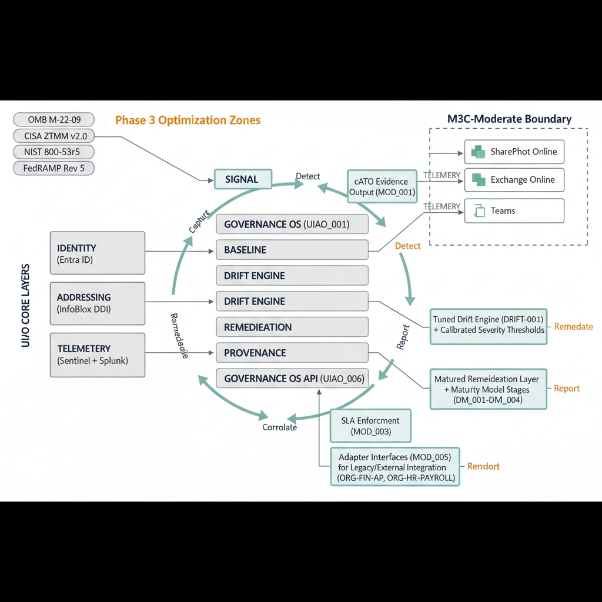
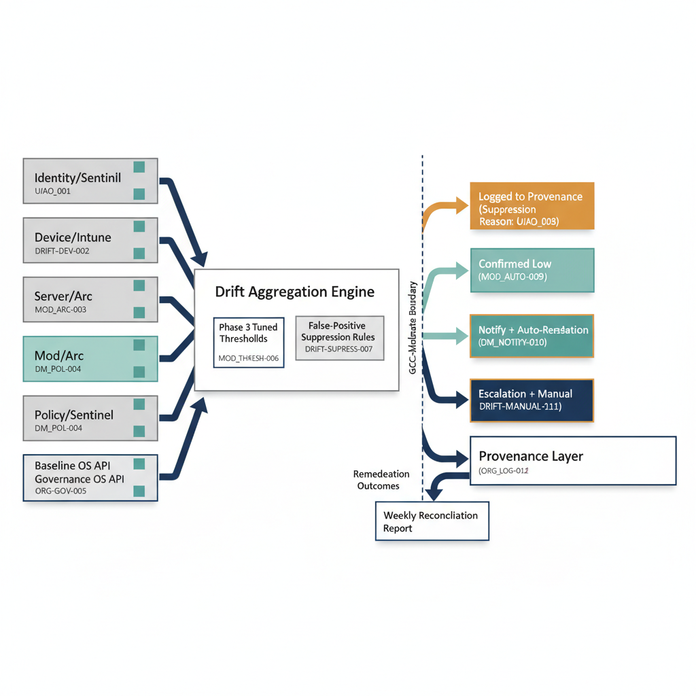
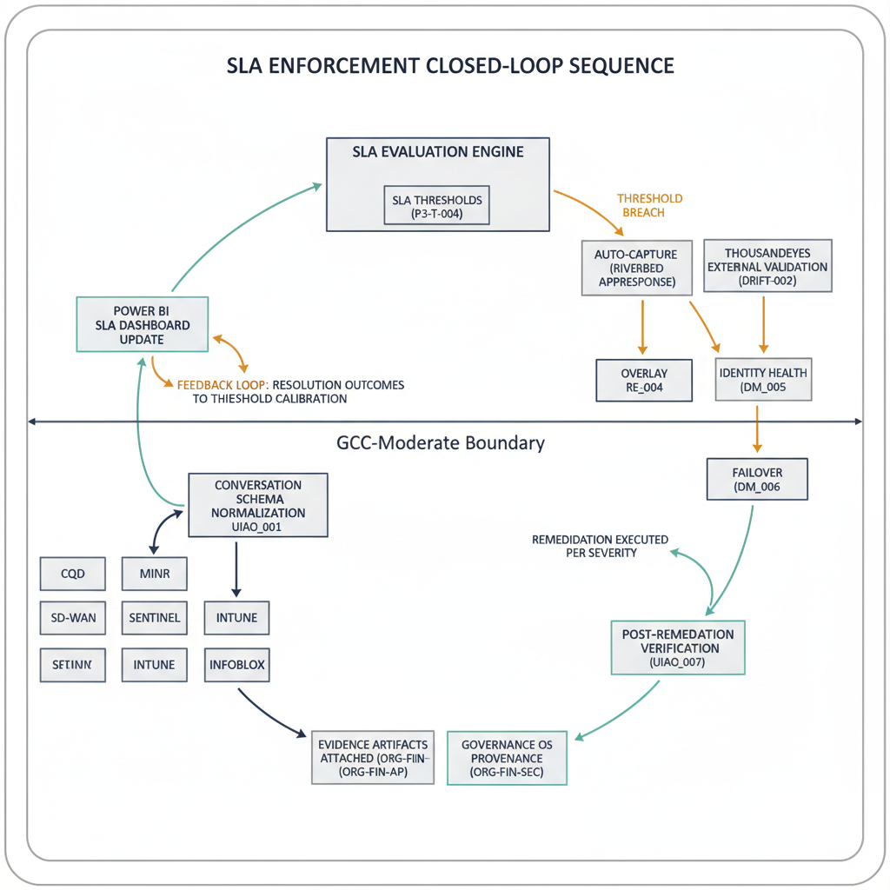
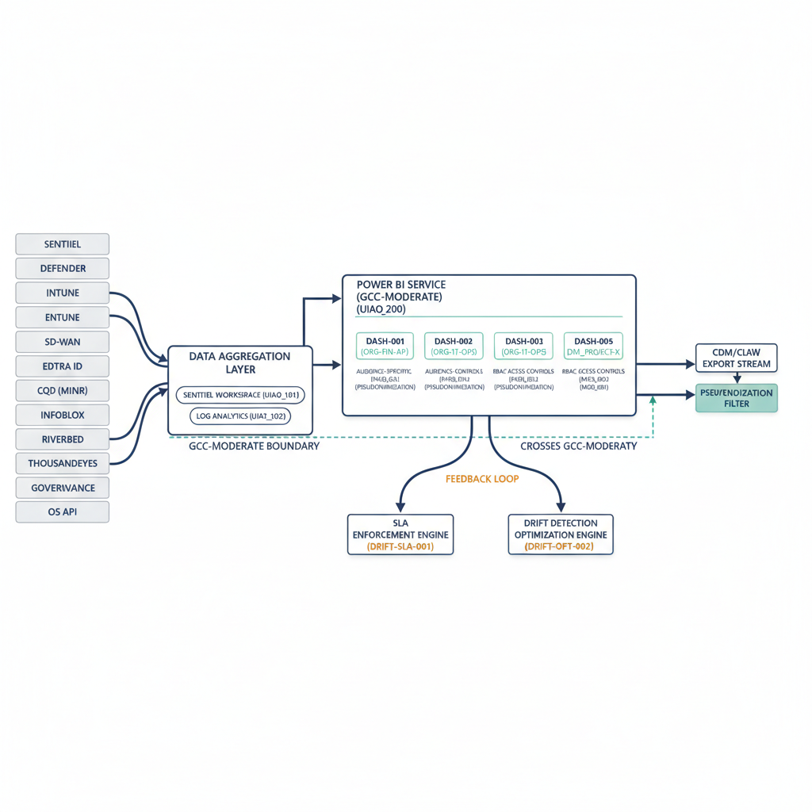

# UIAO Phase 3

**Optimization and Continuous ATO Alignment**

Unified Identity--Addressing--Overlay Modernization Program

+----------------------------------------------------------------------+
| Document ID                                                          |
|                                                                      |
| UIAO_Phase3_Optimization_cATO_v0.1                                   |
|                                                                      |
| Title                                                                |
|                                                                      |
| UIAO Phase 3 --- Optimization and Continuous ATO Alignment           |
|                                                                      |
| Version                                                              |
|                                                                      |
| 0.1                                                                  |
|                                                                      |
| Status                                                               |
|                                                                      |
| DRAFT                                                                |
|                                                                      |

|                                                                      |

|                                                                      |
| Boundary                                                             |
|                                                                      |
| GCC-Moderate (M365 SaaS Only)                                        |
|                                                                      |
| Owner                                                                |
|                                                                      |
| Michael Stratton                                                     |
|                                                                      |
| Created                                                              |
|                                                                      |
| 2026-04-24                                                           |
|                                                                      |
| Program Phase                                                        |
|                                                                      |
| Phase 3 of 5                                                         |
|                                                                      |
| Depends On                                                           |
|                                                                      |
| UIAO Phase 2 --- Governance OS Deployment (Rev 0.x)                  |
|                                                                      |
| Supersedes                                                           |
|                                                                      |
| N/A (Initial Release)                                                |
|                                                                      |
| Distribution                                                         |
|                                                                      |
| UIAO Program Stakeholders, Authorizing Officials, ISSO/ISSM          |
+----------------------------------------------------------------------+

+----------------------------------------------------------------------+
| **No-Hallucination Protocol --- Sourcing Transparency Statement**    |
|                                                                      |
| This document is governed by a strict **No-Hallucination Protocol**. |
| All content is sourced exclusively from the following authoritative  |
| workspace files:                                                     |
|                                                                      |
| > • **UIAO-Main-Spec-v1.md** --- Core Canon and Introduction,        |
| > Version 1.0 (March 2026)                                           |
| >                                                                    |
| > • **UIAO V4U --- Core Canon and Introduction** --- V4U Unified     |
| > (March 2026), supersedes V3                                        |
| >                                                                    |
| > • **UIAO Phase 2 --- Governance OS Deployment (Rev 0.x)** ---      |
| > Phase 2 customer document (.qmd)                                   |
| >                                                                    |
| > • **UIAO Phase 1 --- Modernization Mechanics (Rev 0.x)** --- Phase |
| > 1 customer document (.docx)                                        |
| >                                                                    |
| > • **UIAO Program Overview** --- Program-level overview document    |
| > (.docx)                                                            |
| >                                                                    |
| > • **UIAO Customer Documentation Structure --- Template** ---       |
| > Structural template (.docx)                                        |
|                                                                      |
| **Content markings used throughout this document:**                  |
|                                                                      |
| > • **\[SOURCED\]** --- Content directly derived from or traceable   |
| > to the source files listed above.                                  |
| >                                                                    |
| > • **\[NEW (Proposed)\]** --- Content proposed by the author that   |
| > extends source material but is not explicitly present in source    |
| > files. Requires stakeholder review and approval before promotion   |
| > to canonical status.                                               |
| >                                                                    |
| > • **\[MISSING --- description\]** --- Content that is expected for |
| > this section but is not available in any source file. Must be      |
| > supplied by subject-matter experts before this document exits      |
| > DRAFT status.                                                      |
|                                                                      |
| No content in this document is fabricated, hallucinated, or inferred |
| beyond what the source files support. Where source files describe    |
| Phase 3 activities (e.g., \"Validation and Resilience\"), those      |
| descriptions form the basis of this document. Where Phase 3          |
| activities are logical extensions of Phase 2 deliverables (e.g.,     |
| optimizing drift detection engines delivered in Phase 2), the        |
| extension is marked **\[NEW (Proposed)\]**.                          |
+----------------------------------------------------------------------+

# 1. Executive Summary

**\[SOURCED --- Main Spec §12, V4U §12, Phase 2 §§1--15\]**

Phase 3 of the Unified Identity--Addressing--Overlay (UIAO)
Modernization Program transitions the architecture from **deployment**
to **operational optimization**. Where Phase 1 delivered modernization
mechanics (OrgPath, identity translation, device identity, GPO→Intune
migration, Arc onboarding) and Phase 2 established the Governance OS
(canonical baselines, drift detection engines, remediation workflows,
provenance tracking, SCuBA integration, cross-plane telemetry ingestion,
and continuous ATO alignment), Phase 3 validates, tunes, and hardens
these capabilities for sustained, auditable operation within a
GCC-Moderate M365 SaaS boundary.

The Main Spec defines Phase 3 as **\"Validation and Resilience\"** (days
90--120): testing conversation continuity, failover, attestation, and
enforcement. The V4U specification adds conversation continuity tests
(Teams voice/video, WebRTC, E911 simulations), VMotion and cloud
bursting tests with InfoBlox dynamic addressing, chaos engineering
scenarios (controller failover, IPAM/DNS failover, path degradation),
and NPE-AL2 enforcement validation (orphan detection, quarterly
recertification).

This document extends those source definitions into seven operational
workstreams:

1.  **Continuous ATO (cATO) Framework Alignment** --- Evolving Phase
    2\'s continuous compliance posture into a formal cATO evidence model
    mapped to NIST 800-53r5 control families and CISA ZTMM v2.0 maturity
    stages, replacing point-in-time audits with machine-speed evidence
    collection.

2.  **Drift Detection Optimization** --- Tuning the five drift detection
    engines delivered in Phase 2 (Identity, Device, Server, Policy,
    Baseline) to reduce false positives, calibrate severity thresholds,
    and establish steady-state detection cadences aligned to operational
    risk tolerance.

3.  **Automated Remediation Maturation** --- Advancing Phase 2\'s
    severity-based remediation workflow (Low=auto, Medium=notify+auto,
    High=escalate+manual) into a formalized maturity model with
    measurable progression criteria.

4.  **SLA Enforcement** --- Extending the conversation schema\'s
    telemetry fields (CQD_RTT_ms, PacketLoss_pct, AppResponse_CaptureID)
    into a formal SLA enforcement framework with defined thresholds,
    escalation paths, and Power BI reporting.

5.  **Dashboard Optimization** --- Evolving the Phase 2/V4U Power BI
    Public-Interaction Dashboard into a multi-tier governance
    visualization platform supporting executive, operational, and
    technical audiences.

6.  **Cost Optimization** --- **\[NEW (Proposed)\]** Establishing
    license optimization, telemetry volume management, and resource
    right-sizing practices within the GCC-Moderate boundary.

7.  **Adapter Doctrine** --- **\[NEW (Proposed)\]** Defining canonical
    patterns for integrating legacy systems, external partners, and
    non-standard workloads that cannot natively participate in the UIAO
    identity-forward model.

The design principle governing all Phase 3 activities remains: **\"If it
degrades the citizen interaction, it does not ship.\"** Every
optimization must preserve accessibility, privacy, continuity, and PII
protection for public service delivery.

# 2. Context and Problem Statement

**\[SOURCED --- Main Spec §§1--2, §12; V4U §§1--2, §12; Phase 2 §§1, 12,
15\]**

## 2.1 Why Phase 3 Follows Phase 2

The UIAO architecture addresses a structural diagnosis: **the federal
government is structurally frozen at the Client/Server L2--L4 perimeter
era.** Identity-forward modernization---where identity becomes the root
namespace and primary security perimeter---is the only path forward.
Incremental patching of perimeter architectures cannot meet federal
mandates or the modern threat landscape.

Phase 2 delivered the Governance OS---the operational backbone that
transforms UIAO from a modernization framework into an **operational
governance system**. The Governance OS unified identity governance,
device governance, configuration governance, policy governance, and
evidence governance into a single operational model across Entra ID,
Intune, Azure Arc, Microsoft Defender, Microsoft Sentinel, and SCuBA
baselines. Phase 2 established:

- **Six architectural layers:** Signal Layer, Baseline Layer, Drift
  Engine, Remediation Layer, Provenance Layer, and Governance OS API.

- **Six baseline categories:** Identity, Device, Server, Network,
  Security, and Operational baselines --- defined as UIAO Canon, not
  vendor defaults.

- **Five drift detection engines:** Identity Drift (Sentinel Analytics),
  Device Drift (Intune Compliance), Server Drift (Arc Guest Config),
  Policy Drift (Sentinel Change Logs), and Baseline Drift (Governance OS
  API).

- **Severity-based remediation:** Low (auto-remediate), Medium (notify
  owner + auto-remediate), High (escalate + manual review), all logged
  to provenance.

- **Continuous ATO alignment:** Evidence collection, drift reporting,
  baseline verification, control mapping, and automated documentation
  generation replacing point-in-time audits.

## 2.2 The Phase 3 Problem

Phase 2 delivered capability. Phase 3 must deliver **operational
confidence**. The transition from deployment to steady-state operations
surfaces specific challenges:

8.  **Drift detection noise:** Initial drift engine deployment generates
    false positives as baselines encounter real-world configuration
    variance. Severity thresholds require calibration against
    operational data.

9.  **Remediation maturity gaps:** Phase 2\'s severity-based workflow
    needs formalization into a maturity model with progression criteria,
    exception handling, and continuous improvement loops.

10. **ATO evidence continuity:** Moving from \"continuous compliance
    enabled\" to \"continuous ATO accepted by Authorizing Officials\"
    requires formal evidence packages, control mapping, and audit-ready
    reporting.

11. **Conversation resilience:** The V4U specification mandates
    conversation continuity tests (Teams voice/video, WebRTC, E911),
    VMotion/cloud bursting tests, and chaos engineering scenarios. These
    have not been executed.

12. **NPE enforcement validation:** NPE-AL2 production enforcement
    (orphan detection, quarterly recertification) must be validated
    before Phase 4 scale-out.

13. **SLA enforcement gap:** The conversation schema captures telemetry
    fields (CQD_RTT_ms, PacketLoss_pct) but lacks formal SLA thresholds,
    breach escalation, and reporting.

Phase 3 resolves these challenges within the 90--120 day window defined
by the Main Spec implementation path, establishing the validated,
resilient foundation required for Phase 4 (Scale and Harden, days
120--270) and Phase 5 (Enterprise and Federate, days 270--540).

## 2.3 Governing Federal Mandates

**\[SOURCED --- V4U §§3--4, Appendix C\]**

All Phase 3 activities operate under the convergence of seven federal
mandates:

  -----------------------------------------------------------------------
  **Mandate**         **Phase 3 Relevance**
  ------------------- ---------------------------------------------------
  OMB M-22-09 Federal cATO evidence must demonstrate progress toward zero
  Zero Trust Strategy trust goals across identity, device, network,
                      application, and data pillars

  CISA ZTMM v2.0      Phase 3 targets advancement from Initial to
                      Advanced maturity across five pillars

  NIST SP 800-63-4    NPE-AL2/AL3 enforcement validation; IAL/AAL/FAL
                      compliance for citizen identity flows

  NIST SP 800-207     Continuous verification architecture validated
                      through conversation resilience testing

  EO 14028            MFA enforcement, encrypted connections, logging,
                      endpoint security --- all validated in Phase 3

  TIC 3.0             Cloud, Branch Office, Remote User use cases
                      validated through SLA enforcement and dashboard
                      optimization

  FedRAMP Rev 5 /     cATO alignment maps Governance OS controls to IA,
  NIST 800-53r5       AC, AU, SC, SI, CM, RA, CA control families
  -----------------------------------------------------------------------

# 3. Architecture Overview

**\[SOURCED --- V4U §§7--11; Phase 2 §2\]**

The Phase 3 architecture builds upon the Governance OS layers delivered
in Phase 2 and the seven fundamental concepts defined in the UIAO Core
Canon. At steady state, the architecture operates as a closed-loop
governance system where identity is the root namespace, telemetry is the
control plane, and governance is embedded in every workflow.

The steady-state architecture integrates:

- **Identity Layer:** Entra ID as the authoritative identity graph,
  consuming from HR systems, federating Login.gov/ID.me, accepting
  PIV/CAC certificates, and synchronizing with on-prem AD. NPE-AL2
  enforced for production; NPE-AL3 for high-sensitivity workloads via
  SPIFFE/SPIRE.

- **Addressing Layer:** InfoBlox DDI as Single Source of Truth for IP
  addressing, DNS, and DHCP. Identity-derived addressing with API
  reconciliation to cloud IPAMs.

- **Overlay Layer:** Cisco Catalyst SD-WAN and VMware NSX providing
  certificate-anchored, identity-aware segmentation with
  mTLS-authenticated tunnels.

- **Telemetry Layer:** Conversation-centric schema normalizing signals
  from MINR, SD-WAN, Riverbed AppResponse/NetProfiler, Microsoft
  Graph/CQD, Defender family, ThousandEyes, Splunk/Sentinel, ServiceNow,
  InfoBlox DDI, Intune, and SPIRE.

- **Governance OS:** Signal Layer → Baseline Layer → Drift Engine →
  Remediation Layer → Provenance Layer → Governance OS API --- now
  optimized in Phase 3 for steady-state operational cadence.

- **Closed-Loop Evidence Model:** Detect → Capture → Correlate →
  Remediate → Report --- operating at machine speed with cATO evidence
  output.

### Diagram P3-D-001 --- Phase 3 Steady-State Architecture

+:--------------------------------------------------------------------:+
| **\[PLACEHOLDER --- P3-D-001\]**                                     |
|                                                                      |
| **Type:** PlantUML Component Diagram                                 |
|                                                                      |

{fig-alt="Steady-state architecture showing the six Governance OS layers (Signal, Baseline, Drift Engine, Remediation, Provenance, Governance OS API) integrated with the UIAO core layers (Identity/Entra ID, Addressing/InfoBlox DDI, Overlay/Catalyst S" width="720"}

# 4. Detailed Sections

## 4.1 Continuous ATO (cATO) Framework Alignment

**\[SOURCED --- Phase 2 §12; V4U §§3--4, Appendix C\]**

Phase 2 established that the Governance OS enables **continuous
compliance, not point-in-time audits.** Phase 2\'s continuous ATO
alignment included evidence collection, drift reporting, baseline
verification, control mapping, and automated documentation generation.
Phase 3 formalizes this into a cATO framework that Authorizing Officials
(AOs) can accept as a replacement for traditional periodic ATO cycles.

The cATO framework maps the Governance OS evidence streams to NIST
800-53r5 control families and CISA ZTMM v2.0 maturity stages, producing
machine-generated evidence packages at defined cadences.

### Table P3-T-001 --- cATO Alignment Matrix

  -----------------------------------------------------------------------------------------------------------------
  **ID**     **NIST 800-53r5   **CISA ZTMM    **Governance   **Evidence   **Phase 2 Baseline**     **Phase 3
             Control Family**  Pillar**       OS Evidence    Cadence**                             Optimization**
                                              Source**
  ---------- ----------------- -------------- -------------- ------------ ------------------------ ----------------
  cATO-001   IA                Identity       Entra ID       Continuous   **Identity Baseline:     Automated IA
             (Identification                  sign-in logs,  (real-time   OrgPath, AU structure,   control evidence
             and                              CA policy      ingestion to dynamic groups, CA       packages;
             Authentication)                  evaluations,   Sentinel)    targeting**              AO-ready
                                              MFA                                                  dashboards
                                              enforcement
                                              logs

  cATO-002   AC (Access        Identity /     Conditional    Continuous   **CA policies, identity  Exception
             Control)          Application    Access logs,                governance rules**       tracking; access
                                              RBAC/ABAC                                            review
                                              evaluations,                                         automation at
                                              JML workflow                                         quarterly
                                              provenance                                           cadence

  cATO-003   AU (Audit and     Data           Sentinel       Continuous   **Provenance Layer: who  Retention policy
             Accountability)                  analytics,                  changed what, when, why, validation; OMB
                                              M365 Audit                  what evidence**          M-21-31 EL3
                                              Logs,                                                compliance
                                              Governance OS                                        evidence
                                              API provenance

  cATO-004   CM (Configuration Device /       Intune         Daily drift  **SCuBA → Intune/Arc     Baseline drift
             Management)       Network        compliance     scans;       mapping; canonical       trend analysis;
                                              reports, Arc   real-time    baselines**              configuration
                                              Guest Config   for critical                          change velocity
                                              assessments,   changes                               metrics
                                              SCuBA mapping

  cATO-005   SC (System and    Network        SD-WAN tunnel  Continuous   **Certificate-anchored   Certificate
             Communications                   status, mTLS                overlay; mTLS for all    rotation
             Protection)                      certificate                 service-to-service**     compliance;
                                              validation,                                          tunnel health
                                              overlay path                                         SLA enforcement
                                              telemetry

  cATO-006   SI (System and    Device /       Defender risk  Continuous   **Defender provides      Vulnerability
             Information       Application    signals,                    device/server risk       remediation SLA
             Integrity)                       Intune                      signals, threat          tracking; patch
                                              remediation                 intelligence**           compliance
                                              scripts, Arc                                         dashboards
                                              remediation

  cATO-007   RA (Risk          Cross-pillar   Governance OS  Weekly       **Cross-plane telemetry  Risk posture
             Assessment)                      drift          aggregate;   ingestion; drift         scoring;
                                              aggregation,   continuous   detection across all     trend-based risk
                                              Sentinel       for critical categories**             forecasting
                                              correlation,   risks
                                              risk scoring

  cATO-008   CA (Assessment,   Cross-pillar   cATO evidence  Monthly      **Continuous ATO         AO-facing
             Authorization,                   packages (all  evidence     alignment: evidence      evidence portal;
             and Monitoring)                  sources        packages;    collection, drift        automated SSP
                                              above), AO     continuous   reporting, control       narrative
                                              dashboard,     monitoring   mapping**                generation
                                              provenance
                                              chain
  -----------------------------------------------------------------------------------------------------------------

+----------------------------------------------------------------------+
| **cATO Acceptance Criteria**                                         |
|                                                                      |
| **\[NEW (Proposed)\]** The cATO framework requires AO acceptance of  |
| machine-generated evidence as equivalent to manual assessment. Phase |
| 3 produces a cATO Acceptance Package including: (1) evidence chain   |
| integrity verification, (2) drift detection coverage certification,  |
| (3) remediation SLA compliance report, (4) exception register with   |
| risk acceptance documentation. **\[MISSING --- AO-specific           |
| acceptance criteria and organizational risk tolerance thresholds     |
| must be defined with the authorizing official\]**                    |
+----------------------------------------------------------------------+

## 4.2 Drift Detection Optimization

**\[SOURCED --- Phase 2 §§8, 8.1\]**

Phase 2 deployed five drift detection engines across the Governance OS.
Phase 3 optimizes these engines through threshold calibration, false
positive reduction, detection cadence alignment, and operational
feedback loops.

### Table P3-T-002 --- Drift Detection Optimization Matrix

  -----------------------------------------------------------------------------------------------------
  **ID**    **Drift    **Source   **Phase 2         **Phase 3         **Target False   **Detection
            Type**     System**   Detection         Optimization**    Positive Rate**  Cadence**
                                  Method**
  --------- ---------- ---------- ----------------- ----------------- ---------------- ----------------
  DDO-001   Identity   Entra ID   **Sentinel        **\[NEW           **\[NEW          Real-time
            Drift                 Analytics**       (Proposed)\]**    (Proposed)\]**   (Sentinel
                                                    Baseline Sentinel \<5% within 60   streaming)
                                                    analytics rules   days of tuning
                                                    against 30-day
                                                    operational data;
                                                    tune severity
                                                    thresholds; add
                                                    OrgPath-aware
                                                    drift context

  DDO-002   Device     Intune     **Compliance +    **\[NEW           **\[NEW          Every compliance
            Drift                 Remediation**     (Proposed)\]**    (Proposed)\]**   evaluation cycle
                                                    Correlate Intune  \<3% within 60   (Intune default:
                                                    compliance        days             8 hours)
                                                    failures with
                                                    Defender device
                                                    risk; suppress
                                                    transient
                                                    compliance gaps
                                                    during patch
                                                    windows

  DDO-003   Server     Azure Arc  **Guest           **\[NEW           **\[NEW          Arc Guest Config
            Drift                 Configuration**   (Proposed)\]**    (Proposed)\]**   evaluation
                                                    Align Arc Guest   \<5% within 60   interval
                                                    Config policies   days             (default: 15
                                                    with SCuBA                         minutes)
                                                    baselines; add
                                                    maintenance
                                                    window
                                                    exclusions;
                                                    correlate with
                                                    change provenance

  DDO-004   Policy     CA,        **Sentinel Change **\[NEW           **\[NEW          Real-time
            Drift      Intune,    Logs**            (Proposed)\]**    (Proposed)\]**   (Sentinel
                       Arc                          Implement         0% (all policy   streaming)
                                                    policy-change     changes must
                                                    provenance        have provenance)
                                                    matching --- all
                                                    detected changes
                                                    validated against
                                                    ServiceNow change
                                                    tickets;
                                                    unmatched changes
                                                    escalated
                                                    immediately

  DDO-005   Baseline   All        **Governance OS   **\[NEW           **\[NEW          Continuous
            Drift      systems    API**             (Proposed)\]**    (Proposed)\]**   aggregation;
                                                    Aggregate         N/A (composite   weekly
                                                    cross-engine      metric)          reconciliation
                                                    drift into
                                                    composite
                                                    baseline health
                                                    score; establish
                                                    trending and
                                                    forecasting;
                                                    weekly baseline
                                                    reconciliation
                                                    reports
  -----------------------------------------------------------------------------------------------------

### Diagram P3-D-002 --- Optimized Drift Detection Flow

+:--------------------------------------------------------------------:+
| **\[PLACEHOLDER --- P3-D-002\]**                                     |
|                                                                      |
| **Type:** PlantUML Activity Diagram                                  |
|                                                                      |

{fig-alt="Optimized drift detection flow showing five drift engines (Identity/Sentinel, Device/Intune, Server/Arc, Policy/Sentinel, Baseline/Governance OS API) feeding into a Drift Aggregation Engine." width="720"}

## 4.3 Automated Remediation Maturation

**\[SOURCED --- Phase 2 §§9, 9.1\]**

Phase 2 established a severity-based remediation workflow: Low severity
triggers auto-remediation, Medium triggers notification plus
auto-remediation, and High triggers escalation with manual review. All
actions are logged to provenance. Phase 3 formalizes this into a
**Remediation Maturity Model** with defined stages, progression
criteria, and measurable outcomes.

### Table P3-T-003 --- Remediation Maturity Model

  -----------------------------------------------------------------------------------------------------------
  **Maturity     **Stage   **Description**        **Automation        **Provenance        **Progression
  Stage**        ID**                             Level**             Requirements**      Criteria**
  -------------- --------- ---------------------- ------------------- ------------------- -------------------
  **Stage 1:     RMM-S1    **Manual remediation   0% --- all manual   ServiceNow ticket,  All High-severity
  Reactive**               with ticket-based                          manual evidence     drift events have
                           tracking.** Phase 2                        attachment          documented
                           deployment baseline                                            remediation
                           for High-severity                                              procedures
                           items.

  **Stage 2:     RMM-S2    **Severity-based       \~40% --- Low       Automated           \>90% of
  Defined**                routing operational.** severity automated  provenance logging  Low-severity drift
                           Low=auto,                                  for                 auto-remediated
                           Medium=notify+auto,                        auto-remediation;   within SLA; false
                           High=escalate+manual                       manual for          remediation rate
                           per Phase 2 design.                        escalations         \<2%

  **Stage 3:     RMM-S3    **\[NEW (Proposed)\]** \~65% --- Low and   Full provenance     \>95% of Low and
  Managed**                Medium-severity        most Medium         chain: detection →  Medium remediated
                           automation expanded    automated           decision → action → within SLA;
                           with approval                              verification →      remediation
                           workflows. Remediation                     closure             verification
                           SLAs tracked.                                                  automated
                           Exception management
                           formalized.

  **Stage 4:     RMM-S4    **\[NEW (Proposed)\]** \~80% --- only      Closed-loop:        \>98% within SLA;
  Optimized**              Predictive remediation novel High-severity remediation         mean time to
                           --- drift patterns     requires fully      outcomes feed drift remediate \<15
                           forecast and           manual response     detection tuning    minutes for
                           pre-remediated.                            and baseline        Low/Medium;
                           High-severity                              updates             predictive model
                           playbooks                                                      accuracy \>85%
                           semi-automated.
                           Continuous improvement
                           from remediation
                           outcomes.

  **Stage 5:     RMM-S5    **\[NEW (Proposed)\]** \~95% ---           Immutable audit     **\[MISSING ---
  Autonomous**             Full closed-loop       human-in-the-loop   trail; AO-facing    Stage 5 criteria
                           governance.            only for policy     evidence stream;    require AO and CISO
                           Self-healing           exceptions          continuous cATO     validation for
                           infrastructure. Human                      evidence            autonomous
                           oversight for                                                  remediation
                           exception and policy                                           authorization\]**
                           decisions only.
  -----------------------------------------------------------------------------------------------------------

+----------------------------------------------------------------------+
| **Phase 3 Target**                                                   |
|                                                                      |
| Phase 3 targets progression from **Stage 2 (Defined)** --- the Phase |
| 2 delivery state --- to **Stage 3 (Managed)** by the end of the      |
| Phase 3 window (day 120). Stage 4 (Optimized) is a Phase 4           |
| objective. Stage 5 (Autonomous) is a Phase 5 aspiration requiring AO |
| authorization.                                                       |
+----------------------------------------------------------------------+

## 4.4 SLA Enforcement

**\[SOURCED --- V4U §11, Conversation Schema\]**

The V4U specification defines the conversation schema with mandatory
telemetry fields including CQD_RTT_ms, PacketLoss_pct, and
AppResponse_CaptureID. The closed-loop evidence model (Detect → Capture
→ Correlate → Remediate → Report) provides the mechanism for SLA
enforcement. Phase 3 formalizes these telemetry signals into an SLA
enforcement framework.

### Table P3-T-004 --- SLA Enforcement Framework

  ----------------------------------------------------------------------------------------------------------------------------
  **SLA     **Service        **Telemetry Source**           **Metric**       **Threshold**     **Breach         **Evidence
  ID**      Category**                                                                         Escalation**     Artifact**
  --------- ---------------- ------------------------------ ---------------- ----------------- ---------------- --------------
  SLA-001   Voice/Video      **CQD_RTT_ms, PacketLoss_pct** Round-trip time; **\[NEW           **\[NEW          AppResponse
            Quality (Teams)                                 Packet loss      (Proposed)\]**    (Proposed)\]**   packet
                                                                             RTT \<150ms; Loss Auto-capture →   capture, CQD
                                                                             \<1%              ServiceNow P2 →  session report
                                                                                               overlay re-path

  SLA-002   M365 Front-Door  **MINRFrontDoorID, SD-WAN      MINR front-door  **\[NEW           **\[NEW          MINR logs,
            Performance      telemetry**                    selection        (Proposed)\]**    (Proposed)\]**   ThousandEyes
                                                            accuracy;        Front-door        ThousandEyes     path trace
                                                            latency          latency \<50ms    validation →
                                                                             from nearest POP  path
                                                                                               optimization

  SLA-003   Overlay Tunnel   **OverlayPathID, SD-WAN        Tunnel           **\[NEW           **\[NEW          SD-WAN
            Health           Controller**                   availability;    (Proposed)\]**    (Proposed)\]**   controller
                                                            failover time    Availability      Auto-failover →  logs, overlay
                                                                             \>99.9%; failover ServiceNow       path history
                                                                             \<30s             incident →
                                                                                               post-event
                                                                                               review

  SLA-004   Identity         **Entra ID sign-in logs, CA    Authentication   **\[NEW           **\[NEW          Entra ID
            Authentication   evaluations**                  latency; CA      (Proposed)\]**    (Proposed)\]**   sign-in logs,
                                                            evaluation time  Auth \<2s; CA     Sentinel alert → Sentinel
                                                                             eval \<500ms      identity         analytics
                                                                                               platform health
                                                                                               check

  SLA-005   Drift Detection  **Governance OS API,           Time from drift  **\[NEW           **\[NEW          Governance OS
            Response         Sentinel**                     detection to     (Proposed)\]**    (Proposed)\]**   provenance,
                                                            remediation      Low: \<15min;     SLA breach →     ServiceNow
                                                            initiation       Medium: \<1hr;    escalation per   workflow
                                                                             High: \<4hr       Remediation
                                                                                               Maturity Model

  SLA-006   E911 Location    **E911_DispatchableLocation,   Dispatchable     **\[NEW           **\[NEW          InfoBlox IPAM,
            Accuracy         InfoBlox subnet mapping**      location         (Proposed)\]**    (Proposed)\]**   PACS
                                                            accuracy; update Location accurate Immediate        correlation,
                                                            latency          to                escalation ---   E911 test
                                                                             building/floor;   public safety    results
                                                                             update within     requirement
                                                                             5min of VMotion

  SLA-007   cATO Evidence    **Provenance Layer, Governance Evidence package **\[NEW           **\[NEW          cATO evidence
            Generation       OS API**                       completeness;    (Proposed)\]**    (Proposed)\]**   packages,
                                                            generation       Monthly packages  Missing evidence control
                                                            timeliness       within 48hr of    → ISSO           mapping
                                                                             period close;     notification →   reports
                                                                             \>95% control     AO risk
                                                                             coverage          acceptance
                                                                                               required
  ----------------------------------------------------------------------------------------------------------------------------

### Diagram P3-D-003 --- SLA Enforcement Loop

+:--------------------------------------------------------------------:+
| **\[PLACEHOLDER --- P3-D-003\]**                                     |
|                                                                      |
| **Type:** PlantUML Sequence Diagram                                  |
|                                                                      |

{fig-alt="SLA enforcement closed-loop sequence: (1) Telemetry sources (CQD, MINR, SD-WAN, Sentinel, Intune, InfoBlox) emit metrics to Conversation Schema normalization." width="720"}

## 4.5 Dashboard Optimization

**\[SOURCED --- V4U §11 (Closed-Loop Evidence Model, Step 5); Phase 2
§§2.1, 12\]**

The V4U specification established the **Power BI Public-Interaction
Dashboard** as Step 5 of the closed-loop evidence model: \"Power BI
Public-Interaction Dashboard shows SLA impact. CDM/CLAW streams prepared
for CISA. Post-incident review recorded.\" Phase 2 added Governance OS
dashboards via Sentinel. Phase 3 optimizes these into a multi-tier
dashboard platform.

### Table P3-T-005 --- Dashboard Optimization Matrix

  ---------------------------------------------------------------------------------------------------
  **Dashboard   **Audience**   **Data          **Key Metrics**  **Refresh        **Phase 3
  ID**                         Sources**                        Cadence**        Optimization**
  ------------- -------------- --------------- ---------------- ---------------- --------------------
  DASH-001      Authorizing    **Governance OS Overall          **\[NEW          **\[NEW
                Official (AO)  API, cATO       compliance       (Proposed)\]**   (Proposed)\]**
                / Executive    evidence        posture; ZTMM    Daily refresh    AO-facing
                               packages**      maturity stage                    single-pane view
                                               per pillar; open                  with traffic-light
                                               risk                              compliance
                                               acceptances;                      indicators;
                                               cATO evidence                     drill-down to
                                               completeness                      control family
                                                                                 evidence

  DASH-002      ISSO / ISSM    **Sentinel      Active drift     Near real-time   **\[NEW
                               analytics,      events by        (Sentinel        (Proposed)\]** Drift
                               Drift Engine    type/severity;   streaming)       trend analysis;
                               outputs,        remediation SLA                   remediation velocity
                               Provenance      compliance;                       tracking; automated
                               Layer**         provenance chain                  ISSO briefing
                                               integrity;                        generation
                                               exception
                                               register

  DASH-003      Operations /   **SD-WAN        SLA compliance   Near real-time   **\[NEW
                NOC            Controller,     per category                      (Proposed)\]** SLA
                               CQD, MINR,      (P3-T-004);                       breach alerting with
                               ThousandEyes,   conversation                      auto-escalation;
                               Riverbed**      quality; overlay                  historical trend
                                               health; path                      overlays; capacity
                                               performance                       forecasting

  DASH-004      Public Service **CQD (Teams    Citizen          **\[NEW          **\[NEW
                Delivery       voice/video),   interaction      (Proposed)\]**   (Proposed)\]**
                               E911 location,  quality; call    Real-time for    Citizen experience
                               Graph API**     center           call center;     scoring; E911
                                               performance;     hourly for       location accuracy
                                               E911 accuracy;   aggregate        validation; ADA
                                               accessibility                     compliance tracking
                                               compliance

  DASH-005      CISA CDM/CLAW  **Sentinel,     CDM asset        **\[NEW          **\[NEW
                Reporting      Defender,       visibility;      (Proposed)\]**   (Proposed)\]**
                               Intune, Entra   vulnerability    Per CISA         Automated CDM/CLAW
                               ID --- prepared posture;         reporting        data preparation;
                               for CDM/CLAW    identity         cadence          privacy controls
                               streams**       hygiene;                          (pseudonymization)
                                               incident                          applied before
                                               response metrics                  export
  ---------------------------------------------------------------------------------------------------

### Diagram P3-D-004 --- Dashboard Architecture

+:--------------------------------------------------------------------:+
| **\[PLACEHOLDER --- P3-D-004\]**                                     |
|                                                                      |
| **Type:** PlantUML Component Diagram                                 |
|                                                                      |

{fig-alt="Multi-tier dashboard architecture showing data flow from source systems (Sentinel, Defender, Intune, Entra ID, SD-WAN, CQD, MINR, InfoBlox, Riverbed, ThousandEyes, ServiceNow, Governance OS API) through a Data Aggregation Layer (Sentinel wo" width="720"}

## 4.6 Cost Optimization

**\[NEW (Proposed) --- This section is proposed content. Cost
optimization is not explicitly addressed in the source files. It is a
logical operational concern for Phase 3 steady-state operations within
the GCC-Moderate M365 SaaS boundary.\]**

As the UIAO architecture moves from deployment to steady-state
operations, cost optimization ensures that the GCC-Moderate M365 SaaS
investment delivers maximum governance value per dollar. Cost
optimization operates within three domains: license utilization,
telemetry volume management, and compute/storage right-sizing.

### Table P3-T-006 --- Cost Optimization Framework

  ---------------------------------------------------------------------------------------------------------
  **Cost Domain**     **Domain   **Current State  **Phase 3               **Expected       **Measurement
                      ID**       (Phase 2 Exit)** Optimization**          Outcome**        Method**
  ------------------- ---------- ---------------- ----------------------- ---------------- ----------------
  **License           COST-001   **\[NEW          **\[NEW (Proposed)\]**  License cost     **\[NEW
  Utilization**                  (Proposed)\]**   License utilization     reduction        (Proposed)\]**
                                 M365 E5/G5       audit: identify unused  without          Microsoft 365
                                 licenses         Defender, Intune, and   capability loss  Usage Reports,
                                 assigned per     Purview features per                     Entra ID license
                                 user with full   user segment.                            assignment
                                 suite enablement Right-size licenses                      reports
                                                  where E3/G3 + add-ons
                                                  is more cost-effective.

  **Telemetry         COST-002   **\[NEW          **\[NEW (Proposed)\]**  Sentinel cost    **\[NEW
  Volume**                       (Proposed)\]**   Telemetry tiering:      optimization     (Proposed)\]**
                                 Sentinel         classify data tables by without evidence Sentinel Usage
                                 ingestion at     governance value; move  gaps             workbook, Log
                                 full volume from low-value logs to Basic                  Analytics data
                                 all sources;     tier; optimize                           volume reports
                                 retention at     retention to match
                                 default          compliance requirements
                                                  (AU control family)

  **Compute/Storage   COST-003   **\[NEW          **\[NEW (Proposed)\]**  Reduced          **\[NEW
  Right-Sizing**                 (Proposed)\]**   Assess Arc-managed      infrastructure   (Proposed)\]**
                                 Arc-managed      server utilization;     cost             Azure Monitor,
                                 servers          identify right-sizing                    Arc resource
                                 provisioned for  opportunities;                           utilization
                                 peak capacity    implement autoscale                      metrics
                                                  where supported within
                                                  GCC-Moderate

  **ServiceNow        COST-004   **\[NEW          **\[NEW (Proposed)\]**  Reduced          **\[NEW
  Workflow                       (Proposed)\]**   Retire manual workflow  operational      (Proposed)\]**
  Efficiency**                   Manual and       paths that have been    overhead; faster ServiceNow
                                 automated        superseded by           resolution       workflow
                                 workflows        automation; consolidate                  analytics, mean
                                 operating in     redundant ServiceNow                     time to
                                 parallel         catalog items                            resolution

  **Redundant Tooling COST-005   **\[NEW          **\[NEW (Proposed)\]**  Eliminated       **\[NEW
  Rationalization**              (Proposed)\]**   Identify legacy         redundant        (Proposed)\]**
                                 Legacy           monitoring/management   licensing and    Tool inventory
                                 monitoring tools tools that are fully    operational cost audit,
                                 may remain       replaced by UIAO                         capability gap
                                 active alongside telemetry and                            analysis
                                 UIAO telemetry   governance
                                 stack            capabilities; plan
                                                  decommission
  ---------------------------------------------------------------------------------------------------------

+----------------------------------------------------------------------+
| **Cost Optimization Constraint**                                     |
|                                                                      |
| All cost optimization activities must comply with the design         |
| principle: **\"If it degrades the citizen interaction, it does not   |
| ship.\"** No telemetry reduction, license change, or resource        |
| right-sizing may reduce governance coverage, citizen service         |
| quality, or cATO evidence integrity.                                 |
+----------------------------------------------------------------------+

## 4.7 Adapter Doctrine

**\[NEW (Proposed) --- The Adapter Doctrine is proposed content. The
source files describe the architectural requirement for legacy workload
integration (Main Spec §2: \"Cannot rip-and-replace. Must wrap and
bridge.\" Canon Point 15: \"Legacy workload and application freeze\")
and reference NSX for legacy workload wrapping (V4U §10: \"Legacy apps
wrapped in NSX\"), but do not define a formal adapter pattern
doctrine.\]**

The UIAO architecture is identity-forward by design. However, not all
systems within the federal environment can natively participate in the
identity-forward model. Legacy applications, partner systems, OT/IoT
devices, and external data feeds require structured integration patterns
--- **adapters** --- that bridge these systems into the UIAO governance
model without compromising the architecture\'s integrity.

The Adapter Doctrine defines canonical patterns for these integrations,
ensuring that every adapter:

- Has a registered identity in Entra ID (NPE-AL2 minimum per source
  spec)

- Produces conversation-compatible telemetry into the Governance OS

- Is subject to drift detection and remediation

- Has provenance tracking and an identified human sponsor

### Table P3-T-007 --- Adapter Doctrine Pattern Reference

  ----------------------------------------------------------------------------------------------------------------------------
  **Adapter         **Pattern   **Source Context** **Use Case**       **Identity       **Telemetry        **Governance
  Pattern**         ID**                                              Integration**    Method**           Controls**
  ----------------- ----------- ------------------ ------------------ ---------------- ------------------ --------------------
  **NSX Wrap**      ADP-001     **V4U §10:         On-prem legacy     NSX microsegment NSX flow logs      Drift detection via
                                \"Legacy apps      applications that  with             ingested to        Arc Guest Config on
                                wrapped in NSX.    cannot support     identity-aware   Sentinel; proxy    host; access policy
                                VRF namespaces for mTLS or modern     policies; proxy  authentication     managed via NSX
                                legacy workload    authentication     authentication   logs to identity   distributed firewall
                                wrapping.\"**                         via Entra ID     telemetry          rules
                                                                      Application
                                                                      Proxy or
                                                                      equivalent

  **API Gateway     ADP-002     **V4U §7:          External partner   Service          API gateway logs   Certificate-based
  Adapter**                     \"Governance and   APIs, third-party  principal in     normalized to      authentication; rate
                                Automation         SaaS integrations  Entra ID         conversation       limiting; data
                                Embedded ---       requiring data     (NPE-AL2);       schema;            classification
                                ServiceNow         exchange           managed identity request/response   enforcement at
                                orchestrates                          where supported  telemetry          gateway
                                identity
                                lifecycle, IPAM
                                requests,
                                certificate
                                issuance\"**

  **Protocol        ADP-003     **Main Spec Canon  Legacy protocols   Translation      Translation events No credential
  Translation                   Point 15: \"Cannot (LDAP, RADIUS,     service          logged to          caching;
  Adapter**                     rip-and-replace.   Kerberos-only)     registered as    Sentinel; latency  session-scoped
                                Must wrap and      that must interact NPE-AL2; maps    and failure        tokens; provenance
                                bridge.\"**        with               legacy           metrics to         logging of all
                                                   identity-forward   credentials to   conversation       translations
                                                   services           Entra ID tokens  schema

  **OT/IoT Bridge** ADP-004     **V4U §9: NPE      OT devices, IoT    Bridge device    Bridge aggregates  Network
                                Assurance Model    sensors, SCADA     registered as    device telemetry   microsegmentation
                                defines NPE-AL1    systems that       NPE-AL2;         and normalizes to  via NSX; bridge
                                (not permitted in  cannot run modern  individual       conversation       subject to drift
                                production),       identity agents    OT/IoT devices   schema             detection; device
                                NPE-AL2 (required                     cataloged in                        inventory
                                minimum), NPE-AL3                     ServiceNow CMDB                     reconciliation with
                                (hardware                             with bridge                         CMDB
                                attestation)**                        association

  **State/Federal   ADP-005     **V4U §8 / Main    Cross-agency data  Federation trust Pseudonymized      Legal instrument
  Partner                       Spec §7: Source of sharing, federated per FPKI/FICAM;  telemetry sharing  (ISA, MOU, IAA)
  Federation                    Authority domains  identity trust,    partner identity per ISA/MOU;       governs data scope;
  Adapter**                     10--11 define      shared telemetry   assertions       federated Sentinel privacy controls
                                state/federal                         mapped to Entra  workspace or       (pseudonymization)
                                partner authority                     ID guest         CDM/CLAW stream    enforced before
                                patterns**                            accounts or B2B                     telemetry export

  **Data Ingestion  ADP-006     **V4U §11:         Non-standard       Ingestion        Custom Sentinel    Data quality
  Adapter**                     Telemetry sources  telemetry sources  service          data connector;    monitoring;
                                include MINR,      not natively       registered as    data normalized to ingestion SLA per
                                SD-WAN, Riverbed,  supported by       NPE-AL2; data    conversation       P3-T-004; schema
                                CQD, Defender,     Sentinel           source cataloged schema at          compliance
                                ThousandEyes,      connectors         in Governance OS ingestion          validation
                                Splunk/Sentinel,
                                ServiceNow,
                                InfoBlox, Intune,
                                SPIRE**
  ----------------------------------------------------------------------------------------------------------------------------

+----------------------------------------------------------------------+
| **Adapter Governance Rule**                                          |
|                                                                      |
| **\[NEW (Proposed)\]** Every adapter deployed in the UIAO            |
| architecture must have: (1) A registered identity in Entra ID at     |
| NPE-AL2 or above, (2) A human sponsor responsible for quarterly      |
| recertification, (3) Conversation-compatible telemetry output, (4)   |
| An entry in the Governance OS adapter registry, and (5) Documented   |
| exception if the adapter cannot meet any UIAO Canon requirement.     |
| Adapters without sponsors or with expired recertification are        |
| subject to automatic isolation via NSX microsegmentation.            |
+----------------------------------------------------------------------+

# 5. Implementation Guidance

**\[SOURCED --- Main Spec §12: Phase 3 = 90--120 days; V4U §12: Phase 3
validation activities\]**

Phase 3 executes within the 90--120 day window defined by the Main Spec
implementation path. The timeline below organizes the seven workstreams
into a phased execution sequence with dependencies and milestones.

### Table P3-T-008 --- Phase 3 Implementation Timeline

  ---------------------------------------------------------------------------------------------------
  **Week**   **Days**   **Workstream**   **Activities**          **Dependencies**   **Milestone /
                                                                                    Deliverable**
  ---------- ---------- ---------------- ----------------------- ------------------ -----------------
  **Week     90--104    Drift Detection  Collect 14-day          Phase 2 drift      Drift Baseline
  1--2**                Optimization     operational drift data  engines            Analysis Report
                        (4.2)            from Phase 2 engines;   operational
                                         analyze false positive
                                         rates; document initial
                                         threshold
                                         recommendations

  **Week     90--104    cATO Framework   Map Governance OS       Phase 2 Provenance cATO Control
  1--2**                (4.1)            evidence streams to     Layer operational  Mapping (Draft)
                                         NIST 800-53r5 controls
                                         (P3-T-001); identify
                                         evidence gaps; draft
                                         cATO Acceptance Package
                                         structure

  **Week     104--111   Drift Detection  Apply tuned thresholds; Drift Baseline     Tuned Drift
  2--3**                Optimization     implement               Analysis Report    Engine
                        (4.2)            false-positive                             Configuration
                                         suppression rules;
                                         validate against
                                         operational data

  **Week     104--111   SLA Enforcement  Define SLA thresholds   Conversation       SLA Enforcement
  2--3**                (4.4)            (P3-T-004); configure   schema telemetry   Framework
                                         SLA monitoring in       flowing            (Operational)
                                         Sentinel; integrate
                                         with ServiceNow
                                         escalation workflows

  **Week     104--111   Dashboard        Deploy DASH-001         Sentinel workspace Executive and
  2--3**                Optimization     (AO/Executive) and      data; Governance   ISSO Dashboards
                        (4.5)            DASH-002 (ISSO/ISSM);   OS API             (v1)
                                         configure RBAC access;
                                         validate data accuracy

  **Week     111--118   Remediation      Formalize Stage 2→Stage Tuned Drift        Remediation
  3--4**                Maturation (4.3) 3 progression; expand   Engine; SLA        Maturity
                                         Medium-severity         Framework          Assessment (Stage
                                         automation; implement                      3 Readiness)
                                         remediation
                                         verification; establish
                                         exception management

  **Week     111--118   Dashboard        Deploy DASH-003         SLA Framework;     Operations and
  3--4**                Optimization     (Operations/NOC) and    CQD/MINR data      Public Service
                        (4.5)            DASH-004 (Public                           Dashboards (v1)
                                         Service); configure SLA
                                         breach alerting;
                                         validate citizen
                                         experience metrics

  **Week     111--118   Conversation     **V4U Phase 3           SLA Framework;     Conversation
  3--4**                Resilience       activities:** Teams     tuned drift        Resilience Test
                        Testing          voice/video continuity  engines            Report
                                         tests; WebRTC tests;
                                         E911 simulations;
                                         VMotion/cloud bursting
                                         tests; chaos
                                         engineering (controller
                                         failover, IPAM/DNS
                                         failover, path
                                         degradation)

  **Week     111--118   NPE Enforcement  **V4U Phase 3           Entra ID NPE       NPE Enforcement
  3--4**                Validation       activities:** NPE-AL2   registry;          Validation Report
                                         enforcement validation; ServiceNow
                                         orphan detection        workflows
                                         testing; quarterly
                                         recertification
                                         workflow verification

  **Week 4** 118--120   Cost             **\[NEW (Proposed)\]**  All dashboards     Cost Optimization
                        Optimization     License utilization     operational;       Recommendations
                        (4.6)            audit; Sentinel         telemetry volumes  Report
                                         ingestion analysis;     stabilized
                                         redundant tooling
                                         assessment;
                                         optimization
                                         recommendations

  **Week 4** 118--120   Adapter Doctrine **\[NEW (Proposed)\]**  Governance OS API; Adapter Registry
                        (4.7)            Catalog existing legacy Entra ID NPE       (v1); Doctrine
                                         integrations; classify  registry           Document
                                         by adapter pattern
                                         (P3-T-007); register
                                         all adapters in
                                         Governance OS; identify
                                         gaps

  **Week 4** 118--120   cATO Framework   Generate first cATO     All workstreams    cATO Evidence
                        (4.1)            evidence package;       complete           Package (v1); AO
                                         present to AO; document                    Briefing
                                         acceptance criteria;
                                         prepare CDM/CLAW
                                         reporting stream
                                         (DASH-005)

  **Week 4** Day 120    Phase 3 Gate     Phase 3 completion      All Phase 3        **Phase 3 Gate
                        Review           assessment; Phase 4     deliverables       Review --- Phase
                                         readiness                                  4 Authorization
                                         determination; lessons                     Decision**
                                         learned; risk register
                                         update
  ---------------------------------------------------------------------------------------------------

# 6. Risks and Mitigations

**\[SOURCED --- risk themes from V4U §3, §11, §12; Phase 2 §§8--9,
12\]** **\[NEW (Proposed) --- specific risk register entries and
mitigations are proposed based on source-identified risk themes\]**

### Table P3-T-009 --- Phase 3 Risk Register

  ---------------------------------------------------------------------------------------------------------------
  **Risk     **Risk              **Likelihood**   **Impact**   **Risk     **Mitigation      **Owner**
  ID**       Description**                                     Rating**   Strategy**
  ---------- ------------------- ---------------- ------------ ---------- ----------------- ---------------------
  P3-R-001   **Drift detection   Medium           High         High       Phased tuning     **\[MISSING --- drift
             false positive                                               with 14-day       detection operations
             overload.** Tuning                                           baseline;         lead\]**
             produces                                                     iterative
             insufficient noise                                           threshold
             reduction, leading                                           adjustment;
             to alert fatigue                                             dedicated drift
             and missed true                                              tuning sprint in
             positives.                                                   Week 2; operator
                                                                          feedback loop

  P3-R-002   **AO cATO           Medium           Critical     Critical   Early AO          ISSO / ISSM
             rejection.**                                                 engagement (Week
             Authorizing                                                  1); incremental
             Official does not                                            evidence
             accept                                                       demonstrations;
             machine-generated                                            parallel
             evidence as                                                  traditional
             sufficient for                                               assessment as
             continuous                                                   fallback;
             authorization.                                               document risk
                                                                          acceptance
                                                                          criteria
                                                                          collaboratively

  P3-R-003   **Conversation      Medium           High         High       Pre-test          **\[MISSING ---
             resilience test                                              validation of     overlay/network
             failures.** Teams                                            overlay path      operations lead\]**
             voice/video,                                                 diversity; backup
             WebRTC, or E911                                              path
             tests reveal                                                 verification;
             continuity gaps                                              SD-WAN failover
             under failover                                               configuration
             conditions.                                                  review; dedicated
                                                                          remediation
                                                                          window before
                                                                          Phase 3 gate

  P3-R-004   **NPE-AL2           Medium           Critical     Critical   NPE inventory     **\[MISSING ---
             enforcement breaks                                           reconciliation    identity operations
             production                                                   before            lead\]**
             services.** Orphan                                           enforcement;
             detection or                                                 staged
             recertification                                              enforcement
             enforcement                                                  (monitor-only →
             disables critical                                            warn → enforce);
             service accounts.                                            rollback
                                                                          capability;
                                                                          critical NPE
                                                                          whitelist with
                                                                          expedited
                                                                          recertification

  P3-R-005   **SLA threshold     High             Medium       High       30-day SLA        **\[MISSING --- SLA
             misalignment.**                                              monitoring in     governance lead\]**
             Proposed SLA                                                 observe-only mode
             thresholds                                                   before
             (P3-T-004) are too                                           enforcement;
             aggressive or too                                            threshold
             lenient for the                                              calibration
             operational                                                  against baseline
             environment.                                                 telemetry;
                                                                          stakeholder
                                                                          review of
                                                                          proposed
                                                                          thresholds

  P3-R-006   **Sentinel          Medium           Medium       Medium     Sentinel cost     **\[MISSING ---
             ingestion cost                                               monitoring        platform operations /
             overrun.** Phase 3                                           dashboard;        finance lead\]**
             telemetry                                                    ingestion budget
             optimization                                                 alerts; data
             increases                                                    tiering
             short-term                                                   implementation
             ingestion during                                             early in Phase 3;
             baseline                                                     Basic tier for
             collection,                                                  low-value logs
             exceeding budget.

  P3-R-007   **Dashboard data    Medium           Medium       Medium     Data validation   **\[MISSING ---
             quality issues.**                                            layer between     dashboard/analytics
             Power BI dashboards                                          sources and       lead\]**
             display inaccurate                                           dashboards;
             or stale data,                                               automated data
             eroding stakeholder                                          freshness checks;
             confidence.                                                  dashboard
                                                                          accuracy testing
                                                                          as part of
                                                                          deployment

  P3-R-008   **Remediation       Low              High         Medium     Remediation       **\[MISSING ---
             automation causes                                            dry-run mode for  remediation
             unintended                                                   new automation;   operations lead\]**
             changes.** Expanded                                          change
             Medium-severity                                              verification step
             automation (Stage                                            before commit;
             3) modifies                                                  rollback
             configurations                                               capability for
             incorrectly.                                                 all automated
                                                                          remediations;
                                                                          provenance
                                                                          logging

  P3-R-009   **Adapter doctrine  Medium           Medium       Medium     Phase 3 scope     Program Manager
             scope creep.**                                               limited to
             Legacy integration                                           adapter pattern
             requirements expand                                          definition and
             beyond the Phase 3                                           registry; actual
             window, delaying                                             adapter
             Phase 4.                                                     deployment
                                                                          deferred to Phase
                                                                          4; strict scope
                                                                          control at weekly
                                                                          reviews

  P3-R-010   **30-day Phase 3    High             High         High       Parallel          Michael Stratton
             window                                                       execution of
             insufficient.** The                                          independent
             90--120 day window                                           workstreams (per
             defined in the Main                                          P3-T-008); daily
             Spec is too                                                  standups; scope
             compressed for all                                           prioritization
             seven workstreams                                            (cATO and drift
             plus validation                                              tuning are
             testing.                                                     critical path;
                                                                          cost optimization
                                                                          and adapter
                                                                          doctrine can
                                                                          defer); Phase 3
                                                                          extension request
                                                                          if warranted
  ---------------------------------------------------------------------------------------------------------------

# 7. Appendices

## Appendix A (P3-APP-A) --- Glossary

  --------------------------------------------------------------------------------
  **Term**       **Definition**                                     **Source**
  -------------- -------------------------------------------------- --------------
  UIAO           Unified Identity--Addressing--Overlay              **Main Spec
                 Architecture. A cross-division modernization plan  §1; V4U §1**
                 for federal hybrid-cloud environments that unifies
                 identity, addressing, and overlay transport.

  Governance OS  The layered governance engine delivered in Phase   **Phase 2 §2**
                 2, comprising Signal Layer, Baseline Layer, Drift
                 Engine, Remediation Layer, Provenance Layer, and
                 Governance OS API.

  cATO           Continuous Authority to Operate. An authorization  **Phase 2
                 model where machine-generated evidence replaces    §12**
                 periodic manual assessments, enabling continuous
                 compliance monitoring.

  Conversation   The atomic unit of the UIAO architecture. A        **V4U §7.1;
                 multi-layer state machine carrying identity,       Main Spec
                 certificate metadata, policy intent, addressing,   §6.1**
                 QoS parameters, and telemetry.

  Conversation   The normalized telemetry schema with mandatory     **V4U §11**
  Schema         fields including ConversationID, Tenant,
                 SourceIdentity, DestIdentity, SourceIP/DestIP,
                 OverlayPathID, MINRFrontDoorID, CQD_RTT_ms,
                 PacketLoss_pct, AppResponse_CaptureID,
                 SentinelIncidentID, ServiceNowTicketID,
                 E911_DispatchableLocation.

  Closed-Loop    Five-step process: Detect → Capture → Correlate →  **V4U §11**
  Evidence Model Remediate → Report. Executed at machine speed for
                 SLA enforcement and governance.

  GCC-Moderate   Government Community Cloud at Moderate impact      **Program
                 level. The M365 SaaS boundary within which UIAO    boundary
                 operates. Not FedRAMP High.                        constraint**

  NPE-AL1 / AL2  Non-Person Entity Assurance Levels. AL1: not       **V4U §9**
  / AL3          permitted in production. AL2: required minimum for
                 production (ACME cert or managed identity, human
                 sponsor, quarterly recertification). AL3: required
                 for high-sensitivity (hardware attestation via
                 TPM, SPIFFE/SPIRE).

  OrgPath        Organizational path structure used for identity    **Phase 2
                 targeting, dynamic group membership, and           §3.1**
                 Conditional Access policy scoping within Entra ID.

  SCuBA          Secure Cloud Business Applications. CISA security  **Phase 2 §7**
                 configuration baselines for M365 services, mapped
                 into Intune/Arc policies in Phase 2.

  SSOT           Single Source of Truth. The authoritative database **V4U §8; Main
                 where current state is stored.                     Spec §7**

  SoA            Source of Authority. The upstream authority that   **V4U §8; Main
                 creates, modifies, and revokes data in the SSOT.   Spec §7**
                 Twelve domains defined in UIAO.

  CISA ZTMM      CISA Zero Trust Maturity Model v2.0. Five pillars  **V4U §4**
                 (Identity, Device, Network, Application, Data)
                 with four maturity stages (Traditional, Initial,
                 Advanced, Optimal).

  Adapter        **\[NEW (Proposed)\]** A canonical integration     P3-T-007
                 pattern for bridging legacy systems, external
                 partners, or non-standard workloads into the UIAO
                 identity-forward model.

  Drift          Deviation of a system\'s current configuration     **Phase 2
                 from its canonical baseline. Five types: Identity, §8.1**
                 Device, Server, Policy, Baseline.

  Provenance     The chain of evidence tracking who changed what,   **Phase 2
                 when, why, what evidence supports the change, and  §10**
                 whether drift was remediated.

  MINR           Microsoft Informed Network Routing. M365           **V4U §11**
                 front-door performance optimization routing.

  SPIFFE/SPIRE   Secure Production Identity Framework for Everyone  **V4U §9**
                 / SPIFFE Runtime Environment. Provides runtime
                 attestation for cloud-native workloads via
                 kernel-level selectors.

  JML            Joiner-Mover-Leaver. The identity lifecycle        **V4U Appendix
                 workflow driven by HR system events.               F**
  --------------------------------------------------------------------------------

## Appendix B (P3-APP-B) --- Footnotes and Source References

  ----------------------------------------------------------------------------
  **Footnote   **Reference**                                   **Context in
  ID**                                                         This Document**
  ------------ ----------------------------------------------- ---------------
  FN-001       UIAO Main Spec v1.0, Section 12 ---             Phase 3
               Implementation Path: Phase 3 defined as         timeline
               \"Validation and Resilience\" (90--120 days)    definition;
                                                               Section 2.1, 5

  FN-002       UIAO V4U Unified, Section 12 --- Phase 3        Phase 3
               activities: conversation continuity tests,      validation
               VMotion/cloud bursting tests, chaos             activities;
               engineering, NPE-AL2 enforcement validation     Sections 2.2, 5

  FN-003       UIAO Phase 2 (Rev 0.x), Section 1 --- Phase 2   Phase 2
               deliverables: Governance OS, canonical          baseline for
               baselines, drift detection, remediation,        Phase 3;
               provenance, SCuBA, continuous ATO               Section 2.1

  FN-004       UIAO Phase 2 (Rev 0.x), Section 2.1 ---         Architecture
               Governance OS architectural layers: Signal,     overview;
               Baseline, Drift Engine, Remediation,            Sections 2.1, 3
               Provenance, Governance OS API

  FN-005       UIAO Phase 2 (Rev 0.x), Section 8.1 --- Drift   Drift
               categories: Identity (Sentinel Analytics),      detection;
               Device (Intune Compliance), Server (Arc Guest   Section 4.2
               Config), Policy (Sentinel Change Logs),
               Baseline (Governance OS API)

  FN-006       UIAO Phase 2 (Rev 0.x), Section 9.1 ---         Remediation
               Remediation workflow: Low=auto,                 maturation;
               Medium=notify+auto, High=escalate+manual        Section 4.3

  FN-007       UIAO V4U Unified, Section 11 --- Conversation   SLA
               Schema mandatory fields and Closed-Loop         enforcement;
               Evidence Model                                  Sections 3, 4.4

  FN-008       UIAO V4U Unified, Section 4 --- Seven federal   Governing
               mandates and Five Non-Negotiable Shifts         mandates;
                                                               Section 2.3

  FN-009       UIAO V4U Unified, Section 7 --- Seven           Architecture
               Fundamental Concepts                            foundations;
                                                               Section 3

  FN-010       UIAO V4U Unified, Section 9 --- NPE Assurance   NPE
               Model (NPE-AL1, AL2, AL3)                       enforcement;
                                                               Sections 4.7, 5

  FN-011       UIAO Main Spec v1.0, Section 1 --- Core Thesis: Context and
               \"The federal government is structurally frozen problem
               at the Client/Server L2--L4 perimeter era.\"    statement;
                                                               Section 2

  FN-012       UIAO Main Spec v1.0, Section 1 --- Design       Design
               Principle: \"If it degrades the citizen         constraint;
               interaction, it does not ship.\"                Sections 1, 4.6

  FN-013       UIAO Phase 2 (Rev 0.x), Section 12 --- \"Phase  cATO framework;
               2 enables continuous compliance, not            Section 4.1
               point-in-time audits.\"

  FN-014       UIAO Main Spec v1.0, Canon Point 15 ---         Adapter
               \"Legacy workload and application freeze:       doctrine;
               Cannot rip-and-replace. Must wrap and bridge.\" Section 4.7

  FN-015       UIAO V4U Unified, Section 10 --- \"Legacy apps  Adapter
               wrapped in NSX. VRF namespaces for legacy       doctrine NSX
               workload wrapping.\"                            pattern;
                                                               Section 4.7
  ----------------------------------------------------------------------------

## Appendix C (P3-APP-C) --- Diagram and Table Index

### Diagrams

  P3-D-001    Phase 3        PlantUML     1200 × 800 px    3\.            PLACEHOLDER
              Steady-State   Component                     Architecture
              Architecture   Diagram                       Overview

  P3-D-002    Optimized      PlantUML     1200 × 800 px    4.2 Drift      PLACEHOLDER
              Drift          Activity                      Detection
              Detection Flow Diagram                       Optimization

  P3-D-003    SLA            PlantUML     1200 × 800 px    4.4 SLA        PLACEHOLDER
              Enforcement    Sequence                      Enforcement
              Loop           Diagram

  P3-D-004    Dashboard      PlantUML     1200 × 600 px    4.5 Dashboard  PLACEHOLDER
              Architecture   Component                     Optimization
                             Diagram
  -------------------------------------------------------------------------------------

### Tables

  P3-T-001   cATO Alignment    4.1 cATO          8          SOURCED with Phase 3
             Matrix            Framework                    optimization proposed

  P3-T-002   Drift Detection   4.2 Drift         5          SOURCED structure,
             Optimization      Detection                    PROPOSED thresholds
             Matrix            Optimization

  P3-T-003   Remediation       4.3 Automated     5          SOURCED Stage 1--2,
             Maturity Model    Remediation                  PROPOSED Stage 3--5

  P3-T-004   SLA Enforcement   4.4 SLA           7          SOURCED telemetry
             Framework         Enforcement                  fields, PROPOSED
                                                            thresholds

  P3-T-005   Dashboard         4.5 Dashboard     5          SOURCED data sources,
             Optimization      Optimization                 PROPOSED dashboard
             Matrix                                         tiers

  P3-T-006   Cost Optimization 4.6 Cost          5          NEW (Proposed) ---
             Framework         Optimization                 entire table

  P3-T-007   Adapter Doctrine  4.7 Adapter       6          SOURCED context,
             Pattern Reference Doctrine                     PROPOSED patterns

  P3-T-008   Phase 3           5\.               13         SOURCED timeline,
             Implementation    Implementation               PROPOSED activity
             Timeline          Guidance                     detail

  P3-T-009   Phase 3 Risk      6\. Risks and     10         SOURCED risk themes,
             Register          Mitigations                  PROPOSED mitigations
  -------------------------------------------------------------------------------

## Appendix D (P3-APP-D) --- Adapter Doctrine Reference

**\[NEW (Proposed) --- This appendix extends the Adapter Doctrine
(Section 4.7) with implementation guidance.\]**

### D.1 Adapter Registration Requirements

Every adapter deployed in the UIAO architecture must complete the
following registration process before production use:

  -----------------------------------------------------------------------------------
  **Step**   **Action**                       **System**        **Responsible Party**
  ---------- -------------------------------- ----------------- ---------------------
  1          Register adapter identity as NPE Entra ID          Identity Operations
             in Entra ID at AL2 or above

  2          Assign human sponsor with        ServiceNow        Application/Service
             quarterly recertification                          Owner
             obligation

  3          Classify adapter by pattern      Governance OS     Enterprise
             (ADP-001 through ADP-006 per     Registry          Architecture
             P3-T-007)

  4          Configure                        Sentinel /        Telemetry Operations
             conversation-compatible          Governance OS API
             telemetry output

  5          Document exceptions to UIAO      ServiceNow / cATO ISSO
             Canon requirements with risk     Evidence
             acceptance

  6          Enable drift detection for       Sentinel / Arc /  Drift Operations
             adapter configuration            Intune

  7          Validate adapter in Governance   Governance OS API Governance Operations
             OS adapter registry
  -----------------------------------------------------------------------------------

### D.2 Adapter Lifecycle Management

- **Quarterly recertification:** Human sponsor must recertify adapter
  necessity, configuration accuracy, and telemetry compliance every 90
  days.

- **Orphan detection:** Adapters without active sponsors for \>5
  business days are flagged for isolation review.

- **Decommission:** Adapter removal follows the standard NPE offboarding
  workflow with provenance documentation.

**\[MISSING --- Adapter doctrine reference implementation templates;
adapter-specific SCuBA baseline mappings; adapter telemetry schema
extensions. These must be developed during Phase 3 Week 4
activities.\]**

## Appendix E (P3-APP-E) --- Canonical Governance Constraints

**\[SOURCED --- derived from Main Spec §§1, 5, 6; V4U §§4, 7, 8\]**

All Phase 3 activities operate within the following canonical governance
constraints established by the UIAO Core Canon:

### E.1 Seven Fundamental Concepts (Non-Negotiable)

  -------------------------------------------------------------------------------------
  **Concept   **Principle**            **Phase 3 Constraint**
  \#**
  ----------- ------------------------ ------------------------------------------------
  1           **Conversation as the    All SLA enforcement and telemetry optimization
              atomic unit**            must preserve conversation-level correlation. No
                                       telemetry reduction may break conversation
                                       traceability.

  2           **Identity as root       All adapters, dashboards, and cost optimization
              namespace**              must operate within the identity-forward model.
                                       No bypass of identity-based access control.

  3           **Deterministic          InfoBlox DDI remains SSOT. No Phase 3 activity
              addressing**             may introduce ad-hoc addressing outside InfoBlox
                                       governance.

  4           **Certificate-anchored   All overlay optimization and SLA enforcement
              overlay**                must preserve mTLS and certificate-bound token
                                       integrity.

  5           **Telemetry as control** Telemetry cost optimization must not reduce
                                       telemetry below the threshold required for
                                       closed-loop control.

  6           **Embedded governance    Remediation maturation must advance automation,
              and automation**         not regress to manual governance.

  7           **Public service first** \"If it degrades the citizen interaction, it
                                       does not ship.\" Phase 3 optimizations must
                                       preserve citizen service quality.
  -------------------------------------------------------------------------------------

### E.2 Five Non-Negotiable Shifts

  -----------------------------------------------------------------------------
  **Shift**   **Requirement**     **Phase 3 Validation**
  ----------- ------------------- ---------------------------------------------
  1           **Identity must be  cATO evidence must demonstrate continuous
              continuous, not     identity evaluation via CA policy logs and
              gate-based**        Sentinel analytics

  2           **Network trust     Conversation resilience testing must validate
              must be zero**      zero-trust enforcement during failover and
                                  re-pathing

  3           **Telemetry must    Dashboard optimization must prove cross-layer
              correlate across    correlation: identity + network +
              layers**            application + endpoint in single views

  4           **Governance must   Remediation maturity progression to Stage 3
              be automated**      demonstrates governance automation
                                  advancement

  5           **Data protection   Pseudonymization controls validated in
              must travel with    CDM/CLAW reporting stream and adapter data
              data**              flows
  -----------------------------------------------------------------------------

### E.3 Boundary Constraints

  -----------------------------------------------------------------------------
  **Constraint**   **Value**          **Impact on Phase 3**
  ---------------- ------------------ -----------------------------------------
  Authorization    GCC-Moderate (M365 All Phase 3 services, dashboards, and
  Boundary         SaaS Only)         telemetry processing must operate within
                                      GCC-Moderate. No FedRAMP High services.
                                      No commercial cloud resources.

           Document distribution restricted to
                                      authorized UIAO program stakeholders. Not
                                      public. Not FOUO.

  Data Residency   United States      All telemetry, evidence, and governance
                   (GCC-Moderate data data must remain within U.S. sovereign
                   centers)           boundaries.

  Privacy          Pseudonymization   CDM/CLAW streams and partner telemetry
                   required before    sharing must apply pseudonymization at
                   telemetry export   export boundary.
  -----------------------------------------------------------------------------

### E.4 Phase Dependencies

  ----------------------------------------------------------------------------------
  **Dependency**   **Phase**   **Deliverable Required for Phase **Status**
                               3**
  ---------------- ----------- -------------------------------- --------------------
  Identity         Phase 1     OrgPath established; identity    **\[MISSING ---
  Translation                  graph populated; GPO→Intune      Phase 1 completion
                               migration complete               status must be
                                                                confirmed\]**

  Governance OS    Phase 2     All six Governance OS layers     **\[MISSING ---
  Deployment                   operational; five drift engines  Phase 2 completion
                               deployed; remediation workflows  status must be
                               active; provenance tracking      confirmed\]**
                               enabled

  SCuBA            Phase 2     SCuBA baselines mapped to        **\[MISSING ---
  Integration                  Intune/Arc/CA policies           SCuBA mapping
                                                                completion status
                                                                must be
                                                                confirmed\]**

  Sentinel         Phase 2     Sentinel analytics, drift        **\[MISSING ---
  Integration                  detection, and evidence          Sentinel integration
                               retention operational            completion status
                                                                must be
                                                                confirmed\]**
  ----------------------------------------------------------------------------------

# 8. Validation Checklist

+----------------------------------------------------------------------+
| **UIAO Phase 3 Document Validation Checklist ---                     |
| UIAO_Phase3_Optimization_cATO_v0.1**                                 |
|                                                                      |
| This checklist must be completed before this document exits DRAFT    |
| status.                                                              |
|                                                                      |
| Check \#                                                             |
|                                                                      |
| Validation Item                                                      |
|                                                                      |
| Status                                                               |
|                                                                      |
| V-001                                                                |
|                                                                      |
| Document metadata block is complete and accurate (document_id,       |
| version, status, classification, boundary, owner, date, phase,       |
| dependencies)                                                        |
|                                                                      |
| ☑ Complete                                                           |
|                                                                      |
| V-002                                                                |
|                                                                      |

|                                                                      |
| ☑ Complete                                                           |
|                                                                      |
| V-003                                                                |
|                                                                      |
| Boundary is \"GCC-Moderate (M365 SaaS Only)\" (NOT FedRAMP High)     |
|                                                                      |
| ☑ Complete                                                           |
|                                                                      |
| V-004                                                                |
|                                                                      |
| No-Hallucination Protocol statement is present with source file      |
| listing and content marking definitions                              |
|                                                                      |
| ☑ Complete                                                           |
|                                                                      |
| V-005                                                                |
|                                                                      |
| All sourced content is marked \[SOURCED\] with traceable references  |
| to source files                                                      |
|                                                                      |
| ☑ Complete                                                           |
|                                                                      |
| V-006                                                                |
|                                                                      |
| All proposed content is marked \[NEW (Proposed)\] with description   |
|                                                                      |
| ☑ Complete                                                           |
|                                                                      |
| V-007                                                                |
|                                                                      |
| All missing content is marked \[MISSING --- description\] with       |
| unique identification                                                |
|                                                                      |
| ☑ Complete                                                           |
|                                                                      |
| V-008                                                                |
|                                                                      |
| Executive Summary covers all seven workstreams: cATO, drift          |
| detection, remediation, SLA enforcement, dashboards, cost            |
| optimization, adapter doctrine                                       |
|                                                                      |
| ☑ Complete                                                           |
|                                                                      |
| V-009                                                                |
|                                                                      |
| Context and Problem Statement explains Phase 2 → Phase 3 transition  |
| with source citations                                                |
|                                                                      |
| ☑ Complete                                                           |
|                                                                      |
| V-010                                                                |
|                                                                      |
| Architecture Overview includes Diagram P3-D-001 placeholder with     |
| PlantUML specification                                               |
|                                                                      |
| ☑ Complete                                                           |
|                                                                      |
| V-011                                                                |
|                                                                      |
| Section 4.1 (cATO Framework) includes Table P3-T-001 with complete   |
| columns                                                              |
|                                                                      |
| ☑ Complete                                                           |
|                                                                      |
| V-012                                                                |
|                                                                      |
| Section 4.2 (Drift Detection) includes Table P3-T-002 and Diagram    |
| P3-D-002 placeholder                                                 |
|                                                                      |
| ☑ Complete                                                           |
|                                                                      |
| V-013                                                                |
|                                                                      |
| Section 4.3 (Automated Remediation) includes Table P3-T-003          |
| (Maturity Model)                                                     |
|                                                                      |
| ☑ Complete                                                           |
|                                                                      |
| V-014                                                                |
|                                                                      |
| Section 4.4 (SLA Enforcement) includes Table P3-T-004 and Diagram    |
| P3-D-003 placeholder                                                 |
|                                                                      |
| ☑ Complete                                                           |
|                                                                      |
| V-015                                                                |
|                                                                      |
| Section 4.5 (Dashboard Optimization) includes Table P3-T-005 and     |
| Diagram P3-D-004 placeholder                                         |
|                                                                      |
| ☑ Complete                                                           |
|                                                                      |
| V-016                                                                |
|                                                                      |
| Section 4.6 (Cost Optimization) includes Table P3-T-006, marked      |
| entirely \[NEW (Proposed)\]                                          |
|                                                                      |
| ☑ Complete                                                           |
|                                                                      |
| V-017                                                                |
|                                                                      |
| Section 4.7 (Adapter Doctrine) includes Table P3-T-007, marked \[NEW |
| (Proposed)\] with sourced context references                         |
|                                                                      |
| ☑ Complete                                                           |
|                                                                      |
| V-018                                                                |
|                                                                      |
| Section 5 (Implementation Guidance) includes Table P3-T-008          |
| (Timeline) covering all workstreams within 90--120 day window        |
|                                                                      |
| ☑ Complete                                                           |
|                                                                      |
| V-019                                                                |
|                                                                      |
| Section 6 (Risks and Mitigations) includes Table P3-T-009 with 10    |
| risks (P3-R-001 through P3-R-010)                                    |
|                                                                      |
| ☑ Complete                                                           |
|                                                                      |
| V-020                                                                |
|                                                                      |
| Appendix A (P3-APP-A) Glossary is present with sourced definitions   |
|                                                                      |
| ☑ Complete                                                           |
|                                                                      |
| V-021                                                                |
|                                                                      |
| Appendix B (P3-APP-B) Footnotes/Source References is present with    |
| traceable citations                                                  |
|                                                                      |
| ☑ Complete                                                           |
|                                                                      |
| V-022                                                                |
|                                                                      |
| Appendix C (P3-APP-C) Diagram/Table Index is present with all 4      |
| diagrams and 9 tables cataloged                                      |
|                                                                      |
| ☑ Complete                                                           |
|                                                                      |
| V-023                                                                |
|                                                                      |
| Appendix D (P3-APP-D) Adapter Doctrine Reference is present with     |
| registration requirements and lifecycle management                   |
|                                                                      |
| ☑ Complete                                                           |
|                                                                      |
| V-024                                                                |
|                                                                      |
| Appendix E (P3-APP-E) Canonical Governance Constraints is present    |
| with Seven Fundamental Concepts, Five Non-Negotiable Shifts, and     |
| boundary constraints                                                 |
|                                                                      |
| ☑ Complete                                                           |
|                                                                      |
| V-025                                                                |
|                                                                      |
| All diagram placeholders use PlantUML format with unique IDs, type,  |
| dimensions, and detailed descriptions                                |
|                                                                      |
| ☑ Complete                                                           |
|                                                                      |
| V-026                                                                |
|                                                                      |
| All tables have complete columns with substantive content in every   |
| cell                                                                 |
|                                                                      |
| ☑ Complete                                                           |
|                                                                      |
| V-027                                                                |
|                                                                      |
| Federal modernization tone maintained throughout --- no marketing    |
| language, no vendor advocacy                                         |
|                                                                      |
| ☑ Complete                                                           |
|                                                                      |
| V-028                                                                |
|                                                                      |
| Design principle (\"If it degrades the citizen interaction, it does  |
| not ship\") referenced where operational decisions are constrained   |
|                                                                      |
| ☑ Complete                                                           |
|                                                                      |
| V-029                                                                |
|                                                                      |
| No content sourced from phase-what-it-does-12.csv (confirmed         |
| unrelated to UIAO program phases)                                    |
|                                                                      |
| ☑ Complete                                                           |
|                                                                      |
| V-030                                                                |
|                                                                      |
| Document ready for stakeholder review --- all MISSING items          |
| identified for SME resolution                                        |
|                                                                      |
| ☑ Complete                                                           |
+----------------------------------------------------------------------+

--- End of Document ---

UIAO_Phase3_Optimization_cATO_v0.1 \| DRAFT \| Controlled \|
GCC-Moderate \| 2026-04-24
