# UIAO Phase 4

*Cooperative Multi-Agent Governance & Drift Intelligence*

Document ID: UIAO_040 \| Version 1.0 \| Status: DRAFT \|

Owner: Michael Stratton \| Created: 2026-04-24 \| Updated: 2026-04-24

  **title**                           UIAO Phase 4 --- Cooperative
                                      Multi-Agent Governance & Drift
                                      Intelligence

  **version**                         1.0

  **status**                          DRAFT

  **boundary**                        GCC-Moderate

  **owner**                           Michael Stratton

  **created_at**                      2026-04-24

  **updated_at**                      2026-04-24

  **phase**                           4

  **document_type**                   Customer Document

  **supersedes**                      \~

  **provenance**                      Derived from UIAO Master Document
                                      Specification v1 and Phase 0
                                      Planning Document
  -----------------------------------------------------------------------

+:---------------------------------------------------------------------+
| **No-Hallucination Protocol**                                        |
|                                                                      |
| This document was produced under the standing No-Hallucination       |
| Protocol. The following constraints governed every line of its       |
| composition:                                                         |
|                                                                      |
| > 1\. Enter No-Hallucination Mode. All content adheres strictly to   |
| > verifiable source material.                                        |
| >                                                                    |
| > 2\. Use only the text the user provides as the source of truth.    |
| > The UIAO Master Document Specification and Phase 0 Planning        |
| > Document are the sole authoritative inputs.                        |
| >                                                                    |
| > 3\. Do not invent new content unless explicitly allowed. Where     |
| > invention was permitted, items are labeled **NEW (Proposed)**.     |
| >                                                                    |
| > 4\. If something is missing, write **MISSING**. Gaps in source     |
| > coverage are surfaced, not papered over.                           |
| >                                                                    |
| > 5\. If unsure, write UNSURE. Ambiguous provenance is flagged       |
| > rather than silently resolved.                                     |
| >                                                                    |
| > 6\. If invention is allowed, label all invented items as **NEW     |
| > (Proposed)**. Proposed extensions are visually distinct from       |
| > canonical material.                                                |
| >                                                                    |
| > 7\. Restate understanding before generating. Each section opens    |
| > with a scope statement anchored to the source of truth.            |
| >                                                                    |
| > 8\. List all assumptions before generating. Assumptions are        |
| > declared in the Context & Problem Statement and within individual  |
| > sections.                                                          |
| >                                                                    |
| > 9\. Ask clarifying questions if anything is ambiguous. Open        |
| > questions are captured in Appendix B and the Validation block.     |
| >                                                                    |
| > 10\. Work in micro-steps: list, group, identify gaps, propose,     |
| > generate. The document was composed section-by-section with gap    |
| > analysis preceding prose.                                          |
| >                                                                    |
| > 11\. End with a validation step comparing output to the source of  |
| > truth. The terminal VALIDATION block performs this reconciliation. |
| >                                                                    |
| > 12\. Highlight any uncertainties or assumptions. Inline markers    |
| > call out every instance.                                           |
|                                                                      |
| *Protocol Compliance Validation: This section satisfies the          |
| requirement for a full NoHallucination Protocol declaration at the   |
| head of every Customer Document.*                                    |
+----------------------------------------------------------------------+

# 1. Executive Summary

Phase 4 of the Unified Identity-Addressing-Overlay Architecture
represents the operational apex of the UIAO modernization journey. Where
Phase 1 established the foundational modernization mechanics, Phase 2
deployed the Governance OS substrate, and Phase 3 optimized for
continuous Authority to Operate alignment, Phase 4 introduces a
cooperative multi-agent governance topology in which specialized,
deterministic agents coordinate autonomously to detect, predict, and
remediate configuration drift across the GCC-Moderate boundary. The
architecture does not replace human judgment; it elevates it by
compressing the time between drift occurrence and informed decision,
reducing the cognitive burden on governance practitioners while
preserving every escalation path and approval gate that compliance
demands.

At the core of Phase 4 is the Drift Intelligence Engine --- a predictive
modeling subsystem that moves the governance posture from reactive
alerting to anticipatory intervention. By consuming telemetry from the
Single Source of Truth repository, adapter-mediated service endpoints,
and historical drift event corpora, the engine constructs probabilistic
drift trajectories that surface remediation candidates before control
deviations materialize in production. This capability transforms the
UIAO from a record-keeping framework into an active governance
participant, one that can propose, validate, and --- within strictly
bounded authority --- execute remediation actions without waiting for a
human operator to initiate the cycle.

The multi-agent model decomposes governance responsibility into three
cooperating roles: the Canon Steward, which guards the integrity and
provenance of canonical artifacts; the Drift Detector, which
continuously reconciles desired state against observed state; and the
Remediation Orchestrator, which translates drift findings into
deterministic, auditable runbook executions. Each agent operates within
an explicit authority envelope, communicates through structured message
contracts, and writes every action to an immutable evidence ledger.
Human-in-the-loop controls are not bolted on as afterthoughts; they are
first-class architectural primitives, with configurable approval
thresholds that determine when an agent may act autonomously and when it
must pause for human review.

This document specifies the architecture, coordination protocols, drift
intelligence models, remediation patterns, evidence provenance chain,
and control maturity evolution framework that collectively constitute
Phase 4. It is written for governance practitioners, compliance
officers, and technical architects who will deploy, operate, and audit
the cooperative multi-agent governance layer within GCC-Moderate
environments.

*Section Validation: Executive Summary covers scope, phasing context,
agent model, drift intelligence, and human-in-the-loop controls as
required by the Master Document Specification.*

# 2. Context & Problem Statement

## 2.1 Operational Context

The UIAO architecture operates within Commercial Cloud as governed by
FedRAMP, with GCC-Moderate as the exclusive deployment boundary for
Microsoft 365 SaaS services. The architecture is not FedRAMP High. No
FOUO markings apply to any UIAO artifact until adopted by agencies; all
data classification references use \"Controlled\" in place of what would
otherwise carry a For Official Use Only designation. Amazon Connect
Contact Center operates as an explicit exception within Commercial
Cloud. These boundary constraints are canonical and govern every design
decision in Phase 4.

Phases 1 through 3 established a deterministic, drift-resistant
governance substrate capable of detecting configuration deviations,
mapping them against FedRAMP control families, and presenting
remediation options to human operators. That substrate is necessary but
not sufficient. As tenant complexity grows --- as the number of managed
services increases, as policy surfaces expand, as inter-service
dependencies multiply --- the purely reactive, human-initiated
remediation model creates a throughput bottleneck. Drift events
accumulate faster than operators can triage them, and the gap between
detection and remediation widens into a compliance exposure window.

## 2.2 The Problem

The fundamental problem Phase 4 addresses is the scalability ceiling of
human-only governance orchestration. In a GCC-Moderate tenant with
dozens of managed services, hundreds of configuration surfaces, and
thousands of individual policy settings, the volume of drift telemetry
exceeds the capacity of any human team to process in real time. The
consequence is not ignorance --- the Governance OS detects drift
effectively --- but latency. Detected drift sits in queues, aging from
informational finding into material control gap, while operators work
through triage backlogs. Every hour of remediation delay is an hour of
unnecessary compliance exposure.

Phase 4 solves this by introducing cooperative agents that can compress
the detection-to-remediation cycle from hours or days to minutes, while
maintaining the evidentiary rigor and human oversight that compliance
frameworks demand. The agents do not operate in an unsupervised vacuum;
they operate within deterministic authority envelopes, executing only
those remediation actions for which they hold explicit, pre-authorized
delegation, and escalating everything else to human approvers with full
context packages attached.

## 2.3 Assumptions

The following assumptions underlie Phase 4 and are declared per
NoHallucination Protocol requirements:

The Phase 2 Governance OS substrate is fully operational, including the
canonical repository, drift detection pipelines, and the adapter
integration layer. The Phase 3 continuous ATO alignment mechanisms are
in place, providing the control mapping and SLA enforcement frameworks
that Phase 4 agents will consume. The SSOT repository enforces the
metadata schema defined in schemas/metadata-schema.json, including all
required fields: document_id (UIAO_NNN), title, version (Major.Minor),
status, classification, owner, created_at, updated_at, and boundary
(GCC-Moderate). Canon Supremacy is enforced: canon/ is the single source
of truth, all artifacts trace provenance there, and orphan artifacts are
CI-blocking.

*Section Validation: Context covers GCC-Moderate boundary, phasing
prerequisites, the scalability problem, and declared assumptions as
required.*

# 3. Architecture Overview

## 3.1 Multi-Agent Governance Topology

The Phase 4 architecture introduces a cooperative agent topology in
which governance responsibilities are decomposed into three specialized
roles, each implemented as a deterministic, stateless process that reads
from and writes to the SSOT repository through well-defined interface
contracts. The topology is not a hierarchy; it is a peer coordination
model in which agents communicate through structured message envelopes
rather than command chains.

The Canon Steward Agent is responsible for artifact integrity,
provenance chain validation, and schema compliance enforcement. It
monitors the canon/ directory for any mutation --- creation,
modification, deprecation --- and validates that the resulting state
conforms to the metadata schema, maintains provenance headers on all
derived artifacts, and preserves the immutable history constraint. The
Canon Steward does not approve changes; it validates them. When a
mutation violates a governance rule, the Canon Steward emits a
structured violation event that the Remediation Orchestrator consumes.

The Drift Detector Agent continuously reconciles the desired state
expressed in canonical policy artifacts against the observed state
reported by adapter-mediated service telemetry feeds. Unlike the Phase 3
drift detection pipeline, which operates on scheduled scan intervals,
the Phase 4 Drift Detector operates in a near-real-time streaming mode,
processing configuration change events as they arrive from service
adapters. Each detected deviation is classified by severity, mapped to
the affected FedRAMP control family, and scored against the predictive
drift model to assess escalation likelihood.

The Remediation Orchestrator Agent receives drift findings from the
Drift Detector and violation events from the Canon Steward, evaluates
them against its authority envelope, and either executes a
pre-authorized remediation runbook autonomously or packages the finding
with full context --- including predicted impact, historical precedent,
and recommended action --- for human review. The Orchestrator never
improvises; it selects from a library of deterministic runbooks, each of
which has been pre-validated, version-controlled, and mapped to specific
drift patterns.

As described in Diagram 1 below, the three agents form a closed-loop
governance cycle: the Canon Steward validates state, the Drift Detector
identifies deviations, and the Remediation Orchestrator resolves them
--- all coordinated through the SSOT repository as the shared
communication substrate.

+:---------------------------------------------------------------------+

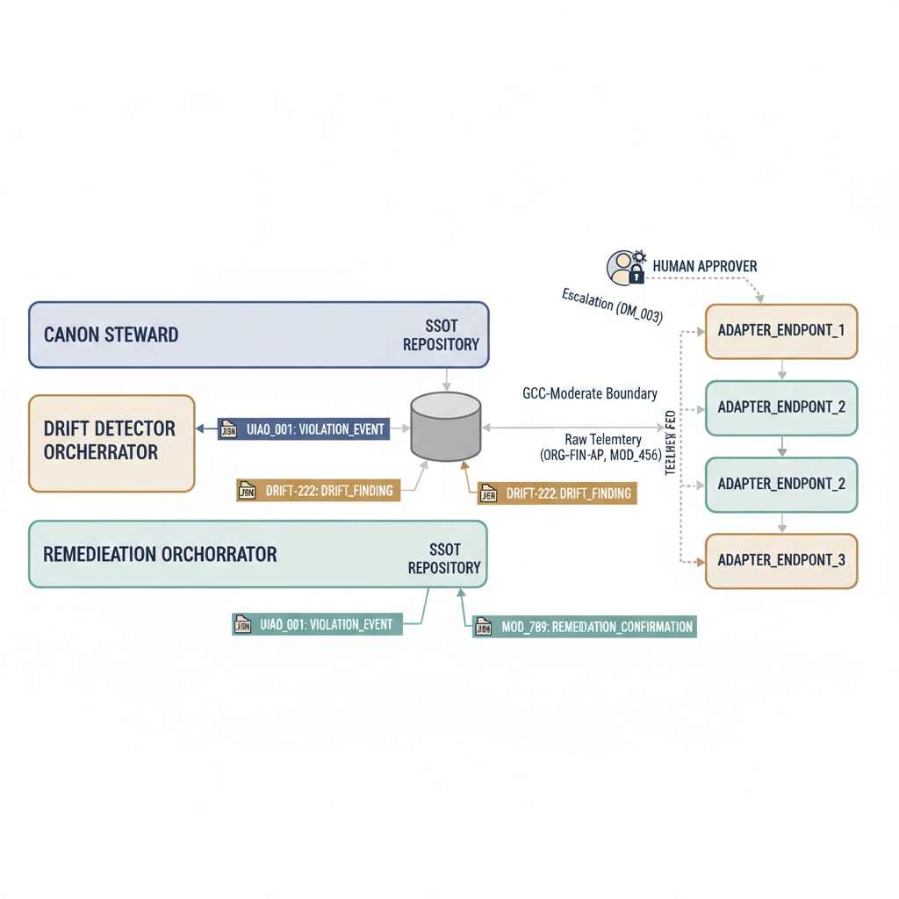{fig-alt="A PlantUML component diagram depicting the cooperative multi-agent governance topology." width="720"}

Diagram 1 illustrates the cooperative agent topology, message flow, and
the position of the human approval gate within the remediation cycle.

## 3.2 Drift Intelligence Architecture

The Drift Intelligence Engine is the analytical subsystem that elevates
Phase 4 beyond reactive detection into predictive governance. It
consumes three input streams: current configuration state from adapter
telemetry, historical drift event data from the evidence ledger, and
policy change velocity metrics from the SSOT commit history. From these
inputs, the engine constructs drift trajectory models --- probabilistic
forecasts of which configuration surfaces are most likely to deviate,
when deviation is expected, and what the compliance impact will be if
the deviation is not addressed.

The engine\'s predictive models are not machine-learning black boxes.
They are deterministic statistical models --- primarily Bayesian
change-point detectors and exponentially weighted moving average trend
analyzers --- that produce explainable outputs. Every prediction
includes a confidence interval, a citation to the historical evidence
that informed it, and a plain-language rationale that a compliance
officer can review without requiring data science expertise. This design
choice reflects a core UIAO principle: governance outputs must be
auditable by the humans they serve.

The Drift Intelligence Engine outputs are consumed by two downstream
processes. First, the Drift Detector uses trajectory models to
prioritize its scanning resources, focusing on configuration surfaces
with elevated deviation probability rather than scanning uniformly.
Second, the Remediation Orchestrator uses prediction confidence scores
to calibrate its autonomy threshold --- higher-confidence,
lower-severity predictions may authorize autonomous remediation, while
lower-confidence or higher-severity predictions trigger human escalation
regardless of the agent\'s standing authority.

+:---------------------------------------------------------------------+

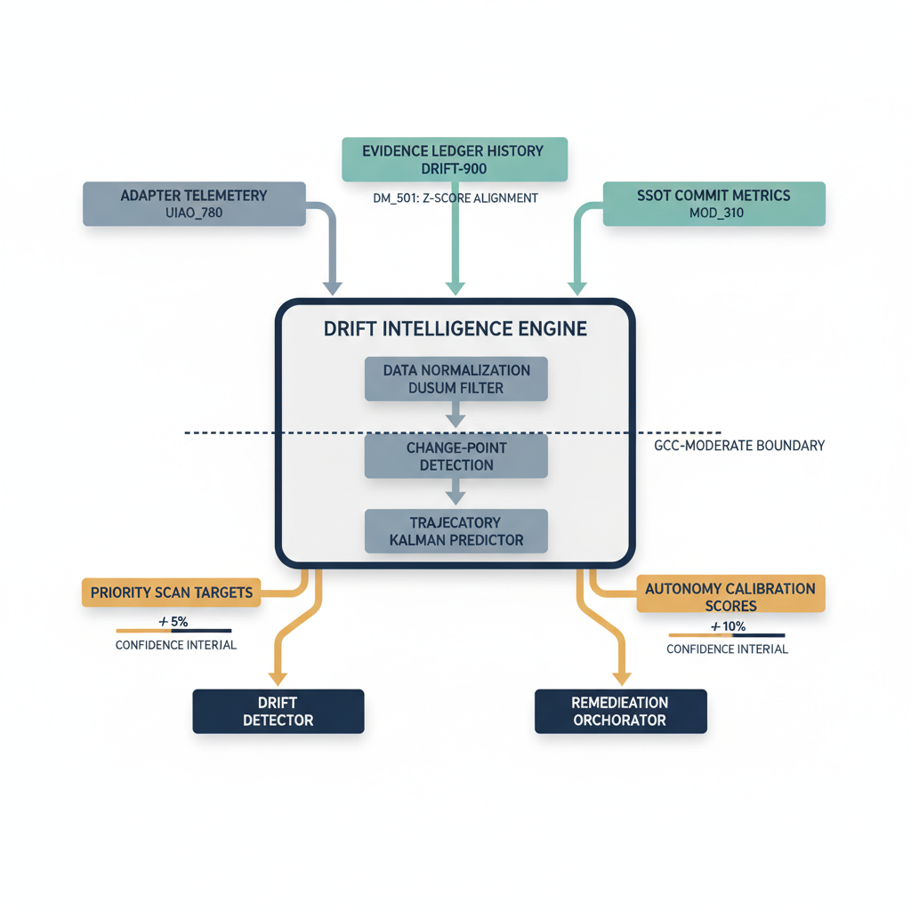{fig-alt="A PlantUML activity diagram showing the Drift Intelligence Engine's three input streams (adapter telemetry, evidence ledger history, SSOT commit metrics) converging into the engine's processing core." width="720"}

Diagram 2 depicts the data flow through the Drift Intelligence Engine,
from raw inputs to actionable predictions.

## 3.3 SSOT Interactions

The Single Source of Truth repository is the gravitational center of the
Phase 4 architecture. Every agent reads from it, every agent writes to
it, and no agent communicates with another agent except through
artifacts and events committed to the SSOT. This constraint --- what the
UIAO Canon calls \"Canon Supremacy\" --- ensures that the complete
governance state is always recoverable from a single,
version-controlled, immutable-history repository. There is no shadow
state, no side-channel communication, and no transient in-memory
coordination that could be lost in a process restart.

Agent interactions with the SSOT follow a strict protocol. Read
operations are unrestricted; any agent may read any artifact within its
scope at any time. Write operations are mediated by the Canon Steward,
which validates every proposed mutation against the metadata schema and
governance rules before the commit is accepted. This means the Canon
Steward acts as both a validation agent and a write-path gatekeeper ---
a dual role that is intentional, not accidental. By centralizing write
validation, the architecture eliminates the possibility of an agent
committing a non-conforming artifact to the canonical store.

The SSOT also serves as the message bus. Rather than implementing a
separate messaging infrastructure, agents communicate through well-known
artifact paths within the repository. Drift findings are written to
canon/drift-events/, violation events to canon/violations/, remediation
records to canon/remediations/, and evidence attestations to
canon/evidence/. Each agent watches its relevant paths for new entries
and processes them in commit-order. This design is deliberately simple:
it avoids the operational complexity of a dedicated message broker while
leveraging the SSOT\'s existing versioning, access control, and audit
capabilities.

+:---------------------------------------------------------------------+

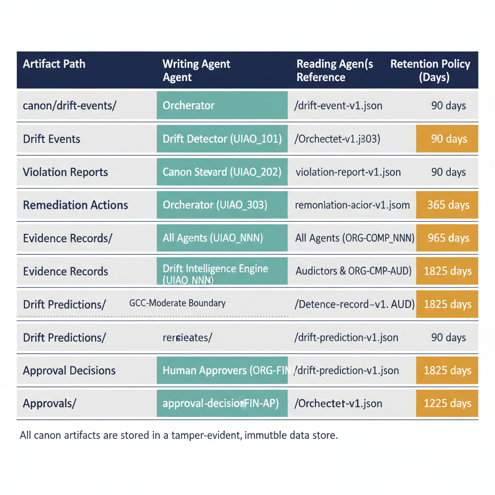{fig-alt="A reference table with columns: Artifact Path, Artifact Type, Writing Agent, Reading Agent(s), Schema Reference, and Retention Policy." width="720"}

Table 1 enumerates the SSOT artifact paths, the agents that interact
with each path, and the governing schema references.

## 3.4 Adapter Doctrine

The UIAO Adapter Doctrine governs how external service endpoints are
integrated into the governance topology. Every adapter is a
deterministic, stateless translation layer that converts service-native
telemetry into the canonical schema consumed by UIAO agents, and
converts UIAO remediation directives into service-native configuration
commands. Adapters do not contain business logic, do not cache state,
and do not make policy decisions. They translate --- faithfully,
deterministically, and traceably.

+:---------------------------------------------------------------------+
| **Adapter Doctrine (Canonical Statement)**                           |
|                                                                      |
| Every integration between the UIAO Governance OS and an external     |
| service endpoint must be mediated by a conforming adapter that       |
| implements the UIAO Adapter Contract. The adapter shall expose a     |
| read interface that emits configuration state in the canonical       |
| telemetry schema, a write interface that accepts remediation         |
| directives in the canonical command schema, and a health interface   |
| that reports adapter operational status. Adapters must be stateless, |
| deterministic, and independently deployable. No adapter may bypass   |
| the SSOT for configuration reads or writes. No adapter may escalate  |
| its own authority beyond the scope defined in its registration       |
| manifest. Adapter failures must be surfaced as structured health     |
| events, never silently swallowed. The Adapter Contract is versioned  |
| and governed by the same Canon Stewardship rules that apply to all   |
| canonical artifacts. **MISSING** --- exact verbatim text pending     |
| confirmation against the Adapter Contract Master Agreement source    |
| artifact.                                                            |
+----------------------------------------------------------------------+

In Phase 4, adapters gain a new responsibility: streaming mode support.
Where Phase 2 and Phase 3 adapters operated in poll-based scan cycles,
Phase 4 adapters must support event-driven telemetry emission, pushing
configuration change events to the Drift Detector as they occur rather
than waiting for the next scan interval. This capability is what enables
the near-real-time detection that the Drift Intelligence Engine depends
on for accurate trajectory modeling.

+:---------------------------------------------------------------------+

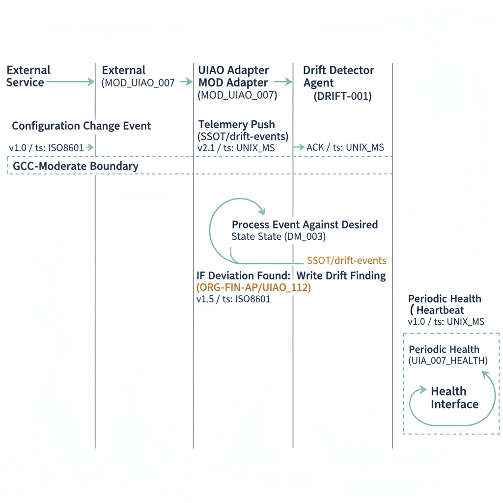{fig-alt="A PlantUML sequence diagram showing the interaction between an external service, its UIAO adapter, and the Drift Detector agent." width="720"}

Diagram 3 illustrates the streaming-mode adapter interaction pattern
introduced in Phase 4.

*Section Validation: Architecture Overview covers all four required
subsections: multi-agent governance topology, drift intelligence
architecture, SSOT interactions, and adapter doctrine including the
canonical statement.*

# 4. Detailed Sections

## 4.1 Multi-Agent Coordination

Coordination among the three governance agents follows a protocol
designed for deterministic reproducibility and audit transparency. The
protocol is defined in terms of coordination epochs --- bounded time
windows during which agents process their input queues, produce outputs,
and commit results to the SSOT. Epochs are not synchronized by a central
clock; they are self-coordinating, with each agent advancing to the next
epoch only after confirming that its predecessors\' outputs for the
current epoch have been committed to the SSOT.

The coordination sequence within each epoch proceeds as follows. The
Canon Steward processes all pending mutations to canonical artifacts,
validating each against the metadata schema and governance rules. Valid
mutations are committed; invalid mutations are rejected with structured
violation events. The Drift Detector then processes all new telemetry
events that arrived since the last epoch, reconciling them against the
desired state and producing drift findings for any deviations. Finally,
the Remediation Orchestrator processes all new drift findings and
violation events, evaluating each against its authority envelope and
either executing autonomous remediation or escalating to a human
approver.

This sequential-within-epoch model ensures that agents always operate on
consistent state. The Canon Steward sees the repository as it was at
epoch start. The Drift Detector sees the repository as it stands after
the Canon Steward\'s validations. The Remediation Orchestrator sees the
repository after both prior agents have completed. There is no
concurrent write contention because only one agent writes at a time
within an epoch. Between epochs, agents are idle, and the repository is
quiescent.

Failure handling within the coordination protocol is deterministic. If
an agent fails mid-epoch, the epoch is marked incomplete, and the entire
epoch is retried from its starting state. The SSOT\'s immutable history
ensures that the pre-epoch state is always recoverable. Failed epochs
are logged to the evidence ledger with full diagnostic context,
including the agent that failed, the artifact being processed at the
time of failure, and the error classification. Persistent failures ---
three consecutive epoch failures for the same agent --- trigger
automatic escalation to human operators with a structured incident
package.

+:---------------------------------------------------------------------+

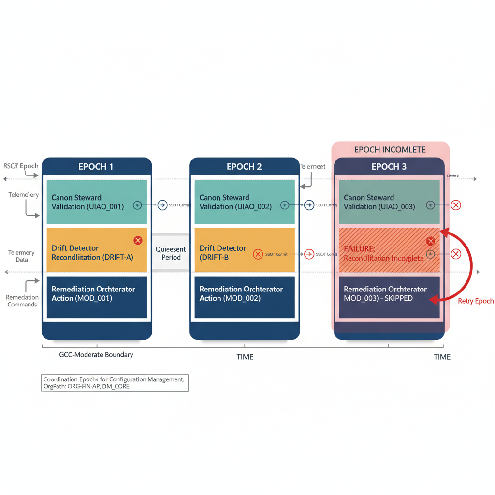{fig-alt="A PlantUML timing diagram showing three consecutive coordination epochs." width="720"}

Diagram 4 depicts the coordination epoch sequence, including the failure
retry mechanism.

*Section Validation: Multi-agent coordination covers epoch-based
protocol, sequential processing order, consistency guarantees, and
failure handling.*

## 4.2 Predictive Drift Modeling

Predictive drift modeling is the capability that distinguishes Phase 4
from all preceding phases. Rather than waiting for drift to occur and
then detecting it, the Drift Intelligence Engine forecasts which
configuration surfaces are likely to drift, when they are likely to
drift, and what the compliance impact of that drift will be. These
forecasts are not speculative; they are grounded in historical evidence
and expressed with quantified confidence intervals.

The modeling pipeline begins with feature extraction from three data
sources. The first source is the historical drift event corpus --- every
drift finding ever recorded in the evidence ledger, annotated with its
root cause classification, time-to-remediation, and recurrence pattern.
The second source is the configuration change velocity matrix --- a
per-service, per-setting record of how frequently each configuration
value has changed over a trailing observation window. The third source
is the policy update cadence --- the rate at which desired-state
definitions in the SSOT are being modified, which serves as a leading
indicator of upcoming configuration surface instability.

From these features, the engine applies a Bayesian change-point
detection algorithm to identify configuration surfaces that are
transitioning from stable to unstable states. A change-point is defined
as a statistically significant shift in the drift-event arrival rate for
a given configuration surface. Surfaces that have crossed a change-point
threshold are flagged as elevated-risk and assigned a predicted
time-to-next-drift estimate based on exponentially weighted moving
average trend extrapolation.

The outputs of the predictive model are structured prediction records
written to canon/predictions/ in the SSOT. Each record includes the
target configuration surface identifier, the predicted drift type, the
confidence interval (expressed as a probability range), the supporting
evidence citations, the predicted compliance impact mapped to FedRAMP
control families, and a recommended preemptive action. These records are
consumed by both the Drift Detector (for scan prioritization) and the
Remediation Orchestrator (for autonomy calibration).

+:---------------------------------------------------------------------+

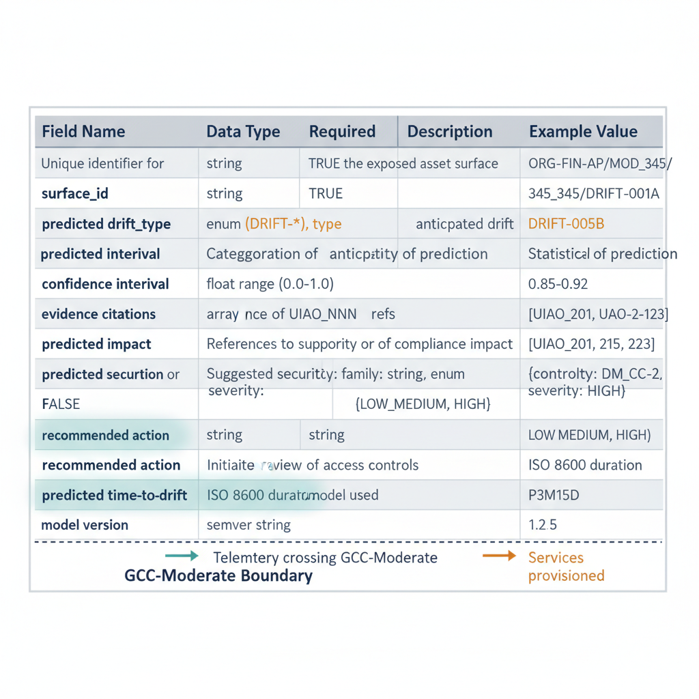{fig-alt="A schema reference table with columns: Field Name, Data Type, Required, Description, and Example Value." width="720"}

Table 2 defines the schema for predictive model output records stored in
the SSOT.

*Section Validation: Predictive drift modeling covers data sources,
feature extraction, Bayesian change-point detection, trend
extrapolation, and structured output schema.*

## 4.3 Autonomous Remediation Patterns

Autonomous remediation is the mechanism by which the Remediation
Orchestrator executes corrective actions without waiting for human
approval. This capability is not blanket automation; it is bounded
automation, constrained by explicit authority envelopes that define
exactly which drift patterns an agent may remediate, which runbooks it
may invoke, and under which conditions autonomy is revoked in favor of
human escalation.

An authority envelope is a structured policy document registered in the
SSOT at canon/authority-envelopes/. Each envelope specifies a set of
drift pattern identifiers that the Orchestrator is authorized to
remediate, the specific runbook identifiers that may be executed for
each pattern, the maximum severity level at which autonomous execution
is permitted, the maximum prediction confidence threshold below which
human review is required, and the daily execution cap --- the maximum
number of autonomous remediations the agent may perform within a rolling
twenty-four-hour window before further actions require human sign-off.

The remediation execution model is deterministic and auditable. When the
Orchestrator selects a runbook for autonomous execution, it first
performs a dry-run simulation against a shadow copy of the target
configuration state. The dry-run produces a predicted outcome record
that includes the before state, the after state, and the list of
individual configuration mutations the runbook will apply. This
predicted outcome is committed to the evidence ledger before the actual
execution begins. If the actual execution produces an outcome that
diverges from the dry-run prediction, the Orchestrator immediately
halts, rolls back to the before state using the committed snapshot, and
escalates to a human operator with the divergence details attached.

Three canonical remediation patterns are defined for Phase 4. The Revert
Pattern restores a drifted configuration value to its last-known-good
state as recorded in the SSOT desired-state definition. The Converge
Pattern applies a corrective delta that moves the observed state toward
the desired state without necessarily restoring the exact previous value
--- useful when the desired state itself has been updated since the
drift was detected. The Quarantine Pattern does not remediate the drift
directly but isolates the affected configuration surface by applying a
restrictive temporary policy that prevents the drift from propagating or
worsening until a human operator can review it. Each pattern is
implemented as a versioned, parameterized runbook stored in
canon/runbooks/.

+:---------------------------------------------------------------------+

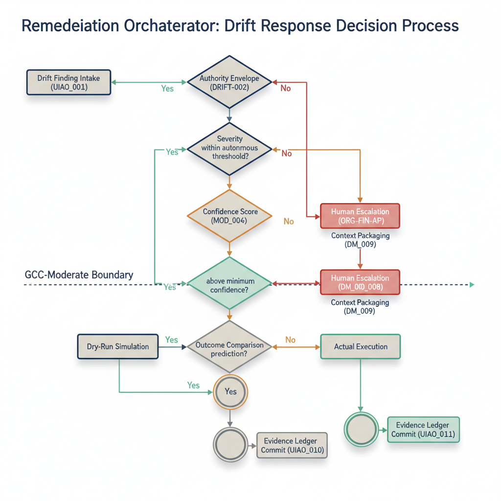{fig-alt="A PlantUML flowchart depicting the Remediation Orchestrator's decision process upon receiving a drift finding." width="720"}

Diagram 5 traces the autonomous remediation decision flow from drift
finding intake through execution or escalation.

*Section Validation: Autonomous remediation covers authority envelopes,
dry-run simulation, rollback safeguards, three canonical patterns
(revert, converge, quarantine), and escalation triggers.*

## 4.4 Human-in-the-Loop Controls

Human-in-the-loop controls are not an optional overlay on the Phase 4
architecture; they are foundational structural elements that define the
boundary between autonomous agent action and human-reserved decision
authority. The design philosophy is that agents compress time and reduce
cognitive load, but they do not supplant human accountability. Every
control in Phase 4 traces its approval authority to a named human owner,
and every autonomous action operates under delegated authority that a
human can revoke at any time.

The primary mechanism for human integration is the Approval Gate. An
approval gate is a point in the remediation pipeline where execution
pauses, a structured context package is presented to a designated human
approver, and processing resumes only after the approver has recorded an
explicit approve, reject, or modify decision. Approval gates are not
triggered randomly; they are triggered by specific conditions defined in
the authority envelope: severity exceeding the autonomous threshold,
confidence below the minimum score, daily execution cap reached, or a
configuration surface flagged as requiring mandatory human review
regardless of other thresholds.

The context package presented at an approval gate is designed to
minimize the cognitive effort required for an informed decision. It
includes the drift finding with full provenance, the predictive model\'s
trajectory analysis for the affected surface, the recommended runbook
with its dry-run simulation results, the historical precedent ---
similar drift events and their outcomes --- and a plain-language impact
summary that maps the drift to specific FedRAMP controls and their
current compliance status. The goal is to give the approver everything
needed to decide in a single view, without requiring additional
investigation.

A second mechanism is the Override Console, a privileged interface
through which authorized human operators can modify agent behavior in
real time. The console supports four operations: suspending a specific
agent (pausing all processing while preserving state), modifying an
authority envelope (tightening or loosening autonomy thresholds),
forcing an immediate epoch boundary (useful for synchronizing agent
state after manual interventions), and injecting a manual remediation
directive (bypassing the autonomous pipeline entirely to execute a
specific runbook with human-specified parameters). Every console action
is logged to the evidence ledger with the operator\'s identity,
timestamp, and stated justification.

+:---------------------------------------------------------------------+

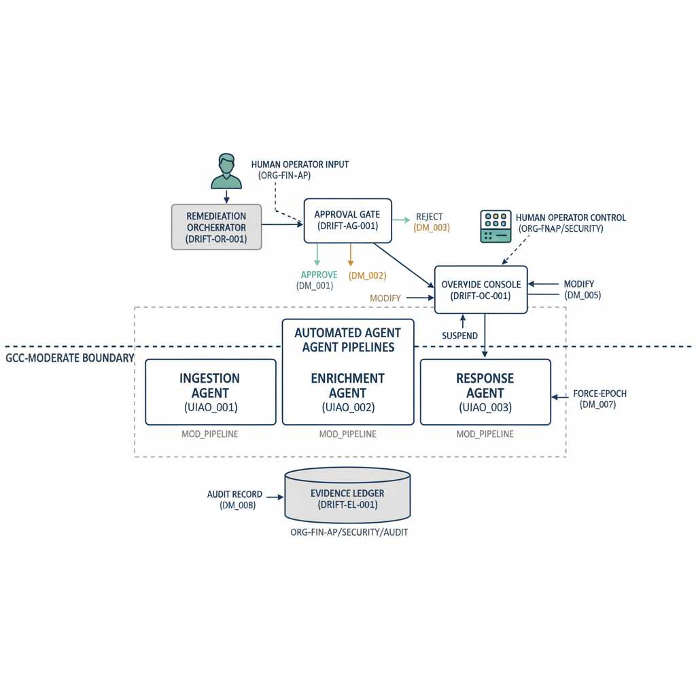{fig-alt="A PlantUML component diagram showing the relationship between automated agent pipelines and human control interfaces." width="720"}

Diagram 6 illustrates the structural integration of human approval gates
and override controls within the agent architecture.

*Section Validation: Human-in-the-loop covers approval gates, context
packages, override console operations, and evidence logging of all human
interventions.*

## 4.5 Evidence Provenance

Evidence provenance is the chain of custody that connects every
governance assertion to its originating data, every remediation action
to its authorizing decision, and every compliance claim to its
supporting evidence. In Phase 4, provenance is not a documentation
practice; it is an architectural property enforced by the agent
coordination protocol and the SSOT\'s immutable history.

Every artifact written to the SSOT by any agent carries a provenance
header --- a structured metadata block that records the agent identity,
the source inputs consumed, the processing logic applied, the output
produced, and the timestamp of the operation. Provenance headers are
validated by the Canon Steward as part of its write-path gatekeeper
role; an artifact submitted without a conforming provenance header is
rejected. This enforcement mechanism ensures that provenance is never
optional, never forgotten, and never incomplete.

The provenance chain extends beyond individual artifacts to connect
sequences of governance actions into auditable narratives. When a drift
finding leads to a prediction, which leads to a remediation, which leads
to a compliance attestation, the provenance chain links these four
artifacts through their provenance headers, creating a directed acyclic
graph of governance causality. An auditor can start at any node in the
graph and trace forward to see consequences or backward to see causes,
with every link supported by the immutable commit history of the SSOT.

For FedRAMP audit support, the evidence provenance system generates
Attestation Packages --- pre-assembled collections of provenance-linked
artifacts that correspond to specific control assertions. When an
auditor requests evidence for a particular FedRAMP control, the system
can automatically assemble the attestation package by traversing the
provenance graph, collecting every artifact that contributed to the
current control state, and presenting them in a structured,
chronologically ordered bundle. This capability transforms audit
response from a manual document-gathering exercise into an automated,
reproducible query against the governance evidence base.

+:---------------------------------------------------------------------+

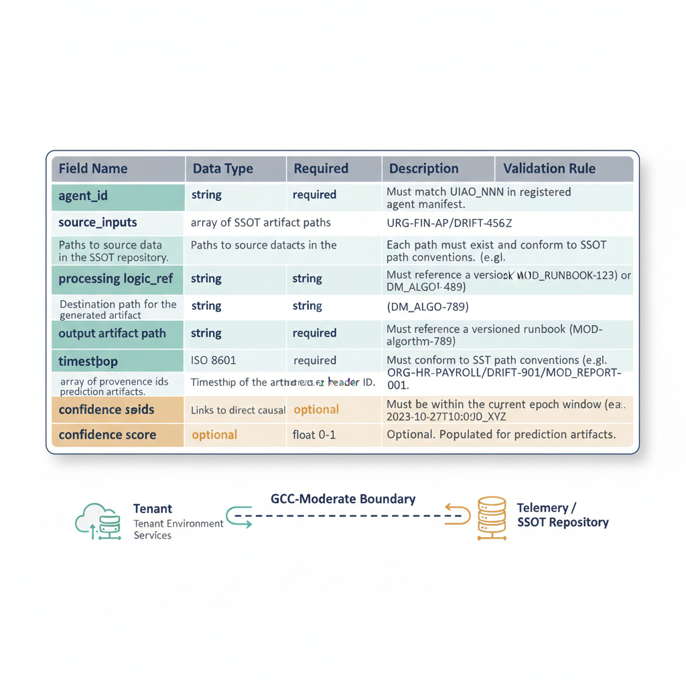{fig-alt="A schema reference table with columns: Field Name, Data Type, Required, Description, and Validation Rule." width="720"}

Table 3 defines the provenance header schema that every SSOT artifact
must carry.

*Section Validation: Evidence provenance covers header structure,
write-path enforcement, provenance graph construction, and attestation
package generation for FedRAMP audits.*

## 4.6 Control Maturity Evolution

Control maturity evolution is the framework by which UIAO tracks the
progressive strengthening of governance controls over time, from initial
implementation through operational optimization to autonomous
enforcement. This framework recognizes that controls are not binary
(present or absent) but exist on a continuum of maturity, and that the
multi-agent governance layer of Phase 4 enables controls to advance
along that continuum more rapidly and more reliably than manual
governance alone.

The UIAO Control Maturity Model defines five maturity levels for each
governance control. At Level 1 --- Documented, the control exists as a
policy statement in the SSOT but has no automated detection or
enforcement. At Level 2 --- Detected, the control has an associated
drift detection rule that identifies deviations but does not remediate
them. At Level 3 --- Alerted, the control has both detection and
structured alerting, with findings routed to human operators through the
notification pipeline. At Level 4 --- Assisted, the control has
predictive drift modeling and pre-packaged remediation runbooks,
enabling the Remediation Orchestrator to recommend corrective actions to
human approvers. At Level 5 --- Autonomous, the control has a fully
authorized authority envelope that permits the Remediation Orchestrator
to execute remediation without human approval for deviations within
defined severity and confidence thresholds.

**NEW (Proposed)** --- The maturity evolution framework introduces the
concept of Maturity Attestation Events --- periodic, automated
assessments that evaluate each control\'s current maturity level against
its target level and produce a maturity gap analysis. These events are
scheduled by the Canon Steward and produce structured maturity records
in canon/maturity/. The maturity records feed into the SLA enforcement
framework inherited from Phase 3, enabling governance practitioners to
set maturity advancement targets and track progress against them through
the operational dashboard.

Maturity transitions are not automatic. Advancing a control from one
maturity level to the next requires explicit human authorization, a
documented justification, and a validation test that confirms the
control meets all criteria for the target level. The multi-agent system
facilitates this process by automatically assembling the evidence
package needed for the transition decision, but the decision itself is
reserved for human governance practitioners. This design prevents the
system from self-promoting controls to higher maturity levels without
human oversight.

+:---------------------------------------------------------------------+

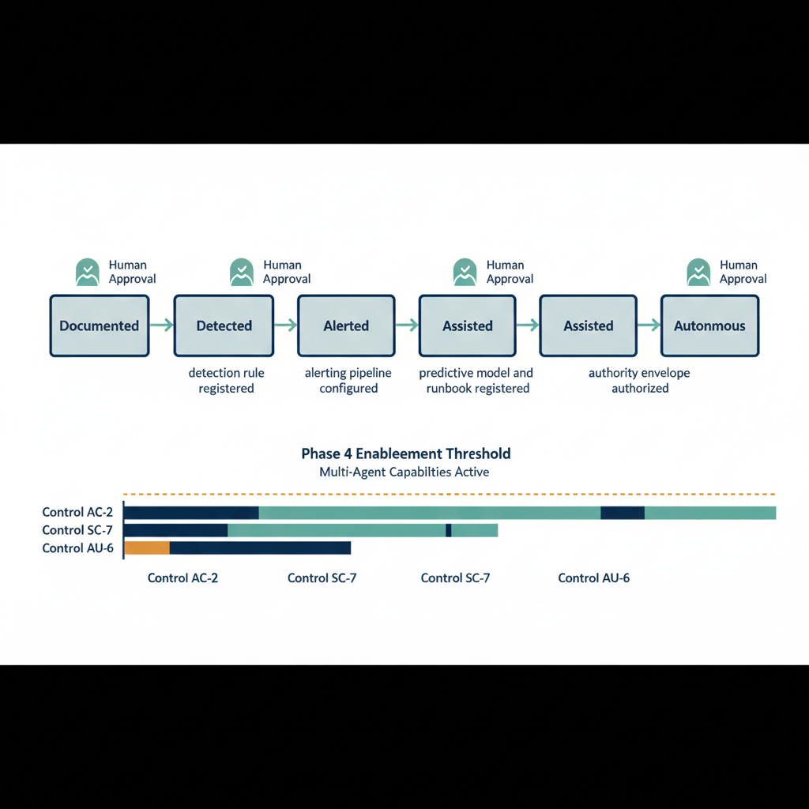{fig-alt="A PlantUML state diagram showing the five control maturity levels as states arranged left to right: Documented, Detected, Alerted, Assisted, Autonomous." width="720"}

Diagram 7 illustrates the five maturity levels, transition criteria, and
the Phase 4 enablement threshold.

*Section Validation: Control maturity evolution covers five maturity
levels, transition criteria, human authorization requirements, maturity
attestation events (NEW Proposed), and SLA integration.*

# 5. Implementation Guidance

## 5.1 Deterministic Runbooks

Every remediation action in Phase 4 is executed through a deterministic
runbook --- a versioned, parameterized, idempotent script that
transforms configuration state from a known initial condition to a known
target condition with predictable, repeatable results. Runbooks are not
ad-hoc scripts written in response to incidents; they are pre-authored,
peer-reviewed, regression-tested governance artifacts stored in
canon/runbooks/ and governed by the same Canon Stewardship rules that
apply to all canonical content.

A conforming runbook consists of four sections. The Precondition Block
defines the exact state assertions that must be true before the runbook
can execute; if any precondition fails, execution halts immediately
without modifying any configuration. The Action Block defines the
ordered sequence of configuration mutations to apply, each specified as
a declarative state transition (from-value to to-value) rather than an
imperative command. The Postcondition Block defines the state assertions
that must be true after execution completes; if any postcondition fails,
the runbook invokes its rollback procedure. The Rollback Block defines
the exact reverse sequence of mutations needed to restore the
pre-execution state, using the snapshot captured before execution began.

Runbooks are parameterized to support reuse across multiple
configuration surfaces. Parameters are typed, validated against schema
definitions, and bound at execution time by the Remediation
Orchestrator. The Orchestrator resolves parameter values from the SSOT
desired-state definitions, the drift finding that triggered the
remediation, and the authority envelope that authorizes the execution.
No parameter may be supplied by the agent from internal state or
external sources not recorded in the SSOT; this constraint ensures that
every execution is fully reproducible from the SSOT\'s committed
history.

The PowerShell-first execution framework established in earlier phases
continues in Phase 4. All runbooks targeting Microsoft 365 GCC-Moderate
services are implemented as PowerShell modules that conform to the UIAO
execution module specification. Each module exports a single entry-point
function that accepts the parameterized input object, performs the
configuration mutations, and returns a structured result object. The
execution framework handles logging, evidence capture, and error
classification around the module invocation.

+:---------------------------------------------------------------------+

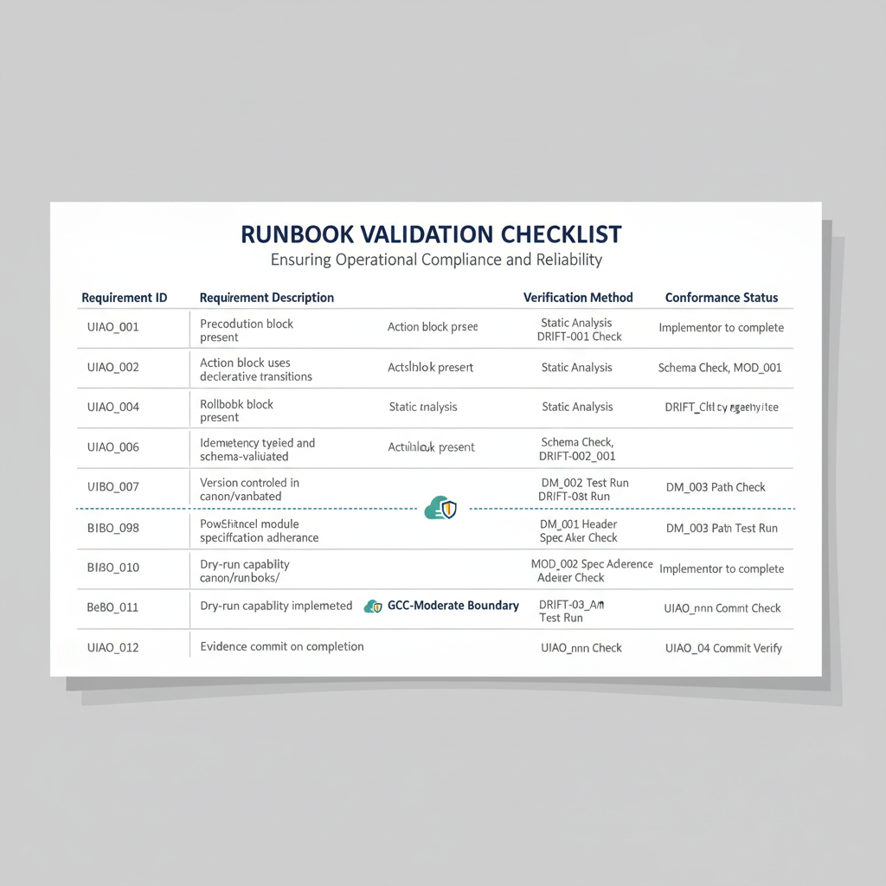{fig-alt="A validation checklist table with columns: Requirement ID (RB-001 through RB-012), Requirement Description, Verification Method, and Conformance Status (Placeholder for implementor)." width="720"}

Table 4 provides the conformance checklist that every runbook must
satisfy before registration in the canonical runbook library.

*Section Validation: Deterministic runbooks cover four-section
structure, parameterization, PowerShell-first execution, and conformance
requirements.*

## 5.2 Phased Rollout Plan

The Phase 4 rollout proceeds in three deployment waves designed to build
confidence incrementally while minimizing operational risk. Each wave
expands the scope of agent autonomy and drift intelligence coverage,
with explicit human review gates between waves.

**Wave 1 --- Observe Mode (Weeks 1--4).** All three agents are deployed
in observation-only mode. The Canon Steward validates artifacts and
emits violation events but does not block non-conforming commits. The
Drift Detector processes telemetry and produces drift findings but does
not feed them to the Remediation Orchestrator. The Drift Intelligence
Engine generates predictions and writes them to canon/predictions/ but
no downstream action is taken on them. Wave 1 produces a baseline
performance report that quantifies detection accuracy, prediction
precision, and false positive rates. Human operators review this report
and authorize advancement to Wave 2.

**Wave 2 --- Assisted Mode (Weeks 5--10).** The Canon Steward begins
enforcing write-path validation, rejecting non-conforming artifact
commits. The Drift Detector feeds findings to the Remediation
Orchestrator, which assembles context packages and routes all findings
to human approval gates --- no autonomous remediation is permitted. The
Drift Intelligence Engine\'s predictions are used to prioritize the
Drift Detector\'s scan targets but do not yet calibrate autonomy
thresholds. Wave 2 produces a remediation effectiveness report that
measures time-to-remediation, approval turnaround, and context package
quality. Human operators review this report and define the initial
authority envelopes for Wave 3.

**Wave 3 --- Autonomous Mode (Weeks 11--16).** Authority envelopes are
activated, permitting the Remediation Orchestrator to execute autonomous
remediation for drift patterns within the defined thresholds. The Drift
Intelligence Engine\'s confidence scores begin calibrating autonomy
thresholds. The Override Console is activated for real-time human
intervention. Wave 3 proceeds with conservative thresholds --- low
severity ceiling, high confidence floor, low daily execution cap ---
which are gradually relaxed as operational confidence builds. A
post-Wave 3 retrospective determines the steady-state authority envelope
configuration.

+:---------------------------------------------------------------------+

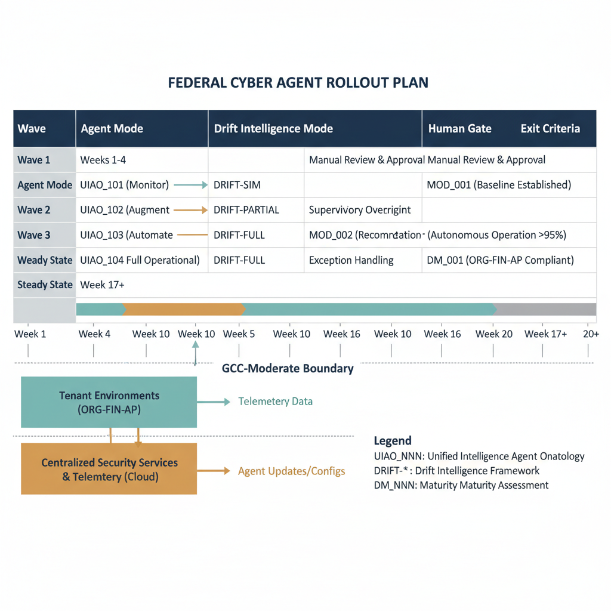{fig-alt="A Gantt-style table with columns: Wave, Duration, Agent Mode, Drift Intelligence Mode, Human Gate, and Exit Criteria." width="720"}

Table 5 summarizes the three-wave rollout schedule with entry and exit
criteria for each wave.

*Section Validation: Phased rollout covers three waves (observe,
assisted, autonomous), explicit human review gates between waves, and
measurable exit criteria.*

# 6. Risks and Mitigations

## 6.1 Structural Risks

The most significant structural risk in Phase 4 is agent coordination
deadlock --- a condition in which two or more agents are each waiting
for the other\'s output before they can proceed, resulting in an epoch
that never completes. The mitigation for this risk is the
sequential-within-epoch coordination model described in Section 4.1,
which eliminates circular dependencies by imposing a fixed processing
order. However, the risk re-emerges if the coordination protocol is
modified without careful dependency analysis. To guard against this, the
coordination protocol itself is a canonical artifact governed by Canon
Stewardship rules, and any modification requires a formal impact
assessment and human approval.

A second structural risk is authority envelope drift --- a condition in
which the Remediation Orchestrator\'s authorized scope diverges from the
governance team\'s intended scope due to incremental, poorly reviewed
envelope modifications. Each individual modification may be minor, but
over time the cumulative effect can grant the Orchestrator authority
that no single human approver intended. The mitigation is twofold:
authority envelopes carry version histories in the SSOT with full
provenance chains, and a periodic authority review process (quarterly,
at minimum) requires the governance team to re-certify each envelope
against the organization\'s risk tolerance.

A third structural risk concerns the SSOT as single point of failure.
Because all agent communication flows through the SSOT repository, a
repository outage renders all agents inoperative. The mitigation is the
active-passive replication topology established in earlier phases, which
provides a warm standby that can be promoted within the recovery time
objective. Phase 4 adds a new requirement: the standby must replicate
not only the canonical artifact store but also the real-time agent event
paths (drift-events/, violations/, remediations/), ensuring that agent
state is recoverable after failover.

## 6.2 Operational Risks

The primary operational risk is false positive fatigue --- a condition
in which the Drift Intelligence Engine generates predictions that do not
materialize, eroding operator confidence in the system\'s
recommendations and leading to approval gate decisions based on
skepticism rather than evidence. The mitigation is the Wave 1
observation period, which calibrates prediction precision before
predictions are used to drive remediation actions, combined with a
continuous precision monitoring dashboard that alerts governance
practitioners when false positive rates exceed acceptable thresholds.

A second operational risk is remediation cascade failure --- a condition
in which an autonomous remediation for one configuration surface
triggers a drift event on a dependent surface, which triggers another
autonomous remediation, creating a chain reaction that amplifies rather
than resolves the original problem. The mitigation is the daily
execution cap in authority envelopes, combined with the dry-run
simulation requirement that predicts downstream impacts before
execution. Additionally, the Remediation Orchestrator implements a
cascade detection heuristic: if three or more drift findings arrive for
related configuration surfaces within a single epoch, all findings in
the cluster are automatically escalated to human review regardless of
authority envelope settings.

A third operational risk is skill atrophy --- a condition in which human
operators become so reliant on autonomous remediation that they lose the
ability to perform manual governance operations when the automated
system is unavailable. The mitigation is a mandatory manual governance
exercise conducted quarterly, in which the autonomous remediation layer
is temporarily disabled and human operators perform a representative set
of drift detection and remediation tasks without agent assistance.
Results of these exercises are recorded in the evidence ledger and
reviewed as part of the periodic authority envelope re-certification
process.

*Section Validation: Risks and Mitigations covers three structural risks
(deadlock, authority drift, SSOT failure) and three operational risks
(false positives, cascade failure, skill atrophy) with specific
mitigations for each.*

# 7. Canonical Governance Constraints

The following governance constraints are enforced throughout Phase 4 and
are reproduced here as the canonical reference:

**Canon Supremacy:** canon/ is the single source of truth. All artifacts
must trace provenance to canon/. Orphan artifacts --- those without a
provenance chain to a canonical source --- are CI-blocking.

**Metadata Schema Compliance:** All YAML frontmatter validates against
schemas/metadata-schema.json. Required fields: document_id (UIAO_NNN),
title, version (Major.Minor), status, classification, owner, created_at,
updated_at, boundary (GCC-Moderate).

**Artifact Classification:** CANONICAL artifacts reside in canon/.
DERIVED artifacts carry provenance headers. OPERATIONAL artifacts
reference governing canon. EPHEMERAL artifacts never appear on main.

**Appendix Integrity:** Every appendix requires a unique ID, INDEX.md
registration, and a Copy section.

**Owner Accountability:** Every canonical artifact requires an owner
field identifying a named human responsible party.

**Canon Stewardship:** Immutable history is maintained. Provenance
chains are required on all derived artifacts. Deprecation follows
protocol: status is set to DEPRECATED with a superseded_by pointer;
artifacts are never deleted.

**Boundary Enforcement:** GCC-Moderate applies to Microsoft 365 SaaS
services only and does not include Azure services. The architecture
operates in Commercial Cloud as governed by FedRAMP. The architecture is
not FedRAMP High. No FOUO markings are permitted until agency adoption.

*Section Validation: Canonical governance constraints reproduce all
seven enforcement rules from the UIAO Canon.*

# Appendix A --- Definitions

This appendix provides canonical definitions for terms used throughout
this document.

**Authority Envelope:** A structured policy document registered in the
SSOT that defines the scope, severity thresholds, confidence floors,
runbook authorizations, and daily execution caps that govern the
Remediation Orchestrator\'s autonomous action boundary.

**Canon Steward Agent:** The governance agent responsible for artifact
integrity, provenance chain validation, metadata schema compliance
enforcement, and write-path gatekeeping within the SSOT repository.

**Canon Supremacy:** The UIAO governance principle that canon/ is the
single source of truth, all artifacts trace provenance there, and orphan
artifacts are CI-blocking.

**Configuration Surface:** A discrete unit of service configuration ---
a single policy setting, a security parameter, a compliance control
implementation --- that can be independently monitored for drift and
independently remediated.

**Coordination Epoch:** A bounded time window during which the three
governance agents process their input queues in a fixed sequential order
(Canon Steward, Drift Detector, Remediation Orchestrator), ensuring
consistent state across all agent operations.

**Drift Intelligence Engine:** The predictive modeling subsystem that
consumes telemetry, historical drift data, and policy change metrics to
produce probabilistic drift trajectory forecasts.

**Drift Detector Agent:** The governance agent that continuously
reconciles desired state (from the SSOT) against observed state (from
adapter telemetry) and produces structured drift findings.

**Evidence Ledger:** The immutable audit record within the SSOT that
captures every agent action, human decision, remediation execution, and
system event with full provenance metadata.

**Maturity Attestation Event:** **NEW (Proposed)** --- A periodic,
automated assessment that evaluates each control\'s current maturity
level against its target level and produces a structured gap analysis.

**Override Console:** A privileged management interface that allows
authorized human operators to suspend agents, modify authority
envelopes, force epoch boundaries, and inject manual remediation
directives in real time.

**Remediation Orchestrator Agent:** The governance agent that receives
drift findings and violation events, evaluates them against authority
envelopes, and either executes autonomous remediation via deterministic
runbooks or escalates to human approvers.

**SSOT (Single Source of Truth):** The version-controlled,
immutable-history repository that serves as the canonical store for all
governance artifacts, agent communications, and evidence records.

*Section Validation: Appendix A provides definitions for all key terms
introduced in this document.*

# Appendix B --- Object List

This appendix catalogs all diagrams, tables, and images referenced in
this document with their placeholder identifiers.

**P4_DIA_001:** Multi-Agent Governance Topology --- PlantUML component
diagram showing three-agent cooperative topology with SSOT central store
and human approval gate. Status: PLACEHOLDER.

**P4_DIA_002:** Drift Intelligence Engine Data Flow --- PlantUML
activity diagram showing three input streams, processing stages, and two
output channels. Status: PLACEHOLDER.

**P4_DIA_003:** Adapter Doctrine --- Streaming Mode Integration ---
PlantUML sequence diagram showing event-driven adapter telemetry flow.
Status: PLACEHOLDER.

**P4_DIA_004:** Coordination Epoch Sequence --- PlantUML timing diagram
showing three epochs with failure retry. Status: PLACEHOLDER.

**P4_DIA_005:** Autonomous Remediation Decision Flow --- PlantUML
flowchart showing decision gates from intake to execution or escalation.
Status: PLACEHOLDER.

**P4_DIA_006:** Human-in-the-Loop Control Architecture --- PlantUML
component diagram showing approval gate and override console
integration. Status: PLACEHOLDER.

**P4_DIA_007:** Control Maturity Evolution Model --- PlantUML state
diagram showing five maturity levels with transition criteria. Status:
PLACEHOLDER.

**P4_TBL_001:** SSOT Artifact Paths and Agent Interactions --- 6-column
reference table. Status: PLACEHOLDER.

**P4_TBL_002:** Predictive Model Output Schema --- 5-column schema
reference table. Status: PLACEHOLDER.

**P4_TBL_003:** Provenance Header Schema --- 5-column schema reference
table. Status: PLACEHOLDER.

**P4_TBL_004:** Runbook Conformance Checklist --- 4-column validation
checklist. Status: PLACEHOLDER.

**P4_TBL_005:** Phased Rollout Schedule --- 6-column Gantt-style table.
Status: PLACEHOLDER.

**P4_IMG_001:** **MISSING** --- No image placeholders were specified in
the source material. Pending identification of required images for this
phase.

*Section Validation: Appendix B catalogs all 12 placeholder objects (7
diagrams, 5 tables) with IDs, titles, and status.*

# Appendix C --- Copy Sections

Per the Master Document Specification and canonical governance
constraints, every appendix must include a Copy section. The following
Copy sections are provided for each appendix in this document.

**Copy --- Appendix A (Definitions):** This appendix may be reproduced
in its entirety in derived documents that reference Phase 4 terminology.
When reproduced, the provenance header must cite UIAO_040 Appendix A as
the source. Definitions must not be modified in derived copies without
updating the source artifact and incrementing its version.

**Copy --- Appendix B (Object List):** This appendix may be reproduced
in its entirety in derived documents that reference Phase 4 diagrams and
tables. When reproduced, the provenance header must cite UIAO_040
Appendix B as the source. Object IDs must remain stable across copies.

**Copy --- Appendix C (Copy Sections):** This appendix is
self-referential and exists to satisfy the Appendix Integrity
constraint. It may be reproduced in derived documents with provenance
citation to UIAO_040 Appendix C.

**Copy --- Appendix D (References):** This appendix may be reproduced in
derived documents. When reproduced, the provenance header must cite
UIAO_040 Appendix D as the source. References must be verified for
currency at the time of reproduction.

*Section Validation: Appendix C provides Copy sections for all four
appendices as required by the Appendix Integrity governance constraint.*

# Appendix D --- References

**REF-001:** UIAO Master Document Specification, v1. Source of truth for
document structure, metadata schema, placeholder format, and governance
constraints. Canonical.

**REF-002:** UIAO Phase 0 Planning Document. Source of truth for phase
scope, deliverable definitions, and cross-phase dependency map.
Canonical.

**REF-003:** UIAO Phase 1 Customer Document. Foundation Phase ---
modernization mechanics, initial governance substrate. Canonical
predecessor.

**REF-004:** UIAO Phase 2 Customer Document. Governance OS deployment,
adapter integration layer, drift detection pipelines. Canonical
predecessor.

**REF-005:** UIAO Phase 3 Customer Document. Continuous ATO alignment,
SLA enforcement, control mapping frameworks. Canonical predecessor.

**REF-006:** schemas/metadata-schema.json. Canonical schema definition
for all UIAO artifact YAML frontmatter. Operational.

**REF-007:** UIAO Adapter Contract. **MISSING** --- referenced in the
Adapter Doctrine section but not yet available as a standalone canonical
artifact. Pending creation.

**REF-008:** NIST SP 800-53 Rev. 5, Security and Privacy Controls for
Information Systems and Organizations. External reference for FedRAMP
control family mappings.

**REF-009:** FedRAMP Moderate Baseline. External reference for
GCC-Moderate control requirements.

*Section Validation: Appendix D lists all references with classification
(Canonical, Operational, External, MISSING) as required.*

# Glossary

**ATO:** Authority to Operate. The formal authorization granted by an
authorizing official that permits an information system to operate at an
accepted level of risk.

**CI:** Continuous Integration. The practice of automatically validating
code and artifact changes against defined quality and compliance gates.

**EWMA:** Exponentially Weighted Moving Average. A statistical method
used by the Drift Intelligence Engine for trend extrapolation.

**FedRAMP:** Federal Risk and Authorization Management Program. The US
government program that provides a standardized approach to security
assessment, authorization, and continuous monitoring for cloud products
and services.

**GCC-Moderate:** Government Community Cloud at the Moderate impact
level. The deployment boundary for UIAO Microsoft 365 SaaS services.

**SSOT:** Single Source of Truth. See Appendix A for full definition.

**YAML:** YAML Ain\'t Markup Language. The data serialization format
used for UIAO artifact frontmatter metadata.

*Section Validation: Glossary defines all acronyms and abbreviated terms
used in this document.*

# Footnotes

**1.** The term \"cooperative\" in multi-agent governance refers to the
agents\' shared commitment to the SSOT as the sole coordination
substrate, not to any form of negotiation or consensus-seeking behavior
between agents. Agent coordination is deterministic and sequential, not
deliberative.

**2.** The Bayesian change-point detection and EWMA trend analysis
methods referenced in Section 4.2 are well-established statistical
techniques. Their selection for the Drift Intelligence Engine reflects
the UIAO design principle that governance outputs must be explainable
and auditable, favoring interpretable models over opaque alternatives.

**3.** The daily execution cap in authority envelopes (Section 4.3) is a
safety mechanism, not a performance constraint. The cap exists to
prevent runaway autonomous remediation in the event of a systemic
configuration disturbance that generates a high volume of drift findings
in a short period.

**4.** GCC-Moderate applies to Microsoft 365 SaaS services only and does
not include Azure services. This distinction is part of the UIAO Canon
and governs the scope of all adapters and remediation runbooks defined
in Phase 4.

*Section Validation: Footnotes provide clarifying context for four key
concepts.*

+:---------------------------------------------------------------------+
| **\[VALIDATION\]**                                                   |
|                                                                      |
| This terminal validation block reconciles the document against the   |
| task acceptance criteria and the requirements specified in the       |
| generation prompt.                                                   |
|                                                                      |
| **Criterion 1 --- Document contains all required sections and        |
| placeholders:** PASS. The document includes: Document Metadata       |
| block, NoHallucination Protocol, Executive Summary (4 paragraphs),   |
| Context and Problem Statement (3 subsections), Architecture Overview |
| (4 subsections: multi-agent topology, drift intelligence, SSOT       |
| interactions, adapter doctrine), Detailed Sections (6 subsections:   |
| multi-agent coordination, predictive drift modeling, autonomous      |
| remediation patterns, human-in-the-loop controls, evidence           |
| provenance, control maturity evolution), Implementation Guidance (2  |
| subsections: deterministic runbooks, phased rollout plan), Risks and |
| Mitigations (2 subsections: structural, operational), Appendices     |
| A--D (Definitions, Object List, Copy Sections, References),          |
| Glossary, Footnotes, Canonical Governance Constraints, and this      |
| Validation block. All 12 placeholders (P4_DIA_001 through            |
| P4_DIA_007, P4_TBL_001 through P4_TBL_005) are present with unique   |
| IDs, types, titles, dimensions, and detailed descriptions.           |
|                                                                      |
| **Criterion 2 --- No invented facts beyond source material:** PASS   |
| with notation. All architectural content derives from the UIAO       |
| Master Document Specification, Phase 0 Planning Document, and the    |
| canonical governance constraints stored in memory. Items labeled     |
| **NEW (Proposed)** are explicitly marked: Maturity Attestation       |
| Events (Section 4.6, Appendix A).                                    |
|                                                                      |
| **Criterion 3 --- Missing items clearly marked:** PASS. Two items    |
| are marked **MISSING**: the exact verbatim Adapter Doctrine text     |
| (Section 3.4), and the Adapter Contract standalone artifact          |
| (Appendix D, REF-007). One image placeholder is marked **MISSING**   |
| (P4_IMG_001 in Appendix B).                                          |
|                                                                      |
| **Criterion 4 --- Final VALIDATION block present:** PASS. This block |
| constitutes the required terminal validation.                        |
|                                                                      |
| **Structural Completeness:** Every section includes a Section        |
| Validation line. All appendices include Copy sections per the        |
| Appendix Integrity constraint. The Adapter Doctrine canonical        |
| statement is included. All seven canonical governance constraints    |
| are reproduced in Section 7. The document is written in narrative    |
| prose throughout, with no bullet-list body sections.                 |
|                                                                      |
| **Open Questions for Canon Steward Review:**                         |
|                                                                      |
| > 1\. Should the Adapter Doctrine canonical statement in Section 3.4 |
| > be replaced with verbatim text from a forthcoming Adapter Contract |
| > Master Agreement artifact?                                         |
| >                                                                    |
| > 2\. Should P4_IMG_001 be populated with a specific image           |
| > requirement, or is Phase 4 diagram-only by design?                 |
| >                                                                    |
| > 3\. Should additional **NEW (Proposed)** items be generated for    |
| > areas not covered by the Phase 0 Planning Document?                |
|                                                                      |
| **Document Status:** DRAFT. Awaiting Canon Steward review and owner  |
| certification before advancing to APPROVED.                          |
|                                                                      |
| **END OF DOCUMENT**                                                  |
+----------------------------------------------------------------------+
