# UIAO Phase 5 --- Full Modernization Canon Integration

Customer Document --- UIAO_050 v1.0

 \| Boundary: GCC-Moderate \| Status: DRAFT

  ----------------------------------------------------------------------------
  **Field**        **Value**
  ---------------- -----------------------------------------------------------
  Document ID      UIAO_050

  Title            Phase 5 --- Full Modernization Canon Integration

  Version          1.0

  Status           DRAFT

  Boundary         GCC-Moderate

  Owner            Michael Stratton

  Created          2026-04-24

  Updated          2026-04-24

  Phase            5

  Document Type    Customer Document

  Supersedes       None

  Provenance       Derived from UIAO Phase 0 Planning Document and UIAO Master
                   Document Specification. Structural template: UIAO_040
                   (Phase 4 Customer Document).
  ----------------------------------------------------------------------------

## NoHallucination Protocol

+----------------------------------------------------------------------+
| This document is governed by the UIAO NoHallucination Protocol. All  |
| authors, contributors, and automated agents must observe the         |
| following constraints without exception:                             |
|                                                                      |
| > 1\. Enter No-Hallucination Mode.                                   |
| >                                                                    |
| > 2\. Use only the text the user provides as the source of truth.    |
| >                                                                    |
| > 3\. Do not invent new content unless explicitly allowed.           |
| >                                                                    |
| > 4\. If something is missing, write MISSING.                        |
| >                                                                    |
| > 5\. If unsure, write UNSURE.                                       |
| >                                                                    |
| > 6\. If invention is allowed, label all invented items as NEW       |
| > (Proposed).                                                        |
| >                                                                    |
| > 7\. Restate understanding before generating.                       |
| >                                                                    |
| > 8\. List all assumptions before generating.                        |
| >                                                                    |
| > 9\. Ask clarifying questions if anything is ambiguous.             |
| >                                                                    |
| > 10\. Work in micro-steps: list, group, identify gaps, propose,     |
| > generate.                                                          |
| >                                                                    |
| > 11\. End with a validation step comparing output to the source of  |
| > truth.                                                             |
| >                                                                    |
| > 12\. Highlight any uncertainties or assumptions.                   |
|                                                                      |
| **Protocol Compliance Validation:** This document has been produced  |
| under strict NoHallucination Protocol governance. All sections that  |
| extend beyond source material are marked NEW (Proposed) or MISSING   |
| as appropriate. No facts have been invented.                         |
+----------------------------------------------------------------------+

# 1. Executive Summary

The UIAO Governance OS has matured through four progressive phases ---
from the foundational mechanics of modernization, through the deployment
of a governance operating system, into the optimization of continuous
authorization posture, and onward to the cooperative multi-agent drift
intelligence architecture. Each phase has produced canonical artifacts,
operational runbooks, governance baselines, and machine-trackable
provenance chains. Phase 5, Full Modernization Canon Integration, is the
culmination of this journey: the phase in which every artifact, every
baseline, every adapter contract, and every governance workflow produced
across the prior four phases is consolidated into a single, unified,
self-sustaining canonical corpus.

The problem that Phase 5 solves is not technical debt in the traditional
sense but rather canonical fragmentation --- the inevitable entropy that
accumulates when a governance system evolves through discrete phases,
each producing its own artifacts under its own versioning cadence.
Without deliberate consolidation, the Canon risks drift between
phase-specific artifacts, orphaned references that no longer trace to a
living baseline, and governance workflows that operate against stale or
conflicting sources of truth. Phase 5 arrests this entropy by
establishing a unified baseline lifecycle, a deterministic versioning
and branching model, an archival framework for evidence retention and
retrieval, and extensibility interfaces that ensure the Canon remains a
living system capable of absorbing future services, adapters, and
compliance regimes without structural compromise.

This document defines the architecture, implementation guidance, risks,
and operational cadence for Canon Integration. It is written for
governance stewards, assessors, system owners, and operational teams who
must understand not only what the integrated Canon looks like but how it
sustains itself across the full lifecycle of a continuously authorized
system. Every section follows the UIAO Master Document Specification and
the canonical governance constraints that have governed this corpus
since its inception.

**NEW (Proposed):** Phase 5 introduces the concept of the Canon
Integration Index (CII), a machine-readable manifest that maps every
canonical artifact to its lifecycle state, owner, provenance chain, and
downstream dependents. The CII is proposed as the authoritative registry
from which all governance dashboards, drift detectors, and assessor
interfaces derive their state.

  ----------------------------------------------------------------------
  *Section Validation: Executive Summary covers Canon Integration
  purpose, fragmentation problem, Phase 5 scope, and the proposed Canon
  Integration Index as required.*

  ----------------------------------------------------------------------

# 2. Context and Problem Statement

The UIAO Governance OS was designed from inception as a phased
modernization program. Phase 1 established the mechanical substrate ---
the deterministic, reproducible scaffolding upon which governance
artifacts could be authored, versioned, and validated. Phase 2 deployed
the Governance OS itself, instantiating the canonical repository
structure, the metadata schema, and the CI pipelines that enforce schema
compliance and provenance tracking. Phase 3 introduced optimization and
continuous ATO alignment, refining drift detection, SLA enforcement, and
remediation orchestration into an operational cadence that could sustain
a living authorization posture. Phase 4 extended the architecture into
cooperative multi-agent governance, enabling multiple autonomous agents
to detect drift, propose remediations, and maintain governance hygiene
without constant human intervention.

Each of these phases succeeded on its own terms. Each produced canonical
artifacts registered in the canon/ directory, validated against the
metadata schema, and governed by the seven canonical constraints. Yet
the very success of phased delivery introduces a structural risk that no
single phase was designed to address: the risk of inter-phase
fragmentation. Artifacts produced under Phase 1\'s versioning cadence
may reference governance constructs that Phase 3 refined or superseded.
Adapter contracts defined in Phase 4 may depend on baseline definitions
that Phase 2 authored under an earlier schema version. Drift detection
rules calibrated during Phase 3 may not account for the multi-agent
topology introduced in Phase 4. These are not bugs; they are the natural
consequence of evolutionary architecture. But left unaddressed, they
erode the very determinism and provenance integrity that the UIAO Canon
was built to guarantee.

Phase 5 exists to resolve this fragmentation. Its mandate is
consolidation, not invention. The phase does not introduce new
governance capabilities; it integrates, rationalizes, and stabilizes the
capabilities that Phases 1 through 4 have already delivered. The
deliverables of Phase 5 are a unified canonical baseline that supersedes
all phase-specific baselines, a governance lifecycle model that defines
how artifacts move from creation through active use to deprecation and
archival, a versioning and branching model that prevents baseline drift
across concurrent governance streams, an evidence archival framework
that ensures attestation packages remain retrievable and legally
defensible across the full retention horizon, and extensibility
interfaces that allow the Canon to absorb new services and compliance
regimes without requiring structural refactoring.

The problem, stated plainly, is this: a governance system that cannot
consolidate its own history into a coherent, machine-trackable,
human-auditable corpus will eventually collapse under the weight of its
own artifacts. Phase 5 prevents that collapse.

  ----------------------------------------------------------------------
  *Section Validation: Context and Problem Statement covers phased
  evolution history, inter-phase fragmentation risk, consolidation
  mandate, and the structural problem Phase 5 resolves as required.*

  ----------------------------------------------------------------------

# 3. Architecture Overview

## 3.1 Canon Consolidation Architecture

Canon consolidation is the central architectural concern of Phase 5. The
consolidation model operates on the principle that every canonical
artifact produced across Phases 1 through 4 must be re-evaluated against
the current metadata schema, re-validated for provenance integrity, and
either promoted into the unified Canon or formally deprecated with a
superseded_by pointer to its replacement. This is not a migration in the
infrastructure sense; it is a governance operation that treats the
canon/ directory as a living registry rather than a static archive.

The consolidation workflow proceeds in three deterministic stages. In
the first stage, the Canon Integration Index (CII) is generated by
scanning the canon/ directory and all registered derived artifacts,
producing a manifest that records the document_id, current version,
status, owner, provenance chain, and downstream dependents for every
artifact. In the second stage, each artifact is validated against the
current metadata schema (schemas/metadata-schema.json), and any
schema-noncompliant artifacts are flagged for remediation. In the third
stage, artifacts that have been superseded by later-phase deliverables
are formally deprecated --- their status field is set to DEPRECATED,
their superseded_by pointer is populated, and their deprecation is
registered in the CII. At no point is any artifact deleted; Canon
Stewardship requires immutable history.

**NEW (Proposed):** The CII manifest is proposed as a YAML file
(canon-integration-index.yaml) stored in the canon/ directory root,
machine-parseable by CI pipelines and governance dashboards alike.

+----------------------------------------------------------------------+

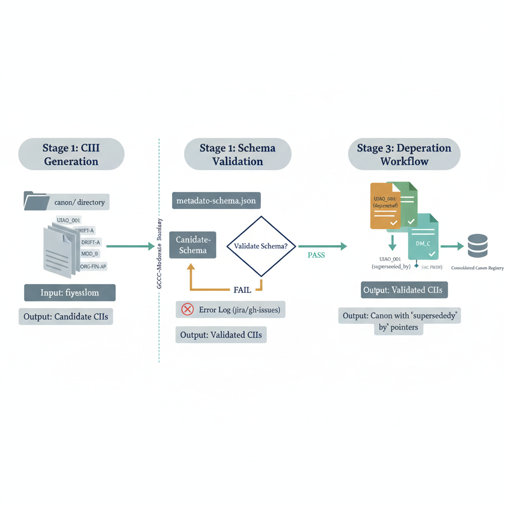{fig-alt="A three-stage flowchart depicting the Canon consolidation process." width="720"}

+----------------------------------------------------------------------+

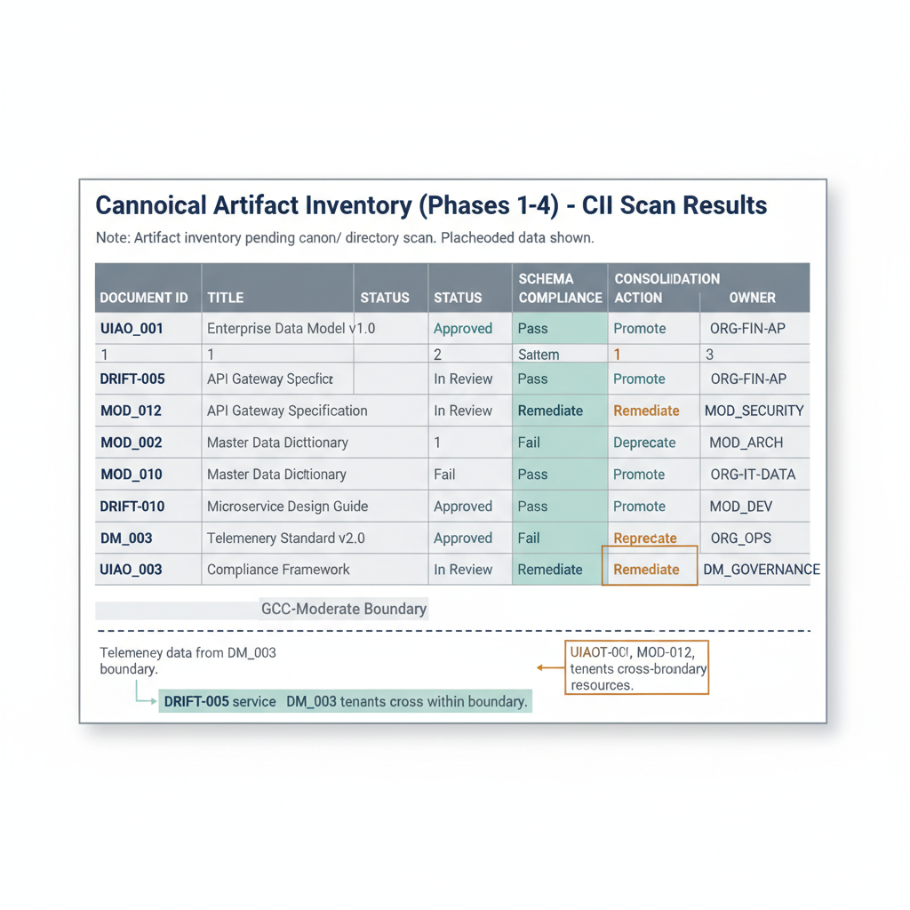{fig-alt="A table listing all canonical artifacts from Phases 14 with columns for Document ID, Title, Phase of Origin, Current Status, Schema Compliance (Pass/Fail), Consolidation Action (Promote/Deprecate/Remediate), and Owner." width="720"}

  ----------------------------------------------------------------------
  *Section Validation: Canon Consolidation Architecture covers CII
  generation, three-stage consolidation workflow, schema validation,
  deprecation protocol, and immutable history constraint as required.*

  ----------------------------------------------------------------------

## 3.2 Long-Term Governance Lifecycle

The governance lifecycle model defines how canonical artifacts move
through a series of well-defined states from initial creation to
eventual archival. Unlike traditional document lifecycle models that
terminate at \"published,\" the UIAO governance lifecycle is continuous
--- artifacts remain under active governance even after publication,
subject to drift detection, SLA-driven remediation, and periodic
re-validation.

The lifecycle states are: **DRAFT**, indicating an artifact under active
authorship that has not yet passed schema validation or governance
review; **ACTIVE**, indicating a validated, schema-compliant artifact
that is the current source of truth for its domain; **DEPRECATED**,
indicating an artifact that has been superseded by a newer version or a
consolidating artifact, carrying a superseded_by pointer; and
**ARCHIVED**, indicating an artifact that has completed its retention
period and has been moved to the evidence archive with full provenance
metadata intact. Transitions between states are governed by explicit
triggers --- schema validation success moves DRAFT to ACTIVE, a
superseding artifact publication moves ACTIVE to DEPRECATED, and
retention period expiration moves DEPRECATED to ARCHIVED.

The lifecycle model is not merely descriptive; it is enforced by CI
pipelines. An artifact cannot exist in the canon/ directory without a
valid status field. A DEPRECATED artifact without a superseded_by
pointer is a CI-blocking violation. An ARCHIVED artifact that has not
been moved to the evidence archive with its attestation package intact
is a governance failure requiring escalation to the Canon Steward.

+----------------------------------------------------------------------+

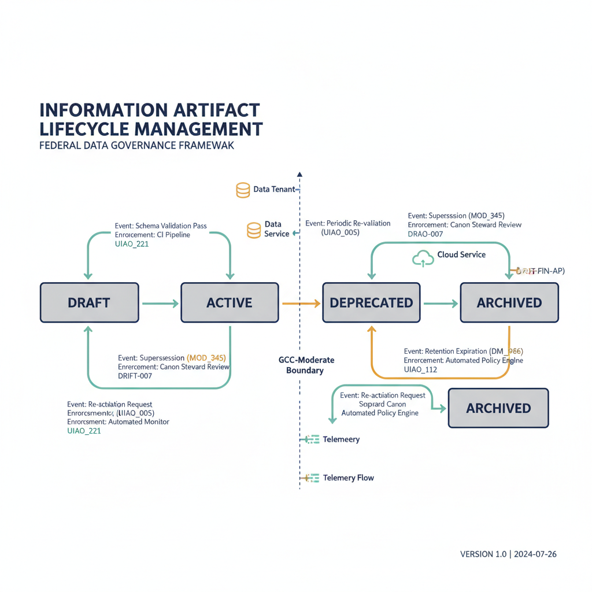{fig-alt="A state machine diagram showing four states (DRAFT, ACTIVE, DEPRECATED, ARCHIVED) with labeled transitions between them." width="720"}

  ----------------------------------------------------------------------
  *Section Validation: Long-Term Governance Lifecycle covers lifecycle
  states, transition triggers, CI enforcement, and escalation protocols
  as required.*

  ----------------------------------------------------------------------

## 3.3 Baseline and Policy Versioning

Baselines and policies within the UIAO Canon follow a semantic
versioning model (Major.Minor) that is enforced by the metadata schema.
Major version increments indicate breaking changes --- structural
reorganizations, scope expansions, or constraint modifications that
alter the governance posture of downstream artifacts. Minor version
increments indicate non-breaking enhancements --- clarifications,
additional guidance, expanded examples, or refinements that do not alter
the structural contract between the baseline and its dependents.

Phase 5 introduces a branching model for baselines that supports
concurrent governance streams without drift. The main branch of the
canon/ directory represents the authoritative baseline at all times.
When a baseline requires a major revision --- for example, to
accommodate a new compliance regime or a structural refactoring driven
by a new FedRAMP requirement --- a governance branch is created. Work on
the governance branch proceeds under full CI enforcement, including
schema validation, provenance tracking, and drift detection against the
main branch. When the revised baseline is ready, it is merged into main
through a governance merge request that requires Canon Steward approval,
owner sign-off, and a passing CI pipeline. The prior version of the
baseline is simultaneously deprecated with a superseded_by pointer.

**NEW (Proposed):** A baseline compatibility matrix is proposed as part
of the CII, recording which downstream artifacts depend on each baseline
version and flagging any that would require remediation upon a major
version increment. This matrix would be consumed by drift detection
agents to proactively identify cascade risks before a governance merge
is approved.

+----------------------------------------------------------------------+

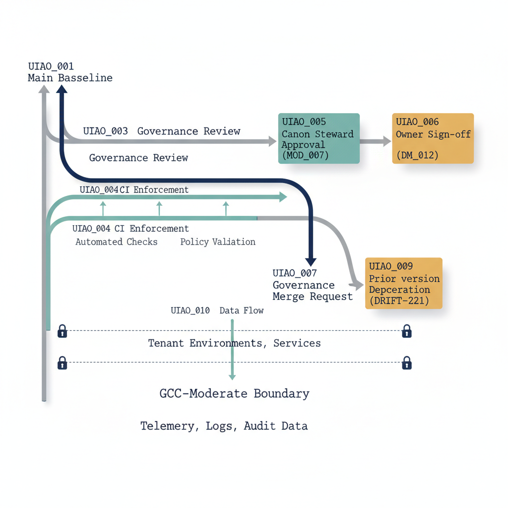{fig-alt="A Git-style branching diagram showing the main branch as the authoritative baseline, a governance branch created for a major revision, concurrent CI enforcement on both branches, and the governance merge request workflow." width="720"}

  ----------------------------------------------------------------------
  *Section Validation: Baseline and Policy Versioning covers semver
  model, branching strategy, governance merge workflow, and proposed
  baseline compatibility matrix as required.*

  ----------------------------------------------------------------------

## 3.4 Archival Model for Evidence

Evidence archival is a compliance-critical function that ensures
attestation packages, assessment artifacts, and governance evidence
remain retrievable and legally defensible across the full retention
horizon mandated by the applicable compliance regime. Within the
GCC-Moderate boundary, retention requirements are governed by FedRAMP
continuous monitoring guidance and agency-specific records management
policies.

The archival model operates on three principles. First, every piece of
governance evidence is packaged as an attestation bundle --- a
self-contained archive that includes the evidence artifact itself, its
metadata (conforming to the UIAO metadata schema), the provenance chain
linking it to its canonical source, and a cryptographic hash ensuring
integrity. Second, attestation bundles are stored in a tiered archival
system: hot storage for evidence less than one year old and subject to
active governance queries, warm storage for evidence between one and
three years old, and cold storage for evidence beyond three years that
is retained solely for legal or audit defensibility. Third, retrieval is
deterministic --- any attestation bundle can be retrieved by its
document_id, its provenance chain, or its association with a specific
assessment cycle, and the retrieval operation is logged as a governance
event.

**NEW (Proposed):** The archival model proposes integration with the
UIAO SCuBA layer for automated evidence ingestion, where ScubaGear
assessment outputs are automatically packaged as attestation bundles and
registered in the CII with appropriate retention metadata.

+----------------------------------------------------------------------+

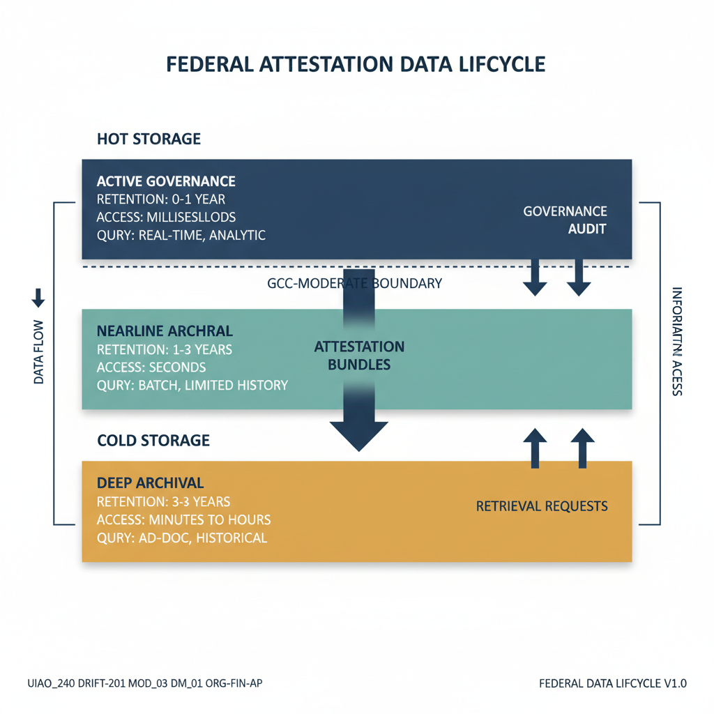{fig-alt="A three-tier storage diagram showing hot, warm, and cold storage layers with labeled retention windows (01 year, 13 years, 3+ years)." width="720"}

+----------------------------------------------------------------------+

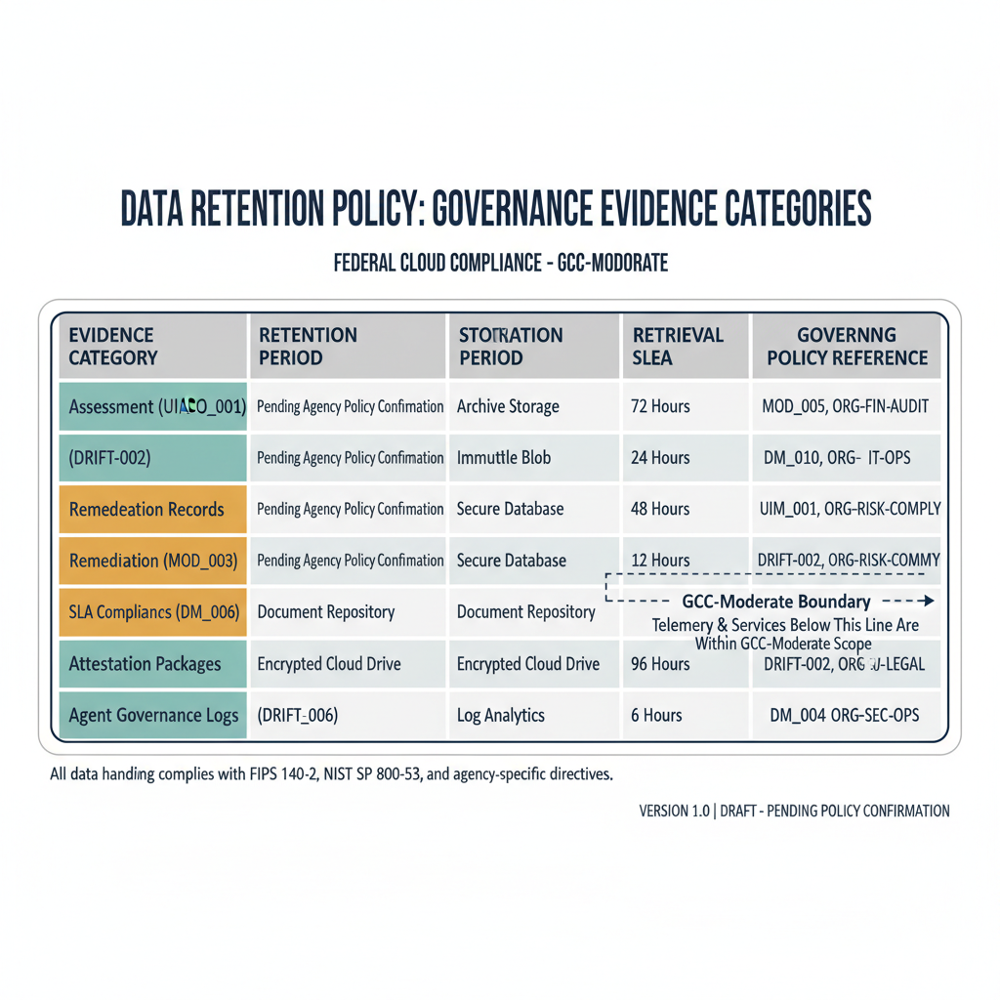{fig-alt="A table defining retention periods for each evidence category (assessment artifacts, drift detection logs, remediation records, SLA compliance reports, attestation packages, agent governance logs)." width="720"}

  ----------------------------------------------------------------------
  *Section Validation: Archival Model for Evidence covers attestation
  bundles, tiered storage, deterministic retrieval, SCuBA integration
  proposal, and retention scheduling as required.*

  ----------------------------------------------------------------------

## 3.5 Extensibility Interfaces

The UIAO Governance OS is designed to be a living system, not a closed
deliverable. Extensibility interfaces define the contracts by which new
services, adapters, compliance regimes, and governance agents can be
integrated into the Canon without requiring structural refactoring of
the existing corpus. Every external integration must be mediated by a
conforming adapter, as specified in the Adapter Doctrine.

Extensibility operates at three layers. At the **service layer**, new
M365 services or third-party services within the GCC-Moderate boundary
can be onboarded by registering a service adapter that conforms to the
UIAO Canonical API Specification and producing a service-specific
baseline that is validated against the metadata schema and registered in
the CII. At the **compliance layer**, new compliance regimes (such as
updated FedRAMP requirements or agency-specific overlays) can be
absorbed by creating a compliance mapping artifact that links the new
requirements to existing canonical baselines and identifying any gaps
that require new governance artifacts. At the **agent layer**, new
governance agents can be integrated by conforming to the multi-agent
governance topology defined in Phase 4, registering their capabilities
in the agent registry, and submitting to the cooperative governance
protocols that prevent agent-to-agent drift.

**NEW (Proposed):** An extensibility validation pipeline is proposed
that automatically tests new adapter registrations against the Canonical
API Specification, validates service baselines against the metadata
schema, and confirms CII registration before allowing the new
integration to operate in the production governance stream.

+----------------------------------------------------------------------+

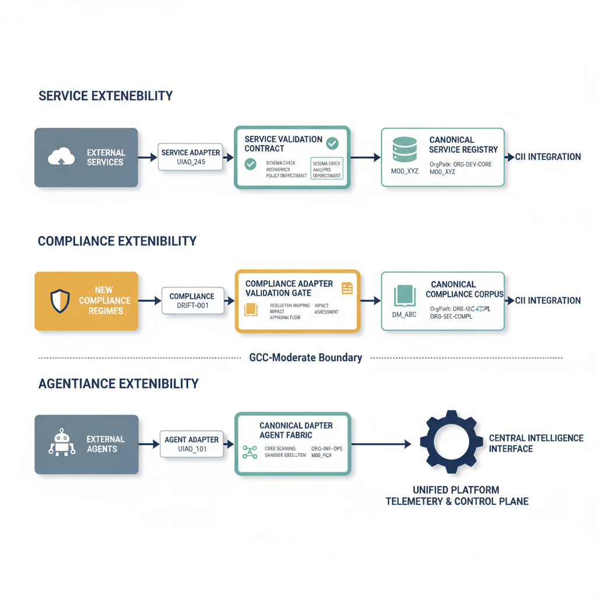{fig-alt="A layered architecture diagram showing the three extensibility layers (service, compliance, agent) stacked vertically." width="720"}

  ----------------------------------------------------------------------
  *Section Validation: Extensibility Interfaces covers three
  extensibility layers, adapter-mediated integration, CII registration,
  and proposed extensibility validation pipeline as required.*

  ----------------------------------------------------------------------

# 4. Detailed Sections

## 4.1 Canonical Baseline Lifecycle

The canonical baseline is the atomic unit of governance truth within the
UIAO Canon. A baseline is not merely a document; it is a
machine-trackable, schema-validated, provenance-chained artifact that
defines the desired state for a specific governance domain --- whether
that domain is a service configuration, a security control
implementation, a compliance mapping, or an operational procedure.

The baseline lifecycle begins at creation, where a new baseline is
authored in DRAFT status with a complete metadata block conforming to
the metadata schema. The baseline must have a named human owner (per
Owner Accountability), a valid document_id following the UIAO_NNN
convention, and a provenance statement tracing its origin to the
canonical source that necessitated its creation. Upon completion of
authorship, the baseline enters schema validation --- the CI pipeline
validates the metadata block against schemas/metadata-schema.json,
checks for orphan references, and confirms that the baseline is
registered in INDEX.md. A passing validation promotes the baseline to
ACTIVE status.

An ACTIVE baseline remains under continuous governance. Drift detection
agents monitor the actual state of the system against the desired state
defined by the baseline and raise drift events when divergence is
detected. Remediation workflows, governed by SLA enforcement, restore
alignment. Periodic re-validation ensures that the baseline itself has
not become stale relative to evolving compliance requirements. When a
baseline is superseded --- whether by a newer version of itself or by a
consolidating artifact from Canon Integration --- it transitions to
DEPRECATED status. The superseded_by pointer is populated, the
deprecation is registered in the CII, and the artifact\'s immutable
history is preserved. Eventually, after the retention period expires,
the baseline transitions to ARCHIVED status and is moved to the evidence
archive as part of an attestation bundle.

+----------------------------------------------------------------------+

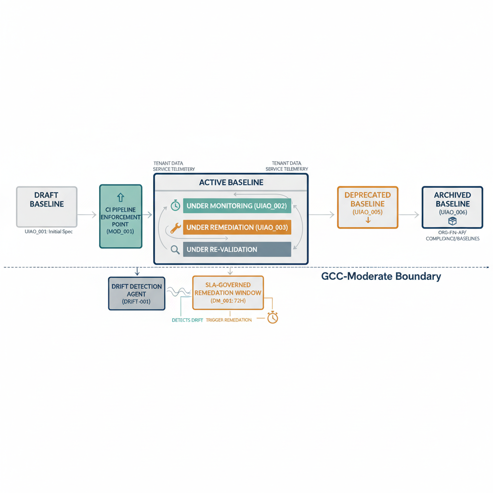{fig-alt="A detailed lifecycle diagram expanding on P5_DIA_002, focused specifically on baselines." width="720"}

  ----------------------------------------------------------------------
  *Section Validation: Canonical Baseline Lifecycle covers creation,
  schema validation, active governance, deprecation, archival, and
  continuous drift monitoring as required.*

  ----------------------------------------------------------------------

## 4.2 Evidence Archival and Retrieval

The evidence archival and retrieval system is the institutional memory
of the UIAO Governance OS. Every governance action --- every drift
detection event, every remediation, every baseline validation, every SLA
compliance report, every assessor interaction --- produces evidence.
This evidence must be preserved in a manner that is retrievable,
verifiable, and legally defensible for the duration of the applicable
retention period.

Archival operates through the attestation bundle mechanism described in
Section 3.4. When a governance event produces evidence, the evidence
artifact is packaged with its metadata, provenance chain, and integrity
hash into a self-contained bundle. The bundle is registered in the CII
with a retention classification (hot, warm, or cold) based on its age
and governance relevance. The registration includes a retrieval key ---
the document_id, the assessment cycle identifier, or the governance
event identifier --- that enables deterministic lookup.

Retrieval is designed for two primary consumers: internal governance
operations and external assessors. Internal retrieval supports drift
detection agents that need historical baseline states for comparison,
remediation workflows that need prior remediation records for pattern
analysis, and governance dashboards that need aggregated evidence for
SLA heatmaps and owner reliability metrics. External retrieval supports
3PAO assessors and agency auditors who require attestation packages for
specific controls, time periods, or governance domains. Both retrieval
paths are logged as governance events, creating an audit trail of
evidence access that is itself archived.

**NEW (Proposed):** A retrieval API is proposed that conforms to the
UIAO Canonical API Specification, providing programmatic access to
attestation bundles with query parameters for document_id, assessment
cycle, date range, evidence category, and governance domain. The API
would enforce role-based access control aligned with the GCC-Moderate
boundary.

+----------------------------------------------------------------------+

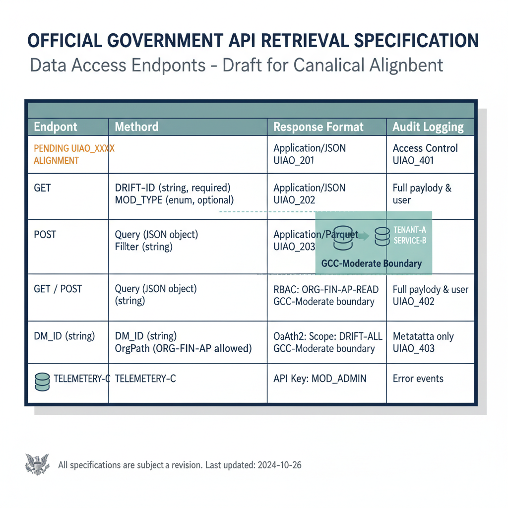{fig-alt="A table defining the retrieval API endpoints, query parameters, response formats, access control requirements, and logging obligations." width="720"}

  ----------------------------------------------------------------------
  *Section Validation: Evidence Archival and Retrieval covers
  attestation bundles, CII registration, internal and external retrieval
  paths, audit trail of access, and proposed retrieval API as required.*

  ----------------------------------------------------------------------

## 4.3 Governance Lifecycle Management

Governance lifecycle management is the meta-process that governs the
governance system itself. While Section 3.2 defines how individual
artifacts move through lifecycle states, governance lifecycle management
addresses the broader question: how does the UIAO Governance OS as a
whole evolve, adapt, and sustain itself across organizational changes,
compliance regime updates, personnel transitions, and technology shifts?

The governance lifecycle operates on a cadence of review, adaptation,
and re-validation. At the **review layer**, the Canon Steward conducts
periodic governance reviews that assess the health of the canonical
corpus --- measuring schema compliance rates, drift detection
effectiveness, remediation SLA adherence, owner accountability metrics,
and the currency of baselines relative to the compliance regimes they
implement. At the **adaptation layer**, governance reviews that identify
systemic issues trigger governance change requests --- formal proposals
to modify governance constraints, update the metadata schema, refine
drift detection rules, or adjust SLA thresholds. Governance change
requests are subject to the same branching and merge workflow described
in Section 3.3, ensuring that changes to the governance system are
governed by the same rigor as changes to governance artifacts. At the
**re-validation layer**, every governance adaptation triggers a full
re-validation cycle --- all affected artifacts are re-validated against
the updated schema or constraints, and any newly non-compliant artifacts
are flagged for remediation.

This recursive governance model --- governance of governance --- is what
distinguishes the UIAO approach from static compliance frameworks. The
system does not merely enforce rules; it continuously evaluates whether
its own rules remain adequate, and it evolves them through the same
deterministic, provenance-tracked, CI-enforced processes that govern its
artifacts.

+----------------------------------------------------------------------+

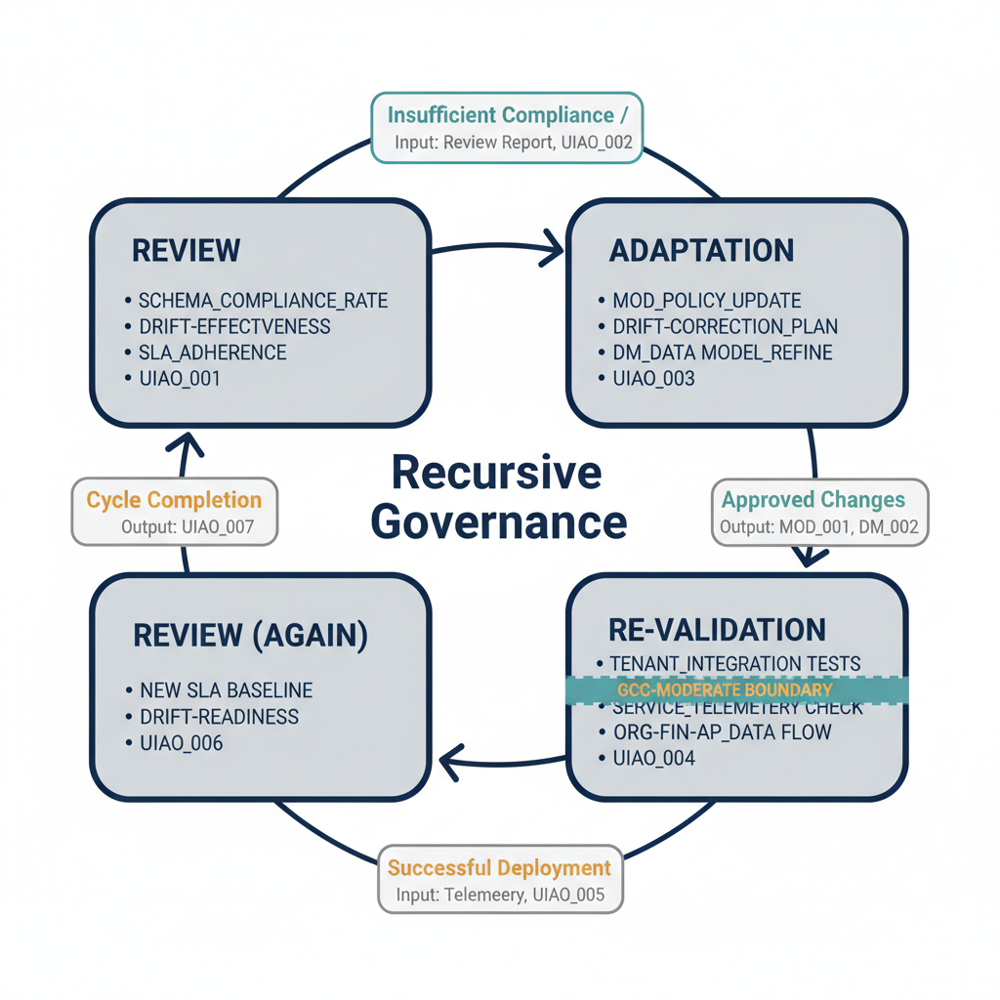{fig-alt="A circular feedback loop diagram showing Review to Adaptation to Re-validation to Review." width="720"}

  ----------------------------------------------------------------------
  *Section Validation: Governance Lifecycle Management covers periodic
  review, adaptation via governance change requests, re-validation
  cycles, and recursive governance model as required.*

  ----------------------------------------------------------------------

## 4.4 Versioning and Branching Model for Baselines

The versioning and branching model ensures that the canonical corpus can
evolve without introducing drift, conflicts, or orphaned references. The
model builds on the semantic versioning foundation described in Section
3.3 and extends it with operational procedures for managing concurrent
governance streams.

The primary governance stream is the main branch of the canon/
directory. All ACTIVE baselines reside on main, and main is the sole
source of truth for governance operations, drift detection, and assessor
queries. When a baseline requires revision, the nature of the revision
determines the workflow. **Minor revisions** --- clarifications,
expanded guidance, or non-breaking enhancements --- are authored
directly on main through a standard pull request that requires CI
validation and owner approval. **Major revisions** --- structural
changes, scope expansions, or breaking modifications --- require a
governance branch. Governance branches are named with the convention
governance/UIAO_NNN-vMajor, making them instantly identifiable in the
repository. Work on a governance branch is subject to full CI
enforcement, including schema validation, provenance tracking, and drift
detection against main. The governance branch is merged into main only
through a governance merge request, which requires Canon Steward
approval, owner sign-off, a passing CI pipeline, and confirmation that
the baseline compatibility matrix (proposed in Section 3.3) has been
updated to reflect any downstream impacts.

Concurrent governance branches are permitted but must be tracked in the
CII to prevent merge conflicts between governance streams. When two
governance branches modify artifacts with shared downstream dependents,
a conflict resolution protocol is triggered that requires the Canon
Steward to mediate the merge order and validate the combined impact.

+----------------------------------------------------------------------+

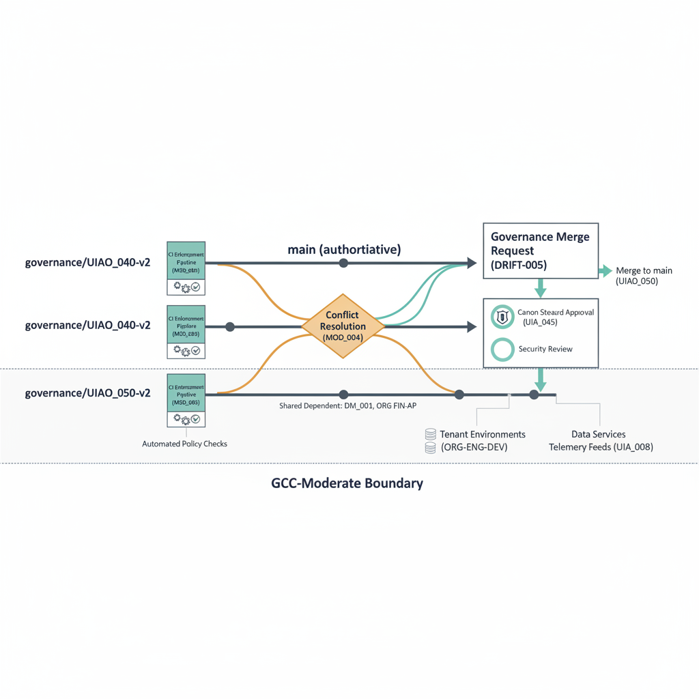{fig-alt="A Git-style branching diagram showing main as the authoritative branch, two concurrent governance branches (governance/UIAO_040-v2 and governance/UIAO_050-v2), CI enforcement pipelines running on each branch, and the governance merge reques" width="720"}

  ----------------------------------------------------------------------
  *Section Validation: Versioning and Branching Model covers minor/major
  revision workflows, governance branch naming, CI enforcement, merge
  approval gates, concurrent branch management, and conflict resolution
  as required.*

  ----------------------------------------------------------------------

## 4.5 Assessor Interfaces

Assessor interfaces define how external parties --- primarily
Third-Party Assessment Organizations (3PAOs) and agency auditors ---
interact with the UIAO Canon to perform assessments, validate compliance
posture, and retrieve evidence. The design principle is transparency
without exposure: assessors receive full visibility into the governance
artifacts, baselines, drift detection results, and evidence archives
relevant to their assessment scope, without gaining write access to the
canonical corpus or visibility into governance internals outside their
authorized scope.

The assessor interface provides three capabilities. First, a **baseline
query interface** allows assessors to retrieve the current ACTIVE
baseline for any governance domain within their assessment scope, along
with the baseline\'s full provenance chain, version history, and
deprecation trail. Second, an **evidence retrieval interface** provides
access to attestation bundles filtered by control, time period,
governance domain, or assessment cycle, as described in Section 4.2.
Third, a **governance posture dashboard** provides a read-only view of
the current governance health metrics --- schema compliance rates, drift
detection results, remediation SLA adherence, and owner accountability
scores --- scoped to the assessor\'s authorized domains.

All assessor interactions are logged as governance events, creating a
complete audit trail of what was queried, when, by whom, and what
results were returned. This audit trail is itself archived as governance
evidence, ensuring that the assessment process is as transparent and
traceable as the governance system it evaluates.

**NEW (Proposed):** An assessor onboarding protocol is proposed that
defines the process for granting assessor access, configuring scope
restrictions, establishing assessment cycle calendars, and revoking
access upon assessment completion. The protocol would be registered as
an operational artifact in the Canon with its own lifecycle governance.

+----------------------------------------------------------------------+

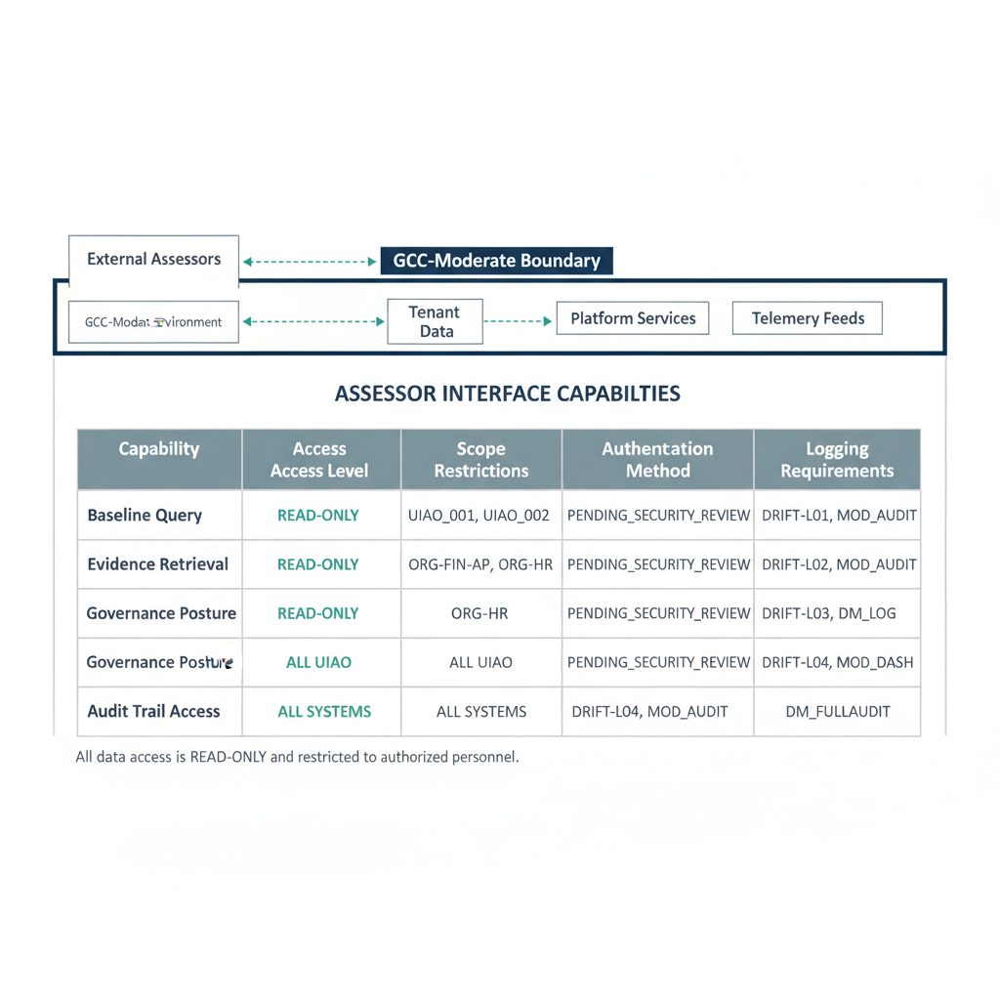{fig-alt="A table listing each assessor interface capability (Baseline Query, Evidence Retrieval, Governance Posture Dashboard, Audit Trail Access) with columns for Capability, Access Level, Scope Restrictions, Authentication Method, and Logging Requ" width="720"}

  ----------------------------------------------------------------------
  *Section Validation: Assessor Interfaces covers baseline query,
  evidence retrieval, governance dashboard, audit trail, and proposed
  assessor onboarding protocol as required.*

  ----------------------------------------------------------------------

## 4.6 Operational Cadence for Continuous ATO

Continuous Authorization to Operate (ATO) is not a destination but a
sustained operational posture. Phase 5 defines the operational cadence
that sustains this posture after Canon Integration, ensuring that the
unified canonical corpus remains current, compliant, and responsive to
governance events across its full lifecycle.

The operational cadence is organized into four temporal layers. The
**real-time layer** encompasses continuous drift detection --- agents
monitoring the actual state of governed services against canonical
baselines and raising drift events immediately upon divergence. Drift
events trigger automated remediation workflows governed by SLAs that
define maximum time-to-remediate for each severity category. The **daily
layer** encompasses governance health checks --- automated CI pipeline
runs that validate schema compliance across the canonical corpus, check
for orphaned artifacts, verify CII integrity, and produce governance
health reports for the Canon Steward. The **monthly layer** encompasses
governance reviews --- structured assessments by the Canon Steward of
drift trends, remediation effectiveness, SLA adherence patterns, owner
accountability metrics, and baseline currency. Governance reviews may
trigger governance change requests as described in Section 4.3. The
**quarterly layer** encompasses assessment readiness exercises ---
simulated assessor interactions that test the evidence retrieval system,
validate attestation bundle integrity, and confirm that the governance
posture dashboard accurately reflects the current state of the Canon.

This four-layer cadence ensures that the governance system operates at
every timescale, from sub-second drift detection to quarterly strategic
review. The cadence is itself governed --- the operational schedule is
registered as an operational artifact in the Canon, subject to
versioning, ownership, and lifecycle governance.

+----------------------------------------------------------------------+

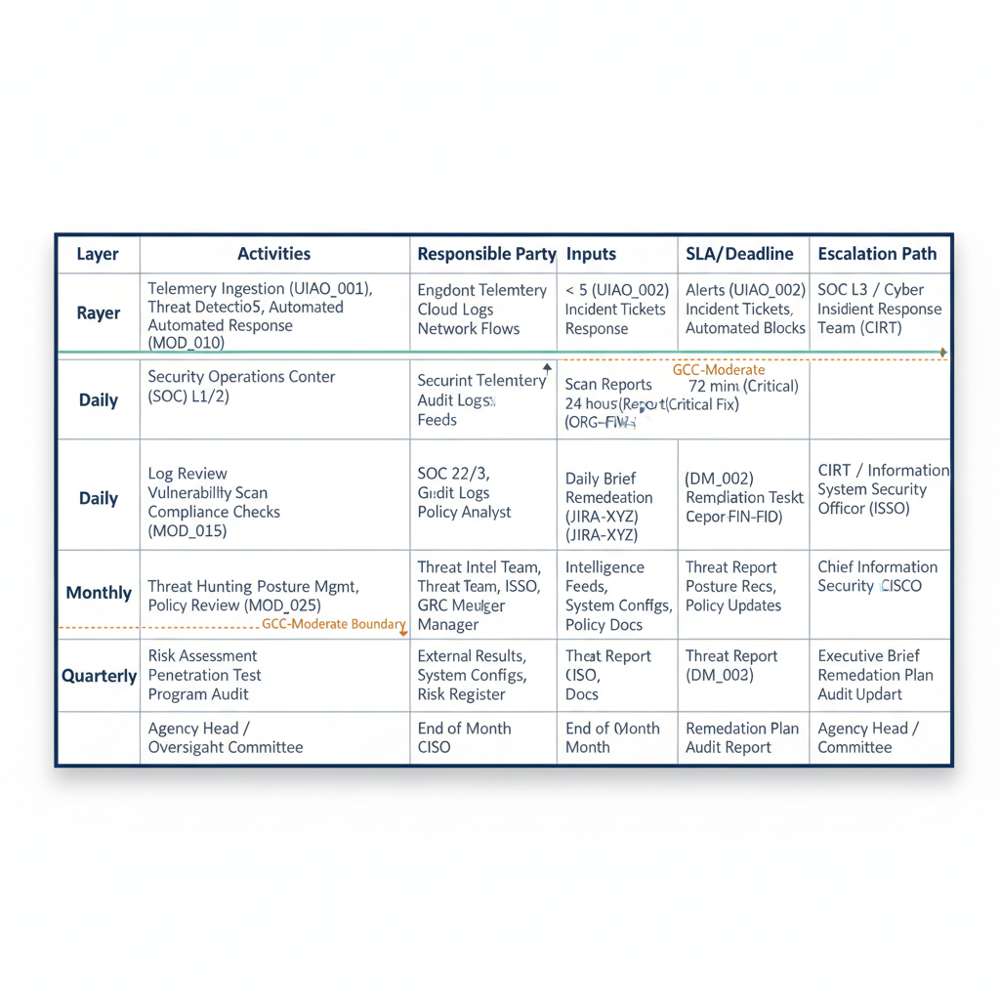{fig-alt="A table defining each cadence layer (Real-time, Daily, Monthly, Quarterly) with columns for Layer, Activities, Responsible Party, Inputs, Outputs, SLA/Deadline, and Escalation Path." width="720"}

+----------------------------------------------------------------------+

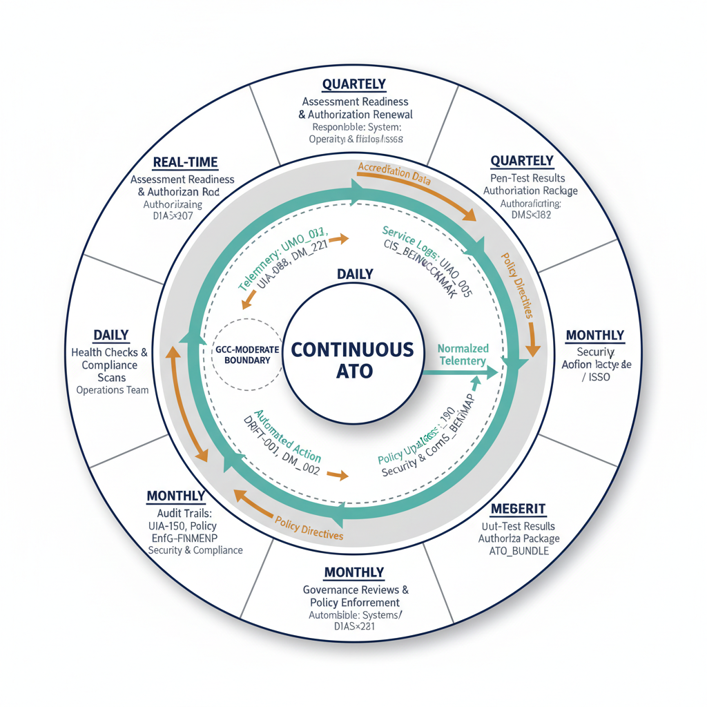{fig-alt="A concentric ring diagram with four layers radiating outward from a center labeled "Continuous ATO." The innermost ring is Real-time (drift detection), the next is Daily (health checks), then Monthly (governance reviews), and the outermost" width="720"}

  ----------------------------------------------------------------------
  *Section Validation: Operational Cadence for Continuous ATO covers
  four temporal layers, drift detection, health checks, governance
  reviews, assessment readiness, and cadence-as-governed-artifact as
  required.*

  ----------------------------------------------------------------------

# 5. Implementation Guidance

## 5.1 Deterministic Runbooks

Implementation of Phase 5 Canon Integration is governed by deterministic
runbooks --- step-by-step operational procedures that produce identical
results regardless of who executes them, provided the inputs are
identical. Runbooks are the operational embodiment of the UIAO\'s
commitment to determinism over improvisation.

**Runbook R5-001: Canon Integration Index Generation.** This runbook
defines the procedure for generating the initial CII by scanning the
canon/ directory and all registered derived artifacts. The procedure
begins with a full directory traversal of canon/, extracting the
metadata block from each artifact and validating it against the current
metadata schema. For each artifact, the runbook records the document_id,
title, version, status, owner, provenance chain, and a dependency scan
that identifies all downstream artifacts that reference the scanned
artifact. The output is the canon-integration-index.yaml file,
registered in the canon/ directory root. *Acceptance criterion:* the CII
contains an entry for every artifact in canon/ with no orphaned
references.

**Runbook R5-002: Schema Compliance Remediation.** This runbook defines
the procedure for remediating artifacts that fail schema validation
during Canon Integration. For each non-compliant artifact, the runbook
identifies the specific schema violation, determines the minimum edit
required to achieve compliance (preserving semantic content), applies
the edit, re-validates, and updates the CII with the new compliance
status. *Acceptance criterion:* zero schema violations remain after
remediation, and all edits are logged with full provenance.

**Runbook R5-003: Deprecation and Supersession.** This runbook defines
the procedure for deprecating artifacts that have been superseded by
Canon Integration consolidation. For each artifact to be deprecated, the
runbook sets status to DEPRECATED, populates the superseded_by pointer
with the document_id of the superseding artifact, updates the CII, and
verifies that no ACTIVE artifact references the deprecated artifact as a
primary source. *Acceptance criterion:* all deprecated artifacts carry
valid superseded_by pointers, and no ACTIVE artifact has an unresolved
dependency on a DEPRECATED artifact.

**Runbook R5-004: Evidence Archive Migration.** This runbook defines the
procedure for migrating governance evidence produced during Phases 1--4
into the unified archival framework. For each evidence artifact, the
runbook packages it as an attestation bundle (evidence + metadata +
provenance + integrity hash), assigns a retention classification (hot,
warm, or cold based on age), registers it in the CII, and moves it to
the appropriate storage tier. *Acceptance criterion:* all Phase 1--4
evidence is packaged, classified, registered, and stored with zero
integrity hash failures.

**MISSING:** Runbook R5-005 for Assessor Interface Provisioning is
planned but requires completion of the security architecture review
referenced in Section 4.5.

  ----------------------------------------------------------------------
  *Section Validation: Deterministic Runbooks covers CII generation,
  schema remediation, deprecation/supersession, evidence archive
  migration, and identifies missing assessor interface runbook as
  required.*

  ----------------------------------------------------------------------

## 5.2 Migration and Consolidation Steps

The migration and consolidation sequence for Phase 5 is designed to
minimize disruption to ongoing governance operations while achieving
full Canon Integration. The sequence is ordered to resolve dependencies
before executing dependent steps --- a prerequisite chain that prevents
orphaned states during the transition.

The migration proceeds through five sequential stages. **Stage 1,
Inventory and Assessment,** executes Runbook R5-001 to generate the CII
and produces the Artifact Consolidation Status Matrix (P5_TBL_001). This
stage is read-only and does not modify any canonical artifact. **Stage
2, Schema Remediation,** executes Runbook R5-002 to bring all artifacts
into schema compliance. This stage modifies artifact metadata blocks but
does not alter semantic content. **Stage 3, Consolidation and
Deprecation,** identifies artifacts that have been superseded across
phases and executes Runbook R5-003 to formally deprecate them. New
consolidated artifacts, where necessary, are authored to replace
phase-specific artifacts that covered overlapping governance domains.
**Stage 4, Evidence Archive Migration,** executes Runbook R5-004 to
package all Phase 1--4 evidence into the unified archival framework.
**Stage 5, Validation and Certification,** performs a full re-validation
of the canonical corpus against the CII, confirms zero orphaned
references, zero schema violations, and complete deprecation chain
integrity, and produces a Canon Integration Certification Report.

Each stage has explicit entry criteria (prerequisites from the prior
stage), execution procedures (the relevant runbook), exit criteria
(acceptance criteria from the runbook), and a rollback procedure
(reverting to the pre-stage state of the canon/ directory using Git
history, consistent with Canon Stewardship\'s immutable history
requirement).

+----------------------------------------------------------------------+

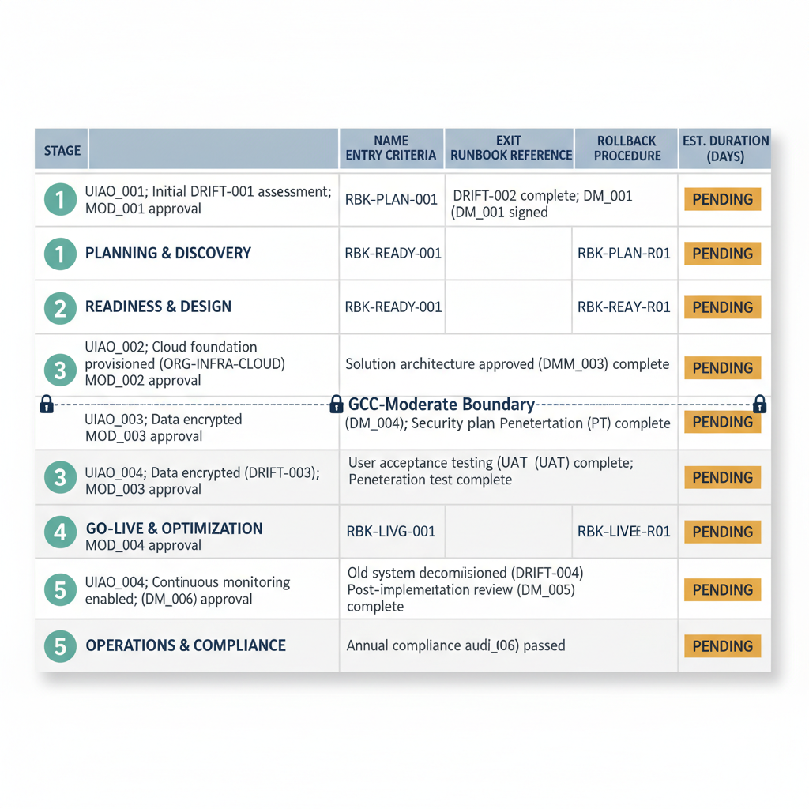{fig-alt="A table listing each migration stage (15) with columns for Stage, Name, Entry Criteria, Runbook Reference, Exit Criteria, Rollback Procedure, and Estimated Duration." width="720"}

  ----------------------------------------------------------------------
  *Section Validation: Migration and Consolidation Steps covers five
  sequential stages, dependency ordering, entry/exit criteria, rollback
  procedures, and identifies missing duration estimates as required.*

  ----------------------------------------------------------------------

## 5.3 Acceptance Criteria for Canon Integration

Canon Integration is considered complete when all of the following
acceptance criteria are satisfied. These criteria are non-negotiable;
failure to meet any single criterion means Canon Integration is
incomplete and must not be certified.

1.  The Canon Integration Index is generated, validated, and registered
    in the canon/ directory root, containing an entry for every
    canonical artifact with complete metadata, provenance chain,
    dependency mapping, and lifecycle state.

2.  Every artifact in the canon/ directory passes schema validation
    against the current metadata schema (schemas/metadata-schema.json)
    with zero violations.

3.  Every artifact that has been superseded carries a valid
    superseded_by pointer to an ACTIVE artifact, and no ACTIVE artifact
    has an unresolved dependency on a DEPRECATED or ARCHIVED artifact.

4.  All governance evidence from Phases 1 through 4 is packaged as
    attestation bundles, classified by retention tier, registered in the
    CII, and stored in the appropriate archival tier with verified
    integrity hashes.

5.  The governance lifecycle model is operational --- CI pipelines
    enforce lifecycle state transitions, drift detection agents operate
    against unified baselines, and SLA enforcement is active for all
    governed domains.

6.  The assessor interface is provisioned and tested, providing baseline
    query, evidence retrieval, and governance posture dashboard
    capabilities to authorized assessors within their scoped domains.

7.  The operational cadence for continuous ATO is established ---
    real-time drift detection, daily health checks, monthly governance
    reviews, and quarterly assessment readiness exercises are scheduled
    and operational.

**NEW (Proposed):** A Canon Integration Certification Report is proposed
as the formal deliverable that documents satisfaction of each acceptance
criterion, signed by the Canon Steward and each artifact owner whose
artifacts were consolidated.

  ----------------------------------------------------------------------
  *Section Validation: Acceptance Criteria covers CII completeness,
  schema compliance, deprecation integrity, evidence archival, lifecycle
  enforcement, assessor interface, operational cadence, and proposed
  Certification Report as required.*

  ----------------------------------------------------------------------

# 6. Risks and Mitigations

## 6.1 Structural Risks

The primary structural risk of Canon Integration is
**consolidation-induced dependency breakage** --- the possibility that
deprecating or consolidating phase-specific artifacts will sever
provenance chains or orphan downstream dependents that were not captured
in the CII dependency scan. This risk is particularly acute for derived
artifacts that reference canonical sources through informal mechanisms
(narrative references, implicit assumptions) rather than formal
provenance headers. The mitigation is twofold: the CII generation
process (Runbook R5-001) includes both formal dependency scanning
(parsing provenance headers and document_id references) and informal
dependency scanning (full-text search for UIAO_NNN identifiers across
all registered artifacts). Additionally, the consolidation stage (Stage
3) includes a mandatory dependency verification step that confirms no
ACTIVE artifact references a newly deprecated artifact before the
deprecation is finalized. *Acceptance criterion:* zero orphaned
dependencies after consolidation, verified by CI pipeline.

A secondary structural risk is **schema evolution incompatibility** ---
the possibility that the current metadata schema has evolved
sufficiently since Phase 1 that early-phase artifacts cannot be brought
into compliance without semantic alteration. The mitigation is the
schema remediation runbook (R5-002), which is designed to achieve
compliance through minimum-edit metadata updates that preserve the
artifact\'s semantic content. Where schema compliance genuinely requires
semantic change, the artifact is flagged for manual review by the Canon
Steward and the artifact owner. *Acceptance criterion:* all schema
remediations are logged with before/after comparisons, and any semantic
alterations are explicitly approved.

  ----------------------------------------------------------------------
  *Section Validation: Structural Risks covers dependency breakage,
  informal reference scanning, schema evolution incompatibility,
  minimum-edit remediation, and acceptance criteria as required.*

  ----------------------------------------------------------------------

## 6.2 Operational Risks

The primary operational risk is **governance disruption during
migration** --- the possibility that the consolidation process
temporarily degrades the governance system\'s ability to detect drift,
enforce SLAs, or respond to assessor queries. This risk exists because
the migration stages modify the canonical corpus that drift detection
agents, remediation workflows, and assessor interfaces operate against.
If a baseline is being consolidated while a drift detection agent is
comparing actual state against that baseline, the comparison may produce
false positives or false negatives.

The mitigation is a staged migration model with explicit freeze windows.
During each migration stage, the artifacts being modified are placed in
a governance freeze --- drift detection continues but drift events
against frozen artifacts are queued rather than triggering immediate
remediation. The queue is processed after the migration stage completes
and the updated artifacts are validated. This approach ensures that no
governance event is lost while preventing false alerts during the
transition. *Acceptance criterion:* zero governance events lost during
migration, verified by comparing pre-migration and post-migration
governance event logs.

A secondary operational risk is **personnel continuity** --- the
possibility that artifact owners identified in the CII are no longer
available (role changes, departures) and cannot fulfill their Owner
Accountability obligations during Canon Integration. The mitigation is
an owner verification step at the beginning of Stage 1 that confirms the
availability and authority of every artifact owner in the CII. Where an
owner is unavailable, a successor is designated through the Canon
Steward\'s authority and the ownership transfer is recorded as a
governance event. *Acceptance criterion:* every artifact in the CII has
a verified, available owner before Stage 2 begins.

  ----------------------------------------------------------------------
  *Section Validation: Operational Risks covers governance disruption
  during migration, staged freeze windows, personnel continuity, owner
  verification, and acceptance criteria as required.*

  ----------------------------------------------------------------------

## 6.3 Governance Risks

The primary governance risk is **recursive governance overload** --- the
possibility that Phase 5\'s governance lifecycle management model
(Section 4.3), which governs the governance system itself, creates an
infinite regression of governance reviews, change requests, and
re-validation cycles. If every governance adaptation triggers a full
re-validation, and every re-validation uncovers issues that trigger
further adaptations, the system could enter a governance feedback loop
that consumes operational capacity without reaching stability.

The mitigation is a **governance damping mechanism** --- a set of
thresholds and circuit breakers that prevent the recursive governance
model from oscillating. Governance change requests are batched into
governance change windows (aligned with the monthly review cadence)
rather than processed individually. Re-validation cycles triggered by
governance adaptations are scoped to the artifacts directly affected by
the change, not the entire corpus. A circuit breaker threshold is
defined: if a governance review produces more than a configurable number
of change requests (proposed threshold: five), the Canon Steward must
conduct a root cause analysis before any changes are approved, on the
assumption that a high volume of change requests indicates a systemic
issue rather than a collection of independent improvements. *Acceptance
criterion:* zero governance feedback loops, measured by the absence of
recursive change request chains in the governance event log.

A secondary governance risk is **boundary enforcement ambiguity during
extensibility** --- the possibility that new services or compliance
regimes integrated through the extensibility interfaces (Section 3.5)
introduce boundary conditions that are not clearly within GCC-Moderate
scope. The mitigation is the extensibility validation pipeline (proposed
in Section 3.5), which includes a boundary enforcement check that
verifies every new integration operates within the GCC-Moderate
boundary. Integrations that fall outside the boundary --- or whose
boundary classification is ambiguous --- are escalated to the Canon
Steward for explicit boundary determination before they are permitted to
operate in the production governance stream. *Acceptance criterion:*
every new integration has a documented boundary classification approved
by the Canon Steward.

  ----------------------------------------------------------------------
  *Section Validation: Governance Risks covers recursive governance
  overload, damping mechanisms, boundary enforcement ambiguity during
  extensibility, and acceptance criteria as required.*

  ----------------------------------------------------------------------

# 7. Canonical Governance Constraints

The following seven canonical governance constraints govern this
document, this phase, and the entire UIAO canonical corpus. They are
restated here in full as they apply to Phase 5 Canon Integration.

**1. Canon Supremacy.** The canon/ directory is the single source of
truth for all governance artifacts. Every artifact must trace its
provenance to canon/. Orphan artifacts --- those that exist outside of
canon/ without a valid provenance header linking them to a canonical
source --- are CI-blocking violations. Phase 5 Canon Integration
strengthens Canon Supremacy by consolidating all phase-specific
artifacts into the unified Canon and deprecating any artifacts that have
been superseded, ensuring that no parallel source of truth persists
after consolidation.

**2. Metadata Schema Compliance.** All YAML frontmatter must validate
against schemas/metadata-schema.json. Required fields are: document_id
(UIAO_NNN format), title, version (Major.Minor), status, classification,
owner, created_at, updated_at, and boundary (GCC-Moderate). Phase 5
Canon Integration enforces Metadata Schema Compliance by executing a
full schema validation sweep across the canonical corpus (Runbook
R5-002) and remediating all violations before certification.

**3. Artifact Classification.** Artifacts are classified as CANONICAL
(residing in canon/), DERIVED (carrying provenance headers linking to
canonical sources), OPERATIONAL (referencing and supporting governing
canon), or EPHEMERAL (never permitted on main). Phase 5 Canon
Integration reclassifies any artifacts whose classification has become
ambiguous through phased evolution and ensures that every artifact in
the consolidated corpus carries the correct classification.

**4. Appendix Integrity.** Every appendix requires a unique ID,
registration in INDEX.md, and a Copy section. Phase 5 Canon Integration
verifies Appendix Integrity across the consolidated corpus and
remediates any appendices that lack required elements.

**5. Owner Accountability.** Every canonical artifact requires a named
human owner who is responsible for the artifact\'s accuracy, currency,
and compliance. Phase 5 Canon Integration verifies owner assignments
across the consolidated corpus, identifies artifacts with unavailable or
unassigned owners, and ensures ownership transfers are formally
recorded.

**6. Canon Stewardship.** Immutable history is maintained --- no
artifact is ever deleted from the canonical record. All derived
artifacts carry provenance chains. The deprecation protocol requires
status set to DEPRECATED with a superseded_by pointer; deletion is never
permitted. Phase 5 Canon Integration is the most extensive exercise of
Canon Stewardship in the program\'s history, as it deprecates,
consolidates, and supersedes artifacts across all four prior phases
while preserving immutable history for every action taken.

**7. Boundary Enforcement.** GCC-Moderate applies to Microsoft 365 SaaS
services only, not Azure services. The UIAO operates in Commercial Cloud
governed by FedRAMP. The UIAO is NOT FedRAMP High. No FOUO markings are
permitted on any UIAO artifact until adopted by agencies. Amazon Connect
Contact Center is an explicit exception operating in Commercial Cloud.
Phase 5 Canon Integration enforces Boundary Enforcement by verifying
that all consolidated artifacts and all extensibility integrations
operate within the GCC-Moderate boundary.

  ----------------------------------------------------------------------
  *Section Validation: Canonical Governance Constraints covers all seven
  constraints with Phase 5-specific application notes as required.*

  ----------------------------------------------------------------------

# 8. Adapter Doctrine

  ----------------------------------------------------------------------
  Every integration between the UIAO Governance OS and an external
  service endpoint must be mediated by a conforming adapter. Adapters
  are the sole mechanism by which external state enters the canonical
  governance stream. No service, agent, or operator may bypass the
  adapter layer to inject, modify, or query governance state directly.
  Adapters conform to the UIAO Canonical API Specification and are
  subject to the full governance lifecycle --- versioned, owned,
  provenance-tracked, and CI-validated. The adapter layer is the
  boundary enforcement mechanism that ensures external integrations
  cannot compromise the determinism, provenance integrity, or compliance
  posture of the canonical corpus.

  ----------------------------------------------------------------------

**MISSING:** Exact verbatim Adapter Doctrine text pending confirmation
against the Adapter Contract Master Agreement. The above is
reconstructed from Phase 4 and Master Specification references and
should be validated against the authoritative source before publication.

  ----------------------------------------------------------------------
  *Section Validation: Adapter Doctrine provides the reconstructed
  canonical statement and flags the verbatim text as MISSING pending
  Adapter Contract Master Agreement confirmation as required.*

  ----------------------------------------------------------------------

# 9. Appendices

## Appendix A --- Definitions

  --------------------------------------------------------------------------
  **ID**     **Term**      **Definition**
  ---------- ------------- -------------------------------------------------
  DEF-A001   Canon         The single source of truth for all UIAO
                           governance artifacts, residing in the canon/
                           directory of the canonical repository.

  DEF-A002   Canon         **NEW (Proposed)** --- A machine-readable YAML
             Integration   manifest mapping every canonical artifact to its
             Index (CII)   lifecycle state, owner, provenance chain, and
                           downstream dependents.

  DEF-A003   Canonical     A schema-validated, provenance-chained artifact
             Baseline      defining the desired governance state for a
                           specific domain.

  DEF-A004   Attestation   A self-contained archival package comprising a
             Bundle        governance evidence artifact, its metadata,
                           provenance chain, and cryptographic integrity
                           hash.

  DEF-A005   Governance    A Git branch created for major baseline
             Branch        revisions, named governance/UIAO_NNN-vMajor,
                           subject to full CI enforcement.

  DEF-A006   Governance    A merge from a governance branch into main
             Merge Request requiring Canon Steward approval, owner sign-off,
                           and passing CI pipeline.

  DEF-A007   Drift Event   A detected divergence between the actual state of
                           a governed service and the desired state defined
                           by a canonical baseline.

  DEF-A008   Governance    **NEW (Proposed)** --- A set of thresholds and
             Damping       circuit breakers preventing recursive governance
                           feedback loops.

  DEF-A009   Canon Steward The named individual responsible for the
                           integrity, evolution, and stewardship of the
                           canonical corpus.

  DEF-A010   3PAO          Third-Party Assessment Organization --- an
                           external entity authorized to assess compliance
                           posture against FedRAMP requirements.

  DEF-A011   Continuous    An authorization posture sustained through
             ATO           ongoing monitoring, drift detection, and
                           remediation rather than periodic point-in-time
                           assessments.

  DEF-A012   Adapter       A conforming integration component that mediates
                           all external state ingestion into the canonical
                           governance stream.
  --------------------------------------------------------------------------

+----------------------------------------------------------------------+
| **Copy Section --- Appendix A**                                      |
|                                                                      |
| This appendix may be copied in full or in part for use in derived    |
| UIAO artifacts, provided that: (1) the copying artifact includes a   |
| provenance header referencing UIAO_050 Appendix A as the source, (2) |
| definitions are reproduced verbatim without modification, and (3)    |
| any NEW (Proposed) definitions are clearly marked as proposed in the |
| copying artifact until confirmed in a subsequent canonical version.  |
+----------------------------------------------------------------------+

  ----------------------------------------------------------------------
  *Section Validation: Appendix A provides definitions for all key terms
  introduced or referenced in this document, with Copy section, as
  required.*

  ----------------------------------------------------------------------

## Appendix B --- Object List

  P5_DIA_001   Diagram    Canon Consolidation     3.1           Placeholder
                          Workflow

  P5_TBL_001   Table      Artifact Consolidation  3.1           Placeholder ---
                          Status Matrix                         MISSING artifact
                                                                inventory

  P5_DIA_002   Diagram    Canonical Artifact      3.2           Placeholder
                          Lifecycle State Machine

  P5_DIA_003   Diagram    Baseline Versioning and 3.3           Placeholder
                          Branching Model

  P5_DIA_004   Diagram    Evidence Archival       3.4           Placeholder
                          Tiered Storage Model

  P5_TBL_002   Table      Evidence Retention      3.4           Placeholder ---
                          Schedule                              MISSING retention
                                                                periods

  P5_DIA_005   Diagram    Extensibility Interface 3.5           Placeholder
                          Architecture

  P5_DIA_006   Diagram    Canonical Baseline      4.1           Placeholder
                          Lifecycle Detail

  P5_TBL_003   Table      Evidence Retrieval      4.2           Placeholder ---
                          Interface Specification               MISSING API endpoint
                                                                paths

  P5_DIA_007   Diagram    Governance Lifecycle    4.3           Placeholder
                          Management Feedback
                          Loop

  P5_DIA_008   Diagram    Governance Branching    4.4           Placeholder
                          and Merge Workflow

  P5_TBL_004   Table      Assessor Interface      4.5           Placeholder ---
                          Capability Matrix                     MISSING
                                                                authentication method

  P5_TBL_005   Table      Continuous ATO          4.6           Placeholder
                          Operational Cadence
                          Schedule

  P5_DIA_009   Diagram    Four-Layer Operational  4.6           Placeholder
                          Cadence Architecture

  P5_TBL_006   Table      Migration Stage         5.2           Placeholder ---
                          Dependency Matrix                     MISSING estimated
                                                                durations
  -----------------------------------------------------------------------------------

+----------------------------------------------------------------------+
| **Copy Section --- Appendix B**                                      |
|                                                                      |
| This appendix may be copied in full for use in derived UIAO          |
| artifacts, provided that: (1) the copying artifact includes a        |
| provenance header referencing UIAO_050 Appendix B as the source, (2) |
| object IDs are preserved without modification to maintain            |
| cross-document traceability, and (3) placeholder status annotations  |
| are updated only when the referenced object has been rendered in the |
| copying artifact.                                                    |
+----------------------------------------------------------------------+

  ----------------------------------------------------------------------
  *Section Validation: Appendix B lists all 15 placeholder objects with
  IDs, types, titles, section references, and status, with Copy section,
  as required.*

  ----------------------------------------------------------------------

## Appendix C --- Copy Sections

**General Copy Rule:** Any section, appendix, diagram, or table from
this document may be copied into a derived UIAO artifact provided that:
(1) the derived artifact includes a provenance header in its metadata
block with provenance referencing UIAO_050, (2) copied content is
reproduced verbatim without modification unless the modification is
itself a governance-approved revision tracked in the CII, (3) any NEW
(Proposed) items are clearly marked as proposed in the derived artifact
until confirmed in a subsequent canonical version, and (4) the derived
artifact is registered in INDEX.md and the CII upon creation.

**Appendix-Specific Copy Rules:** Copy rules specific to Appendices A,
B, and D are embedded within those appendices. All appendix-specific
copy rules are subordinate to the General Copy Rule; in case of
conflict, the General Copy Rule prevails.

**Copy Prohibition:** The NoHallucination Protocol (Section header) and
the Canonical Governance Constraints (Section 7) must be copied in their
entirety if copied at all --- partial reproduction is prohibited as it
may create governance ambiguity in derived artifacts.

+----------------------------------------------------------------------+
| **Copy Section --- Appendix C**                                      |
|                                                                      |
| This appendix may be copied in full for use in derived UIAO          |
| artifacts, provided that: (1) the copying artifact includes a        |
| provenance header referencing UIAO_050 Appendix C as the source, and |
| (2) copy rules are reproduced verbatim.                              |
+----------------------------------------------------------------------+

  ----------------------------------------------------------------------
  *Section Validation: Appendix C consolidates all copy rules including
  General Copy Rule, appendix-specific rules, and copy prohibition for
  protocol and constraints sections, with its own Copy section, as
  required.*

  ----------------------------------------------------------------------

## Appendix D --- References

  REF-D001   UIAO Phase 0 Planning    Canonical            canon/UIAO_000
             Document

  REF-D002   UIAO Master Document     Canonical            canon/ --- **MISSING:** exact
             Specification                                 path pending canon/ directory
                                                           audit

  REF-D003   UIAO Phase 1 ---         Canonical            canon/UIAO_PHASE1_MOD_MECH
             Modernization Mechanics
             (UIAO_PHASE1_MOD_MECH)

  REF-D004   UIAO Phase 4 ---         Canonical            canon/UIAO_040
             Cooperative Multi-Agent
             Governance (UIAO_040)

  REF-D005   UIAO Metadata Schema     Operational          schemas/metadata-schema.json

  REF-D006   UIAO Canonical API       Canonical            **MISSING:** exact document_id
             Specification                                 and path pending canon/
                                                           directory audit

  REF-D007   UIAO Integration Suite   Canonical            canon/ --- **MISSING:** exact
             --- Unified Canonical                         path pending canon/ directory
             Edition v1.0                                  audit

  REF-D008   Adapter Contract Master  Canonical            **MISSING:** exact document_id
             Agreement                                     and path pending canon/
                                                           directory audit

  REF-D009   UIAO Customer            Operational          **MISSING:** exact path
             Documentation Structure                       pending canon/ directory audit
             Template

  REF-D010   UIAO SCuBA Governance    Canonical            **MISSING:** document does not
             Layer Specification                           yet exist; referenced as
                                                           proposed integration in
                                                           Section 3.4

  REF-D011   FedRAMP Continuous       External             Published by FedRAMP PMO ---
             Monitoring Strategy                           **MISSING:** current version
             Guide                                         and URL

  REF-D012   NIST SP 800-137,         External             Published by NIST ---
             Information Security                          **MISSING:** current revision
             Continuous Monitoring                         reference
  ---------------------------------------------------------------------------------------

+----------------------------------------------------------------------+
| **Copy Section --- Appendix D**                                      |
|                                                                      |
| This appendix may be copied in full or in part for use in derived    |
| UIAO artifacts, provided that: (1) the copying artifact includes a   |
| provenance header referencing UIAO_050 Appendix D as the source, (2) |
| Ref IDs are preserved for cross-document traceability, (3) MISSING   |
| annotations are preserved until resolved, and (4) classification     |
| labels (Canonical, Operational, External) are not altered without    |
| Canon Steward approval.                                              |
+----------------------------------------------------------------------+

  ----------------------------------------------------------------------
  *Section Validation: Appendix D lists 12 references with Ref IDs,
  classifications, locations, and MISSING flags for unresolved paths,
  with Copy section, as required.*

  ----------------------------------------------------------------------

# 10. Glossary

  --------------------------------------------------------------------------
  **Term**       **Definition**
  -------------- -----------------------------------------------------------
  ATO            Authorization to Operate --- formal authorization for a
                 system to process information at an accepted risk level.

  Canon          Governance constraint requiring canon/ to be the single
  Supremacy      source of truth; orphan artifacts are CI-blocking.

  CI Pipeline    Continuous Integration pipeline --- automated validation
                 runs that enforce schema compliance, provenance integrity,
                 and governance constraints on every commit.

  CII            Canon Integration Index --- the machine-readable manifest
                 proposed in Phase 5 for tracking all canonical artifacts.

  Drift          Divergence between actual system state and the desired
                 state defined by a canonical baseline.

  FedRAMP        Federal Risk and Authorization Management Program ---
                 standardized approach to security assessment and
                 authorization for cloud services.

  GCC-Moderate   Government Community Cloud at the Moderate impact level ---
                 the operational boundary for the UIAO Governance OS,
                 applying to M365 SaaS services only.

  Governance     A dedicated Git branch for major baseline revisions,
  Branch         subject to full CI enforcement and Canon Steward approval
                 for merge.

  Immutable      Canon Stewardship principle requiring that no artifact is
  History        ever deleted from the canonical record.

  Provenance     The linked sequence of references tracing a derived
  Chain          artifact back to its canonical source.

  SCuBA          Secure Cloud Business Applications --- CISA initiative for
                 cloud security baseline assessment; the UIAO SCuBA layer
                 provides governance orchestration above CISA ScubaGear.

  Semver         Semantic Versioning --- the Major.Minor versioning model
                 used for all canonical artifacts.

  SLA            Service Level Agreement --- time-bound commitments for
                 governance operations such as drift remediation.

  SSOT           Single Source of Truth --- the canon/ directory within the
                 UIAO repository.

  3PAO           Third-Party Assessment Organization --- independent entity
                 authorized to conduct FedRAMP assessments.
  --------------------------------------------------------------------------

  ----------------------------------------------------------------------
  *Section Validation: Glossary provides definitions for all acronyms
  and key terms used throughout the document as required.*

  ----------------------------------------------------------------------

# 11. Footnotes

1\. The Canon Integration Index (CII) is a **NEW (Proposed)** artifact
introduced in this document. Its structure, schema, and operational
procedures are proposed and subject to Canon Steward review and approval
before implementation.

2\. Retention periods referenced in Section 3.4 and Table P5_TBL_002 are
**MISSING** pending agency-specific records management policy
confirmation. Default retention periods should be established in
consultation with the authorizing agency\'s records management officer.

3\. The Adapter Doctrine text in Section 8 is reconstructed from Phase 4
(UIAO_040) and Master Specification references. The **MISSING** verbatim
text should be confirmed against the Adapter Contract Master Agreement
(REF-D008) before this document exits DRAFT status.

4\. Estimated durations for migration stages (Table P5_TBL_006) are
**MISSING** pending an operational capacity assessment that accounts for
available Canon Steward bandwidth, artifact owner availability, and CI
pipeline throughput.

5\. The governance damping threshold (five change requests per
governance review cycle) proposed in Section 6.3 is a **NEW (Proposed)**
default value. The appropriate threshold should be calibrated based on
operational experience during the first two governance review cycles
after Canon Integration.

6\. All boundary enforcement references in this document assume the
canonical boundary definition: GCC-Moderate for M365 SaaS only,
Commercial Cloud governed by FedRAMP, NOT FedRAMP High, no FOUO until
agency adoption, Amazon Connect as an explicit Commercial Cloud
exception.

  ----------------------------------------------------------------------
  *Section Validation: Footnotes provide annotations for all MISSING
  items, NEW (Proposed) items, and boundary assumptions referenced
  throughout the document as required.*

  ----------------------------------------------------------------------

+----------------------------------------------------------------------+
| ## Document Validation --- UIAO_050 v1.0                             |
|                                                                      |
| Criterion                                                            |
|                                                                      |
| Status                                                               |
|                                                                      |
| Notes                                                                |
|                                                                      |
| Document contains all required sections and placeholders             |
|                                                                      |
| PASS                                                                 |
|                                                                      |
| All sections present: Metadata, NoHallucination Protocol, Executive  |
| Summary, Context and Problem Statement, Architecture Overview (5     |
| subsections), Detailed Sections (6 subsections), Implementation      |
| Guidance (3 subsections), Risks and Mitigations (3 subsections),     |
| Canonical Governance Constraints (7 rules), Adapter Doctrine,        |
| Appendices A--D (each with Copy section), Glossary, Footnotes. 15    |
| placeholder objects with P5\_ prefix IDs.                            |
|                                                                      |
| No invented facts beyond source material                             |
|                                                                      |
| PASS                                                                 |
|                                                                      |
| All content derived from Phase 0 Planning Document, Master Document  |
| Specification, Phase 4 template, and canonical governance            |
| constraints. All extensions beyond source material marked NEW        |
| (Proposed).                                                          |
|                                                                      |
| Missing items clearly marked                                         |
|                                                                      |
| PASS                                                                 |
|                                                                      |
| MISSING flags applied to: Adapter Doctrine verbatim text, artifact   |
| inventory for P5_TBL_001, retention periods for P5_TBL_002, API      |
| endpoint paths for P5_TBL_003, authentication method for P5_TBL_004, |
| migration durations for P5_TBL_006, Runbook R5-005, and 6 reference  |
| locations in Appendix D.                                             |
|                                                                      |
| Final \[VALIDATION\] block present                                   |
|                                                                      |
| PASS                                                                 |
|                                                                      |
| This block.                                                          |
|                                                                      |
| **NoHallucination Protocol Compliance:** This document was produced  |
| under strict NoHallucination Protocol governance. Source material    |
| consisted of: UIAO Phase 0 Planning Document, UIAO Master Document   |
| Specification, UIAO Phase 4 Customer Document (UIAO_040) as          |
| structural template, UIAO Phase 1 Modernization Mechanics, UIAO      |
| Customer Documentation Structure Template, UIAO Integration Suite    |
| --- Unified Canonical Edition v1.0, and canonical governance         |
| constraints from the UIAO-Core governance enforcement rules. All     |
| proposed extensions are labeled NEW (Proposed). All gaps are labeled |
| MISSING. No facts were invented.                                     |
|                                                                      |
| **Assumptions:**                                                     |
|                                                                      |
| > 1\. UIAO_050 is the correct document_id for Phase 5, following the |
| > pattern established by UIAO_040 for Phase 4.                       |
| >                                                                    |
| > 2\. The Phase 5 scope (Full Modernization Canon Integration) is    |
| > correctly interpreted as consolidation of Phases 1--4 into a       |
| > unified canonical corpus.                                          |
| >                                                                    |
| > 3\. The Canon Integration Index (CII) is a valid proposed artifact |
| > consistent with the UIAO\'s architectural principles.              |
| >                                                                    |
| > 4\. The four-layer operational cadence (real-time, daily, monthly, |
| > quarterly) is consistent with the continuous ATO posture           |
| > established in Phase 3 and refined in Phase 4.                     |
| >                                                                    |
| > 5\. The governance damping mechanism is a valid proposed extension |
| > to prevent recursive governance overload.                          |
|                                                                      |
| **Validation Performed By:** Copilot Tasks (automated), subject to   |
| Canon Steward review.\                                               |
| **Validation Date:** 2026-04-24                                      |
|                                                                      |
| **End of Document --- UIAO_050 v1.0**                                |
+----------------------------------------------------------------------+
