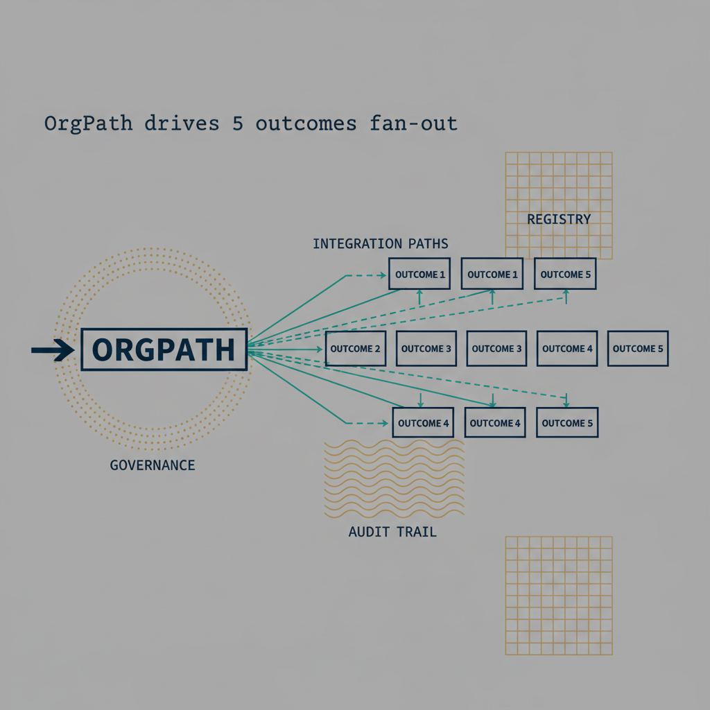
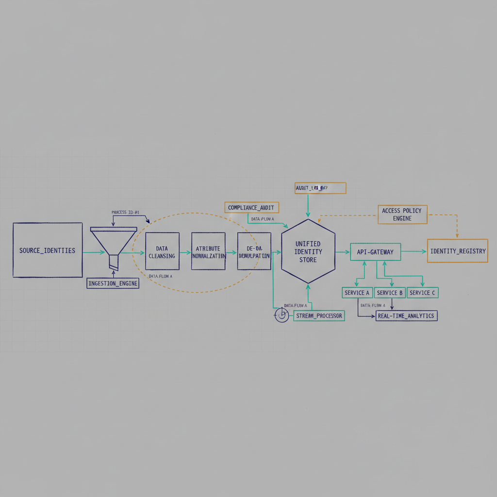
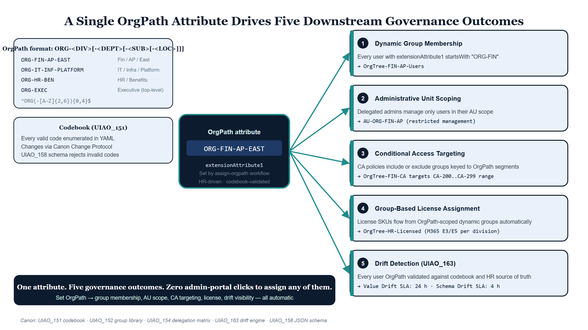
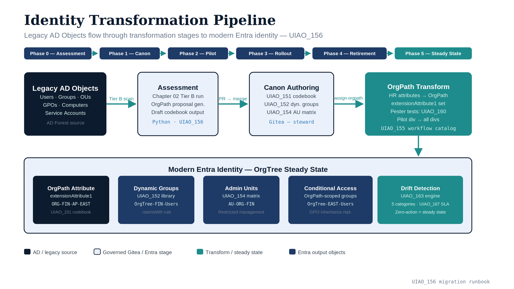

# Chapter 04 — Identity: x.500 Hierarchy → Flat Entra ID + OrgPath {.unnumbered}

{#fig-04-identity-transformation-image-04 fig-alt="OrgPath drives 5 outcomes fan-out. Engineering blueprint style, neutral slate background, federal navy (#1F3A5F) for primary structural elements, teal (#1A9E8F) for secondary/integration elements, amber (#D4A017) for governance/audit/registry overlays, monospace labels for identifiers, no human figures, 16:9 landscape." width="100%"}

{#fig-04-identity-transformation-image-05 fig-alt="Identity transformation pipeline. Engineering blueprint style, neutral slate background, federal navy (#1F3A5F) for primary structural elements, teal (#1A9E8F) for secondary/integration elements, amber (#D4A017) for governance/audit/registry overlays, monospace labels for identifiers, no human figures, 16:9 landscape." width="100%"}


*The OU-tree replacement*

{#fig-04-identity-transformation-image-03 fig-alt="Central labeled node \"OrgPath attribute (CORP/US/EAST/IT)\" with five outbound arrows fanning right to five labeled outcome cards: Dynamic group membership, Conditional Access scoping, Intune policy targeting, Administrative Unit delegation, Reporting and audit slicing. Each arrow labeled with the rule shape it produces. Clean engineering blueprint style, dark navy (#0D1B2E) and teal (#1E8C8C) color scheme on white background. No photographs, purely diagrammatic." width="100%"}

::: {.callout-important title="The identity claim"}
The AD OU tree was never just a folder structure. It encoded delegation,
policy inheritance, operational accountability, and security scope in a
single hierarchical graph. Entra ID is flat and has none of that.

The **OrgTree canon** reconstructs AD's governance properties inside
Entra ID's flat directory using four governed mechanisms — **OrgPath**,
**dynamic groups**, **Administrative Units**, and **Conditional Access
targeting** — stitched together into one deterministic model.

This chapter is how it works.
:::

## The four mechanisms

Entra ID provides individually powerful tools. OrgTree is the framework
that uses them *together* to replace what the OU tree was doing.

| Mechanism | What it replaces | Canon |
|---|---|---|
| **OrgPath attribute** | OU placement | UIAO_151 (codebook) |
| **Dynamic groups** | OU-derived security groups | UIAO_152 (library) |
| **Administrative Units** | OU-level delegation | UIAO_154 (matrix) |
| **Conditional Access targeting** | GPO-based policy inheritance | *(per policy library)* |

Each mechanism is individually documented in Microsoft's reference; the
innovation is **the contract that binds them together** so that a single
act (setting a user's OrgPath) produces consistent downstream effects
(group membership, AU scope, policy targeting, license assignment,
drift-detector visibility).

## OrgPath — the single source of hierarchy

OrgPath is a deterministic, attribute-encoded organizational hierarchy
carried on every governed user (and, where applicable, device and group)
object. It is **not** one composite string in one slot — that was the
retired Model A form. Under Hybrid-C+Path it is two layers over the
codebook's slots.

### The form

The **governance layer** puts one validated facet in each of its own
slots. The three that make up the hierarchy are:

```
extensionAttribute1  Region      e.g. NCR, EASTUS, EMEA
extensionAttribute2  Department  e.g. IT, Finance, HR, Legal
extensionAttribute3  Division    e.g. CyberOps, InfraOps, GRC, Data
```

Each value must appear in that facet's own enumeration in the UIAO_151
codebook; there is no single regex over a composite string, because there
is no composite string to validate. Facets are validated one at a time,
and a bad value is a finding against that facet alone.

The **inheritance layer** is `extensionAttribute15`: a canonical OrgPath
*derived* from those three facets, in that order, every segment
terminated by `|`. It is never hand-authored — it is recomputed on every
stamp, and any stored value that differs from the recomputation is drift.

### Examples

| Facets | Derived `extensionAttribute15` |
|---|---|
| Region NCR · Department Finance · Division GRC | `Region=NCR\|Department=Finance\|Division=GRC\|` |
| Region NCR · Department IT · Division InfraOps | `Region=NCR\|Department=IT\|Division=InfraOps\|` |
| Region EASTUS · Department HR *(no division)* | `Region=EASTUS\|Department=HR\|` |
| Region NCR · Department Executive | `Region=NCR\|Department=Executive\|` |

Composition stops at the first facet with no value, so the derived path
is always a contiguous prefix of the hierarchy — never one with a gap in
the middle.

### What OrgPath drives

A single attribute drives five downstream outcomes:

1. **Dynamic group membership** — every user with
   `extensionAttribute2 -eq "Finance"` is in `OrgTree-FIN-Users`.
2. **Administrative Unit scoping** — the AU `AU-NCR-Finance` scopes on the
   derived path (`extensionAttribute15 -startsWith
   "Region=NCR|Department=Finance|"`); delegated admins of that AU manage
   only those users.
3. **Conditional Access targeting** — CA policies include or exclude
   groups keyed to OrgPath segments.
4. **License assignment** — group-based licensing flows from
   OrgPath-scoped dynamic groups.
5. **Drift detection** — UIAO_163 validates that every user's OrgPath
   exists in the codebook and matches the HR-system source of truth.

One attribute. Five governance outcomes. Zero admin-portal clicks to
assign any of them.

### The codebook (UIAO_151)

UIAO_151 is a YAML file in Gitea that enumerates every valid OrgPath code.
Every code has a description, a parent path, allowed children patterns,
and a max depth. An OrgPath that is not in the codebook is invalid by
definition; the JSON schema (UIAO_158) rejects it at validation time.

The codebook is not freely edited. Changes go through the Canon Change
Protocol (UIAO_172) — PR → review → merge. This preserves OrgPath stability
across time; an OrgPath issued to a user in 2026 means the same thing in
2030.

## Dynamic groups — materializing every subtree

AD computed "who is in the Finance branch?" by walking the OU tree.
Entra ID computes it by evaluating a dynamic-group rule against
`extensionAttribute1`.

### The three query patterns (UIAO_152)

Every OrgPath-governed dynamic group uses one of three patterns. Which one
you need depends on the question, and only the first uses the derived path.

**Pattern 1 — Branch Query (subtree).** Captures everyone at and below a
point in the hierarchy, including levels that do not exist yet. Use
`-startsWith` against the derived OrgPath on `extensionAttribute15`.

```
(user.extensionAttribute15 -startsWith "Region=NCR|Department=Finance|")
```

Produces: every Finance user in the NCR region, across every division under
Finance and any division added later.

Two rules are not optional here. The prefix must be **anchored at
`Region=`** — the derived path is composed region, department, division in
that order, so a prefix beginning at `Department=` matches nothing at all.
And it must carry its **trailing `|`**, or `Department=Finance` would also
capture `Department=FinanceOps` (ADR-127).

**Pattern 2 — Node Query (exact).** Captures users at one specific place in
the hierarchy and nowhere else. This is boolean facet composition on the
governance layer, not a path match.

```
(user.extensionAttribute2 -eq "Finance") and (user.extensionAttribute3 -eq "GRC")
```

Produces: users in Finance/GRC exactly. Each clause validates independently
against its own facet enumeration.

**Pattern 3 — Functional Query (cross-cutting).** Combines a facet with
another attribute for a question that is not about hierarchy position at
all.

```
(user.extensionAttribute2 -eq "IT") and (user.jobTitle -contains "Security")
```

Produces: every IT user whose title includes "Security," in every region.

> Note the shape of Pattern 3: "all of Finance, everywhere" or "all of IT,
> everywhere" is **cross-cutting, not a subtree** — it is a facet predicate
> (`extensionAttribute2 -eq "Finance"`), never a path prefix. Reaching for
> `-startsWith` on the derived path to express it produces a rule that
> silently matches no one.

### Naming convention

Every OrgTree-governed dynamic group follows `OrgTree-[SCOPE]-[PURPOSE]`:

- `OrgTree-FIN-Users` — branch query, Finance subtree
- `OrgTree-IT-SEC-SOC-Users` — SOC analysts
- `OrgTree-HR-Licensed` — HR users targeted for specific SKUs
- `OrgTree-EXEC-CA` — Executive users targeted by specific CA policies

Groups that don't match the pattern are **Phantom Drift** per UIAO_163.
The drift engine finds them; UIAO_167 escalates the cleanup.

## Administrative Units — the delegation replacement

AD delegated OU-level administrative rights via ACLs on the OU object.
Entra ID delegates via Administrative Units — named scopes that contain
users, and against which roles can be assigned.

### The three-tier model (UIAO_154)

UIAO_154 enumerates every AU in a three-tier structure mirroring OrgPath
depth:

| Tier | Scope | AU Pattern | Typical Roles |
|---|---|---|---|
| **Tier 1 — Enterprise** | All governed users | `AU-ORG-Enterprise` | Global Reader, Security Reader |
| **Tier 2 — Division** | All users in one division | `AU-ORG-[DIV]` | User Administrator, Groups Administrator |
| **Tier 3 — Department** | Users in one department | `AU-ORG-[DIV]-[DEPT]` | Helpdesk Administrator, Password Administrator |

The membership rule of each AU is an exact mirror of the corresponding
OrgPath dynamic-group rule. `AU-ORG-FIN` contains exactly the same users
as `OrgTree-FIN-Users`.

### Restricted management

Every OrgTree AU is created with `isMemberManagementRestricted: true`.
That means the only way to manage members is via the governed workflow —
by changing a user's OrgPath. A Global Admin cannot hand-add a user to
an AU to bypass delegation. This is AD's "OU ACL" property, preserved.

### Role assignments

Roles are scoped to AUs, never granted tenant-wide except for break-glass
accounts. The assignment pattern:

```
role:        User Administrator
principal:   OrgTree-FIN-Admins            ← a dynamic group
scope:       /administrativeUnits/AU-ORG-FIN
```

A member of `OrgTree-FIN-Admins` can reset passwords, create groups,
and manage users — but only for users in `AU-ORG-FIN`. Outside that
scope, the role has no effect.

The full role matrix (UIAO_154 §Role Assignment Matrix) is stored in
Gitea. Changes require a PR; Copilot validates that new assignments
respect least-privilege and tier-boundary rules.

## Conditional Access — policy inheritance replacement

GPOs inherited down the OU tree. Conditional Access policies target
groups. The bridge: OrgPath-scoped dynamic groups that match the
OU-inheritance pattern.

Example: a GPO that applied at `OU=East,DC=contoso` configured
lockout policies for all East-region users. The CA equivalent is a CA
policy targeting `OrgTree-EAST-Users` (branch query on `ORG-EAST`).
Users whose OrgPath starts with `ORG-EAST` get the policy; everyone
else doesn't.

More precisely: inheritance is simulated by **group targeting at the
branch level**. CA doesn't inherit through AUs the way GPOs inherited
through OUs; the governance model makes up the difference by having
the branch group include everyone the ancestor GPO would have
targeted.

## HR-driven lifecycle (joiner / mover / leaver)

OrgPath is not a thing admins maintain. It is driven by the HR system.
The lifecycle is:

### Joiner

1. HR system creates the employee record with `orgUnit` + `department`
   + `location` + `manager`.
2. HR → Entra provisioning populates the standard attributes.
3. A governed workflow — `assign-orgpath` — computes the OrgPath from
   HR attributes per UIAO_151's mapping rules and writes it to
   `extensionAttribute1`.
4. Dynamic groups recompute membership within the Entra cadence
   (typically <15 minutes).
5. The user is now an AU member, CA-scoped, group-licensed, and
   visible to the drift engine — all automatically.

### Mover

The employee's HR record changes `department` from `AP` to `BUD`. The
same `assign-orgpath` workflow runs; the OrgPath updates from
`ORG-FIN-AP` to `ORG-FIN-BUD`; every downstream group, AU, CA scope,
and license assignment recomputes automatically. No hand edits; no
ticket; no drift window.

### Leaver

Termination writes a `leaver` attribute that the workflow catches;
the user's OrgPath is set to `ORG-TERMINATED` (or removed); dynamic
groups evict; AU membership drops; CA policy scope drops; license
drops. Provenance points to the HR event that triggered it.

### Workflow catalog (UIAO_155)

Every lifecycle workflow (joiner, mover, leaver, re-hire, contractor
onboard, executive provision, emergency deprovision, name change,
reorg) is enumerated in UIAO_155 with its triggers, inputs, outputs, and
exception paths. There are no undocumented identity workflows.

## Five drift categories (UIAO_163)

The drift detection engine classifies every identity finding into one
of five categories:

| Category | Example |
|---|---|
| **Schema Drift** | A dynamic-group rule references an attribute not in UIAO_151 |
| **Value Drift** | HR says Division `GRC`; the user's `extensionAttribute3` says `Data` |
| **Hierarchy Drift** | An AU references an OrgPath segment no longer in the codebook |
| **Orphan Drift** | A security group exists that isn't in UIAO_152 |
| **Phantom Drift** | UIAO_151 defines `ORG-FIN-TAX-WEST` but zero users match |

Every drift finding opens an SLA ticket per UIAO_167. Standard response
times: Schema (4 hours), Value (24 hours), Hierarchy (4 hours),
Orphan (48 hours), Phantom (7 days).

## Migration (UIAO_156)

{#fig-04-identity-transformation-image-02 fig-alt="Identity transformation pipeline diagram showing the flow: Legacy AD Objects..." width="100%"}


Moving an existing AD forest into the OrgTree model is a phased
runbook, not a flag-day cutover.

### Phase 0 — Assessment

Chapter 02's Tier B assessment run, plus the Python OrgPath proposal
generator. Output: a draft codebook based on actual OU structure.

### Phase 1 — Canon authoring

Steward reviews the draft codebook; edits; commits. UIAO_151 is now
authoritative. UIAO_152 rules and UIAO_154 AUs are authored in parallel.

### Phase 2 — Pilot division

Pick one division (usually IT or Operations), compute its OrgPath
mappings, stage the transformation plan, authorize, deliver. Validate
with Pester tests (UIAO_160). Any drift is fixed before moving on.

### Phase 3 — Division-by-division rollout

Each division gets its own plan, its own review, its own delivery. No
division is rolled out until the previous one's drift findings are
zero.

### Phase 4 — Legacy retirement

Once every user has an OrgPath and every OU has a dynamic-group
equivalent, the OU-based security groups and legacy GPOs are retired
in a governed deprecation pass. This is the only destructive phase;
it requires explicit Steward approval per item.

### Phase 5 — Steady state

The daily assessment produces zero-action plans. The drift engine
reports green. The canon is the operational truth. The forest itself
remains (for DNS, DHCP, Kerberos-bound legacy apps) but is no longer
the governance model.

## Verification

OrgTree migration passes when:

- [ ] Every HR-listed employee has a valid OrgPath in
      `extensionAttribute1`.
- [ ] Every OrgPath in use exists in UIAO_151.
- [ ] Every dynamic group matches one of UIAO_152's three patterns.
- [ ] Every AU's membership rule mirrors its dynamic group's rule.
- [ ] Every CA policy targets only OrgTree-governed groups.
- [ ] UIAO_163 reports zero drift across all five categories.
- [ ] The nightly assessment → plan run produces a zero-action plan.

Only when every box is ticked is the tenant "in OrgTree steady state."

## What this buys the agency

The tangible outcomes, once OrgTree is in place:

- **Delegation is provable.** Audit questions like "who can manage
  Finance users?" have a literal answer in UIAO_154.
- **Reorganizations are cheap.** A division name change propagates
  through codebook + dynamic groups + AUs in one PR.
- **Access reviews have structure.** Rather than reviewing "all
  Finance security groups," reviewers see OrgTree-governed groups
  with clear scope semantics.
- **Compliance queries are cacheable.** "Who has access to
  CUI-tagged resources?" is a dynamic-group query, not a
  spreadsheet reconciliation.
- **Drift is visible before audit.** UIAO_163's findings hit an SLA
  ticket long before they reach a 3PAO's hands.

## Cross-references

- **Canon:** UIAO_151 codebook · UIAO_152 dynamic group library · UIAO_153
  attribute mapping · UIAO_154 delegation matrix · UIAO_155 workflow
  catalog · UIAO_156 migration runbook · UIAO_158 JSON schema ·
  UIAO_163 drift engine · UIAO_175 identity graph normalization.
- **Customer Documents:** [modernization/orgtree.qmd](../../../customer-documents/reference-architecture/orgtree.html)
  · [modernization/codebook.qmd](../../../customer-documents/reference-architecture/codebook.html)
  · [modernization/dynamic-groups.qmd](../../../customer-documents/reference-architecture/dynamic-groups.html)
  · [modernization/delegation.qmd](../../../customer-documents/reference-architecture/delegation.html).
- **Posted:** UIAO Identity Modernization Guide (16,014 words) — the
  v1.0 reference implementation, superseded by MOD canon.

---

**Next:** [Chapter 05 — Policy: GPO → Intune + Conditional Access](05-policy-transformation.html)
