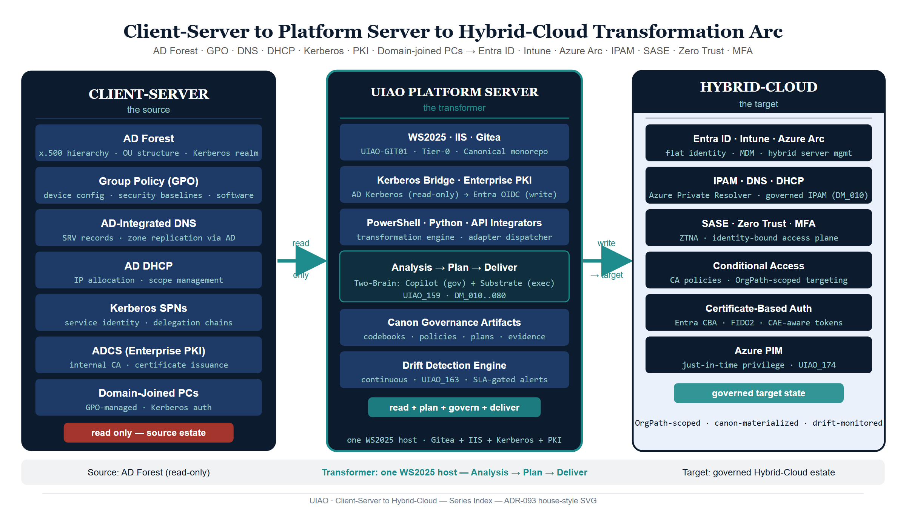
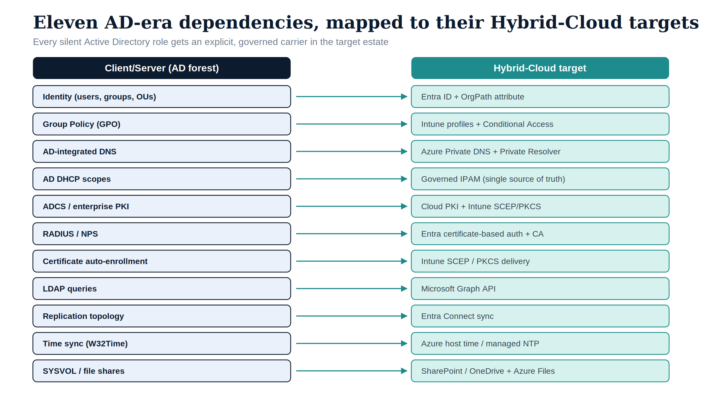
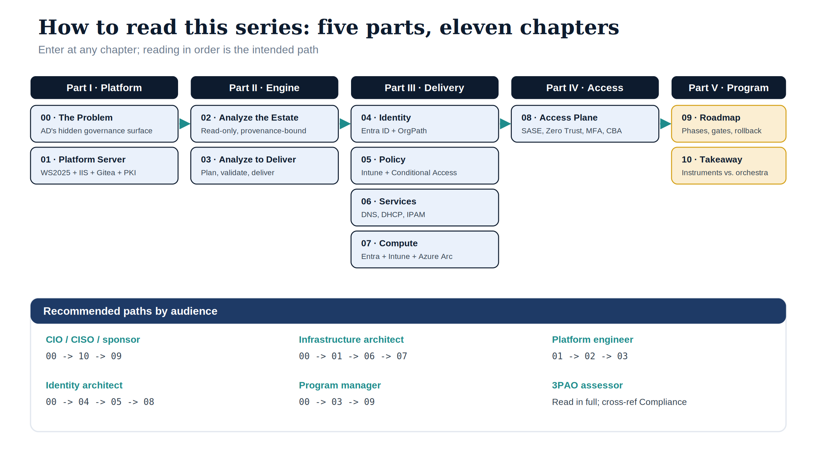

# Microsoft Client-Server to Hybrid-Cloud Transformation {.unnumbered}

::: {.callout-tip}
## Download the full section
**[client-server-to-hybrid-cloud-bundle.docx](client-server-to-hybrid-cloud-bundle.docx)** — every page in this section concatenated into one Word document. Regenerated on every site deploy.
:::

{#fig-index-image-01 fig-alt="Client-Server to Platform Server to Hybrid-Cloud transformation arc (replacing the existing ASCII box diagram). Engineering blueprint style, neutral slate background, federal navy (#1F3A5F) for primary structural elements, teal (#1A9E8F) for secondary/integration elements, amber (#D4A017) for governance/audit/registry overlays, monospace labels for identifiers, no human figures, 16:9 landscape." width="85%"}


An eleven-chapter narrative covering the **entire** UIAO transformation
arc — from the Client/Server-era AD forest that federal agencies inherited,
through the analysis + planning + delivery pipeline that runs on a single
Windows Server 2025 platform host, to the governed Hybrid-Cloud estate of
Entra ID, Intune, Azure Arc, IPAM, SASE, Zero Trust, and MFA.

::: {.callout-important title="Why this series exists"}
Every guide and every runbook in UIAO answers a narrow question. This
series is the only document that answers the big one: *"We have an AD
forest. Where are we going, how do we get there, and what does the
finished state look like?"*
:::

{#fig-index-image-02 fig-alt="Two-column crosswalk table. Left column 'Client/Server (AD forest)' lists eleven AD-era dependencies; each maps via a teal arrow to its 'Hybrid-Cloud target' on the right: Identity to Entra ID plus OrgPath attribute; Group Policy to Intune profiles plus Conditional Access; AD-integrated DNS to Azure Private DNS plus Private Resolver; AD DHCP scopes to governed IPAM; ADCS/enterprise PKI to Cloud PKI plus Intune SCEP/PKCS; RADIUS/NPS to Entra certificate-based auth plus CA; certificate auto-enrollment to Intune SCEP/PKCS delivery; LDAP queries to Microsoft Graph API; replication topology to Entra Connect sync; time sync to Azure host time/managed NTP; SYSVOL/file shares to SharePoint/OneDrive plus Azure Files. Engineering blueprint style, navy and teal on white, no human figures, 16:9 landscape." width="85%"}

## The arc

```
┌─────────────────────┐       ┌──────────────────────────┐       ┌───────────────────────────┐
│ CLIENT-SERVER       │       │ UIAO PLATFORM SERVER     │       │ HYBRID-CLOUD              │
│ (the source)        │       │ (the transformer)        │       │ (the target)              │
├─────────────────────┤       ├──────────────────────────┤       ├───────────────────────────┤
│ AD Forest           │──────▶│ WS2025 + IIS + Gitea     │──────▶│ Entra ID + Intune + Arc   │
│ GPO                 │  read │ Kerberos + Enterprise PKI│ write │ IPAM + DNS + DHCP         │
│ AD-Integrated DNS   │  only │ PowerShell + Python +API │       │ SASE + Zero Trust + MFA   │
│ AD DHCP             │       │ Analysis → Plan → Deliver│       │ Conditional Access        │
│ Kerberos SPNs       │       │                          │       │ Certificate-Based Auth    │
│ ADCS                │       │                          │       │                           │
│ Domain-joined PCs   │       │                          │       │                           │
└─────────────────────┘       └──────────────────────────┘       └───────────────────────────┘
```

## Chapter list

The series is a five-part, eleven-chapter arc. Each chapter is a
standalone `.qmd` that renders to HTML and `.docx`. Readers can enter at
any chapter, but reading in order is the intended path.

### Part I · Platform

- **[00 — The Problem: AD's Hidden Governance Surface](00-introduction.html)** —
  Why AD modernization fails when you only think "users and groups."
- **01 — The UIAO Platform Server** *(to author)* —
  Windows Server 2025 with IIS, Gitea, Kerberos, and enterprise PKI as
  the host that runs everything.

### Part II · Transformation Engine

- **02 — Analyzing the Client/Server Estate** *(to author)* —
  Forest discovery, GPO inventory, DNS/DHCP scraping, Kerberos SPN
  audit, ADCS analysis. PowerShell-first, Python-augmented.
- **03 — Analysis → Plan → Delivery** *(to author)* —
  How UIAO turns assessment output into a deterministic transformation
  plan, validates it, and delivers it via API.

### Part III · Target Delivery

- **04 — Identity: x.500 → Flat Entra ID + OrgPath** *(to author)* —
  OrgTree, dynamic groups, Administrative Units, HR-driven lifecycle.
- **05 — Policy: GPO → Intune + Conditional Access** *(to author)* —
  Device policy, compliance, configuration profiles, MFA, CA targeting.
- **06 — Services: DNS, DHCP, IPAM in Hybrid Cloud** *(to author)* —
  AD-integrated DNS → Azure Private Resolver. AD DHCP → governed IPAM.
- **07 — Compute: Domain-Joined → Entra + Intune + Azure Arc** *(to author)* —
  Device object transformation. Hybrid Join. Arc-projected servers.

### Part IV · Hybrid Access Plane

- **08 — SASE, Zero Trust, MFA, Certificate-Based Auth** *(to author)* —
  The identity-bound access plane that replaces the AD perimeter.

### Part V · Program

- **09 — Migration Roadmap** *(to author)* —
  Phased plan, gates, rollback triggers, cutover.
- **10 — Leadership Takeaway: Instruments vs. Orchestra** *(to author)* —
  What UIAO actually is, why it matters, and how to evaluate it.

## How to read this series

| Audience | Recommended path |
|---|---|
| **CIO / CISO / program sponsor** | 00 → 10 → 09 (the "why" + "takeaway" bookends) |
| **Identity architect** | 00 → 04 → 05 → 08 |
| **Infrastructure architect** | 00 → 01 → 06 → 07 |
| **Modernization program manager** | 00 → 03 → 09 |
| **Platform engineer (building the server)** | 01 → 02 → 03 |
| **3PAO assessor** | Read in full; cross-reference to [Compliance pillar](../../compliance/index.html) |

{#fig-index-image-03 fig-alt="Reading map for the series. Five part columns left to right — Part I Platform (00 The Problem, 01 Platform Server), Part II Engine (02 Analyze the Estate, 03 Analyze to Deliver), Part III Delivery (04 Identity, 05 Policy, 06 Services, 07 Compute), Part IV Access (08 Access Plane), Part V Program (09 Roadmap, 10 Takeaway) — connected left to right by teal arrows. A panel below lists recommended paths by audience: CIO/CISO/sponsor 00 to 10 to 09; Identity architect 00 to 04 to 05 to 08; Infrastructure architect 00 to 01 to 06 to 07; Program manager 00 to 03 to 09; Platform engineer 01 to 02 to 03; 3PAO assessor reads in full. Engineering blueprint style, navy and teal on white, no human figures, 16:9 landscape." width="85%"}

## Source material

Each chapter pulls from existing canonical sources and Posted reference
implementations:

- [Modernization canon](../../../customer-documents/reference-architecture/index.html) — UIAO_151–UIAO_176, DM_010..080.
- [Platform Server Build Guide](../../platform/platform-server-build.html) — authored 2026-04-23.
- [Taxonomy working doc](../../../planning/customer-documents-taxonomy.html) — §3 Posted mapping.
- Posted reference implementations in `inbox/Posted/`: Identity Modernization
  Guide, PKI Modernization Guide, DNS Modernization Guide, AD Interaction
  Guide, AD Computer Object Conversion Guide, Gap Analysis.
