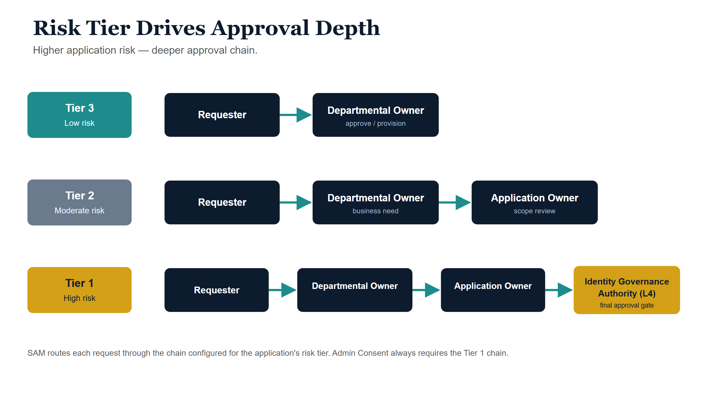
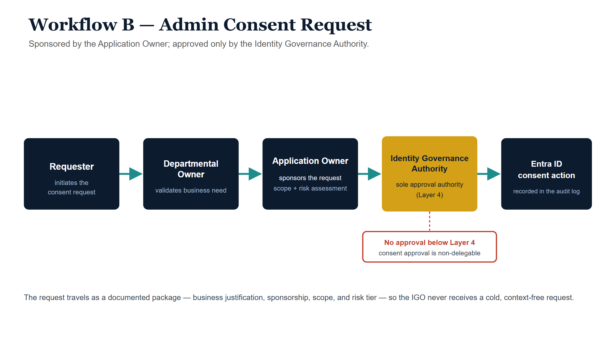
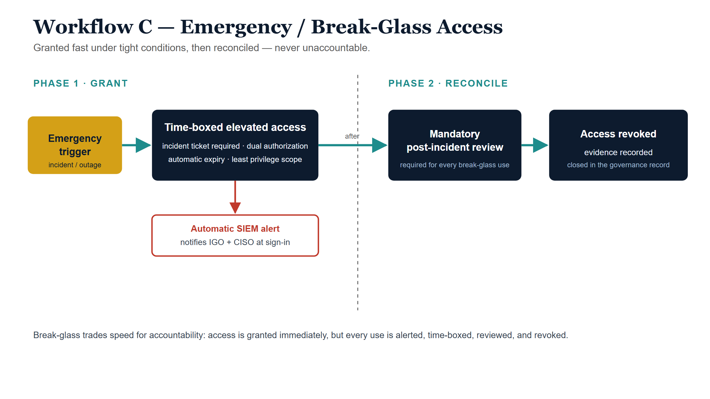

*Entra ID Identity Governance Series — Document 3 of 3. Microsoft Entra ID —
Enterprise Application Access Control Framework. Document Number: IDG-GOV-003 ·
Version 1.0 · Date of Issue: June 8, 2026 · Review Date: June 8, 2027 · Document
Owner: Identity Governance Officer (IGO) · Issuing Authority: Office of the CISO.
Series documents: IDG-GOV-001 (Entra ID Identity Lifecycle) · IDG-GOV-002
(Privileged Access and PIM Model) · IDG-GOV-003 (Enterprise Application Access
Governance — this document).*

## Purpose, scope, and authority

### Purpose

This document establishes the authoritative governance model for enterprise
application access within the agency's Microsoft Entra ID tenant. It defines the
policies, roles, workflows, approval chains, and audit requirements necessary to
ensure that access to cloud-based, federated, and integrated enterprise
applications is granted, maintained, and revoked in a controlled, auditable, and
least-privilege manner.

Microsoft Entra ID Enterprise Applications represent the primary access control
surface for cloud and federated applications in the agency's identity
architecture. The policies herein govern every aspect of that surface — from
initial application registration and risk classification through ongoing access
reviews, Admin Consent grant management, and deprovisioning. This model is
designed to support agency Zero Trust objectives and satisfy applicable federal
compliance requirements.

This is Document 3 of 3 in the Entra ID Identity Governance Series. It should be
read in conjunction with IDG-GOV-001 (Identity Lifecycle) and IDG-GOV-002
(Privileged Access and PIM Model).

### Scope

This governance model applies to:

- All Enterprise Applications registered in the agency's Microsoft Entra ID
  tenant, regardless of origin (Microsoft first-party, third-party ISV, or
  custom-developed)
- All federated applications integrated via SAML 2.0, OpenID Connect (OIDC), or
  WS-Federation
- All application-level permission grants (Admin Consent) issued within the
  tenant
- All security groups and Privileged Access Groups (PAGs) assigned to Enterprise
  Applications
- All personnel performing identity governance functions in Entra ID, including
  Identity Governance Officers, Help Desk Operators, Application Owners, and
  Departmental Owners
- All ServiceNow RITM workflows that initiate, approve, or document access
  changes to Enterprise Applications

### Out of scope

The following are explicitly excluded from this governance model:

- **Application development:** The development lifecycle of custom applications
  is governed under a separate Software Development Policy and is not addressed
  herein.
- **Personal Microsoft accounts:** Consumer accounts (e.g., @outlook.com,
  @hotmail.com) are not managed within the agency tenant.
- **Consumer and non-federated applications:** Applications not integrated into
  the Entra ID tenant are not governed by this model.
- **On-premises applications without Entra integration:** Legacy on-premises
  applications that do not publish through Entra Application Proxy or similar
  federation are governed by separate on-premises access policies.
- **Microsoft 365 licensing:** License assignment governance is addressed in the
  Office 365 Administration Policy.

### Governing authority

The **Identity Governance Officer (IGO)**, operating under the authority of the
Chief Information Security Officer (CISO), is the governing authority for this
policy. The IGO holds final approval authority for all Tier 1 application
actions, all Admin Consent grants, all policy exceptions, and all governance
model updates. In the absence of the IGO, authority is delegated to the Deputy
IGO or, in emergency circumstances only, to the Privileged Role Administrator
on-call.

### Policy framework alignment

This governance model aligns with and implements the following frameworks and
regulations:

| Framework / regulation | Relevance to this model |
|---|---|
| FISMA (Federal Information Security Modernization Act) | Establishes mandatory access control and audit requirements for federal information systems |
| NIST SP 800-53 Rev. 5 (AC Family) | Access enforcement (AC-3), least privilege (AC-6), account management (AC-2), and separation of duties (AC-5) controls directly implemented in this model |
| NIST SP 800-207 (Zero Trust Architecture) | Least-privilege, continuous validation, and explicit trust verification principles applied to every access workflow |
| OMB Memorandum M-22-09 | Federal Zero Trust Strategy requirements, including phased adoption of application-level access controls |
| CISA Zero Trust Maturity Model | Application pillar maturity requirements for identity-based access |
| Agency Information Security Policy | Parent agency policy governing all information system access |

## Definitions and key terms

The following terms are used throughout this document. All personnel involved in
enterprise application governance must be familiar with these definitions.

| Term | Definition |
|---|---|
| **Enterprise Application** | A Service Principal object in Microsoft Entra ID that represents an application registered to the tenant. Enterprise Applications are the primary objects through which access control, Admin Consent, and group assignment are managed. |
| **Service Principal** | The Entra ID representation of an application's identity within a specific tenant. Every Enterprise Application is backed by a Service Principal that holds its permissions, assignments, and consent grants. |
| **App Registration** | The definition object of an application in Entra ID (as opposed to the Enterprise Application/Service Principal used in the local tenant). App Registrations define the application's requested permissions and authentication configuration. |
| **Admin Consent** | A tenant-wide grant by an authorized administrator allowing an application to access Microsoft Graph or other API resources on behalf of all users in the tenant, without requiring individual user consent. Admin Consent is a high-risk operation requiring formal approval. |
| **Delegated Permission** | An API permission that allows an application to act on behalf of a signed-in user. Access is bounded by both the user's own permissions and the granted scope. Generally lower risk than Application Permissions. |
| **Application Permission** | An API permission that allows an application to act independently — without a signed-in user — typically with access to all users' data within the tenant. Application Permissions are always granted through Admin Consent and carry the highest risk level. |
| **Managed Identity** | A system-assigned or user-assigned identity in Entra ID for Azure resources (e.g., Azure Functions, VMs), enabling those resources to authenticate to other services without storing credentials. Managed Identities are governed as Service Principals. |
| **Privileged Access Group (PAG)** | A Microsoft Entra ID security group configured for Privileged Identity Management (PIM) group membership. PAGs are used to implement the Help Desk Operator role model in this agency, as no native "Help Desk" Entra role exists for identity operations. |
| **PIM (Privileged Identity Management)** | The Microsoft Entra ID service that governs time-bound, just-in-time (JIT) elevation of privileged roles. All Help Desk Operators and identity administrators must activate elevated roles through PIM. PIM activation is logged and subject to audit. |
| **ImmutableID** | An attribute used to link an on-premises Active Directory user object to its corresponding Entra ID user account in hybrid identity environments. Critical for federated authentication scenarios. |
| **Group-Based Access** | The practice of assigning security groups (rather than individual users) to Enterprise Applications for access control. Group-based access is the mandatory pattern in this agency for all application assignments. |
| **Application Owner** | A named individual (not a group) assigned as the accountable party for an Enterprise Application. Application Owners are responsible for access reviews, consent approvals (within their authority), and maintaining accurate application registration metadata. |
| **Identity Governance Officer (IGO)** | The senior authority responsible for this governance model. The IGO holds final approval authority for Tier 1 actions, all Admin Consent grants, and policy exceptions. |
| **Risk Tier** | A classification (Tier 1 / High, Tier 2 / Moderate, Tier 3 / Low) assigned to each Enterprise Application based on the sensitivity of data accessed, permission types granted, and exposure profile. Risk Tier drives the approval chain depth and review frequency. |
| **ServiceNow RITM** | A "Requested Item" ticket in the ServiceNow ITSM platform. All access requests, consent approvals, and governance actions must be initiated, approved, and closed via a ServiceNow RITM, which serves as the system of record. |
| **Break-Glass Account** | An emergency access account held outside the normal PIM governance model, used only when standard administrative access is unavailable. Break-glass activation triggers mandatory notification and post-incident review. |
| **Ownership Hierarchy** | The three-layer organizational ownership model: Layer 1 = IGO (tenant-wide authority), Layer 2 = Departmental Owner (department-level accountability), Layer 3 = Application Owner (application-specific accountability). |
| **Entra-HelpDesk-Operators PAG** | The agency's Privileged Access Group through which Help Desk Operators receive time-bound activation of Application Administrator and Hybrid Identity Administrator roles. This PAG is the implementation mechanism for the Help Desk governance role. |
| **Least Privilege** | The security principle that any user, application, or system should have only the minimum permissions necessary to perform its function. Least privilege is the central design principle of this governance model. |
| **Consent Grant** | The specific record created in Entra ID when Admin Consent is approved, binding the permission scope to the Service Principal. Consent Grants are logged, audited, and subject to periodic review and revocation. |
| **Application Registry** | The agency's authoritative inventory of all Enterprise Applications in the Entra ID tenant, including ownership, risk classification, consent grants, and review status. Maintained by the IGO office. |

## Governance roles and responsibilities

### Role definitions

The following roles constitute the complete governance structure for enterprise
application access. Each role is defined with its associated Entra ID role or
group, key responsibilities, and approval authority level.

| Role name | Entra role / group | Key responsibilities | Approval authority level |
|---|---|---|---|
| **Identity Governance Officer (IGO)** | Privileged Role Administrator; Global Reader; member of IGO-Approvers security group | Final authority on all Tier 1 application actions; approves all Admin Consent grants; approves policy exceptions and waivers; conducts annual governance review; maintains Application Registry; assigns Risk Tiers to all Enterprise Applications; receives all break-glass activation alerts | **Level 1 (highest)** — can approve all actions |
| **Global Administrator** | Global Administrator (Entra ID built-in) | Emergency and break-glass use only; shall not be used for routine operations; must be activated via break-glass procedure; every use is automatically alerted to IGO and CISO | **Break-glass only** — not for routine use |
| **Privileged Role Administrator** | Privileged Role Administrator (Entra ID built-in, via PIM) | Manages PIM policies and activation settings; assigns eligible role memberships; reviews PIM activation logs; manages Privileged Access Group configurations | **Level 2** — PIM and role management actions |
| **Application Owner (Ownership Layer 3)** | Named in Enterprise App → Owners tab; member of App-Owners security group | First line of governance accountability for assigned application; approves or denies access requests for their application; conducts quarterly access reviews (Tier 1) or semi-annual (Tier 2); submits Admin Consent requests with business justification; maintains accuracy of application metadata in Registry; notifies IGO of any material change in application scope | **Level 3** — application-level access approvals |
| **Departmental Owner (Ownership Layer 2)** | Member of Dept-Owners-[DeptCode] security group | Validates business justification for access requests; approves Tier 3 application access requests; confirms staffing changes that affect application access; escalates unresolved access requests to Application Owner; reviews department-level group memberships semi-annually | **Level 4** — departmental access validation |
| **Help Desk Operator** | Entra-HelpDesk-Operators PAG (grants Application Administrator + Hybrid Identity Administrator via PIM activation) | Executes approved access changes in Entra ID (group assignments, app assignments); must activate role via PIM before performing any Entra action; closes ServiceNow RITM with execution confirmation; does not approve access — execution only; triages Microsoft Security notification emails per the Microsoft Security notification section; escalates anomalous consent or permission events to IGO | **Execution only** — no approval authority |
| **End User / Requester** | Standard user account (no elevated role) | Submits access requests via ServiceNow catalog; provides business justification for access needs; acknowledges acceptable use requirements upon access grant; reports unauthorized access or anomalous application behavior | **None** — requestor only |
| **ServiceNow Workflow Automation** | ServiceNow Integration Service Account (Entra ID service account, no interactive sign-in) | Routes RITM tickets to approvers based on risk tier; sends automated notifications at each workflow stage; logs all approval actions to RITM audit trail; enforces SLA timers and escalation triggers | **System actor** — no human approval authority |

::: {.callout-warning title="No native Help Desk Entra role"}
Microsoft Entra ID does not provide a native "Help Desk" role with the combined
capabilities required for identity operations (application assignment + hybrid
identity management). The **Entra-HelpDesk-Operators PAG** is the agency's
implementation mechanism, granting time-bound, just-in-time activation of
Application Administrator and Hybrid Identity Administrator roles through PIM.
Help Desk Operators must **never** be granted these roles as permanent
assignments. All activations must be logged and subject to quarterly review.
:::

### RACI matrix

**Key:** R = Responsible | A = Accountable | C = Consulted | I = Informed

| Task / activity | IGO | App Owner | Dept Owner | Help Desk | End User | Priv. Role Admin |
|---|---|---|---|---|---|---|
| Enterprise App Registration (new app) | A | R | C | R | I | I |
| Risk Tier Classification | A/R | C | C | I | — | I |
| Admin Consent Approval (Tier 1) | A/R | C | I | I | I | I |
| Admin Consent Approval (Tier 2) | A | R | C | I | I | I |
| Admin Consent Approval (Tier 3) | I | A/R | C | I | I | I |
| Group Assignment to Enterprise App | I | A | C | R | I | I |
| Standard Access Request (end user) | I | A | R | R | R | — |
| Quarterly Access Review | A | R | C | I | I | I |
| Annual Governance Review | A/R | C | C | I | — | C |
| PIM Role Elevation (Help Desk) | I | I | I | R | — | A |
| Break-Glass Activation | A | I | I | I | — | R |
| Audit Log Review | A/R | C | I | R | — | C |
| Orphaned Application Remediation | A/R | — | C | R | — | I |

## Application risk classification framework

{#fig-risk-tier fig-alt="A blueprint with three stacked lanes by risk tier. Tier 3 Low risk: Requester then Departmental Owner, short teal chain. Tier 2 Moderate risk: Requester, Departmental Owner, Application Owner. Tier 1 High risk: Requester, Departmental Owner, Application Owner, then an amber-gated Identity Governance Authority approval. Each lane flows left to right with teal arrows; the Tier 1 IGO gate is amber. A grey footer: higher risk, deeper approval chain." width="100%"}

All Enterprise Applications in the agency's Entra ID tenant must be classified
under the three-tier risk model defined in this section. Risk classification is
assigned by the IGO at the time of application registration and must be
re-evaluated at each annual governance review or whenever a material change
occurs to the application's permission scope, data access profile, or user
population.

::: {.callout-important title="Classification is a governance obligation"}
Every Enterprise Application must have an assigned Risk Tier before access may be
granted to any user or group. Applications discovered without a Risk Tier
classification are treated as **Tier 1 (High Risk)** until formally classified by
the IGO. No exceptions are permitted.
:::

### Tier 1 — high risk

An application is classified Tier 1 if it meets **one or more** of the following
criteria:

- Uses **Application Permissions** (not Delegated Permissions) — i.e., acts
  without a signed-in user context
- Has access to **all users' data** or tenant-wide organizational data
- Processes, stores, or transmits **financial, HR, payroll, health, or sensitive
  PII data**
- Is operated by an **external party or third-party ISV** (vendor-managed
  application)
- Is **externally facing** and accessible outside the agency network perimeter
- Has been granted one or more **highly privileged Microsoft Graph permissions**
  (e.g., Mail.ReadWrite.All, User.ReadWrite.All, Files.ReadWrite.All at
  application level)
- Has no named Application Owner (orphaned — automatic Tier 1 classification
  applies)

**Tier 1 governance requirements:**

- IGO approval required for all Admin Consent grants
- Executive sign-off (CISO or Deputy CISO) required for initial provisioning
- Named Application Owner is **mandatory** — application cannot remain active
  without one
- Quarterly access review conducted by Application Owner
- All consent grants logged in both ServiceNow and Entra audit log
- SIEM alerting enabled for all permission changes
- Named Backup/Delegate Application Owner required

### Tier 2 — moderate risk

An application is classified Tier 2 if it meets the following criteria (and does
not qualify for Tier 1):

- Uses **Delegated Permissions with broad scope** (e.g., Files.ReadWrite,
  Mail.Read on behalf of user)
- Is an **internal business application** serving a defined department or user
  population
- Has access to **department-level data** but not tenant-wide data
- Handles **business-sensitive but non-PII data** (e.g., internal reports,
  project data)
- Is operated and maintained by an internal team with defined ownership

**Tier 2 governance requirements:**

- Application Owner approval required for Admin Consent; IGO review required
  before grant
- Named Application Owner is mandatory
- Semi-annual access review
- Consent grants logged in ServiceNow

### Tier 3 — low risk

An application is classified Tier 3 if it meets all of the following criteria:

- Requests only **minimal delegated permissions** (e.g., User.Read, openid,
  profile, email)
- Is an **internal productivity tool** with limited data access
- Does **not** access sensitive, financial, health, or PII data
- User population is defined and limited (e.g., a single team or department)
- Is operated by an internal team with defined ownership

**Tier 3 governance requirements:**

- Departmental Owner approval sufficient for access requests
- Application Owner approval required for any Admin Consent
- Annual access review
- Standard RITM logging in ServiceNow

### Risk classification matrix

The following matrix provides detailed classification guidance, including
permission scope examples and the required approval chains for each tier.

| Classification criterion | Tier 1 — high risk | Tier 2 — moderate risk | Tier 3 — low risk |
|---|---|---|---|
| **Permission Type** | Application Permissions (any) | Delegated — broad scope | Delegated — minimal scope |
| **Data Sensitivity** | PII, PHI, financial, HR, tenant-wide | Business-sensitive, department-level | Non-sensitive, user profile only |
| **Operator Type** | External/ISV or no owner | Internal with ownership | Internal, limited scope |
| **User Population** | All users or undetermined | Department-level | Team or small group |
| **External Exposure** | Yes (internet-facing) | Internal with some federation | Fully internal |
| **Admin Consent Approver** | IGO only | App Owner + IGO review | App Owner |
| **Access Request Approver** | App Owner + IGO notification | App Owner | Departmental Owner |
| **Access Review Frequency** | Quarterly | Semi-annual | Annual |
| **App Owner Required** | Mandatory + Backup Owner | Mandatory | Required |
| **Executive Sign-Off (Initial)** | Yes (CISO or Deputy) | No | No |
| **SIEM Alert Required** | Yes — all permission changes | Yes — consent grants only | No (standard audit log) |
| **Example Permission Scopes** | Mail.ReadWrite.All (App), User.ReadWrite.All (App), Files.ReadWrite.All (App), Directory.ReadWrite.All (App) | Files.ReadWrite (Delegated), Calendars.ReadWrite (Delegated), Mail.Read (Delegated) | User.Read (Delegated), openid, profile, email, offline_access |
| **Example Applications** | Payroll systems, HR platforms, third-party SIEM connectors, external partner portals | Internal project management tools, department reporting apps, internal SharePoint integrations | Internal productivity tools, single-sign-on only applications, read-only dashboards |

::: {.callout-note title="Reclassification"}
Risk Tier reclassification may be triggered at any time by: (1) a change in the
application's requested permission scope, (2) a change in the data the
application accesses, (3) a change in the application's operator or ownership, or
(4) a security incident involving the application. Reclassification requests must
be submitted to the IGO via ServiceNow RITM. Downgrade reclassification (e.g.,
Tier 1 to Tier 2) requires IGO approval with documented justification.
:::

## Application ownership model

### Ownership requirement

Every Enterprise Application in the agency's Entra ID tenant must have a named,
individual Application Owner. Group ownership is not permitted. The Application
Owner is the primary accountable party for the application's access governance,
consent grants, and access review obligations. Assignment of an Application Owner
is a prerequisite for application activation in the tenant.

### Application Owner responsibilities

The Application Owner must:

1. Maintain accurate application metadata in the Application Registry (name,
   purpose, data classification, user population)
2. Approve or deny all access requests submitted through ServiceNow within the
   applicable SLA
3. Conduct scheduled access reviews (quarterly for Tier 1, semi-annual for Tier
   2, annual for Tier 3) and certify or revoke user group memberships
4. Submit formal Admin Consent requests to the IGO with documented business
   justification and least-privilege analysis for every new or modified
   permission scope
5. Notify the IGO of any material change to the application's data access
   profile, permission scope, or operator within 5 business days of discovery
6. Review and acknowledge Microsoft Security notification emails that pertain to
   their application (per the Microsoft Security notification section)
7. Coordinate with the Help Desk to execute approved access changes
8. Maintain awareness of current group memberships assigned to the application
   and ensure accuracy
9. Complete annual Application Owner training as required by the IGO
10. Ensure their Backup/Delegate Owner is current and capable of assuming
    responsibilities during absences

### Backup / delegate owner requirement

All Tier 1 applications must have a named Backup/Delegate Application Owner. Tier
2 applications are strongly recommended to designate a Backup Owner. The Backup
Owner must have sufficient knowledge of the application to conduct access reviews
and respond to Admin Consent requests in the primary owner's absence. The Backup
Owner is recorded in the Application Registry and named in the Entra ID
Enterprise Application Owners tab.

### Application Registry

The IGO office maintains the Application Registry as the authoritative inventory
of all Enterprise Applications in the tenant. The Registry contains the following
fields for each application:

| Registry field | Description | Maintained by |
|---|---|---|
| Application Name | Display name in Entra ID | Application Owner |
| Application (Client) ID | Unique identifier from Entra ID | Help Desk (system-generated) |
| Object ID | Service Principal Object ID in Entra | Help Desk (system-generated) |
| Application Owner (Primary) | Named individual with contact info | Application Owner / IGO |
| Application Owner (Backup) | Named individual with contact info | Application Owner / IGO |
| Departmental Owner | Named individual with department | Departmental Owner / IGO |
| Risk Tier | Tier 1 / 2 / 3 | IGO |
| Data Classification | Sensitivity of data accessed | Application Owner + IGO |
| Admin Consent Status | Granted / Pending / Not Required | IGO |
| Permission Scopes Granted | List of all consented permissions | IGO |
| Last Access Review Date | Date of most recent completed review | Application Owner |
| Next Review Due Date | Calculated from review frequency | IGO (automated) |
| ServiceNow RITM (Initial Provisioning) | Reference to originating RITM | Help Desk |
| Date Added to Tenant | Registration date | System |
| Active / Inactive Status | Current operational status | Application Owner |

### Assigning and updating Application Owners in Entra ID

Application Owners are assigned directly within the Entra ID portal. The
procedure is as follows:

1. Navigate to **Microsoft Entra admin center → Applications → Enterprise
   Applications**
2. Select the target Enterprise Application by display name or Application ID
3. In the application blade, select **Owners** from the left navigation panel
4. Select **Add owners** and search for the named individual by UPN or display
   name
5. Confirm the assignment; the new owner will receive an automated notification
   via ServiceNow RITM closure
6. Update the Application Registry to reflect the change within 1 business day

::: {.callout-note title="Entra ID Owners tab"}
The Entra ID Enterprise Application Owners tab does not confer any Entra
administrative role to the assigned individual. It is a metadata designation used
for governance tracking. Operational capabilities (PIM elevation, group
assignment) are granted separately through the Help Desk PAG or other role
assignments as defined in the Governance roles and responsibilities section.
:::

### Ownership transfer procedure

When a named Application Owner departs the agency, transfers to a different role,
or is otherwise unable to fulfill ownership responsibilities, the following
procedure must be followed:

1. Departing owner (or their supervisor) submits a ServiceNow RITM for
   Application Owner Transfer at least 10 business days before the effective
   departure date
2. The Departmental Owner nominates a successor Application Owner and submits
   formal nomination to IGO
3. IGO reviews and approves the nomination
4. Help Desk updates the Entra ID Owners tab and Application Registry upon IGO
   approval
5. Successor Application Owner completes Application Owner briefing within 5
   business days of assignment
6. Any in-progress access reviews or pending Admin Consent requests are
   transferred to the successor owner

### Orphaned application policy

An application is considered **orphaned** if it has no named Application Owner on
record in the Application Registry or in the Entra ID Owners tab. The following
mandatory policy applies to all orphaned applications:

1. Orphaned applications are **automatically reclassified as Tier 1 (High Risk)**
   pending owner assignment
2. The IGO assumes interim ownership responsibility
3. A ServiceNow RITM is automatically generated and assigned to the IGO office
   for ownership resolution
4. The IGO has **30 calendar days** to resolve ownership — either by assigning a
   new owner or initiating decommissioning
5. If ownership is not resolved within 30 days, access to the application is
   suspended pending resolution
6. All access suspensions are logged and communicated to the relevant
   Departmental Owner and CISO

## Access request and approval workflows

This section defines the three primary access workflows used for enterprise
application access governance. Each workflow must be initiated via a ServiceNow
RITM. No Entra ID access changes may be executed without a corresponding open and
approved RITM. All workflows are auditable end-to-end through ServiceNow and
Entra audit logs.

### Workflow A — standard group-based access request

This workflow governs the standard path for an end user requesting access to an
Enterprise Application through group membership. Group-based access is the
**mandatory and exclusive method** for assigning users to Enterprise
Applications. Direct individual user assignments to Enterprise Applications are
not permitted.

| Step | Action | Actor | Tool / system | SLA | Outcome |
|---|---|---|---|---|---|
| **1** | User submits access request via ServiceNow catalog item. Must include: application name, business justification, manager name, and required access role/group. | End User / Requester | ServiceNow (self-service portal) | Immediate (user action) | RITM created; routed to Departmental Owner |
| **2** | Departmental Owner reviews business justification. Confirms requester's role legitimacy and department membership. Approves or denies the request. | Departmental Owner | ServiceNow (approval task) | 1 business day | RITM routed to App Owner (if approved) or closed denied |
| **3** | Application Owner reviews the approved request against application access policy. Confirms the requested group is appropriate. Approves or denies with documented reason. | Application Owner | ServiceNow (approval task) | 2 business days | RITM routed to Help Desk for execution (if approved) or closed denied |
| **4** | IGO is notified of all Tier 1 access approvals before execution. IGO may intervene and escalate review within 4 business hours of notification. | IGO (notification only for Tier 2/3) | ServiceNow (automated notification) | IGO review window: 4 hours (Tier 1 only) | IGO acknowledgement logged; execution proceeds if no hold placed |
| **5** | Help Desk Operator activates Application Administrator role via PIM (Entra-HelpDesk-Operators PAG). Records PIM activation time in RITM work notes. | Help Desk Operator | Entra ID PIM portal | Same day as RITM assignment | PIM activation logged in Entra audit log |
| **6** | Help Desk Operator executes group membership addition: adds the approved user to the designated access security group in Entra ID. Confirms assignment in Entra portal and records object IDs in RITM. | Help Desk Operator | Microsoft Entra admin center → Groups | Within PIM activation window | User added to group; group-based access to Enterprise App propagates |
| **7** | Help Desk Operator closes RITM with full execution log: timestamp, operator UPN, group name, group Object ID, user UPN added, Entra audit log reference. | Help Desk Operator | ServiceNow | Within 1 hour of execution | RITM resolved and closed; audit trail complete |
| **8** | End user receives automated notification confirming access grant. Notification includes application name, effective date, and acceptable use acknowledgement requirement. | ServiceNow Automation | ServiceNow (email notification) | Automated on RITM close | User notified and access confirmed |

::: {.callout-note title="Total SLA — standard access request"}
The end-to-end SLA for a standard group-based access request is **3 business
days** from RITM creation to access grant. This SLA applies to all tiers.
Failures to meet SLA at any step are escalated automatically by ServiceNow to the
next approval level. SLA breaches are reported in the monthly governance
dashboard to the IGO.
:::

### Workflow B — Admin Consent request

{#fig-consent-workflow fig-alt="A left-to-right blueprint pipeline. Requester initiates, Departmental Owner validates business need, Application Owner sponsors and attaches scope and risk assessment, then a teal arrow passes through an amber gate labelled Identity Governance Authority — sole approval to a navy Entra ID consent action box. A red side note: no approval below Layer 4. Footer: the IGO never receives a cold request." width="100%"}

Admin Consent is one of the highest-risk operations in the Entra ID tenant. This
workflow governs all requests to grant tenant-wide API permissions to an
Enterprise Application. This workflow is triggered when: (a) a new application is
being provisioned and requires Admin Consent; or (b) an existing application is
requesting additional or modified permission scopes.

::: {.callout-warning title="Admin Consent is irreversible until explicitly revoked"}
Once Admin Consent is granted, the application has immediate access to the
consented permission scope for all users in the tenant. Consent must be
explicitly revoked by an authorized administrator. Consent grants are permanent
until revoked — they do not expire. Every Admin Consent grant must be treated as
a security-critical action requiring rigorous review.
:::

| Step | Action | Actor | Tool / system | SLA | Outcome |
|---|---|---|---|---|---|
| **1** | Application Owner submits Admin Consent Request RITM in ServiceNow. Must include: application name, Client ID, full list of permissions requested (with Microsoft Graph API names), business justification for each permission, and least-privilege analysis (why each permission is needed and why a narrower scope is insufficient). | Application Owner | ServiceNow (Admin Consent Request catalog item) | Initiating action | RITM created; risk tier lookup performed |
| **2** | ServiceNow automation looks up the application's Risk Tier in the Application Registry and routes the RITM to the appropriate approval chain based on the tier decision table below. | ServiceNow Automation | ServiceNow + Application Registry | Automated (immediate) | RITM routed per tier-specific approval chain |
| **3** | **Security review:** IGO office (or delegated security analyst) reviews the requested permissions against least-privilege principles. Validates that: (a) only necessary permissions are requested, (b) delegated permissions are used where application permissions are not required, (c) no permissions are flagged as critical risk without documented necessity. | IGO / Security Analyst | Microsoft Graph permissions reference; RITM review | 2 business days | Security review finding documented in RITM |
| **4** | Approval by designated authority per risk tier (see Escalation Decision Table below). Approver documents decision in ServiceNow RITM with approval rationale. | Per tier (see table) | ServiceNow (approval task) | 3 business days (from Step 3) | RITM approved or denied with documented rationale |
| **5** | If approved: Help Desk Operator activates Privileged Role via PIM. IGO or authorized administrator grants Admin Consent in Entra admin portal: Applications → Enterprise Applications → [App] → Permissions → Grant admin consent. | Help Desk (PIM) + IGO or delegated authority (consent action) | Entra ID admin portal | Same day as final approval | Consent granted; Entra audit log entry created |
| **6** | Consent grant logged in RITM with: consent timestamp, grantor UPN, permission scopes granted, Entra audit log entry reference number. RITM closed. | Help Desk Operator | ServiceNow | Within 1 hour of consent grant | Full audit record in both ServiceNow and Entra |
| **7** | Automated notification sent to Application Owner and requestor confirming consent grant. Application Registry updated with new permission scopes and consent grant date. | ServiceNow Automation + IGO office | ServiceNow; Application Registry | Automated on RITM close | Application Owner informed; Registry current |

#### Admin Consent escalation decision table

| Application risk tier | Approval chain | Minimum approvers | Total SLA |
|---|---|---|---|
| **Tier 1 — High Risk** | Application Owner submits → Security Review (IGO analyst) → **IGO final approval** → CISO notification | IGO (mandatory); CISO notified | 5 business days |
| **Tier 2 — Moderate Risk** | Application Owner submits → Security Review (IGO analyst) → Application Owner confirms → **IGO review and approval** | Application Owner + IGO | 5 business days |
| **Tier 3 — Low Risk** | Application Owner submits → Security Review (IGO analyst) → **Application Owner approval** → IGO notified | Application Owner; IGO informed | 3 business days |
| **Any Tier — Application Permission Type** | Regardless of tier: **IGO approval is mandatory** for any Application Permission (non-delegated). Automatic escalation to Tier 1 treatment. | IGO (mandatory); CISO notified | 5 business days |
| **Any Tier — Critical Scope** | If permission includes \*.All at application level (e.g., Mail.ReadWrite.All): automatic escalation to IGO + CISO dual review regardless of tier. | IGO + CISO (dual review) | 5 business days |

### Workflow C — emergency / break-glass access

{#fig-break-glass fig-alt="A two-phase blueprint. Phase 1 Grant: an amber emergency trigger leads to a navy time-boxed elevated access box, with conditions listed — incident ticket, dual authorization, expiry. A red arrow marks automatic SIEM alert to IGO and CISO. Phase 2 Reconcile: a teal arrow to a mandatory post-incident review box, then access revoked and evidence recorded. Footer: break-glass is granted fast but never unaccountable." width="100%"}

The Emergency Access Workflow is reserved for situations where standard access
channels are unavailable and immediate access is required to prevent or mitigate
a critical operational or security incident. Break-glass access invokes the
Global Administrator account or other emergency credentials outside the normal
PIM governance model.

::: {.callout-warning title="Break-glass is a last resort"}
Break-glass activation must never be used for routine administrative convenience,
SLA bypass, or any non-emergency purpose. Every activation is automatically
alerted to the IGO and CISO and triggers a mandatory post-incident review. Misuse
of break-glass credentials is a serious security policy violation and will be
subject to disciplinary action.
:::

#### Emergency access invocation criteria

Break-glass access may be invoked **only** when all of the following conditions
are met:

- Standard PIM-based administrative access is unavailable (e.g., MFA failure,
  Conditional Access lockout, PIM service outage)
- The situation constitutes an active security incident, critical service
  disruption, or regulatory obligation requiring immediate action
- At least two senior administrators (IGO-level or equivalent) have been
  contacted and are aware of the activation

| Step | Action | Actor | Requirement | Documentation |
|---|---|---|---|---|
| **1** | Senior administrator determines that standard access is unavailable and emergency criteria are met. Contacts a second senior administrator for dual awareness. | Senior Administrator (requester) | Two senior admins must be aware and in communication | Voice/text communication logged |
| **2** | Both administrators verbally confirm and document the emergency invocation trigger. ServiceNow P1 ticket opened immediately with emergency justification. | Both senior admins | Dual approval documented; P1 ticket mandatory | ServiceNow P1 ticket number recorded |
| **3** | Break-glass credentials retrieved from secure vault per agency break-glass procedure. Credentials retrieved only by both admins acting together (dual custody). | Both senior admins (dual custody) | Dual custody mandatory; single-party retrieval is prohibited | Vault access logged (automated) |
| **4** | Break-glass account used to perform only the specific action required to address the emergency. No additional actions beyond the stated emergency scope permitted. | Senior Administrator (acting) | Scope-limited use only | All actions logged in Entra audit log |
| **5** | Access terminated immediately upon emergency resolution. Maximum duration: **4 hours**. Any extension requires documented exception approved by CISO. | Senior Administrator | 4-hour maximum; CISO approval for extension | Termination time logged in P1 ticket |
| **6** | Automated SIEM alert and email notification sent to IGO and CISO upon break-glass account sign-in detection (configured alert — see the Required SIEM alerts section). | SIEM / Entra ID (automated) | Automated alert — no manual trigger required | SIEM alert logged; email sent |
| **7** | Mandatory post-incident review conducted within **24 hours** of break-glass activation. Full review of all actions taken, scope compliance, and necessity validation. | IGO (leads review) | 24-hour deadline mandatory | Incident report filed in ServiceNow; archived in governance records |
| **8** | Break-glass credentials rotated following each activation. New credentials stored in vault per dual custody procedure. | Privileged Role Administrator | Rotation mandatory after every activation | Rotation logged in ServiceNow RITM |

## Group-based access governance model

### Policy requirement: group-based access is mandatory

The agency mandates that all user access to Enterprise Applications in Entra ID
be implemented through security group assignment. **Direct individual user
assignment to Enterprise Applications is prohibited.** Group-based access provides
scalable, auditable, and reviewable access control aligned with Zero Trust
principles and NIST AC-2 account management requirements. It ensures that access
reviews can be conducted at the group level, simplifying the governance burden on
Application Owners while maintaining individual-level accountability.

**Rationale for the group-based mandate:**

- Enables efficient access reviews (review group membership rather than
  individual app assignments)
- Simplifies onboarding and offboarding through group membership management
- Provides consistent, repeatable access patterns aligned with job functions
- Supports dynamic group rules for automated, policy-driven access based on user
  attributes
- Creates a clear separation between access policy (group membership) and access
  enforcement (app assignment)

### Group naming convention

All security groups created for Enterprise Application access must follow the
mandatory naming convention below. Non-compliant group names will be flagged
during quarterly reviews and must be renamed by the Help Desk.

**Naming format:** APP-[AppShortName]-[AccessRole]-[RiskTier]

| Token | Description | Example |
|---|---|---|
| APP | Fixed prefix identifying this as an application access group | APP |
| [AppShortName] | Abbreviated application name (no spaces; use hyphens). Must match the Application Registry short name field. | PAYROLL, HRPORTAL, PROJMGR |
| [AccessRole] | The role or access level this group grants within the application (e.g., Users, Admins, ReadOnly, Approvers) | USERS, ADMINS, READONLY |
| [RiskTier] | The Risk Tier of the application (T1, T2, T3) | T1, T2, T3 |

**Complete naming examples:**

- APP-PAYROLL-USERS-T1 — Standard users of the Payroll system (Tier 1)
- APP-PAYROLL-ADMINS-T1 — Administrators of the Payroll system (Tier 1)
- APP-HRPORTAL-READONLY-T2 — Read-only access to the HR Portal (Tier 2)
- APP-PROJMGR-USERS-T3 — Users of the Project Manager tool (Tier 3)

### Group lifecycle management

#### Group creation

All new access groups must be created by the Help Desk Operator via ServiceNow
RITM, following approval by the Application Owner. Group creation is an
administrative action requiring PIM elevation. The creating operator must document
the group Object ID, creation date, and associated Enterprise Application in the
Application Registry.

#### Group population

Members are added to access groups through the Standard Access Request (Workflow
A). No members may be added directly by group owners without an associated
approved RITM. The Application Owner is accountable for the accuracy of group
membership and must certify membership during each scheduled access review.

#### Group review

Group membership is reviewed on the schedule defined by the application's Risk
Tier. During each review, the Application Owner must certify each member's
continued need for access. Members who cannot be certified must be removed within
5 business days of the review completion.

#### Group deprovisioning

When an application is decommissioned or an access role is eliminated, the
associated access groups must be deprovisioned via ServiceNow RITM. All members
must be removed before group deletion. Group deletion is logged in Entra audit log
and the Application Registry updated accordingly.

### Nested group policy

::: {.callout-important title="Nested groups are restricted"}
Nested groups (groups whose members include other groups) are **not permitted**
for Enterprise Application access assignments. Microsoft Entra ID does not honor
nested group memberships for Enterprise Application user assignment, which can
create invisible access gaps and audit failures. All access groups assigned to
Enterprise Applications must have direct individual user members only. Any nested
group configurations discovered during access reviews must be remediated
immediately.
:::

### Dynamic groups vs. assigned groups

| Group type | Use case | When appropriate | When not appropriate | Risk Tier applicability |
|---|---|---|---|---|
| **Dynamic Membership Group** | Membership automatically managed by Entra ID based on user attribute rules (e.g., department = "Finance", jobTitle = "Analyst") | Broad role-based access that aligns cleanly with maintained user attributes; large user populations with consistent attribute profiles | Sensitive applications requiring individual approval of each member; when user attributes are not reliably maintained in Entra ID | Tier 3 preferred; Tier 2 with IGO approval; **not permitted for Tier 1** |
| **Assigned Membership Group** | Membership manually managed by adding/removing individual users via approved RITM process | All Tier 1 and Tier 2 applications; any application requiring individual approval of each access grant; applications with small or specialized user populations | Very large user populations where manual management is impractical and attributes are reliable | Mandatory for Tier 1; required for Tier 2; acceptable for Tier 3 |

::: {.callout-note title="Dynamic group attribute governance"}
When dynamic groups are used, the accuracy of the membership rule is the
responsibility of the Application Owner. The Application Owner must validate that
the dynamic membership rule produces the correct user population during each
access review. Any change to a dynamic membership rule is treated as an access
governance change and requires an approved ServiceNow RITM.
:::

### Separation of duties: three-party model

To prevent unauthorized access escalation, the following Separation of Duties
(SoD) principle applies to all access groups:

| Role | Function | May also serve as | May NOT serve as |
|---|---|---|---|
| **Group Owner** | Accountable for accuracy of group membership; conducts access reviews | Application Owner (same person acceptable) | Group Creator; Help Desk Operator executing changes to this group |
| **Group Creator** | Creates the group in Entra ID per approved RITM; technical execution role | Help Desk Operator (same person acceptable for other groups) | Group Owner of groups they create; Application Owner of the associated application |
| **Application Owner** | Authorizes access grants; approves group assignments to the application | Group Owner of the application's access groups | Help Desk Operator executing changes to their own application's groups |

### Complete group governance reference table

| Group type | Use case | Owner | Review frequency | Nesting allowed | PIM required for changes |
|---|---|---|---|---|---|
| Assigned — Tier 1 App Access | Access to High Risk enterprise apps | Application Owner | Quarterly | **No** | Yes — always |
| Assigned — Tier 2 App Access | Access to Moderate Risk enterprise apps | Application Owner | Semi-annual | **No** | Yes — always |
| Assigned — Tier 3 App Access | Access to Low Risk enterprise apps | Application Owner or Dept Owner | Annual | **No** | Yes — always |
| Dynamic — Tier 3 Only | Broad access to low-risk tools by attribute | Application Owner | Annual (rule validation) | **No** | Yes — rule changes |
| Privileged Access Group (PAG) | PIM-governed elevated role access (e.g., Help Desk PAG) | IGO / Privileged Role Admin | Quarterly | **No** | PIM activation required |

## Admin Consent governance

### What Admin Consent is and why it is high risk

Admin Consent is the mechanism by which an Entra ID administrator grants an
application permission to access Microsoft Graph API or other protected APIs on
behalf of the entire tenant — including all users, their data, and organizational
resources. Unlike user consent (where individual users grant an application
limited access to their own data), Admin Consent is tenant-wide and persistent.
It represents a direct expansion of what the application can do within the
agency's Microsoft 365 environment and Entra ID tenant.

Admin Consent is high-risk because:

- It grants access to organizational data at scale, potentially exposing all
  users' email, files, calendar, and directory information
- Application Permissions (a subset of Admin Consent grants) operate without a
  user's active session, meaning the application can access data 24/7 without
  user involvement
- Consent grants are persistent — they do not expire and remain active until
  explicitly revoked
- Compromised applications with Admin Consent can become vectors for large-scale
  data exfiltration or ransomware delivery
- Consent phishing attacks specifically target the Admin Consent mechanism to
  gain unauthorized access to organizational data

### Permission types — delegated vs. application

| Permission type | How it works | Data access scope | Risk level | Consent required |
|---|---|---|---|---|
| **Delegated Permission** | Application acts on behalf of a signed-in user. Access is bounded by both the user's own permissions and the granted scope. Requires a user to be actively signed in. | Only data accessible to the signed-in user, within the granted scope | **Moderate** | Admin Consent or User Consent (depending on scope) |
| **Application Permission** | Application acts as itself — no signed-in user required. Access is not bounded by any individual user's permissions. Application can access all data within the granted scope for all users in the tenant. | All users' data within the granted scope, tenant-wide | **Critical** | Admin Consent always required |

### Permission scope risk reference table

The following table provides risk level assessments for commonly requested
Microsoft Graph API permissions. This table is used during security review
(Workflow B, Step 3) to guide least-privilege analysis. Applications requesting
permissions at or above the "High" risk level must provide detailed
justification.

| Permission scope | Type | Risk level | Description | Approval required |
|---|---|---|---|---|
| Mail.ReadWrite.All | Application | **Critical** | Read and write all users' mail | IGO + CISO dual review |
| Mail.Send | Application | **Critical** | Send mail as any user in the tenant | IGO + CISO dual review |
| Files.ReadWrite.All | Application | **Critical** | Read and write all files in all user OneDrives and SharePoint | IGO + CISO dual review |
| User.ReadWrite.All | Application | **Critical** | Read and write all user profiles in the directory | IGO + CISO dual review |
| Directory.ReadWrite.All | Application | **Critical** | Read and write all directory data | IGO + CISO dual review |
| RoleManagement.ReadWrite.Directory | Application | **Critical** | Read and write all role management data; can assign admin roles | IGO + CISO dual review |
| Calendars.ReadWrite | Application | **High** | Read and write all calendars for all users | IGO approval |
| User.Read.All | Application | **High** | Read all user profiles in the directory | IGO approval |
| Group.ReadWrite.All | Application | **High** | Read and write all groups, including membership | IGO approval |
| Mail.ReadWrite | Delegated | **Moderate** | Read and write signed-in user's mail | App Owner + IGO review |
| Files.ReadWrite | Delegated | **Moderate** | Read and write signed-in user's files | App Owner + IGO review |
| Calendars.ReadWrite | Delegated | **Moderate** | Read and write signed-in user's calendars | App Owner + IGO review |
| User.Read | Delegated | **Low** | Sign in and read signed-in user's profile only | App Owner approval |
| openid | Delegated | **Low** | OpenID Connect sign-in | App Owner approval |
| profile | Delegated | **Low** | View users' basic profile | App Owner approval |
| email | Delegated | **Low** | View users' email address | App Owner approval |
| offline_access | Delegated | **Low** | Maintain access to data the user has given access to (refresh tokens) | App Owner approval |

### Consent grant audit requirements

Every Admin Consent grant must be documented in the following systems:

1. **ServiceNow RITM:** The originating RITM must be closed with: consent
   timestamp, grantor UPN, permission scopes granted (exact API names), and Entra
   audit log event reference
2. **Entra ID audit log:** The "Consent to application" event is automatically
   logged in Entra ID. The grantor identity, application, and permission scopes
   are recorded. This log must be retained for a minimum of 90 days in Entra ID
   and 1 year in the agency SIEM.
3. **Application Registry:** The Application Registry must be updated within 1
   business day of consent grant to reflect current permission scopes and consent
   date
4. **Consent Inventory:** The IGO office maintains a centralized Consent Inventory
   as a sub-record of the Application Registry, listing all active consent grants,
   their dates, and their current review status

### Revoking Admin Consent

Consent revocation may be initiated by: the Application Owner (for their own
application), the IGO (for any application), the CISO (for any application), or
automatically by a triggered security alert. The procedure is as follows:

1. Revocation request submitted via ServiceNow RITM (or IGO emergency directive
   for immediate revocation)
2. Application Owner notified of revocation and given 24 hours to respond (waived
   for security-incident-driven revocations)
3. Help Desk Operator (with PIM elevation) navigates to Entra admin center →
   Applications → Enterprise Applications → [App] → Permissions and removes the
   consent grant
4. Revocation confirmed in Entra audit log and logged in ServiceNow RITM
5. Application Registry updated to reflect revoked consent
6. Application Owner and IGO notified of completed revocation

**Revocation SLA:** Standard revocation must be completed within **1 business
day** of formal request. Security-incident-driven revocation must be completed
within **2 hours** of directive issuance.

### Microsoft Security notification email handling

Microsoft periodically sends security notification emails from
**MSSecurity-noreply@microsoft.com** to tenant administrators. These emails may
contain information about Admin Consent grants, new Service Principal creations,
suspicious application activity, and security advisories. The following handling
procedure applies:

::: {.callout-warning title="Never approve based solely on email"}
Microsoft Security notification emails are informational only. They must never be
the sole basis for approving or denying an Admin Consent grant or access change.
All actions must be validated independently in the Entra ID audit logs and
correlated with an open ServiceNow RITM before any administrative action is taken.
:::

| Step | Action | Actor | Requirement |
|---|---|---|---|
| **1** | Microsoft Security notification email received at the tenant admin distribution list | Help Desk Operator (first triage) | All such emails must be reviewed within 4 business hours of receipt |
| **2** | Help Desk Operator validates the notification by cross-referencing with Entra ID audit logs. Confirms whether the described action has occurred, identifies the actor, and determines if a corresponding RITM exists. | Help Desk Operator | Validation in Entra audit log is mandatory before any action |
| **3** | If the audit log confirms an unauthorized or unrecognized consent grant or Service Principal creation: immediate escalation to IGO. Provisional hold placed on the application pending investigation. | Help Desk Operator → IGO | Escalation within 1 hour of anomaly confirmation |
| **4** | If the audit log confirms the action matches an open, approved RITM: notification acknowledged and logged in the RITM. No further action required. | Help Desk Operator | RITM cross-reference documentation required |
| **5** | If the notification is a general advisory (no specific action required): forwarded to IGO for awareness. Logged in IGO advisory log. | Help Desk Operator → IGO | All advisories logged; IGO determines if policy action is needed |

## ServiceNow integration model

### ServiceNow as system of record

ServiceNow is the authoritative system of record for all access governance
actions within this model. Every access request, Admin Consent approval, group
assignment, access review finding, and exception must be initiated, tracked,
approved, executed, and closed through a ServiceNow RITM or associated workflow
task. No action in Entra ID is considered properly governed without a
corresponding, closed ServiceNow record.

This requirement serves two critical governance functions:

- **Auditability:** ServiceNow provides a persistent, timestamped record of every
  governance decision and action, independent of the Entra ID audit log (which has
  limited native retention)
- **Workflow enforcement:** ServiceNow enforces the approval chains, SLAs, and
  escalation paths defined in this model, ensuring that no access change bypasses
  the required approvals

### ServiceNow catalog items and request types

| Request type | ServiceNow catalog item name | Approval chain | SLA | Risk Tier routing |
|---|---|---|---|---|
| Standard Application Access Request | Enterprise App Access Request | Dept Owner → App Owner → Help Desk Execution | 3 business days | All tiers; Tier 1 adds IGO notification step |
| Admin Consent Request (Tier 1) | Admin Consent Grant Request — High Risk | App Owner → Security Review → IGO → CISO Notification → Help Desk Execution | 5 business days | Tier 1 only; auto-routed for Application Permission type |
| Admin Consent Request (Tier 2) | Admin Consent Grant Request — Moderate Risk | App Owner → Security Review → App Owner Confirm → IGO Review → Help Desk Execution | 5 business days | Tier 2 only |
| Admin Consent Request (Tier 3) | Admin Consent Grant Request — Low Risk | App Owner → Security Review → App Owner Approval → IGO Notification → Help Desk Execution | 3 business days | Tier 3 only |
| Admin Consent Revocation | Admin Consent Revocation Request | Requestor → App Owner Notification → IGO Authorization → Help Desk Execution | 1 business day | All tiers |
| Application Owner Assignment / Transfer | Application Owner Assignment | Dept Owner → IGO Approval → Help Desk Execution | 3 business days | All tiers |
| New Application Registration | Enterprise Application Registration Request | App Owner → IGO Risk Classification → CISO Sign-Off (Tier 1) → Help Desk Execution | 5 business days (Tier 1); 3 business days (Tier 2/3) | All tiers |
| Application Decommissioning | Enterprise Application Decommission Request | App Owner → Dept Owner → IGO Approval → Help Desk Execution | 5 business days | All tiers |
| Risk Tier Reclassification | Application Risk Tier Change Request | App Owner → IGO Review and Approval | 5 business days | All tiers |
| Access Group Creation | Entra ID Access Group Creation | App Owner → IGO Notification → Help Desk Execution | 2 business days | All tiers |
| Policy Exception / Waiver Request | Governance Policy Exception Request | Requestor → App Owner → IGO Approval (mandatory) | 5 business days | All tiers |
| Emergency Access (Break-Glass) | Emergency Access Activation (P1 Incident) | Senior Admin (dual) → IGO and CISO Notification (automated) | 2 hours | All tiers (emergency only) |

### Mandatory ServiceNow fields for all access request RITMs

Every RITM submitted under this governance model must include the following
fields. RITMs submitted without all required fields will be returned to the
requestor before entering the approval queue.

| Field name | Description | Required for |
|---|---|---|
| Requestor Name and UPN | Full name and User Principal Name of the submitting party | All RITMs |
| Requestor Manager UPN | Direct manager of the requestor (for validation) | Access requests |
| Application Name | Exact display name of the Enterprise Application in Entra ID | All RITMs |
| Application (Client) ID | Entra ID Application Client ID (GUID) | Consent and registration RITMs |
| Risk Tier | Current Risk Tier as recorded in the Application Registry | All RITMs |
| Business Justification | Clear description of the business need for the requested action (minimum 50 words) | All RITMs |
| Requested Access Group Name | Full name of the Entra ID security group per naming convention | Access requests |
| Permission Scopes Requested | Exact Microsoft Graph API permission names for consent requests | Consent RITMs |
| Least-Privilege Analysis | Written analysis confirming requested permissions are the minimum required | Consent RITMs |
| Approval Chain Completed | List of approvers, approval timestamps, and decisions | All RITMs (auto-populated) |
| Execution Log | Operator UPN, action taken, timestamp, and Entra audit log reference | All RITMs (Help Desk populates) |
| Application Owner Acknowledgement | Confirmation that Application Owner has reviewed and approved | All approval-required RITMs |

### ServiceNow SLA definitions

| Request type | SLA | SLA start point | Escalation on breach |
|---|---|---|---|
| Standard Application Access Request | 3 business days | RITM creation | Auto-escalate to App Owner's supervisor; IGO notified at day 4 |
| Admin Consent Request (any tier) | 5 business days | RITM creation | Auto-escalate to IGO at day 3; CISO notified at day 6 |
| Admin Consent Revocation | 1 business day | RITM creation | Auto-escalate to IGO immediately on breach |
| Emergency Access (Break-Glass) | 2 hours | P1 incident creation | CISO paged immediately on breach |
| Application Owner Assignment | 3 business days | RITM creation | Auto-escalate to IGO at day 4 |
| New Application Registration | 5 business days (Tier 1); 3 days (Tier 2/3) | RITM creation | Auto-escalate to IGO at SLA + 1 day |
| Orphaned Application Resolution | 30 calendar days | Orphan detection | Application access suspended at day 31; CISO notified |
| Post Break-Glass Incident Review | 24 hours | Break-glass deactivation | CISO escalation immediately on breach |

### Automated notifications

ServiceNow is configured to send automated email notifications at each of the
following RITM lifecycle events. Notification recipients are determined by the
RITM type and approval chain.

| Notification event | Recipients | Trigger |
|---|---|---|
| RITM Created | Requestor, first approver in chain | RITM submission |
| Approval Requested | Current approver in chain | RITM routed to approver |
| Approved — Moving to Next Step | Requestor, next approver | Each approval completion |
| Denied | Requestor, App Owner, IGO (Tier 1) | Any denial action |
| Assigned to Help Desk for Execution | Help Desk queue, App Owner | Final approval complete |
| Access Granted / Action Completed | Requestor, App Owner, Dept Owner | RITM closure |
| SLA Breach Warning (75% elapsed) | Current approver, supervisor | 75% of SLA elapsed |
| SLA Breach | Current approver, supervisor, IGO | SLA deadline passed |
| Break-Glass Activation | IGO, CISO, Security team | Break-glass account sign-in |

## Audit, monitoring, and compliance

### Audit log retention requirements

All audit events generated by Entra ID in connection with enterprise application
access governance must be retained in accordance with the following requirements:

| Log type | Native Entra retention | Required agency retention | Storage target |
|---|---|---|---|
| Entra ID Audit Logs (all) | 30 days (free) / 90 days (P1/P2) | Minimum 1 year | Agency SIEM |
| Sign-in Logs | 30 days (free) / 90 days (P1/P2) | Minimum 1 year | Agency SIEM |
| PIM Activation Logs | 30 days (free) / 90 days (P1/P2) | Minimum 1 year | Agency SIEM |
| Admin Consent Grant Events | 90 days (P1/P2) | Minimum 3 years | Agency SIEM + long-term archive |
| Break-Glass Activation Logs | 90 days (P1/P2) | Minimum 3 years | Agency SIEM + long-term archive |
| ServiceNow RITMs (all) | Permanent (ServiceNow) | Minimum 3 years active; 7 years archived | ServiceNow + archive |
| Application Registry snapshots | Manual (maintained by IGO) | Annual snapshot, 3 years | Secure document repository |

::: {.callout-important title="SIEM integration is mandatory"}
Entra ID audit log forwarding to the agency SIEM must be configured and verified
as operational. The IGO is responsible for confirming SIEM integration health
quarterly. Any gap in log forwarding must be treated as a security incident and
reported to the CISO within 24 hours of discovery.
:::

### Mandatory audit events

The following event types must be captured and retained in their entirety. These
are non-negotiable audit requirements — no exemptions apply:

| Event category | Specific events to log | Entra ID audit log category |
|---|---|---|
| **Admin Consent Actions** | Consent granted, consent revoked, consent modified, user consent attempt blocked | ApplicationManagement |
| **Enterprise Application Changes** | App created, app deleted, app property updated, service principal created/deleted | ApplicationManagement |
| **Group Membership Changes** | Member added to group, member removed from group, group created, group deleted | GroupManagement |
| **Role Management** | Role assigned, role removed, eligible role added/removed (PIM), PIM activation started, PIM activation completed, PIM activation failed | RoleManagement |
| **Application Permission Changes** | Permission scope added to app, permission scope removed from app, delegated permission grant created/revoked | ApplicationManagement |
| **Break-Glass Sign-In Events** | All sign-in events from designated break-glass accounts (by UPN) | SignInLogs |
| **Policy Changes** | Conditional Access policy created/modified/deleted; user consent settings changed | Policy |

### Scheduled access reviews

#### Quarterly access review (Tier 1 applications)

Application Owners of Tier 1 applications must conduct a formal access review
every quarter. The review scope includes all security groups assigned to the
Enterprise Application and all members of those groups.

**Quarterly review process:**

1. IGO generates and distributes the access review package to all Tier 1
   Application Owners on the first business day of each quarter
2. Application Owner reviews the current group membership report for their
   application(s)
3. For each member, the Application Owner must certify one of: (a) Approved —
   continued access is justified; (b) Remove — access is no longer needed; (c)
   Escalate — owner is unsure and escalates to Departmental Owner
4. Application Owner submits completed certification to IGO within 10 business
   days of distribution
5. Help Desk Operator executes all "Remove" decisions via approved RITM within 5
   business days of certification receipt
6. Application Owner confirms removals are completed; IGO archives the completed
   review

#### Semi-annual access review (Tier 2 applications)

Application Owners of Tier 2 applications conduct reviews every six months
following the same process as the quarterly review. Reviews are conducted in
January and July of each calendar year.

#### Annual access review (Tier 3 applications)

Application Owners of Tier 3 applications conduct reviews annually in January of
each calendar year following the same certification process.

#### Admin Consent review (all tiers — annual)

The IGO conducts an annual review of all active Admin Consent grants across all
Enterprise Applications. For each consent grant, the IGO validates: (a) the
consenting application is still active and owned; (b) all consented permissions
are still required; (c) no permissions should be downgraded or revoked. Any
consent identified as no longer needed must be revoked within 30 days of the
annual review.

### Annual governance review

The IGO conducts a comprehensive Annual Governance Review each June covering:

- Full application inventory audit — every Enterprise Application in the tenant
  compared against the Application Registry for accuracy
- Risk Tier reclassification review — all applications evaluated for any changes
  in risk profile since the last annual review
- Application Owner validation — confirmation that every application has an
  active, reachable named owner
- Policy compliance assessment — review of all exception waivers, SLA breach
  history, and RACI adherence for the year
- Admin Consent inventory review (see the Admin Consent review section)
- SIEM and alert configuration health check
- Governance model update review — IGO evaluates whether any Entra ID platform
  changes, regulatory updates, or organizational changes require model revision

The Annual Governance Review findings are documented in a formal IGO Annual Report
submitted to the CISO by July 31 each year.

### Required SIEM alerts

The following alerts must be configured in the agency SIEM, triggered by
corresponding Entra ID audit log events. All alerts must be routed to the agency
Security Operations Center (SOC) and, for Priority 1 alerts, to the IGO directly.

| Alert name | Trigger event | Priority | Recipients | Response SLA |
|---|---|---|---|---|
| **Admin Consent Granted** | Any "Consent to application" event in Entra audit log | P1 — Critical | SOC, IGO, CISO | Review within 2 hours |
| **New Service Principal Created** | "Add service principal" event in Entra audit log | P1 — Critical | SOC, IGO | Review within 2 hours |
| **Break-Glass Account Sign-In** | Sign-in from designated break-glass account UPN(s) | P1 — Critical | SOC, IGO, CISO | Immediate (automated page) |
| **PIM Elevation Outside Business Hours** | PIM role activation between 6:00 PM and 7:00 AM EST, or on federal holidays/weekends | P2 — High | SOC, IGO | Review within 4 hours |
| **Application Permission Change** | "Add app role assignment to service principal" or "Remove app role assignment" event | P1 — Critical | SOC, IGO | Review within 2 hours |
| **Global Administrator Role Assigned** | "Add member to role" for Global Administrator directory role | P1 — Critical | SOC, IGO, CISO | Immediate (automated page) |
| **Delegated Permission Grant (Admin)** | "Add delegated permission grant" in Entra audit log | P2 — High | SOC, IGO | Review within 4 hours |
| **User Consent Setting Changed** | Change to "Users can consent to apps accessing company data on their behalf" Entra tenant policy | P1 — Critical | SOC, IGO, CISO | Immediate |
| **Conditional Access Policy Modified** | Any Conditional Access policy created, modified, or deleted | P2 — High | SOC, IGO | Review within 4 hours |
| **Orphaned Application Detected** | Automated weekly check — Enterprise Apps with no entry in Application Registry Owners field | P2 — High | IGO | RITM opened within 1 business day |

### Compliance mapping table

The following table maps this governance model's controls to applicable NIST SP
800-53 Rev. 5 control requirements.

| NIST 800-53 control | Control name | Implementation in this governance model |
|---|---|---|
| **AC-2** | Account Management | Application Registry tracks all Enterprise App access. Quarterly/semi-annual/annual access reviews ensure accounts are actively managed. Application Owner accountability model enforces ownership of every access surface. Orphaned application policy addresses unmanaged access accounts. |
| **AC-2(7)** | Privileged User Accounts | Entra-HelpDesk-Operators PAG enforces just-in-time privileged access. PIM activation required for all administrative actions in Entra ID. Time-limited sessions enforced. All activations logged. |
| **AC-3** | Access Enforcement | Group-based access assignments to Enterprise Applications enforce defined access policies. Conditional Access policies enforce MFA and device compliance before application access is granted. Admin Consent governance restricts which permissions applications may exercise. |
| **AC-5** | Separation of Duties | Three-party SoD model (Group Owner ≠ Group Creator ≠ Application Owner). Help Desk Operators execute but do not approve. Application Owners approve but do not execute. IGO has independent approval authority separate from operational execution. |
| **AC-6** | Least Privilege | Risk Tier classification ensures permissions appropriate to data sensitivity. Least-privilege analysis required for all Admin Consent requests. Application Permissions preferred only when Delegated Permissions are insufficient. Permission Scope Risk Table guides security review toward minimum necessary access. |
| **AC-6(5)** | Privileged Accounts | PIM model restricts all privileged Entra ID roles to just-in-time activation. No standing privileged access for Help Desk Operators. Break-glass accounts held in secure vault with dual-custody retrieval. |
| **AU-2** | Event Logging | Mandatory audit event list (see the Mandatory audit events section) defines all required log events. SIEM integration ensures logs are captured beyond Entra ID's native retention. ServiceNow provides independent audit trail for all governance decisions. |
| **AU-9** | Protection of Audit Information | Entra audit logs forwarded to SIEM where they are protected from modification. ServiceNow RITMs are immutable audit records. Log access is restricted to authorized personnel only. |
| **AU-12** | Audit Record Generation | All required events in the Mandatory audit events section are generated automatically by Entra ID and ServiceNow. No manual action required for audit record creation on governed events. |
| **IA-4** | Identifier Management | Application (Client) IDs and Object IDs recorded in Application Registry. Application Owners assigned by named individual (no group ownership). Naming conventions for access groups enforce consistent identifier management. |
| **IA-5** | Authenticator Management | Break-glass credentials managed under dual-custody vault procedures. Credentials rotated after every use. Service account credentials for ServiceNow integration managed per agency credential policy. No credentials stored in application code. |
| **CM-5** | Access Restrictions for Change | All Entra ID configuration changes require PIM activation. Admin Consent changes require IGO approval. ServiceNow RITM enforces change authorization before execution. No direct configuration changes permitted without approved RITM. |
| **IR-6** | Incident Reporting | Break-glass activation, Microsoft Security notification anomalies, and consent phishing indicators all trigger mandatory incident reporting. SIEM alerts route to SOC for incident response. Post-incident review required within 24 hours of break-glass use. |

## Policy exceptions and waivers

### Exception policy statement

This governance model is mandatory for all Enterprise Applications within its
defined scope. Deviations from the defined workflows, approval chains, naming
conventions, access review schedules, or audit requirements are not permitted
without a formally approved exception on file. The existence of an exception does
not constitute a license to bypass all controls — it authorizes only the specific
deviation documented in the exception record.

### Exception request process

Requests for exceptions to this governance model must follow the procedure below:

1. The Application Owner or Departmental Owner submits a "Governance Policy
   Exception Request" RITM in ServiceNow
2. The RITM must include: (a) the specific policy requirement being waived, (b)
   the business or technical reason the policy cannot be met, (c) the compensating
   controls that will be applied in place of the standard requirement, (d) the
   requested exception duration, and (e) the risk acceptance statement signed by
   the Departmental Owner
3. ServiceNow routes the RITM to the IGO for review
4. The IGO reviews the request within 5 business days and issues one of: (a)
   Approved with conditions, (b) Approved as submitted, (c) Denied with
   explanation, or (d) Returned for additional information
5. Approved exceptions are logged in the Exception Register maintained by the IGO
   office
6. The Application Owner and Departmental Owner are notified of the decision
7. If approved, the exception details and compensating controls are documented in
   the Application Registry entry for the affected application

### Exception approval authority

| Exception type | Minimum approval authority | Additional notification required |
|---|---|---|
| Access review schedule deviation (Tier 3 only) | IGO | None |
| Naming convention deviation | IGO | None |
| Access review schedule deviation (Tier 1 or 2) | IGO + CISO concurrence | CISO |
| Admin Consent approval chain modification | IGO + CISO approval | CISO; legal if applicable |
| Audit log retention reduction below minimum | IGO + CISO + Agency CIO approval | CISO, CIO; potentially IG |
| Group-based access mandate waiver | IGO + CISO approval | CISO |
| SLA modification | IGO | Help Desk management |

### Maximum exception duration

No exception may be granted for a period exceeding **6 months** from the date of
approval. At the end of the exception period, the Application Owner must either:
(a) achieve compliance with the standard policy requirement, or (b) submit a
renewal request with updated justification and risk assessment. Exception
renewals are subject to the same approval process as the original request and may
not be automatically renewed. The IGO may revoke any exception at any time if
circumstances change or compensating controls are found to be insufficient.

### Exception register and quarterly review

The IGO maintains an Exception Register that lists all currently active policy
exceptions. The register contains: exception ID, affected application, policy
requirement waived, compensating controls, approval date, expiration date, and
approving authority. The Exception Register is reviewed quarterly as part of the
IGO's governance dashboard review. Applications with expired exceptions that have
not been renewed are treated as non-compliant and their risk tier is escalated to
the next higher tier until compliance is achieved.

::: {.callout-warning title="Exceptions are not permanent"}
No exception grants permanent relief from this governance model's requirements.
All exceptions must be actively managed, renewed with re-justification, and
reported in the Annual Governance Review. Exceptions that have been renewed more
than twice for the same requirement will trigger a mandatory escalation to the
CISO for policy review, as they may indicate a structural compliance gap that
requires model amendment rather than ongoing exception management.
:::

## Document control and governance

### Version history

| Version | Date | Author | Change summary | Approved by |
|---|---|---|---|---|
| 1.0 | June 8, 2026 | Identity Governance Officer | Initial publication. Establishes complete Enterprise Application Access Governance and Approval Model for Microsoft Entra ID. Incorporates all governance roles, risk classification framework, access workflows, group-based access governance, Admin Consent governance, ServiceNow integration, and audit requirements. | CISO |

### Review cycle

This document is subject to the following review triggers:

- **Annual minimum:** Reviewed each June as part of the Annual Governance Review
  cycle. Updated version published by July 31 if changes are required.
- **Triggered review — Entra ID platform changes:** Any Microsoft announcement of
  material changes to Entra ID Enterprise Application functionality, Admin Consent
  behavior, or PIM capabilities triggers an unscheduled review within 30 days of
  the announcement
- **Triggered review — regulatory change:** New or amended federal regulations,
  NIST guidelines, or OMB memoranda affecting identity and access management
  trigger a review within 60 days
- **Triggered review — security incident:** Any security incident involving an
  Enterprise Application or Admin Consent grant triggers a review of relevant
  sections within 30 days of incident closure
- **Triggered review — organizational change:** Significant agency reorganization
  affecting application ownership structures or departmental authority triggers a
  review within 60 days

### Document owner

The **Identity Governance Officer (IGO)** is the Document Owner and is responsible
for: maintaining the authoritative copy of this document, initiating and
overseeing scheduled and triggered reviews, managing the version history, and
ensuring distribution to all applicable personnel. In the event of an IGO vacancy,
the CISO assumes Document Owner responsibilities until a successor IGO is
designated.

### Distribution list

| Role / group | Distribution method | Distribution trigger |
|---|---|---|
| CISO and Deputy CISO | Direct email distribution from IGO | Each published version |
| All Identity Administrators (Privileged Role Administrators) | IGO distribution list email | Each published version |
| All Application Owners (current registry) | ServiceNow notification + email | Each published version |
| All Departmental Owners (current registry) | ServiceNow notification + email | Each published version |
| Help Desk Operations Manager | Direct email distribution | Each published version |
| Agency Legal Counsel (for record) | IGO office transmission | Version 1.0 and major revisions |
| Inspector General Office (for record) | IGO office transmission | Version 1.0 and major revisions |
| SharePoint Governance Document Library | Automated upload by IGO | Each published version |

### Compliance certification

By accepting distribution of this document, Application Owners and Departmental
Owners acknowledge that they have read, understood, and accepted their
responsibilities as defined herein. Completion of the Application Owner
Acknowledgement form in ServiceNow is required within 10 business days of each new
version publication. Non-acknowledgement is escalated to the relevant supervisor
and reported in the quarterly governance dashboard.

### Approval signatures

This document has been reviewed and approved by the following authorized
officials:

| Role | Name (print) | Signature | Date |
|---|---|---|---|
| **Identity Governance Officer (Document Owner)** |  |  |  |
| **Chief Information Security Officer (CISO)** |  |  |  |
| **Deputy CISO / Authorizing Official** |  |  |  |
| **Chief Information Officer (CIO)** |  |  |  |
| **Help Desk Operations Manager** |  |  |  |

::: {.callout-note title="Document effectivity"}
This document becomes effective upon signature by the CISO and Identity Governance
Officer. Prior to that point, it is in DRAFT status and may not be relied upon for
governance decisions. The effective date will be recorded in the next revision of
the Version History table and reflected in the Application Registry governance
record.
:::

## ServiceNow automation alignment

::: {.callout-important title="Integrating ServiceNow's shipped functions — not reinventing them"}
This guidance does **not** build a parallel automation engine. ServiceNow already
ships the integration: the **Microsoft Entra ID Spoke** "provides spoke actions to automate Microsoft Entra ID tasks for application management, audit logs, device management, group management, license management, organization management, password management, service principal management, user authentication, and user management"
([ServiceNow documentation](https://www.servicenow.com/docs/bundle/zurich-integrate-applications/page/administer/integrationhub/concept/microsoft-azure-ad-spoke.html)). What this kit adds is **integration and
customization** — routing those shipped actions through the agency's Help Desk
authority model and the ServiceNow / SAM approval pipelines, and filling only the
residual gaps the spoke does not cover (OneDrive, ImmutableID hard-match,
Conditional Access). It runs ServiceNow-first: requests enter a triage queue, are
classified by required authority, and route to the ServiceNow or SAM pipeline. See
[Help Desk Flow — Intake, Triage, and Routing](helpdesk-flow.qmd) for the full
mechanisms and the task ↔ Spoke capability crosswalk.
:::
