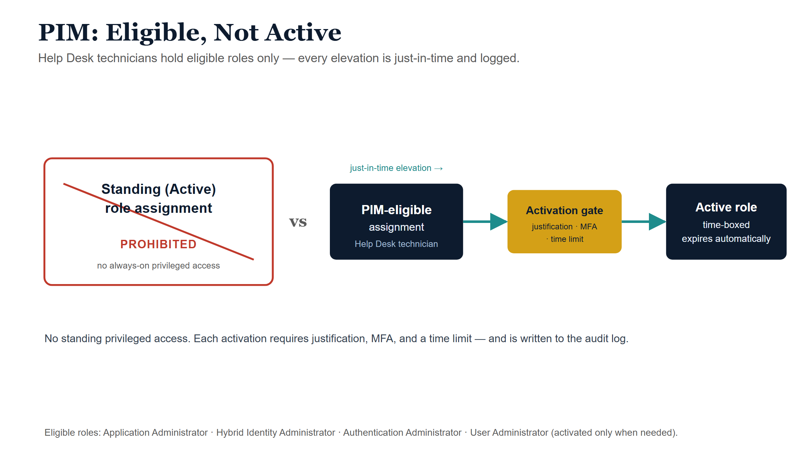
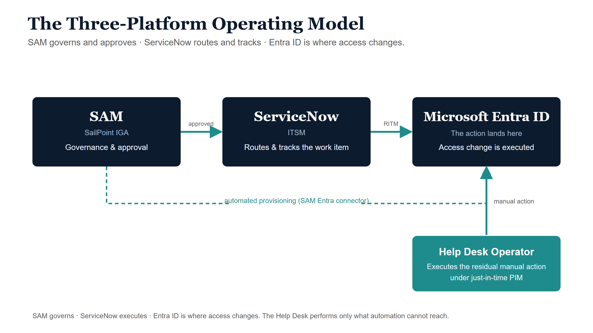
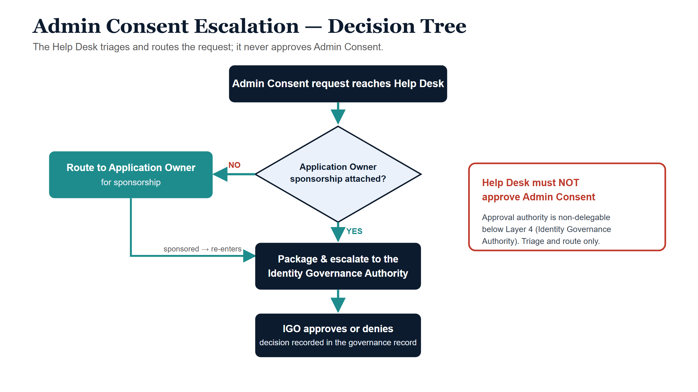

*Entra Governance Series — Document 1 of 3. Audience: IT leadership, Help Desk
supervisors, and Help Desk technicians. Platforms referenced: Microsoft Entra ID
· SAM (SailPoint IGA) · ServiceNow ITSM · Microsoft PIM.*

::: {.callout-note title="Document series notice"}
This document is **Document 1 of 3** in the agency's **Entra Governance** series.
Document 2 covers Privileged Identity Management (PIM) policy and elevation
procedures in full. Document 3 covers Identity Governance Officer (IGO)
responsibilities and Admin Consent governance. This guide should be read in
conjunction with both companion documents.
:::

## Purpose and scope

### Purpose

This guide establishes the authoritative reference for all **Microsoft Entra ID**
identity operations performed by Help Desk personnel within the agency. It
defines the authority boundaries of the Help Desk function, the privileged access
model under which Help Desk operators are permitted to act, the integration
requirements with the agency's **Systems Access Management (SAM)** platform and
**ServiceNow ITSM** environment, and the standard operating procedures for each
class of identity operation.

This document addresses a foundational architectural reality that all Help Desk
personnel and supervisors must understand: **Microsoft Entra ID does not include
a native "Help Desk" role that covers enterprise identity operations.** The
built-in *Helpdesk Administrator* role provided by Microsoft is scoped only to
password resets and basic Microsoft 365 tasks. It cannot assign groups to
Enterprise Applications, triage or approve Admin Consent grants, reset ImmutableID
attributes, manage app role assignments, or manage Service Principals. The
agency's Help Desk operational model is therefore built on a controlled,
PIM-gated **Privileged Access Group (PAG)** with specific least-privilege Entra
roles assigned to the group — not to individual technicians.

### Scope — what this guide governs

- All Microsoft Entra ID identity operations performed by Help Desk personnel,
  including Enterprise Application group assignments, ImmutableID resets, MFA
  method resets, OneDrive provisioning, and hybrid identity operations.
- The design and governance of the Help Desk Privileged Access Group (PAG) and
  Privileged Identity Management (PIM) elevation procedures.
- The integration workflow between the SAM platform (SailPoint-based IGA),
  ServiceNow ITSM, and Microsoft Entra ID for access requests and provisioning
  actions.
- Admin Consent triage and escalation procedures.
- Incoming notification and request handling from Microsoft Security notifications
  and ServiceNow-generated request items (RITMs).
- OneDrive sync issue triage, Entra-level resolution, and approval workflow.
- Escalation paths, audit requirements, and SLA obligations for all covered
  operations.

### Scope — what this guide does NOT cover

- **Global Administrator operations** — These are beyond Help Desk authority and
  are not documented here.
- **Admin Consent approval** — Help Desk may triage but never approve. Approval
  authority and procedure are documented in Entra Governance Document 3.
- **Conditional Access policy creation or modification** — Reserved for the
  Security Administrator role under Security Operations oversight.
- **Service Principal creation or management** — Reserved for Application Owners
  and Identity Engineering.
- **SAM platform administration** — SAM is a separate system governed under its
  own administrative procedures.
- **Entra ID Governance license features** (Access Packages, Entitlement
  Management, etc.) beyond what is explicitly documented herein.
- **Role assignment to other users or groups** — Help Desk may not assign or
  remove Entra directory roles.

### Applicability

This guide applies to all personnel occupying the **Help Desk Operator** function
within the agency's IT organization, including contracted support staff
performing Help Desk duties under agency oversight. Help Desk Supervisors are
responsible for ensuring all personnel under their supervision have read,
acknowledged, and are operating in accordance with this guide. Acknowledgment
records shall be maintained in the agency's personnel training system.

## Authority boundaries

The following table defines the precise boundary of Help Desk authority in
Microsoft Entra ID operations. This boundary is enforced by the **principle of
least privilege**, PIM-gated role elevation, and SAM-originated approval chains.
No action outside the "Authorized" column may be performed by Help Desk personnel
regardless of who requests it.

| **✓ Help Desk IS authorized to** | **✗ Help Desk is NOT authorized to** |
|---|---|
| Assign an Entra security group to an Enterprise Application, after SAM approval and ServiceNow RITM assignment. | Approve Admin Consent grants for Enterprise Applications — under any circumstances. |
| Remove an Entra group from an Enterprise Application, after SAM-originated RITM. | Create, modify, or delete Service Principals or App Registrations. |
| Reset a user's ImmutableID attribute using Hybrid Identity Administrator role via PowerShell, after IGO-approved RITM. | Assign or remove Entra directory roles from any user, group, or service principal. |
| Reset a user's MFA authentication methods using Authentication Administrator role (optional, where assigned). | Create, modify, or delete Conditional Access policies. |
| Perform password resets using User Administrator role (where assigned), subject to supervisor approval constraints. | Modify Entra ID Connect (hybrid sync) configuration or sync rules. |
| Triage Admin Consent notifications — verify, log, and escalate to Application Owner and IGO. | Grant OAuth permissions or delegated permissions to any application. |
| Trigger OneDrive provisioning for a licensed user via M365 Admin Center. | Modify license assignments except when authorized via a SAM-originated RITM with Departmental Owner approval. |
| Check Entra Sign-in Logs and Audit Logs for diagnostic purposes during triage. | Export, copy, or retain Entra audit log data outside approved SIEM or logging systems. |
| Check device compliance status and Entra Join status for OneDrive and access triage. | Delete or disable user accounts except via explicit, multi-approved SAM lifecycle workflow. |
| Execute PIM elevation (role activation) for approved roles via the PAG, with written justification entered in PIM request. | Maintain standing (persistent) active role assignments. All privileged access is time-bound and eligible only. |
| Document all actions in the associated ServiceNow ticket before closing the RITM. | Perform any Entra operation without a corresponding ServiceNow ticket in "Assigned" status. |

::: {.callout-warning title="Prohibited action"}
**Help Desk personnel may NEVER approve Admin Consent grants for Enterprise
Applications, regardless of the source of the request (email, ticket, verbal).**
Admin Consent approval authority is reserved exclusively for the **Identity
Governance Officer (IGO)** or **Global Administrator** acting under IGO direction.
Help Desk role is **triage and escalation only**. Any technician who approves an
Admin Consent grant outside this chain will be considered to have acted outside
their authority and will be subject to disciplinary and security review
procedures.
:::

## Help Desk Privileged Access Group (PAG) design

### Why group-based role assignment instead of individual role assignments

Microsoft Entra ID permits Entra directory roles to be assigned directly to
individual users. However, for Help Desk operations, direct individual role
assignments create unacceptable governance risk: they cannot be consistently
time-bound, they cannot enforce approval workflows before elevation, they are more
difficult to audit consistently, and they increase the attack surface in the event
of account compromise. The agency's identity governance model therefore
implements a **Privileged Access Group (PAG)** as the sole mechanism for granting
Help Desk personnel access to elevated Entra roles.

Under the PAG model:

- Entra directory roles (e.g., Application Administrator, Hybrid Identity
  Administrator) are assigned to the PAG, **not to individual users**.
- Help Desk technicians are members of the PAG with **eligible** assignment — they
  do not hold the roles actively until they explicitly activate via PIM.
- Every role activation is individually logged, requires a written justification,
  and is time-bound (maximum session defined in the PIM configuration below).
- Adding or removing a technician from the PAG (onboarding/offboarding) is itself a
  governed, approver-controlled operation in PIM and SAM.

### PAG naming convention

The agency's Privileged Access Group for Help Desk Entra operations shall be named
according to one of the following approved conventions, as adopted by the Identity
Engineering team during initial deployment:

| **Naming option** | **Group display name** | **Group type** | **Use case** |
|---|---|---|---|
| Option A (Recommended) | **Entra-HelpDesk-Operators** | Security Group, Role-Assignable | Standard agencies where IT is a single function |
| Option B | **IDM-HelpDesk-Operations** | Security Group, Role-Assignable | Agencies with a separate Identity Management (IDM) function within IT |

The group **must** be created as a **Role-Assignable Security Group** in Entra ID.
Standard security groups and Microsoft 365 Groups cannot be used for PIM-governed
role assignment. Group creation is performed by Identity Engineering, not by Help
Desk.

::: {.callout-note title="Note"}
Role-assignable groups in Entra ID are a premium feature requiring Entra ID P2
licensing (or Microsoft Entra ID Governance). Confirm licensing is in place with
Identity Engineering before PAG deployment.
:::

### PIM configuration — eligible, not active

{#fig-pim-eligible fig-alt="A blueprint contrasting two states. Left, a red-outlined box labelled Standing (Active) assignment — prohibited, struck through. Right, a navy box labelled PIM-eligible assignment with a teal just-in-time activation arrow passing through an amber gate labelled justification plus MFA plus time limit, arriving at a navy time-boxed active role box that expires. A grey footer: no standing privileged access; every elevation is logged." width="85%"}

All role assignments within the PAG are configured as **Eligible** in Microsoft
Entra Privileged Identity Management (PIM). Under no circumstances shall Help Desk
personnel hold **Active (standing)** role assignments for Application
Administrator, Hybrid Identity Administrator, Authentication Administrator, or User
Administrator. The following PIM configuration settings apply:

| **PIM setting** | **Required value** | **Rationale** |
|---|---|---|
| Assignment type | **Eligible** (not Active) | No standing privilege; elevation is explicit and logged |
| Maximum activation duration | **4 hours** (Application Admin, Hybrid Identity Admin); **2 hours** (Authentication Admin, User Admin) | Minimizes exposure window for privileged session |
| Approval required for activation | **Yes** — Approval by Help Desk Supervisor or Identity Engineering Lead | Two-person integrity for all elevated operations |
| Justification required | **Yes** — ServiceNow RITM number and brief action description required in justification field | Links every elevation to a governed work item |
| MFA required on activation | **Yes** — Phishing-resistant MFA (FIDO2 or certificate-based) required | Prevents credential-based elevation abuse |
| Eligible assignment expiration | **12 months** — PAG membership reviewed annually; must be re-approved | Ensures access certifications are enforced |
| Notification on activation | **Yes** — Alert to Help Desk Supervisor and Identity Engineering inbox | Real-time awareness of privilege use |

### Full audit trail

Every PIM elevation generates an immutable audit event in the Entra ID Audit Logs
and is captured by the agency's SIEM system. The audit record includes: the UPN of
the activating technician, the role activated, the justification text entered, the
timestamp of activation and deactivation, and the approver's UPN. This record is
retained per the audit and compliance requirements of this guide. Help Desk
personnel must enter the ServiceNow RITM number (e.g., "RITM0045821") in the PIM
justification field — entries that do not reference a valid RITM are flagged for
review.

### Onboarding a technician to the PAG

1. Help Desk Supervisor submits a SAM access request for the technician,
   specifying the **Entra-HelpDesk-Operators** PAG.
2. SAM routes the request through the standard approval chain: Departmental Owner →
   IGO (due to privileged nature).
3. Upon IGO approval, SAM generates a ServiceNow RITM tasked to Identity
   Engineering.
4. Identity Engineering adds the technician's account to the PAG in Entra ID as an
   **Eligible** member via PIM.
5. Identity Engineering resolves the RITM and notifies the Help Desk Supervisor.
6. Technician completes required PIM training and acknowledges this guide before
   first elevation.

### Offboarding a technician from the PAG

1. Supervisor submits offboarding or role-removal request in SAM upon technician
   departure, role change, or disciplinary action.
2. SAM immediately flags the account for access removal. IGO approval is not
   required for removals — removal is executed on SAM approval alone.
3. ServiceNow RITM is generated to Identity Engineering for immediate PAG
   membership removal.
4. Identity Engineering removes the technician's eligible assignment from PIM and
   resolves the RITM.
5. If a PIM session is active at the time of removal, Identity Engineering must
   also terminate any active role sessions.

## Assigned Entra roles and their scope

The following four Entra ID directory roles are the complete set of roles
assignable to the Help Desk PAG. Two are required; two are optional and must be
explicitly authorized by the IGO for inclusion in the agency's PAG configuration.

| **Role** | **Required / Optional** | **Authorized tasks** | **NOT authorized under this role** | **Notes** |
|---|---|---|---|---|
| **Application Administrator** | **Required** | Assign security groups to Enterprise Application role assignments. Remove group assignments from Enterprise Applications. View app role assignments for audit and triage. View and read Enterprise Application configurations. Review sign-in logs for application access diagnostics. | Create or delete App Registrations or Service Principals. Modify API permissions or consent settings. Approve Admin Consent grants. Modify application Conditional Access assignments. | This role provides write access to Enterprise Application role assignments — the most operationally critical capability for Help Desk. PIM elevation required for all write operations. Read access for diagnostics does not require elevation but must be documented. |
| **Hybrid Identity Administrator** | **Required** | Reset ImmutableID attribute on cloud-synced user objects via PowerShell. View Entra Connect synchronization status and health. Diagnose sync mismatches between on-premises AD and Entra ID. Initiate object re-sync after ImmutableID correction. | Modify Entra Connect synchronization rules or configuration. Create or modify on-premises AD objects (those remain in AD admin scope). Change tenant-level hybrid identity settings. Manage AD FS or Entra ID federation configuration. | ImmutableID operations carry significant risk — an incorrect reset can orphan the cloud object or create a duplicate. All ImmutableID actions require Identity Engineering Lead approval in the ServiceNow ticket before Help Desk proceeds. Procedure is in the Hybrid identity operations section. |
| **Authentication Administrator** | **Optional** (IGO authorization required) | Reset MFA authentication methods for non-administrator users. Re-register a user's FIDO2 key, authenticator app, or phone number. Temporarily disable MFA for a specific user under Help Desk Supervisor approval. View authentication method registration status for triage. | Manage authentication methods for any user holding an Entra directory role. Modify tenant-wide authentication policies. Create or modify Conditional Access authentication strength policies. Bypass MFA for accounts with privileged roles. | Authentication Administrator cannot manage MFA for other Administrators. If a user holding an Entra role requires MFA reset, escalate to Global Administrator or Privileged Authentication Administrator (out of Help Desk scope). |
| **User Administrator** | **Optional — Restricted** (IGO authorization required; use with caution) | Reset passwords for non-administrator users, where SAM and ServiceNow do not automate the reset. Assign or remove licenses when authorized via SAM-originated RITM with Departmental Owner approval. Trigger OneDrive provisioning for a newly licensed user. Update basic user profile attributes per SAM-initiated change request. | Delete user accounts. Manage users who hold Entra directory roles. Assign or remove Entra directory roles from users. Create guest or B2B invitation accounts. | User Administrator is the broadest optional role and must be activated only for the specific task authorized in the RITM. Supervisor approval is required before elevation. This role's inclusion in the PAG requires annual IGO re-authorization and must be justified by operational necessity. |

::: {.callout-important title="No native Help Desk role in Entra ID"}
The Microsoft built-in **Helpdesk Administrator** role is **NOT used** in this
agency's model and is **NOT assigned** to the PAG or to any Help Desk technician
individually. That role covers only password resets and basic M365 tasks. It
cannot assign groups to Enterprise Applications, triage Admin Consent, reset
ImmutableID, manage app role assignments, or manage Service Principals. The
PAG-based model documented in this guide is the correct enterprise architecture
for Help Desk identity operations.
:::

## SAM — Systems Access Management integration

### Overview — the three-platform model

{#fig-three-platform fig-alt="A left-to-right blueprint. A navy SAM box (governance and approval) feeds a navy ServiceNow box (ITSM routing and tracking) via a teal arrow, which feeds a navy Entra ID box (where the action lands) via a teal arrow. Below the Entra box, a teal Help Desk Operator box connects upward, labelled executes the residual manual action under just-in-time PIM. A grey footer notes: SAM governs, ServiceNow executes, Entra ID is where access changes." width="90%"}

The agency's access management architecture operates across three distinct but
integrated platforms. Help Desk personnel must understand the distinct role and
authority of each platform and must never conflate their functions.

| **Platform** | **Role in the architecture** | **Who administers it** | **Help Desk relationship** |
|---|---|---|---|
| **SAM (SailPoint IGA)** | Governs WHO gets access. Routes approvals through business and technical owners. Enforces access policy. Provisions to connected systems via automated connectors. Runs periodic access certifications. Source of truth for access decisions. | IAM / Identity Governance team | **Downstream** — Help Desk executes only what SAM has already approved. Help Desk does not make access decisions. |
| **ServiceNow (ITSM)** | Tracks work effort. Manages IT change records and request items (RITMs). Enforces SLAs. Provides the audit trail for ITSM actions. Receives auto-generated tasks from SAM and Entra alerts. | ITSM / Service Desk Operations | **Operational interface** — Help Desk works tickets here. Every Entra action must trace to a ServiceNow ticket. |
| **Microsoft Entra ID** | Enforces access at the identity layer — group memberships, app role assignments, Conditional Access policies, PIM governance, device compliance, hybrid identity sync. | Identity Engineering, Security Operations, Help Desk (within scope) | **Execution target** — Help Desk makes Entra changes only after SAM approval and ServiceNow task assignment. |

::: {.callout-note title="Key principle"}
**Help Desk is downstream of SAM.** Help Desk executes manual Entra ID actions
that SAM cannot automate — after SAM has approved the request and after ServiceNow
has created and assigned the task. Help Desk never makes access governance
decisions independently.
:::

### SAM actors relevant to Help Desk workflow

| **SAM actor** | **Role in workflow** | **Help Desk interaction** |
|---|---|---|
| **Access Requester** | Submits access request in SAM portal. Provides business justification and requested application/role. | None — entirely upstream of Help Desk. Help Desk does not receive or process SAM portal submissions directly. |
| **Business Approver (Departmental Owner)** | First-level approval in SAM. Validates that the requester has a legitimate business need for the requested access. | None — upstream approval. Help Desk is notified only after this approval is complete. |
| **Application Owner** | Second-level approval in SAM for application-specific access. Confirms the requester should be provisioned to the specific application role. | Help Desk is notified via ServiceNow RITM after Application Owner approval completes. For Admin Consent escalations, Help Desk routes to Application Owner for IGO referral. |
| **Identity Governance Officer (IGO)** | Final approval authority in SAM for high-risk access, ImmutableID changes, and all Admin Consent matters. Acts directly for Admin Consent approvals in the Entra portal — Help Desk does not handle that action. | For ImmutableID and high-risk actions: Help Desk executes the Entra action only after IGO approval appears in the ServiceNow ticket. For Admin Consent: IGO acts directly — Help Desk role is triage and escalation to Application Owner, who refers to IGO. |
| **SAM System (Automated)** | Provisions access via Entra ID connector for apps and groups that have a configured SAM-Entra connector with write access to the target resource. | Help Desk handles residual manual steps SAM cannot automate — primarily Enterprise Application group assignments where the SAM connector lacks write access to app role assignments, and ImmutableID operations requiring PowerShell. |
| **Help Desk Operator** | Receives ServiceNow RITM task after all required SAM approvals are complete. Executes the Entra action. Resolves the task with full documentation. | Performs PIM elevation, executes action in Entra portal or PowerShell, validates result, documents in ServiceNow, and resolves ticket. |

### How SAM auto-routes to ServiceNow

Help Desk personnel do not execute any Entra action until all three of the
following conditions are met:

1. **SAM shows the request as fully approved** — all approval stages in the SAM
   workflow are in "Approved" status. If any stage is pending, incomplete, or
   returned, Help Desk waits. Help Desk does not contact SAM actors to expedite
   approvals.
2. **A ServiceNow RITM task is in the Help Desk queue in "Assigned" status** — the
   task has been generated by SAM's ServiceNow integration, assigned to the Help
   Desk group, and is actively awaiting action. Tickets in "New," "Pending
   Approval," or "On Hold" status are not ready for action.
3. **The RITM contains all required metadata** — the ticket must include: the full
   approval chain (all approver names and approval timestamps), the requester's
   name and UPN, the target application name, the risk tier assigned by SAM, and
   the specific action required of Help Desk.

If any of these conditions is not met, Help Desk must place the ticket On Hold and
contact the SAM team or Help Desk Supervisor. Help Desk may not proceed on partial
information.

### SAM automation vs. Help Desk manual action

| **Action** | **Why SAM cannot automate** | **Help Desk action required** | **PIM role required** |
|---|---|---|---|
| Admin Consent approval | Requires a human administrator action in the Entra portal with Global Admin or Privileged Role Administrator rights. Cannot be scripted via SAM connector safely. | **ESCALATE ONLY** — Help Desk triages, documents, and escalates to IGO via Application Owner. IGO acts directly. Help Desk documents outcome. | N/A — Help Desk does not perform this action. |
| Group assignment to Enterprise Application role | SAM Entra connector may lack write access to app role assignment endpoint for specific applications. Not all apps are connector-provisioned. | Assign the SAM-approved group to the specified app role in Entra Enterprise Apps blade. | Yes — Application Administrator |
| ImmutableID reset | Requires PowerShell operations on cloud object (Set-MsolUser or Microsoft Graph). Cannot be executed by SAM connector. High risk — requires human judgment. | Execute ImmutableID reset via PowerShell after Identity Engineering Lead and IGO approval. See the Hybrid identity operations section. | Yes — Hybrid Identity Administrator |
| MFA method reset | Requires Authentication Administrator role action in Entra portal. SAM connector does not have authentication method management capability. | Reset specified authentication methods via Entra Portal → Users → Authentication Methods. | Yes — Authentication Administrator (optional role) |
| OneDrive provisioning trigger | Provisioning trigger requires M365 Admin Center access. SAM provisions the license but may not trigger the storage provisioning event. | Trigger provisioning via M365 Admin Center → Users → [User] → OneDrive tab. | No — M365 Admin Center action (non-PIM) |
| Entra group creation | SAM flags the need for a new Entra group but cannot create it in tenants where group creation policy restricts creation to Identity Engineering. | Create Entra security group per naming convention documented by Identity Engineering. Confirm with SAM team after creation. | No — Groups Administrator (if assigned) or via Identity Engineering |

## Incoming request types

### Microsoft Security notifications

#### What these notifications are

Microsoft generates automated security and consent-related email notifications to
tenant administrators and users. These messages originate from the sender address
**MSSecurity-noreply@microsoft.com**. Common notification types include: Admin
Consent request notifications (sent when a user requests consent for an
application and the tenant is configured to require admin approval), sign-in risk
alerts, identity protection risk detections, and service health notifications.

::: {.callout-warning title="Admin Consent emails"}
Help Desk personnel who receive or are forwarded a Microsoft Admin Consent request
email **must NOT** click the "Review permissions" or "Approve" link and approve
the consent grant. These links, if followed and approved by a Help Desk account
with Application Administrator role activated, may execute a consent grant with
elevated scope. Forward the email to the Application Owner and document in
ServiceNow. Do not action the email. See the Admin Consent triage workflow for the
full procedure.
:::

#### Help Desk triage steps for Microsoft Security notifications

1. **Validate legitimacy** — Confirm the email sender is exactly
   **MSSecurity-noreply@microsoft.com**. Spoofed addresses may use similar but
   distinct domains. If the domain is not microsoft.com, treat as phishing and
   report to the SOC.
2. **Identify notification type** — Is this an Admin Consent request, a risk
   alert, an identity protection detection, or a service health notice?
3. **Check Entra Audit Logs** — Navigate to Entra Portal → Monitoring → Audit
   Logs. Filter by the relevant user or application. Confirm whether any action
   has already been taken in the tenant (e.g., a consent grant already executed).
4. **Do NOT approve** Admin Consent grants based on the email. See the Admin
   Consent triage workflow.
5. **Create or update ServiceNow ticket** — Document the notification, your triage
   findings, and your escalation action.

| **Notification type** | **Help Desk action** | **Escalation path** |
|---|---|---|
| Admin Consent request | Triage and escalate. Do NOT approve. | Application Owner → IGO. See the Admin Consent triage workflow. |
| Sign-in risk alert (user risk elevated) | Check sign-in logs. If confirmed compromise risk, place account on hold and escalate. | Security Operations Center (SOC) + Help Desk Supervisor |
| Identity Protection risk detection | Document detection. Do not remediate risk policy settings. | Security Operations / Identity Engineering |
| Service health / outage notification | Check M365 Service Health Dashboard. Correlate with active user-reported issues. | Notify Help Desk Supervisor. Update open tickets with known-issue note. |

### ServiceNow request types

The following RITM types may appear in the Help Desk ServiceNow queue. Each is
described with the required validation, approval authority, and resolution steps.

#### SAM-generated RITM — Enterprise Application group access request

- **Description:** A user or group has been approved in SAM for access to an
  Enterprise Application. The SAM-Entra connector could not automate the group
  assignment. ServiceNow RITM is auto-created and assigned to Help Desk.
- **Required validation:** Confirm SAM request status is "Fully Approved." Confirm
  the group name in the RITM matches an existing Entra security group. Confirm the
  application name matches a registered Enterprise Application in Entra.
- **Approval authority:** SAM approval chain (already complete). No additional
  approval needed at execution stage.
- **PIM required:** Yes — Application Administrator.
- **Resolution steps:** See the Enterprise Application access assignment
  procedures.

#### SAM-generated RITM — Access certification revocation

- **Description:** A periodic SAM access certification has resulted in a revocation
  decision for a user's application access. SAM creates a ServiceNow RITM to remove
  the group assignment from the Enterprise Application.
- **Required validation:** Confirm the SAM certification decision is "Revoked" and
  has been finalized (not pending). Confirm the group and application names match
  Entra objects. Do not remove access if the certification is still in-progress.
- **Approval authority:** SAM certification result is authoritative — no additional
  approval.
- **PIM required:** Yes — Application Administrator.
- **Resolution steps:** Remove group from app role assignment in Entra Enterprise
  Apps blade. Document the certification ID in the ServiceNow ticket. Resolve
  ticket.

#### Admin Consent escalation ticket

- **Description:** A ServiceNow ticket requesting Admin Consent approval,
  originated by a user, manager, or forwarded Microsoft notification.
- **Required action:** TRIAGE AND ESCALATE ONLY. See the Admin Consent triage
  workflow.
- **Approval authority:** IGO or Global Administrator only. Help Desk does not
  approve.
- **PIM required:** No — Help Desk does not execute this action.

#### ImmutableID reset ticket

- **Description:** A user's on-premises AD account and Entra ID cloud account have
  become de-synced due to an ImmutableID mismatch. The ServiceNow RITM has been
  approved by both Identity Engineering Lead and the IGO.
- **Required validation:** Confirm two-stage approval is complete in the RITM
  (Identity Engineering Lead + IGO). Confirm the target UPN and the correct
  ImmutableID value to set are documented in the ticket. Do not proceed on
  incomplete approvals.
- **Approval authority:** Identity Engineering Lead + IGO (both required).
- **PIM required:** Yes — Hybrid Identity Administrator.
- **Resolution steps:** See the Hybrid identity operations section.

#### MFA reset request

- **Description:** A user cannot authenticate due to lost MFA device or method
  failure. ServiceNow RITM has been created and Help Desk Supervisor has approved.
- **Required validation:** Confirm user identity via agency-approved out-of-band
  verification process (not email alone). Confirm Supervisor approval in the
  ServiceNow approval task. Confirm the user does not hold an Entra directory role
  (if they do, escalate — out of Help Desk scope).
- **Approval authority:** Help Desk Supervisor.
- **PIM required:** Yes — Authentication Administrator (if assigned).
- **Resolution steps:** Delete the existing authentication methods for the user in
  Entra Portal → Users → [User] → Authentication Methods. Instruct user to
  re-register. Document in ServiceNow. Resolve ticket.

#### OneDrive sync issues — user self-service

- **Description:** User submits ServiceNow catalog item "OneDrive Sync Issue."
  Ticket is auto-assigned to Help Desk.
- **Required validation:** Ticket in Assigned status. No additional pre-approval
  required for client-side triage. Entra-level actions require approval as
  documented in the OneDrive sync issues section.
- **Approval authority:** Varies by resolution action. See the OneDrive sync
  issues section.
- **PIM required:** Varies by resolution action. See the OneDrive sync issues
  section.
- **Resolution steps:** See the OneDrive sync issues section for the full triage
  and resolution workflow.

## Admin Consent triage workflow

::: {.callout-warning title="Prohibited action"}
**Help Desk personnel may NEVER approve Admin Consent grants for Enterprise
Applications, regardless of the source of the request (email, ticket, verbal).**
Admin Consent approval authority is reserved exclusively for the **Identity
Governance Officer (IGO)** or **Global Administrator** acting under IGO direction.
Help Desk role is **triage and escalation only**. Any technician who approves an
Admin Consent grant outside this chain will be considered to have acted outside
their authority.
:::

### Admin Consent triage procedure

1. **Receive notification or ticket.** The trigger may be a Microsoft Security
   notification email (MSSecurity-noreply@microsoft.com), a user-submitted
   ServiceNow ticket, a forwarded email from a manager, or a verbal report. In all
   cases, create a ServiceNow ticket (or locate the existing one) and document the
   source and time of notification.
2. **Identify the request type.** Determine whether the request involves: (a)
   **User consent** — a user consenting to app permissions on their own behalf; (b)
   **Admin Consent** — an application requesting organization-wide permission
   grants requiring a tenant-level administrator action; or (c) **App permission
   change** — an existing app's API permissions have been modified and require
   re-consent. If the answer is (b) or (c), proceed to Step 5 without delay.
3. **Validate requestor identity and business justification.** Identify who is
   requesting the consent. Is there a legitimate business application associated
   with the request? Is the application name recognizable as an agency-sanctioned
   or commonly used vendor application? Document findings. A request for an unknown
   application or one with no verifiable business justification should be flagged
   as high-risk in the ticket.
4. **Check Entra Audit Logs for consent grant activity.** Navigate to Entra Portal
   → Monitoring → Audit Logs. Filter Activity: "Consent to application." Look for
   any consent events associated with the application or the requesting user. If
   consent has already been granted, document it and escalate immediately — an
   unauthorized grant may have occurred and requires security review.
5. **If Admin Consent is required: STOP. Do not proceed.** Do not click any
   approval links in the Microsoft notification email. Do not navigate to the Admin
   Consent requests page with the intent to approve. Escalate the ticket to the
   **Application Owner** identified in the SAM record for the application. Notify
   the Application Owner that IGO review is required. Update the ServiceNow ticket
   with escalation action and timestamp.
6. **Document outcome in ServiceNow.** Regardless of outcome, document in the
   ticket: notification source and content summary, request type determination,
   audit log findings, escalation target and timestamp, and current ticket status.
   Set the ticket to "Pending" with reason "Awaiting IGO Decision."
7. **Notify the requestor.** Inform the original requestor (user or manager) that
   the consent request has been received, has been escalated to the appropriate
   approval authority per agency policy, and that Help Desk cannot provide an
   approval timeline. Do not indicate whether approval is likely or unlikely.

### Admin Consent escalation decision tree

{#fig-consent-escalation fig-alt="A top-down decision-tree blueprint. Start node: Admin Consent request reaches Help Desk. Decision diamond: is the requester an Application Owner sponsor? If no, teal arrow to Route to Application Owner for sponsorship. If yes, teal arrow to Package and escalate to Identity Governance Authority. A red box on the side reads: Help Desk must NOT approve Admin Consent — non-delegable below Layer 4. Final navy node: IGO approves or denies and records the decision." width="85%"}

| **Condition** | **Help Desk action** | **Escalate to** | **Priority** |
|---|---|---|---|
| Admin Consent requested — no prior consent event in audit logs | Triage Steps 1–7. Escalate. | Application Owner → IGO | Normal — route per SLA |
| Admin Consent already granted in audit logs — source unclear | Escalate immediately. Flag as potential unauthorized action. | IGO + Security Operations | **High — immediate escalation** |
| Consent for unknown or unrecognized application | Do not approve. Flag as high-risk. Escalate. | IGO + Security Operations | **High — immediate escalation** |
| User consent only (not admin-level permissions) | Confirm user consent settings permit user consent. If yes, inform user. If tenant policy blocks user consent, escalate. | Application Owner if escalation needed | Normal |
| App permission scope change requiring re-consent | Triage as Admin Consent. Escalate to Application Owner → IGO. | Application Owner → IGO | Normal — route per SLA |
| Microsoft Security notification forwarded by manager requesting action | Do NOT action the email link. Triage Steps 1–7. Escalate. | Application Owner → IGO | Normal |

## Enterprise Application access assignment procedures

::: {.callout-important title="Prerequisite"}
A **SAM-approved RITM must be in "Assigned" status** in ServiceNow before any
Enterprise Application access assignment or removal action is initiated. Actions
performed without an active, approved RITM are a policy violation and will be
flagged in the next audit cycle.
:::

### Assigning a group to an Enterprise Application

The following steps assign an Entra security group to a role on an Enterprise
Application, granting the group's members access to the application.

1. **Verify RITM prerequisites:** Confirm the ServiceNow RITM is in "Assigned"
   status, all SAM approvals are complete, and the RITM contains the group name,
   application name, and app role name.
2. **Activate PIM — Application Administrator:** Navigate to Entra Portal →
   Identity Governance → Privileged Identity Management → My Roles → Eligible
   Assignments. Activate **Application Administrator**. Enter the RITM number and a
   brief action description in the justification field. Submit for supervisor
   approval. Wait for approval confirmation before proceeding.
3. **Navigate to Enterprise Applications:** In the Entra Portal, navigate to
   **Enterprise Applications**. Search for the application by name as specified in
   the RITM.
4. **Open Users and groups:** Select the application. In the left navigation,
   select **Users and groups**.
5. **Add Assignment:** Click **+ Add user/group**. In the assignment panel, click
   **None Selected** under Users and groups. Search for and select the Entra
   security group specified in the RITM.
6. **Select App Role:** Click **None Selected** under Select a role. Select the app
   role specified in the RITM. If only one role exists, it will be pre-selected.
7. **Confirm Assignment:** Click **Assign**. Verify the group now appears in the
   Users and groups list for the application with the correct role.
8. **Validate:** Confirm the group assignment persists after page refresh. If the
   group does not appear, do not close the ticket — document the failure and
   escalate to Identity Engineering.
9. **Document in ServiceNow:** In the RITM work notes, record: action performed,
   group name assigned, application name, app role assigned, time of action, and
   your UPN. Attach a screenshot if the agency's ServiceNow configuration supports
   attachments.
10. **Deactivate PIM session:** After completing the action and documentation,
    return to PIM and deactivate the Application Administrator role. Do not leave
    the role active beyond the time needed for the task.
11. **Resolve RITM:** Set the RITM to "Resolved" with resolution code "Successfully
    Completed." Notify the requesting party per ticket workflow.

### Removing a group from an Enterprise Application

1. Verify RITM prerequisites as in the assignment procedure, Step 1. Confirm the
   removal is SAM-certification-driven or IGO-directed.
2. Activate PIM — Application Administrator (same as the assignment procedure, Step
   2).
3. Navigate to Enterprise Applications → [Application] → Users and groups.
4. Locate the group to be removed. Check the checkbox next to the group name.
5. Click **Remove** in the toolbar. Confirm the removal in the dialog.
6. Verify the group no longer appears in the Users and groups list.
7. Document in ServiceNow as in the assignment procedure, Step 9. Deactivate PIM
   session. Resolve RITM.

### Validating existing app role assignments

For audit or triage purposes, Help Desk may review existing app role assignments.
This is a read-only action and does not require PIM elevation if the technician
has been granted reader access. Navigate to: Entra Portal → Enterprise
Applications → [Application] → Users and groups. Review the list of assigned users
and groups, their assigned roles, and assignment dates. Document findings in the
associated ServiceNow ticket.

### Authorization summary for Enterprise App actions

| **Action type** | **Authorizing body** | **SAM approval required** | **Additional approver** | **PIM role** |
|---|---|---|---|---|
| Assign group to app role (new access) | SAM (Business Approver + App Owner) | Yes | None | Application Administrator |
| Remove group from app role (revocation) | SAM (certification result or IGO direction) | Yes | None | Application Administrator |
| Read/view app role assignments (audit) | Help Desk Supervisor (informal) | No | None | None required (read-only) |
| Modify app role definitions or permissions | **OUT OF SCOPE — NOT AUTHORIZED** | N/A | N/A | N/A |

## Hybrid identity operations

::: {.callout-warning title="High-risk operations"}
Hybrid identity operations — particularly ImmutableID resets — carry significant
risk of user account disruption, duplicate object creation, or unrecoverable sync
state. **Help Desk must not proceed with any ImmutableID operation until both the
Identity Engineering Lead and the IGO have approved the RITM.** If there is any
doubt about the correct ImmutableID value to set, stop and contact Identity
Engineering before proceeding.
:::

### ImmutableID reset procedure

The **ImmutableID** (also called *onPremisesImmutableId* in Microsoft Graph) is
the attribute that links a cloud Entra ID user object to its corresponding
on-premises Active Directory object. If this value is mismatched, corrupted, or
absent, the user account will fail to synchronize and may experience
authentication failures, license issues, or a duplicate cloud account.

1. **Verify dual approval in RITM:** Confirm the ServiceNow RITM contains approval
   records for both the **Identity Engineering Lead** and the **IGO**. Both
   approvals must be in "Approved" status. If either is missing or pending, stop
   and contact your supervisor.
2. **Confirm target information:** The RITM must contain the user's **UPN**, the
   **current ImmutableID** (if known), the **correct ImmutableID value to set** (the
   Base64-encoded objectGUID from on-premises AD), and the reason for the reset. Do
   not determine these values independently — they must be provided in the approved
   ticket.
3. **Activate PIM — Hybrid Identity Administrator:** In Entra Portal → PIM → My
   Roles → Eligible Assignments, activate **Hybrid Identity Administrator**. Enter
   the RITM number in the justification field. Wait for supervisor approval.
4. **Connect to Microsoft Graph PowerShell (or MSOnline):** Open a privileged
   PowerShell session. Connect using the elevated session credentials:
   Connect-MgGraph -Scopes "User.ReadWrite.All"
5. **Retrieve the current user object:** Run Get-MgUser -UserId [UPN] | Select
   DisplayName, OnPremisesImmutableId. Confirm the displayed ImmutableID matches
   what is documented in the RITM as the "current" value. If it does not match,
   stop and contact Identity Engineering.
6. **Set the corrected ImmutableID:** Run Update-MgUser -UserId [UPN]
   -OnPremisesImmutableId "[CorrectValue]". The correct value must exactly match
   what is in the approved ticket.
7. **Verify the change:** Re-run the Get-MgUser command from Step 5 and confirm the
   ImmutableID now reflects the correct value.
8. **Initiate re-sync (if directed by Identity Engineering):** On the Entra Connect
   server (coordinated with on-premises AD team), run a delta sync:
   Start-ADSyncSyncCycle -PolicyType Delta. Confirm the user object syncs
   successfully in Entra Connect Health.
9. **Validate user account status:** In the Entra Portal, confirm the user account
   is in a healthy sync state, UPN is correct, and no duplicate accounts exist.
10. **Document and resolve:** Enter full command output (sanitized of any
    credentials) into the ServiceNow work notes. Deactivate PIM session. Resolve
    RITM.

### Sync mismatch identification and repair

When a user reports authentication failures or access loss that may be related to
hybrid identity, Help Desk should first check for sync mismatches before executing
any changes:

- In Entra Portal → Users → [User]: Check "On-premises sync enabled" status. If it
  shows "No" for a user who should be hybrid-synced, a sync issue is present.
- Check "Last sync time" under the user's On-Premises section. If sync is stale
  (older than the Entra Connect sync cycle — typically 30 minutes), escalate to
  Identity Engineering to check Entra Connect health.
- Check for duplicate user objects: Search Entra ID for the user's display name and
  confirm only one active object exists with the correct UPN.
- If duplicate objects are found, do not delete either object — escalate to
  Identity Engineering immediately. Duplicate hybrid objects require careful merge
  or clean-up procedures beyond Help Desk scope.

### Entra Connect health checks

Help Desk may perform read-only Entra Connect Health monitoring as a diagnostic
step. Navigate to Entra Portal → Entra Connect → Connect Health. Review sync
errors, agent status, and alert notifications. Help Desk **may not** modify Entra
Connect sync rules, connector configurations, or schedules. All modifications to
Entra Connect are reserved for Identity Engineering.

### Escalation to Tier 3 / Identity Engineering

The following conditions require immediate escalation to Identity Engineering and
suspension of Help Desk action:

- Duplicate user objects detected in Entra ID for a single on-premises account.
- ImmutableID value in the ticket does not match the current value in Entra ID.
- Entra Connect sync agent is in error state or not communicating.
- Password hash sync or pass-through authentication is failing tenant-wide.
- Any PowerShell command produces an error during an ImmutableID operation.
- User account does not recover to healthy sync state after ImmutableID reset and
  delta sync.

## OneDrive sync issues — Help Desk triage and resolution guide

### Overview

OneDrive sync failures frequently intersect with multiple layers of the identity
and device stack: Entra ID account status, license assignment, Conditional Access
policy enforcement, hybrid identity sync, device compliance, and OneDrive client
configuration. Help Desk is responsible for triaging all layers and resolving
those within its authority. Some root causes require PIM elevation; others are
pure client-side remediation. Conditional Access root causes must be escalated —
Help Desk may not modify CA policies.

### Common causes reference table

| **Cause** | **Category** | **Help Desk can resolve?** | **Notes** |
|---|---|---|---|
| Expired auth token / user not signed in to OneDrive client | Identity | **Yes** — client-side | Instruct user to sign out and back in. Most common cause. |
| Account not licensed for OneDrive / SharePoint | License | **Yes** — with User Admin role and Departmental Owner approval | Requires SAM-originated RITM with approval before license assignment. |
| Conditional Access policy blocking device or session | Conditional Access | **No — Escalate** | Help Desk identifies CA as the cause. Escalates to Security Admin. Help Desk cannot modify CA policy. |
| Device not Entra-joined or not registered | Device Compliance | **Partial** — Help Desk checks; may escalate | Help Desk can verify device join status and guide user through device re-registration where policy permits. Compliance remediation may escalate. |
| Known Folder Move (KFM) conflict | Client-side | **Yes** | Disable KFM, re-enable, or reset KFM policy in local OneDrive settings. |
| File path too long (>260 characters) | Client-side | **Yes** | Instruct user to shorten file or folder names. Error code 0x8007005A. |
| Corrupted OneDrive sync cache | Client-side | **Yes** | Reset cache: %localappdata%\Microsoft\OneDrive\onedrive.exe /reset |
| SharePoint site quota exceeded | Storage | **Yes** — notify site owner; may require SharePoint Admin for quota increase | Help Desk identifies the site quota status in SharePoint Admin Center. Quota increase requires SharePoint Admin. |
| UPN changed without re-sign-in to OneDrive client | Identity | **Yes** | Expected behavior after UPN change. User must sign out and sign back in to OneDrive client. No Entra action needed. |
| ImmutableID mismatch / duplicate cloud account | Hybrid Identity | **Yes** — with Hybrid Identity Administrator and full approval | Follow the full procedure in the Hybrid identity operations section. Requires Identity Engineering Lead + IGO approval. |
| OneDrive provisioning not completed after licensing | Provisioning | **Yes** — trigger via M365 Admin Center | Navigate to M365 Admin Center → Users → [User] → OneDrive tab → Trigger provisioning. |
| MFA prompt loop / modern authentication failure | Identity | **Yes** — with Authentication Administrator role if method reset needed | First attempt sign-out/sign-in. If auth method is broken, reset via Entra Auth Methods with PIM elevation. |
| Blocked file types (SharePoint policy) | Policy | **Partial** — Help Desk identifies; policy change escalates to SharePoint Admin | Check SharePoint Admin Center → Settings → Blocked file types. Help Desk cannot modify the blocked list. |

### Step-by-step triage workflow

1. **Gather information from user.** Collect: When did sync stop? What changed
   recently (password reset, new device, UPN change, relocation to new site)? What
   is the exact error message or error code displayed? Is the issue on a specific
   device or all devices? Is it affecting one OneDrive account or also SharePoint
   sites? Is the user fully or partially licensed?
2. **Check Entra ID account status.** In Entra Portal, navigate to Users → [User].
   Confirm: Account is Enabled (not blocked). UPN is correct and matches what the
   user is signing in with. License is assigned and includes SharePoint/OneDrive.
   "On-premises sync enabled" status is correct for the user type.
3. **Check for Conditional Access blocks in sign-in logs (PIM elevation
   required).** Activate Application Administrator via PIM if not already active.
   Navigate to Entra Portal → Monitoring → Sign-in Logs. Filter by the user's UPN
   and the OneDrive or SharePoint application. Look for sign-in events with Status
   "Failure" and check the Conditional Access tab within the event. If a CA policy
   shows "Failed," that CA policy is the root cause — document and escalate. Do not
   modify CA policy.
4. **Check device compliance status.** In Entra Portal → Devices, search for the
   user's device by name or device ID. Confirm: Device is Entra Joined or
   Registered. Compliance state is "Compliant." MDM enrollment is present. If the
   device is non-compliant or not registered, guide the user through re-enrollment
   where policy permits, or escalate to device management team.
5. **Check OneDrive provisioning status.** Navigate to M365 Admin Center → Users →
   Active Users → [User] → OneDrive tab. Confirm OneDrive provisioning has
   completed. If provisioning is not initiated, click "Create OneDrive" or "Trigger
   provisioning." This action requires a SAM-originated RITM with Departmental
   Owner approval in the ServiceNow ticket before proceeding.
6. **Check for ImmutableID / hybrid identity issues.** If the user is a
   hybrid-synced account and Steps 2–5 did not identify the cause, check Entra
   Connect Health for the user's sync object status. If an ImmutableID mismatch or
   duplicate object is found, escalate to Identity Engineering. Follow the Hybrid
   identity operations procedure if full approval is obtained.
7. **Client-side remediation.** If the root cause is client-side (expired token,
   cache corruption, file path, KFM conflict): (a) Instruct user to sign out of
   OneDrive client and sign back in with correct credentials. (b) If that fails,
   run: %localappdata%\Microsoft\OneDrive\onedrive.exe /reset from Windows Run
   dialog. (c) If that fails, clear OneDrive cache: delete contents of
   %localappdata%\Microsoft\OneDrive\settings. (d) If sync still fails, uninstall
   and reinstall the OneDrive client. (e) Re-open OneDrive and sign in.
8. **Document and resolve in ServiceNow.** Enter full triage findings, each step
   performed, results, and final resolution method in the ServiceNow ticket work
   notes. If the issue was fully resolved, set to "Resolved." If escalated, set to
   "Pending" with escalation details. Deactivate any active PIM sessions.

### Entra-specific resolution actions (PIM required)

| **Action** | **Required role** | **PIM required** | **Steps** |
|---|---|---|---|
| Check sign-in logs for OneDrive app | Application Administrator | Yes | Entra Portal → Monitoring → Sign-in Logs → filter by user and OneDrive app |
| Confirm or assign OneDrive license | User Administrator | Yes | Entra Portal → Users → [User] → Licenses → Assign; requires RITM + Departmental Owner approval |
| Trigger OneDrive provisioning | M365 Global Reader or Admin | No (M365 Admin Center action) | M365 Admin Center → Users → [User] → OneDrive tab → Create OneDrive; requires RITM + Departmental Owner approval |
| Reset MFA blocking authentication | Authentication Administrator | Yes | Entra Portal → Users → [User] → Authentication Methods → Delete broken method; requires Help Desk Supervisor approval |
| Check and repair ImmutableID | Hybrid Identity Administrator | Yes | PowerShell — see the Hybrid identity operations section; requires Identity Engineering Lead + IGO approval |

### ServiceNow auto-routing and approval workflow for OneDrive sync issues

#### Auto-routing trigger mechanisms

1. **User Self-Service:** User submits ServiceNow catalog item "OneDrive Sync
   Issue." Ticket is automatically assigned to the Help Desk tier queue. No
   pre-approval required to begin triage. Entra-level actions require approval
   before execution.
2. **SAM Alert:** SAM detects a provisioning failure or license gap for a user
   account (e.g., license removed during access certification). SAM automatically
   creates a ServiceNow incident and assigns to Help Desk with the affected user's
   UPN and specific failure reason.
3. **Azure Monitor / Entra Alert:** An Azure Monitor alert or Entra diagnostic rule
   detects repeated sign-in failures for the OneDrive application from a specific
   user or group of users. The alert fires a webhook that auto-creates a ServiceNow
   incident assigned to Help Desk for investigation.

#### Approval requirements by resolution action

| **Resolution action** | **Approval required?** | **Approver** | **Approval method** | **Help Desk proceeds after** |
|---|---|---|---|---|
| Client-side fix only (sign-out/in, reset, reinstall) | No | N/A | N/A | Ticket in Assigned status |
| License assignment or modification | Yes | Departmental Owner | ServiceNow approval task | Approval complete + User Admin PIM elevation |
| OneDrive provisioning trigger | Yes | Departmental Owner | ServiceNow approval task | Approval complete in ServiceNow |
| MFA reset to resolve authentication loop | Yes | Help Desk Supervisor | ServiceNow approval task | Supervisor approval complete + Auth Admin PIM elevation |
| ImmutableID repair | Yes — two-stage | Identity Engineering Lead + IGO | Two-stage ServiceNow approval workflow | Both approvals complete + Hybrid Identity Admin PIM elevation |
| Conditional Access exception or policy modification | Yes — ESCALATE, Help Desk does NOT execute | Security Admin + IGO | Separate CAB (Change Advisory Board) process | Help Desk documents and escalates. Does not execute. |

#### Full OneDrive resolution workflow

1. **SAM detects issue or user submits catalog item** → ServiceNow ticket created
   and assigned to Help Desk queue.
2. **Help Desk acknowledges ticket** within SLA acknowledgement window. Sets ticket
   to "In Progress."
3. **Help Desk performs triage** — Steps 1–6 of the step-by-step triage workflow —
   without PIM elevation where possible.
4. **Help Desk determines root cause** and identifies required resolution action.
5. **If resolution requires approval**: Help Desk creates a ServiceNow approval
   task assigned to the appropriate approver (Departmental Owner, Supervisor,
   Identity Engineering Lead, or IGO). Sets ticket to "Pending Approval."
6. **Approver acts on approval task** in ServiceNow. Upon approval, ticket returns
   to "In Progress" in Help Desk queue.
7. **Help Desk executes Entra-level resolution** after PIM elevation as required.
   Documents all actions in work notes.
8. **Help Desk validates resolution**: Confirms with user that OneDrive sync has
   resumed. Confirms Entra sign-in logs show successful authentication to OneDrive
   app.
9. **Help Desk resolves ticket**: Enters resolution summary. Updates SAM if a
   provisioning or license status change was made (SAM team coordinates
   bi-directional sync). Deactivates PIM session. Closes RITM.

::: {.callout-warning title="Conditional Access policies"}
Help Desk must **NOT modify Conditional Access policies** even when CA is confirmed
as the root cause of the OneDrive sync failure. CA policy modification is reserved
for Security Administrators under Security Operations oversight. Help Desk action
is to identify, document, and escalate.
:::

::: {.callout-note title="UPN change behavior"}
A UPN change in Entra ID will **always** break OneDrive sync until the user signs
out of the OneDrive client and signs back in with the new UPN. This is expected
behavior, not a bug. No Entra-level action is required. Inform the user and
instruct them to sign out and sign back in to the OneDrive client on all devices.
:::

::: {.callout-note title="Password reset sync errors"}
Password reset sync errors in OneDrive **almost always resolve** by signing out and
back in to the OneDrive client after the password change is complete. Help Desk
should verify this simple step before escalating or performing any Entra-level
action.
:::

::: {.callout-warning title="Ad hoc fixes are a policy violation"}
Help Desk must **NEVER** execute an Entra-level OneDrive fix without a ServiceNow
ticket in "Assigned" status and all required approvals complete. **Ad hoc fixes
performed outside the ServiceNow workflow — regardless of urgency or who requests
them — are a policy violation** and will be identified during the next audit cycle.
If urgency is claimed, escalate to the Help Desk Supervisor who may invoke the
emergency change process through ServiceNow.
:::

## Escalation matrix

| **Issue type** | **Help Desk can handle?** | **Escalate to** | **Escalation trigger** |
|---|---|---|---|
| **Admin Consent request** | Triage only — NOT approval | Application Owner → Identity Governance Officer (IGO) | Any request involving Admin Consent permissions, regardless of source |
| **Enterprise Application group assignment** | Yes — with App Admin PIM + approved RITM | Identity Engineering if Entra connector or app configuration issue | Assignment fails to persist; App not found in Enterprise Apps; SAM approval metadata incomplete |
| **ImmutableID reset** | Yes — with Hybrid Identity Admin PIM + dual approval (Identity Engineering Lead + IGO) | Identity Engineering if PowerShell errors; if duplicate objects found | Incorrect ImmutableID value provided; command errors; account does not recover after sync; duplicate objects detected |
| **MFA method reset** | Yes — with Auth Admin PIM + Supervisor approval; only for non-admin users | Global Admin or Privileged Auth Administrator for users holding Entra roles | User holds an Entra directory role; Auth Admin role not assigned to PAG; method reset fails |
| **Conditional Access — access blocked** | Identify and document only — NOT modify | Security Operations / Security Administrator + IGO for policy exceptions | CA policy confirmed as root cause of any access issue; user requires policy exception |
| **Entra directory role assignment** | No — completely out of scope | Identity Engineering + IGO | Any request to assign, modify, or remove an Entra directory role from any user or group |
| **Service Principal creation or modification** | No — completely out of scope | Application Owner + Identity Engineering | Any request to create, modify, or delete a Service Principal or App Registration |
| **OneDrive sync — client-side root cause** | Yes — no PIM required | End-user device support team if client reinstall fails | Reinstall fails; device OS issue; managed device policy conflict |
| **OneDrive sync — Conditional Access root cause** | Diagnose only — NOT modify | Security Admin + IGO via CAB process | CA policy confirmed as blocking OneDrive authentication |
| **OneDrive sync — ImmutableID / hybrid identity root cause** | Yes — with full dual approval and Hybrid Identity Admin PIM | Identity Engineering if duplicate objects; if approval cannot be obtained | Duplicate objects; approval not obtained; repair fails |
| **Unauthorized access grant detected in audit logs** | Document and escalate immediately — no remediation without direction | IGO + Security Operations Center (SOC) — immediate notification | Any audit log entry showing consent, role assignment, or access grant without corresponding approved RITM |

## Audit and compliance requirements

### PIM elevation logging

Every PIM role activation by a Help Desk technician generates an audit event in the
Entra ID Audit Logs that is automatically exported to the agency's SIEM system. The
audit record includes the activating technician's UPN, the role activated, the
justification text entered (must include the ServiceNow RITM number), the approval
chain (supervisor who approved), the activation and deactivation timestamps, and
the maximum session duration. Justification fields that do not reference a valid
RITM number are automatically flagged for review by the Identity Engineering team
and the IGO within 24 hours.

### Enterprise Application change documentation

All Enterprise Application group assignment and removal actions must be documented
in the associated ServiceNow RITM work notes before the ticket is closed. The
documentation must include: the specific action performed (assign or remove), the
group name, the application name, the app role, the time of action, the
technician's UPN, and confirmation that the action was validated. Tickets closed
without adequate work notes documentation will be returned for completion by the
Help Desk Supervisor.

### SAM-originated RITM SLA requirements

| **RITM priority** | **Acknowledgement SLA** | **Resolution SLA** | **Escalation trigger** |
|---|---|---|---|
| Priority 1 — Critical (security-related, IGO-directed) | 15 minutes | 4 hours | Supervisor notified at 50% of resolution window |
| Priority 2 — High (access certification revocation, ImmutableID) | 1 hour | 8 hours (business hours) | Supervisor notified at 6 hours |
| Priority 3 — Normal (Enterprise App assignment, MFA reset) | 4 hours | 3 business days | Supervisor notified at day 2 |
| Priority 4 — Low (OneDrive sync, provisioning trigger) | 8 hours | 5 business days | Supervisor notified at day 4 |

### Quarterly access reviews

The PAG membership (Entra-HelpDesk-Operators) is subject to a formal access review
on a **quarterly basis**, coordinated by the IGO and executed through the SAM
platform. Each review cycle:

- SAM generates a certification campaign for all current PAG members.
- Help Desk Supervisor reviews and certifies each member's continued need for PAG
  membership.
- Any member not certified within the certification window is automatically removed
  from the PAG by SAM.
- Results are documented in SAM and a summary report is provided to the IGO.
- Annual re-authorization by the IGO is required for the PAG to remain active with
  its current role configuration.

### Audit log retention

Entra ID Audit Logs and Sign-in Logs are retained in accordance with the agency's
data retention policy and applicable federal and state records management
requirements. Logs are exported from Entra ID to the agency's SIEM and long-term
log management system. Help Desk personnel are **not permitted** to export, copy,
delete, or modify audit logs. Audit log access for Help Desk purposes is read-only
and limited to diagnostic triage within active ServiceNow tickets. Any request to
access audit logs outside of an active ticket must be approved by the Help Desk
Supervisor and the IGO.

### Non-compliance reporting

Help Desk Supervisors are responsible for reporting the following conditions to the
IGO within one business day of discovery:

- A PIM elevation occurred without a corresponding valid ServiceNow RITM number in
  the justification.
- An Entra action was taken and discovered post-hoc to not have a corresponding
  approved RITM.
- A technician attempted or succeeded in performing an action listed as NOT
  authorized in the Authority boundaries section.
- An Admin Consent grant was executed by a Help Desk account.
- A technician shared, copied, or attempted to export audit log data outside of
  approved systems.

## Document control

### Version history

| **Version** | **Date** | **Author** | **Reviewed by** | **Change summary** |
|---|---|---|---|---|
| 1.0 | June 2026 | Identity Governance Officer | IT Security, Help Desk Supervisor, Identity Engineering Lead | Initial release. Covers full Help Desk Entra ID operational scope including PAG design, SAM integration, Admin Consent triage, Enterprise Application procedures, hybrid identity operations, and OneDrive sync triage. |
| 1.1 | TBD | — | — | Reserved for next review cycle updates. |

### Review cycle

This document is subject to a minimum **annual review** cycle, with interim updates
issued as required when Microsoft Entra ID role definitions change, when SAM
platform upgrades affect integration behavior, when new request types are added to
the Help Desk scope, or when an audit finding or security incident requires policy
revision. Interim updates are classified as minor versions (e.g., 1.1, 1.2). Major
structural revisions increment the major version number.

### Document owner and approval authority

| **Role** | **Individual / Position** | **Responsibility** |
|---|---|---|
| Document Owner | Identity Governance Officer (IGO) | Final approval authority for all versions. Directs content updates. Signs off on annual review. |
| Technical Author | Identity Engineering Lead | Drafts technical procedure sections. Reviews for accuracy with each version. |
| Operational Reviewer | Help Desk Supervisor | Reviews for operational feasibility and clarity. Confirms alignment with current Help Desk workflows. |
| Security Reviewer | IT Security Officer | Reviews authority boundary and escalation sections for compliance with agency security policy. |
| Distribution | All Help Desk personnel, IT Leadership | Required reading. Acknowledgement recorded in training system on initial distribution and at each major version. |

### Related documents

- **Entra Governance Document 2 of 3:** Privileged Identity Management (PIM) Policy
  and Elevation Procedures
- **Entra Governance Document 3 of 3:** Identity Governance Officer (IGO)
  Responsibilities and Admin Consent Governance
- SAM (SailPoint) Access Request and Certification User Guide
- ServiceNow ITSM Help Desk Operator Reference Guide
- Agency Information Security Policy — Identity and Access Management chapter
- Microsoft Entra ID Least Privilege Role Reference (Microsoft Learn)
