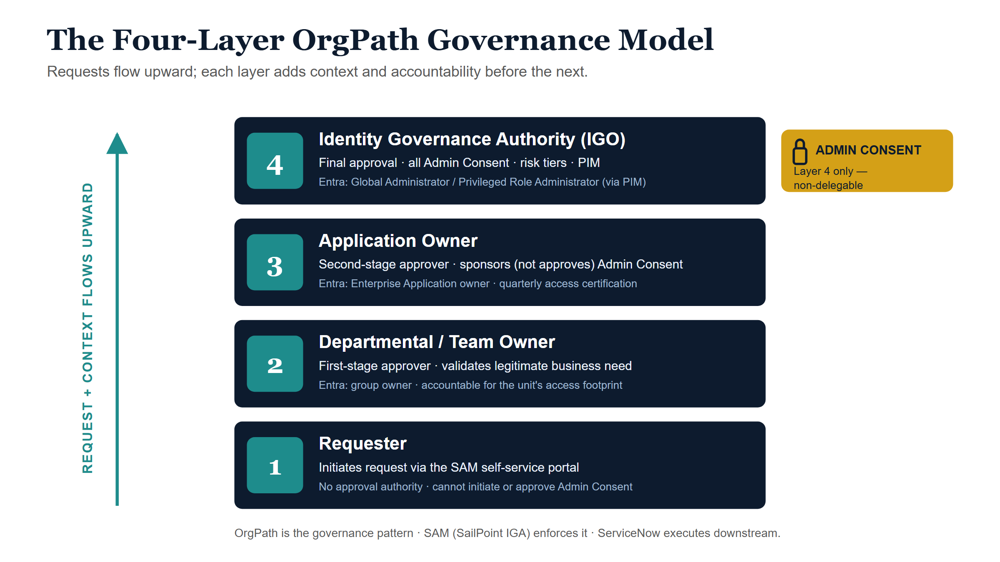

*Entra Governance Series — Document 2 of 3. Audience: agency IT leadership,
enterprise architects, and Identity Governance Officers. Platforms referenced:
Microsoft Entra ID · SAM (SailPoint IGA) · ServiceNow ITSM · Microsoft PIM.*

## Executive summary

Microsoft Entra ID is the foundation of enterprise identity for most modern
government agencies — but it is not, by design, an identity governance tool. It
provides powerful authentication, authorization, and access control
capabilities, yet it contains no native mechanism for routing governance
decisions through an organizational hierarchy. When an application requests
Admin Consent, when an access request is submitted, or when a quarterly access
review is due, Entra ID does not know who the accountable approver is, what
business unit is affected, or what risk tier applies. That institutional
knowledge lives only in people's heads — and when those people change, the
knowledge disappears.

The result is a fragmented, high-risk governance posture: Admin Consent approved
by whoever holds Global Admin at the time, application ownership informal or
absent, access requests routed by email or tribal knowledge, and audit trails
too incomplete to satisfy federal compliance standards.

**The OrgPath model addresses this structural gap.** OrgPath is not a product or
a new technology platform. It is a governance design pattern — a formal
organizational structure that defines who owns what, who can approve what, and
how decisions flow across four explicit layers of authority. Implemented through
SAM (the agency's SailPoint-based Identity Governance and Administration
platform), OrgPath transforms ad hoc identity decisions into a structured,
auditable, enforceable process.

Together, OrgPath and SAM establish the connective tissue that Entra ID lacks: a
formal path from access requester to identity governance authority, with every
decision documented, every approval accountable, and every entitlement
traceable.

::: {.callout-tip title="Key recommendations"}
- **Adopt the OrgPath four-layer model** as the agency's formal identity
  governance structure, encoded in SAM and reflected in Entra ID configuration.
- **Assign a named Application Owner** in both Entra ID and SAM for every
  Enterprise Application in the agency's inventory before the next quarterly
  certification cycle.
- **Restrict Admin Consent approval authority** unconditionally to Layer 4
  (Identity Governance Authority) — no exceptions regardless of request source,
  urgency, or instruction channel.
- **Configure SAM approval workflows** to enforce the OrgPath routing chain per
  application risk tier, replacing informal email-based approval with a
  structured, time-bound, escalating process.
- **Establish quarterly access certification campaigns** in SAM, scoped by
  Application Owner, to systematically eliminate orphaned assignments,
  over-permissioned accounts, and undocumented access.
:::

## The problem: governance without structure

Before defining the solution, it is important to understand with precision why
the current state is insufficient — and why this is not merely an administrative
oversight but an active risk to the agency's security posture, compliance
standing, and operational continuity.

### Admin Consent approved without a defined chain of authority

When an Enterprise Application requests OAuth 2.0 Admin Consent in Microsoft
Entra ID, that request surfaces to any user holding the Global Administrator
role or a delegated consent permission. There is no native mechanism in Entra ID
to require that the consent request travel through a defined approval chain. In
most agencies today, the result is that Admin Consent is granted by whichever
Global Admin is available and responsive — without a formal assessment of the
application's risk, without documented business justification, and without
accountability attached to a specific organizational role. A single uninformed
consent decision can grant a third-party application read or write access to the
entirety of the agency's Microsoft 365 data estate.

### Application ownership is informal and undocumented

Most agency Enterprise Application inventories contain dozens to hundreds of
registered applications. In the vast majority of cases, no single person is
formally designated as the accountable owner of each application. The developer
who originally registered the application may have moved on. The business unit
that sponsored the application may have reorganized. The result is an application
inventory where ownership is effectively unknown — and without ownership, there
is no one to review access, no one to sponsor consent requests, and no one to
decommission applications that are no longer needed.

### Access requests routed inconsistently

Without a defined organizational structure governing access decisions, access
requests follow informal paths determined by individual habit rather than
institutional policy. Requests arrive by email, by phone call, by ServiceNow
ticket submitted directly to the Help Desk, or by word of mouth. Different
requesters receive different outcomes based on which administrator they happened
to contact. There is no assurance that business need has been validated, that
appropriate authority has approved, or that the outcome is consistent with the
agency's access policy for the application in question.

### Incomplete audit trails — decisions not tied to organizational roles

Federal identity governance standards, including OMB Memo M-19-17, NIST SP
800-53 (AC-2, AC-6), and FedRAMP access control requirements, mandate that access
decisions be traceable to accountable individuals acting within defined roles.
When access is granted informally — through direct administrator action, email
approval, or undocumented ServiceNow work — the audit trail captures the
technical action but not the governance chain. The agency cannot answer basic
audit questions: Who authorized this access? What business justification was
provided? Who is the accountable owner of this application? When was this access
last reviewed?

### Consequential risks of the current state

- **Over-permissioned applications:** Applications granted broad Admin Consent
  scopes without risk assessment represent a persistent data exposure risk.
- **Orphaned assignments:** Users who have changed roles, transferred, or
  departed retain access because there is no accountable owner triggering
  removal.
- **Untracked consent grants:** Admin Consent approvals not recorded in a
  governance system create a hidden inventory of third-party access grants that
  cannot be systematically reviewed or revoked.
- **Compliance exposure:** Inability to produce an auditable access decision
  trail creates material risk in federal audit, Inspector General review, and
  FedRAMP assessment contexts.
- **Privilege drift:** Without structured periodic re-justification, users
  accumulate access entitlements over time that far exceed their current role
  requirements.

## What an OrgPath-style structure is

An OrgPath-style governance structure is a formal hierarchical organizational
path that links every identity and access governance decision to a defined chain
of roles with explicit accountability, approval authority, and escalation logic.
It answers three foundational governance questions that Entra ID cannot answer on
its own:

- **Who owns what?** Every Enterprise Application, every access group, and every
  entitlement is mapped to a named, accountable individual at a defined layer of
  the hierarchy.
- **Who can approve what?** Approval authority is explicitly assigned by layer
  and by risk tier — not by who happens to be available, who holds a broad
  administrative role, or who receives an email notification.
- **How do decisions flow?** Requests follow a defined routing path from the
  initiating requester through progressively more authoritative layers, with each
  layer adding business context, validation, and accountability before the
  request reaches its final approval authority.

::: {.callout-note title="What OrgPath is — and is not"}
**OrgPath IS:** A governance design pattern — a set of structural rules defining
roles, ownership, approval authority, and routing logic for identity and access
decisions.

**OrgPath IS NOT:** A new technology, a new software platform, or a replacement
for Entra ID, SAM, or ServiceNow. It is the governance logic that these existing
platforms implement and enforce.
:::

The closest intuitive analogy is an organizational chart — but for access
decisions rather than personnel reporting relationships. Just as an org chart
defines who reports to whom and who has authority to make which decisions, an
OrgPath structure defines the routing hierarchy for every identity governance
action the agency takes. When an access request is submitted, the system does not
ask "who is available?" — it asks "what is the defined path for this application,
at this risk level, for this type of request?"

OrgPath is implemented as governance configuration within SAM (the agency's
SailPoint-based IGA platform), which enforces the routing logic, manages the
approval workflow, integrates with Entra ID for provisioning, and generates the
audit record. It is also reflected in Entra ID configuration — specifically in
Enterprise Application owner assignments, group ownership, and Privileged
Identity Management (PIM) role assignments — and downstream in ServiceNow for
ticket-based execution of residual manual actions.

## The four-layer OrgPath model

The OrgPath model is organized into four sequential layers of governance
authority. Each layer has a defined role, defined responsibilities, and a defined
position in the approval routing chain. Requests flow upward through the layers,
with each layer adding context and accountability before passing to the next.

{#fig-four-layer fig-alt="A four-band blueprint diagram, Layer 1 at the bottom rising to Layer 4 at the top, with a teal upward arrow on the left labelled 'request and context flows upward.' Layer 1 Requester: initiates a request via the SAM self-service portal, no approval authority. Layer 2 Departmental/Team Owner: first-stage approver validating business need, Entra group owner. Layer 3 Application Owner: second-stage approver, sponsors but does not approve Admin Consent, Entra Enterprise Application owner. Layer 4 Identity Governance Authority: final approval, all Admin Consent, risk tiers, PIM, Entra Global Administrator via PIM. An amber badge beside Layer 4 reads Admin Consent — Layer 4 only, non-delegable. Footer: OrgPath is the governance pattern, SAM enforces it, ServiceNow executes downstream." width="90%"}

### Layer 1 — Requester

**Who they are:** The end user, contractor, or system account initiating a
request for access to an application, resource, or entitlement.

**How they interact:** Requesters initiate all access requests through the SAM
self-service portal. They do not submit requests directly to administrators, via
email, or through informal channels. The SAM portal captures the requester's
identity, the specific entitlement requested, and the stated business
justification at submission.

**What they cannot do:** Requesters have no approval authority. A requester
cannot approve their own access, cannot bypass the OrgPath routing chain, and
cannot initiate an Admin Consent request (that authority belongs to Layer 3).

**Entra ID mapping:** End user identity in Entra ID (Entra user object).

### Layer 2 — Departmental / Team Owner

**Who they are:** The manager, team lead, or designated representative
accountable for the access footprint of a business unit, department, or team.
This is a named individual — not a shared mailbox, not a distribution list, and
not a generic administrative account.

**How they interact:** The Departmental Owner receives SAM approval tasks as the
first-stage approver in the routing chain. Their responsibility is to validate
the business need: Does the requester actually need this access for their role?
Is the access consistent with the department's current operational requirements?
They are not assessing technical risk — that is a Layer 3 and Layer 4 function —
but they are accountable for confirming that the request reflects a legitimate,
current business requirement.

**Governance accountability:** Departmental Owners are accountable for the total
access footprint of their business unit. They cannot claim ignorance of what
their team members have access to — SAM surfaces that information directly to
them in certification campaigns.

**Platform assignments:** Represented as a SAM role owner and first-stage
approver in SAM approval workflows; assigned as Entra group owner for groups
associated with their department or team.

### Layer 3 — Application Owner

**Who they are:** The designated, named individual accountable for a specific
Enterprise Application — its access roster, its risk classification, its Admin
Consent posture, and its ongoing governance. This is always a specific named
person, never a group, team, or role shared across multiple individuals.

**How they interact:** The Application Owner serves as the second-stage approver
in the SAM approval chain. After Layer 2 validates business need, Layer 3
validates application-specific appropriateness: Is this entitlement level correct
for the stated role? Does granting this access create a conflict or risk for this
application? They also conduct quarterly access reviews in SAM, reviewing and
certifying every current user of their application.

**Admin Consent role — critical distinction:** Application Owners may RECOMMEND
and SPONSOR Admin Consent requests. They provide the business context, the
technical justification, and the formal sponsorship that accompanies a consent
request when it is escalated to Layer 4. They may NOT approve Admin Consent. That
authority is unconditional at Layer 4 only.

**Platform assignments:** Designated as Application Owner in the Entra ID
Enterprise Application owner field; configured as SAM application owner and
second-stage approver in all access request workflows for that application. A
backup/delegate owner must also be designated to prevent governance failure
during absence or transition.

### Layer 4 — Identity Governance Authority (IGO)

**Who they are:** The agency's Identity Governance Office or equivalent governing
body — the final, unconditional authority for high-risk identity and access
decisions. This layer holds the most privileged Entra ID roles (Global
Administrator, Privileged Role Administrator) and the IGO designation in SAM.

**How they interact:** The IGO is the final escalation point for high-risk access
requests and the sole approval authority for all Admin Consent grants. They
receive fully documented requests from SAM, complete with the business
justification from Layer 2, the technical sponsorship from Layer 3, and the risk
classification attached to the application. They do not receive cold,
context-free tickets — they receive structured, validated governance packages.

**Governance responsibilities:** In addition to Admin Consent approval, Layer 4
conducts or oversees quarterly access reviews for the highest-risk applications,
sets and updates application risk classifications, manages the agency's Entra ID
Privileged Identity Management (PIM) configuration, and serves as the final
escalation point for Separation of Duties conflicts flagged by SAM.

**Platform assignments:** Global Administrator and/or Privileged Role
Administrator in Entra ID (ideally via PIM with just-in-time activation); IGO
governance policy enforcer and final-stage approver in SAM; recipient of
escalated ServiceNow approvals for high-risk tickets.

## Admin Consent governance — policy control

::: {.callout-warning title="Agency policy: prohibited action"}
No personnel operating below Layer 4 (Identity Governance Authority / IGO) may
approve Admin Consent grants for Enterprise Applications. This prohibition
applies regardless of request source — email notification, verbal instruction,
ServiceNow ticket, or SAM workflow task.

Admin Consent approval authority is **non-delegable** below the IGO level.
Application Owners (Layer 3) may RECOMMEND and SPONSOR Admin Consent requests but
may NOT approve them.

**This is an unconditional control. No exception exists for urgency, convenience,
or perceived low risk.**
:::

### Current state: the unstructured consent problem

In the current operating environment, Admin Consent requests surface directly to
Global Administrators without organizational context. A Global Admin receiving a
consent request via email, Azure portal notification, or ServiceNow ticket has no
structured information about why the request is being made, what business unit
sponsored it, or what risk the requested OAuth scopes represent. The approval
decision is made in isolation — by whoever holds the Global Admin role and is
available at the time — with no formal chain of authority, no documented
justification, and no systematic risk assessment. This is precisely the condition
that creates the most consequential identity security failures in enterprise
environments.

### OrgPath state: structured consent routing

Under the OrgPath model, an Admin Consent request never reaches Layer 4 cold. It
arrives fully packaged, having traveled through the defined governance chain:

| Layer | Role in the Admin Consent workflow | What they add to the request |
|---|---|---|
| **Layer 1 — Requester** | Initiates the access or integration request via SAM | Business need statement, identity of requesting user/system, application identification |
| **Layer 2 — Departmental Owner** | First validation — confirms business need is legitimate and current | Department-level business justification, confirmation of requester's role appropriateness |
| **Layer 3 — Application Owner** | Formal sponsorship — evaluates the consent request against the application's risk profile | Application context, scope assessment, risk tier, formal sponsorship, recommended approval or alternative scopes |
| **Layer 4 — IGO** | Final approval authority — reviews the complete package and approves or denies | Governance decision, audit record, Entra ID consent action, risk documentation |

The critical distinction from the current state: by the time the IGO receives the
consent request, it is not a raw technical ticket. It is a structured governance
package — complete with business justification, departmental validation,
application owner sponsorship, and risk tier documentation. The IGO can make an
informed, defensible decision in minutes rather than days, and the complete
approval chain is recorded in SAM before any action is taken in Entra ID.

::: {.callout-note title="Governance benefit: context before consent"}
Under OrgPath, every Admin Consent decision arrives at Layer 4 with a documented
governance chain. The IGO never approves a cold, context-free consent request.
This single structural change eliminates the most common source of
over-permissioned application consent grants in enterprise Entra ID environments.
:::

## How OrgPath improves access governance

The benefits of the OrgPath model extend well beyond Admin Consent routing. The
same structural logic that governs consent requests also governs every access
entitlement in the agency's application portfolio — and the cumulative effect is
a fundamentally different access governance posture.

### Every Enterprise Application has a named owner

One of the most immediate structural improvements delivered by OrgPath is the
requirement that every Enterprise Application in the agency's inventory be
assigned to a named Application Owner at Layer 3. This is not optional and not
deferred — it is a precondition for the OrgPath model to function. Until an
application has a named owner, governance decisions about that application have no
accountable authority to route through.

### Group-based access governed by Layers 2 and 3

Entra ID group-based access — where membership in a security group or Microsoft
365 group grants access to one or more applications — is governed within the
OrgPath model by the Departmental Owner (Layer 2) for membership decisions and the
Application Owner (Layer 3) for access scope decisions. Neither layer has
unilateral authority to both approve membership and control access scope — this
separation of function is a deliberate governance control.

### Quarterly access reviews scoped to Application Owners

SAM generates quarterly access certification campaigns automatically. Application
Owners (Layer 3) receive certification tasks scoped precisely to the applications
they own — they review every current holder of every entitlement for their
application. This is not a generic "review all access" exercise. It is a
structured, application-specific accountability review where the person with the
most relevant knowledge (the Application Owner) is the one making certification
decisions. Each certify or revoke decision is recorded in SAM with timestamp and
approver identity.

### Orphaned assignments systematically eliminated

In the current state, orphaned access assignments — access retained by users who
have changed roles, transferred, or departed — persist indefinitely because there
is no accountable owner to identify and remove them. Under OrgPath, Application
Owners are formally accountable for the complete access roster of their
application. They cannot certify "approve" for a user they cannot identify or
whose business need they cannot confirm. Orphaned assignments surface immediately
in certification campaigns and are resolved within the certification SLA.

### Privilege drift prevented through certification cycles

Users accumulate access entitlements over time as they take on new
responsibilities — but rarely have access removed when those responsibilities
end. OrgPath addresses privilege drift structurally: every entitlement must be
re-justified through the OrgPath chain on each certification cycle. An Application
Owner who cannot confirm a continuing business need for an entitlement is required
to revoke it — SAM will either automatically revoke (for fully connected
applications) or generate a ServiceNow task for Help Desk execution. Access that
cannot be justified does not persist.

## How OrgPath defines application ownership

### The application inventory as governance foundation

OrgPath begins with a complete, accurate inventory of every Enterprise
Application registered in the agency's Entra ID tenant. This inventory —
maintained in SAM as the authoritative application catalog — maps each
application to its Layer 3 Application Owner, its risk tier, its approved access
scopes, and its current user roster. An application that does not appear in the
SAM application inventory is, by definition, ungoverned — and the OrgPath model
treats ungoverned applications as a priority remediation item.

### Application Owner responsibilities

The Application Owner role under OrgPath carries defined, non-delegable
responsibilities:

- **Access approval:** Serve as the second-stage approver for all access requests
  to the owned application in SAM.
- **Admin Consent sponsorship:** Evaluate and formally sponsor Admin Consent
  requests for the owned application, providing the technical and business context
  that accompanies escalation to the IGO.
- **Quarterly certification reviews:** Review and certify the complete access
  roster of the owned application in SAM on the defined certification schedule.
- **Risk classification maintenance:** Maintain and update the risk tier
  classification for the owned application in SAM, in coordination with the IGO for
  reclassification of high-risk applications.
- **Decommissioning accountability:** When an application is no longer needed, the
  Application Owner initiates the decommissioning process — ensuring access is
  revoked, Admin Consent is withdrawn, and the application is removed from the
  Entra ID tenant in a governed manner.

### Formal documentation in both SAM and Entra ID

Application ownership under OrgPath is not an informal understanding. It is
formally documented in two systems simultaneously: the Application Owner is
designated in the Entra ID Enterprise Application owner field (visible in the
Entra admin portal and auditable via Microsoft Graph API), and configured as the
SAM application owner in the SAM application record (which drives approval routing
and certification campaign assignment). A discrepancy between the two systems is
treated as a governance gap requiring immediate remediation.

### Backup and delegate owner requirement

Every application must have at least one designated backup or delegate
Application Owner — a named individual who can perform all Application Owner
governance functions in the primary owner's absence. This requirement prevents
governance failure during leave, role transitions, or organizational changes. The
backup owner is documented in SAM alongside the primary owner and is assigned the
same Entra ID application owner designation. Single points of failure in
application ownership are not acceptable under the OrgPath model.

::: {.callout-important title="Application ownership is not optional"}
Every Enterprise Application in the agency Entra ID tenant must have a named
Application Owner assigned in both SAM and Entra ID before the OrgPath model can
govern it. Applications without a designated owner represent an active governance
gap. Identifying and closing this gap — assigning owners to all applications — is
the highest-priority prerequisite implementation step.
:::

## SAM — the OrgPath technology implementation layer

SAM is the agency's SailPoint-based Identity Governance and Administration (IGA)
platform. Where OrgPath is the governance design pattern — the set of structural
rules defining roles, ownership, routing logic, and approval authority — SAM is
the technology engine that enforces those rules in practice. Every component of
the OrgPath model has a direct SAM implementation counterpart.

### OrgPath layer to SAM implementation mapping

| OrgPath layer | OrgPath role | SAM / SailPoint implementation | Entra ID mapping |
|---|---|---|---|
| **Layer 1** | Requester | SAM access request portal (self-service); identity captured at submission | End user identity object in Entra ID |
| **Layer 2** | Departmental / Team Owner | SAM role owner; configured as first-stage approver in access request workflow | Entra group owner for department/team security groups |
| **Layer 3** | Application Owner | SAM application owner; second-stage approver; receives certification campaigns scoped to owned applications | Entra ID Enterprise Application owner field |
| **Layer 4** | Identity Governance Authority | SAM governance policy enforcer; final-stage approver for high-risk requests and all Admin Consent escalations; configures SoD policies and risk tiers | Global Administrator / Privileged Role Administrator in Entra ID (via PIM) |

### How SAM encodes OrgPath routing logic

SAM's approval workflow engine is the mechanism by which OrgPath routing logic
becomes operationally enforceable. The configuration principles are as follows:

- **Per-application approval chains:** Each application in the SAM application
  catalog has an access request policy that defines the exact approval chain —
  Layer 2 → Layer 3 → Layer 4 — calibrated to the application's risk tier.
  Lower-risk applications may require only Layer 2 and Layer 3 approval; high-risk
  applications require the full four-layer chain including IGO review.
- **Automatic routing by risk classification:** SAM automatically routes incoming
  requests through the correct approval chain based on the application's
  configured risk tier. There is no manual determination of routing required —
  the configuration enforces it.
- **Time-based escalation:** If a layer approver does not respond within the
  defined Service Level Agreement (SLA) window, SAM automatically escalates the
  request to the next layer. Governance decisions do not stall because an approver
  is unavailable — the routing chain continues.
- **Separation of Duties (SoD) enforcement:** SAM evaluates every access request
  against the agency's configured SoD policies at the moment of submission, before
  the request enters the approval chain. Requests that would create a prohibited
  SoD conflict are automatically blocked and routed to the IGO for exception
  review — they never proceed silently through a standard approval chain.
- **Authoritative access model:** SAM maintains the authoritative record of every
  application's approved roles, approved access holders, and ownership
  assignments. This record is the governance source of truth — not Entra ID, not
  ServiceNow, and not any local spreadsheet or informal tracking system.

### How SAM integrates with ServiceNow

Not all access provisioning actions can be executed automatically by SAM through
its Entra ID connector. For access requiring manual administrator action in Entra
ID — such as the assignment of highly privileged roles not managed through
standard group membership — SAM triggers a downstream ServiceNow workflow:

- Upon completion of the full SAM approval chain, SAM creates a ServiceNow Request
  Item (RITM) for manual provisioning.
- The RITM contains the complete SAM approval chain record, requester identity,
  application, entitlement details, and risk tier classification — no context is
  lost in the handoff.
- ServiceNow routes the RITM to the appropriate Help Desk queue after all SAM
  approvals are complete. The Help Desk does not independently determine routing —
  it receives a fully approved, fully documented work instruction.
- RITM completion is reported back to SAM, which updates the entitlement record to
  reflect the provisioned status. The governance loop is closed in SAM, not in
  ServiceNow.

### How SAM supports quarterly access certifications

- SAM generates access certification campaigns automatically on the defined
  schedule — quarterly for Tier 1 (high-risk) applications, semi-annually for Tier
  2, and annually for Tier 3.
- Each campaign is scoped to the Application Owner for each application — they
  receive tasks in SAM to review and certify every current user of their
  application.
- For applications with a fully configured SAM-Entra ID connector, SAM executes
  revocation decisions automatically. For applications not fully connected, SAM
  generates a ServiceNow task for Help Desk execution of the revocation in Entra
  ID.
- All certification decisions — approve, revoke, and abstain — are recorded in SAM
  with timestamp, approver, and decision rationale. This record constitutes the
  auditable proof of access review required for federal compliance certifications.

### Recommended implementation steps: SAM-OrgPath integration

1. **Import the agency application inventory into SAM** as managed applications,
   including all Enterprise Applications currently registered in the Entra ID
   tenant.
2. **Assign an Application Owner (Layer 3)** for each application in SAM, ensuring
   alignment with the Entra ID Enterprise Application owner field.
3. **Configure SAM approval workflows** matching the OrgPath four-layer routing
   logic per risk tier for each managed application.
4. **Enable SAM's Entra ID connector** for automated provisioning of group-based
   access for all applicable applications.
5. **Configure SAM-ServiceNow integration** for residual manual provisioning
   tasks that require Help Desk action in Entra ID.
6. **Configure SoD policies in SAM** for all identified high-risk application
   combinations, ensuring conflicts are blocked at the point of request
   submission.
7. **Enable SAM access certification campaigns** on the quarterly (Tier 1),
   semi-annual (Tier 2), and annual (Tier 3) schedule by application risk
   classification.
8. **Train Departmental Owners and Application Owners** on the SAM approval
   portal, certification workflow, and their respective governance
   responsibilities under OrgPath.

## Integration with ServiceNow

ServiceNow functions as the ITSM (IT Service Management) execution layer for
identity governance actions that originate downstream of SAM decisions, as well
as for governance workflows that are initiated outside of the SAM portal. Its
role in the OrgPath model is explicitly bounded: ServiceNow executes what SAM and
OrgPath have already governed and approved. It does not perform independent
governance decisions.

### OrgPath routing logic in ServiceNow

For access or governance requests that originate in ServiceNow rather than the
SAM portal — such as access requests submitted by users unfamiliar with the SAM
portal, or escalations from service desk interactions — ServiceNow approval
workflows are configured to mirror the OrgPath routing chain:

- Tickets requiring access approval are routed first to the Departmental Owner
  (Layer 2) for business need validation.
- Upon Layer 2 approval, tickets route to the Application Owner (Layer 3) for
  application-specific review.
- High-risk tickets and all Admin Consent-related tickets escalate to the IGO
  (Layer 4) for final approval before any provisioning action is taken.
- The complete approval chain is captured in the ServiceNow ticket record — the
  audit trail is end-to-end and fully attributable.

### Auto-escalation and SLA enforcement

ServiceNow SLA configurations enforce the same time-bound escalation logic as
SAM. If an approver at any layer does not respond within the defined SLA window,
the ticket automatically escalates to the next layer. This ensures that
governance decisions do not stall in an approver's queue — a common failure mode
in email-based approval processes that OrgPath explicitly eliminates.

::: {.callout-note title="ServiceNow's role in the OrgPath model"}
ServiceNow is the execution layer — it tracks, routes, and audits ticket-based
work. It is not the governance authority. When a ServiceNow ticket instructs a
Help Desk technician to provision access or grant Admin Consent, that ticket must
carry the SAM approval chain or OrgPath approval record as its authorization. A
ServiceNow ticket that lacks this governance provenance does not constitute
authorization for a privileged identity action.
:::

## Benefits summary

| Governance challenge | Without OrgPath | With OrgPath (via SAM) |
|---|---|---|
| **Admin Consent routing** | Ad hoc — Global Admin cold approval with no business context | Formal four-layer sponsorship chain; IGO receives a fully documented governance package before approving |
| **Application ownership** | Informal, undocumented, or unknown | Named Application Owner formally recorded in SAM and Entra ID; backup owner required |
| **Access request approval** | Inconsistent — email, phone, or informal channel depending on individual habit | Structured SAM portal with enforced, risk-tiered approval chain and time-bound escalation |
| **Quarterly access reviews** | Ad hoc, infrequent, or entirely absent | SAM-driven certification campaigns per Application Owner, automatically scheduled by risk tier |
| **Audit trail completeness** | Incomplete — decisions captured as technical actions, not tied to accountable governance roles | Full audit chain in SAM + ServiceNow + Entra ID; every decision attributed to a named OrgPath role |
| **Privilege drift prevention** | None — access accumulates indefinitely without structural re-justification | SAM certification cycles require affirmative re-justification; unjustified access is revoked automatically |
| **SoD enforcement** | None — conflicts not detected until post-incident review, if ever | Automated SoD policy enforcement at point of request submission in SAM; conflicts blocked before reaching an approver |
| **Orphaned assignment management** | Orphaned access persists indefinitely; no accountable owner to identify and remove it | Application Owners certify complete access rosters each cycle; unconfirmed assignments trigger automatic revocation |
| **Provisioning speed** | Days to weeks for manual, approval-by-email processes | Automated provisioning via SAM Entra ID connector for group-based access; ServiceNow RITM for residual manual actions |
| **Compliance readiness** | Unable to produce complete, role-attributable access decision trails for audit | Complete, exportable governance records in SAM supporting federal audit, IG review, and FedRAMP assessment |

## Recommended implementation steps

The following implementation sequence is organized to deliver early risk
reduction while building toward full OrgPath operational maturity. Steps are
ordered by governance impact and logical dependency — some can proceed in
parallel; none should be skipped.

1. **Inventory all Enterprise Applications.** Conduct a complete audit of every
   Enterprise Application registered in the agency's Entra ID tenant. Document
   each application's name, purpose, current ownership status (if any), and
   current Admin Consent grants. This inventory is the foundation of every
   subsequent step.
2. **Assign a named Application Owner to each application in Entra ID and SAM.**
   For every application in the inventory, designate a specific named individual
   as the Application Owner and a specific named individual as the backup owner.
   Record both in the Entra ID Enterprise Application owner field and in the SAM
   application record simultaneously.
3. **Classify each application by risk tier.** Working with Application Owners and
   the IGO, assign each application a risk tier (Tier 1 high-risk, Tier 2
   moderate-risk, Tier 3 standard) based on the sensitivity of data accessed, the
   Admin Consent scopes granted, and the breadth of the potential impact of a
   compromise. Risk tier drives SAM approval chain configuration and certification
   frequency.
4. **Define Departmental Owners for each major business unit.** Identify and
   formally designate Departmental Owners (Layer 2) for each major business unit or
   team in the agency. Assign them as Entra group owners for their department's
   security groups and configure them as first-stage approvers in SAM workflows for
   applications their department uses.
5. **Encode OrgPath routing in SAM approval workflows and ServiceNow.** Configure
   SAM access request policies for each managed application to enforce the
   four-layer OrgPath approval chain appropriate to the application's risk tier.
   Configure ServiceNow approval workflows for tickets that originate outside SAM
   to mirror the same routing logic.
6. **Update Entra Enterprise Application owner fields.** Ensure all Entra ID
   Enterprise Application owner designations reflect the OrgPath Layer 3
   assignments from Step 2. Audit via Microsoft Graph API to confirm completeness
   and accuracy across the full application inventory.
7. **Establish a quarterly access review cadence in SAM.** Configure SAM
   certification campaigns for each application, scoped to the designated
   Application Owner, with frequency aligned to the application's risk tier. Enable
   automatic revocation execution for fully connected applications and ServiceNow
   task generation for residual manual revocations.
8. **Publish the OrgPath structure and communicate to stakeholders.** Distribute
   the OrgPath governance model, role descriptions, and policy controls
   (particularly the Layer 4-only Admin Consent restriction) to all agency IT
   leadership, Departmental Owners, Application Owners, and Help Desk staff.
   Conduct targeted training sessions for Layer 2 and Layer 3 role holders on the
   SAM approval portal and their certification responsibilities.

::: {.callout-important title="Implementation priority note"}
Steps 1 and 2 (application inventory and owner assignment) are prerequisite to
all other steps. No other component of the OrgPath model can function effectively
until every Enterprise Application has a named, documented Application Owner.
Agencies should treat Step 2 completion as the first measurable milestone of
OrgPath implementation.
:::

## Conclusion

The gap this brief addresses is not a technology gap. Microsoft Entra ID, SAM
(SailPoint), and ServiceNow are each capable platforms. The gap is a governance
structure gap — the absence of a defined organizational hierarchy that tells
these platforms who is accountable, who can approve what, and how decisions should
flow. Without that structure, even the most capable platforms operate on informal,
inconsistent, undocumented inputs and produce governance outcomes that cannot be
audited, defended, or relied upon.

The OrgPath model fills that gap. It is not a product. It is not a new
procurement. It is a governance design pattern — a set of structural rules that
assigns ownership, defines authority, and establishes the routing logic through
which every identity and access governance decision in the agency must flow. It is
fully compatible with Microsoft Entra ID, SAM (SailPoint IGA), ServiceNow,
Privileged Identity Management (PIM), and federal identity compliance frameworks
without modification to any underlying platform.

SAM is the technology layer that brings OrgPath to life — enforcing routing logic,
managing approval workflows, conducting certification campaigns, integrating with
Entra ID for automated provisioning, and generating the audit trail that federal
compliance requires. ServiceNow executes downstream of SAM, tracking and
completing the residual manual work that automated provisioning cannot yet reach.

Together, these three components — OrgPath as the governance structure, SAM as the
technology engine, and ServiceNow as the execution layer — transform the agency's
identity governance posture from ad hoc and fragmented to structured, auditable,
and enforceable. This is not a marginal improvement. It is the foundational change
required to operate a mature, compliant, and defensible identity governance
program in the Microsoft Entra ID environment.

::: {.callout-tip title="The case for OrgPath adoption"}
- OrgPath gives Entra ID the organizational governance structure it lacks
  natively — defining who owns what, who can approve what, and how decisions flow.
- SAM (SailPoint IGA) is the proven technology platform to encode and enforce
  OrgPath logic across the agency's complete application portfolio.
- The Admin Consent policy control — Layer 4 approval only, no exceptions —
  eliminates the agency's highest-risk current identity governance exposure.
- Quarterly SAM certification campaigns, scoped to Application Owners, replace ad
  hoc or absent access reviews with a systematic, auditable, and enforceable
  governance cycle.
- The OrgPath model is the right foundation for a mature, compliant identity
  governance program — and it can be implemented incrementally, with measurable
  risk reduction at each step.
:::

## ServiceNow automation alignment

This document is operationalized ServiceNow-first: requests enter a ServiceNow triage queue, are classified by required authority, and are routed to the ServiceNow or SAM approval pipeline; approved tasks execute through the Microsoft Entra ID Spoke where an action exists, and fall to a manual Help Desk task otherwise. See [Help Desk Flow — Intake, Triage, and Routing](helpdesk-flow.qmd) for the mechanisms and the task to Spoke capability crosswalk.
