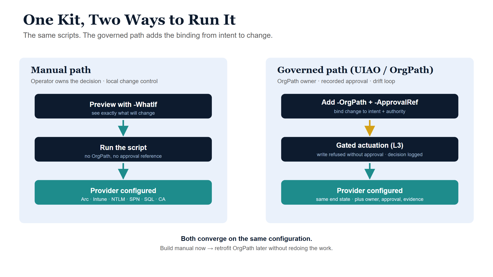

# Intune + Azure Arc Modernization {.unnumbered}

This kit modernizes a Hybrid Active Directory estate onto **Microsoft Intune**
(workstations) and **Azure Arc** (servers), and closes out the identity work
that rides alongside it — NTLM elimination, SPN hygiene, SQL Server hardening,
and a Conditional Access baseline. It names only platforms the agency already
runs: Entra ID, Intune, Azure Arc, Azure Policy, Defender, and Active Directory.

It is runnable **two ways from the same scripts**:

- a **[manual path](manual-path.qmd)** — you preview each change with `-WhatIf`
  and own the decision under local change control; and
- a **[UIAO / OrgPath-governed path](governed-path.qmd)** — every change is
  bound to an organizational path, an actuation rung, and a recorded approval.

If you build the manual path now and want governance later, you do **not** redo
the work — see **[Add OrgPath later (retrofit)](retrofit-path.qmd)**.

::: {.callout-tip title="Download the runnable kit"}
The companion **[Intune + Azure Arc Modernization Kit](../../../download/index.qmd#intune--azure-arc-modernization)**
ships these pages alongside an implementation-path guide, a shared PowerShell
module, and twelve Microsoft Graph / Az scripts (Arc onboarding + baseline,
Intune auto-enrollment + posture, NTLM audit + restriction, SPN repair, SQL
hardening audit, CA baseline + drift, a cross-domain status roll-up, and an
OrgPath survey helper for the retrofit). Every state-changing script honors
`-WhatIf`.
:::

## The pages

| Page | What it covers |
|---|---|
| [Manual path](manual-path.qmd) | The end-to-end technical runbook with no governance control plane — Arc onboarding, Intune enrollment, NTLM/SPN/SQL hardening, Conditional Access, monitoring, and rollback. Each operator owns the decision. |
| [Governed path (UIAO / OrgPath)](governed-path.qmd) | The same end state, bound to canon governance — control-plane-governs-data-plane, OrgPath scoping, the L0–L4 actuation ladder, the drift-detection loop, and evidence. |
| [Add OrgPath later (retrofit)](retrofit-path.qmd) | For estates already built the manual way: how to layer OrgPath governance on top **without** re-doing the Intune/Arc work. |

## How the two paths relate

The manual path and the governed path produce the **same configuration** on the
Microsoft surface. The governed path adds the binding from organizational intent
to technical change: who owns it, what authorizes it, and how drift is caught.

{#fig-two-paths fig-alt="Side-by-side flow comparing the manual path and the governed path converging on the same Intune/Arc end state"}

## A note on terminology {#terminology}

In this repository, **UIAO** is the *Unified Identity-Addressing-Overlay
Architecture* — an **active reconciliation control plane** that *governs*
provider data planes (Entra, Intune, Azure Policy, AD) per
[ADR-092](../../../adr/adr-092-active-governance.html). It holds desired state,
observes actual state, classifies drift, and reconciles toward intent; it is
**not** an inline runtime component and does not replace the providers.
**OrgPath** is the organizational path carried by every governed object so its
state is addressable in the same terms across every plane. The governed path
below is written to that definition.
