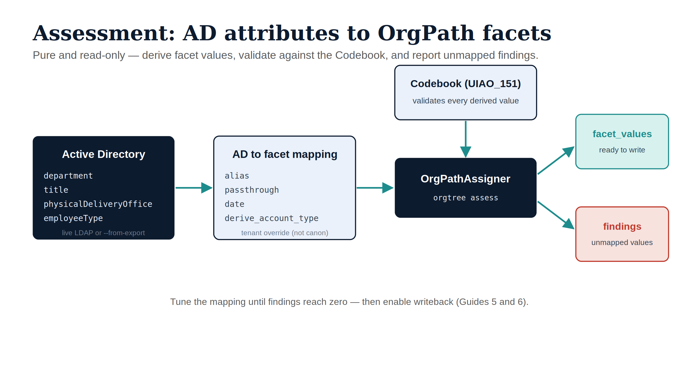

# 3 · Assess AD → Derive Facets {.unnumbered}

Assessment turns raw Active Directory records into validated OrgPath facet
values. It is **pure and read-only** — it derives and reports; it writes
nothing. Run it as many times as you need while you tune the mapping.

CLI: `uiao orgtree assess` · Modules:
`uiao.modernization.orgtree.ad_assign` (`OrgPathAssigner`) and `ad_mapping`
(`OrgPathMapping`).

{#fig-assessment-pipeline fig-alt="Engineering blueprint diagram on a white background. Left to right: a navy Active Directory box listing department, title, physicalDeliveryOffice, employeeType (live LDAP or --from-export). A teal arrow to an ice AD-to-facet mapping box listing the transforms alias, passthrough, date, derive_account_type (tenant override, not canon). A teal arrow to a navy OrgPathAssigner box (orgtree assess); above it an ice Codebook (UIAO_151) box validates every derived value with a downward arrow. Two outputs on the right: a teal facet_values box (ready to write) and a red findings box (unmapped values). Caption: tune the mapping until findings reach zero, then enable writeback. No human figures, 16:9 landscape." width="90%"}

## 3.1 Two input modes

### Offline (recommended to start)

Feed a JSON export of AD object records — repeatable, diff-able, no directory
connectivity:

```bash
uiao orgtree assess --from-export ad-users.json --out assignments.json
```

Each record is a flat dict of AD attributes, e.g.:

```json
[
  {
    "id": "user-1",
    "department": "Information Technology",
    "title": "Staff Engineer",
    "physicalDeliveryOfficeName": "Chicago IL",
    "employeeType": "Employee",
    "whenCreated": "2021-06-01T00:00:00Z"
  }
]
```

### Live LDAP

Read directly from a domain controller (`ldap3` extra required):

```bash
uiao orgtree assess \
  --ldap-server dc01.contoso.com \
  --base-dn "DC=contoso,DC=com" \
  --username "svc-uiao@contoso.com" --password "***"
# omit --username/--password on a domain-joined host to use Kerberos/GSSAPI
```

## 3.2 User vs device plane

```bash
uiao orgtree assess --from-export ad-users.json                      # default: users
uiao orgtree assess --from-export ad-devices.json --target-type device
```

`--target-type device` reads computer objects and is the prerequisite for the
writeback in Guides 5–6 (writeback is device-only).

## 3.3 The AD → facet mapping

The mapping decides *which AD attribute feeds which facet, and how raw values
become Codebook values*. It is **operator/tenant configuration, not canon** —
tune it freely. A sensible default ships in `ad_mapping.py`; override per tenant
with `--mapping`:

```bash
uiao orgtree assess --from-export ad-users.json --mapping my-mapping.yaml
```

A starter override lives at
`src/uiao/modernization/orgtree/ad_facet_mapping.example.yaml`. Each rule:

```yaml
facets:
  - facet: department          # Codebook facet name (UIAO_151)
    source: department         # AD attribute to read
    transform: alias           # alias | passthrough | date | derive_account_type
    match: exact               # exact | substring  (alias only)
    default: null              # value when source absent/unmapped (null = leave unset)
    aliases:                   # lowercased AD value -> Codebook value
      information technology: IT
      human resources: HR
```

### Transforms

| Transform | What it does | Typical facet |
|---|---|---|
| `alias` | Map a raw AD value to a Codebook value via a lowercased alias table (`exact` or `substring`) | department, role, region, classification |
| `passthrough` | Use the raw value verbatim | already-canonical fields |
| `date` | Normalize to ISO `YYYY-MM-DD` | hire_date, term_date |
| `derive_account_type` | Compute from SPNs / privileged-group membership (no `source`) | account_type |

`substring` match suits free-text fields like `title` ("Senior Staff Engineer"
→ `Engineer`); `exact` suits controlled fields.

## 3.4 Read the output

The run prints a rollup and (with `--out`) writes per-target results:

```
OrgPath assessment — 1240 user(s) from AD
  Facets derived : 9610
  Findings       : 84
```

`assignments.json` holds one entry per object:

```json
{
  "target_id": "user-1",
  "facet_values": { "department": "IT", "region": "CENTRAL", "role": "Engineer" },
  "findings": [
    { "facet": "clearance_level", "reason": "no AD source value", "raw": null }
  ]
}
```

- **`facet_values`** — values that validated against the Codebook; these are
  what writeback would emit.
- **`findings`** — every AD value that did *not* cleanly map. Findings are
  signal, not failure: they tell you which aliases to add or which AD data to
  clean. Drive findings toward zero before you enable writeback.

## 3.5 Tune-and-rerun loop

1. Run assessment, open `assignments.json`.
2. For each finding, decide: add an alias, fix the AD source data, or accept the
   default/unset.
3. Edit `my-mapping.yaml`, rerun, confirm the finding count drops.
4. Repeat until `facet_values` are complete and findings are explained.

::: {.callout-note}
Assessment never contacts Graph or ARM and never needs `UIAO_ENTRA_*`. It is
safe to run broadly and often. The credentials only matter once you add
`--write --no-dry-run` (Guides 5–6).
:::

**Next:** [Dry-run governance & drift](04-governance-dry-run.qmd).
