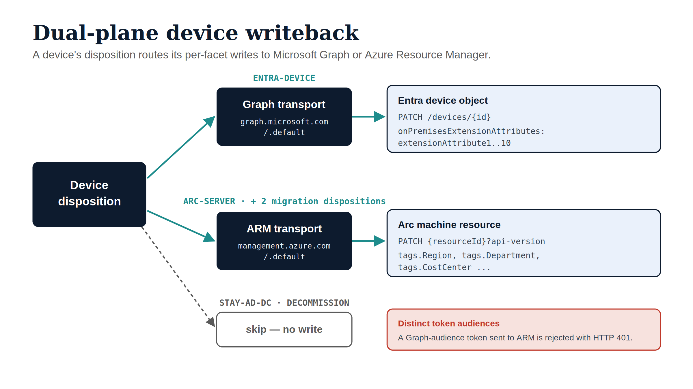

# 6 · Azure Arc Server Writeback (ARM Tags) {.unnumbered}

The second live plane. For **Azure Arc-enrolled servers**, OrgPath facets are
written as **tags** on the `Microsoft.HybridCompute/machines` resource via
Azure Resource Manager (ARM). Azure Policy then targets those tags — the Arc-side
analogue of how Intune targets device attributes.

CLI: `uiao orgtree assess --write` (same command, ARM dispositions) · Adapter:
`EntraDeviceOrgPathAdapter` (ARM branch) · Transport:
`uiao.adapters.arm_transport.ArmTransport`.

{#fig-dual-plane-writeback fig-alt="Engineering blueprint diagram on a white background. A central navy Device disposition hub fans out to three lanes via teal arrows. Top lane, labeled ENTRA-DEVICE: a navy Graph transport box (graph.microsoft.com/.default) to an ice Entra device object box (PATCH /devices/{id}, onPremisesExtensionAttributes extensionAttribute1..10). Middle lane, labeled ARC-SERVER plus two migration dispositions: a navy ARM transport box (management.azure.com/.default) to an ice Arc machine resource box (PATCH resourceId with api-version, tags.Region, tags.Department, tags.CostCenter). Bottom lane, labeled STAY-AD-DC and DECOMMISSION: a dashed grey arrow to a skip — no write box. A red callout reads: distinct token audiences — a Graph-audience token sent to ARM is rejected with HTTP 401. No human figures, 16:9 landscape." width="90%"}

## 6.1 Arc is a different plane, with different auth

The Graph plane and the ARM plane are **not interchangeable**. They use
different hosts *and* different token audiences:

| | Graph (Entra device) | ARM (Arc server) |
|---|---|---|
| Host (commercial) | `graph.microsoft.com` | `management.azure.com` |
| Host (Azure Government) | `graph.microsoft.us` | `management.usgovcloudapi.net` |
| Token audience | `…/graph.microsoft.com/.default` | `…/management.azure.com/.default` |
| Authorization | Graph application permissions | **Azure RBAC role** (e.g. Tags Contributor) |

::: {.callout-warning}
## Why this used to fail (and why the distinction matters)

A Graph-audience token sent to ARM is rejected with **HTTP 401 (invalid
audience)**. Earlier builds reused the Graph transport for ARM, so Arc writes
could not authenticate against a live tenant. The CLI now constructs a dedicated
`ArmTransport` with the correct ARM base and ARM audience, so this is resolved —
but it is also why your app registration needs an **Azure RBAC role**, not just
Graph permissions, for Arc writes to succeed.
:::

## 6.2 Dispositions that route to ARM

| Disposition | Meaning |
|---|---|
| `ARC-SERVER` | Azure Arc-enrolled server |
| `STAY-AD-DEPENDENCY` | AD-dependency box, Arc-visible during the migration window |
| `MANAGED-IDENTITY-CANDIDATE` | Workload-identity-candidate server during migration |

Domain controllers (`STAY-AD-DC`) and end-of-life machines (`DECOMMISSION`) are
explicitly **skipped** — no write attempted.

## 6.3 The device target must be the ARM resource ID

This is the most common Arc-writeback mistake. For an ARM disposition, the
record's `device_id` / target **must be the full ARM resource ID** of the Arc
machine — not a hostname:

```
/subscriptions/<sub>/resourceGroups/<rg>/providers/Microsoft.HybridCompute/machines/<name>
```

The `ArmTransport` joins a resource-relative path onto the ARM base (and passes
absolute URLs verbatim), but it does **not** synthesize resource IDs. Your
device export / assessment pipeline must carry the Arc resource ID as the
target. A bare hostname will produce a malformed ARM URL and fail.

## 6.4 What gets written

All derived facets batch into **one** ARM tag PATCH per machine. Facet names
become PascalCase tag keys:

```
PATCH {arm_resource_id}?api-version=2023-03-15-preview
{
  "tags": {
    "Region": "EASTUS",
    "Department": "IT",
    "CostCenter": "CC-1042",
    ...
  }
}
```

The API version (`2023-03-15-preview` for hybrid-compute machines) is supplied
by the adapter as a query parameter; ARM carries no version in the base URL.

## 6.5 Assess Arc readiness first (optional but recommended)

Before tagging servers, confirm which ones are even Arc-eligible. The readiness
helper grades each server `READY`, `NEEDS_OS_UPGRADE`, `NEEDS_NETWORK_EGRESS`,
`INELIGIBLE`, or `NOT_SERVER`:

```python
from uiao.adapters.modernization.active_directory.arc_readiness import (
    assess_fleet_arc_readiness,
)

summary = assess_fleet_arc_readiness(computer_records, strict_network_mode=True)
print(summary.arc_enrollable, "servers READY")
```

Domain controllers and EOL Windows Server versions are flagged `INELIGIBLE`;
servers whose egress to the Arc endpoints isn't validated are
`NEEDS_NETWORK_EGRESS`. Only enroll + tag the `READY` set.

## 6.6 Dry-run, then go live

Same command as the Intune plane; the ARM dispositions route to ARM
automatically.

```bash
# Plan only — no credentials, no dispatch
uiao orgtree assess \
  --from-export ad-arc-servers.json \
  --target-type device \
  --write
```

```bash
# Live — requires UIAO_ENTRA_* AND the Azure RBAC role on the Arc resources
uiao orgtree assess \
  --from-export ad-arc-servers.json \
  --target-type device \
  --write --no-dry-run \
  --cloud commercial
```

The CLI builds an `ArmTransport` from the environment, acquiring an
**ARM-audience** token for the selected cloud. Each ARM-disposition machine
becomes one batched tag PATCH.

::: {.callout-tip}
## Pilot discipline

The ARM write path authenticates correctly but should be **proven on a single
Arc machine first**: export one `ARC-SERVER` record (with its full resource
ID), dry-run, then `--no-dry-run`, then confirm the tags in the Azure portal.
Only then widen scope.
:::

## 6.7 Failure modes

| Symptom | Cause | Fix |
|---|---|---|
| HTTP 401 on ARM PATCH | Token not ARM-audience, or wrong `--cloud` | Ensure you're on a current build (dedicated `ArmTransport`); match `--cloud` |
| HTTP 403 on ARM PATCH | Service principal lacks an RBAC role on the resource | Assign **Tags Contributor** (or Contributor) at the right scope |
| HTTP 404 / malformed URL | Target was a hostname, not an ARM resource ID | Carry the full `/subscriptions/.../machines/<name>` as the device target |
| `no arm transport configured` in errors | `--no-dry-run` without `[api]` extra / credentials | `pip install "uiao[api]"`; set `UIAO_ENTRA_*` |
| Machine skipped, no write | Disposition was `STAY-AD-DC` / `DECOMMISSION`, or reserved facets | Expected — those dispositions never write |
| Tags written but Policy doesn't act | Azure Policy-for-Arc is a **reserved** adapter | Author policy in Azure directly; the UIAO enforcement adapter isn't built |

## 6.8 Scope boundary: tags vs enforcement

This guide writes **OrgPath tags**. Turning those tags into *enforcement*
(assigning Azure Policy initiatives, evaluating compliance, dispatching
remediation) is the `azure-policy-arc` adapter — a **reserved** slot that
requires a per-adapter ADR before activation. Until then, author Azure Policy
that selects on the OrgPath tags directly in Azure.

**Next:** [Operate & troubleshoot](07-operate-and-troubleshoot.qmd).
