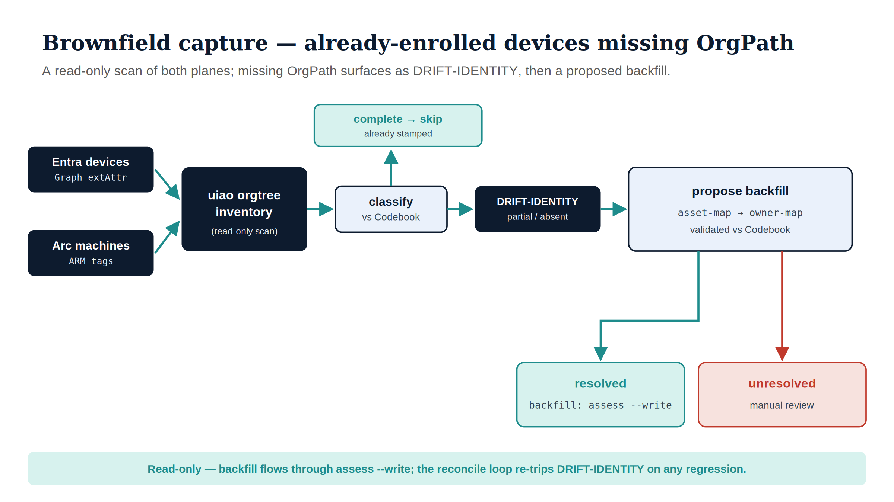

# 7 · Operate & Troubleshoot {.unnumbered}

Day-2: observe OrgPath state, run a steady reconcile loop, capture evidence, and
diagnose the failures you'll actually hit.

## 7.1 The read-only web console

The OrgPath Web Console (`[api]` extra) is a server-rendered, **read-only**
governance UI served by `uiao.api.app` under `/orgpath`. Per ADR-084 §C7 it
performs **no writes** — it observes the Codebook, drift findings, and principal
facet values, and renders dry-run governance reports.

```bash
pip install "uiao[api]"
uvicorn uiao.api.app:app --port 8000
# then browse:
#   /orgpath/            drift dashboard
#   /orgpath/codebook    codebook explorer
#   /orgpath/principals  principal facet lookup
#   /orgpath/govern      run a (dry-run) governance pass
```

For the Windows/IIS surface use `deploy/windows-server/run.py` (loopback
uvicorn behind IIS, which terminates TLS).

::: {.callout-note}
Remediation deliberately does **not** flow through HTTP. Writes go only through
the engine's `apply()` path (i.e. `uiao orgtree assess --write --no-dry-run`),
so every write is captured by the evidence pipeline. The console is for
visibility, not action.
:::

## 7.2 Brownfield capture — devices already enrolled without OrgPath

Net-new devices get OrgPath at procurement; the existing AD fleet gets it
during migration. The third population is devices **already enrolled** in
Intune/Entra and/or Arc that were never stamped. `uiao orgtree inventory`
captures them — **read-only**, across both planes:

{#fig-brownfield-capture fig-alt="Engineering blueprint diagram on a white background. Two navy source boxes on the left, Entra devices (Graph extAttr) and Arc machines (ARM tags), feed teal arrows into a navy uiao orgtree inventory box (read-only scan). An arrow to an ice classify vs Codebook box, which branches: up to a teal complete → skip box (already stamped), and right to a navy DRIFT-IDENTITY box (partial / absent). DRIFT-IDENTITY flows to an ice propose backfill box (asset-map → owner-map, validated vs Codebook), which branches to two outcomes: a teal resolved box (backfill: assess --write) and a red unresolved box (manual review). A teal footer reads: read-only — backfill flows through assess --write; the reconcile loop re-trips DRIFT-IDENTITY on any regression. No human figures, 16:9 landscape." width="90%"}

```bash
# Offline (from Graph/ARM exports), with a primary-user source for proposals
uiao orgtree inventory \
  --devices-export entra-devices.json \
  --machines-export arc-machines.json \
  --owner-map owners.json \
  --snapshot-out snap.json --worklist-out worklist.json

# Live read of both planes (needs UIAO_ENTRA_* + the [api] extra)
uiao orgtree inventory --from-graph --from-arm --subscription <sub> --cloud commercial \
  --worklist-out worklist.json
```

It classifies each device against the Codebook — **complete / partial /
absent** — and proposes a backfill for the missing facets via the source chain
(`--asset-map` first, i.e. CMDB/procurement keyed by serial/hostname; then
`--owner-map`, the primary-user/registered-owner derivation). Anything it can't
resolve is bucketed as **unresolved** for manual review — never auto-guessed.

Two outputs drive the rest of the loop:

- **`--snapshot-out`** → feed to `uiao orgtree govern`; the gaps re-surface as
  `DRIFT-IDENTITY` findings (§7.4-style worklist with full telemetry).
- **`--worklist-out`** → the per-device backfill plan (current vs proposed,
  with the resolution source or the unresolved reason). Devices whose proposal
  is `resolved` are ready to backfill via `assess --write`; `unresolved` ones
  need a source-data decision first.

The command never writes — backfill still goes through `assess --write
--no-dry-run` (Guides 5–6) so every write lands in the evidence pipeline.

## 7.3 The reconcile loop

Steady-state OrgPath is a loop, because HR data and device populations change:

1. **Assess** — re-derive facets from current AD (Guide 3). Idempotent.
2. **Govern (dry-run)** — classify drift, confirm no P1 halt (Guide 4).
3. **Writeback** — `assess --write --no-dry-run` converges device + Arc state to
   the desired facets (Guides 5–6). Idempotent PATCH/tag.
4. **Capture** — persist the `GovernanceReport` (`--out`) as evidence.

Because every step is idempotent, you can run this on a schedule (e.g. nightly).
Unchanged objects are no-ops; only moved/changed principals produce writes.

## 7.4 Evidence & telemetry

Every governance pass emits UIAO_174 telemetry (`SnapshotCreated`,
`DriftDetected` per finding, `DriftRemediated` per dispatched op,
`EscalationTriggered` on a critical halt). Persist it:

```bash
uiao orgtree govern snapshot.json --out evidence/orgpath-$(date +%F).json
```

The report's telemetry + summary are the audit trail for *what drift existed*
and *what was changed*, traceable to the Codebook version that classified it.

## 7.5 Failure-mode catalog (cross-cutting)

| Symptom | Likely cause | Resolution |
|---|---|---|
| `unknown cloud 'x'` at startup | Typo in `--cloud` | Use `commercial` / `gcc-high` / `dod` |
| `--no-dry-run requires UIAO_ENTRA_* credentials` | Env unset or `[api]` missing | Set `UIAO_ENTRA_*`; `pip install "uiao[api]"` |
| HTTP 401, Graph plane | Wrong cloud audience, or no admin consent | Match `--cloud`; consent `Device.ReadWrite.All` |
| HTTP 401, ARM plane | Old build reusing Graph token, or wrong cloud | Use a current build (dedicated `ArmTransport`); match `--cloud` |
| HTTP 403, ARM plane | SP missing RBAC role | Assign **Tags Contributor** at the Arc scope |
| Arc PATCH 404 / bad URL | Target was a hostname | Supply the full ARM resource ID |
| Governance `HALTED` | P1 codebook-integrity finding | Fix Codebook / typed value (Guide 2) |
| Facets blank after a "successful" write | Values skipped as drift, or reserved slots | Resolve P2 Value drift; reserved 11–15 aren't written |
| Console shows sample data | No active snapshot loaded | Load your snapshot via the govern page / API |

## 7.6 Known limits to plan around

These are deliberate scope boundaries, not bugs — design your rollout around
them:

- **Intune profile/compliance authoring** and **Azure Policy-for-Arc
  enforcement** are **reserved** adapters. OrgPath writes the *attributes/tags*;
  you author the *policies that target them* in Intune/Azure directly until the
  authoring adapters are activated (each needs a per-adapter ADR).
- **Intune readiness assessment is Windows-only.** macOS / iOS / Android are
  doctrine without adapter code.
- **No production adopters yet.** OrgPath Model C is ratified Tier-3+ doctrine;
  your deployment is a pilot. Tune enumerations, run dry-run first, smoke-test
  single resources before fleet scale.
- **Arc targets are resource IDs.** The pipeline must carry the full ARM
  resource ID for each Arc machine.

## 7.7 Where to go deeper

- **Codebook / facet semantics:** `UIAO_151`
- **Drift engine / telemetry:** `UIAO_163`, `UIAO_174`
- **Targeting model (Intune):** `UIAO_011` · **(Arc / Azure Policy):** `UIAO_010`
- **Decisions:** `ADR-038` (device-plane), `ADR-078` (15-facet), `ADR-084`
  (Phase 5 consumers), `ADR-033` (cloud boundary)

That completes the device-plane deployment path: from an empty tenant to
governed OrgPath facets on Intune-managed devices and Arc-enrolled servers, with
a read-only console and an idempotent reconcile loop holding it steady.
