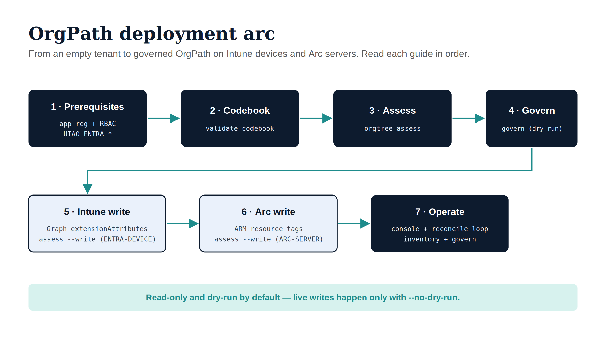

# OrgPath Implementation Guides {.unnumbered}

::: {.callout-tip}
## Downloads {#downloads}

**[orgpath-implementation-bundle.docx](orgpath-implementation-bundle.docx)** —
all eight pages (this index + the seven guides) concatenated into a single Word
document. Regenerated on every site deploy.

Each individual guide also offers its own **DOCX** download button in the page
header (top-right), if you only need one.
:::

::: {.callout-note appearance="default"}
## Companion series — the narrative
These guides are the *how*. Their companion, the **[UIAO OrgPath narrative](../../orgpath-narrative/index.qmd)**, is the *what* and *why*: the eighteen-document reading sequence on the governance substrate Microsoft did not build and the Microsoft surfaces that consume the OrgPath facet. The market positioning — why this deployment fills a gap no IGA platform (SailPoint, Saviynt, CyberArk, One Identity, Oracle, IBM, Microsoft Entra) owns — is **[Book 18 — OrgPath and the IGA Market](../../orgpath-narrative/Book_18.qmd)**.
:::

The **OrgPath narrative** explains *what* OrgPath is and *why* it replaces the
Active Directory OU tree. These **implementation guides** are the companion
*how* — a command-by-command path from an empty tenant to OrgPath facets
landing on Intune-managed devices and Azure Arc-enrolled servers, governed by
a drift loop.

Every step here is grounded in the shipped `uiao` CLI and the
`uiao.modernization.orgtree` / `uiao.adapters` modules — not aspirational
design. Where a capability is reserved (planned but not built), the guide says
so explicitly rather than implying it works.

::: {.callout-important}
## Boundary and scope

These guides target the **GCC-Moderate** boundary (commercial Microsoft 365 /
Azure infrastructure with FedRAMP-Moderate authorization, per ADR-033). The
commands are cloud-aware (`--cloud commercial | gcc-high | dod`), so the same
path applies to Azure Government tenants with the cloud flag changed and the
sovereign endpoints substituted.

**In scope:** the OrgPath *device-plane deployment path* — prerequisites,
Codebook, assessment, dry-run governance, Intune device writeback, Arc-server
writeback, and day-2 operations.

**Out of scope (covered elsewhere, or reserved):** Intune *profile/compliance
authoring*, Azure *Policy-for-Arc* enforcement, dynamic-group / Administrative
Unit / policy-targeting provisioning. The targeting *model* is described in
canon (UIAO_011, UIAO_152, UIAO_154); the *authoring adapters* are reserved
slots that each require a per-adapter ADR before activation.
:::

{#fig-orgpath-deployment-arc fig-alt="Engineering blueprint diagram on a white background. A seven-stage pipeline in two rows. Top row, four navy boxes connected by teal arrows: 1 Prerequisites (app reg + RBAC, UIAO_ENTRA_*), 2 Codebook (validate codebook), 3 Assess (orgtree assess), 4 Govern (govern dry-run). A teal connector drops to the second row. Bottom row: 5 Intune write and 6 Arc write as light ice cloud boxes (Graph extensionAttributes; ARM resource tags), then 7 Operate as a navy box (console + reconcile loop, inventory + govern). A teal footer band reads: Read-only and dry-run by default — live writes happen only with --no-dry-run. No human figures, 16:9 landscape." width="90%"}

## The deployment arc

Read the guides in order — each builds on the artifacts produced by the last.

| # | Guide | Outcome | Primary CLI / module |
|---|---|---|---|
| 1 | **[Prerequisites & access](01-prerequisites.qmd)** | Tenant, licensing, app registration, RBAC, network egress, `uiao[api]` install, `UIAO_ENTRA_*` set | `pip install "uiao[api]"` |
| 2 | **[Author & validate the Codebook](02-codebook.qmd)** | A tenant-tuned 15-facet Codebook that passes schema + integrity validation | `uiao orgtree validate codebook` |
| 3 | **[Assess AD → derive facets](03-assessment.qmd)** | Per-object facet assignments + a clean findings list, from live LDAP or an export | `uiao orgtree assess` |
| 4 | **[Dry-run governance & drift](04-governance-dry-run.qmd)** | A `GovernanceReport` classifying every drift finding, writing nothing | `uiao orgtree govern` |
| 5 | **[Intune device writeback](05-intune-device-writeback.qmd)** | OrgPath facets written to Entra device `extensionAttribute1..10` via Graph | `uiao orgtree assess --write` |
| 6 | **[Azure Arc server writeback](06-arc-server-writeback.qmd)** | OrgPath facets written to Arc machine **tags** via Azure Resource Manager | `uiao orgtree assess --write` |
| 7 | **[Operate & troubleshoot](07-operate-and-troubleshoot.qmd)** | Read-only console, reconcile cadence, evidence, and a failure-mode catalog | `uiao.api` web console |

## How the deployment arc fills the IGA gap

[Book 18 — OrgPath and the IGA Market](../../orgpath-narrative/Book_18.qmd)
argues that five capabilities make up the substrate gap no IGA platform — and
no composition of Microsoft's own primitives — owns as a primary function.
This deployment arc is how those five capabilities are actually turned on. The
mapping is one-to-one with the seven guides above, and it is the operator's
view of Book 18's five-step "fill the gap" sequence.

| Differentiated capability (Book 18) | Turned on by | Stage |
|---|---|---|
| **Deterministic 15-facet substrate** | Author the Codebook, then derive and write facet values from AD/HR | Guides 2–3, 5–6 |
| **Codebook-validated per-facet enumeration** | `uiao orgtree validate codebook` — schema + integrity + per-facet enumeration | Guide 2 |
| **Composable hierarchy with inheritance** | The facet-composed targeting *model* (dynamic-group / AU / policy-targeting authoring adapters are reserved — see Scope) | Canon: UIAO_152 / UIAO_154; reserved adapters |
| **Typed five-class drift taxonomy** | `uiao orgtree govern` dry-run — Format / Value / Slot / Orphan / Phantom, halt-on-critical | Guide 4 |
| **Single reconciled cross-boundary plane** | Cloud-aware writeback (`--cloud commercial \| gcc-high \| dod`); multi-tenant operation via the [Azure SaaS plane](../../platform/azure-saas.qmd) | Guides 5–6; SaaS |

The point Book 18 makes, restated operationally: this arc is *additive*. It
stands up the substrate beneath whatever IGA platform an estate already runs —
it does not replace requests, certifications, lifecycle, or segregation-of-duties.
Those workflows simply retarget the OrgPath-generated groups once they exist.

## What "ready" means before you start

OrgPath Model C is **Tier-3+ doctrine** (per UIAO_151 / ADR-078): the engine,
Codebook, drift classes, assessment, and dual-plane writeback are implemented
and tested, but the framework has **no production adopters at ratification**.
Treat your first deployment as a pilot:

1. **Tune the Codebook enumerations** to your real org (Region, Department,
   Division, Role, CostCenter, ClearanceLevel, AccountType) — the shipped
   values are federal-IT defaults.
2. **Run assessment and dry-run governance first** on a 5–10 % population
   sample. Writes stay suppressed until you explicitly pass `--no-dry-run`.
3. **Smoke-test the live write path on a single device and a single Arc
   machine** before any fleet rollout. The Arc/ARM write path authenticates
   correctly but should be proven against one live resource first.

## Canon provenance

These guides derive from, and must stay consistent with, the following canon.
When a guide and canon disagree, canon wins and the guide is the drift:

- **UIAO_151** OrgPath Codebook (the facet SSOT) · **UIAO_163** Drift Detection
  Engine · **UIAO_174** Governance Telemetry
- **UIAO_011** OrgPath in Intune & Device Governance · **UIAO_010** OrgPath in
  Azure Policy (Arc side)
- **ADR-038** Device-Plane OrgPath · **ADR-078** 15-Facet Schema · **ADR-084**
  Phase 5 Consumer Architecture · **ADR-033** Cloud boundary
