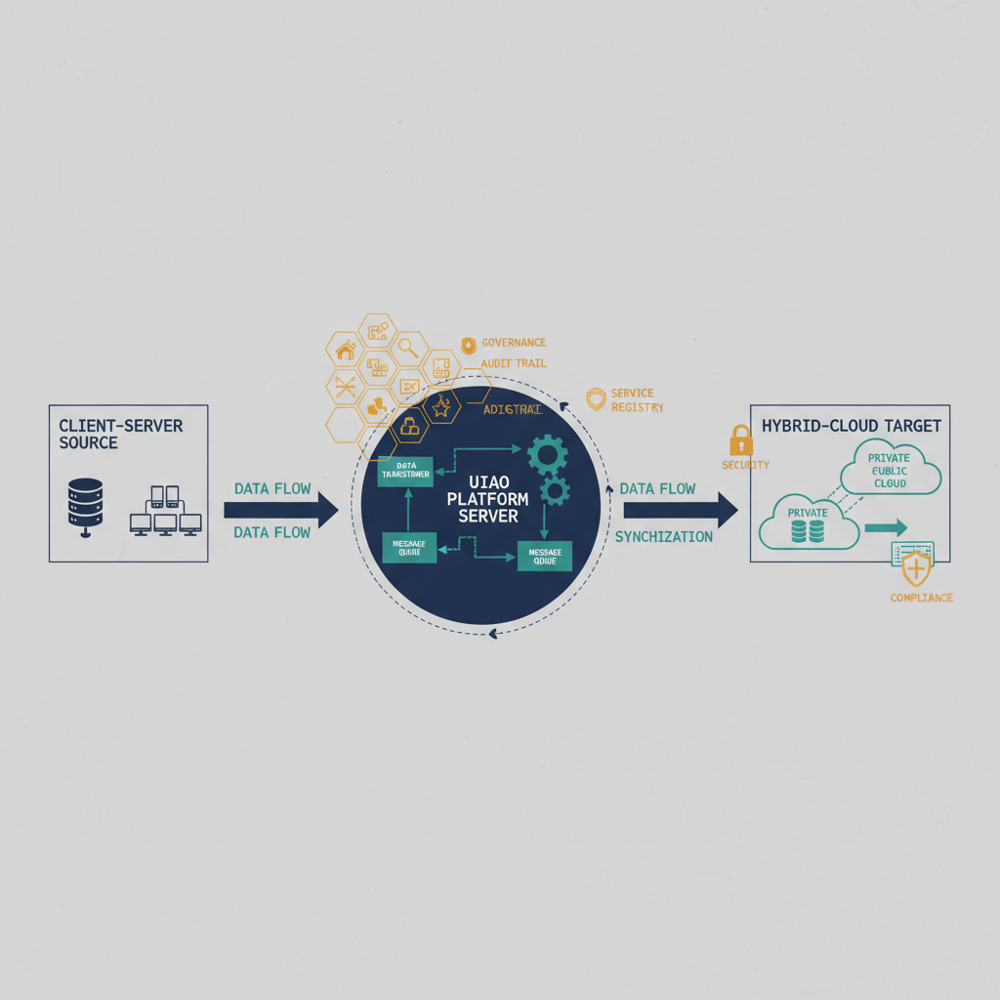
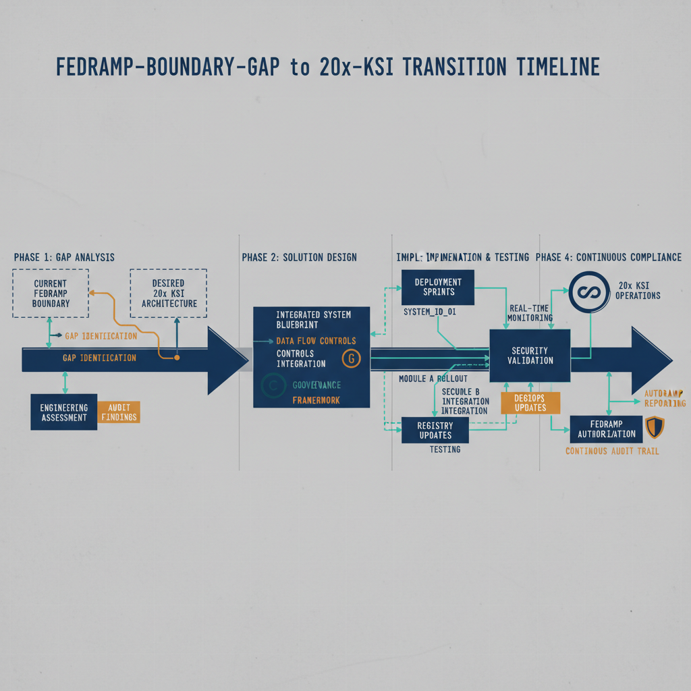

{#fig-01-phase0-master-plan-image-01 fig-alt="Phase 0 ten-plane scope map. Engineering blueprint style, neutral slate background, federal navy (#1F3A5F) for primary structural elements, teal (#1A9E8F) for secondary/integration elements, amber (#D4A017) for governance/audit/registry overlays, monospace labels for identifiers, no human figures, 16:9 landscape." width="100%"}

{#fig-01-phase0-master-plan-image-02 fig-alt="FedRAMP-boundary-gap-to-20x-KSI transition timeline. Engineering blueprint style, neutral slate background, federal navy (#1F3A5F) for primary structural elements, teal (#1A9E8F) for secondary/integration elements, amber (#D4A017) for governance/audit/registry overlays, monospace labels for identifiers, no human figures, 16:9 landscape." width="100%"}

1\. Executive Summary

The Unified Identity-Addressing-Overlay (UIAO) Modernization Master Plan
establishes the strategic framework for transforming the organization\'s
cloud governance posture through a single, integrated overlay
architecture. UIAO unifies the identity, device, network, security,
evidence, and compliance planes into a cohesive modernization framework
that replaces fragmented, incrementally adopted cloud services with an
architecturally coherent governance model. This Phase 0 Planning
Document defines the scope, problem space, objectives, deliverables,
risks, and next steps required to initiate Phase 1 execution.

The modernization program pursues five primary goals. First, the program
will stabilize identity services by unifying identity governance across
Microsoft Entra ID (formerly Azure Active Directory) and on-premises
Active Directory (AD), ensuring consistent Conditional Access evaluation
and full Multi-Factor Authentication (MFA) enforcement across all access
scenarios. Second, the program will restore network and telemetry
visibility by closing the signal gaps enumerated in Section 4, enabling
end-to-end correlation of identity, device, network, and
application-layer events. Third, the program will
enable Zero Trust Architecture (ZTA) alignment as defined by Office of
Management and Budget (OMB) Memorandum M-22-09, establishing continuous
verification of identity, device health, and session context at every
policy enforcement point. Fourth, the program will achieve Secure Cloud
Business Applications (SCuBA) baseline compliance for all Microsoft 365
services, with UIAO SCuBA providing a governance orchestration layer
that consumes Cybersecurity and Infrastructure Security Agency (CISA)
ScubaGear outputs and delivers continuous drift detection, canonical
desired-state management, remediation orchestration with Service Level
Agreement (SLA) enforcement, and machine-trackable governance
provenance. Fifth, the program will establish continuous Authorization
to Operate (ATO) capability, transitioning from the traditional periodic
reauthorization cycle to an ongoing authorization posture supported by
automated evidence streams and real-time risk assessment.

A structural dependency underlies the entire modernization effort, and
FedRAMP 20x splits it cleanly in two. Historically it was stated as a
single problem --- the **FedRAMP Boundary Gap**: the authorization
boundary was drawn around legacy infrastructure and did not capture the
cloud-native signal sources modern governance requires, so identity
correlation, session telemetry, location awareness, and policy
enforcement all depended on signals that fell outside it. Under 20x the
scope half of that problem dissolves. The authorization-boundary
construct is rescinded; what is assessed is now decided per information
resource by the Minimum Assessment Scope inclusion test, and a
cloud-native signal source that handles federal information or impacts
its confidentiality, integrity, or availability is in scope by
definition --- no boundary redrawing required.

What survives is the **operational half**: several of those signals are
still not emitted by the platforms that would have to produce them
inside GCC-Moderate. That is a product-availability gap, not a
scope-definition gap, and it is tracked as such in
[FINDING-001](../../../findings/fedramp-gcc-moderate-informed-network-routing.html).
This distinction runs through the whole Master Plan: where earlier
revisions said *the boundary excludes this signal*, the accurate
statement is now *this signal is in scope and unavailable*, which is a
supplier conversation rather than an assessment one.

FedRAMP has since modernized the construct formally, and the boundary gap
is now a scope question rather than a perimeter question. The **Minimum
Assessment Scope Standard** (RFC-0005) replaces traditional boundary
policy with a two-pronged inclusion test --- handles federal information,
and/or likely impacts its confidentiality, integrity, or availability ---
and explicitly places information resources and most metadata that meet
neither prong outside the assessed scope. On **2026-06-25** FedRAMP
launched the **Consolidated Rules for 2026 (CR26)**, the machine-readable
rules surface that carries that standard forward as rule category
**FRR-MAS**. CR26 version `2026.06.24.01` defines **46 Key Security
Indicators across 10 themes** (CED, CMT, CNA, IAM, INR, MLA, PIY, RPL,
SCR, SVC), each anchored to NIST SP 800-53 controls, plus 75 defined
terms (FRD), 17 rule categories (FRR), and 14 control families (CTL).

Goal #2 of this Master Plan operates against that mechanism. The
boundary-modernization conversation shifts from *can the data leave?* to
*is the receiving information resource within the Minimum Assessment
Scope, and does the substrate emit the KSI evidence that demonstrates
continuous compliance?* Operational substrate treatment of the framework
movement is recorded in
[FINDING-PGM-001 — FedRAMP 20x Moderate Pilot active](../../../findings/fedramp-20x-moderate-pilot.html);
the authority pin for the official CR26 rules is
[ADR-126](../../../adr/adr-126-fedramp-cr26-official-rules-adoption.html),
and the substrate's emission contract is
[ADR-106](../../../adr/adr-106-fedramp-20x-integration.html). Framework
movement does not by itself ship product features into GCC-Moderate;
companion product action by cloud service providers is still required to
close the operational telemetry inventory tracked in
[FINDING-001](../../../findings/fedramp-gcc-moderate-informed-network-routing.html).

**The CR26 calendar is the program's compliance clock.** Optional
adoption opened **2026-07-04**; the 20x Class B and Class C pipelines
opened **2026-08-31**; CR26 becomes **mandatory for all FedRAMP
stakeholders on 2027-01-01**; and **no new Rev5 certifications** are
issued after **2027-06-11**. Phase sequencing in §3 is planned against
these dates, not against a periodic reauthorization cycle.

The UIAO Modernization Program is deployed in Commercial Cloud at the
FedRAMP Moderate impact level. Government Community Cloud -- Moderate
(GCC-Moderate) applies exclusively to Microsoft 365 Software as a
Service (SaaS) services and does not encompass Azure services. Amazon
Connect Contact Center operates as an explicit exception within
Commercial Cloud. Those are deployment facts; what is *assessed* is
determined by the Minimum Assessment Scope test above. The program is
aligned with federal mandates including Executive Order (EO) 14028
(Improving the Nation\'s Cybersecurity), CISA SCuBA, FedRAMP 20x / CR26,
and OMB M-22-09. NIST SP 800-53 Rev 5 remains the control substrate
beneath the KSIs --- CR26 anchors each indicator to Rev 5 controls --- but
the artifact delivered to an assessor is the KSI evidence payload, not a
Rev 5 control narrative. This document serves as the authoritative
planning artifact for all stakeholders, including the Chief Information
Officer (CIO), Chief Information Security Officer (CISO), Information
System Security Officer (ISSO), Authorizing Official (AO), and
Third-Party Assessment Organization (3PAO).

2\. Modernization Scope

The UIAO Modernization Program organizes its scope across ten distinct
planes and capability areas. Each plane represents a functional domain
within the overlay architecture, and each carries its own current-state
challenges and modernization objectives. The following subsections
define the role, present condition, and target state for every component
within the UIAO scope.

> 2.1 Identity Plane

The Identity Plane encompasses Microsoft Entra ID, Conditional Access
policies, MFA enforcement, and the full identity lifecycle management
framework, including provisioning, de-provisioning, role assignment, and
access reviews. This plane serves as the foundational trust anchor for
the entire UIAO architecture; every access decision, compliance
evaluation, and security signal ultimately traces back to an
authenticated identity.

**Baseline assumption — AD→Entra ID synchronization is already
operational.** Per existing federal direction, agencies operating
Microsoft 365 / Azure have already been required to establish AD-to-Entra
ID synchronization (Entra Connect Sync or Entra Cloud Sync). Phase 0
treats the operational sync itself as a pre-existing baseline, not as a
new deliverable. The fragmentation Phase 0 addresses is **governance
fragmentation** layered on top of an already-operational sync — not the
absence of synchronization.

In the current state, identity *governance* signals are fragmented
across on-premises Active Directory and the cloud directory. This
fragmentation means that Conditional Access policies cannot evaluate
signals that are not surfaced to them, resulting in incomplete policy
evaluation for users and devices that traverse trust zones. Federation metadata, token issuance events, and
Conditional Access evaluation data are generated across multiple
infrastructure components, and the lack of a unified identity
*governance* model prevents consistent policy enforcement even when the
underlying directory sync is healthy. The modernization objective for
the Identity Plane is to establish unified identity governance with
full signal fidelity, ensuring that every identity event, regardless of
its origin, is captured, correlated, and available for policy
evaluation in real time. Where appropriate, Phase 0 also covers the
migration from Entra Connect Sync to Entra Cloud Sync as the strategic
sync mechanism, but the AD→Entra sync itself is not in scope as a
greenfield activity.

> 2.2 Device Plane

The Device Plane covers Microsoft Intune Mobile Device Management (MDM)
and Mobile Application Management (MAM), device compliance policy
enforcement, and endpoint health attestation. Device compliance is a
critical input to Conditional Access evaluation: a device that cannot
demonstrate compliance should not be granted access to protected
resources. In the current state, unmanaged devices lack the compliance
telemetry required for real-time health evaluation. Endpoint health signals, including operating system patch
level, antivirus status, disk encryption state, and firmware integrity,
are not consistently collected for all device populations. This creates
a condition where Conditional Access policies must either permit access
with incomplete device context or block access broadly, degrading user
experience without proportionate security benefit. The modernization
objective is to establish continuous device compliance with real-time
health signals feeding directly into Conditional Access evaluation,
ensuring that every device presenting for access can be assessed against
a current, comprehensive compliance baseline.

> 2.3 Server Plane

The Server Plane addresses on-premises server infrastructure, hybrid
connectivity architecture, and domain controller operations. Domain
controllers remain a critical dependency for authentication services,
Group Policy processing, and legacy application support. In the current
state, legacy server infrastructure creates dependencies that constrain
cloud migration velocity. Applications that rely on on-premises domain
controllers for authentication cannot be migrated to cloud-native
hosting without first establishing a hybrid identity bridge that
maintains authentication continuity. Server operating system versions,
patch compliance, and configuration baselines vary across the server
fleet, creating an inconsistent security posture that complicates
governance. The modernization objective is to rationalize the server
footprint, establish a hybrid identity bridge between on-premises Active
Directory and Entra ID, and enable phased decommissioning of legacy
server infrastructure as application dependencies are resolved. This
rationalization will reduce the attack surface, simplify governance, and
remove architectural constraints that impede cloud adoption.

> 2.4 Routing Plane

The Routing Plane encompasses network topology, Wide Area Network (WAN)
optimization, Domain Name System (DNS) resolution, and traffic routing
policies that govern how user traffic reaches cloud services. In the
current state, legacy WAN routing forces traffic through centralized
inspection points, a design pattern inherited from perimeter-based
security architectures. This centralized routing degrades cloud service
performance for users at headquarters and field offices by introducing
unnecessary latency and creating single points of congestion.
Additionally, centralized inspection obscures session-level telemetry
because traffic metadata is aggregated at inspection points rather than
captured at the point of origin. Split-tunnel Virtual Private Network
(VPN) configurations further complicate visibility by creating traffic
paths that bypass some inspection and logging infrastructure. The
modernization objective is to modernize routing to support direct cloud
connectivity with preserved security inspection, enabling users to reach
cloud services through optimized network paths while maintaining the
visibility and inspection capabilities required for security operations
and compliance evidence collection.

> 2.5 Security Plane

The Security Plane integrates Microsoft Defender for Endpoint, Microsoft
Defender for Office 365, Microsoft Defender for Identity, and Microsoft
Sentinel as the Security Information and Event Management (SIEM) and
Security Orchestration, Automation, and Response (SOAR) platform.
Together, these components provide threat detection, investigation, and
response capabilities across the endpoint, email, identity, and cloud
application layers. In the current state, these security tools generate
rich signal streams that cannot be fully correlated when the platform
does not emit every input those correlations need. Defender for Identity
may detect suspicious authentication patterns, but if the corresponding
network session telemetry or device compliance state is unavailable, the
investigation context is incomplete. Sentinel correlation rules that depend on cross-layer signal
joins produce partial results, reducing detection efficacy and
increasing analyst workload. The modernization objective is to achieve
unified security operations with full signal correlation across
identity, device, network, and application layers, ensuring that every
detection, alert, and investigation has access to the complete signal
context required for accurate threat assessment and response.

> 2.6 Evidence Plane

The Evidence Plane governs audit logging, compliance evidence
collection, and the generation of continuous monitoring artifacts
required for FedRAMP authorization and ongoing oversight. Evidence is
the bridge between operational reality and compliance documentation;
without reliable, automated evidence streams, compliance artifacts
cannot accurately reflect the system\'s security posture. In the current
state, evidence collection is manual, periodic, and disconnected from
operational telemetry. Compliance evidence is gathered during assessment
preparation cycles, often through manual screenshots, configuration
exports, and narrative documentation that capture a point-in-time
snapshot rather than a continuous record. This approach introduces
latency between operational changes and evidence capture, creating
windows during which the documented compliance posture may not reflect
actual system configuration. The modernization objective is to establish
automated, continuous evidence generation tagged to the **CR26 Key
Security Indicators** the emission backs, with the NIST SP 800-53 Rev 5
control anchors CR26 assigns each indicator carried through as
supporting metadata. Evidence streams will be produced as a byproduct of
normal system operations, ensuring that compliance artifacts are always
current, machine-readable, and traceable to their source telemetry. Each
emission stamps four `fedramp:ksi-*` properties --- the themes it backs,
the canon row authorizing the mapping, the freshness cadence required,
and the emission timestamp --- so an assessor can verify not just that
evidence exists but that it is current
([ADR-106](../../../adr/adr-106-fedramp-20x-integration.html) D1).
Evidence that ages past its cadence is surfaced as a first-class
`DRIFT-EVIDENCE-STALE` finding rather than quietly presented as fresh.

> 2.7 Compliance Plane

The Compliance Plane manages FedRAMP authorization artifacts. Under 20x
these are machine-readable OSCAL packages --- `component-definition`,
`assessment-results`, `poam-item`, `assessment-plan`, and an aggregated
`system-security-plan` --- carrying KSI-tagged evidence, per RFC-0024;
the traditional narrative System Security Plan (SSP) and spreadsheet
Plan of Action and Milestones (POA&M) are the Rev5-era forms of the same
obligations, retained only while a given package is still filed on the
traditional pathway. This plane is responsible for
maintaining the documentation and evidence chains that demonstrate the
system\'s compliance with applicable federal security requirements. In
the current state, compliance artifacts are static documents that drift
from operational reality between assessment cycles. The SSP is updated
periodically rather than continuously, meaning that configuration
changes, new service deployments, and architectural modifications may
not be reflected in the compliance documentation until the next
assessment preparation cycle. POA&M items are tracked in spreadsheets or
document repositories that are disconnected from the operational systems
they reference, making it difficult to verify remediation status in real
time. The modernization objective is to establish machine-trackable
compliance artifacts with drift detection and automated remediation
orchestration, ensuring that the SSP, POA&M, and continuous monitoring
deliverables remain synchronized with the operational environment at all
times.

> 2.8 Drift Detection

Drift Detection within the UIAO framework is delivered through UIAO
SCuBA, the governance orchestration layer that operates above and
complements CISA ScubaGear. UIAO SCuBA is not a replacement for
ScubaGear; it is the governance orchestration layer that consumes
ScubaGear\'s JavaScript Object Notation (JSON) and Comma-Separated
Values (CSV) outputs and extends their utility into continuous
operational governance. UIAO SCuBA provides continuous drift detection
against canonical desired-state baselines, remediation orchestration
with SLA enforcement, owner accountability tracking, and
machine-trackable governance provenance that creates an auditable chain
from detection through remediation. In the current state, configuration
drift is detected retroactively during periodic assessments rather than
continuously. ScubaGear assessments produce point-in-time snapshots of
Microsoft 365 configuration compliance, but without a governance
orchestration layer, those snapshots are consumed manually and
remediation is tracked through ad hoc processes. The modernization
objective is to establish real-time drift detection with SLA-enforced
remediation workflows and owner accountability, ensuring that
configuration deviations from the canonical desired state are identified
immediately, assigned to responsible owners, and remediated within
defined SLA windows with full provenance tracking.

> 2.9 Continuous ATO

Continuous ATO represents the transition from the traditional periodic
reauthorization model to a continuous authorization posture in which the
Authorizing Official maintains ongoing visibility into the system\'s
security state and can make authorization decisions based on current,
real-time risk data rather than periodic assessment snapshots. In the
current state, the traditional three-year ATO cycle creates compliance
gaps between assessment events. During the interval between assessments,
the system may undergo significant changes, including new service
deployments, configuration modifications, personnel changes, and threat
landscape evolution, that are not reflected in the authorization
decision until the next assessment cycle. This creates a condition where
the authorization decision is based on historical data that may no
longer accurately represent the system\'s risk posture. The
modernization objective is to establish continuous ATO capability with
automated evidence streams, real-time indicator monitoring, and ongoing
risk assessment. FedRAMP 20x is what makes this a supported posture
rather than a local invention: continuously validated KSI evidence is
the artifact 20x expects, so the substrate's continuous emissions and
the framework's assessment model are the same mechanism rather than two
that must be reconciled. This capability will enable the AO to maintain
continuous situational awareness of the system\'s security posture and
make informed, timely authorization decisions supported by current
evidence rather than periodic snapshots.

> 2.10 Assessment-Scope Modernization

Assessment-Scope Modernization addresses the structural evolution of what
FedRAMP assesses. Historically this was the **authorization boundary**: a
drawn perimeter, inside which every component, data flow, and
interconnection had to be documented, assessed, and continuously
monitored, and outside which components were simply excluded from the
governance framework. That construct is rescinded under FedRAMP 20x. The
Minimum Assessment Scope Standard (RFC-0005, carried in CR26 as rule
category **FRR-MAS**) replaces it with a per-resource inclusion test:
an information resource is in the Minimum Assessment Scope if it handles
federal information, and/or likely impacts the confidentiality,
integrity, or availability of federal information. Information resources
and most metadata that meet neither prong are outside it.

The practical consequence for this program is that the signal sources
added incrementally as cloud services were adopted --- identity
federation endpoints, device compliance streams, session telemetry
collectors, policy decision points --- are evaluated on their own merits
rather than on where they happen to sit. Most meet prong (2) plainly, and
are therefore in scope without any perimeter redrawing.

The modernization objective is correspondingly reframed. Rather than
proposing boundary modifications, the program **classifies every
substrate component against the inclusion test** and records the
classification as canon --- `in-scope`, `metadata-out-of-scope`, or
`agency-side-out-of-scope`, per
[ADR-106](../../../adr/adr-106-fedramp-20x-integration.html) D2. The
classification is machine-readable, travels with the component, and is
re-checkable on every emission; `uiao fedramp orgpath-scope` renders it
for a given OrgPath subtree. This is what makes continuous assessment
tractable: scope is a property each component asserts and the substrate
verifies, not a diagram maintained by hand.

3\. Problem Statement

The organization operates a hybrid identity and infrastructure
environment in which cloud services have been adopted incrementally over
multiple years without a corresponding modernization of the assessment
posture, network architecture, or governance framework. This incremental
adoption has produced an environment where cloud-native services coexist
with legacy infrastructure, each operating under governance models that
were designed independently and at different points in the
organization\'s technology evolution. The result is an architectural
condition in which the governance framework, the assessed scope, and the
operational environment are no longer fully aligned.

**Signal Loss.** The most consequential manifestation of this
misalignment is signal loss. Modern cloud governance depends on the
ability to correlate signals across multiple domains: identity signals
(who is requesting access), device signals (what is the health and
compliance state of the requesting device), session signals (what is the
behavioral context of the session), location signals (where is the
request originating), and application signals (what resource is being
accessed and what actions are being performed). In the current
environment, these signals originate from sources that span multiple
trust zones. Under the pre-20x construct, sources outside the drawn
authorization boundary could not be formally incorporated into
governance decisions, compliance evidence, or security operations
workflows at all. The Minimum Assessment Scope test removes that
prohibition --- a source that bears on federal information is in scope
wherever it sits --- so what remains is the narrower and more tractable
problem that several of these signals are **not emitted** by the
platforms hosting them inside GCC-Moderate. This residual signal loss is
not a failure of any individual system or tool, and it is no longer a
consequence of how a boundary was drawn; it is a product-availability
condition, enumerated in §4 and tracked in the GCC-Moderate gap
findings.

**Visibility Gaps.** Security operations require unified visibility
across all layers of the technology stack to detect, investigate, and
respond to threats effectively. In the current state, telemetry
collection is constrained by what the deployed platforms emit, not by
what the assessment scope permits. Microsoft Sentinel, serving as the
SIEM and SOAR platform, can only correlate signals that are available
within its collection scope. When device compliance telemetry, network
session metadata, geolocation data, or identity federation events are
unavailable in the GCC-Moderate surface, Sentinel correlation rules
operate with incomplete data. Detection rules that
depend on cross-layer signal joins, such as correlating an anomalous
sign-in event with an endpoint health degradation and a network location
change, produce partial or absent results. This reduces detection
efficacy, increases false negative rates, and forces security analysts
to perform manual cross-referencing that automated correlation should
handle.

**Architectural Constraints.** Legacy WAN routing architecture forces
user traffic through centralized inspection points, a pattern designed
for perimeter-based security models where all traffic traversed a
defined network edge. In a cloud-first environment, this routing pattern
introduces latency for cloud service access, degrades user experience at
headquarters and field offices, and creates congestion at centralized
inspection infrastructure. Split-tunnel VPN configurations, adopted to
mitigate some of these performance impacts, create traffic paths that
bypass inspection and logging infrastructure, further reducing
visibility. DNS resolution policies that direct traffic to centralized
resolvers rather than cloud-optimized endpoints add additional latency
and reduce the effectiveness of cloud service geo-optimization features.

These conditions, taken together, represent structural challenges that
require architectural remediation. They are not the result of
operational failures, misconfigurations, or resource constraints. They
are the predictable consequences of an environment that has evolved from
legacy to hybrid to cloud without a corresponding evolution of the
governance architecture that governs it. The UIAO Modernization Program
is designed to address these structural conditions through a unified
architectural framework that aligns the assessed scope, governance
model, and operational environment into a coherent, assessable, and
continuously monitored system.

4\. Signal Availability Gap --- Architectural Dependency

+---------------+
| **Critical    |
| Architectural |
| Dependency**  |
|               |
| The Signal    |
| Availability  |
| Gap is a      |
| prerequisite  |
| condition     |
| that must be  |
| addressed for |
| the UIAO      |
| Modernization |
| Program to    |
| achieve its   |
| objectives.   |
| This section  |
| provides the  |
| neutral       |
| architectural |
| analysis      |
| required for  |
| AO and 3PAO   |
| review.       |
+---------------+

This section was previously titled *FedRAMP Boundary Gap*, and the
rename is substantive rather than cosmetic. The original analysis was
correct about the symptom and, under FedRAMP 20x, wrong about the cause.

The historical condition was real: the authorization boundary was
established to encompass legacy infrastructure at a time when the
organization\'s technology footprint was predominantly on-premises,
capturing the servers, network devices, databases, and application
platforms that constituted the system along with the interconnections
and data flows between them. As cloud services were adopted, signal
sources --- identity federation endpoints, device compliance telemetry
streams, session telemetry collectors, media relay infrastructure,
geolocation services, and policy decision points --- were deployed in
environments outside that boundary. That was not an error; it reflected
the standard deployment architecture for cloud-native services that did
not exist when the boundary was drawn.

Under 20x, **being outside a drawn boundary is no longer a reason a
signal cannot be used.** The Minimum Assessment Scope test evaluates each
information resource on what it does, and a telemetry stream that
carries or bears on federal information is in scope wherever it runs.
The six categories below are therefore *in scope and, in several cases,
not emitted* --- an availability problem with the platform, tracked as
[FINDING-001](../../../findings/fedramp-gcc-moderate-informed-network-routing.html)
and its companion GCC-Moderate gap findings. Framing matters for who
resolves it: a scope gap is settled with an Authorizing Official, an
availability gap is settled with a cloud service provider. An AO or 3PAO
reading this section should treat every category below as in-scope by
the inclusion test, and treat each named gap as a supplier dependency
rather than an unresolved scope question.

> 4.1 Categories of Constrained Signals

The gap can be characterized by six categories of signals that are
within the Minimum Assessment Scope and required for modern cloud
governance, but are not fully available in the deployed GCC-Moderate
surface:

  --------------------------------
  **Signal     **Description**
  Category**
  ------------ -------------------
  **1.         Federation
  Identity     metadata, token
  Signals**    issuance events,
               Conditional Access
               evaluation data,
               and identity risk
               scores generated by
               Entra ID during
               authentication and
               authorization
               workflows.

  **2.         Geolocation data,
  Location     Internet Protocol
  Signals**    (IP) reputation
               scores, named
               location
               evaluations, and
               network location
               awareness data used
               to assess the
               geographic and
               network context of
               access requests.

  **3. Session Session duration
  Signals**    metrics,
               re-authentication
               events, token
               refresh patterns,
               and session risk
               evaluations that
               provide behavioral
               context for ongoing
               access sessions.

  **4.         Endpoint health
  Telemetry    attestation data,
  Signals**    application
               performance
               metrics, service
               availability
               indicators, and
               infrastructure
               health signals from
               cloud-hosted
               management planes.

  **5. Media   Microsoft Teams and
  Signals**    communication media
               relay paths, call
               quality metrics,
               media transport
               telemetry, and
               real-time
               communication
               session data
               traversing cloud
               relay
               infrastructure.

  **6. Policy  Conditional Access
  Signals**    policy evaluation
               results, compliance
               gate decisions,
               risk-based policy
               application
               outcomes, and
               governance policy
               enforcement
               telemetry.
  --------------------------------

> 4.2 Impact on Cloud Behavior

Without these six signal categories actually available to it, the
organization\'s cloud governance capabilities operate with structural
limitations --- and note that under 20x this is now purely a question of
emission, since all six are within the Minimum Assessment Scope. Conditional Access policies, which serve as the
primary policy enforcement mechanism for cloud service access, evaluate
access requests using the signals available to them. When identity risk
scores, device compliance state, network location context, or session
behavioral data are unavailable or incomplete, Conditional Access
policies must make enforcement decisions with partial information. This
results in one of two suboptimal outcomes: policies are configured
conservatively, blocking legitimate access and degrading user
experience; or policies are configured permissively, allowing access
that would be denied if full signal context were available.

Zero Trust evaluations, as defined by OMB M-22-09, require continuous
verification of identity, device, and context at every access decision
point. When the signals required for this continuous verification are
not emitted, the verification is inherently incomplete. Security
operations teams, operating through Microsoft Sentinel, cannot achieve
the signal correlation density required for modern threat detection when
correlation rules span signal domains the platform does not surface. The
result is an environment where the technical
capabilities of the security tooling exceed the governance framework\'s
ability to consume and act on the signals those tools produce.

> 4.3 Compliance Implications

The CR26 Key Security Indicators impose requirements that depend on
comprehensive signal availability, and because each indicator is
continuously validated rather than narrated once, a missing signal shows
up immediately as an indicator that cannot be evidenced. The
**KSI-IAM** theme (6 indicators) requires evidence of identity
verification, credential management, and least-privilege enforcement at
every entry point. **KSI-MLA** (5) requires logging, monitoring, and
auditing --- the emission side and the review side both. **KSI-SVC** (8)
requires evidence of service configuration and communications
protection. **KSI-CNA** (8) requires evidence of cloud-native
architectural controls. **KSI-CMT** (4) requires change-management and
continuous-monitoring evidence. Each of these CR26 indicators carries
its NIST SP 800-53 Rev 5 control anchors --- AC, AU, IA, SC, SI --- so
the Rev 5 obligations are unchanged underneath; what changed is that the
deliverable is the indicator payload rather than a control narrative.

When a signal source feeding any of these indicators is unavailable, the
evidence chain is incomplete and the indicator reports as unevidenced.
Assessment findings that result from this incompleteness are structural
rather than operational: they reflect a platform's emission surface
rather than a failure to implement or operate controls correctly. Under
20x the corollary is sharper than it was under Rev5 --- an unevidenced
indicator is visible continuously rather than at the next assessment
cycle, so the gap is surfaced early and its remedy is attributable.

> 4.4 The Signal Gap as Modernization Prerequisite

The UIAO Modernization Program cannot achieve its stated objectives ---
unified identity governance, continuous ATO, Zero Trust alignment, or
SCuBA baseline compliance --- until the required signal sources are
actually emitted and collectible. Each program objective depends on the
availability of signals from multiple categories outlined above. Unified identity governance requires identity
signals and policy signals. Continuous ATO requires evidence signals
from all control families, which in turn depend on telemetry, session,
and identity signals. Zero Trust alignment requires continuous
verification using identity, device, location, and session signals.
SCuBA baseline compliance requires policy signals, telemetry signals,
and drift detection data. The Signal Availability Gap is therefore not a
peripheral concern or a parallel workstream; it is the foundational
architectural dependency upon which all other modernization objectives
rest. Resolving it is not a deficiency remediation; it is an
architectural evolution that reflects the natural and expected
progression from legacy infrastructure governance to cloud-native
governance --- and, since 20x has already resolved the scope half, it is
now a supplier-roadmap dependency with a named counterparty rather than
an open architectural question.

5\. Objectives and Outcomes

The UIAO Modernization Program defines six primary objectives, each with
a measurable outcome statement that establishes the target state for
that capability area. These objectives are interdependent; achieving any
single objective in isolation provides limited value, while achieving
them collectively produces a governance posture that meets all
applicable federal requirements and enables sustained operational
excellence.

> 5a. Stabilize Identity

**Outcome:** Unified identity governance across Entra ID and on-premises
Active Directory with consistent Conditional Access evaluation and full
MFA enforcement for all user populations, including privileged,
standard, and external identities. Identity lifecycle events, including
provisioning, role changes, and de-provisioning, will be managed through
automated workflows with audit trails that evidence the CR26 **KSI-IAM**
indicators and their NIST SP 800-53 Rev 5 IA and AC control anchors.

> 5b. Restore Visibility

**Outcome:** End-to-end telemetry correlation across identity, device,
network, and application layers with no signal gaps --- every source in
the Minimum Assessment Scope either collected or its unavailability
recorded as a named supplier dependency. Microsoft Sentinel will ingest and
correlate signals from all six signal categories defined in Section 4,
enabling detection rules, investigation workflows, and automated
response playbooks to operate with complete contextual data.

> 5c. Enable Zero Trust Architecture

**Outcome:** Policy enforcement at every access decision point with
continuous verification of identity, device health, and session context
as defined by OMB M-22-09. Conditional Access policies will evaluate the
full signal context, including identity risk, device compliance, network
location, and session behavior, for every access request without
exception. Where a signal is not yet emitted by the platform, the
resulting decision gap is recorded against the responsible supplier
rather than absorbed silently.

> 5d. Enable SCuBA Alignment

**Outcome:** All Microsoft 365 services assessed against CISA SCuBA
baselines with UIAO SCuBA providing continuous drift detection,
remediation orchestration, and governance provenance. GCC-Moderate
applies exclusively to Microsoft 365 SaaS services. UIAO SCuBA will
consume CISA ScubaGear JSON and CSV outputs on a continuous basis,
compare results against canonical desired-state configurations, identify
deviations, assign remediation ownership, enforce SLA-based remediation
timelines, and maintain machine-trackable provenance records that
document the full lifecycle of every drift event from detection through
resolution.

> 5e. Enable Continuous ATO

**Outcome:** Transition from the traditional periodic three-year
reauthorization cycle to continuous authorization with automated
evidence streams, real-time control monitoring, and ongoing risk
assessment. The AO will have access to a continuously updated risk
dashboard that reflects the current security posture of the system,
enabling authorization decisions to be informed by real-time data rather
than periodic assessment snapshots. The 3PAO will have access to
continuous evidence streams that support ongoing assessment activities.

> 5f. Improve User Experience

**Outcome:** Reduced latency for cloud services at headquarters and
field offices through routing modernization, elimination of unnecessary
traffic backhauling through centralized inspection points, and a
consistent authentication experience regardless of user location. Users
will experience seamless access to Microsoft 365 and other cloud
services with authentication flows that are predictable, performant, and
secure. Routing modernization will ensure that users connect to cloud
services through optimized network paths while security inspection and
logging requirements are maintained through modern, distributed
inspection architectures.

6\. Deliverables

The UIAO Modernization Program Phase 0 produces the following
deliverables, each of which serves as an input to Phase 1 execution
planning and stakeholder decision-making. These deliverables are
designed to provide the CIO, CISO, ISSO, AO, and 3PAO with the
documentation required to authorize Phase 1 initiation.

> 6a. UIAO Architecture Document

A complete technical architecture document defining all UIAO planes
(Identity, Device, Server, Routing, Security, Evidence, and Compliance),
their integration points, data flows between planes, and governance
touch points where policy decisions are made and evidence is collected.
The architecture document will include logical architecture diagrams,
data flow descriptions, component inventories, and interface
specifications for each plane. This document serves as the authoritative
technical reference for the UIAO overlay architecture.

> 6b. Minimum Assessment Scope Classification

A per-component classification of the substrate against the Minimum
Assessment Scope inclusion test, replacing what earlier revisions of
this plan called a *Boundary Modernization Plan*. The deliverable is a
complete information-resource inventory in which every component carries
one of three machine-readable classifications --- `in-scope`,
`metadata-out-of-scope`, or `agency-side-out-of-scope` --- together with
the rationale that places it there, the signal sources it produces or
consumes, and the KSI themes its emissions back. Where a classification
is contested or an agency reads the inclusion test differently, the
disagreement is recorded against the component rather than resolved by
redrawing a diagram. This deliverable addresses each of the six signal
categories identified in Section 4 and supersedes the boundary-expansion
sequencing the earlier plan called for, which 20x makes unnecessary.

> 6c. Compliance and Continuous-Authorization Plan

A roadmap for transitioning from periodic reauthorization to continuous
authorization, including the evidence automation strategy that defines
how continuous evidence streams are generated and tagged for each CR26
KSI theme, an indicator mapping that aligns UIAO components to the 46
CR26 indicators (with their NIST SP 800-53 Rev 5 control anchors), the
RFC-0024 machine-readable package format the streams are delivered in,
and a 3PAO engagement plan that defines how the assessment organization
consumes those streams during continuous monitoring. The plan is dated
against the CR26 calendar in Section 1 --- mandatory adoption
**2027-01-01**, no new Rev5 certifications after **2027-06-11** --- and
names which artifacts must be machine-readable by each milestone.

> 6d. Signal Restoration Framework

A technical framework defining how each of the six missing signal
categories (identity, location, session, telemetry, media, and policy)
will be captured at their point of origin, routed through secure
collection infrastructure, and integrated into the governance substrate.
The framework will specify collection mechanisms, transport protocols,
storage requirements, retention policies, and integration points with
Microsoft Sentinel, Conditional Access, and the UIAO SCuBA governance
orchestration layer.

> 6e. 90-Day Execution Timeline

A phased execution plan covering the first 90 days of Phase 1
implementation, organized into 30-day increments with defined
milestones, dependencies, and decision gates at each phase boundary. The
timeline will identify critical-path activities, resource requirements,
stakeholder review points, and go/no-go decision criteria that must be
satisfied before advancing to the next phase increment.

7\. Risks and Dependencies

The following risk register identifies the primary risks and
dependencies associated with the UIAO Modernization Program. Each risk
is assessed for likelihood and impact, and paired with a mitigation
strategy. These risks are structural in nature and reflect the
complexity inherent in modernizing a hybrid environment while
maintaining operational continuity and compliance posture.

  -------------------------------------------------------------------------------------------
  **ID**   **Risk**        **Likelihood**   **Impact**   **Description**    **Mitigation**
  -------- --------------- ---------------- ------------ ------------------ -----------------
  R-01     **Signal        High             High         Cloud service      Parallel-path
           Emission Gaps**                               provider roadmaps  planning with
                                                         may not deliver    interim
                                                         the missing        compensating
                                                         signals within the controls that
                                                         modernization      provide partial
                                                         schedule, delaying signal coverage,
                                                         signal restoration and each
                                                         and blocking       unemitted signal
                                                         dependent          tracked as a
                                                         objectives.        named supplier
                                                                            finding with a
                                                                            Minimum
                                                                            Assessment Scope
                                                                            classification
                                                                            already recorded.

  R-02     **Legacy WAN    Medium           High         Legacy routing     Phased routing
           Routing**                                     architecture may   changes with
                                                         not be modifiable  documented
                                                         without service    rollback
                                                         disruption to      capability at
                                                         users at           each stage.
                                                         headquarters and   Changes will be
                                                         field offices      implemented
                                                         during transition. during
                                                                            maintenance
                                                                            windows with
                                                                            pre-validated
                                                                            rollback
                                                                            procedures tested
                                                                            in a
                                                                            non-production
                                                                            environment.

  R-03     **Telemetry     Medium           Medium       Existing telemetry Instrumentation
           Limitations**                                 infrastructure may gap analysis
                                                         not support the    conducted during
                                                         continuous         Phase 1 to
                                                         monitoring         identify
                                                         requirements of    collection gaps,
                                                         the UIAO framework followed by
                                                         without additional phased deployment
                                                         instrumentation.   of collection
                                                                            agents and log
                                                                            forwarding
                                                                            infrastructure to
                                                                            address
                                                                            identified gaps.

  R-04     **Region        High             Medium       Cloud service      UIAO SCuBA
           Drift**                                       configurations may continuous drift
                                                         drift from the     detection
                                                         canonical desired  consuming CISA
                                                         state between      ScubaGear outputs
                                                         governance cycles, with SLA-enforced
                                                         creating           remediation
                                                         compliance gaps    workflows, owner
                                                         that are not       accountability
                                                         detected until the tracking, and
                                                         next assessment.   governance
                                                                            provenance to
                                                                            ensure deviations
                                                                            are identified
                                                                            and resolved
                                                                            within defined
                                                                            timeframes.

  R-05     **Identity      Medium           High         Identity migration Staged migration
           Continuity**                                  from fragmented    with parallel
                                                         on-premises and    identity
                                                         cloud directories  infrastructure
                                                         to unified         maintained
                                                         governance may     throughout the
                                                         create             transition
                                                         authentication     period. Automated
                                                         disruptions for    rollback
                                                         users during       capability will
                                                         transition.        be pre-configured
                                                                            at each migration
                                                                            stage, and user
                                                                            authentication
                                                                            continuity will
                                                                            be validated
                                                                            before
                                                                            decommissioning
                                                                            parallel
                                                                            infrastructure.

  R-06     **Compliance    Medium           Medium       Evidence           Prioritized
           Evidence Gaps**                               automation may not control mapping
                                                         cover all FedRAMP  that automates
                                                         Rev5 control       evidence
                                                         families at        generation for
                                                         initial launch,    the
                                                         creating gaps in   highest-impact
                                                         the continuous     control families
                                                         monitoring         first, with
                                                         evidence chain.    manual evidence
                                                                            collection
                                                                            procedures
                                                                            documented and
                                                                            staffed for
                                                                            uncovered
                                                                            controls during
                                                                            the transition to
                                                                            full automation.
  -------------------------------------------------------------------------------------------

> 7.1 Risk Narrative

The risks identified above are interdependent. The Signal Emission Gaps
risk (R-01) is the highest-impact item because it affects the timeline
for nearly every other modernization objective. Note that 20x has
already removed one leg of this risk: no AO approval is now required to
bring an in-scope signal source into the assessment, so the residual
exposure is entirely supplier-side. If cloud service provider roadmaps
deliver the missing signals later than anticipated, the program must
operate with compensating controls that provide partial signal coverage,
which in turn limits the effectiveness of the Restore Visibility (5b)
and Enable Zero Trust Architecture (5c) objectives. The
Legacy WAN Routing risk (R-02) has a direct relationship with the
Improve User Experience (5f) objective and an indirect relationship with
signal restoration, as routing modernization is required to enable
direct telemetry collection from cloud service access paths.

The Region Drift risk (R-04) is specifically addressed by the UIAO SCuBA
governance orchestration layer. By consuming CISA ScubaGear outputs on a
continuous basis and comparing them against canonical desired-state
configurations, UIAO SCuBA converts what would otherwise be a periodic,
manual review process into a continuous, automated governance workflow.
The Identity Continuity risk (R-05) requires careful staging because
authentication disruptions have an immediate and visible impact on user
productivity and organizational trust in the modernization program. The
mitigation strategy of parallel identity infrastructure ensures that the
existing authentication path remains available until the new path is
fully validated.

The Compliance Evidence Gaps risk (R-06) is expected to diminish over
time as evidence automation matures, and the CR26 mandatory date of
**2027-01-01** bounds how long that maturation can take. The mitigation
strategy acknowledges that full automation of evidence generation across
all 46 CR26 indicators is a progressive capability achieved through
iterative development rather than a single deployment event --- current
canonical coverage is 32 of 46 indicators across all 10 themes, with 14
open in the infrastructure-configuration themes (KSI-CNA, KSI-SVC,
KSI-MLA) and 4 KSI-CMT indicators mapped but not yet evaluable pending
the CR26 VDR/VER evidence contract. During the transition period, manual
evidence collection will ensure that compliance obligations are met
while automation is extended to the remaining indicators.

8\. Next Steps

Upon acceptance of this Phase 0 Planning Document by the CIO, CISO,
ISSO, and AO, the UIAO Modernization Program Office will initiate the
following sequenced actions to prepare for Phase 1 execution. These
actions are ordered to respect dependencies: architecture must be
defined before components can be classified against the Minimum
Assessment Scope test, and indicator mapping must be completed before
the execution timeline can be finalized.

1.  **Prepare Phase 1 Architecture Document.** Expand the UIAO
    architecture from the conceptual framework described in this
    document to a detailed technical design. The architecture document
    will include integration specifications for each plane, deployment
    patterns for cloud and hybrid components, data flow diagrams showing
    signal paths across all six signal categories, and interface
    contracts defining how each plane communicates with adjacent planes.
    This deliverable is the prerequisite for all subsequent planning
    activities.

2.  **Prepare Minimum Assessment Scope Appendix.** Classify every signal
    source against the two-pronged inclusion test, organized by the six
    signal categories defined in Section 4. Each source records its
    classification (`in-scope`, `metadata-out-of-scope`, or
    `agency-side-out-of-scope`), the rationale placing it there, a
    technical description of its origin and transport path, and the KSI
    themes its emissions back. This appendix replaces the
    boundary-modification request the pre-20x plan called for; it is
    provided to the AO as a scope declaration for concurrence, not as a
    change request awaiting approval.

3.  **Prepare CR26 Indicator Alignment.** Map all UIAO components to the
    46 CR26 Key Security Indicators, identifying which indicators each
    component evidences, which are evidenced only partially, and which
    have no coverage. Carry through the NIST SP 800-53 Rev 5 control
    anchors CR26 assigns each indicator so the Rev5-era mapping remains
    traceable during the transition. Develop the continuous monitoring
    strategy that defines how evidence is generated, collected,
    validated, tagged with its freshness cadence, and presented to the
    AO and 3PAO on an ongoing basis in RFC-0024 machine-readable form.
    This mapping will inform the evidence automation development
    priorities for Phase 1.

4.  **Prepare 90-Day Execution Plan.** Define execution milestones for
    the first 90 days of Phase 1, organized into three 30-day
    increments. Each increment will include specific deliverables,
    resource requirements, stakeholder review points, and go/no-go
    decision gates that must be satisfied before the program advances to
    the next increment. The execution plan will identify critical-path
    activities and dependencies to ensure that schedule risks are
    visible and manageable.

+---------------+
| **Document    |
| Status**      |
|               |
| This Phase 0  |
| Planning      |
| Document is   |
| Version 0.1   |
| (Draft),      |
| dated April   |
| 2026. It is   |
| subject to    |
| review and    |
| revision by   |
| the CIO,      |
| CISO, ISSO,   |
| AO, and 3PAO. |
| Upon          |
| approval, it  |
| will serve as |
| the           |
| authoritative |
| planning      |
| baseline for  |
| Phase 1 of    |
| the UIAO      |
| Modernization |
| Program.      |
+---------------+

  --------------------------------------
  UIAO            Controlled   Version
  Modernization                0.1
  Master Plan ---              (Draft)
  Phase 0                      --- April
  Planning                     2026
  Document
  --------------- ------------ ---------

  --------------------------------------
