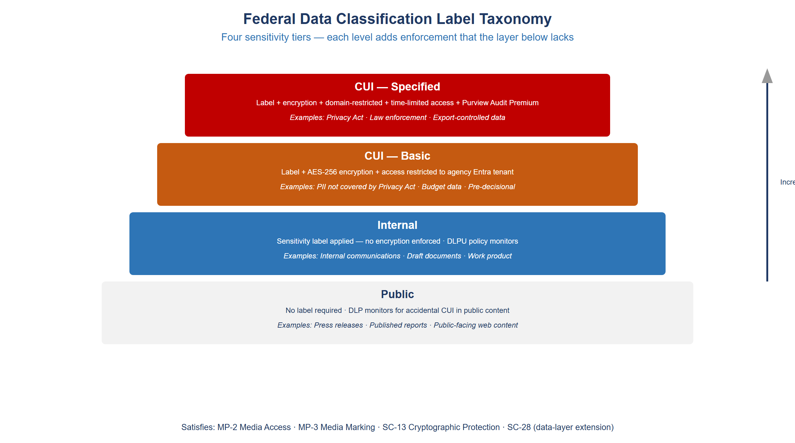
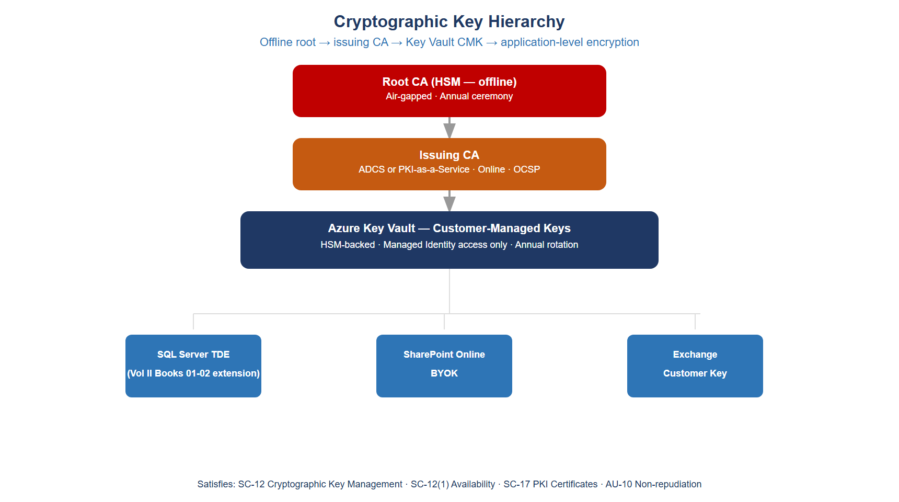

:::: {.content-hidden unless-profile="ssa"}
::: {.fouo-banner}
INTERNAL — NOT FOR PUBLIC DISTRIBUTION
:::
::::

::: {.aan-warning}
## Draft Proposal — Subject to Review

This document is a **draft proposal** developed by the **CSI Team (Cloud Services Infrastructure)**. It is an attempt at a comprehensive -wide technical roadmap and has not been reviewed or approved by the  CIO Office, the Office of Information Security (OIS), or organizational leadership. All recommendations, vendor selections, control mappings, and implementation timelines are subject to revision pending formal review by the  CIO Office and organizational components.

**Date Code:** 2026-07-08 16:07 ET
:::

::: {.aan-important}
**Series Context** — This document is Vol III Book 05 of the Federal Organization Compliance series. The Volume I network-and-identity books and the Volume II database books establish Landing Zone IPAM/DDI/PKI, Network Access Control, Certificates and Tokens, Network Modernization, Telecommunications Modernization, SQL Server Authentication Modernization, SQL Server Implementation, and Database Consolidation and Network Physics. Vol III Book 01 addresses Privileged Access Management. Vol III Book 06 addresses SIEM, XDR, and Detection Engineering. This part addresses the data layer: what the data is, where it is allowed to go, and whether it is cryptographically protected at rest and in transit.
:::

# What This Document Addresses

Volumes I and II of this series, together with the Privileged Access Management and Vulnerability Management books of Volume III, address the pipe and the identity behind the pipe. Network controls determine which paths traffic can take. Authentication controls determine who is asserting an identity and whether that assertion can be cryptographically verified. Conditional Access controls determine whether a verified identity is permitted to reach a given workload at a given moment from a given device. Privileged Access Management controls determine whether an administrative identity is allowed to hold elevated scope and for how long. Security Operations controls determine whether anomalous behavior is detected, correlated, and escalated.

None of those controls answer a different and equally important question: what is the *payload*?

A Cloud Access Security Broker (CASB) operating at the network boundary can see that a file is moving from a managed endpoint to OneDrive. It can see the file's size, the identity of the sender, and the destination tenant. What it cannot determine without additional signal is whether that file contains Controlled Unclassified Information (CUI) — a Privacy Act record, a law enforcement sensitive document, or a personnel file. The network pipe is regulated; the payload is opaque. An assessor who reviews only the network and identity controls will correctly note that data exfiltration cannot be prevented by pipe control alone: a user who is legitimately authenticated, on a managed device, sending a file to a compliant destination can still exfiltrate sensitive data if the data is not identified as sensitive before it moves.

This document closes the payload gap through three coordinated mechanisms: a federal data classification taxonomy enforced via sensitivity labels (information classification and marking); Data Loss Prevention policies that use label-derived signal to enforce movement restrictions at the service, endpoint, and network boundary layers; and cryptographic key management that ensures classified data is protected by keys the agency controls and can rotate or revoke. Together these mechanisms address the data-layer NIST SP 800-53 Rev 5 controls — AC-4, AU-10, the MP family, SC-12, SC-12(1), SC-13, SC-17, and SC-28 — that remain open after the network and identity layers are complete.

::: {.aan-note}
**Enforcement Dimensions** — Network and identity enforcement governs the pipe: who connects, over what path, with what credential, from what device. Data protection governs the payload: what the content is, whether it is marked, whether it is allowed to leave the boundary, and whether it is encrypted under agency-controlled keys. Both dimensions are required for a complete FedRAMP Moderate authorization. Implementing the network and identity layers without the data layer leaves the MP and SC-12 control families unsatisfied.
:::

# The Classification Gap

## What an Assessor Finds Without Purview

A security assessment of a Microsoft 365 environment that has completed network and identity hardening but has not implemented a data classification framework will produce a predictable set of findings. The specific findings vary by agency, but the structural gaps are consistent.

**No data classification scheme.** Documents in SharePoint Online carry no sensitivity labels. There is no programmatic way to determine whether a given file is public, internal, CUI-Basic, or CUI-Specified. The classification decision, where it exists at all, lives in the filename, a metadata field that users populate manually, or the folder structure of the document library. None of these are enforceable or auditable in a machine-readable way.

**Sensitivity labels absent from SharePoint documents.** Without labels, every SharePoint document is treated identically by the Microsoft 365 service layer. SharePoint external sharing settings apply to the entire site or library. There is no mechanism to restrict external sharing for a CUI document while permitting external sharing for a public document stored in the same library. The site administrator's choice of sharing policy is applied uniformly and cannot differentiate by content sensitivity.

**No DLP policy on Teams channels.** Teams messages, file attachments shared in channels, and files opened from the Teams client are outside the enforcement boundary of network-layer controls. An employee pasting a Social Security Number into a Teams message sends it to the Teams service in plaintext; the message is stored in Exchange Online. Without a DLP policy that detects and blocks that pattern, the SSN transits the service undetected.

**Encryption keys managed by individual application owners with no central inventory.** SQL Server TDE keys, certificate private keys, and application secrets are stored in configuration files, local Windows Certificate stores, or individual Azure subscriptions. There is no central key vault. There is no rotation policy. There is no audit trail for key access. An assessor cannot determine whether keys were rotated after the departure of an administrator who had access to them.

**Non-repudiation (AU-10) not satisfied.** Standard Microsoft 365 audit logging captures events — a user accessed a file, a message was sent — but the log records are not signed. Standard audit logs are mutable by a Global Administrator. They do not satisfy AU-10's requirement that the system be able to determine *with certainty* that a given individual took a specific action, because a sufficiently privileged insider could alter the record.

**SharePoint Online permissions grant access to entire sites rather than classified content.** Access control decisions are made at the site or library level. A user with read access to a SharePoint site that contains a mix of public documents and CUI documents has read access to all of them. The permission boundary is the container, not the content.

## Why CASB Alone Is Insufficient

The Cloud Access Security Broker deployed in Vol I Book 06 (Federal Telecommunications Modernization, SASE architecture) provides network-layer visibility into cloud service traffic. It can identify the application, the user, the device compliance status, the destination, and the volume of data. It enforces access policy based on those signals.

What the CASB cannot do, by itself, is classify content. When a file moves from SharePoint to OneDrive, the CASB sees a file transfer. It does not know whether the file is a publicly released press statement or a Privacy Act record. Without a classification label attached to the file, the CASB has no payload signal to act on. It can apply coarse policies — block all downloads of files larger than a threshold, or block all uploads to consumer cloud storage — but it cannot enforce "block external sharing of CUI" because it cannot determine whether a given file is CUI.

Purview sensitivity labels solve this problem. When a label is applied to a file — either manually by the author or automatically by a classifier policy — the label metadata travels with the file as an encrypted property of the Office Open XML container or as a custom property on the PDF. The CASB reads the label and enforces the policy that corresponds to it. This is the integration point: Purview classifies the payload; the CASB enforces based on the classification. The two controls operate on different layers and are not substitutes for each other.

{fig-alt="Pyramid diagram showing four tiers of federal data classification sensitivity labels. Bottom tier is Public with no label and no protection. Second tier is Internal with a label applied but no encryption. Third tier is CUI-Basic with a label, encryption limited to the agency domain, and access control. Top tier is CUI-Specified with a label, encryption, time-limited access tokens, and mandatory audit logging. Arrows on the right side indicate increasing protective controls as sensitivity increases." width="100%"}

# Federal Data Classification Taxonomy

## The Federal CUI Framework

The federal government's data classification framework for unclassified information is governed by Executive Order 13556 and implemented by the National Archives and Records Administration (NARA) through the CUI Registry. NIST SP 800-171 provides the security requirements for protecting CUI in non-federal systems; NIST SP 800-53 Rev 5 provides the equivalent for federal information systems.

The framework defines four operative categories for a civilian agency's unclassified data holdings:

**Public.** Information cleared for unrestricted release. Press releases, published regulations, publicly available program data. No handling restrictions. No marking required.

**Internal.** Information that is not classified but is not intended for public release: internal email threads, draft documents, working papers, administrative communications. No legal marking requirement under the CUI Registry, but agencies may establish internal handling policies that restrict distribution.

**CUI — Basic.** Controlled Unclassified Information subject to the handling requirements of the CUI Registry without additional or alternate handling requirements from the authorizing law, regulation, or policy. The basic standard: mark with the CUI designation, use approved safeguards for protection, and limit access to authorized holders. Examples: pre-decisional budget documents, law enforcement sensitive data not covered by a more specific CUI category, personally identifiable information not covered by Privacy Act.

**CUI — Specified.** CUI where the authorizing law, regulation, or government-wide policy establishes specific handling requirements that differ from the basic standard. The Specified designation requires the agency to cite the specific authority. Key examples in a typical federal environment: Privacy Act records (authority: 5 U.S.C. § 552a); Tax information (authority: 26 U.S.C. § 6103); Law Enforcement Sensitive (authority: agency-specific); Health information protected under HIPAA.

## Mapping to Microsoft Purview Sensitivity Labels

The CUI taxonomy maps to Purview sensitivity labels with the following protective controls at each tier.

| CUI Tier | Purview Label | Encryption | Access Scope | Audit Logging |
|---|---|---|---|---|
| Public | None or "Public" | None | Unrestricted | Standard |
| Internal | "Internal" | None | Agency domain (informational) | Standard |
| CUI-Basic | "CUI-Basic" | Yes — AIP BYOK | Agency domain (enforced) | Standard + label events |
| CUI-Specified | "CUI-Specified — [Category]" | Yes — AIP BYOK | Named authorized holders, time-limited | Purview Audit Premium |

: Sensitivity label mapping to CUI tiers {.striped .hover}

The label hierarchy in the Purview compliance portal must reflect this taxonomy. Labels are organized in a parent-child structure: the parent label represents the tier; child labels represent CUI Specified categories. For example, the "CUI-Specified" parent label has child labels for "Privacy Act," "Law Enforcement Sensitive," and "Tax Information" — each with the protective controls appropriate to its specific authority.

## Creating the Label Taxonomy in the Compliance Portal

The label taxonomy is created and managed through the Microsoft Purview compliance portal (compliance.microsoft.com) or through the Security and Compliance PowerShell module. The following creates the four-tier structure.

```powershell
# Connect to Security & Compliance PowerShell
Connect-IPPSSession -UserPrincipalName admin@

# Create parent label: Public
New-Label `
  -Name "Public" `
  -DisplayName "Public" `
  -Tooltip "Information approved for public release. No handling restrictions." `
  -LabelActions @{
    Type  = "applyContentMarking"
    SubType = "Header"
    Value = "PUBLIC"
  }

# Create parent label: Internal
New-Label `
  -Name "Internal" `
  -DisplayName "Internal" `
  -Tooltip "Internal use only. Not for public release." `
  -LabelActions @{
    Type  = "applyContentMarking"
    SubType = "Header"
    Value = "INTERNAL"
  }

# Create parent label: CUI-Basic
New-Label `
  -Name "CUI-Basic" `
  -DisplayName "CUI // Basic" `
  -Tooltip "Controlled Unclassified Information — Basic. Handle per CUI Registry requirements." `
  -EncryptionEnabled $true `
  -EncryptionProtectionType "Template" `
  -EncryptionDoNotForward $false `
  -EncryptionEncryptOnly $false `
  -EncryptionRightsDefinitions ":VIEW,VIEWRIGHTSDATA,DOCEDIT,EDIT,PRINT,EXTRACT,REPLY,REPLYALL,FORWARD,OBJMODEL"

# Create parent label: CUI-Specified (container only; child labels carry specific authorities)
New-Label `
  -Name "CUI-Specified" `
  -DisplayName "CUI // SP" `
  -Tooltip "Controlled Unclassified Information — Specified. Cite authorizing law or policy." `
  -EncryptionEnabled $true `
  -EncryptionProtectionType "Template" `
  -EncryptionRightsDefinitions ":VIEW,VIEWRIGHTSDATA,DOCEDIT,EDIT,PRINT,REPLYALL,REPLY,FORWARD,OBJMODEL" `
  -EncryptionContentExpiredOnDateInDaysOrNever 365

# Create child label: CUI-Specified / Privacy Act
New-Label `
  -Name "CUI-SP-PrivacyAct" `
  -DisplayName "CUI // SP-PRVCY" `
  -ParentId "CUI-Specified" `
  -Tooltip "Privacy Act records. Authority: 5 U.S.C. 552a." `
  -EncryptionEnabled $true `
  -EncryptionProtectionType "Template" `
  -EncryptionRightsDefinitions ":VIEW,VIEWRIGHTSDATA,DOCEDIT,EDIT,REPLYALL,REPLY,FORWARD,OBJMODEL" `
  -EncryptionContentExpiredOnDateInDaysOrNever 365

# Publish the label policy to all users
New-LabelPolicy `
  -Name "Agency-CUI-LabelPolicy" `
  -Labels @("Public","Internal","CUI-Basic","CUI-Specified","CUI-SP-PrivacyAct") `
  -ExchangeLocation All `
  -SharePointLocation All `
  -OneDriveLocation All `
  -TeamsLocation All
```

::: {.aan-note}
**Label Policy Scope** — Publishing labels to all locations (Exchange, SharePoint, OneDrive, Teams) is required for consistent enforcement. A label published only to Exchange will appear in Outlook but not in the SharePoint label picker, causing inconsistent classification behavior. Publish to all locations from the initial deployment.
:::

# Automatic Labeling

## The Labeling Gap in Manual Classification

Manual labeling places the classification decision on the document author. Authors apply labels correctly when the data is obviously sensitive — a document titled "Privacy Act Record" is likely to be labeled correctly. Authors fail to apply labels consistently when the sensitivity is less obvious: a spreadsheet containing SSNs extracted for a workflow task, a slide deck containing internal budget projections, or a Teams message containing an EIN sent in the context of a routine inquiry.

The result is a label corpus that covers intentionally sensitive documents but misses the routine data handling that constitutes the majority of actual CUI exposure. Automatic labeling addresses this by applying classification based on content inspection, independent of whether the author recognizes the document as sensitive.

## Sensitive Information Types

Purview Sensitive Information Types (SITs) are pattern-matching classifiers that detect specific data patterns in document content. The Microsoft 365 service maintains a library of pre-built SITs that cover common federal data categories.

| SIT Name | Pattern | NIST Control Relevance |
|---|---|---|
| U.S. Social Security Number | XXX-XX-XXXX with confidence | MP-4, MP-5, CUI-SP-PRVCY |
| U.S. Individual Taxpayer Identification Number | 9XX-XX-XXXX with IRS context | SC-28, CUI-SP-TAX |
| U.S. Employer Identification Number | XX-XXXXXXX with EIN keyword | MP-4, SC-13 |
| U.S. Bank Account Number | ABA routing + account pair | MP-5 |
| Drug Enforcement Administration Number | DEA format with drug context | CUI-SP-LES |
| U.S. Passport Number | Format + issuing country | CUI-SP-PRVCY |
| IP address | IPv4 or IPv6 in technical context | Internal |

: Pre-built Sensitive Information Types relevant to federal environments {.striped .hover}

For agency-specific identifiers — employee numbers, case identifiers, benefit claim numbers — a custom SIT is required.

```powershell
# Create a custom SIT for agency employee identifiers (pattern: EMPXXXXXXX)
$customSIT = @{
  Name        = "Agency-EmployeeID"
  Description = "Agency employee identifier in format EMP followed by 9 digits"
  RulePackage = @{
    RulePack = @{
      Version    = "1.0"
      Publisher  = "Agency Cloud Services"
      RulePackId = [System.Guid]::NewGuid().ToString()
      LocalizedStrings = @{
        Resource = @{
          idRef = "Agency-EmployeeID-idRef"
          Name  = "Agency Employee Identifier"
          Description = "Matches EMP followed by exactly 9 digits"
        }
      }
    }
    Rules = @{
      Entity = @{
        id            = [System.Guid]::NewGuid().ToString()
        patternsProximity = 300
        recommendedConfidence = 75
        Pattern = @{
          confidenceLevel = 75
          IdMatch         = @{ idRef = "Regex_AgencyEmployeeID" }
          Match           = @{ idRef = "Keyword_AgencyEmployee" }
        }
      }
      Regex = @{
        id    = "Regex_AgencyEmployeeID"
        value = "\bEMP\d{9}\b"
      }
      Keyword = @{
        id = "Keyword_AgencyEmployee"
        Group = @{
          matchStyle = "word"
          Term       = @("employee","emp id","staff id","agency id")
        }
      }
    }
  }
}

New-DlpSensitiveInformationType `
  -Name "Agency-EmployeeID" `
  -Description "Agency employee identifier (EMP + 9 digits)" `
  -FileData ([System.Text.Encoding]::UTF8.GetBytes((ConvertTo-Json $customSIT)))
```

## Trainable Classifiers

For document categories that do not match a pattern — internal policy documents, law enforcement case notes, budget working papers — Purview trainable classifiers provide ML-based classification. A trainable classifier is trained on a sample of positive and negative examples of a document category and then applied as an auto-labeling condition.

Microsoft provides pre-trained classifiers for categories including: business financial statements, government documents, harassment, and legal affairs. Agency-specific categories require a custom trainable classifier trained on 50–500 sample documents.

::: {.aan-warning}
**Trainable Classifier Training Data** — The sample documents used to train a custom classifier must be representative of the actual document population. If training samples are drawn from a subset of document types (for example, only formally formatted policy documents), the classifier will underperform on informal documents containing the same category of information. Plan for 3–4 weeks of training and validation before deploying a custom classifier to production auto-labeling.
:::

## Auto-Labeling Policies

Auto-labeling policies apply sensitivity labels to existing content (via the SharePoint scanner) and to new content as it is created or sent. There are two categories of auto-labeling policy:

**Service-side auto-labeling** applies labels to content at rest in SharePoint Online and OneDrive via a background scanner. The scanner crawls existing document libraries, identifies content matching the policy conditions, and applies the label. This is how CUI exposure in existing document libraries is addressed retroactively.

**Client-side auto-labeling** applies labels at creation or send time in Office applications and Exchange. In Exchange, the label is applied when the user sends a message that matches the policy conditions. The user sees a notification and can accept or override the suggested label. In Word, Excel, and PowerPoint, the label is suggested in the sensitivity label picker.

```powershell
# Create auto-labeling policy for SharePoint and OneDrive
# Applies CUI-Basic label to documents containing SSN or EIN
New-AutoSensitivityLabelPolicy `
  -Name "AutoLabel-CUI-Basic-SharePoint" `
  -DisplayName "Auto-label CUI-Basic in SharePoint and OneDrive" `
  -ApplySensitivityLabel "CUI-Basic" `
  -SharePointLocation All `
  -OneDriveLocation All `
  -Mode "TestWithoutNotifications"  # Start in simulation mode; switch to Enforce after review

New-AutoSensitivityLabelRule `
  -Policy "AutoLabel-CUI-Basic-SharePoint" `
  -Name "Detect SSN or EIN" `
  -ContentContainsSensitiveInformation @(
    @{ Name = "U.S. Social Security Number (SSN)"; minCount = 1; confidenceLevel = 75 },
    @{ Name = "U.S. Individual Taxpayer Identification Number"; minCount = 1; confidenceLevel = 75 },
    @{ Name = "U.S. Employer Identification Number"; minCount = 1; confidenceLevel = 75 }
  )

# Create auto-labeling policy for Exchange
# Suggests CUI-Specified/Privacy Act on outbound messages containing SSN
New-AutoSensitivityLabelPolicy `
  -Name "AutoLabel-CUI-SP-Exchange" `
  -DisplayName "Auto-label CUI-Specified in Exchange outbound" `
  -ApplySensitivityLabel "CUI-SP-PrivacyAct" `
  -ExchangeLocation All `
  -Mode "TestWithNotifications"  # Notify users before enforcing

New-AutoSensitivityLabelRule `
  -Policy "AutoLabel-CUI-SP-Exchange" `
  -Name "Detect SSN in outbound email" `
  -SentToScope NotInOrganization `
  -ContentContainsSensitiveInformation @(
    @{ Name = "U.S. Social Security Number (SSN)"; minCount = 1; confidenceLevel = 85 }
  )

# Switch policies to enforcement after simulation review
Set-AutoSensitivityLabelPolicy `
  -Identity "AutoLabel-CUI-Basic-SharePoint" `
  -Mode "Enable"
```

::: {.aan-note}
**Simulation Mode First** — Always deploy auto-labeling policies in simulation mode before enabling enforcement. The simulation report shows which documents would be labeled and with what label, without modifying any content. Review the simulation output for false positives before switching to enforcement. A false-positive spike can trigger help desk calls at scale if a labeling policy applies CUI-Specified to routine internal documents.
:::

# DLP Policy Architecture

## Three Enforcement Surfaces

Data Loss Prevention enforcement in a federal Microsoft 365 environment operates across three distinct surfaces. Each surface provides a different type of control at a different point in the data lifecycle.

**Microsoft 365 service-layer DLP** operates within the Microsoft 365 platform — SharePoint Online, OneDrive for Business, Exchange Online, and Teams. Service-layer DLP policies are evaluated server-side when content is created, shared, or sent through the Microsoft 365 service. A policy that blocks external sharing of CUI files is enforced by the SharePoint service before the external sharing invitation is sent. The user receives a policy tip; the share is blocked. This layer provides the broadest coverage because it operates regardless of the endpoint's compliance state.

**Endpoint DLP** operates on Windows workstations via the Defender for Endpoint sensor. It extends enforcement to activities that bypass the service layer: printing a labeled document, copying content to the clipboard, transferring a labeled file to a USB device, or uploading a file to a browser-based application that is not a Microsoft 365 service. Endpoint DLP requires the device to be onboarded to Defender for Endpoint (established in Vol I Book 02 (Network Access Control: 802.1X) and Vol II Book 01 (SQL Server Authentication Modernization) of this series as a device-compliance and Conditional Access requirement).

**Network-layer enforcement via CASB** operates at the network boundary using the label metadata that the Purview service exposes to the CASB through the Microsoft Graph API. When a labeled file moves to a cloud destination, the CASB queries the file's label and enforces the label-specific policy — for example, blocking upload of a CUI-Specified labeled file to a non-approved cloud storage service. This integration closes the gap identified in the classification gap section: the CASB now has payload signal from Purview.

{fig-alt="Three-tier diagram showing DLP enforcement surfaces. The top tier is labeled Microsoft 365 Service Layer and shows icons for SharePoint, OneDrive, Exchange, and Teams with a DLP policy shield icon. The middle tier is labeled Endpoint DLP and shows icons for print, USB drive, clipboard, and browser upload, connected to a Defender for Endpoint sensor icon on a workstation. The bottom tier is labeled Network CASB and shows the network boundary with a CASB appliance reading label metadata from a Purview API call. All three tiers connect with arrows to a central Purview Compliance Portal icon representing unified reporting and policy management." width="100%"}

## Core DLP Policies

The following policies form the minimum DLP baseline for a FedRAMP Moderate environment. Each policy is named with the enforcement surface, the label tier it protects, and the action it takes.

| Policy | Surface | Condition | Action |
|---|---|---|---|
| Block external sharing of CUI | SharePoint, OneDrive | Label = CUI-Basic or CUI-Specified | Block + policy tip + alert |
| Block external send of CUI | Exchange | Label = CUI-Basic AND recipient is external | Block + policy tip |
| Block print of CUI-Specified | Endpoint | Label = CUI-Specified | Block + audit event |
| Block USB transfer of CUI | Endpoint | Label = CUI-Basic or CUI-Specified, device = removable media | Block + audit event |
| Block upload to non-approved cloud storage | Endpoint + CASB | Label any CUI, destination not in approved list | Block + alert |
| Alert on bulk download | SharePoint | Volume > 50 files in 10 minutes, any label | Alert + manager notification |
| Alert on SSN in Teams message | Teams | SIT = SSN, minCount = 1 | Restrict + policy tip + alert |

: Core DLP policy baseline for FedRAMP Moderate {.striped .hover}

```powershell
# Policy 1: Block external sharing of CUI in SharePoint and OneDrive
New-DlpCompliancePolicy `
  -Name "DLP-Block-CUI-ExternalShare" `
  -SharePointLocation All `
  -OneDriveLocation All `
  -Mode Enable

New-DlpComplianceRule `
  -Policy "DLP-Block-CUI-ExternalShare" `
  -Name "Block external share of CUI-Basic or CUI-Specified" `
  -ContentContainsSensitivityLabel @(
    @{ Name = "CUI-Basic" },
    @{ Name = "CUI-Specified" },
    @{ Name = "CUI-SP-PrivacyAct" }
  ) `
  -AccessScope NotInOrganization `
  -BlockAccess $true `
  -NotifyUser Owner `
  -NotifyPolicyTipCustomText "This document is classified CUI and cannot be shared externally. Contact your supervisor or records officer if external sharing is required." `
  -GenerateAlert SiteAdmin `
  -GenerateIncidentReport SiteAdmin `
  -IncidentReportContent @("Title","Severity","MsgURLs","MatchedItem","RulesMatched","Service","MatchedMessages","SenderAddress","RecipientAddress","Subject","AttachmentNames","DocumentAuthor","DocumentLastModifier","SensitiveInfoTypeDetails","Detections")

# Policy 2: Block external send of CUI in Exchange
New-DlpCompliancePolicy `
  -Name "DLP-Block-CUI-ExternalEmail" `
  -ExchangeLocation All `
  -Mode Enable

New-DlpComplianceRule `
  -Policy "DLP-Block-CUI-ExternalEmail" `
  -Name "Block external email with CUI-Basic label" `
  -ContentContainsSensitivityLabel @(
    @{ Name = "CUI-Basic" },
    @{ Name = "CUI-Specified" },
    @{ Name = "CUI-SP-PrivacyAct" }
  ) `
  -SentToScope NotInOrganization `
  -BlockAccess $true `
  -NotifyUser Sender `
  -NotifyPolicyTipCustomText "This message is labeled CUI and cannot be sent to external recipients without authorization. Use an approved encrypted transfer method."

# Policy 3: Teams SSN detection
New-DlpCompliancePolicy `
  -Name "DLP-Alert-SSN-Teams" `
  -TeamsLocation All `
  -Mode Enable

New-DlpComplianceRule `
  -Policy "DLP-Alert-SSN-Teams" `
  -Name "Detect SSN in Teams messages" `
  -ContentContainsSensitiveInformation @(
    @{ Name = "U.S. Social Security Number (SSN)"; minCount = 1; confidenceLevel = 85 }
  ) `
  -NotifyUser Sender `
  -NotifyPolicyTipCustomText "This message appears to contain a Social Security Number. SSNs should not be transmitted through Teams. Use the authorized secure file transfer system." `
  -GenerateAlert SecurityManager `
  -Severity Medium
```

## Endpoint DLP Configuration

Endpoint DLP requires the workstation to be onboarded to Defender for Endpoint. The Endpoint DLP policy is deployed through the Purview compliance portal and enforced by the Defender for Endpoint sensor on the device.

```powershell
# Endpoint DLP: Block print and USB transfer of CUI-Specified
New-DlpCompliancePolicy `
  -Name "DLP-Endpoint-CUI-Specified" `
  -EndpointDlpLocation All `
  -Mode Enable

New-DlpComplianceRule `
  -Policy "DLP-Endpoint-CUI-Specified" `
  -Name "Block print of CUI-Specified" `
  -ContentContainsSensitivityLabel @(
    @{ Name = "CUI-Specified" },
    @{ Name = "CUI-SP-PrivacyAct" }
  ) `
  -EndpointDlpRestrictions @(
    @{ Setting = "Print"; Value = "Block" },
    @{ Setting = "CopyToClipboard"; Value = "AuditOnly" },
    @{ Setting = "CopyToRemovableMedia"; Value = "Block" },
    @{ Setting = "CopyToNetworkShare"; Value = "AuditOnly" },
    @{ Setting = "UploadToCloud"; Value = "Block" }
  ) `
  -NotifyUser Owner `
  -GenerateAlert SecurityManager `
  -Severity High
```

::: {.aan-warning}
**Endpoint DLP and Defender for Endpoint Integration** — Endpoint DLP enforcement depends on the Defender for Endpoint sensor being active and reporting device health to the Purview service. A device that has been excluded from Defender for Endpoint onboarding (for example, a legacy industrial control system or a specialized testing workstation) will not receive Endpoint DLP policy. Audit the Defender for Endpoint onboarding coverage report before deploying Endpoint DLP and resolve onboarding gaps first.
:::

# Azure Key Vault and Cryptographic Key Management

## The Federal Key Management Hierarchy

A federal agency's cryptographic key infrastructure is a hierarchy of trust. Compromise at any level of the hierarchy invalidates the trust established below it. Managing this hierarchy without a central key management system means that the highest-value keys — root CA private keys, data encryption keys, code signing keys — may be protected by controls no more rigorous than a local administrator's password.

The federal key management hierarchy for a GCC (Government Community Cloud) environment has four levels:

**Root CA (offline HSM).** The root certificate authority's private key is stored in a Hardware Security Module (HSM) that is kept offline except during certificate issuance or renewal operations. The root CA is self-signed; its certificate is distributed via Group Policy as a trusted root. The root CA signs the issuing CA certificate and is then returned to offline storage.

**Issuing CA.** The issuing CA operates online and issues end-entity certificates: device certificates for Entra-joined workstations, user certificates for S/MIME signing and encryption, and TLS certificates for internal services. The issuing CA's private key may be stored in a cloud HSM (Azure Key Vault Premium tier) for availability and auditability.

**Customer-Managed Keys (CMK) in Azure Key Vault.** For data-at-rest encryption — SharePoint Online, Exchange Online, SQL Server TDE, Azure Blob Storage — Customer-Managed Keys replace the Microsoft-managed encryption key with a key stored in the agency's Azure Key Vault. The agency controls key lifecycle: creation, rotation, and deletion. Microsoft's encryption service wraps and unwraps the data encryption key using the CMK; the plaintext CMK never leaves the Key Vault HSM.

**Data encryption keys.** Generated fresh for each protected resource (each storage account, each SQL database, each mailbox). These keys are wrapped (encrypted) by the CMK in Key Vault. They are never stored in plaintext anywhere outside the HSM boundary.

{fig-alt="Four-level hierarchy diagram with white background. Top level shows a vault icon labeled Root CA Private Key stored on Offline HSM with a padlock. Second level shows Azure Key Vault Premium HSM icon labeled Issuing CA Private Key with arrows showing the Root CA signed the Issuing CA certificate. Third level branches into two boxes: left is Customer-Managed Key for SQL TDE, right is Customer-Managed Key for SharePoint BYOK and Exchange Customer Key. Fourth level shows data encryption keys wrapped by the CMK at level three, with dotted wrap/unwrap arrows connecting the CMK to each DEK. A Managed Identity icon at the right connects to both Key Vault levels via RBAC access arrows." width="100%"}

## Creating and Configuring Azure Key Vault with HSM

Azure Key Vault Standard tier uses software-protected keys. Azure Key Vault Premium tier uses HSM-protected keys (FIPS 140-3 validated; FIPS 140-2 modules only while they remain on the CMVP Active list, pending the 2026-09-21 Historical transition). For federal CUI environments, the Premium tier with HSM-protected keys is required to satisfy SC-12 and SC-13 at the Moderate impact level.

```powershell
# Connect to Azure
Connect-AzAccount -TenantId "your-tenant-id"
Set-AzContext -SubscriptionId "your-subscription-id"

# Create a resource group for key management (separate from workload RGs)
New-AzResourceGroup `
  -Name "rg-keyvault-prod" `
  -Location "USGov Virginia"  #  Azure Government estate per Vol I Book 01; use commercial regions if the tenant is commercial Azure

# Create Key Vault with HSM-protected keys (Premium SKU)
$kv = New-AzKeyVault `
  -Name "kv-agency-prod-01" `
  -ResourceGroupName "rg-keyvault-prod" `
  -Location "USGov Virginia" `
  -Sku "Premium" `
  -EnableSoftDelete `
  -SoftDeleteRetentionInDays 90 `
  -EnablePurgeProtection `
  -EnableRbacAuthorization  # Use RBAC, not legacy access policies

# Create CMK for SQL Server TDE (HSM-protected)
$cmkSql = Add-AzKeyVaultKey `
  -VaultName "kv-agency-prod-01" `
  -Name "cmk-sql-tde-prod" `
  -Destination HSM `
  -Size 2048 `
  -KeyOps @("wrapKey","unwrapKey")

Write-Host "SQL TDE CMK created. Key URI: $($cmkSql.Key.Kid)"

# Create CMK for SharePoint BYOK
$cmkSpo = Add-AzKeyVaultKey `
  -VaultName "kv-agency-prod-01" `
  -Name "cmk-spo-byok-prod" `
  -Destination HSM `
  -Size 2048 `
  -KeyOps @("wrapKey","unwrapKey")

Write-Host "SharePoint BYOK CMK created. Key URI: $($cmkSpo.Key.Kid)"
```

## Assigning Managed Identity Access to Key Vault

No human identity should have standing access to key material. Access to Key Vault is granted to Managed Identities — the SQL Server Managed Identity, the Arc-enabled server Managed Identity, and the Microsoft 365 Customer Key service principal — using Azure RBAC.

```powershell
# Get the Managed Identity of the SQL Server (Arc-enrolled hybrid server)
$sqlMI = Get-AzUserAssignedIdentity `
  -ResourceGroupName "rg-sql-prod" `
  -Name "mi-sql-server-prod"

# Assign Key Vault Crypto User role to SQL Managed Identity
New-AzRoleAssignment `
  -ObjectId $sqlMI.PrincipalId `
  -RoleDefinitionName "Key Vault Crypto User" `
  -Scope (Get-AzKeyVault -VaultName "kv-agency-prod-01").ResourceId

# Restrict human access: only Key Vault Administrator role for the break-glass account
# All other humans get Key Vault Reader (metadata only, no key operations)
$breakGlassAdmin = "break-glass-admin@"
$breakGlassObjectId = (Get-AzADUser -UserPrincipalName $breakGlassAdmin).Id

New-AzRoleAssignment `
  -ObjectId $breakGlassObjectId `
  -RoleDefinitionName "Key Vault Administrator" `
  -Scope (Get-AzKeyVault -VaultName "kv-agency-prod-01").ResourceId

# Configure Key Vault diagnostic logging to Log Analytics
$law = Get-AzOperationalInsightsWorkspace `
  -ResourceGroupName "rg-security-ops" `
  -Name "law-agency-security"

Set-AzDiagnosticSetting `
  -ResourceId (Get-AzKeyVault -VaultName "kv-agency-prod-01").ResourceId `
  -Name "kv-diag-law" `
  -WorkspaceId $law.ResourceId `
  -Enabled $true `
  -Category @("AuditEvent","AzurePolicyEvaluationDetails") `
  -MetricCategory "AllMetrics"
```

## Configuring SQL Server TDE with Customer-Managed Key

SQL Server Transparent Data Encryption (TDE) was established in Vol II Book 01 and Vol II Book 02 (SQL Server Implementation Guide) of this series. The initial configuration used a service-managed key (Microsoft-managed, stored within the SQL service). Migrating to a Customer-Managed Key places the wrapping key in the agency's Key Vault, satisfying SC-12 and SC-12(1).

```powershell
# Configure Azure SQL Server to use CMK for TDE
# This assumes Azure SQL (PaaS); for Arc SQL Server, use the SQL Server connector

$sqlServer = Get-AzSqlServer `
  -ResourceGroupName "rg-sql-prod" `
  -ServerName "sql-agency-prod"

# Add the Key Vault key as the TDE protector
Add-AzSqlServerKeyVaultKey `
  -ResourceGroupName "rg-sql-prod" `
  -ServerName "sql-agency-prod" `
  -KeyId $cmkSql.Key.Kid

# Set the TDE protector to the CMK
Set-AzSqlServerTransparentDataEncryptionProtector `
  -ResourceGroupName "rg-sql-prod" `
  -ServerName "sql-agency-prod" `
  -Type AzureKeyVault `
  -KeyId $cmkSql.Key.Kid `
  -AutoRotationEnabled $true  # Enables automatic key rotation on new key version

# Verify TDE protector is set correctly
Get-AzSqlServerTransparentDataEncryptionProtector `
  -ResourceGroupName "rg-sql-prod" `
  -ServerName "sql-agency-prod"

# Verify each database's TDE status
Get-AzSqlDatabase `
  -ResourceGroupName "rg-sql-prod" `
  -ServerName "sql-agency-prod" |
  Where-Object { $_.DatabaseName -ne "master" } |
  ForEach-Object {
    Get-AzSqlDatabaseTransparentDataEncryption `
      -ResourceGroupName "rg-sql-prod" `
      -ServerName "sql-agency-prod" `
      -DatabaseName $_.DatabaseName
  }
```

## Key Rotation Policy

SC-12 requires a defined key management policy that includes rotation requirements. This architecture adopts a 12-month cryptoperiod for symmetric encryption keys as an organization-defined policy choice, within the recommended cryptoperiods of NIST SP 800-57 Part 1. Customer-Managed Keys in Key Vault support two rotation mechanisms:

**Automatic rotation.** Key Vault generates a new key version on a configured schedule (minimum: every 12 months). The SQL TDE protector's `AutoRotationEnabled` flag (set above) directs the SQL service to automatically pick up the new key version. This is the preferred mechanism for bulk encryption keys.

**Manual rotation.** For keys tied to specific certificates or manual processes — code signing keys, CA private keys — automatic rotation may not be appropriate. These keys are rotated manually and the rotation is documented as an operational procedure.

```powershell
# Configure automatic key rotation policy in Key Vault
$rotationPolicy = @{
  lifetimeActions = @(
    @{
      action = @{ type = "Rotate" }
      trigger = @{ timeAfterCreate = "P12M" }  # Rotate 12 months after creation
    },
    @{
      action = @{ type = "Notify" }
      trigger = @{ timeBeforeExpiry = "P30D" }  # Notify 30 days before expiry
    }
  )
  attributes = @{
    expiryTime = "P14M"  # Key expires 14 months after creation (2 months after rotation)
  }
}

# Apply rotation policy to the SQL TDE CMK
Set-AzKeyVaultKeyRotationPolicy `
  -VaultName "kv-agency-prod-01" `
  -Name "cmk-sql-tde-prod" `
  -KeyRotationLifetimeAction $rotationPolicy.lifetimeActions `
  -ExpiresIn $rotationPolicy.attributes.expiryTime

# Verify rotation policy
Get-AzKeyVaultKeyRotationPolicy `
  -VaultName "kv-agency-prod-01" `
  -Name "cmk-sql-tde-prod"
```

::: {.aan-important}
**Immediate Rotation on Suspected Compromise** — The rotation policy above handles scheduled rotation. If a key is suspected of compromise — for example, a Key Vault Crypto User Managed Identity is associated with a compromised server — an immediate manual rotation is required. Run `Add-AzKeyVaultKey` to create a new key version, update the TDE protector to the new version, and then file a security incident report documenting the compromise scope and the rotation action taken. Do not delete the compromised key version until all data encrypted under it has been re-encrypted.
:::

# Non-Repudiation and Audit Integrity

## AU-10 and the Signed Audit Record Requirement

NIST SP 800-53 Rev 5 AU-10 states: "Provide irrefutable evidence that an individual (or process acting on behalf of an individual) performed [Assignment: organization-defined actions to be covered by non-repudiation]."

The word "irrefutable" is load-bearing. A standard audit log entry that records "user@ accessed file budget-draft.docx at 14:32:07 UTC" satisfies AU-12 (audit generation) — the event was generated. It does not satisfy AU-10 because the record is mutable. A Global Administrator can alter or delete the standard audit log. An attacker who achieves Global Admin scope can cover their tracks. The record is not irrefutable.

AU-10 is a **High**-baseline control — it is *not* in the NIST SP 800-53B Moderate baseline this series scopes to. An agency whose data or mission warrants it may adopt AU-10 above the Moderate floor; the argument here is conditional on that above-baseline adoption, not a Moderate-baseline mandate. Where an agency does adopt it, Purview Audit Premium is the mechanism that satisfies the irrefutability standard.

Purview Audit (Premium) addresses this gap through two mechanisms: immutable log storage in a location not accessible to tenant administrators, and cryptographic signatures on high-value audit events. The signature binds the event record to a timestamp issued by a trusted timestamping authority; the record cannot be altered without invalidating the signature.

## Enabling Purview Audit Premium

Purview Audit Premium requires an appropriate license (Microsoft 365 E5, E5 Compliance, or F5 Compliance add-on). It must be explicitly enabled for the tenant and configured with a retention policy.

```powershell
# Enable Purview Audit Premium for all users
# (Requires Security Administrator or Global Administrator role)

# First verify current audit status
Get-AdminAuditLogConfig | Select-Object UnifiedAuditLogIngestionEnabled

# Enable unified audit logging if not already enabled
Set-AdminAuditLogConfig -UnifiedAuditLogIngestionEnabled $true

# Set audit log retention to 10 years for privileged user activity
# Requires Purview Audit Premium license assigned to users
New-UnifiedAuditLogRetentionPolicy `
  -Name "10yr-Retention-PrivilegedUsers" `
  -Description "10-year audit log retention for privileged user operations per AU-10" `
  -RetentionDuration TenYears `
  -Priority 1 `
  -RecordTypes @(
    "AzureActiveDirectoryAccountLogon",
    "AzureActiveDirectoryStsLogon",
    "ExchangeAdmin",
    "SharePointFileOperation",
    "SharePointSharingOperation",
    "UnifiedAuditLogIngestion",
    "MicrosoftTeams",
    "InformationProtectionPolicy"
  )

# Set 1-year default retention for all other activity
New-UnifiedAuditLogRetentionPolicy `
  -Name "1yr-Retention-Default" `
  -Description "1-year default audit log retention for standard operations" `
  -RetentionDuration OneYear `
  -Priority 10  # Lower priority = applied when no higher-priority policy matches
```

## High-Value Audit Events Captured by Purview Audit Premium

The following event categories are captured exclusively by Purview Audit Premium (not available in standard Audit) and are relevant to AU-10 satisfaction.

| Event | Description | AU-10 Relevance |
|---|---|---|
| MailItemsAccessed | Records every protocol access to mailbox items, including by sync clients | Proves a specific mailbox item was accessed by a specific user at a specific time |
| SearchQueryInitiatedExchange | Records the exact search query submitted to Exchange | Proves targeted searches for sensitive data |
| SearchQueryInitiatedSharePoint | Records exact SharePoint search queries | Proves targeted content discovery |
| Send | Records outbound email send with message ID | Non-repudiation for email delivery |
| FileDownloaded | Records file downloads from SharePoint with file path and user | Non-repudiation for data exfiltration investigation |
| SensitivityLabelApplied | Records label application events with user, file, and label | Proves classification actions |
| SensitivityLabelUpdated | Records label change events | Detects label downgrade attacks |

: Purview Audit Premium events relevant to AU-10 non-repudiation {.striped .hover}

## Querying Purview Audit Logs

```powershell
# Query audit log for MailItemsAccessed events in the past 7 days
# This event is only available in Purview Audit Premium
$startDate = (Get-Date).AddDays(-7).ToString("yyyy-MM-ddTHH:mm:ssZ")
$endDate   = (Get-Date).ToString("yyyy-MM-ddTHH:mm:ssZ")

Search-UnifiedAuditLog `
  -StartDate $startDate `
  -EndDate $endDate `
  -RecordType ExchangeItemAggregated `
  -Operations "MailItemsAccessed" `
  -ResultSize 1000 |
  Select-Object CreationDate, UserIds, Operations,
    @{ N = "AuditData"; E = { $_.AuditData | ConvertFrom-Json } } |
  Export-Csv -Path "C:\AuditExports\MailItemsAccessed_7d.csv" -NoTypeInformation

# Query for sensitivity label changes (detect label downgrade)
Search-UnifiedAuditLog `
  -StartDate $startDate `
  -EndDate $endDate `
  -RecordType AipDiscover, AipSensitivityLabelAction `
  -Operations "SensitivityLabelUpdated","SensitivityLabelRemoved" `
  -ResultSize 1000 |
  Select-Object CreationDate, UserIds, Operations, AuditData |
  Export-Csv -Path "C:\AuditExports\LabelChanges_7d.csv" -NoTypeInformation
```

::: {.aan-note}
**AU-10 vs AU-12 Distinction** — AU-12 (audit generation) requires the system to generate audit records for defined events. Volumes I and II, together with the Privileged Access Management and Vulnerability Management books of Volume III, satisfy AU-12 through Defender for Endpoint, Azure Monitor, and the Microsoft Sentinel SIEM deployed in Vol III Book 06. AU-10 (non-repudiation) requires that those records be *irrefutable*. Standard audit logs in Log Analytics are mutable by a Global Administrator. Purview Audit Premium's immutable, signed records are required specifically for the AU-10 control. Both controls are needed; they are satisfied by different mechanisms.
:::

# Certificate Practice Statement

## SC-17 Requirements

NIST SP 800-53 Rev 5 SC-17 states: "a. Issue public key certificates under an [Assignment: organization-defined certificate policy] or obtain public key certificates from an approved service provider; and b. Include only approved trust anchors in trust stores or certificate stores managed by the organization."

The key element is the organization-defined certificate policy in part (a). SC-17 is not satisfied merely by having certificates. It requires a *documented policy* governing the certificate lifecycle: how certificates are issued, who may request them, how private keys are protected, how certificates are revoked, and what happens to keys after expiration. This documented policy is called a Certificate Practice Statement (CPS). Part (b) adds a distinct obligation — trust-anchor management — addressed in the "Trust-Anchor Management" subsection below.

Without a CPS, an assessor cannot determine whether the agency's certificate infrastructure provides any assurance beyond "we have a CA." Certificates could be issued to any requestor, private keys could be stored anywhere, revocation might not be checked, and there is no accountability framework. The CPS is the governance artifact that converts a CA deployment into an SC-17-satisfying PKI.

## CPS Structure per RFC 3647

RFC 3647 provides the standard framework for CPS documentation. A federal agency CPS must address the following sections:

**Section 1 — Introduction.** Identifies the document, the CA hierarchy it governs (Root CA name, Issuing CA name), the applicable certificate policies (CP OID values), and the community of relying parties.

**Section 2 — Publication and Repository Responsibilities.** Identifies where the CPS is published, where the CA certificate and CRL/OCSP are published, and the update cycle for each.

**Section 3 — Identification and Authentication.** Defines how subscriber identity is verified before certificate issuance: for device certificates, the device must be Entra-joined with a compliant Hybrid Entra ID join; for user certificates, the requestor must authenticate with MFA against the issuing CA's enrollment service.

**Section 4 — Certificate Life-Cycle Operational Requirements.** Covers: certificate application (how to request); certificate issuance (automated via SCEP/NDES or manual); certificate acceptance (subscriber acknowledgment); key pair and certificate usage (specific key usage bits for each certificate class); certificate renewal (before expiration, with re-authentication); certificate modification; certificate suspension and revocation (conditions triggering revocation, timeline for CRL publication after revocation, OCSP availability SLA); certificate status services (CRL distribution point URL, OCSP URL); and end of subscription.

**Section 5 — Management, Operational, and Physical Controls.** Physical security of the CA, personnel security requirements for CA operators, audit logging of CA operations, records archival, and disaster recovery.

**Section 6 — Technical Security Controls.** Key pair generation (HSM requirement for root and issuing CA private keys), private key protection, key backup (escrow conditions), key archival, key transport, key destruction, cryptographic module engineering controls (FIPS 140-3 validated minimum; FIPS 140-2 modules only while they remain on the CMVP Active list, pending the 2026-09-21 Historical transition), and algorithm and key length requirements (RSA 2048 minimum; SHA-256 minimum).

**Section 7 — Certificate, CRL, and OCSP Profiles.** Defines the exact ASN.1 structure of issued certificates — which extensions are present, critical or non-critical, and what values they carry.

**Section 8 — Compliance Audit and Other Assessments.** Frequency of compliance audits, scope of audits, and who may perform them.

**Section 9 — Other Business and Legal Matters.** Fees, financial responsibility, confidentiality of business information, intellectual property, representations and warranties, disclaimers, limitations of liability, term and termination, individual notices, dispute resolution, and governing law.

## How InfoBlox PKI and Azure Key Vault Satisfy SC-17 Together

The PKI infrastructure established in Vol I Book 01 of this series (InfoBlox DDI/PKI Landing Zone) and the Azure Key Vault established in this part together satisfy SC-17 when governed by a documented CPS.

InfoBlox provides the IPAM and DNS foundation that certificate infrastructure depends on: the CA's CRL Distribution Point must resolve via DNS; the OCSP Responder must have a stable IP address registered in IPAM. Without accurate IPAM and DNS, certificate revocation is not operationally reliable — clients cannot reach the CRL or OCSP endpoint, and revoked certificates may be accepted as valid.

Azure Key Vault provides the HSM-backed private key storage for the issuing CA. The CA software (Active Directory Certificate Services or a third-party CA) is configured to store and use the signing key in Key Vault, never in the CA's local Windows Certificate Store. Key access is governed by Managed Identity RBAC, and all key operations are logged to the Key Vault audit log. This configuration satisfies Section 6 of the CPS (technical security controls) — the private key never exists in unprotected software storage.

The CPS documents both of these dependencies explicitly: Section 2 specifies the DNS names for CRL and OCSP endpoints that are registered in InfoBlox IPAM; Section 6 specifies that CA private keys are stored in Azure Key Vault Premium (HSM tier) and are not exportable.

## Trust-Anchor Management (SC-17 part b)

SC-17 part (b) requires that the organization include *only approved trust anchors* in the trust stores and certificate stores it manages. Issuing a well-governed certificate hierarchy (part a) does not by itself satisfy this: an endpoint that trusts an unapproved or compromised root will accept forged certificates regardless of how carefully the agency's own CA is run. The agency therefore maintains an approved trust-anchor list — the agency Root CA plus any explicitly authorized external roots (for example, the Federal PKI Common Policy root where cross-certification applies) — and distributes it as the authoritative trusted-root set to managed devices via Intune configuration profiles (Windows) and equivalent MDM payloads. Unmanaged additions to the trusted-root store are prevented by device configuration policy, and the approved list is reviewed on the same cycle as the CPS. This trust-store curation is what closes SC-17 part (b); the CPS closes part (a).

```powershell
# Verify CRL Distribution Point is resolvable (operational check for SC-17)
$issuerCert = Get-ChildItem -Path Cert:\LocalMachine\CA |
  Where-Object { $_.Subject -like "*Agency-IssuingCA*" } |
  Select-Object -First 1

# Extract CRL Distribution Point URLs from the issuing CA certificate
$crlOid = "2.5.29.31"  # OID for CRL Distribution Points
$crlExtension = $issuerCert.Extensions | Where-Object { $_.Oid.Value -eq $crlOid }
if ($crlExtension) {
  Write-Host "CRL Distribution Points found in issuing CA certificate"
  # Parse and test each CDP URL
  $asnData = New-Object System.Security.Cryptography.AsnEncodedData `
    -ArgumentList ($crlExtension.Oid, $crlExtension.RawData)
  Write-Host $asnData.Format($true)
} else {
  Write-Warning "No CRL Distribution Point extension found — SC-17 gap"
}

# Test OCSP responder availability
$ocspUrl = "http://ocsp."  # Replace with actual OCSP URL from CPS
try {
  $response = Invoke-WebRequest -Uri $ocspUrl -Method Get -TimeoutSec 10
  Write-Host "OCSP responder reachable: HTTP $($response.StatusCode)"
} catch {
  Write-Warning "OCSP responder not reachable: $($_.Exception.Message) — SC-17 gap"
}
```

# Multi-Cloud Key Management — Keys Live Per-Platform

The Azure Key Vault architecture above is the Microsoft-estate realization of
federal key management (**SC-12, SC-13, SC-28**). On a multi-cloud estate,
cryptographic keys are a **per-platform** resource: each CSP operates its own
FIPS 140-3 validated key-management service, and a key created in one does not
natively protect data in another.

| Platform | Key-management service | Notes |
|---|---|---|
| Microsoft | Azure Key Vault (Premium) / Managed HSM | default for the Azure estate |
| AWS | AWS KMS / CloudHSM | CMK per account/region; FIPS 140-3 validated HSM |
| Oracle OCI | OCI Vault / Dedicated KMS (HSM) | |
| Cross-cloud | External Key Store · BYOK · **HYOK** | agency-retained key custody across a CSP boundary — for the highest-sensitivity CUI |

**Doctrine:** classification and DLP (**Purview**) coordinate across the estate —
the Purview Data Map reaches multi-cloud sources — but **key custody is
platform-native**: the SC-12/SC-13 closure is a per-CSP HSM, unified only at the
governance layer (which keys protect which classified data). Microsoft-preference
holds for the *classification/DLP* plane where Purview genuinely reaches; **key
management is native per-CSP** because no single vault spans clouds. **BYOK/HYOK**
is the pattern when the agency must retain sole key custody across a provider
boundary. **SC-13** is a property of the *validated module* — verify each
service's CMVP FIPS 140-3 certificate, and track the FIPS 140-2 historical-list
transition (no new procurement reliance on 140-2-only modules).

Key inventory, rotation events, and CMK-to-data bindings from every platform emit
the unified evidence-record contract into the Multi-Cloud Evidence Fabric,
feeding CISA CDM and the KSI pipeline.

# NIST Control Closure Table

The following table maps the NIST SP 800-53 Rev 5 controls addressed in this document. The "Without" column describes the residual state after Volumes I and II and the Privileged Access Management and Vulnerability Management books of Volume III are implemented but before this document's controls are applied. The "With" column describes the post-implementation state.

> **Closure Necessity — AC-4 and the MP/SC families at the data layer.** The controls in this table close through data-governance artifacts — sensitivity labels, DLP policy, agency-held keys, and a documented CPS — not through the network substrate. None of the series' three necessity anchors closes them: IPAM/DDI cannot author a classification, SD-WAN cannot sign an audit record, and a TIC 3.0 enforcement point cannot hold a key. The CASB deployed in Vol I Book 06 enforces label-derived policy at the boundary, but only after Purview has supplied the payload signal; the sole substrate dependency in this table is SC-17's revocation endpoints, which must resolve through the authoritative DNS plane of Vol I Book 01. Saying this plainly is what keeps the necessity claims elsewhere in this series falsifiable rather than rhetorical.

{fig-alt="List-style diagram on white background titled Vol III Book 05 — NIST SP 800-53 Control Closure, with the subtitle Data Protection: Microsoft Purview + Azure Key Vault. Eleven orange control chips are stacked vertically — AC-4, AU-10, MP-2, MP-3, MP-4, MP-5, SC-12, SC-12(1), SC-13, SC-17, and SC-28(ext) — each with its control name to the left: Information Flow Enforcement data classification layer; Non-repudiation; Media Access; Media Marking; Media Storage; Media Transport; Cryptographic Key Establishment and Management; Availability; Cryptographic Protection; Public Key Infrastructure Certificates; and Protection of Information at Rest data-layer extension. A summary badge at the bottom reads 11 NIST SP 800-53 Rev 5 controls — Part closes or deepens." width="100%"}

| Control | Title | Without | With | Authority |
|---|---|---|---|---|
| AC-4 | Information Flow Enforcement (data layer) | No label-based enforcement of information flow. The CASB enforces pipe controls but has no payload signal. A labeled CUI document and an unlabeled public document are treated identically by flow controls. | DLP policies enforce label-based flow controls at the service, endpoint, and network boundary layers. The CASB receives label metadata from Purview and enforces destination restrictions based on classification tier. | NIST SP 800-53 Rev 5 AC-4; FedRAMP Moderate AC-4 |
| AU-10 | Non-repudiation | Audit records are generated in the unified audit log but are mutable by a tenant Global Administrator. Standard audit log retention is 90 days. The irrefutability standard of AU-10 is not met. | Purview Audit Premium provides immutable, signed audit records with 10-year retention. MailItemsAccessed and SearchQueryInitiated events provide non-repudiation for high-value data access operations. | NIST SP 800-53 Rev 5 AU-10 (above-baseline / defense-in-depth) |
| MP-2 | Media Access | SharePoint access permissions are applied at site or library level. A user with access to a SharePoint site has access to all content in that site regardless of sensitivity. | Sensitivity labels enforce label-based access control. CUI-Basic and CUI-Specified labels restrict decryption to authorized holders even when the file is moved outside the SharePoint boundary. | NIST SP 800-53 Rev 5 MP-2 |
| MP-3 | Media Marking | Documents carry no machine-readable sensitivity markings. Manual classification is inconsistent and not auditable. | Sensitivity labels applied automatically by classifier policies provide persistent, machine-readable marking. Labels survive file format conversion and movement across platforms. | NIST SP 800-53 Rev 5 MP-3; NARA CUI Marking Handbook |
| MP-4 | Media Storage | No encryption differentiated by content sensitivity. All SharePoint content is encrypted by Microsoft-managed keys at the same tier. | Customer-Managed Keys in Azure Key Vault provide agency-controlled encryption for CUI storage across SharePoint, OneDrive, and SQL Server. | NIST SP 800-53 Rev 5 MP-4 |
| MP-5 | Media Transport | No automated enforcement on external transfer of sensitive data. DLP policies may exist ad hoc but are not based on classification labels. | DLP policies block external sharing and email transfer of labeled CUI. Endpoint DLP blocks USB and print transfer. CASB enforces at the network boundary using label metadata. | NIST SP 800-53 Rev 5 MP-5 |
| SC-12 | Cryptographic Key Establishment and Management | Keys managed by individual application owners without central inventory, rotation schedule, or access audit trail. | Azure Key Vault Premium (HSM tier) provides central key management with RBAC access, automatic rotation policy (12-month cycle), and full Key Vault audit logging. No human has standing access to key material. | NIST SP 800-53 Rev 5 SC-12; NIST SP 800-57 Part 1 |
| SC-12(1) | Availability | No documented key recovery procedure. Loss of a key means loss of data. | Key Vault soft-delete with 90-day retention and purge protection prevents accidental key deletion. Key Vault backup can be restored to a paired region. | NIST SP 800-53 Rev 5 SC-12(1) |
| SC-13 | Cryptographic Protection | TDE enabled with Microsoft-managed keys. SharePoint encryption uses Microsoft-managed keys. No agency visibility into key operations. | SQL TDE protector migrated to CMK in Key Vault. SharePoint BYOK and Exchange Customer Key extend agency-controlled CMK to Microsoft 365 workloads. All key operations are logged. | NIST SP 800-53 Rev 5 SC-13; FIPS 140-3 (validated modules; 140-2 only while CMVP-Active, pending 2026-09-21 Historical transition) |
| SC-17 | PKI Certificates | CA deployed and issuing certificates without a documented Certificate Practice Statement. No defined issuance, revocation, or key protection policy; no curated trusted-root set on managed devices. | Part (a): CPS per RFC 3647 governs the full certificate lifecycle; issuing CA private key stored in Key Vault HSM; CRL and OCSP endpoints registered in InfoBlox IPAM with verified DNS resolution. Part (b): an approved trust-anchor list is distributed to managed devices via Intune configuration profiles, and unmanaged trusted-root additions are blocked by policy. | NIST SP 800-53 Rev 5 SC-17; RFC 3647 |
| SC-28 | Protection of Information at Rest (depth extension) | SQL Server TDE (established in Vol II Book 01) protects database files at rest with Microsoft-managed keys. Label-enforced file encryption for Office documents not enabled. | TDE protector migrated to CMK under agency control. Sensitivity label encryption on CUI-Basic and CUI-Specified documents extends at-rest protection beyond the database boundary to any storage location where the file resides. | NIST SP 800-53 Rev 5 SC-28 |

: NIST SP 800-53 Rev 5 control closure — Vol III Book 05 Data Protection {.striped .hover}

::: {.aan-note}
**Interpretive note on the MP family.** The MP family (MP-2 through MP-5) governs *system media* — removable media, paper, and output. The rows above map sensitivity-label access, marking, and DLP to MP-2/MP-3/MP-4/MP-5 as a *supporting* interpretation for SaaS-resident files; a 3PAO may prefer to see label-based attribute control anchored to **AC-16 (Security and Privacy Attributes)** and **AC-4**, reserving MP claims for where physical or removable media is actually controlled (endpoint USB and print, MP-5/MP-7). Read the MP rows here as supporting evidence for the data-layer intent rather than as the sole closure of the media-handling controls.
:::

---

::: {.aan-note}
## FedRAMP 20x Key Security Indicator Alignment

FedRAMP 20x shifts authorization from document-heavy assessment to continuous, evidence-based Key Security Indicators (KSIs). The controls established in this document contribute to the following KSIs:

**KSI-CNA (Cloud Native Architecture) — data classification and payload-layer protection.** Continuous evidence that sensitive data is classified, labeled, and subject to automated protection controls. Purview auto-labeling policies and DLP enforcement logs provide machine-readable evidence that classification and protection are operating continuously — not a point-in-time assessment finding.

**KSI-SVC (Service Configuration) — cryptographic key management.** Continuous evidence that encryption keys are managed under agency control with defined rotation schedules and access audit trails. Key Vault audit logs, rotation policy compliance reports, and RBAC access reviews provide the continuous evidence stream required by FedRAMP 20x.

**KSI-MLA (Monitoring, Logging, and Auditing) — non-repudiation and audit integrity.** Continuous evidence that high-value audit records are immutable and retained at the required duration. Purview Audit Premium retention policy compliance and the availability of MailItemsAccessed events in the audit log provide this evidence.

**KSI-CNA (Cloud Native Architecture) — payload-boundary enforcement.** The DLP policy architecture extends boundary enforcement to the data payload layer, complementing the network and identity boundary controls established in Volumes I and II and the Privileged Access Management and Vulnerability Management books of Volume III. FedRAMP 20x assessors reviewing the boundary-related KSIs should examine DLP policy reports and CASB enforcement logs alongside the network perimeter controls.

The integration of Purview classification with the CASB deployed in Vol I Book 06 is the critical architectural link: it converts a static network boundary into a content-aware enforcement boundary. This integration is the mechanism by which the data protection controls established in this document satisfy the continuous-monitoring intent of FedRAMP 20x.
:::
